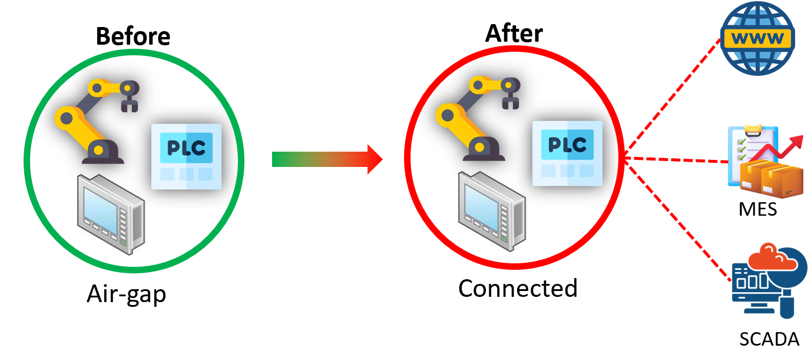
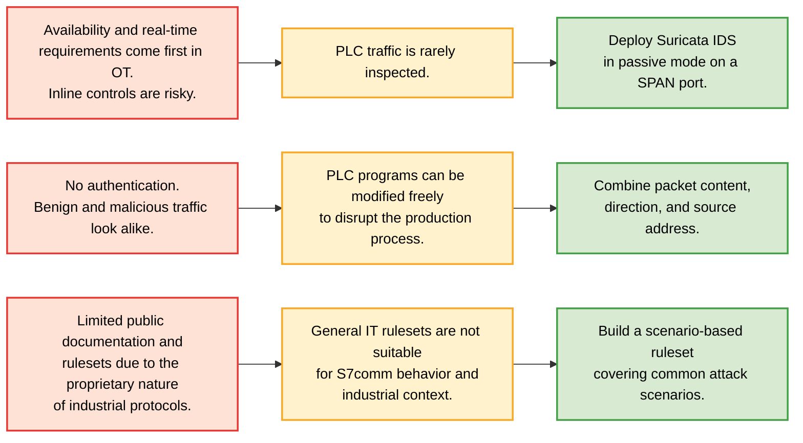
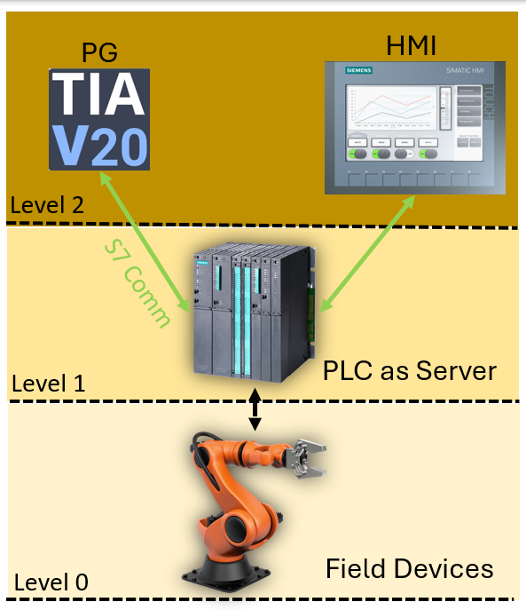
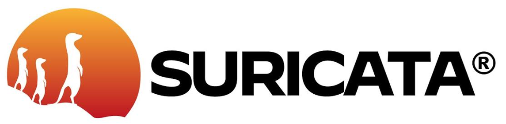
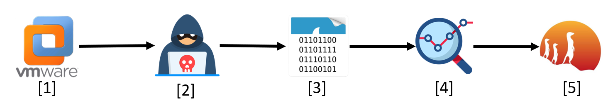
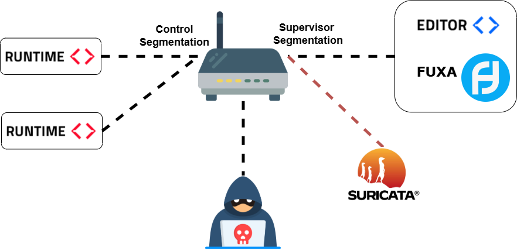

# Research and Detection of Attacks on the Siemens S7Comm Protocol in ICS/OT Networks

> ***"Last dance in HUST...***
>
> *This may be the last work of mine under the lecture halls of Hanoi University of Science and Technology. For the past four years (2022–2026), from the first project commit to GitHub on October 14, 2023 (Optimization Project) till this last one, it was a truly remarkable journey. There were challenges, there were mistakes, there were failures. It was a tough time, enough to make someone give up. But not someone whom HUST taught me to become. After all, the feeling of success and growing up can only come from those things. Sending the greatest thanks from my heart to all my lecturers, my friends, colleagues, and my family for being a part of this unforgettable journey. ❤️*
>
> *Four years of labor that is wrapped in just one graduation project monitoring project. Cannot remember how challenging it was to both do this thesis and do my internship at Vingroup. Really surprised when it still got 8.8 8.8 (the second highest score in the committee ATKGS01), more than I could even expect. Closing the last paper of this chapter to start a new chapter in my life. Even if I know that I have to face these challenges again, if you ask me to choose again, I will still choose UET 🐧."*

# 1. Introduction

## Security risks in OT

Due to the specific requirements of OT environments, ICS protocols are often:

- **Proprietary** to ensure reliable, optimized communication between devices within a manufacturer's ecosystem.
- **Designed without encryption, authentication, or integrity mechanisms** to achieve real-time performance, as these security features require additional processing time.

Initially, strong security was not considered necessary because OT networks in industrial plants were typically isolated from the outside world, making the attack surface for external attackers almost zero. However, as factories have grown in both size and complexity, modern OT networks require greater connectivity to support new operational requirements, such as connections to:

- The **Enterprise IT network** to coordinate production with business activities such as supply chain management, resource planning, and vendor management.
- **MES (Manufacturing Execution System)** for production scheduling and execution management.
- **SCADA (Supervisory Control and Data Acquisition)** for centralized monitoring and control of industrial processes.

This evolution has significantly changed the attack surface of OT environments. As connectivity increases, attackers have more opportunities to reach OT networks. This creates a technical gap because many industrial protocols were designed decades ago with long operational lifespans and were not designed with modern cybersecurity principles in mind.

## Challenges

Some of the main challenges when trying to secure OT networks include:

- An increasing number of cyberattacks, many of which are believed to be nation-state or politically motivated. Some recent well-known attacks are attributed to groups associated with countries such as Russia, China, or North Korea. Even when the attackers are strongly suspected, do not even thinking about step one foot into their territory to investigate on that.

- Factories operate continuously, making it impossible to redesign existing systems from scratch with a "secure by design" philosophy. New security solutions must adapt to the existing factory infrastructure rather than expecting the factory to adapt to the solution. Furthermore, it is not only the effectiveness of the solution that matters, but also the deployment time. Taking too much time to deploy a solution on a production line is not acceptable. Everyone knows that in the CIA triad, A (Availability) is the highest priority in OT environments. However, from my experience, you can not truly understand the heavy of that "A" words till you working on-site. Thousands of people work continuously, 24 hours a day, 7 days a week, 365 days a year, just to ensure that word.

- Applying proactive security approaches to industrial devices, such as active monitoring or installing security agents, is extremely risky. These devices may have been running continuously for years without any issues before you come and reboot them to install a new security agent. No one knows what could go wrong after that reboot. Most of the industrial systems run proprietary vendor software and are built or integrated by multiple contractors from different countries. If a malfunction occurs, there is no guarantee that vendor/contractor support is still available.

Therefore, this thesis aims to build a passive monitoring solution specifically designed for industrial protocols to minimize the impact on factory operations.

From these challenges, it can be systemically categorized into 3 main problems:

# 2. Background Theory

Two main key concepts theory includes **S7comm protocol** and **Suricata IDS**.

## S7comm protocol

**Siemens S7** (or often call **S7 Comm** for short), is a proprietary protocol design by Siemens (Germany) for programming, monitoring and controlling industrial devices within the Siemens eco system. If often used by programming software Tia Portal (running on Engineering Workstation) to communicate with PLC and PLC communicate with HMI. This protocol work in controller and supervisors' layer. S7 not work in field devices layer (where PLC communicate with other field devices like sensors, actuators. This is often done by other protocols like Modbus, OPC UA, etc.)

S7 Comm is used in oder PLC like S7-200, S7-300, S7-400. Is does not include any **authenticatio**, **authorization**, **encryption**, **integrity** mechanisms, everythings are transmitted in plain text.

A details of S7 Comm protocol can be found [here](./docs/Theory_S7.pdf).

## IDS

IDS (Intrusion Detection System): Monitors network traffic and generates alerts for suspicious activities.

Detection methods:
- **Signature-based**: Uses predefined rules or signatures.
  ➜ Stable detection with a low false-positive rate.
- **Anomaly-based**: Detects deviations from normal behavior.
  ➜ Can detect zero-day attacks but has a higher false-positive rate.

This thesis adopts **Suricata IDS**, a signature-based intrusion detection system.

A details of IDS in general can be found [here](./docs/Theory_IDS_1.pdf) and Suricata IDS for specific can be found [here](./docs/Theory_IDS_2.pdf).

# 3. System & Methodology

1. **Deploy simulation**: deploy the simulation environment on VMware 

2. **Building attack modules**: using Snap 7  and tools to build attack scenarios

3. **Traffic collection and analysis**: capture network traffic with Wireshark, analyze S7comm packet structure

4. **Detection rule development**: convert observed indicators into Suricata signatures based on byte offsets, function codes, frequency thresholds, and abnormal syntax.

5. **IDS testing**: run Suricata on traffic copies and compare alerts with each simulated scenario.

## 3.1 Deploy simulation

Deploy the simulation environment on VMware. Here is the network topology:

- PLCs (Simulated via **OpenPLC Runtime v4**) run in Control Segment

- HMI (Simulated via **Fuxa**) run in Supervisors Segment

- Suricata IDS run in Supervisors Segment

- Attackers run in External Segment

*In reality, the IDS will be attacked to the SPAN port of the core switch, but in VMware, just need to place it in the same LAN Segment you want to monitor and turn on the promiscuous mode. This is dual to vSwitch in VMware works underlying as a physical hub rather than a "real" switch.*

## 3.2 Building attack modules

Using **Snap 7** and tools to build attack scenarios:

| Category | Details | Risk | Payload |
|----------|---------|------|------|
| Reconnaissance | Discover PLC devices through Nmap NSE scripts, DCP, enumatate program blocks | Expose PLC assets and support later exploitation | [See here](./src/attacks/reconnaissance/)
| Command injection | Abuse PLC control functions by sending Start/Stop commands| Halt or restart production without authorization| [See here](./src/attacks/start_stop_plc/)
|Denial of Service | Overload PLC communication using TCP SYN flooding and high-rate S7 specific functions | Disrupt monitoring and control communication | [See here](./src/attacks/dos/)
| Program transfer | Unauthorized upload and download of PLC program blocks | Steal or replace PLC control logic | Due to the simulation limitation of OpenPLC, can not generate payload for this attack. Using [this PCAP](./src/attacks/down_up_program/s7comm_downloading_block_db1.pcap) found on Internet instead|
| Process manipulation | Modify process variables using unauthorized WriteVar and spoofed ReadVar operations | Alter process values and mislead operators | Tried to simulate this attack under a well-known, realistic event: [Stuxnet]() attack. Spent most of my time working on this scenario|
| Malformed S7comm packets | Crafts structurally invalid TPKT/COTP/S7 packets | Destabilize PLC communication and cause service interruption |

## 3.3 Traffic collection and analysis

Capture network traffic with Wireshark, analyze S7comm packet structure.

## 3.4 Detection rule development

Convert observed indicators into Suricata signatures based on byte offsets, function codes, frequency thresholds, and abnormal syntax.

## 3.5 IDS testing

Run Suricata on traffic copies and compare alerts with each simulated scenario.