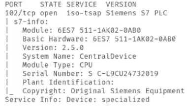
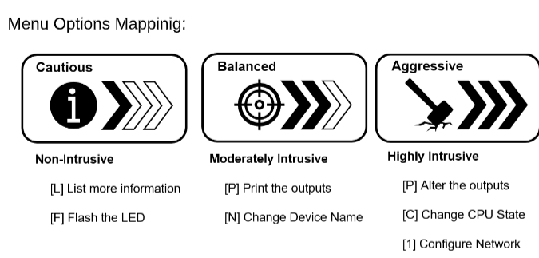

Pending

6 Vụ tấn công vào ICS: https://icsec.pl/en/5-cyber-atakow-na-sieci-ics/, https://hackers-arise.com/scada-hacking-the-most-important-scada-ics-attacks-in-history/


Tác động của 3 loại tấn công vào ICS: https://www.sciencedirect.com/science/article/pii/S2405896324002660?ref=pdf_download&fr=RR-2&rr=9e9e152e18231fc7


Plan

ICS Kill Chain

# Reconnaissance: 

Có 3 cách

## Quét thông qua Nmap cùng NSE Scripts

```bash
find /usr/share/nmpa -name "*s7*.nse" # Should return s7-info.nse, s7-enumerate.nse

nmap -p 102 --script s7-info <IP_ADDRESS>
```



Basic module type
Firmware version

## Quét bằng Metasploit

module auxiliary/scanner/scada/s7_info

Sends a single multicast discovery packet
 Targets local Ethernet networks
 Uses Siemens-specic discovery format
 Extracts:
 MAC and IP addresses
 Station name
 Device role/type
: This module   to the same Ethernet
segment as the targets.
Note requires physical connection
Typical Usage:
use auxiliary/scanner/scada/profinet_siemens
set INTERFACE eth0
run
The scanner listens for replies and parses device conguration details.

## Script

SiemensScan.py is a   for interacting with S7 devices.
It supports both passive and active modes of operation, and is well-suited
for red teaming or audit scenarios.
Python 3-based script
Start the Script:

```bash
sudo python3 SiemensScan.py
```

 Performs local network discovery
 Sends crafted S7Comm packets
 Identies active Siemens devices
 Allows manual IP entry if not on the same subnet



- Flash Device LED: Useful for visually identifying hardware in the eld without
disrupting operations.

- Print Outputs / Internal Flags: Displays internal states; useful for diagnostics.

- Change Device Name: Alters network identity (can cause confusion in engineering tools).

- Alter Outputs / CPU State: Directly manipulates operational behavior. DO NOT use in
production environments
 
- Change IP Address: Immediately disrupts communication, disconnecting the PLC from its network.


## Quét bằng DCP

The very early step that an attacker aims to is discovering the local switched network to get
an overview of targetable PLCs in the network. In purpose to collect data of the available
devices in our system, a function called PNIO Scanner based on the PROFINET DCP
identify-response packets was used by us. Technically, this function sends a DCP identify
request to the initiated interface (eno1 in our case), and waits for the answers from all
found devices (PLCs, IE CPs... etc.). Then it sniffs the responses for a predefined time
interval of 5 seconds and finally saves all results of the sniffing in a python dictionary for
a further use. The output of executing our PNIO scanner function is shown in Fig. 2 and
can be broken down into the following steps:
1. Get local IP, port and subnet
2. Calculate IP addresses of the subnet
3. Set up TCP connection
4. Send DCP identity request
5. Receive DCP response
6. Save responses in a Python response file
7. Stop scanning and disconnect TCP connection


# Attack Simulation

## Password Brute Force

S7-300 thì mật khẩu chì dành cho việc bảo vệ
- upload/download program
- modify block structure

> S7 Block Privacy With the S7 Block Privacy, only FBs and FCs can be protecte


    
