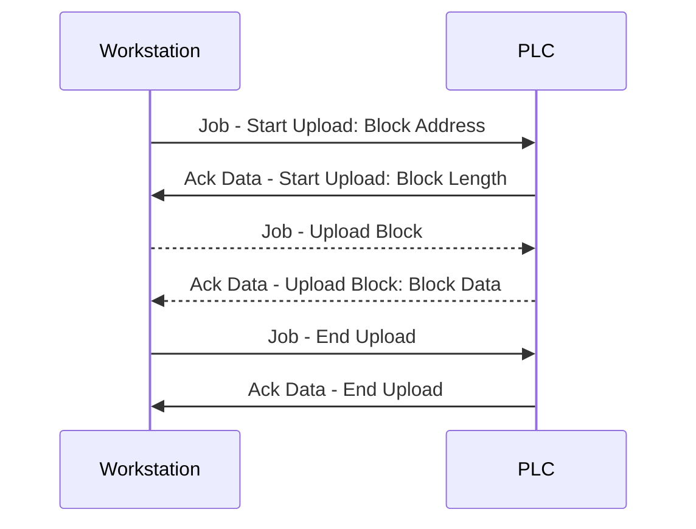
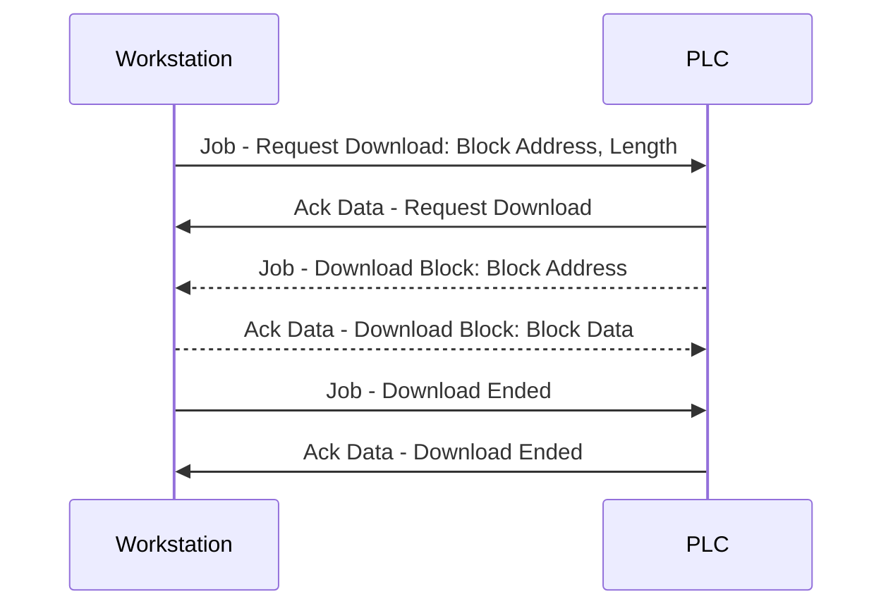
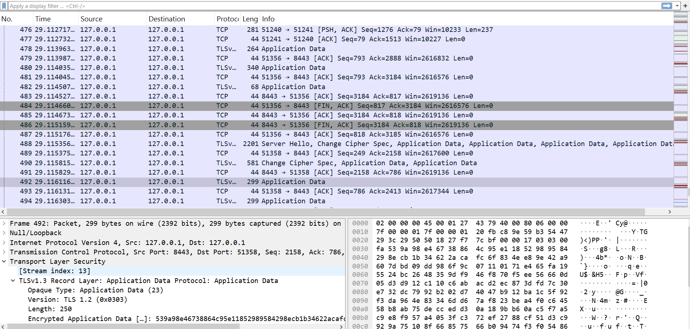
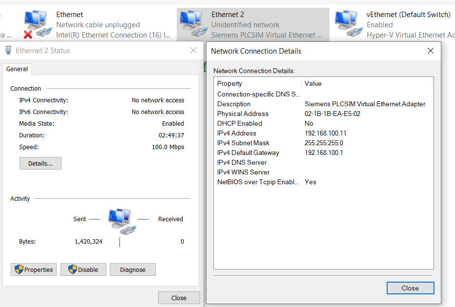
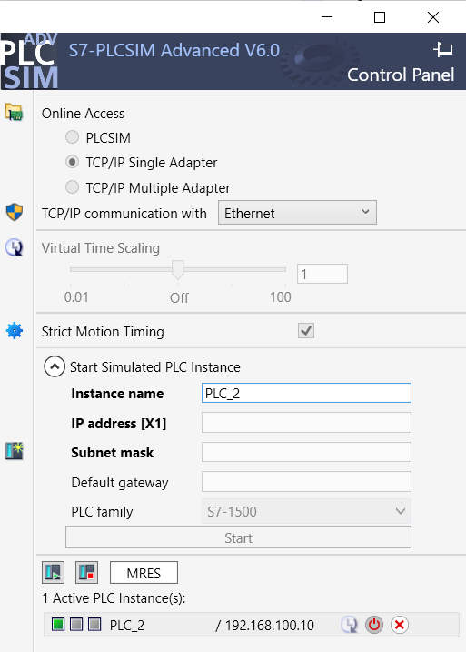
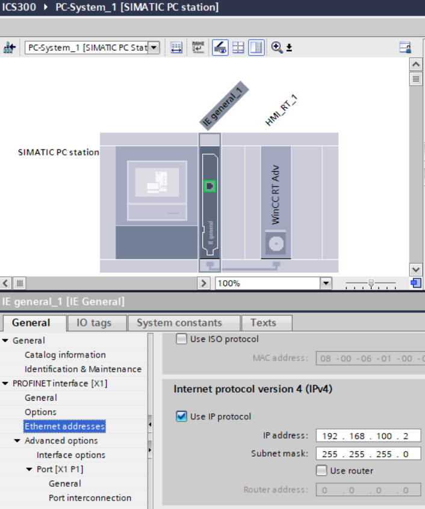
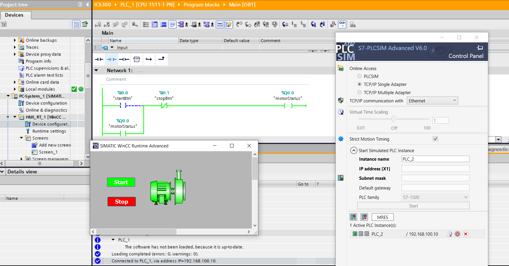
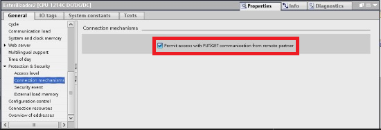
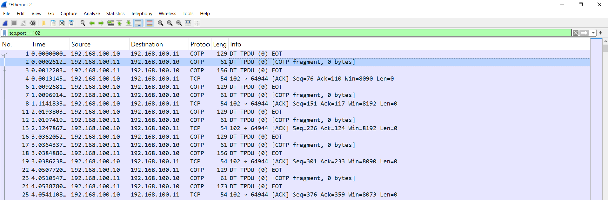

Theo khái niệm của Siemens thì hơi ngược với IT thông thường:

- **Download** là khi máy master/ client gửi chương trình điều khiển xuống salve là PLC. Đây chính là khi bấm nút nạp code trên Tia Portal

- **Upload** là khi máy master/ client lấy chương trình điều khiển từ PLC về.

Mã nguồn của chương trình điều khiển và hầu như các dữ liệu của chương trình điều khiển được lưu dưới dạng các block. Các loại block trong các thiết bị của Siemens bao gồm:

- **OB** (Organization Block): Đây là block chính để tổ chức chương trình điều khiển. Giống hàm `main () {}` trong C++.

- **(S)DB** ( (System) Data Block): Chứa dữ liệu cần dùng bởi chương trình điều khiển. DB là block dữ liệu do người dùng tạo ra, còn SDB là block dữ liệu hệ thống do Siemens tạo ra.

- **(S)FC** ( (System) Function): Chứa các hàm để có thể tái sử dụng trong chương trình điều khiển. FC là **stateless**, tức nó không lưu trạng thái/không có bộ nhớ riêng

- **(S)FB** ( (System) Function Block): Giống FC nhưng là **stateful**. Thường thì nó hay liên kết với một DB để lưu trạng thái của nó.


## Upload



1. **Start Upload**: Máy client gửi lệnh để yêu cầu PLC trả về chương trình điều khiển nó đang chạy (<span style="color: blue;">Job</span > Start Upload) và PLC phản hồi lại yêu cầu đó (<span style="color: green;">ACK</span> Start Upload) . Command này bao gồm các trường theo thứ tự:

    | Trường | <span style="color: blue;">Job</span > Start Upload | <span style="color: green;">ACK</span> Start Upload |
    |--------|----------------------------------|----------------------------------|    
    | `Function Code` (1 byte) | Cố định `0x1d` | Same |
    | `Function Status` (1 byte) | - | - |
    | Không rõ (2 bytes) | `0x0000` | `0x0100`
    | `Session ID` (4 bytes) | - | Định danh cho mỗi phiên upload, được PLC trả về, dùng trong các command sau suốt một phiên Upload |
    | Tên tùy thuộc| `Filename Length` (1 byte) theo sau đó là `Filename` chỉ định tên block cần lấy về |  `Length String Length` (1 byte) theo sau đó là `Length String` là một số decimal cho biết độ dài của block mà PLC sẽ trả về trong phần data của gói tin phản hồi sau đó |

    `Filename` là cách định danh một block như sau:

    ```
    ------------------------------------------------------------------------------------------------------------------
    |  1 char - File identifier  |  2 chars - Block type | 5 chars - Block number | 1 char - Destination file system |
    ------------------------------------------------------------------------------------------------------------------
    ```

    Với:

    - `File identifier` luôn là `_`
    - `Block type` là một trong các loại block đã nêu

        | Hex | Block type |
        |-----|------------|
        | 0x08 | OB |
        | 0x0a | DB |
        | 0x0b | SDB |
        | 0x0c | FC |
        | 0x0d | SFC |
        | 0x0e | FB |
        | 0x0f | SFB |

    - `Block number` là số hiệu của block
    - `Destination file system` bao gồm `A` cho Active file system hoặc `P` cho Passive file system. Block được copy vào active file system sẽ được thực thi ngay khi PLC hoạt động, còn block được copy vào passive file system sẽ cần phải active trước khi được thực thi. 

    Ví dụ `_0800001P` là block OB có số hiệu 1 được copy vào passive file system.

2. **Upload Block**: Sau khi nhận được Start Upload, máy client sẽ gửi lệnh Upload Block để yêu cầu PLC trả về một block dữ liệu của chương trình điều khiển. PLC sẽ trả về block dữ liệu đó trong phần data của gói tin phản hồi. Command này bao gồm các trường theo thứ tự

    | Trường | <span style="color: blue;">Job</span > Upload Block | <span style="color: green;">ACK</span> Upload Block |
    |--------|----------------------------------|----------------------------------|
    | `Function Code` (1 byte) | Cố định `0x1e` | Same |
    | `Function Status` (1 byte) | - | `0x01` nếu còn nhiều block cần upload, `0x00` nếu đã hết block cần upload |
    | Không rõ (2 bytes) | `0x0000` | `0x0000` |
    | `Session ID` (4 bytes) | Dùng sessionID đã có | Same |
    |`Data`| - | Chữa code chương trình điều khiển, bao gồm `Length` (2 bytes) cho biết độ dài của phần data này, cố định `0x00fb`, `Block Data` chứa dữ liệu của block cần upload. Dữ liệu này ở dạng ASCII |

3. **End Upload**: Khi đã nhận đủ dữ liệu theo trường `Length String` của gói tin ACK Start Upload, máy client sẽ gửi lệnh End Upload để kết thúc phiên upload. PLC sẽ phản hồi lại yêu cầu đó để xác nhận đã kết thúc phiên upload thành công. Command này bao gồm các trường theo thứ tự:

    | Trường | <span style="color: blue;">Job</span > End Upload | <span style="color: green;">ACK</span> End Upload |
    |--------|----------------------------------|----------------------------------|
    | `Function Code` (1 byte) | Cố định `0x1f` | Same |

## Download



1. **Start Download**: Máy client gửi lệnh để yêu cầu PLC chuẩn bị nhận chương trình điều khiển mới (<span style="color: blue;">Job</span > Request Download) và PLC phản hồi lại yêu cầu đó (<span style="color: green;">ACK</span> Request Download) . Gói tin <span style="color: blue;">Job</span > Request Download có 2 trường mới là `Block Length` cho biết độ dài của block dữ liệu mà máy client sẽ gửi, `Payload Length` cũng thể nhưng không tính độ dài của block header


2. **Download Block**: PLC chủ động gửi request để yêu cầu máy client gửi block dữ liệu của chương trình điều khiển mới. Máy client sẽ gửi block dữ liệu đó trong phần data của gói tin phản hồi.

Các trường thông tin còn lại y hệt như trong phần Upload. Chỉ có lưu ý trong quá trình Download, `Session ID` luôn là `0x00000000`, nó không được sử dụng, thay vào đó, trong Download thì sử dụng `Filename` để định danh trong một session Download.

# Mô phỏng traffic

Ở phần này đã thử mô phỏng việc download và upload chương trình điều khiển PLC nhưng không thành công do giới hạn phần mềm mô phỏng.

Khi upload code chương trình từ OpenPLC Editor vào OpenPLC Runtime thì chương trình được gửi thông qua RESTful API của OpenPLC Runtime thay vì bằng cách gửi thông qua cấu trúc chuẩn của S7comm.



OpenPLC Runtime không hỗ trợ việc nạp chương tình theo cách thông thường của Siemens S7comm.

Một cách khác là thử mô phỏng việc upload chương trình trên một PLC Siemens thông qua PLC Sim Advance. Cách này thì chương trình được gửi thông qua cấu trúc chuẩn của S7comm. 

Bước 1: Set up một Switch ảo để các thiết bị ảo của Siemens sử dụng:



Bước 2: Chạy một PLC Siemens trong PLC Sim Advance sử dụng cùng giải mạng với Switch ảo. Tuy nhiên PLC Sim Advance chỉ hỗ trợ mô phỏng PLC Simens S7-1500.



Bước 3: Kết nối PLC với HMI WinCC thông qua card kết nối IE general



Bước 4: Tạo một chương trình PLC, nạp vào PLC vào chạy thử:



Ảnh chụp bao gồm chương trình PLC đang ở running mode, PLC đang chạy trong PLC Sim Advance và HMI WinCC đang hiển thị giá trị của các biến PLC.

Tuy nhiên khi quan sát các gói tin trên Wireshark thì thấy Wireshark không Parse được gói tin S7comm. Sau khi tìm hiểu thì là do S7-1500 sử dụng giao thức S7 comm plus và không có cách nào ép S7-1500 sử dụng giao thức S7 comm thông thường (Theo như bài viết này [text](https://industrialmonitordirect.com/blogs/knowledgebase/s7comm-vs-s7comm-plus-switching-protocol-in-s7-1500-hmi-communication) thì bật Option `Permit access with PUT/GET communication from remote partners` chỉ giúp tạo tính tương thích, các máy khác lấy thông tin từ S7 comm plus như thể chúng đang lấy thông tin từ S7 comm thông thường chứ Wireshark thì vẫn không thể Parse được gói tin S7comm plus.





Wireshark chỉ có thể nhận diện được lớp COTP ở bên ngoài gói tin S7comm plus chứ không thể parse sâu hơn gói tin S7comm plus được gói trong gói tin COTP này.


Vì thế nên trong dự án này chúng tôi sẽ sử dụng traffic mô phỏng từ trang sau: https://wiki.wireshark.org/S7comm