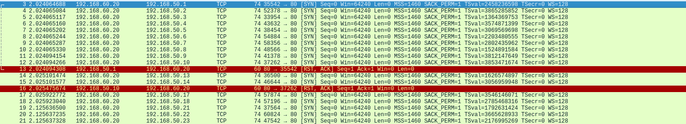
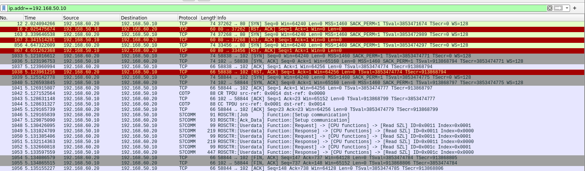
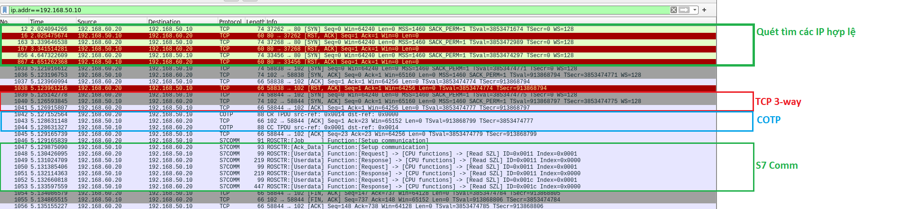
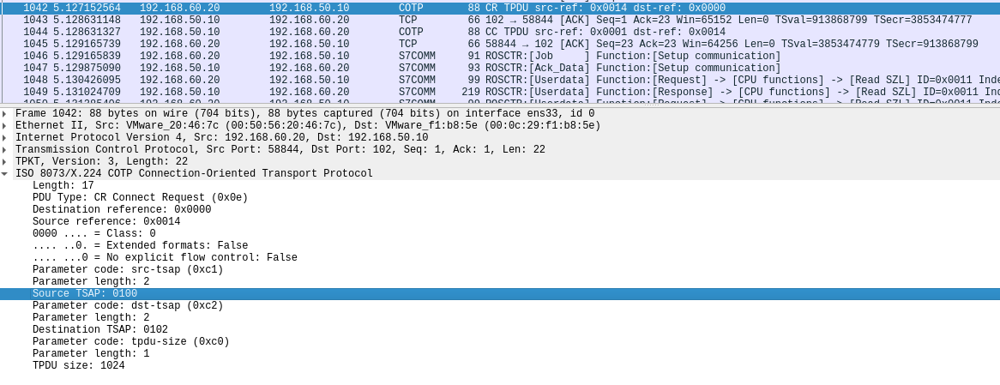
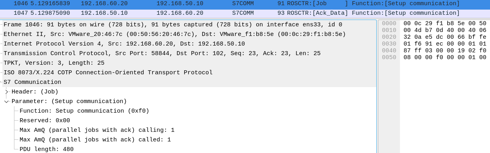
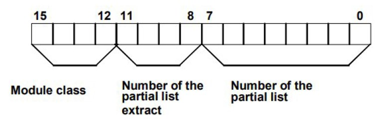
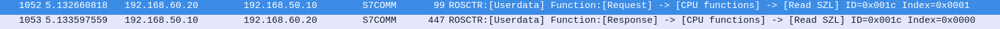
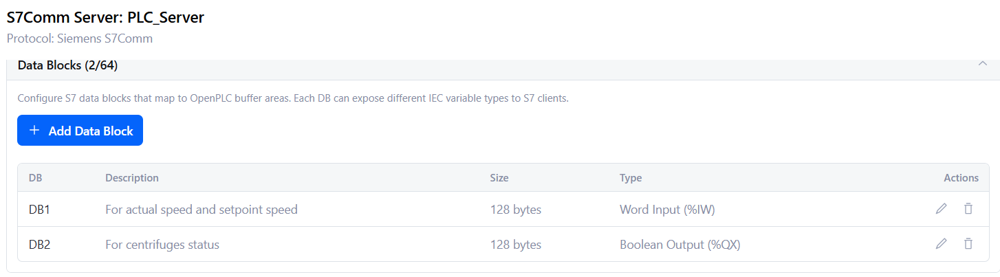
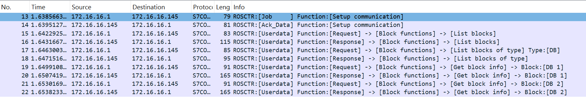

# Quét thông qua Nmap cùng NSE Scripts

```bash
find /usr/share/nmap -name "*s7*.nse" # Should return s7-info.nse, s7-enumerate.nse

nmap -p 102 --script s7-info <IP_ADDRESS>
```
Output:

```
ubuntu@ubuntuserver2204:~$ nmap -p 102 --script s7-info 192.168.50.0/24
Starting Nmap 7.80 ( https://nmap.org ) at 2026-04-21 16:23 UTC
Nmap scan report for 192.168.50.1
Host is up (0.0018s latency).

PORT    STATE  SERVICE
102/tcp closed iso-tsap

Nmap scan report for 192.168.50.10
Host is up (0.0027s latency).

PORT    STATE SERVICE
102/tcp open  iso-tsap
| s7-info:
|   Module: 6ES7 315-2EH14-0AB0
|   Basic Hardware: 6ES7 315-2EH14-0AB0
|   Version: 3.2.6
|   System Name: SNAP7-SERVER
|   Module Type: CPU 315-2 PN/DP
|   Serial Number: S C-C2UR28922012
|_  Copyright: Original Siemens Equipment
Service Info: Device: specialized

Nmap done: 256 IP addresses (2 hosts up) scanned in 3.21 seconds
```

Nmap đã phát hiện tại host `192.168.50.10` là máy ảo đang chạy OpenPLC Runtime với server S7 được bật. Nó nhận diện thiết bị này là Siemens PLC S7-300 series. Quan sát các gói tin thu được trong quá trình quét, nhận thấy quy trình như sau:

1. Ban đầu là **TCP SYN scan để tìm kiếm các thiết bị trong dải mạng**:



Có 2 thiết bị phản hồi gói tin RST mang IP đuôi `.50.1` và `50.10`. Với `50.1` thì khả năng cao là Router gateway của dải mạng này nên có thể suy ra rằng IP `50.10` là IP của PLC 01. Lọc theo địa chỉ IP này

2. **Quét cổng 102** của `.50.10`



Các giai đoạn trong quá trình quét có thể được chia ra như sau:





- Thiết lập kết nối tới TCP 102 bằng Three-way Handshake của TCP 

- Thiết lập COTP

    

    Nguồn gửi ở đây là 01, tức máy trạm

3. **Thiết lập S7comm**

Sau khi thiết lập COTP, client sẽ thiết lập S7comm bằng cách gửi một yêu cầu thiết lập giao tiếp S7 `Setup communication` (đã nêu trong phần lý thuyết) với mã chức năng `0xF0` (gói tin 1046) tới server PLC và nhận được phản hồi ở gói tin 1047. 



Sau quá trình thiết lập S7 Communication, hai bên có thể bắt đầu trao đổi dữ liệu bằng các lệnh của S7, ở đây là dùng lệnh `Read SZL` để đọc thông tin trạng thái của PLC. `Read SZL` là một subfunction trong nhóm chức năng CPU functions của S7comm.

<span style="color: red;"><b>SZL</b></span> hoặc SSL (System Status Lists) là một danh sách ảo miêu tả trạng thái hiện tại của PLC. PLC không lưu sẵn danh sách này mà nó chỉ tạo ra mỗi khi có yêu cầu đọc SZL từ Client. Khi nhận được yêu cầu, PLC sẽ thu thập thông tin trạng thái hiện tại của các thành phần trong PLC, đóng gói chúng vào một cấu trúc dữ liệu theo định dạng SZL và trả về cho Client. Danh sách SZL dài 16 bit như sau, cấu trúc như sau:




Ví dụ với gói tin số 1048:

```
S7 Communication
    Parameter: (Request) ->(CPU functions) ->(Read SZL)
        Parameter head: 0x000112
        Parameter length: 4
        Method (Request/Response): Req (0x11)
        0100 .... = Type: Request (4)
        .... 0100 = Function group: CPU functions (4)
        Subfunction: Read SZL (1)
        Sequence number: 0
    Data (SZL-ID: 0x0011, Index: 0x0001)
        Return code: Success (0xff)
        Transport size: OCTET STRING (0x09)
        Length: 4
        SZL-ID: 0x0011, Diagnostic type: CPU, Number of the partial list extract: All identification data records of a module, Number of the partial list: Module identification
            0000 .... .... .... = Diagnostic type: CPU (0x0)
            0000 0000 0001 0001 = Number of the partial list extract: All identification data records of a module (0x0011)
            .... .... 0001 0001 = Number of the partial list: Module identification (0x11)
        SZL-Index: 0x0001
```

Request này yêu cầu PLC trả về thông tin về trạng thái hệ thống quản lý đối tượng (Object management system status) thông qua chức năng đọc SZL. Yêu cầu đọc tại địa chỉ SZL-ID `0x0011` và Index `0x0001`. Phần này trong SZL sẽ trả về: `Diagnostic type: CPU, Number of the partial list extract`. Cụ thể [[3]]([text](https://inprotech.es/en/s7comm-protocol-security-analyzed/)):


```
Hex: 0x0011 =   0000    0000    00010001
                |       |       |
                |       |       └── Lấy danh sách con nào, ở đây là Module Identification
                |       └── Muốn lấy phần nào trong danh sách con đó, bằng 0 là lấy hết danh sách con đó
                └── Module class: CPU
```

- `Module class`: xác định loại thiết bị muốn đọc

    | Module class | Binary value |
    |---|---|
    |CPU| 0000|
    | IM (Interface module) | 0100|
    | FM (Function module) | 1000|
    | CP (Communication processor) | 1100|

- Một vài loại `Partial list number`:

    | Partial list type | Binary value |
    |---|---|
    | Module Identification | 0001 0001 |
    | CPU Characteristics | 0001 0010 |
    | Module Status | 0001 0011 |
    | Communication Status | 0001 1100 |
    | Connection Status | 0001 1101 |
    | Diagnostic Buffer | 0010 0010 |
    | Diagnostic Status | 0010 0011 |
    | Module list (rack)  (*extended*) | 0001 0001 0001 |
    | Memory info | 0001 0011 0001 |
    | Protection Level | 0010 0011 0010 |

PLC phản hồi lại ở gói tin số 1049:

```
S7 Communication
    
    . . .
    Data (SZL-ID: 0x0011, Index: 0x0000)
        Return code: Success (0xff)
        Transport size: OCTET STRING (0x09)
        Length: 120
        SZL-ID: 0x0011, Diagnostic type: CPU, Number of the partial list extract: All identification data records of a module
        . . .
        SZL-Index: 0x0000
        SZL partial list length in bytes: 28
        SZL partial list count: 4

        SZL data tree (list count no. 1)
            Index: Identification of the module (0x0001)
            MlfB (Order number of the module): 6ES7 315-2EH14-0AB0 
            BGTyp (Module type ID): 0x00c0
            Ausbg (Version of the module or release of the operating system): 4
            Ausbe (Release of the PG description file): 1

        SZL data tree (list count no. 2)
            Index: Identification of the basic hardware (0x0006)
            MlfB (Order number of the module): 6ES7 315-2EH14-0AB0 
            BGTyp (Module type ID): 0x00c0
            Ausbg (Version of the module or release of the operating system): 4
            Ausbe (Release of the PG description file): 1

        SZL data tree (list count no. 3)
            Index: Identification of the basic firmware (0x0007)
            MlfB (Order number of the module):                     
            BGTyp (Module type ID): 0x00c0
            Ausbg (Version of the module or release of the operating system): 22019
            Ausbe (Release of the PG description file): 518

        SZL data tree (list count no. 4)
            Index: Identification of the firmware-extension (0x0081)
            MlfB (Order number of the module): Boot Loader         
            BGTyp (Module type ID): 0x0000
            Ausbg (Version of the module or release of the operating system): 16672
            Ausbe (Release of the PG description file): 2313
```

Gói tin này đã trả về được giá trị của trường <span style="color: red;"><b>Module: 6ES7 315-2EH14-0AB0</b></span> mà ta đã thấy trong output của Nmap.

Tiếp tục là yêu cầu đọc lại SZL-ID `0x001c`, tức đọc danh sách con `Communication Status` của module class `CPU`.



```
S7 Communication
    . . .
    Data (SZL-ID: 0x001c, Index: 0x0000)

        SZL-Index: 0x0000
        SZL partial list length in bytes: 34
        SZL partial list count: 10

        SZL data tree (list count no. 1)
            Index: Name of the automation system (0x0001)
            Name (Name of the PLC): SNAP7-SERVER
            Reserved: 0000000000000000

        SZL data tree (list count no. 2)
            Index: Name of the module (0x0002)
            Name (Name of the module): CPU 315-2 PN/DP
            Reserved: 0000000000000000

        SZL data tree (list count no. 3)
            Index: Plant designation of the module (0x0003)
            Tag (Plant identification of the module): 

        SZL data tree (list count no. 4)
            Index: Copyright entry (0x0004)
            Copyright: Original Siemens Equipment
            Reserved: 000000000000

        SZL data tree (list count no. 5)
            Index: Serial number of the module (0x0005)
            Serialn (Serialnumber of the module): S C-C2UR28922012
            Reserved: 0000000000000000

        SZL data tree (list count no. 6)
            Index: Module type name (0x0007)
            Cputypname (Module type name): CPU 315-2 PN/DP
        
        SZL data tree (list count no. 7)
            Index: Serial number of the memory card (0x0008)
            Sn_mc/mmc (Serial number of the Memory Card/Micro Memory Card): MMC 267FF11F
        
        SZL data tree (list count no. 8)
            Index: Manufacturer and profile of a CPU module (0x0009)
            Manufacturer_id: 0x002a
            Profile_id: 0xf600
            Profile_spec_typ: 0x0001
            Reserved: 0000000000000000000000000000000000000000000000000000
        
        SZL data tree (list count no. 9)
            Index: OEM ID of a module (0x000a)
            Oem_copyright_string (OEM Copyright ID): 
            Oem_id (OEM ID): 0x0000
            Oem_add_id (OEM additional ID): 0x00000000
        
        SZL data tree (list count no. 10)
            Index: Location ID of a module (0x000b)
            Loc_id (Location designation): 
```

Gói tin đã trả về các thông tin để hiển thị trên các trường <span style="color: red;"><b>Serial Number: S C-C2UR28922012</b></span>, <span style="color: red;"><b>Version: 3.2.6</b></span>, <span style="color: red;"><b>System Name: SNAP7-SERVER</b></span>, <span style="color: red;"><b>Module Type: CPU 315-2 PN/DP</b></span>, <span style="color: red;"><b>Copyright: Original Siemens Equipment</b></span> trong output của Nmap.


# Quét bằng các công cụ khác dựa trên DCP

**DCP (Discovery and Basic Configuration Protocol)** là một giao thức nằm trong bộ tiêu chuẩn PROFINET. Nó được sử dụng để khám phá và cấu hình các thiết bị trong mạng PROFINET. Đây là giao thức chủ yếu được sử dụng để kết nối tới các PLC chạy trên PROFINET **trước khi chúng có thể được cấu hình IP**, do DCP là một giao thức hoạt động ở Layer 2 Data Link (Giống ARP trong TCP/IP). Một DCP identify request sẽ được gửi đi để khám phá các thiết bị trong mạng và đợi phản hồi từ các thiết bị đó.

DCP có thể làm 3 việc chính:
1. **Discovery**: Scan tất cả các thiết bị đang kết nối trong cùng một mạng LAN.

2. **Basic Configuration**: Gán địa chỉ IP, Subnet Mask, Gateway, NameOfStation cho thiết bị.

3. **Identification**: Yêu cầu một thiết bị cụ thể nháy đèn LED để có thể xác định đúng vị trí vật lý của nó trong tủ điện.

Có một vài cách để quét các thiết bị PLC thông qua DCP:

- Mở TIA Portal rồi bấm quét tìm PLC
- Sử dụng module auxiliary/scanner/scada/profinet_siemens trong Metasploit
- Sử dụng script [`SiemensScan.py`](./SiemensScan.py)

Tuy nhiên đã thử trong dự án này để quét OpenPLC nhưng không phát hiện được PLC. Có thể là do OpenPLC Runtime không hỗ trợ DCP.

# Quét các block trên PLC

Sau khi quét thông tin PLC, ta có thể quét các block trên PLC để lấy thông tin về các block chương trình điều khiển sử dụng Snap 7 `.list_blocks()` và `.list_blocks_of_type(type)`. Script tại [đây](./scanBlock.py).

```
All blocks: <block list count OB: 0 FB: 0 FC: 0 SFB: 0 SFC: 0x0 DB: 2 SDB: 0>
```

```
DB 1:
    Block type: 10
    Block number: 1
    Block language: 5
    Block flags: 1
    MC7Size: 128
    Load memory size: 220        
    Local data: 0
    SBB Length: 20
    Checksum: 0
    Version: 1
    Code date: b'1999/11/18'
    Interface date: b'1999/11/18'
    Author: b''
    Family: b''
    Header: b''

DB 2:
    Block type: 10
    Block number: 2
    Block language: 5
    Block flags: 1
    MC7Size: 128
    Load memory size: 220
    Local data: 0
    SBB Length: 20
    Checksum: 0
    Version: 1
    Code date: b'1999/11/18'
    Interface date: b'1999/11/18'
    Author: b''
    Family: b''
    Header: b''
```

Trong PLC sẽ bao gồm các block:

- **OB** (Organization Block): Đây là block chính để tổ chức chương trình điều khiển. Giống hàm `main () {}` trong C++.

- **(S)DB** ( (System) Data Block): Chứa dữ liệu cần dùng bởi chương trình điều khiển. DB là block dữ liệu do người dùng tạo ra, còn SDB là block dữ liệu hệ thống do Siemens tạo ra.

- **(S)FC** ( (System) Function): Chứa các hàm để có thể tái sử dụng trong chương trình điều khiển. FC là **stateless**, tức nó không lưu trạng thái/không có bộ nhớ riêng

- **(S)FB** ( (System) Function Block): Giống FC nhưng là **stateful**. Thường thì nó hay liên kết với một DB để lưu trạng thái của nó.

Tuy nhiên do giới hạn mô phỏng của OpenPLC Runtime mà nó chỉ hiện thị được block DB `DB: 2` mặc dù hiện tại PLC đang chạy chương trình điều khiển (Khi này OB của chương trình sẽ khác 0)



Với mỗi datablock, thu được các thông tin như:


```
DB 1:
    Block type: 10                   -> 10(decimal) = 0x0A(hex) = OB(block type)
    Block number: 1                  -> Số thứ tự của block trong PLC (0x0001)
    Block language: 5                -> Ngôn ngữ lập trình của block (AWL, KOP, FUP, SCL, DB, GRAPH) (0x05)
    Block flags: 1                
    MC7Size: 128                     -> Độ lớn vùng dữ liệu có thể đọc/ghi
    Load memory size: 220            -> Vùng dữ liệu có thể đọc/ghi + header/metadata 
    Local data: 0                    -> Dữ liệu stack. DB không có stack như block logic lên bằng 0
    SBB Length: 20                   
    Checksum: 0                      -> Checksum của block (0x00)
    Version: 1                       
    Code date: b'1999/11/18'         -> Ngày tạo block (b'1999/11/18'). Lỗi trên mô phỏng PLC ảo
    Interface date: b'1999/11/18'    -> Ngày cập nhật block (b'1999/11/18'). Lỗi trên mô phỏng PLC ảo
    Author: b''                    
    Family: b''                      
    Header: b''                     
```

*Xem các thông số trong [S7_constants.txt](../../docs/Report/S7_constants.txt).*

Quan sát các gói tin trong quá trình quét block:



1. Gói số 13, 14 khởi tạo kết nối S7 command

2. Gói số 15, 16 là yêu cầu đọc danh sách tất cả các block

```
S7 Communication
    Header: (Userdata)
        Protocol Id: 0x32
        ROSCTR: Userdata (7)
        Redundancy Identification (Reserved): 0x0000
        Protocol Data Unit Reference: 256
        Parameter length: 8
        Data length: 4
    Parameter: (Request) ->(Block functions) ->(List blocks)
        Function: CPU services (0x00)
        Item count: 1
        Variable specification: 0x12
        Length of following address specification: 4
        Syntax Id: ParameterShort (0x11)
        01.. .... = Type: Request (1)
        ..00 0011 = Function group: Block functions (3)
        Subfunction: List blocks (1)
        Sequence number: 0
    Data
        Return code: Object does not exist (0x0a)
        Transport size: NULL (0x00)
        Length: 0
```

Đây là request thuộc nhóm `CPU services` > `Block functions` > `List blocks`. Kết quả sẽ trả về các block trong PLC:

```
S7 Communication
    Header: (Userdata)
        Protocol Id: 0x32
        ROSCTR: Userdata (7)
    . . .
    Parameter: (Response) ->(Block functions) ->(List blocks)
        Function: CPU services (0x00)
        Item count: 1
        Variable specification: 0x12
        Length of following address specification: 8
        Syntax Id: ParameterExtended (0x12)
        10.. .... = Type: Response (2)
        ..00 0011 = Function group: Block functions (3)
        Subfunction: List blocks (1)
    . . .
    Data
        Return code: Success (0xff)
        Transport size: OCTET STRING (0x09)
        Length: 28
        Item [1]: (Block type OB)
            Block type: 08 (OB)
            Block count: 0
        Item [2]: (Block type FB)
            Block type: 0E (FB)
            Block count: 0
        Item [3]: (Block type FC)
            Block type: 0C (FC)
            Block count: 0
        Item [4]: (Block type DB)
            Block type: 0A (DB)
            Block count: 2
        Item [5]: (Block type SDB)
            Block type: 0B (SDB)
            Block count: 0
        Item [6]: (Block type SFC)
            Block type: 0D (SFC)
            Block count: 0
        Item [7]: (Block type SFB)
            Block type: 0F (SFB)
            Block count: 0
```

3. Gói số 17, 18 tiếp tục yêu cầu đọc thông tin về các block khả dụng, ở đây là block DB `DB: 2`.

4. Gói tin số 19, 20 đọc thông tin về DB1:

```
S7 Communication
   ....
    Data [DB 1]
        Return code: Success (0xff)
        Transport size: OCTET STRING (0x09)
        Length: 8
        Block type: 0A (DB)
        Block number: 00001
        Filesystem: A (Active embedded module)
```

Response:

```
S7 Communication
    . . .
    Data: (Block:[DB 1])
        Return code: Success (0xff)
        Transport size: OCTET STRING (0x09)
        Length: 78
        Block type: \x01 (Unknown Block type: 0x0100)
        Length of Info: 74
        Unknown blockinfo 2: 0x2200
        Constant 3: pp
        Unknown byte(s) blockinfo: 01
        0000 0001 = Block flags: 0x01, Linked
        Block language: DB (5)
        Subblk type: DB (10)
        Block number: 1
        Length load memory: 220
        Block Security: None (0)
        Code timestamp: Nov 18, 1999 00:00:00.000
        Interface timestamp: Nov 18, 1999 00:00:00.000
        SSB length: 20
        ADD length: 0
        Localdata length: 0
        MC7 code length: 128
        Author: 
        Family: 
        Name (Header): 
        Version (Header): 0.1
        Unknown byte(s) blockinfo: 00
        Block checksum: 0x0000
        Reserved 1: 0x00000000
        Reserved 2: 0x00000000
```

Giống với các thông tin đã thu được từ script `scanBlock.py`.
