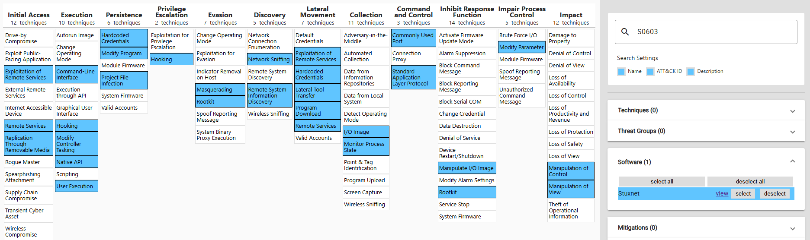

# Chiến dịch tấn công mã độc Stuxnet
Trong bối cảnh căng thẳng địa chính trị ở Trung Đông, bất chấp thỏa thuận với cơ quan nguyên tử quốc tế (IAEA) về việc giám sát các hoạt động hạt nhân của Iran, chương trình hạt nhân tại nước này không ngừng được đẩy mạnh gây nên mối đe dọa lớn về an ninh với các nước trung khu vực. 

Dưới thời tổng thống George W. Bush, sau nhiều nỗ lực ngoại giao thất bại, Hoa Kỳ ( đứng đầu bởi Cơ quan NSA) và Israel bắt đầu một chiến dịch tấn công mạng có tên là **Operation Olympic Games** nhằm phá hoại chương trình hạt nhân của Iran. Mục tiêu là làm hư hại các máy ly tâm khí (**gas centrifuges**) được sử dụng để làm giàu Uranium tại nhà máy hạt nhân Natanz ở Iran, từ đó làm chậm lại chương trình hạt nhân của nước này. Chương trình được cho là đã phát triển một loại mã độc có tên là **Stuxnet** từ 2004-2008, tiêu tốn 2 tỷ đô la mỹ cùng các chiến dịch tình báo, xâm nhập phức tạp để đưa được mã độc vào hệ thống mạng nội bộ được cách ly air-gapped hoàn toàn của nhà máy hạt nhân Natanz.


Quá trình tấn công:
 as as  a a

1. **Lây nhiễm trong windows**: Được lây nhiễm vào một máy tính trong mạng nội bộ thông qua USB do một gián điệp để lại. Sau đó, nó lan tiếp trong mạng nội bộ thông qua 4 lỗ hổng Zero-day  của Windows và gửi thông tin về các máy chủ Command and Control (C&C) của kẻ tấn công [[1]](../Research%20papers/Stuxnet%20in%20details.pptx.pdf)


2. **Lây nhiễm vào phần mềm Siemens Step 7**: Tại mỗi máy tính windows, nó quét để truy tìm phần mềm **Siemens Step 7**. Nó can thiệp vào thư viện giao tiếp `s7otbxdx.dll` của Step7 để chặn và sửa luồng trao đổi giữa phần mềm Step 7 và PLC:


    <div style="display: flex; gap: 20px; align-items: flex-start;">
        <div style="text-align: center;">
            <b>Normal communications between Step 7 and a Siemens PLC</b><br>
            
        </div>
        <div style="text-align: center;">
            <b>Stuxnet hijacking communication between Step 7 software and a Siemens PLC</b><br>
            
        </div>
    </div>

    Về bản chất, đây là một kiểu man-in-the-middle ở tầng phần mềm

3. **Can thiệp vào quá trình điều khiển máy ly tâm khí**: Stuxnet can thiệp vào quá trình điều khiển máy ly tâm khí bằng cách sửa đổi code trong PLC để tăng tốc độ vòng quay của máy ly tâm lên mức cao hơn bình thường. Cụ thể, Stuxnet can thiệp vào Step7 để gửi code độc hại nhằm tăng tốc độ vòng quay đến PLC -> PLC thực thi code, gửi tín hiệu điều khiển đến thiết bị biến tần (VFD Variable Frequency Drive) -> biến tần điều chỉnh tốc độ vòng quay của máy ly tâm -> làm hỏng máy ly tâm. 

    

    Đồng thời, Stuxnet cũng can thiệp vào đầu ra của PLC để gửi phần mềm HMI WinCC đọc dữ liệu sai lệch về tình trạng của máy ly tâm, khiến các kỹ sư không nhận ra rằng máy ly tâm đang bị hư hại.


Tuy nhiên điều tinh vi ở đây là Stuxnet chọn lọc các mục tiêu rất kỳ càng. Nếu mục tiêu không thỏa mãn yêu cầu, Stuxnet sẽ ngủ đông để giảm thiểu sự hiện diện của mình. Nó chỉ tấn công vào các PLC điều khiển biến tần có thông số:

- Thuộc dòng Siemens S7-300

- Nhà sản xuất biến tần là Vacon (Finland)hoặc Fararo Paya (Iran)

- Tần số vận hành nằm trong khoảng **807** Hz đến **1210** Hz. Do đây là tốc độ quay lớn hơn nhiều so với tốc độ của hầu hết các máy công nghiệp, trừ máy ly tâm khí. 

Khi đủ điều kiện, Stuxnet thay đổi tần số đầu ra trong các giai đoạn ngắn để làm rối loạn hoạt động của hệ thống, với các mức thường được nhắc đến là 1410 Hz, 2 Hz và 1064 Hz. Với cách này, nó làm thay đổi tốc độ quay của máy ly tâm và có thể gây hư hại vật lý, trong khi dữ liệu giám sát vẫn bị che giấu.

Sự tồn tại của Stuxnet chỉ được phát hiện rộng rãi vào năm 2010, khi phiên bản thứ 3 của nó  đã lan rộng ra toàn thế giới. Một công ty an ninh mạng Belarus phát hiện ra nó trên một máy tính ở Iran. Sau đó, các nhà nghiên cứu bảo mật đã phân tích và xác định rằng Stuxnet là một phần của một chiến dịch tấn công mạng tinh vi nhằm vào chương trình hạt nhân của Iran.

> [!NOTE]
> Trong mô phỏng tấn công của đồ án này, để phù hợp với giới hạn về thời gian và nguồn lực, chúng tôi sẽ mô phỏng đơn giản hóa kịch bản tấn công man-in-the-middle ở trên tầng giao thức mạng thay vì tại dll như thực tế Stuxnet đã làm.

*Tia Portal là một bộ phần mềm độc quyền của Siemens để làm việc với các dòng PLC của hãng (S7-300, S7-400, S7-1200, S7-1500), bao gồm: STEP 7 dùng để lập trình và cấu hình cho các dòng PLC, WinCC dùng để thiết kế HMI/SCADA, S7- PLCSIM / S7 PLCSIM Advanced dùng để mô phỏng hoạt động của PLC trên máy tính mà không cần phần cứng thực tế, Startdrive dùng để cấu hình biến tần, động cơ.*

# Mô phỏng tấn công

.svg>)

> Mục tiêu của tấn công là làm thay đổi giá trị của một biến nằm trong datablock của PLC, từ đó làm thay đổi hành vi của hệ thống điều khiển. Đồng thời can thiệp vào quá trình gửi dữ liệu để HMI không nhận ra sự thay đổi này.

## PLC

Import dự án vào OpenPLC Editor với thư mục [này](./plc_server_code/). Chương trình đang chạy trên PLC có dạng như sau

- Với cấu hình datablock như sau để làm biến đầu vào và ra cho PLC:

    

- Khai báo tag và chương trình logic (viết dưới dạng Structured Text):

    

    Gồm các tags:

    - `iSimSpeed`: tốc độ thực tế máy đang quay
    - `iSetpoint`: tốc độ ngưỡng để máy quay dao động quanh giá trị này.
    - `iCounter`: Dùng để tạo dao động mô phỏng
    - `bCentrifugeStatus`: trạng thái hoạt động của máy ly tâm với 0 là bình thường, 1 là quá tốc độ.

    Chương trình mô phỏng lại tốc độ quay của động cơ dao động quanh mốc `iSetpoint` được chỉ định bằng `1200`.


## HMI

Import dự án vào FUXA với thư mục [này](./hmi/fuxa_hmi_design.json):


Thu thập gói tin trên máy HMI thấy là sự lặp đi lặp lại của 2 cặp request-response sau:

- Cặp đầu tiên là request yêu cầu đọc 4 byte tại DB1 tại bit 0 của byte 0, tức ứng với biến `iSimSpeed` và `iSetpoint`:


*Request*


*Response*

Biến `iSimSpeed` là `042d`, biến `iSetpoint` là `04b0`. S7 dùng Little Endian, nên giá trị `042d` tương ứng với `1069` và `04b0` tương ứng với `1200`.

- Cặp thứ hai là request yêu cầu đọc 1 byte tại DB2 tại bit 0 của byte 0, tức ứng với biến `bCentrifugeStatus`:


## Attacker

Từ máy tấn công sẽ làm đồng thời:

- Tạo một lệnh ghi để ghi vào giá trị của một biến nằm trong Datablock của PLC sử dụng thư viện Snap 7 hoặc S7 Comm của Python. Ở đây sẽ chỉnh sửa giá trị biến `Setpoint` nằm ở vị trí `DB1.DBW2` từ `1200` thành `2000`. Script tại [đây](./attacker/test_readwrite_db_via_snap7.py) hoặc [đây](./attacker/test_readwrite_db_via_pythonS7comm.py). Output:

    ```
    Current Speed  | Setpoint Speed    | Centrifuge Status
    --------------------------------------------------
    b'\x03\xc1'    |    b'\x04\xb0'    |    b'\x00'
    b'\x07\xe4'    |    b'\x07\xd0'    |    b'\x01'
    ```

    `iSetpoint` từ `1200` (0x04b0) thành `2000` (0x07d0) và khi này trạng thái `bCentrifugeStatus` từ `0` thành `1`.  Nếu như chưa chạy scritpt can thiệp thì trên HMI sẽ thấy máy đang dao động quanh mức 2000:

    

    

    

- Tấn công Man in the middle bằng kỹ thuật ARP Spoofing giữa cổng của Router (`.60.1`) và HMI (`.60.10`) thông qua tool **Bettercap**:


    ```bash
    # Run on attacker machine
    sudo bettercap -iface ens33 

    # Specify IP of Router gateway and HMI as targets
    set arp.spoof.targets 192.168.60.1, 192.168.60.10
    set arp.spoof.fullduplex true
    arp.spoof on
    ```
    # Tắt đi bật lại để làm mới đợt tấn công
arp.spoof off

# Bật các tùy chọn ép buộc lừa đảo
set arp.spoof.internal true
set arp.spoof.fullduplex true

# Chạy lại
arp.spoof on

Check net.show truoc da


    Khi này trên HMI bắt gói tin sẽ thấy xen kẽ các gói tin của S7 và các gói ARP Spoofing:

    

- Chỉnh sửa gói tin S7comm để thay đổi giá trị `Setpoint` từ `2000` thành `1200`. Sau khi Bettercap đã redirect được gói tin giữa Router gateway và Router, đẩy các gói tin này vào NFQUEUE của OS (Vì ta muốn xử lý các gói tin thay vì để OS tự động chuyển tiếp) và sử dụng một script Python để lấy gói tin từ NFQUEUE (thông qua thư viện `NetfilterQueue`), parse gói tin S7comm, tìm đến vị trí chứa giá trị `Setpoint` ở `DB1.DBW2` và sửa giá trị này từ `2000` thành `1200` trước khi đẩy gói tin trở lại NFQUEUE để tiếp tục được chuyển đi. Script tại [đây](./attacker/mitm/s7_intercept.py).


Với việc Parse gói tin S7, có một bộ Praser bằng C: https://github.com/ricardojoserf/s7-parser. Tuy nhiên nó có một vấn đề là không thể parse được phần `Data` trong gói tin S7, nên tôi đã dựa vào đó để viết lại bộ parser bằng Python và bổ sung thêm phần parse `Data` 

Thử nhiệm bộ parser bằng cách chạy trên một file PCAP, chỉ định gói tin cần extract (ở đây là gói tin thứ 9):
```bash
uv run .\s7_parser.py .\wincc_s300_setup-alarm-read-write.pcapng 9
```

 


Giải thích vị trí byte (Dành cho báo cáo đồ án)

Trong ảnh Wireshark bạn gửi, gói tin có Len: 29. Cấu trúc của nó như sau:

    Byte 0-3: TPKT Header (03 00 00 1d)

    Byte 4-6: COTP Header (02 f0 80)

    Byte 7: S7 Header (0x32) → Đây mới là nơi bạn cần check.

    ...

    Byte 25-28: Data thực tế (04 26 04 b0) → Vị trí bạn cần sửa.

3. Tại sao Parser của bạn phức tạp hơn?

Bộ parser bạn gửi được thiết kế để đọc từ file PCAP (bao gồm cả Header Ethernet 14 byte). Trong khi đó, NetfilterQueue cung cấp gói tin bắt đầu từ lớp IP.

    Do đó, trong script MITM, mình đã bỏ qua phần offset 14 byte của Ethernet để tính toán trực tiếp từ IP Payload.

## ATT&CK của Stuxnet



- `Discovery`:
    - `Network sniffing`: MITM để sniff được traffic mạng

    - `Remote System Information Discovery`: Thực hiện các kỹ thuật tấn coogn quét mạng trình bày bên dưới

- `Init Access`: 
    - `Exploit of Remote Services`: Không khai thác các phần mềm, các dịch vụ từ xa -> Bỏ

    - `Remote Services`: Không sử dụng các dịch vụ từ xa -> Bỏ

    - `Replication Through Removable Media`: Không mô phỏng thông qua USB -> Bỏ

- `Execution`:
    - `Modify Controller Tasking`: Thay đổi giá trị trong Datablock của PLC để thay đổi hành vi của hệ thống điều khiển


Viết thành file Python để chạy  ???

Thêm bước check Process để xem có là PLC/HMI không thì chạy ??? Cài trên máy OpenPLC editor -> checklog để tìm địa chỉ IP của PLC.

Khi này sẽ can thiệp gói tin trên máy HMI luôn thay vì cần MITM ?


# References

- [Animated video on this attack](https://youtu.be/WXK5XUYFZcg?si=2J6FR6y4AoPdBZUe)

- [Detailed analysis of Stuxnet mechanism](../../docs/Research%20papers/Stuxnet_work_in_details.pdf)