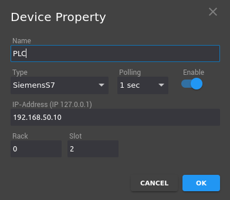
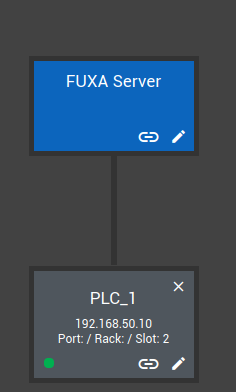
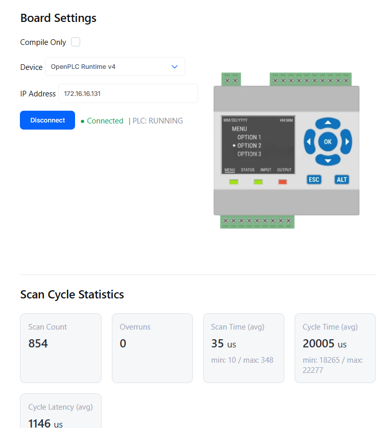
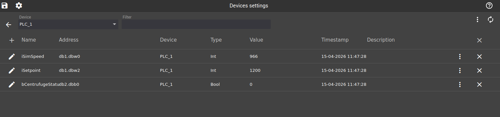
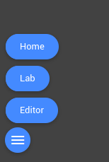
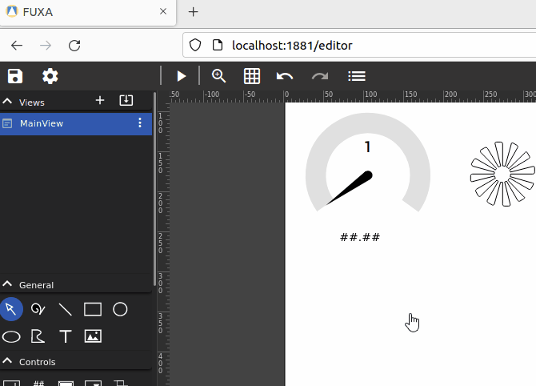

Để đảm bảo tương thích cao nhất, trong dự án này chúng tôi chọn cài bằng Docker:

```bash
docker pull frangoteam/fuxa:snap7
docker run -d -p 1881:1881 frangoteam/fuxa:snap7
```

> [!CAUTION]
> Cần đảm bảo đã expose port `102` của máy ảo chạy OpenPLC runtime nếu chạy qua docker. Sau đó đảm bảo đã start và chườn trình đã được nạp thông qua OpenPLC Editor.

1. Truy cập Fuxa tại: http://localhost:1881

2. Thiết lập kết nối đến PLC runtime: Setting Icon > `Connections` > `+` :


Lựa chọn giao thức `Siemens S7` và nhập thông tin kết nối:





> [!NOTE]
> Nếu gặp lỗi không thể kết nối, kiểm tra lại trạng thái của PLC qua OpenPLC Editor để đảm bảo PLC đang trong trạng thái Running



3. Khai báo các HMI tags. Bấm vào `(-)`:



4. Quay lại Editor và chạy thử HMI:



Sau đó bấm Lauch Icon để chạy HMI:



# Refernces

- https://www.youtube.com/watch?v=U5MKKHjQ1sk