# Cài đặt và cấu hình OpenPLC v4 runtime, OpenPLC Editor v4

Mô phỏng một PLC có chạy giao thức S7comm bằng cách sử dụng OpenPLC (Bản chất là phần mềm này chạy một Snap7 Server bên trong [[1]](#1)).Cho phép ảo hóa một máy tính để hoạt động như một PLC vật lý. Slave này sẽ lắng nghe các yêu cầu trên cổng 102 và phản hồi dựa trên các vùng nhớ được đăng ký.

- Cài đặt tại: https://autonomylogic.com/runtime

- Github: https://github.com/Autonomy-Logic/openplc-runtime/

- Tutorial cài đặt: https://youtu.be/wWBvFiq3ZU8?si=tVHIa5JJPeKZMd1I


```
 * Serving Flask app 'webserver.restapi'
 * Debug mode: off
WARNING: This is a development server. Do not use it in a production deployment. Use a production WSGI server instead.
 * Running on all addresses (0.0.0.0)
 * Running on https://127.0.0.1:8443
 * Running on https://192.168.1.89:8443
Press CTRL+C to quit
```

Để đảm bảo tương thích cao nhất, trong dự án này chúng tôi chọn cài bằng Docker:

```bash
docker pull ghcr.io/autonomy-logic/openplc-runtime:latest

sudo docker run -d \
  --name openplc-runtime \
  -p 8443:8443 \
  --cap-add=SYS_NICE \
  --cap-add=SYS_RESOURCE \
  -v openplc-runtime-data:/var/run/runtime \
  ghcr.io/autonomy-logic/openplc-runtime:latest
```


Khác với OpenPLC v3 Runtime khi chạy sẽ mở 2 port (mặc định chưa enable thêm protocol nào khác):

- Port 8080: Web server để cấu hình và giám sát PLC runtime 

- Port **8443**: RESTful API (được chay bởi Flask server) để giao tiếp với PLC runtime (ví dụ như để upload chương trình PLC, đọc/ghi dữ liệu, ...). OpenPLC Editor sử dụng API này để giao tiếp với Runtime.

OpenPLC v4 đã loại bỏ giao diện quản trị web trên port 8080, thay vào đó chỉ còn RESTful API trên port 8443, bởi vì giờ đây toàn bộ các chức năng cấu hình, giám sát runtime của web quản trị đều có thể được thực hiện thông qua API này. OpenPLC Editor v4 đã hỗ trợ đầy đủ các API này thông qua GUI.

Cài đặt OpenPLC Editor v4 tại: https://autonomylogic.com/editor

> [!NOTE]
> OpenPLC Editor cần có C compiler (như MinGW trên Windows hoặc GCC trên Linux) để biên dịch chương trình PLC thành mã máy có thể chạy trên OpenPLC Runtime. 


Tạo Project mới. Kết nối với PLC runtime `Devies` > `Configuration` > `OpenPLC Runtime v4`:


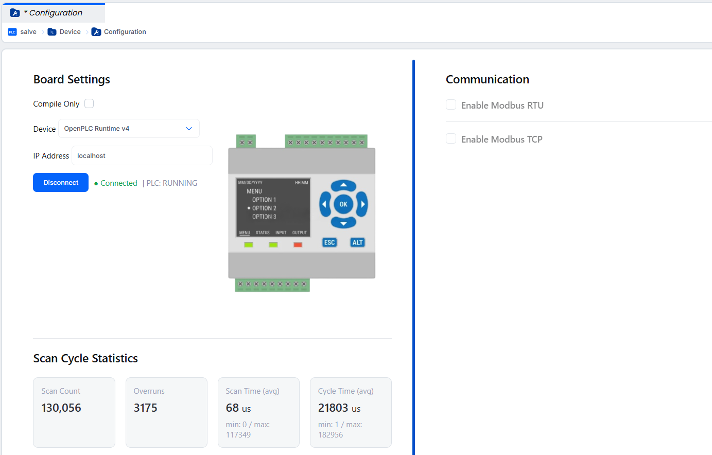


Như này là đã kết nối xong với PLC rumtime, giờ ta muốn PLC sẽ chạy như một server để chờ client kết nối tới `+` > `Server` > Thêm tên và chọn giao thức `Siemens S7comm`:

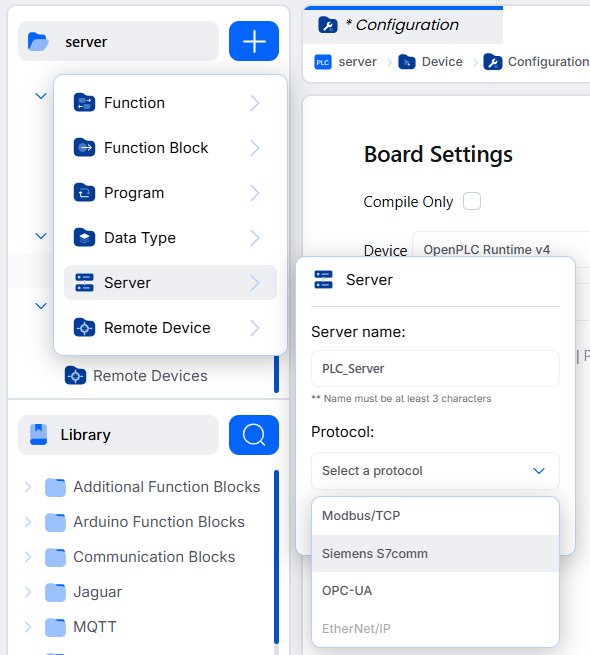

Xác nhận PLC đã chạy Siemens S7 thành công trên port 102.

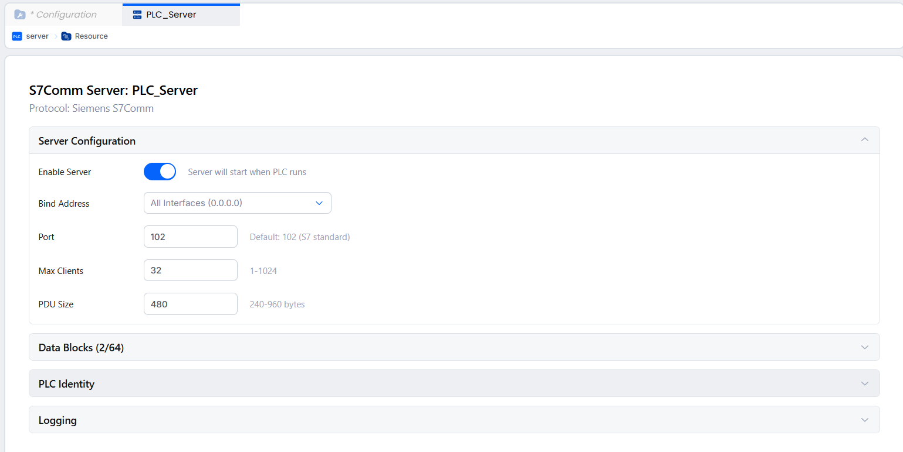

> [!CAUTION]
> Đảm bảo port 102 không bị sử dụng bởi các tiến trình khác. Thông thường khi trên máy đã cài các phần mềm của Siemens như TIA Portal, S7-PLCSIM thì port 102 sẽ bị chiếm dụng. Kiểm tra bằng lệnh `netstat -ano | findstr :102` trên Windows hoặc `sudo netstat -tuln | grep :102` trên Linux.

```
> netstat -ano | findstr :102

  TCP    0.0.0.0:102            0.0.0.0:0              LISTENING       5432

> tasklist /FI "PID eq 5432"

Image Name                     PID Session Name        Session#    Mem Usage
========================= ======== ================ =========== ============
s7oiehsx64.exe                5432 Services                   0     45,480 K
```

Port đang bị chiếm dụng bởi tiến trình `s7oiehsx64.exe` (S7-PLCSIM). Cần dừng tiến trình này trước khi chạy OpenPLC runtime với giao thức Siemens S7comm. Khi chạy đúng:

```
Image Name                     PID Session Name        Session#    Mem Usage
========================= ======== ================ =========== ============
plc_main.exe                  9848 Console                    1     58,036 K
```

# Thử nghiệm chương trình PLC

Khi tạo dự án chọn tạo với ngoonnguwx lập trình **Ladder**. Sau khi đã kết nối với PLC runtime, giờ ta sẽ viết một chương trình PLC đơn giản để thử nghiệm.

1. Khai báo một datablock `DB1`. OpenPLC runtime không hỗ trợ trực tiếp tạo datablock như Siemen PLC mà nó chỉ có thể khai báo datablock rồi map địa chỉ đó vào một vùng nhớ được hỗ trợ khác. `Server` > `PLC_Server` vừa tạo > `+ Add Data Block`: 

  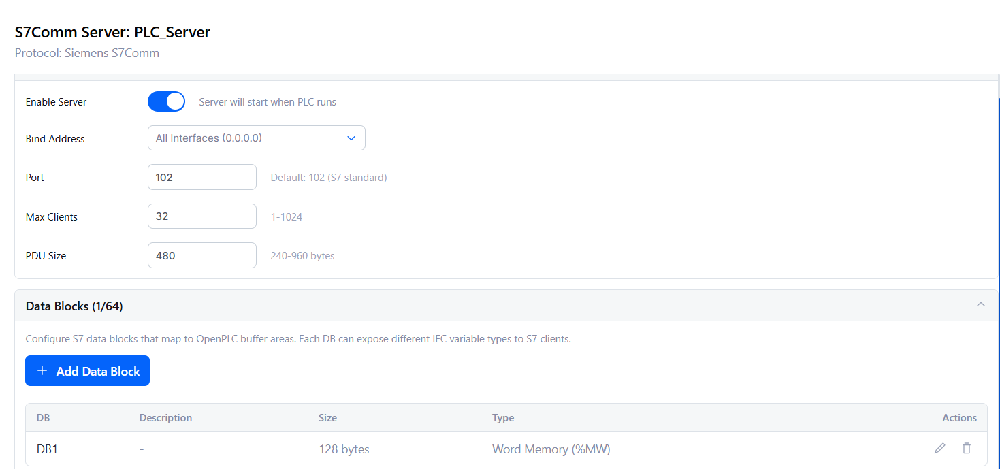

  Khi này, việc đọc các vùng nhớ tại `%MW` sẽ tương đương với việc đọc dữ liệu từ datablock `DB1` như trong Siemens.

2. Viết chương trình PLC tại `Program` > `main`:

  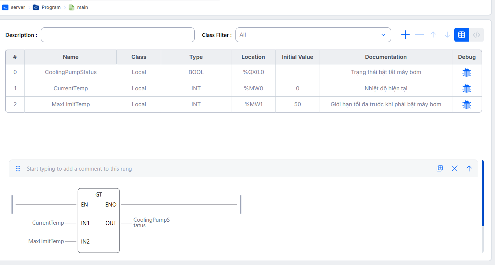

  Phần phía trên là khai báo các **tag** (hoặc gọi là variables trong IT), phần phía dưới là logic PLC. Ở đây chúng ta khai báo 3 biến là `CoolingPumpSatus` kiểu bool tại vị trí `%QX0.0`, `CurrentTemp` và `MaxLimitTemp` kiểu int tại vị trí `%MW0` và `%MW1`. 

  ```
  VAR
    CoolingPumpStatus : bool AT %QX0.0; (* Trạng thái bật tắt máy bơm *)
    CurrentTemp : int AT %MW0 := 0; (* Nhiệt độ hiện tại *)
    MaxLimitTemp : int AT %MW1 := 50; (* Giới hạn tối đa trước khi phải bật máy bơm *)
  END_VAR
  ```

  Với code chương trình: `Library` > `Comparison` > `GT` > Enable [`Execution Control`](https://openplc.discussion.community/post/openplc-v4-data-type-incompatibility-error-when-connecting-analog-input-to-ltgt-blocks-13778902) để cho phép so sánh 2 biến số nguyên. Sau đó điền các biến vào đầu vào, ra của block so sánh:

  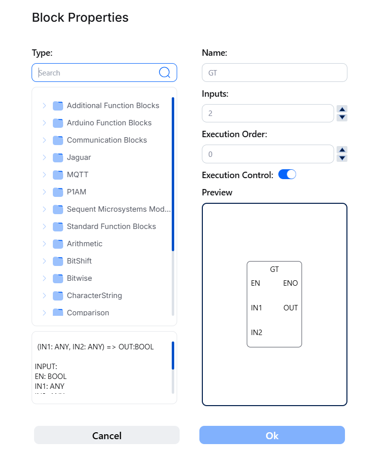

  Chương trình này nếu viết tương tự bên Siemens TIA Portal sẽ như sau:

  - Block DB1 [DB1]:

  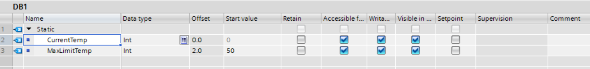

  - PLC tags:

  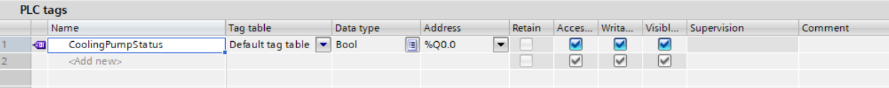

  - Main [OB1]:

  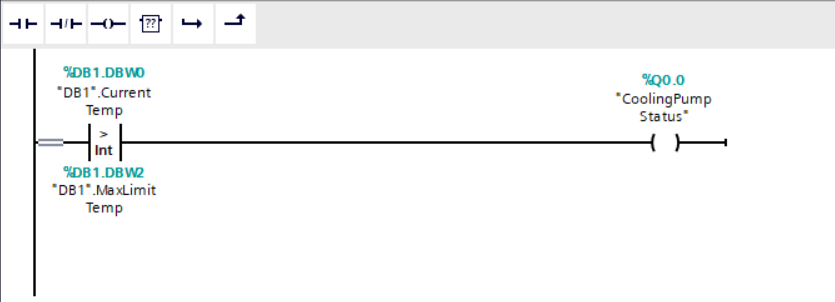


Sau đó bấm **(1)** để Complie chương trình, **(2)** để chạy PLC runtime, **(3)** để bật debug, giám sát giá trị các biến:

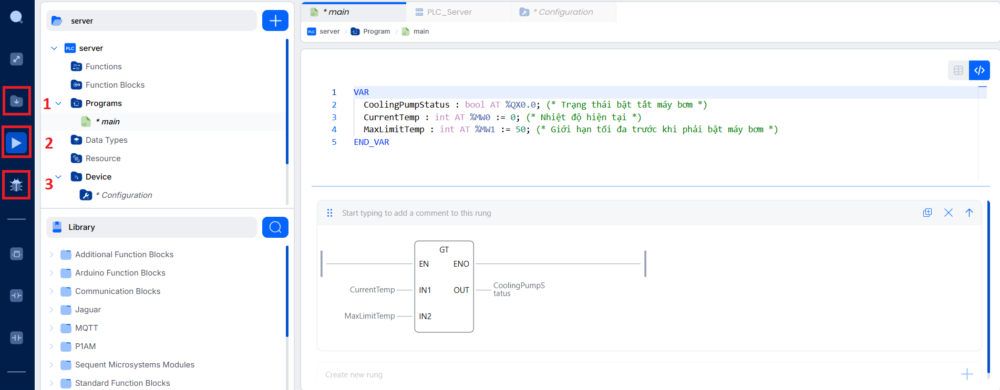

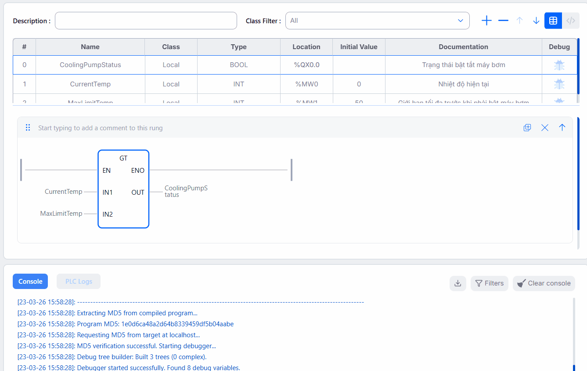

Đồng thời chạy một chương trình Python Snap7 để kết nối từ bên ngoài tới PLC runtime:

```python
from time import sleep
import snap7

IP_ADDRESS = '127.0.0.1' # Since we are running the client on the same machine as the runtime, we can use localhost
TRACK = 0
SLOT = 2

plc = snap7.client.Client()
plc.connect(IP_ADDRESS, TRACK, SLOT)

def read_db(plc, db_number, start, size):
    try:
        data = plc.db_read(db_number, start, size)
        return data
    except Exception as e:
        print(f"Error reading DB: {e}")
        return None


def writedb(plc, db_number, start, data):
    try:
        plc.db_write(db_number, start, data)
        return True
    except Exception as e:
        print(f"Error writing DB: {e}")
        return False

while True:
    current_temp_bytes = read_db(plc, 1, 0, 2)
    max_temp_bytes = read_db(plc, 1, 2, 2)
    
    if current_temp_bytes:
        current_temp = int.from_bytes(current_temp_bytes, byteorder='big')
    else:
        current_temp = None
    
    if max_temp_bytes:
        max_temp = int.from_bytes(max_temp_bytes, byteorder='big')
    else:
        max_temp = None
    
    print("Current Temp:", current_temp)
    print("Max Limit Temp:", max_temp)
    sleep(1)
```

Chương trình sẽ liên tục đọc giá trị của `CurrentTemp` và `MaxLimitTemp` từ datablock `DB1` của PLC runtime và in ra màn hình:

```
Current Temp: 60
Max Limit Temp: 50
Current Temp: 60
Max Limit Temp: 50
Current Temp: 60
Max Limit Temp: 50
Current Temp: 60
Max Limit Temp: 50
```

Với track và slot thường sẽ là 0,2 cho Siemens S7-300/400 và 0,1 cho Siemens S7-1200/1500. OpenPLC Runtime mô phỏng lại giống như một PLC Siemens S7-300/400 nên track sẽ là 0, slot sẽ là 2.

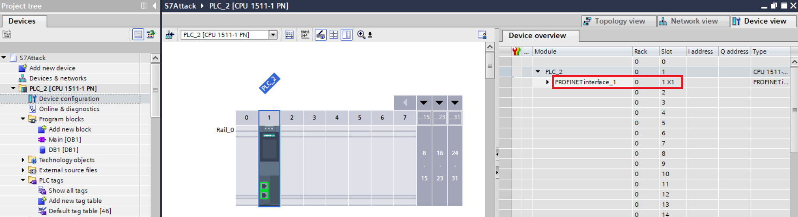

*PLC S7-1200/1500*

# References

<a id="1">[1]</a> Available at: https://gitlab.fing.edu.uy/gsi/tectonic-ot/openplcmd/-/blob/main/documentation/S7-Protocol/Siemens%20Protocol%20driver%20for%20OpenPLC.pdf, accessed 12 April 2026.
