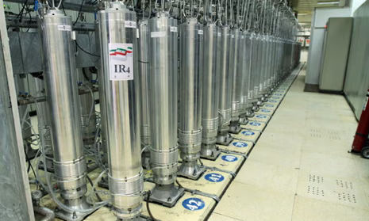

Trong bối cảnh căng thẳng địa chính trị ở Trung Đông, bất chấp thỏa thuận với cơ quan nguyên tử quốc tế (IAEA) về việc giám sát các hoạt động hạt nhân của Iran, chương trình hạt nhân tại nước này không ngừng được đẩy mạnh gây nên mối đe dọa lớn về an ninh với các nước trung khu vực. 

Dưới thời tổng thống George W. Bush, sau nhiều nỗ lực ngoại giao thất bại, Hoa Kỳ ( đứng đầu bởi Cơ quan NSA) và Israel bắt đầu một chiến dịch tấn công mạng có tên là **Operation Olympic Games** nhằm phá hoại chương trình hạt nhân của Iran. Mục tiêu là làm hư hại các máy ly tâm khí (**gas centrifuges**) được sử dụng để làm giàu Uranium tại nhà máy hạt nhân Natanz ở Iran, từ đó làm chậm lại chương trình hạt nhân của nước này. Chương trình được cho là đã phát triển một loại mã độc có tên là **Stuxnet** từ 2004-2008, tiêu tốn 2 tỷ đô la mỹ cùng các chiến dịch tình báo, xâm nhập phức tạp để đưa được mã độc vào hệ thống mạng nội bộ được cách ly air-gapped hoàn toàn của nhà máy hạt nhân Natanz.

Quá trình tấn công:

1. **Lây nhiễm trong windows**: Được lây nhiễm vào một máy tính trong mạng nội bộ thông qua USB do một gián điệp để lại. Sau đó, nó lan tiếp trong mạng nội bộ thông qua 4 lỗ hổng Zero-day  của Windows và gửi thông tin về các máy chủ Command and Control (C&C) của kẻ tấn công

2. **Lây nhiễm vào phần mềm Siemens Step 7**: Tại mỗi máy tính windows, nó quét để truy tìm phần mềm **Siemens Step 7**. Nó can thiệp vào thư viện giao tiếp `s7otbxdx.dll` của Step7 để chặn và sửa luồng trao đổi giữa phần mềm Step 7 và PLC:

    

        

            <b>Normal communications between Step 7 and a Siemens PLC</b> 
            
        

        

            <b>Stuxnet hijacking communication between Step 7 software and a Siemens PLC</b> 
            
        

    

    Về bản chất, đây là một kiểu man-in-the-middle ở tầng phần mềm

3. **Can thiệp vào quá trình điều khiển máy ly tâm khí**: Stuxnet can thiệp vào quá trình điều khiển máy ly tâm khí bằng cách sửa đổi code trong PLC để tăng tốc độ vòng quay của máy ly tâm lên mức cao hơn bình thường. Cụ thể, Stuxnet can thiệp vào Step7 để gửi code độc hại nhằm tăng tốc độ vòng quay đến PLC -> PLC thực thi code, gửi tín hiệu điều khiển đến thiết bị biến tần (VFD Variable Frequency Drive) -> biến tần điều chỉnh tốc độ vòng quay của máy ly tâm -> làm hỏng máy ly tâm. 

    

    Đồng thời, Stuxnet cũng can thiệp vào đầu ra của PLC để gửi phần mềm HMI WinCC đọc dữ liệu sai lệch về tình trạng của máy ly tâm, khiến các kỹ sư không nhận ra rằng máy ly tâm đang bị hư hại.

Tuy nhiên điều tinh vi ở đây là Stuxnet chọn lọc các mục tiêu rất kỳ càng. Nếu mục tiêu không thỏa mãn yêu cầu, Stuxnet sẽ ngủ đông để giảm thiểu sự hiện diện của mình. Nó chỉ tấn công vào các PLC điều khiển biến tần có thông số:

- Thuộc dòng Siemens S7-300

- Nhà sản xuất biến tần là Vacon (Finland)hoặc Fararo Paya (Iran)

- Tần số vận hành nằm trong khoảng **807** Hz đến **1210** Hz. Do đây là tốc độ quay lớn hơn nhiều so với tốc độ của hầu hết các máy công nghiệp, trừ máy ly tâm khí. 

Khi đủ điều kiện, Stuxnet thay đổi tần số đầu ra trong các giai đoạn ngắn để làm rối loạn hoạt động của hệ thống, với các mức thường được nhắc đến là 1410 Hz, 2 Hz và 1064 Hz. Với cách này, nó làm thay đổi tốc độ quay của máy ly tâm và có thể gây hư hại vật lý, trong khi dữ liệu giám sát vẫn bị che giấu.

Sự tồn tại của Stuxnet chỉ được phát hiện rộng rãi vào năm 2010, khi phiên bản thứ 3 của nó  đã lan rộng ra toàn thế giới. Một công ty an ninh mạng Belarus phát hiện ra nó trên một máy tính ở Iran. Sau đó, các nhà nghiên cứu bảo mật đã phân tích và xác định rằng Stuxnet là một phần của một chiến dịch tấn công mạng tinh vi nhằm vào chương trình hạt nhân của Iran.

> [!NOTE]
> Trong mô phỏng tấn công của đồ án này, để phù hợp với giới hạn về thời gian và nguồn lực, chúng tôi sẽ mô phỏng đơn giản hóa kịch bản tấn công man-in-the-middle ở trên tầng giao thức mạng thay vì tại dll như thực tế Stuxnet đã làm.

*Tia Portal là một bộ phần mềm độc quyền của Siemens để làm việc với các dòng PLC của hãng (S7-300, S7-400, S7-1200, S7-1500), bao gồm: STEP 7 dùng để lập trình và cấu hình cho các dòng PLC, WinCC dùng để thiết kế HMI/SCADA, S7- PLCSIM / S7 PLCSIM Advanced dùng để mô phỏng hoạt động của PLC trên máy tính mà không cần phần cứng thực tế, Startdrive dùng để cấu hình biến tần, động cơ.*

https://youtu.be/WXK5XUYFZcg?si=2J6FR6y4AoPdBZUe