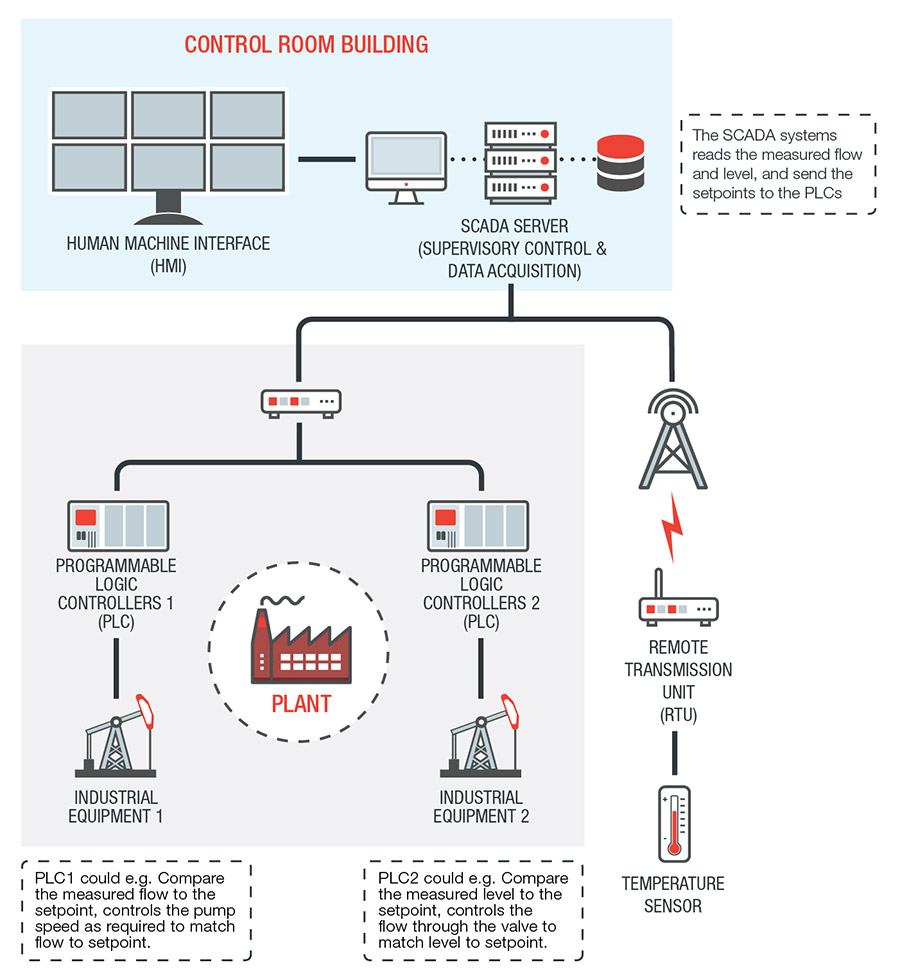
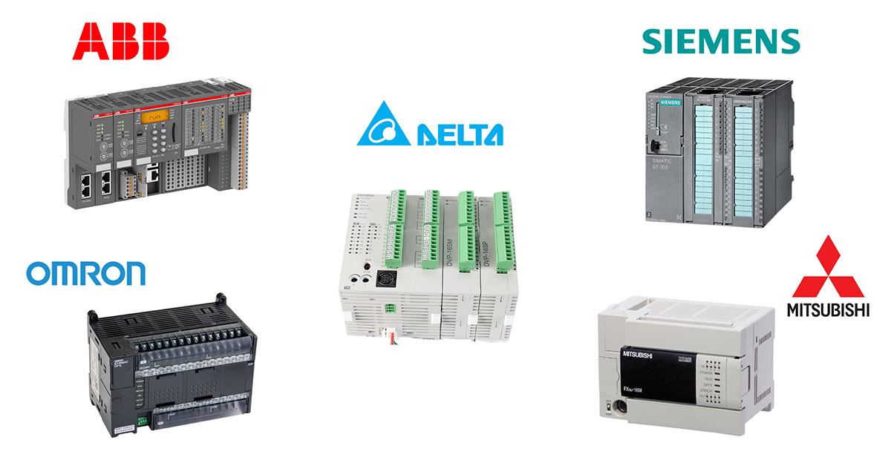
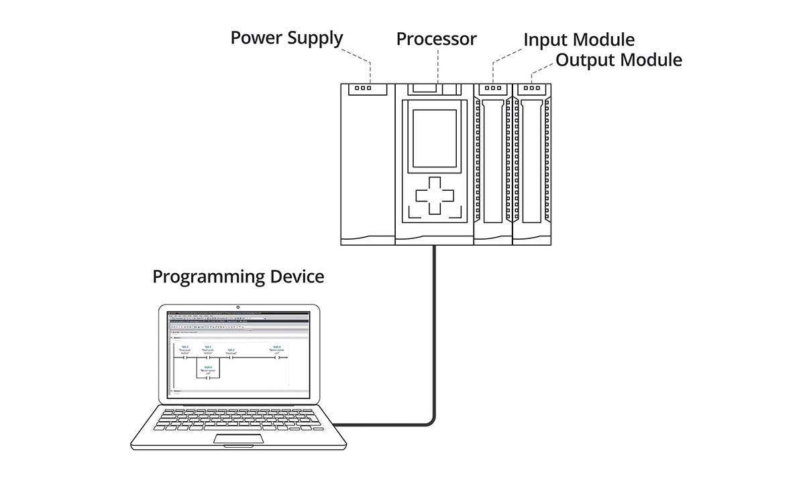
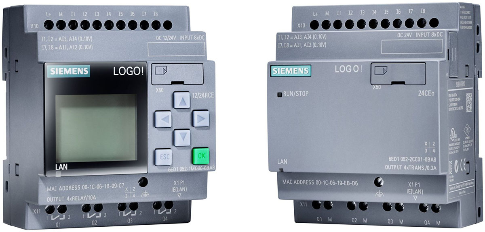
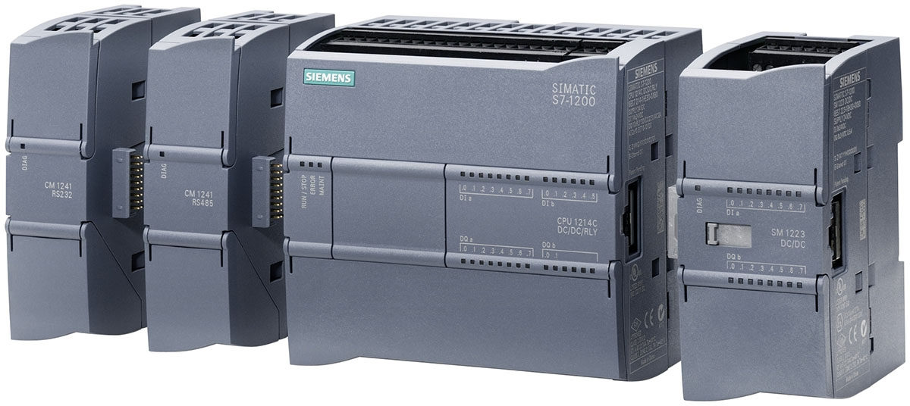
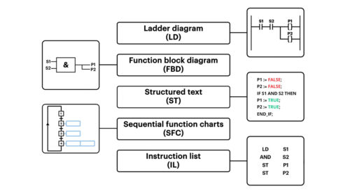
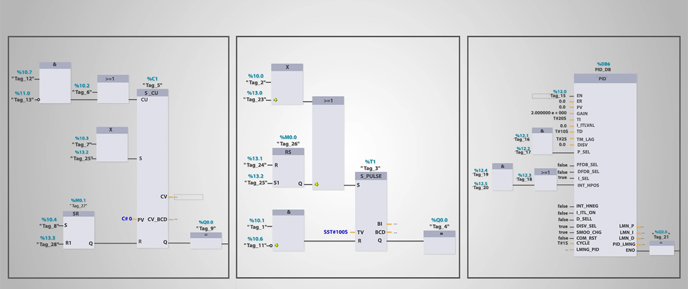
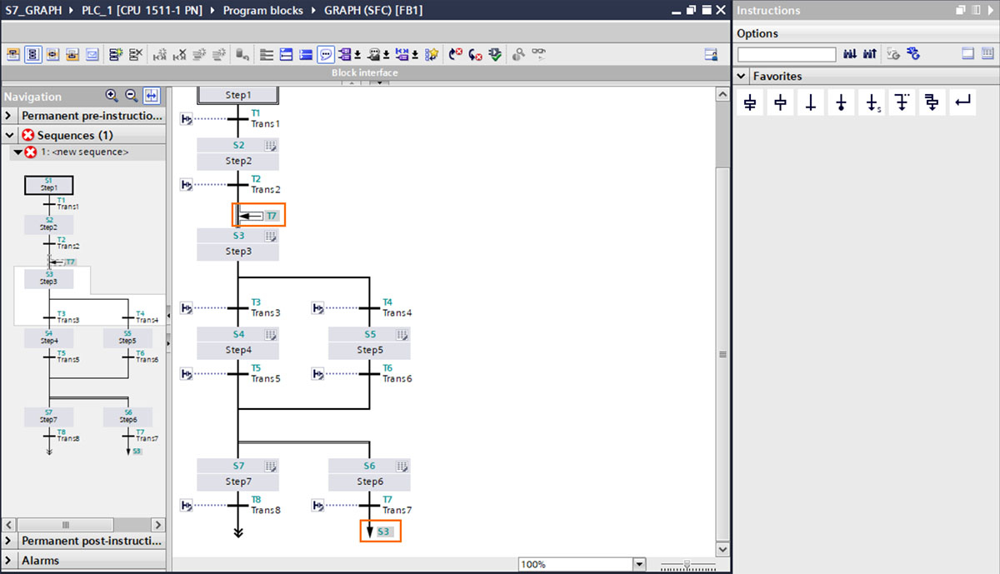
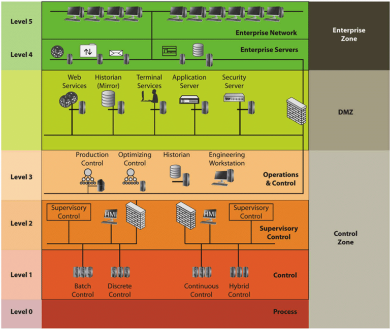

## OT/ICS là gì ?

Mọi công nghệ để vận hành nhà máy vật lý được gọi là OT (Operational Technology) bao gồm:

- Công nghệ giám sát và quản lý phụ trợ như BMS (Building Management Systems) để điều khiển điều hòa (HVAC), chiếu sáng, phòng cháy chữa cháy, EMS (Energy Management Systems) để quản lý năng lượng tiêu thụ.

- Công nghệ bảo trì như EAM (Enterprise Asset Management) để theo dõi tình trạng thiết bị.

- Công nghệ giao thông và điều khiển vận hành hiện trường

- Công nghệ điều khiển, tức **ICS (Industrial Control Systems)** là cách điều khiển và giám sát các quy trình công nghiệp. ICS bao gồm các hệ thống:

    <div align="center">
        
    </div>

    - Bộ điều khiển (Controller):

        - **PLC (Programmable Logic Controllers)**

        - **RTU (Remote Terminal Units)**: Một thiết bị điều khiển từ xa có chức năng giao tiếp với các thiết bị hiện trường để thu thập dữ liệu và truyền về trung tâm điều khiển hoặc nhận lệnh từ trung tâm điều khiển. Về mặt chức năng RTU cũng giống như một PLC nhưng chuyên biệt hóa cho các ứng dụng từ xa, hoạt động với nguồn năng lượng hạn chế và tích hợp sẵn các module truyền thông mạnh mẽ hơn.

        - **DCS (Distributed Control Systems)** là một hệ thống điều khiển phân tán, trong đó các chức năng điều khiển được phân phối trên nhiều bộ điều khiển nhỏ hơn thay vì tập trung vào một bộ điều khiển lớn như PLC. DCS thường được sử dụng trong các nhà máy lớn và phức tạp, nơi có hàng ngàn thông số cần được phối hợp và điều khiển đồng thời với độ tin cậy cao
    
    - Thiết bị hiện trường:

        - Cảm biến (**Sensor**): đo lường các thông số vật lý như nhiệt độ, áp suất, lưu lượng, mức chất lỏng, ... và chuyển đổi thành tín hiện logic/analog để gửi về các bộ điều khiển.

        - Thiết bị chấp hành (**Actuator**): nhận tín hiệu điều khiển từ bộ điều khiển và thực hiện các tác động vật lý như mở van, khởi động động cơ, bật đèn báo, ...

    - Hệ thống giám sát và quản lý:

        - **HMI (Human-Machine Interface)**: một phần mềm cho phép con người (kỹ sư, vận hành viên) theo dõi và tương tác với quy trình công nghiệp. HMI hiển thị dữ liệu từ các cảm biến dưới dạng đồ họa trực quan (màn hình giám sát, biểu đồ, đèn báo), cho phép người vận hành xem thông số, xem báo động và gửi lệnh điều khiển.

        - **SCADA (Supervisory Control and Data Acquisition)**: là một hệ thống giám sát và thu thập dữ liệu, nó bao gồm HMI nhưng có thêm khả năng thu thập dữ liệu lịch sử (historian), phân tích dữ liệu tập trung từ nhiều nguồn. SCADA thường được sử dụng để giám sát các quy trình công nghiệp trên diện rộng, phân tán trong khi HMI thường chỉ dùng cho một/một cụm thiết bị điều khiển cụ thể.

- Các công nghệ khác ...


## 1. PLC

### 1.1 PLC là gì

PLC là tên viết tắt của **Programmable Logic Controller**, là bộ điều khiển logic khả trình hay bộ điều khiển logic có khả năng lập trình. 

*Để dễ hiểu, trong thế giới IT, nó chính là một chiếc máy tính đang chạy một chương trình được các lập trình viên viết ra. Áp dụng cho môi trường OT, nơi đặt yếu tố sẵn sàng và bền bỉ lên hàng đầu, chiếc máy tính này được chế tạo nhỏ gọn, bền bỉ để chịu được môi trường công nghiệp khắc nghiệt (rung động, nhiệt độ cao, bụi bẩn, nhiễu điện từ,...) và hoạt động không ngừng nghỉ 24/7 trong nhiều năm.*

Trước khi PLC ra đời, việc điều khiển các quy trình này thường được thực hiện bằng hàng trăm, thậm chí hàng nghìn rơ le (relay), bộ định thời (timer), và bộ đếm (counter) cơ điện. Hệ thống này rất cồng kềnh, phức tạp, khó khăn trong việc sửa đổi logic điều khiển. Sự ra đời của PLC vào cuối những năm **1960** bởi **Richard E. Morley** được xem là một cuộc cách mạng, thay thế hoàn toàn các hệ thống điều khiển bằng rơ le truyền thống. Điểm đặc biệt của PLC so với các hệ thống điều khiển cứng bằng rơ le là logic điều khiển có thể dễ dàng thay đổi bằng cách sửa đổi chương trình phần mềm mà không cần phải thay đổi phần cứng hay đi lại dây phức tạp. 


Thị trường PLC toàn cầu được thống trị bởi một số ít các nhà sản xuất lớn, mỗi hãng có những dòng sản phẩm chiến lược, phần mềm lập trình và hệ sinh thái riêng. Việc lựa chọn PLC theo hãng sản xuất thường phụ thuộc vào sự quen thuộc của đội ngũ kỹ thuật, tính sẵn có của thiết bị và hỗ trợ kỹ thuật tại địa phương.



| Tên | Quốc gia | Các dòng máy phổ biến | Phần mềm lập trình|
|---|----|---|----|
|**Siemens**| Đức | LOGO! (Mini PLC), Simatic S7-200 SMART, PLC S7-1200, S7-1500, S7-300, S7-400|   TIA Portal|
|**Rockwell Automation/ Allen-Bradley**| Mỹ| MicroLogix, CompactLogix, ControlLogix| RSLogix 5000, Studio 5000|
|**Mitsubishi Electric**| Nhật Bản| FX series, Q series, L series, iQ-R/F series | GX Works2, GX Works3|
|**Omron**| Nhật Bản|  CP1 series, CJ2 series, NX/NJ series | CX-One|
|**Schneider Electric** |Pháp | Modicon như Modicon M221, Modicon M340, Modicon M580 | EcoStruxure Control Expert|

Ngoài ra còn các nhà sản xuất khác như các nhà sản xuất khác như Delta (Đài Loan), Keyence (Nhật Bản), và LS Electric (Hàn Quốc), ...


### 1.2 Cấu tạo PLC



1. **Bộ xử lý trung tâm CPU – Central Processing Unit** được coi là bộ não của PLC. Tuy nhiên khác với CPU của máy tính thông thường hoạt động theo cơ chế xử lý đa nhiệm và dựa trên sự kiện (event-driven), CPU của PLC hoạt động theo chu kỳ quét (**scan cycle** thường tính bằng miligiây ) và thực hiện tuần tự các lệnh trong chương trình. Một chu trình quét điển hình gồm 3 bước chính:

    1. **Đọc đầu vào (Input Scan)**: CPU kiểm tra trạng thái của tất cả các cảm biến, nút nhấn kết nối với module đầu vào và chép dữ liệu này vào “Bảng ảnh đầu vào” (Input Image Table – PII). Việc này đảm bảo CPU có một “bản chụp” nhất quán về trạng thái đầu vào.

    2. **Thực thi chương trình (Program Execution)**: CPU chạy chương trình đã được nạp sẵn trong bộ nhớ để xử  lý tính toán  logic, số học, và các lệnh điều khiển dựa     trên các đầu vào nhận được.

    3. **Cập nhật đầu ra (Output Scan)**: Sau khi tính toán xong, CPU cập nhật các giá trị vào “Bảng ảnh đầu ra” (Output Image Table – PIQ). Sau đó, các giá trị trong bảng này sẽ được ghi ra các module đầu ra để điều khiển các thiết bị chấp hành (như motor, van, đèn)

    4. **Lặp lại chu trình quét**.

    Ngoài thực thi logic chính, CPU còn quản lý các hoạt động khác như: chuẩn đoán lỗi, giao tiếp với các PLC hoặc các hệ thống khác.

2. **Module Đầu vào (Input Modules)** nhận tín hiệu từ các thiết bị trường như cảm biến, nút nhấn, công tắc và chuyển đổi chúng thành tín hiệu logic mà CPU có thể hiểu. Có hai loại chính là:

    - Module đầu vào số (Digital Input Module – DI) nhận tín hiệu ON/OFF
    
    - Module đầu vào tương tự (Analog Input Module – AI) nhận tín hiệu liên tục.  
    
    Số lượng I/O mà một PLC có thể quản lý là một tiêu chí quan trọng, phản ánh khả năng xử lý và quy mô ứng dụng của nó:


    | Loại PLC | Số lượng I/O |
    |---|---|
    | Micro PLC | dưới 32-64 điểm I/O |
    | Small PLC | 64 đến vài trăm điểm I/O |
    | Medium PLC | vài trăm đến khoảng 1000-2000 điểm I/O |
    | Large PLC | hàng nghìn, hàng chục nghìn điểm I/O |

**3. Module Đầu ra (Output Modules)** nhận lệnh từ CPU và chuyển đổi thành tín hiệu để điều khiển các thiết bị chấp hành như động cơ, van, đèn báo. Tương tự, có:

- Module đầu ra số (Digital Output Module – DO) xuất tín hiệu ON/OFF, với các loại đầu ra phổ biến như Relay, Transistor, Triac. 

- Module đầu ra tương tự (Analog Output Module – AO) xuất tín hiệu liên tục

**4. Bộ nhớ (Memory Unit)**: Giống như máy tính thông thường, PLC có hai loại bộ nhớ dùng để lưu trữ thông tin:

- RAM: Lưu trữ trạng thái tạm thời của các biến, các giá trị tính toán và trạng thái I/O (Input/Output). Dữ liệu này sẽ mất khi PLC không còn được cấp điện. Cụ thể hơn, nó bao gồm:

    | memory          | ký hiệu |  ý nghĩa             |
    | --------------- | --------|----------- |
    | Input | `I` hoặc `E`       | Lưu trạng thái của các cổng vào vật lý (nút nhấn, công tắc hành trình). PLC đọc từ phần cứng và chép vào đây ở đầu chu kỳ quét.   |
    | Output | `Q` hoặc `A`      | Lưu trạng thái mong muốn của các thiết bị chấp hành (motor, đèn, van). Cuối chu kỳ quét, dữ liệu từ đây sẽ được đẩy ra phần cứng. |
    | Memory/Merker | `M`   | Vùng nhớ trung gian toàn cục của PLC, giống global variables trong IT. Nó dùng để lưu các trạng thái trung gian của thuật toán mà không xuất trực tiếp ra ngoài phần cứng.    |
    | Data Block | `DB` | Khối dữ liệu người dùng. Thường được dùng để lưu trữ các Setpoint như giới hạn nhiệt độ, giới hạn áp suất, mật khẩu    |
    | Local data | `L` |   lưu trữ các biến cục bộ trong các khối chương trình | 
    | Timer | `T` hoặc `%T` | Bộ đếm thời gian |
    | Counter | `C` hoặc `%C` | Bộ đếm sự kiện  | 

    Xem cụ thể hơn trong [[3]](#3)


    Đây chính là dữ liệu mà attacker thường đọc hoặc sửa để gây ảnh hưởng lên hoạt động của PLC trong dây chuyền.


- ROM/EEPROM/Flash: Lưu trữ chương trình điều khiển do người dùng viết. System memory/Firmware lưu trữ hệ điều hành và các chương trình hệ thống của PLC. Dữ liệu trong các bộ nhớ này thường không bị mất khi mất điện


**5. Bộ nguồn (Power Supply Unit)** cung cấp điện áp hoạt động ổn định cho tất cả các thành phần của PLC.


**6. Cổng truyền thông Communication Processor**: cho phép PLC giao tiếp với các thiết bị khác như kết nối với máy trạm để nạp chương trình, kết nối với HMI, SCADA, các PLC khác, hoặc các hệ thống quản lý dữ liệu.


```
┌─────────────────────────────────────────────┐
│              CORPORATE NETWORK              │
│           (IT - Windows/Linux)              │
└──────────────────┬──────────────────────────┘
                   │ (thường qua DMZ)
                   │
┌──────────────────▼──────────────────────────┐
│         SCADA / HMI / Historian             │  
└──────────────────┬──────────────────────────┘
                   │ Giao thức công nghiệp
                   │ Modbus/DNP3/EtherNet/IP/S7
                   │
┌──────────────────▼──────────────────────────┐
│                  PLC                        │
│  ┌──────────┐  ┌──────────┐  ┌──────────┐   │
│  │  CPU     │  │  Memory  │  │ Comm     │   │
│  │(logic)   │  │(program) │  │ Module   │   │
│  └──────────┘  └──────────┘  └──────────┘   │
└──────────────────┬──────────────────────────┘
                   │ Dây vật lý / fieldbus
         ┌─────────┴─────────┐
    [Cảm biến]          [Actuator]
   (Sensor: đọc)    (Van/Motor: điều khiển)
```


Các thành phần này có thể được tách ra thành từng module vật lý khác nhau và kết nối lại với nhau thành một PLC hoàn chỉnh thông qua bus hệ thống (Modular PLC) hoặc được tích hợp sẵn trong một khối duy nhất (Compact PLC  hay Brick PLC).

<div style="display: flex; gap: 20px; align-items: flex-start;">

<div style="text-align: center;">
<b>LOGO! Siemens – Compact PLC</b><br>

</div>

<div style="text-align: center;">
<b>Siemens S7-1200 – Modular PLC</b><br>

</div>

</div>

 Với loại module PC thì sẽ được chia theo slot và rack. Ví dụ: 

```
Rack 0
┌────┬────┬────┬────┬────┐
|PSU |CPU |DI  |DO  |CP  |
└────┴────┴────┴────┴────┘
 slot0 slot1 slot2 slot3 slot4
```

Mỗi thành phần của CPU sẽ nằm trên một slot trong một rack. 


### 1.3 Code PLC

Chương trình điều khiển cho PLC thông thường được viết bằng 5 ngôn ngữ theo chuẩn **IEC 61131-3**:




1. **Ladder Diagram (LD)**: Ngôn ngữ đồ họa dạng mạch relay. Nó gồm hai thanh dọc (thanh nguồn) và các "bậc thang" nằm ngang. Trên đó có các tiếp điểm (Contacts) và cuộn dây (Coils) mô phỏng các mạch điện logic. Ngôn ngữ này phù các kỹ sư điện quen với sơ đồ mạch, dùng cho các ứng dụng điều khiển đơn giản và trung bình.

2. **Function Block Diagram (FBD)**: Logic bằng block function. Các khối hình chữ nhật với đầu vào bên trái và đầu ra bên phải, được nối với nhau bằng các đường kẻ (dây tín hiệu). Cho phép xây dựng các ứng dụng điều khiển phức tạp một cách trực quan. Ví dụ:



3. **Sequential Function Chart (SFC)**: Giống như một lưu đồ (flowchart) gồm các bước (Steps) và các điều kiện chuyển bước (Transitions). Sử dụng cho quy trình phức tạp và tuần tự. Ví dụ:



14. **Structured Text (ST)**: Là các dòng mã thuần văn bản, có dạng gần giống C / Pascal. Phù hợp các lập trình viên code cho các ứng dụng phức tạp, có nhiều tính toán và xử lý dữ liệu. Nó sử dụng các cấu trúc như `IF...THEN`, `FOR`, `WHILE`. Ví dụ:

```
IF Input1 THEN
    Output1 := NOT Output1;
END_IF;
```

5. **Instruction List (IL)**: Ngôn ngữ cấp thấp, tương tự như Assembly. Tức gồm một danh sách các lệnh viết tắt theo cột dọc. Đòi hỏi lập trình viên có kiến thức chuyên sâu về PLC và kiến trúc máy tính,sử dụng cho các ứng dụng cần tốc độ xử lý cao và có yêu cầu về hiệu suất. Ví dụ: 

```
LD Input1 (Load Input 1)
AND Input2 (And với Input 2)
ST Output1 (Store vào Output 1)
```


## 2. Mô hình Purdue (Purdue Enterprise Reference Architecture - PERA)


Mô hình Purdue là "bản đồ" tiêu chuẩn để phân chia các lớp mạng trong môi trường ICS/OT. Nó được thiết kế để đảm bảo rằng các hệ thống điều khiển quan trọng được bảo vệ khỏi các mối đe dọa từ mạng Internet hoặc mạng văn phòng.

Dưới đây là cấu trúc 6 tầng (từ 0 đến 5) của mô hình này:




- **Tầng 0: Quy trình vật lý (Physical Process)**: Đây là nơi các thiết bị thực tế hoạt động.

    - Thiết bị: Cảm biến (nhiệt độ, áp suất), động cơ, van, cơ cấu chấp hành.

    - Nhiệm vụ: Thực hiện các tác động vật lý và thu thập dữ liệu thô.

- **Tầng 1: Kiểm soát trực tiếp (Basic Control)**: Nơi chứa các "bộ não" điều khiển thiết bị ở Tầng 0.

    - Thiết bị: PLC, DCS (Distributed Control Systems), RTU.

    - Nhiệm vụ: Đọc tín hiệu từ cảm biến và đưa ra lệnh điều khiển dựa trên logic đã lập trình.

- **Tầng 2: Giám sát (Area Supervisory Control)**: Nơi con người tương tác với máy móc.

    - Thiết bị: HMI (Màn hình giao tiếp người - máy), trạm kỹ thuật (Engineering Stations), phần mềm SCADA cục bộ.

    - Nhiệm vụ: Giám sát trạng thái vận hành và thay đổi các thông số điều khiển.

- **Tầng 3: Quản lý vận hành (Site Operations)**: Quản lý toàn bộ quy trình của một nhà máy hoặc phân xưởng.

    - Thiết bị: Hệ thống quản lý sản xuất (MES), Data Historian (lưu trữ dữ liệu lịch sử).

    - Nhiệm vụ: Lập kế hoạch sản xuất, báo cáo hiệu suất và quản lý tồn kho.

- **Tầng 3.5: Vùng phi quân sự (Industrial DMZ)**: Đây là lớp quan trọng nhất về bảo mật. Nó tách biệt hoàn toàn mạng sản xuất (OT) và mạng doanh nghiệp (IT). Không có kết nối trực tiếp nào được phép đi từ Tầng 4 xuống Tầng 3 mà không đi qua các Proxy hoặc Firewall ở đây.

- **Tầng 4 & 5: Mạng doanh nghiệp IT (Enterprise/Cloud)**: 

    - Thiết bị: Hệ thống ERP, Email, Web Server, Internet.

    - Nhiệm vụ: Quản lý kinh doanh, đặt hàng và kết nối ra bên ngoài.


## 4. IDS

### Để kiểm tra các gói tin, có 2 hướng tiếp cận để viết rule:

Giới thiệu lại cơ bản IDS có 2 cách là signatural base và anomaly detection. Với signature base thì có: 

1. **Mẫu byte (Byte Pattern / Raw Offset)**: Hệ thống không cần hiểu S7Comm là gì. Nó chỉ coi gói tin là một chuỗi các con số Hex. Bạn chỉ định: "Tại vị trí thứ X, nếu thấy giá trị Y thì báo động". Ví dụ: `(content:"|45 01|"; offset:22)` đây chính là byte liên quan đến chức năng password của S7. Bản chất nó làm việc trực tiếp trên tải trọng thô của lớp TCP nên cực kỳ nhanh, tốn rất ít tài nguyên vì không phải xử lý ngôn ngữ phức tạp. Nhưng ngược điểm là cứng nhắc. Nếu giao thức thay đổi một chút hoặc vị trí Byte bị lệch, quy tắc này sẽ vô dụng.

2. **Từ khóa chuyên dụng (Protocol-Specific Keywords)**: Cách này yêu cầu hệ thống phải có một bộ phân tích cú pháp (Parser) hiểu sâu về S7Comm. Cơ chế: Thay vì viết `offset:22`, bạn sẽ viết một quy tắc kiểu như: `s7comm_function: password_request`. Bộ phận Parser bóc tách gói TCP, gom các mảnh lại thành một "luồng" hoàn chỉnh -> chuyển đổi các con số Hex thành một cấu trúc dữ liệu mà máy tính hiểu được (ví dụ: trường "Mã chức năng", trường "Địa chỉ") ->  Bộ phận Detector sẽ đối chiếu cấu trúc dữ liệu vừa tạo với các quy tắc (Rules) có sẵn.

    - Ưu điểm: Rất thông minh và chính xác. Nó hiểu được ngữ cảnh của lệnh điều khiển.

    - Nhược điểm: Tốn tài nguyên CPU và RAM (Overhead) vì phải làm thêm bước "dịch" từ mã máy sang cấu trúc dữ liệu.

### Tính bảo mật của IDS

IDS là một thành phần quan trọng song không phải là giải pháp all in one trong hệ thống hạ tầng mạng. Một NIDS dù mạnh đến đâu cũng bị giới hạn bởi 3 yếu tố:

- Tầm nhìn: IDS có thực sự "nhìn" thấy hết lưu lượng không? Kẻ tấn công có thể định tuyến (routing) đi vòng qua IDS để tránh bị soi.

- Tải trọng (Hiệu suất): Nếu số lượng gói tin quá lớn (như trong một cuộc tấn công DoS), IDS có thể bị "ngạt" và bỏ lỡ các gói tin độc hại.

- Độ sâu của việc phân tích: việc phân tích càng sâu thì càng tốn tài nguyên. Nếu bộ phân tích (Parser) làm việc không hiệu quả, nó sẽ trở thành nút thắt cổ chai của toàn hệ thống. Tuy nhiên, nếu không phân tích sâu, nó sẽ bỏ sót các cuộc tấn công tinh vi.


- Lỗi triển khai: Bản thân IDS là một phần mềm phức tạp, và nó cũng có lỗ hổng. Nếu bộ phân tích cú pháp (Parser) bị lỗi, kẻ tấn công có thể gửi một gói tin "độc" khiến IDS rơi vào vòng lặp vô tận hoặc treo hệ thống. Vì IDS thường viết bằng ngôn ngữ bậc thấp (như C/C++) để đạt tốc độ cao, nó rất dễ bị Tràn bộ đệm (Buffer Overflow). Nếu kẻ tấn công chiếm được quyền kiểm soát IDS thông qua lỗi này, chúng sẽ có một vị trí thuận lợi bên trong mạng để tấn công các máy khác. Giải pháp là:

    - Dùng các ngôn ngữ an toàn bộ nhớ (memory-safe languages). Thay vì dùng C/C++, người ta dần chuyển sang các ngôn ngữ như Rust (đây là lý do tại sao Suricata – một IDS nổi tiếng – đang chuyển đổi phần phân tích giao thức sang Rust để tránh lỗi bộ nhớ). Các biện pháp khác như  
    
    - Fuzzing (Kiểm thử mù): Đưa một lượng lớn dữ liệu rác, dữ liệu lỗi vào IDS để xem nó có bị "sập" hay không, từ đó tìm ra lỗ hổng trước khi kẻ tấn công tìm thấy.

    - Sanitizing (Làm sạch dữ liệu): Các phương pháp phân tích hành vi để đảm bảo chương trình không thực thi các lệnh trái phép từ dữ liệu đầu vào.


# Tài liệu tham khảo

<a id="1">[1]</a> Snap7, “S7 Protocol,” SourceForge. [Online]. Available: https://snap7.sourceforge.net/siemens_comm.html. [Accessed: 12-Mar-2026]


<a id="ref-2">[2]</a> Veit, M. F., ICS protocol dissectors for signature-based NIDS, Master’s Thesis, Department of Informatics, Institute of Telematics, Decentralized Systems and Network Services Research Group, in cooperation with Federal Office for Information Security (BSI), Available: https://www.bsi.bund.de/SharedDocs/Downloads/EN/BSI/ICS/Masterarbeit_ICS_protocol_dissectors_for_signature_based_NIDS.pdf?__blob=publicationFile&v=7. Jan. 2021–Jun. 2021.

<a id="ref-3">[3]</a> Snap7, “Sharp7,” SourceForge. [Online]. Available: https://snap7.sourceforge.net/sharp7.html. [Accessed: 18-Mar-2026].

<a id="ref-4">[4]</a> Inprotech, “S7Comm Protocol Security Analyzed,” Inprotech. [Online]. Available: https://inprotech.es/en/s7comm-protocol-security-analyzed/. [Accessed: 18-Mar-2026].


