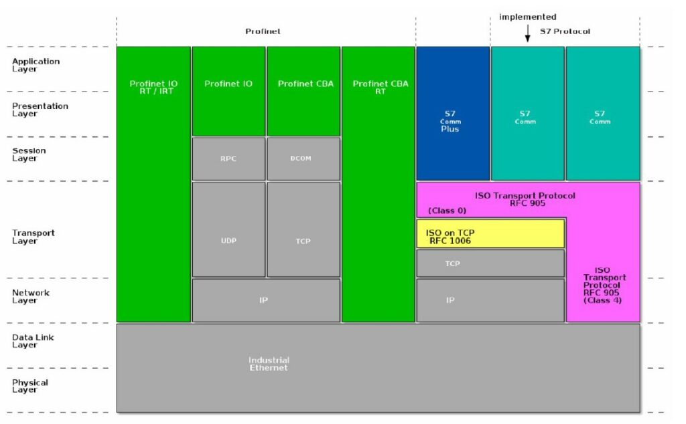
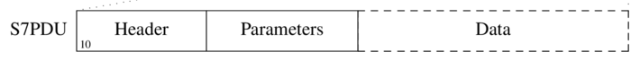
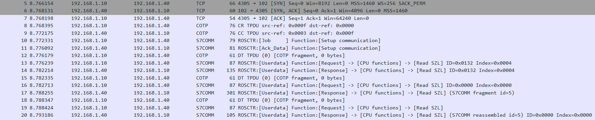
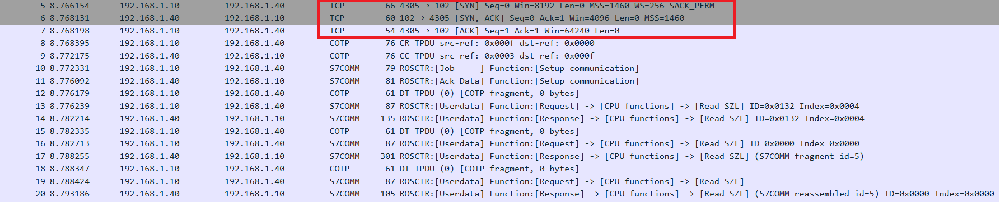
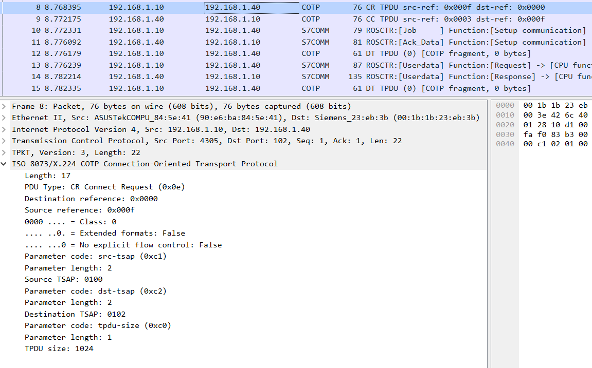
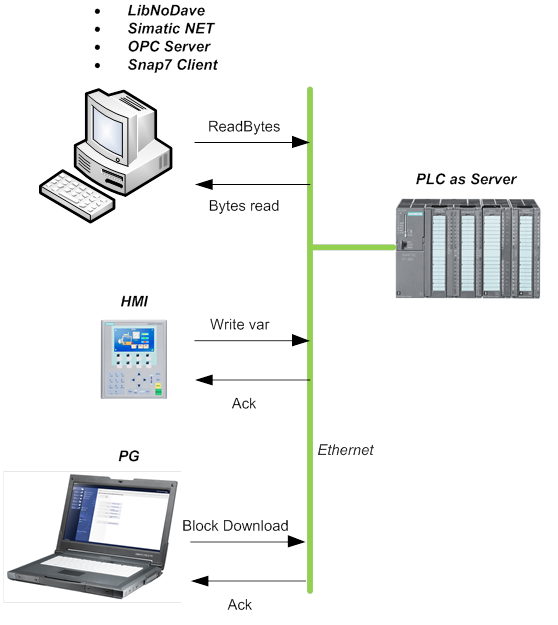
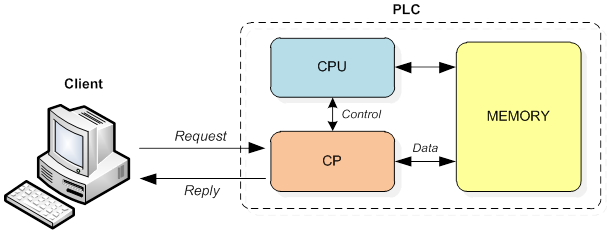
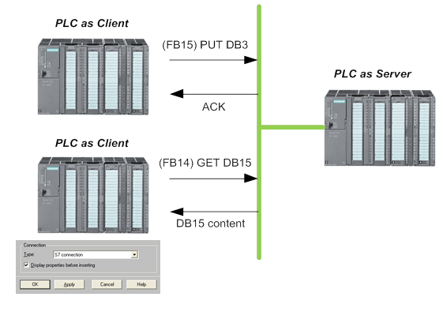
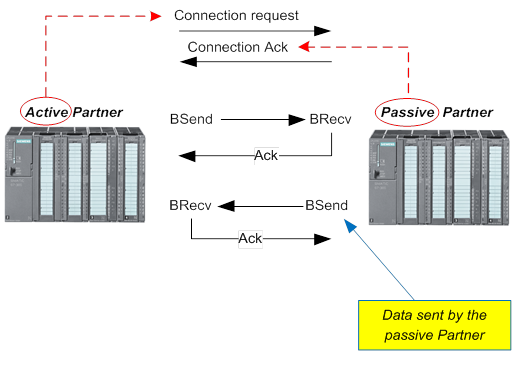

## 3. Siemen S7

### 3.1 Background

**Fieldbus** là một loại mạng công nghiệp, dùng để kết nối PLC với thiết bị hiện trường (sensor, actuator) hoặc giữa các PLC với nhau hoặc với các thiết bị công nghiệp khác. Trong đó mỗi chuẩn fieldbus định nghĩa luôn:

- loại cáp
- cách truyền tín hiệu
- giao thức truyền dữ liệu
- cách tổ chức mạng

Một số loại Fieldbus phổ biến:

|Tên Fieldbus | Cáp | Topology | Giao thức truyền thông |
|---|---|---|---|
| **PROFIBUS** | cáp RS-485 | bus | PROFIBUS | 
| **Modbus RTU** | cáp RS-485 | bus | Modbus |
| **CAN bus** | twisted pair | bus | CANopen, DeviceNet |

**Ethernet công nghiệp** là một loại mạng công nghiệp khác, nó sử dụng cáp Ethernet tiêu chuẩn. Các giao thức phổ biến chạy trên Ethernet công nghiệp bao gồm: EtherNet/IP, Modbus TCP, **PROFINET**, và **Siemens S7**.

Ưu điểm của mạng Ethernet công nghiệp là:


- Tốc độ cao, tương thích tốt hơn với các thiết bị IT, dễ dàng debug

- Chi phí rẻ hơn các loại fieldbus truyền thống do sử dụng hạ tầng Ethernet tiêu chuẩn, không yêu cầu các adapter chuyên dụng.

Các PLC của Siemens có thể giao tiếp trên cáp Ethernet vật lý sử dụng một trong 2 giao thức sau [[1]](#1):  

- **Open TCP/IP**: triển khai tiêu chuẩn của TCP/IP, nghĩa là PLC dùng TCP/IP bình thường. Khi này ta có thể triển khai chương trình như lập trình mạng thông thường dùng socker, TCP, UDP. Tuy nhiên, giao thức này chỉ truyền dữ liệu dưới dạng luồng (stream-based), mà các lệnh điều khiển của Siemens cần có độ dài cố định (Data Block), nên chương trình PLC FC (Function Code) và FB (Function Block) lập trình viên phải tự đóng gói message (packetize) từ dữ liệu stream thành các block.

- **S7 hay S7comm hoặc S7 Communication và bản nâng cấp sau này là S7 comm plus**: Đây là giao thức độc quyền của Siemens xuất hiện lần đầu vào năm 1994 cùng với sự ra đời của dòng sản phẩm Simatic S7-200, S7-300 và S7-400. Trong kiến trúc mạng công nghiệp, giao thức S7 hoạt động theo mô hình request-response. 

    *Một số tài liệu gọi bằng cái tên khác như mô hình client-server (với S7 chạy trên nền Ehternet hiện đại với hạ tầng mạng có switch có khả năng kết nối full-duplex) hoặc master-slave (Với S7 chạy trên mạng Fieldbus cũ như PROFIBUS với hạ tầng mạng chỉ là một bus chung duy nhất). Dù gọi là gì thì về bản chất, S7 vẫn tuân theo mô hình giao tiếp request-response, tức là một bên gửi yêu cầu và bên kia trả lời [[4]](#4).*

    S7 là giao thức hoạt động ở tầng 7. Tuy nhiên nó kéo dài xuống nhiều tầng dưới bằng cách tái sử dụng các giao thức ở tầng dưới. Điều này là vì ban đầu S7 không được thiết kế để chạy trên kiến trúc mạng TCP/IP. S7 ban đầu được thiết kế để chạy trên hạ tầng mạng Fieldbus như PROFIBUS hoặc MPI [[2]](#2), chúng sử dụng dây cáp công nghiệp chuyên dụng (thay vì dây LAN Etherner) để truyền dẫn.

    

    Tuy nhiên để tăng tính tương thích, S7 Comm được cải tiếp để chạy trên nền **ISO TCP** (theo tiêu chuẩn RFC 1006) mà giao thức ISO TCP này lại chạy trên **TCP/IP**. Theo thiết kế gốc thì mô hình ISO TCP là một giao thức dạng gói (packet-based) hay block oriented , tức là mỗi tin nhắn có độ dài rõ ràng. Mỗi block này được gọi là một **PDU (Protocol Data Unit)**. Độ dài của PDU này dựa vào bộ vi xử lý giao tiếp bên trong PLC (**communication processors (CP)**) và được đàm phán giữa các thiết bị khi thiết lập kết nối. 

### Cách đọc địa chỉ trong Siemen S7


Cú pháp: 


```
[Loại vùng nhớ] [Kích thước dữ liệu] [Địa chỉ byte].[Địa chỉ bit]
            │           │                   │           │
            │           │                   │           └── offset tính theo bit từ đầu Byte này
            │           │                   └────────────── offset tính theo Byte từ đầu vùng nhớ này
            │           └────────────────────────── X(bit) B(byte) W(word) D(dword) đây là số lượng dữ liệu muốn đọc
            └────────────────────────────────────── I Q M DB T C
```


Ký hiệu các kích thước:

|  Ký hiệu  |   Tên    |  Số bit  |  Ví dụ  |
|-----|---------|----------|----------|
|  X   |  Bit     |   1 bit (mặc định nếu không chỉ định kích thước trong cú pháp, dùng cho loại dữ liệu boolean)  | M0.3  (Merker byte 0, bit 3)    |
|  B   |  Byte    |   8 bit (Thường dùng cho số nguyên 0-255)  | MB5   (Merker Byte 5)           |
|  W   |  Word    |  16 bit (Thường dùng cho số nguyên lớn)  | MW10  (Merker Word tại byte 10) |
|  D   |  DWord   |  32 bit (Thường dùng cho số thực)  | MD20  (Merker DWord tại byte 20)|

Với vùng DB thì cú pháp đặc biệt hơn:


```
Bit:   DB[n].DBX [byte] . [bit]  
Byte:  DB[n].DBB [byte]         
Word:  DB[n].DBW [byte]         
DWord: DB[n].DBD [byte]        
```


Ví dụ:

- DB1.DBX0.0  → bit 0 của byte 0 trong DB1
- DB1.DBX0.1  → bit 1 của byte 0 trong DB1
  

*Siemens S7 sùng BIG ENDIAN (byte có trọng số cao nhất ở địa chỉ thấp nhất)*


Các kiểu dữ liệu trong DB:


|  Type   |  Size    |  Ghi chú                           |
|----------|---------|------------------------------------|
| BOOL    |  1 bit   | True/False                         |
| BYTE    |  1 byte  | 0-255, unsigned                    |
| INT     |  2 bytes | -32768 đến 32767, signed           |
| WORD    |  2 bytes | 0-65535, unsigned                  |
| DINT    |  4 bytes | -2^31 đến 2^31-1                   |
| DWORD   |  4 bytes | 0 đến 2^32-1                       |
| REAL    |  4 bytes | Float 32-bit (IEEE 754)            |
| STRING  | variable | [max_len][cur_len][chars...]        |
| S5TIME  |  2 bytes | Thời gian Siemens (định dạng riêng) |


### 3.2 Cấu trúc gói tin S7


#### 3.2.1  Phần COTP và TPKT


Trong giao thức ISO TCP mà S7 chạy trên đó, để ISO có thể tương thích với TCP vốn là:

1. Là giao thức hướng kết nối, trong khi ISO lại là giao thức không hướng kết nối (connectionless). Do đó ISO cần sử dụng thêm **COTP (Connection-Oriented Transport Protocol)**. COTP chịu trách nhiệm thiết lập kết nối logic giữa hai thực thể đầu cuối trước khi bất kỳ dữ liệu S7 nào được trao đổi giúp ISO TCP có khả năng định tuyến trên các mạng xa.

    Trong quá trình thiết lập kết nối COTP, tham số **TSAP (Transport Service Access Point)** đóng vai trò quan trọng trong việc định tuyến thông điệp đến đúng tiến trình bên trong CPU của PLC. Một TSAP thường bao gồm hai byte, trong đó cấu trúc của nó phản ánh loại giao tiếp và vị trí vật lý của CPU

    | Thành phần TSAP | Giá trị | Ý nghĩa |
    |----|-----|-----|
    |Byte 1 (Loại thiết bị)| `0x01`, `0x02`, `0x03`| `0x01` đại diện cho PG (Máy lập trình), `0x02` cho OP (Bảng vận hành), `0x03` cho các kết nối khác |
    |Byte 2 (Vị trí) | Bits `0`-`4` cho Slot, Bits `5`-`7` cho Rack| Xác định vị trí của CPU trong tủ điện (ví dụ: Rack 0, Slot 2)|


2. Là giao thức dạng luồng (stream-based) -> Sử dụng **TPKT (ISO Transport Service on top of TCP)** đóng vai trò làm vỏ bọc để giúp TCP (vốn là dạng luồng) có thể hiểu được các gói tin có độ dài cố định. 

    Cụ thể, ngăn xếp giao thức (protocol stack) của Siemens sẽ tự động chèn thêm một header TPKT vào trước dữ liệu COTP và S7. Nhiệm vụ của TPKT là nó đóng vai trò như một khung hình (framing). TPKT header có độ dài 4 byte, trong đó:
    - Byte đầu tiên của TPKT luôn là phiên bản (`0x03`)
    - Byte thứ hai là phần dự phòng, luôn là `0x00`
    - 2 byte cuối cùng quy định tổng độ dài của gói tin (bao gồm cả header và dữ liệu payload). Khi PLC nhận được dòng byte từ TCP stream, nó sẽ nhìn vào 4 byte này để biết được gói tin này dài bao nhiêu byte. Sau đó nó sẽ đợi cho đến khi nhận đủ số bytes rồi mới đẩy khối dữ liệu đó lên tầng trên (S7comm) để xử lý.


Kết quả là ta có một giao thức vừa có độ dài tin nhắn rõ ràng (ưu điểm ISO), vừa có thể đi xuyên qua các router mạng (ưu điểm TCP).

> [!NOTE]
> S7 hoạt động trên cổng TCP 102. COTP được định nghĩa trong RFC 905, TPKT được định nghĩa trong RFC 1006, cập nhật bởi RFC 2126

#### 3.2.2 Phần S7 PDU

Giao thức S7 được thiết kế theo hướng  Function oriented or Command oriented tức mỗi lần truyền sẽ bao gồm một lệnh điều khiển hoặc một phản hồi. Nếu command không vừa trong một PDU, nó sẽ được chia ra trên nhiều subsequent PDU.

Một command sẽ bao gồm:



- **Header**:

    

    Với:

    - `Protocol ID` (kích thước 1 Byte): Luôn luôn là `0x32` để định danh giao thức S7comm.

    - `Message Type` hoặc `Remote Operating Service Control (ROSCTR)`: Cho biết loại gói tin:
        
        | ROSCTR | Ý nghĩa |
        |---|---|
        | Job (1) | Yêu cầu từ Client tới Server như read/write memory, read/write blocks, start/stop device, setup communication |
        | Ack (2) | Xác nhận nhận được yêu cầu từ Server, không kèm theo dữ liệu|
        | Ack_Data (3) | Xác nhận nhận được yêu cầu từ Server, kèm theo dữ liệu trả về cho job request trước đó|
        | User_Data (7) | Đây là phần mở rộng so với giao thức gốc, sử dụng cho các chức năng nâng cao. Nó chứa Function Group bao gồm các chức năng: Programmer commands, Cyclic data, Block functions, CPU functions, Security, Time functions. Trong các function này lại bao gồm nhiều subfunction khác. Ví dụ như trong nhóm function CPU Functions lại có: Read SZL, Message service, ... |

    - `Reserved`: Luôn là `0x0000`, không có ý nghĩa gì.

    - `PDU Reference`: Một số do Client tạo ra để định danh yêu cầu. Khi PLC phản hồi, nó sẽ trả lại số này để Client biết được phản hồi này tương ứng với yêu cầu nào. Số refer nay tăng dần theo từng yêu cầu mới gửi đi.

    - `Parameter length`: Độ dài của phần tham số trong gói tin, tính theo byte, biểu diễn kiểu Big-Endian.

    - `Data length`: Độ dài của phần dữ liệu trong gói tin, tính theo byte, biểu diễn kiểu Big-Endian.

    - `Error class` và `Error code`: Chỉ xuất hiện trong các gói tin phản hồi `ROSCTR = Ack_Data`, cho biết có lỗi gì xảy ra không.

- **Tập các tham số** (Bao gồm tên các tham số và giá trị cho các tham số đó nếu có). Tùy theo loại command (được xác định thông qua trường `S7 Header Function Code`) mà bộ các tham số trong phần này sẽ khác nhau. Các command được chia thành các nhóm chức năng: Data Read/Write, Cyclic Data Read/Write, Directory info, System Info, Blocks move, PLC Control, Date and Time, Security, Programming.

### 3.3 Các bước thiết lập kết nối S7



*SampleCaptures/s7comm_reading_plc_status.pcap from https://wiki.wireshark.org/S7comm* với filter `tcp.port==102`

#### 3.3.1 Thiết lập kết nối tới TCP 102 bằng Three-way Handshake của TCP



*Three-way Handshake của TCP giữa `192.168.1.10` và PLC `192.168.1.40` ở gói tin 5, 6, 7*

#### 3.3.2 Thiết lập kết nối COTP

Sau khi kết nối TCP được thiết lập, Client sẽ gửi một yêu cầu kết nối **COTP CR** (COTP Connect Request) tới PLC. Yêu cầu này bao gồm thông tin về TSAP để định danh dịch vụ và vị trí CPU mà Client muốn giao tiếp.



*Gói tin số 8 chứa yêu cầu TPKT ở stack trên và COTP CR ở stack dưới*


```
TPKT, Version: 3, Length: 22
    Version: 3
    Reserved: 0
    Length: 22
```

- `Version: 3` là phiên bản của TPKT, luôn là 3 theo tiêu chuẩn RFC 1006. Đây là một giá trị cố định và không thay đổi, nó chỉ đơn giản báo hiệu rằng gói tin này tuân theo định dạng TPKT.

- `Length: 22` là tổng độ dài của gói tin TPKT, bao gồm cả header TPKT (4 byte) và phần dữ liệu (payload) của COTP CR (18 byte). Khi PLC nhận được gói tin này, nó sẽ đọc 4 byte đầu tiên để biết rằng tổng độ dài của gói tin là 22 byte. Sau đó, nó sẽ đợi cho đến khi nhận đủ 22 byte rồi mới xử lý phần dữ liệu COTP CR bên dưới. Nếu gói tin bị cắt ngắn hoặc có lỗi trong quá trình truyền dẫn, PLC sẽ không nhận được đủ số byte cần thiết và có thể bỏ qua gói tin đó hoặc gửi lại yêu cầu kết nối.


```
ISO 8073/X.224 COTP Connection-Oriented Transport Protocol
    Length: 17
    PDU Type: CR Connect Request (0x0e)
    Destination reference: 0x0000
    Source reference: 0x000f
    0000 .... = Class: 0
    .... ..0. = Extended formats: False
    .... ...0 = No explicit flow control: False
    Parameter code: src-tsap (0xc1)
    Parameter length: 2
    Source TSAP: 0100
    Parameter code: dst-tsap (0xc2)
    Parameter length: 2
    Destination TSAP: 0102
    Parameter code: tpdu-size (0xc0)
    Parameter length: 1
    TPDU size: 1024
```

Với:

- `PDU Type: CR Connect Request (0x0e)` cho biết đây là một yêu cầu kết nối COTP CR. Ngoài ra còn có `CC Connect Confirm (0x0d)` và `DT Data Transfer (0x0f)`

- `Destination reference: 0x0000`, `Source reference: 0x000f` là các trường định danh kết nối do COTP sử dụng để quản lý các kết nối logic. Source reference được Client tạo khi gửi yêu cầu kết nối, ban đầu Destination reference = 0 do chưa có session. Khi PLC nhận được yêu cầu này, nếu chấp nhận kết nối, nó sẽ phản hồi bằng một gói COTP CC (Connect Confirm) với trường Destination reference được gán bằng giá trị Source reference mà Client đã gửi (`0x000f`), và trường Source reference của PLC sẽ được gán một giá trị mới do PLC tạo ra. Hai bên dùng cặp này để quản lý session


- `Source TSAP: 0100` loại thiết bị kết nối tới PLC. Ở đây `0x01` đại diện cho PG (Máy lập trình).

- `Destination TSAP: 0102` giao tiếp tới CPU nằm ở Rack 0, Slot 2 của PLC.

- `TPDU size: 1024` là kích thước tối đa của TPDU mà client có thể gửi (TPUD là gói tin chứa TPKT + PDU của S7 comm).


Server phản hồi lại bằng một gói COTP CC (Connect Confirm) ở gói tin số 9


```
ISO 8073/X.224 COTP Connection-Oriented Transport Protocol
    Length: 17
    PDU Type: CC Connect Confirm (0x0d)
    Destination reference: 0x000f
    Source reference: 0x0003
    0000 .... = Class: 0
    .... ..0. = Extended formats: False
    .... ...0 = No explicit flow control: False
    Parameter code: tpdu-size (0xc0)
    Parameter length: 1
    TPDU size: 1024
    Parameter code: src-tsap (0xc1)
    Parameter length: 2
    Source TSAP: 0100
    Parameter code: dst-tsap (0xc2)
    Parameter length: 2
    Destination TSAP: 0102
```

- `Source reference: 0x0003` là giá trị PLC tạo ra để định danh nó trong session này. Client sẽ dùng giá trị này làm Destination reference trong các gói tin tiếp theo để gửi dữ liệu tới PLC.

#### 3.3.3 Thiết lập kết nối S7comm ban đầu

Bắt đầu thiết lập tới S7comm layer bằng cách gửi một yêu cầu thiết lập giao tiếp S7 **Setup Communication** (gói tin số 10), các tham số sẽ bao gồm:
    


Trong đó:

- `S7 Header Function Code`: Cho biết loại lệnh S7, ở đây là `0xF0` tương ứng với lệnh thiết lập liên kết S7 (Setup Communication)

- `Max AmQ calling`  quy định client gửi bao nhiêu request cùng lúc và `Max AmQ called`  quy định PLC xử lý bao nhiêu request cùng lúc. Tham số này sẽ được 2 bên đàm phán lúc thiết lập kết nối. Thường thì cả hai đều là 1, nghĩa là Client chỉ có thể gửi một yêu cầu mới sau khi nhận được phản hồi cho yêu cầu trước đó, và PLC sẽ xử lý tuần tự từng yêu cầu một. 

- `PDU length`: Độ dài tối đa của PDU mà PLC có thể xử lý. Tham số này cũng được đàm phán lúc thiết lập kết nối.

Wireshark đã được tích hợp sẵn bộ phân tích gói tin S7comm, nên nó có thể giải mã trực tiếp các trường dữ liệu của S7comm trong phần Parameter và Data của gói tin.

```
S7 Communication
    Header: (Job)
        Protocol Id: 0x32
        ROSCTR: Job (1)
        Redundancy Identification (Reserved): 0x0000
        Protocol Data Unit Reference: 512
        Parameter length: 8
        Data length: 0
    Parameter: (Setup communication)
        Function: Setup communication (0xf0)
        Reserved: 0x00
        Max AmQ (parallel jobs with ack) calling: 1
        Max AmQ (parallel jobs with ack) called: 1
        PDU length: 480
```

Với:

- `Protocol Id: 0x32` là mã định danh cho giao thức S7comm.
- `ROSCTR: Job (1)` cho biết đây là một gói tin loại Job, tức là một yêu cầu từ Client tới Server. 

- `Protocol Data Unit Reference: 512` là một số tham chiếu do Client tạo ra để quản lý các yêu cầu. Client sẽ gán một số khác nhau cho mỗi yêu cầu gửi đi, và khi PLC phản hồi, nó sẽ trả lại số này để Client biết được phản hồi này tương ứng với yêu cầu nào.

- `Parameter length: 8` và `Data length: 0` cho biết phần tham số của gói tin dài 8 byte, trong khi phần dữ liệu là 0 byte

- `Function: Setup communication (0xf0)` cho biết đây là một yêu cầu thiết lập giao tiếp S7.

- `Max AmQ (parallel jobs with ack) calling: 1`, `Max AmQ (parallel jobs with ack) called: 1` Cả hai đều là 1, nghĩa là Client chỉ có thể gửi một yêu cầu mới sau khi nhận được phản hồi cho yêu cầu trước đó, và PLC sẽ xử lý tuần tự từng yêu cầu một. 

- `PDU length: 480` là kích thước tối đa của payload 1 gói S7 mà client mong muốn tính theo Byte. 

Nhận được gói tin, PLC phản hồi ở gói tin số 11:

```
S7 Communication
    Header: (Ack_Data)
        Protocol Id: 0x32
        ROSCTR: Ack_Data (3)
        Redundancy Identification (Reserved): 0x0000
        Protocol Data Unit Reference: 512
        Parameter length: 8
        Data length: 0
        Error class: No error (0x00)
        Error code: 0x00
    Parameter: (Setup communication)
        Function: Setup communication (0xf0)
        Reserved: 0x00
        Max AmQ (parallel jobs with ack) calling: 1
        Max AmQ (parallel jobs with ack) called: 1
        PDU length: 240
```

Với `Protocol Data Unit Reference: 512` refer tới id của gói tin request trước đó, `ROSCTR: Ack_Data (3)` để xác nhận yêu cầu thiết lập giao tiếp đã được chấp nhận và không có lỗi nào xảy ra (`Error class: No error (0x00)`, `Error code: 0x00`). PLC chấp nhận các thông số kết nối mà Client đề xuất, trừ thông số PDU length được PLC giảm xuống còn `240` Byte.

#### 3.3.4 Trao đổi dữ liệu S7

Sau khi thiết lập xong kết nối S7, hai bên có thể bắt đầu trao đổi dữ liệu** bằng các lệnh của S7 như Read/Write Var, ReadSZL, ... Tuỳ mỗi lệnh mà cấu trúc gói tin sẽ khác nhau.


### 3.4 Các thành phần trong giao tiếp S7

Có 3 actor trong giao tiếp S7:

- **Client**: Thường là HMI, SCADA hoặc một máy trạm kỹ thuật (Engineering Station) có nhiệm vụ giám sát và điều khiển PLC. Client sẽ gửi các lệnh đọc/ghi dữ liệu, yêu cầu thực thi chương trình, hoặc thay đổi cấu hình của PLC.


- **Server**: Đây chính là PLC. Nó nhận các yêu cầu từ Client, thực thi chúng và trả về kết quả. Server sẽ xử lý các lệnh như đọc/ghi dữ liệu, thực thi chương trình, hoặc cung cấp thông tin về trạng thái của PLC. PLC giao tiếp thông qua **CP (Communication Processor)**, một module chuyên dụng để xử lý giao tiếp mạng. CP sẽ nhận các gói tin S7 từ mạng, giải mã chúng và chuyển tiếp đến CPU của PLC để thực thi. Sau khi CPU xử lý xong, kết quả sẽ được gửi lại qua CP để trả về cho Client.


    

    Kiến trúc bên trong PLC Server

    


Hoặc PLC cũng có thể đóng vai trò là Client khi nó cần giao tiếp với một PLC khác để lấy dữ liệu hoặc gửi lệnh điều khiển thông qua Get/Put:




- **Partner**: Giống kiến trúc peer-to-peer, tức một khi đã thiết lập kết nối, cả 2 bên đều có thể gửi dữ liệu tới bên còn lại mà không cần phải tuân theo mô hình request-reply như bên trên. *Trong các tài liệu của hướng dẫn của Siemens, họ dùng thuật ngữ **Client-Client** cho khái niệm này.* PLC gửi yêu cầu thiết lập kết nối gọi là **Active Connection** và PLC nhận yêu cầu thiết lập kết nối gọi là **Passive Connection**, sau đó 2 bên giao tiếp với nhau thông qua lệnh BSend/BRecv. Khi PLC A gọi BSend thì PLC B cũng phải gọi Brecv cùng một lúc để hoàn thành transaction.




