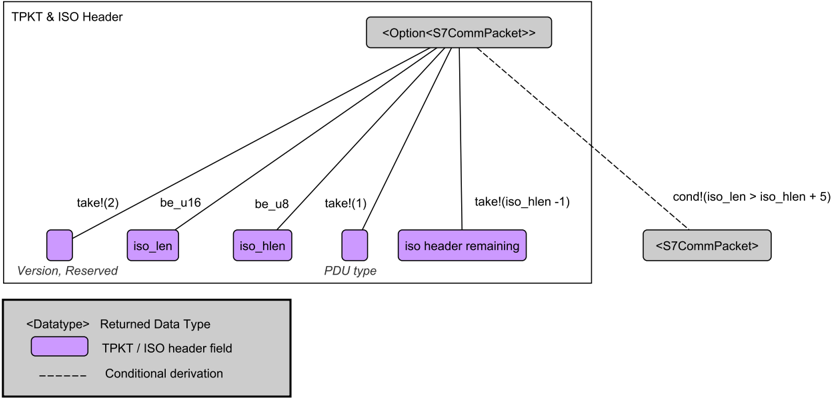
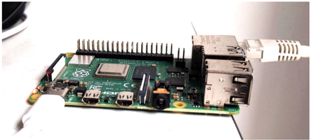
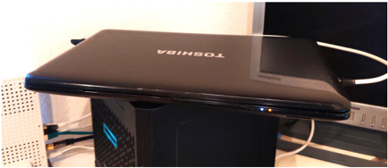

## ICS protocol dissectors for signature-based NIDS

Master's Thesis of

Maxime Fabian Veit at the Department of Informatics. Institute of Telematics Decentralized Systems and Network Services Research Group

in cooperation with Federal Office for Information Security (BSI)

1st January 2021 - 30th June 2021

Notice: This work was supplemented with additional information at the request of the BSI after submission. Personal data not relevant to the research was removed prior to publication.

Hinweis: Die Arbeit wurde auf Wunsch des BSI nach der Abgabe um weitere Informationen ergänzt. Personenbezogene Daten, die nicht forschungsrelevant sind, wurden vor der Veröffentlichung entfernt.

## Abstract

Intrusion control systems (ICS) are used in various industries, including critical infrastructures, the security against attacks is of particular importance. Network Intrusion Detection Systems, which can use protocol-specific dissectors, are particularly suitable for this, as they can prevent attack attempts without interfering with the ICS. This work investigates the question under which conditions rules based on ICS-protocol-specific dissector should be preferred over the rules based on the TCP payload provided by the transport layer dissector. This work evaluates aspects of security, usability and especially the performance regarding the scope of functions of the dissector. Therefore an ICSprotocol dissector for the S7Comm protocol is implemented and evaluated together with an SSH dissector in different scenarios. Further influencing factors that could interfere with the processing-performance, but also the detection accuracy are investigated.

It has been shown that there is a trade-off between the provided functionality like dynamic parsing, which can improve the detection accuracy, and the processing-performance. Furthermore processing-performance can be improved by tuning, optimized rules and the usage of multiple CPU cores. Missing TCP packets or an unestablished TCP connection can influence detection accuracy while rules based on the TCP payload can be vulnerable to padding and evasion attacks. Also an iterative development process for the development of dissectors for IDS is presented. Quality characteristics and the cyclic steps for the dissector development are introduced.

In summary, in this work the development decisions and usage of protocol-specific dissectors in IDS are evaluated and compared to the usage of the TCP-level payload using the aspects of Security, Usability and especially Performance.

## Zusammenfassung

Intrusion Control Systems (ICS) werden in verschiedenen Bereichen eingesetzt, darunter auch in kritischen Infrastrukturen, die Sicherheit gegen Angriffe ist daher von besonderer Bedeutung. Network Intrusion Detection Systems, die protokollspezifische Dissektoren verwenden, eignen sich besonders dafür, da sie Angriffsversuche erkennen, ohne in das ICS direkt einzugreifen. Diese Arbeit untersucht die Frage, unter welchen Bedingungen Regeln die auf ICS-Protokoll-spezifischen Dissektoren basieren den Regeln vorgezogen werden sollten, die auf TCP-Payload basieren. In dieser Arbeit werden Aspekte der Sicherheit, der Usability und insbesondere der Performance hinsichtlich des Funktionsumfangs des Dissektors bewertet. Dazu wird ein ICS-Protokoll-Dissektor für das S7Comm-Protokoll implementiert und zusammen mit einem SSH-Dissektor in verschiedenen Szenarien evaluiert. Weitere Einflussfaktoren, die die Verarbeitungsgeschwindigkeit, aber auch die Verarbeitungsperformance beeinträchtigen können, werden untersucht.

Es hat sich gezeigt, dass es einen Kompromiss zwischen der zur Verfügung gestellten Funktionalität wie etwa dynamischem Parsen, welche die Erkennungsgenauigkeit verbessern können, und der Verarbeitungsperformance gibt. Darüber hinaus kann die Verarbeitungsperformance durch Tuning, optimierte Regeln und die Nutzung mehrerer CPU-Kerne verbessert werden. Fehlende TCP-Pakete oder eine nicht aufgebaute TCPVerbindung können die Erkennungsgenauigkeit beeinflussen, während Regeln, die auf der TCP-Nutzlast basieren, anfällig für Padding- und Evasion-Angriffe sein können. Auch ein iteratives Vorgehensmodell für die Entwicklung von Dissektoren in IDS wird vorgestellt. Es werden Qualitätsmerkmale und die zyklischen Schritte für die Dissektorenentwicklung vorgestellt.

Zusammenfassend werden in dieser Arbeit der Entwicklungsentscheidungen und die Verwendung von protokollspezifischen Dissektoren in IDS evaluiert und mit der Verwendung des TCP Payloads unter den Aspekten Sicherheit, Usability und insbesondere Performance verglichen.

## Contents

| Abstract                      | Abstract                      | Abstract                                           | Abstract                                           | i    |
|-------------------------------|-------------------------------|----------------------------------------------------|----------------------------------------------------|------|
| Zusammenfassung               | Zusammenfassung               | Zusammenfassung                                    | Zusammenfassung                                    | iii  |
|                               | List of                       | Abbreviations                                      |                                                    | xiii |
| 1. Introduction               | 1. Introduction               | 1. Introduction                                    | 1. Introduction                                    | 1    |
|                               | 1.1.                          | Objective and Contribution .                       | . . . .                                            | 1    |
|                               | 1.2.                          | Outline . . . . . . . . . . .                      | . . . . .                                          | 2    |
| 2. Fundamentals &Related Work | 2. Fundamentals &Related Work | 2. Fundamentals &Related Work                      | 2. Fundamentals &Related Work                      | 3    |
|                               | 2.1.                          | Industrial Control Systems .                       | . . . .                                            | 3    |
|                               |                               | 2.1.1.                                             | IT and OT in Comparison .                          | 4    |
|                               |                               | 2.1.2.                                             | ICS Enterprise Architecture                        | 5    |
|                               | 2.2.                          | S7Comm Protocol Stack .                            | . . . . . .                                        | 6    |
|                               | 2.3.                          | Intrusion Detection Systems .                      | . . .                                              | 8    |
|                               |                               | 2.3.1.                                             | Rules in signature-based NIDS                      | 9    |
|                               |                               | 2.3.2.                                             | Security in NIDS . . . . . .                       | 10   |
|                               | 2.4.                          | Suricata . . . . . . . . . . . . . .               | . .                                                | 11   |
|                               | 2.5.                          | Related Work . . . .                               | . . . . . . . . .                                  | 12   |
| 3. Methodology                | 3. Methodology                | 3. Methodology                                     | 3. Methodology                                     | 15   |
|                               | 3.1.                          | Hypotheses . . . . . . . . .                       | . . . . .                                          | 15   |
|                               | 3.2.                          | Evaluation setup . . .                             | . . . . . . . .                                    | 18   |
|                               |                               | 3.2.1.                                             | Testbed . . . . . . . . . . .                      | 20   |
|                               |                               | 3.2.2.                                             | Rulesets . . . . . . . . . . .                     | 21   |
|                               |                               | 3.2.3.                                             | Dataset . . . . . . . . . . .                      | 21   |
|                               |                               | 3.2.4.                                             | Metrics . . . . . . . . . . . .                    | 23   |
|                               |                               | 3.2.5.                                             | Code bases . . . . . . . . .                       | 23   |
| Implementation                | Implementation                | Implementation                                     | Implementation                                     | 25   |
|                               | 4.1.                          | S7Comm Protocol and Information Management .       | S7Comm Protocol and Information Management .       | 26   |
|                               | 4.2.                          | Rust data types . . . . . .                        | . . . . . .                                        | 27   |
|                               | 4.3.                          | AppLayer Parser Data Structure and Callbacks . . . | AppLayer Parser Data Structure and Callbacks . . . | 28   |
|                               | 4.4.                          | Packet Parser Data Structure                       | . . . .                                            | 31   |
|                               |                               | 4.4.1.                                             | Data structure . . . . . . . .                     | 31   |
|                               |                               | 4.4.2.                                             | Parsing with Nom . . . . .                         | 34   |
|                               |                               | 4.4.3.                                             | Logger . . . . . . . . . . . .                     | 37   |

| 4.5.   | Detector . . . . . . . . . . . . . . . . . . . . . . . . . . . . . . .   | . . . . .                                                                       | 40   |
|--------|--------------------------------------------------------------------------|---------------------------------------------------------------------------------|------|
|        | 4.5.1.                                                                   | Detector callbacks and tuning . . . . . . . . . . . . . . . . . . . .           | 41   |
|        | 4.5.2.                                                                   | Provided keywords . . . . . . . . . . . . . . . . . . . . . . . . . .           | 42   |
|        | 4.5.3.                                                                   | Rulefile optimization . . . . . . . . . . . . . . . . . . . . . . . . .         | 44   |
| 4.6.   | Implemented supporting tools . .                                         | . . . . . . . . . . . . . . . . . . . . . .                                     | 44   |
|        | 4.6.1.                                                                   | Byte pattern rule converter . . . . . . . . . . . . . . . . . . . . .           | 44   |
|        | 4.6.2.                                                                   | Byte pattern alert comparison . . . . . . . . . . . . . . . . . . . .           | 44   |
|        | 4.6.3.                                                                   | Synthetic TCP handshake . . . . . . . . . . . . . . . . . . . . . .             | 45   |
|        | 4.6.4.                                                                   | Synthetic TCP stream extension . . . . . . . . . . . . . . . . . . .            | 45   |
|        | 4.6.5.                                                                   | Merging PCAP files . . . . . . . . . . . . . . . . . . . . . . . . . .          | 46   |
|        | 4.7.                                                                     | Summary on how to implement a dissector in Suricata . . . . . . . . . .         | 46   |
|        | 4.7.1.                                                                   | Preparation . . . . . . . . . . . . . . . . . . . . . . . . . . . . . .         | 46   |
|        | 4.7.2.                                                                   | Suricata structure and naming conventions . . . . . . . . . . . .               | 47   |
| 5.     | Evaluation                                                               | Evaluation                                                                      | 53   |
|        | 5.1. Preconditions . .                                                   | . . . . . . . . . . . . . . . . . . . . . . . . . . . . . . .                   | 53   |
|        | 5.2.                                                                     | Hypothesis evaluation . . . . . . . . . . . . . . . . . . . . . . . . . . . . . | 53   |
|        | 5.2.1.                                                                   | Comparison for regular ICS-Traffic (H1 & H2) . . . . . . . . . . .              | 53   |
|        | 5.2.2.                                                                   | Comparison of processing-performance on the same codebase (H3)                  | 54   |
|        | 5.2.3.                                                                   | Comparison for similar ICS-protocol traffic (H4) . . . . . . . . . .            | 56   |
|        | 5.2.4.                                                                   | Replication and comparison for SSH protocol . . . . . . . . . . .               | 57   |
|        | 5.3.                                                                     | Descriptive analysis of influencing factors . . . . . . . . . . . . . . . . .   | 57   |
|        | 5.3.1.                                                                   | Dissector overhead on different levels (d1-d3) . . . . . . . . . . .            | 58   |
|        | 5.3.2.                                                                   | Impact of implementation decisions on the parsing level (d4 & d5)               | 60   |
|        | 5.3.3.                                                                   | Improvement of tuning on detection level (d6 & d7) . . . . . . . .              | 61   |
|        | 5.3.4.                                                                   | Improvement and comparison for usage of multiple CPU cores (d8)                 | 62   |
|        |                                                                          | . . . . . . . . . . . . . . . . . . . . . . . . . . . . . . . . . . .           |      |
|        | 5.4. Conclusion                                                          | 5.4. Conclusion                                                                 | 64   |
| 6.     | Development Process                                                      | Development Process                                                             |      |
| 6.1.   | Application of the ISO Product Quality Model . . . .                     | . . . . . . . . . . .                                                           | 65   |
|        | 6.1.1.                                                                   | Function suitability . . . . . . . . . . . . . . . . . . . . . . . . . .        | 65   |
|        | 6.1.2.                                                                   | Performance efficiency . . . . . . . . . . . . . . . . . . . . . . . .          | 66   |
|        | 6.1.3.                                                                   | Usability . . . . . . . . . . . . . . . . . . . . . . . . . . . . . . . .       | 67   |
|        | 6.1.4.                                                                   | Reliability . . . . . . . . . . . . . . . . . . . . . . . . . . . . . . .       | 68   |
|        | 6.1.5.                                                                   | Security . . . . . . . . . . . . . . . . . . . . . . . . . . . . . . . .        | 69   |
|        | 6.1.6.                                                                   | Maintainability . . . . . . . . . . . . . . . . . . . . . . . . . . . .         | 70   |
| 6.2.   | Dissector development as an iterative process . . . . . . . . . .        | . . . . .                                                                       | 70   |
|        | 6.2.1.                                                                   | Dissector required? . . . . . . . . . . . . . . . . . . . . . . . . . .         | 71   |
|        | 6.2.2.                                                                   | Information management . . . . . . . . . . . . . . . . . . . . . .              | 74   |
|        | 6.2.3.                                                                   | Design . . . . . . . . . . . . . . . . . . . . . . . . . . . . . . . . .        | 76   |
|        | 6.2.4.                                                                   | Implementation . . . . . . . . . . . . . . . . . . . . . . . . . . . .          | 76   |
|        | 6.2.5.                                                                   | Testing . . . . . . . . . . . . . . . . . . . . . . . . . . . . . . . . .       | 77   |
|        | 6.2.6.                                                                   | Evaluation . . . . . . . . . . . . . . . . . . . . . . . . . . . . . . .        | 77   |

| 7. Discussion   | 7. Discussion   | 7. Discussion                           |   79 |
|-----------------|-----------------|-----------------------------------------|------|
|                 | 7.1.            | Performance evaluation . . . .          |   79 |
|                 |                 | 7.1.1. Processing-Performance           |   80 |
|                 |                 | 7.1.2. Detection accuracy . .           |   80 |
|                 |                 | 7.1.3. Peculiarities of the application |   81 |
|                 |                 | 7.1.4. Implication for the performance  |   81 |
|                 | 7.2.            | Usability . . . . . . . . . . . .       |   82 |
|                 | 7.3.            | Implications for security . . .         |   83 |
|                 | 7.4.            | Decision-making . . . . . . . .         |   84 |
|                 | 7.5.            | Limitations and future work .           |   85 |
| 8.              | Conclusion      |                                         |   87 |
| Bibliography    | Bibliography    | Bibliography                            |   89 |
| A.              | Appendix        | Appendix                                |   93 |
|                 | A.1.            | Experiment results . . . . . . .        |   93 |
|                 | A.2.            | Rulefiles . . . . . . . . . . . .       |   98 |
|                 |                 | A.2.1. SSH . . . . . . . . . .          |   98 |
|                 |                 | A.2.2. S7Comm . . . . . . . .           |   98 |

## List of Figures

| 2.1.   | ICS control loop (see [12, Figure 1]) . . . . . . . . . . . . . . . . . . . . .                                                                            |   3 |
|--------|------------------------------------------------------------------------------------------------------------------------------------------------------------|-----|
| 2.2.   | Purdue Enterprise Reference Architecture [4] . . . . . . . . . . . . . . . .                                                                               |   5 |
| 2.3.   | S7Comm Protocol in OSI Model [1] . . . . . . . . . . . . . . . . . . . . .                                                                                 |   7 |
| 2.4.   | S7Comm PLC password request structure . . . . . . . . . . . . . . . . . .                                                                                  |   8 |
| 2.5.   | Basic depiction of the signature-based Network Intrusion Detection System (NIDS) . . . . . . . . . . . . . . . . . . . . . . . . . . . . . . . . . . . . . |   8 |
| 3.1.   | Investigated scenarios and related hypothesis . . . . . . . . . . . . . . .                                                                                |  15 |
| 3.2.   | Experiment setup for the hypothesis H1-H4 . . . . . . . . . . . . . . . .                                                                                  |  18 |
| 4.1.   | Dissector parts in the IDS flow (see [15, Figure 1]) . . . . . . . . . . . . .                                                                             |  25 |
| 4.2.   | Relations in data structure on AppLayer Parser Level . . . . . . . . . . .                                                                                 |  29 |
| 4.3.   | Data structure of internal representation . . . . . . . . . . . . . . . . . .                                                                              |  31 |
| 4.4.   | Parser data structure of S7Comm userdata parameters . . . . . . . . . . .                                                                                  |  32 |
| 4.5.   | Parser data structure of S7Comm normal parameters . . . . . . . . . . .                                                                                    |  33 |
| 4.6.   | Parser data structure of S7Comm data . . . . . . . . . . . . . . . . . . . .                                                                               |  34 |
| 4.7.   | Nom parsing structure of Transport Packet (TPKT) and International Or- ganization for Standardization (ISO) parts . . . . . . . . . . . . . . . . . .      |  36 |
| 4.8.   | Nom parsing structure of S7Comm header . . . . . . . . . . . . . . . . .                                                                                   |  37 |
| 4.9.   | Nom parsing structure of S7Comm Job Request and Ack Data . . . . . .                                                                                       |  38 |
| 4.10.  | Nom parsing structure of S7Comm header . . . . . . . . . . . . . . . . .                                                                                   |  39 |
| 4.11.  | Example of JavaScript Object Notation (JSON)-Output line in Suricata Extensible Event Format (EVE)-log . . . . . . . . . . . . . . . . . . . . .           |  40 |
| 4.12.  | Example of different kinds of keywords . . . . . . . . . . . . . . . . . . .                                                                               |  40 |
| 5.1.   | Comparison of rules based on SSH-protocol-specific keywords and rules based on TCP-level byte patterns. Error bars show the standard deviation.            |  57 |
| 5.2.   | Comparison of ability levels of SSH and S7Comm dissector . . . . . . . .                                                                                   |  58 |
| 5.3.   | Comparing dynamic and stateful parsing on Raspberry Pi . . . . . . . . .                                                                                   |  60 |
| 5.4.   | Comparison with untuned detector and tuned rules on Raspberry Pi . . .                                                                                     |  62 |
| 5.5.   | Comparison with runtime between single- and multi-core (7 CPU threads) usage for dissector on Computer testbed . . . . . . . . . . . . . . . . . .         |  62 |
| 5.6.   | Comparing with runtime ratio between rules based on TCP-level keywords and ICS-protocol-specific keywords for single and multi cores on Computer           |  63 |
| 6.1.   | Iterative process of dissector development . . . . . . . . . . . . . . . . .                                                                               |  71 |
| 6.2.   | Data used in the four edge cases . . . . . . . . . . . . . . . . . . . . . . .                                                                             |  78 |
| 7.1.   | Dependency graph for NIDS security . . . . . . . . . . . . . . . . . . . .                                                                                 |  84 |

| 8.1.   | Aspects for assessment of the appropriate procedure . . . . . . . . . . . 88      |
|--------|-----------------------------------------------------------------------------------|
| A.1.   | Testbed Raspberry Pi . . . . . . . . . . . . . . . . . . . . . . . . . . . . . 93 |
| A.2.   | Testbed Computer . . . . . . . . . . . . . . . . . . . . . . . . . . . . . . . 93 |

## List of Tables

| 3.1.   | Setup for each scenario visualized in Figure 3.1 . . . . . . . . . . . . . .                                                                                                                                              |   19 |
|--------|---------------------------------------------------------------------------------------------------------------------------------------------------------------------------------------------------------------------------|------|
| 4.1.   | Excerpt from the S7Comm information sources in comparison . . . . .                                                                                                                                                       |   27 |
| 5.1.   | Comparison of runtime (in ms) of both rulesets . . . . . . . . . . . . .                                                                                                                                                  |   54 |
| 5.2.   | Comparison of runtime (in ms) of rules based on ICS-protocol-specifc keywords, using stateful dissector with optimized rules, and TCP-level byte patterns (*=significant) . . . . . . . . . . . . . . . . . . . . . . . . |   54 |
| 5.3.   | Runtime (in ms) of rules based on ICS-protocol-specific keywords is sig- nificantly faster when comparing on same setup (*=significant) . . . . .                                                                         |   55 |
| 5.4.   | Comparing CPU Ticks / Rule (in million) of rules based on ICS-protocol- specific keywords and TCP-level byte patterns on Computer . . . . . .                                                                             |   55 |
| 5.5.   | Comparing runtime (in ms) on similar ICS traffic (*=significant) . . . .                                                                                                                                                  |   56 |
| 5.6.   | runtime (in ms) comparison of SSH-protocol-specific keywords and rules based on TCP-level byte patterns . . . . . . . . . . . . . . . . . . . . .                                                                         |   58 |
| 5.7.   | runtime (in ms) and overhead of different ability levels on Raspberry Pi (sd<1091ms) . . . . . . . . . . . . . . . . . . . . . . . . . . . . . . . . .                                                                    |   58 |
| 5.8.   | The time in seconds needed to read each dataset based on the read speed of the disk . . . . . . . . . . . . . . . . . . . . . . . . . . . . . . . . . .                                                                   |   59 |
| 5.9.   | runtime (in ms) and overhead of different ability levels on the Computer testbed (sd<629ms) . . . . . . . . . . . . . . . . . . . . . . . . . . . . .                                                                     |   59 |
| 5.10.  | runtime (in ms) and overhead of different ability levels for SSH dissector (sd<691ms) . . . . . . . . . . . . . . . . . . . . . . . . . . . . . . . . . .                                                                 |   60 |
| 5.11.  | Comparing runtime to dynamic and stateful parsing (sd<1254ms) . . .                                                                                                                                                       |   61 |
| 5.12.  | Comparing runtime (in ms) improvement by tuning the dissector and tuning rules (sd<1103ms) . . . . . . . . . . . . . . . . . . . . . . . . . .                                                                            |   61 |
| 5.13.  | Comparing Memory usage(in kb) of the tuned basic dissector and the untuned dissector . . . . . . . . . . . . . . . . . . . . . . . . . . . . . .                                                                          |   62 |
| 5.14.  | Comparing runtime (in ms) of dissector for single and multi cores . . .                                                                                                                                                   |   63 |
| 5.15.  | Comparison of runtime (in ms) of rules based on TCP-level keywords and ICS-protocol-specific keywords for single and multi cores on Computer                                                                              |   63 |
| 6.1.   | List of Packet Capture (PCAP) file sources . . . . . . . . . . . . . . . .                                                                                                                                                |   75 |
| A.1.   | Experiment results of CPU Ticks / Rule (in millions) - Erroneous values for Raspberry Pi . . . . . . . . . . . . . . . . . . . . . . . . . . . . . . .                                                                    |   93 |
| A.2.   | Experiment results of runtime (in milliseconds) for Raspberry Pi . . . .                                                                                                                                                  |   94 |
| A.3.   | Experiment results of runtime (in milliseconds) for Computer . . . . .                                                                                                                                                    |   95 |

| A.4.   | Experiment results of memory usage for Suricata process (in milliseconds)                                                                                |    |
|--------|----------------------------------------------------------------------------------------------------------------------------------------------------------|----|
|        | for Raspberry Pi . . . . . . . . . . . . . . . . . . . . . . . . . . . . . . . .                                                                         | 96 |
| A.5.   | Experiment results of memory usage(in kilobytes) for Suricata process (in milliseconds) for Computer . . . . . . . . . . . . . . . . . . . . . . . . . . | 97 |

## List of Abbreviations

| ALDI Additional Layer of Detection for ICS   |
|----------------------------------------------|
| BSI Federal Office for Information Security  |
| CRC Cyclic Redundancy Check                  |
| CI Critical Infrastructure                   |
| COTP Connection Oriented Transport Protocol  |
| CLNP Connectionless-mode Network Service     |
| CPU Central Processing Unit                  |
| CPS Cyber-Physical Systems                   |
| DCS Distributed Control System               |
| DFA Deterministic Finite Automaton           |
| DOS Denial-of-service                        |
| DMZ Demilitarized Zone                       |
| EVE Extensible Event Format                  |
| EWS Engineering Workstation                  |
| FDL Field bus Data Link                      |
| GPU Graphics Processing Unit                 |
| HIDS Host Intrusion Detection System         |
| HMI Human Machine Interface                  |
| ICS Industrial Control Systems               |
| ID Identifier                                |
| IDS Intrusion Detection System               |
| IP Internet Protocol                         |
| IPS Intrusion Prevention System              |

| ISO International Organization for Standardization              |
|-----------------------------------------------------------------|
| IT Information Technology                                       |
| JSON JavaScript Object Notation                                 |
| MPI Message Passing Interface                                   |
| MPM Multi-Pattern-Matcher                                       |
| NIDS Network Intrusion Detection System                         |
| NSM Network Security Monitoring                                 |
| OISF Open Information Security Foundation                       |
| OSI Open Systems Interconnection                                |
| OS Operating System                                             |
| OT Operational Technology                                       |
| PCAP Packet Capture                                             |
| PERA Purdue Enterprise Reference Architecture                   |
| PDU Protocol Data Unit                                          |
| PLC Programmable Logic Controller                               |
| RAM Random Access Memory                                        |
| RFC Request for Comments                                        |
| RFU Reserved for Future Use                                     |
| RTU Remote Terminal Unit                                        |
| SCADA Supervisory Control and Data Acquisition                  |
| SDHC Secure Digital High Capacity                               |
| SID Security Identifier                                         |
| SIEM Security Information and Event Management                  |
| SSD Solid State Drive                                           |
| SSH Secure Shell Protocol                                       |
| TCP Transmission Control Protocol                               |
| SQuaRE Systems and software Quality Requirements and Evaluation |

TCP-PKT Transmission Control Protocol Packet

TPKT Transport Packet

UDP User Datagram Protocol

VM Virtual Machine

## 1. Introduction

Industrial Control Systems (ICS) control and monitor industrial Cyber-Physical Systems (CPS), which are formed by networked embedded devices. On the one hand, CPS are characterized by their high degree of complexity and on the other hand by their direct impact on the physical world. ICS are used in various industries, including critical infrastructures. A failure can therefore not only cause financial damage but also pose a threat to public safety [30]. In addition to the major effects of failures, such systems are increasingly subject to attacks [14]. Given that attacks on ICS not only have a high damage potential but also a high probability of occurrence, it is of paramount importance to establish countermeasures.

ICS usually do not have their own security mechanisms and an active intervention by an antivirus system could threaten the real-time requirements [17, p. 2]. The sole use of firewalls is generally considered insufficient as the concept of perimeter security cannot cope with the complexity of today's networks [19]. Using Network Intrusion Detection Systems (NIDS), attack attempts can be detected early without interfering with the ICS itself. Signature-based NIDS consists of predefined rules, which use features of a data stream to designate specific network behavior as malicious. The features are parsed from the raw stream of data by the dissectors.

Dissectors parse protocols on a specific layer. In some scenarios it might be enough to write rules based on the features provided by the transport layer dissector, but for rules that operate on complex, dynamic data structures, a specific dissector for the application layer protocol is required. Obviously there are two approaches existing at this point: using a protocol-specific dissector or working on the transport layer dissector. First the crucial question is if a protocol dissector is required. However it might be not possible to answer this question in general, but it can be investigated under which conditions an ICS-protocolspecific dissector can be preferred over the transport layer dissector . This leads to the question of which functions the protocol-specific dissector entails and which it should. On the other hand the processing-performance aspect is in the focus. The performance comprises the processing-performance and the accuracy of the intrusion detection. As systems are limited in the resource utilization the, processing-performance can be the crucial factor for the accuracy. These questions are relevant for both the use of a NIDS and also for the development of a dissector for an NIDS.

## 1.1. Objective and Contribution

The objective of this work is to investigate the differences between the approach of working with a transport layer dissector and the protocol-specific dissector. This includes the functionalities a dissector entails in consideration of processing-performance. However,

this is not only important for the choice between these two approaches, but it addresses also the decisions which have to be made when developing such a dissector. Therefore it is an objective of this work to create a development process which discusses the steps that must be passed in relation to quality standards. In this scope also a dissector for the commonly used S7Comm protocol is implemented. This dissector is later evaluated to answer the mentioned research question of under which conditions the protocol-specific dissector is preferred over the transport layer dissector. Therefore the dissector processingperformance is evaluated in different scenarios in different variations.

## 1.2. Outline

- Chapter 2 In this chapter the fundamentals about Industrial Control Systems, the Siemens S7Comm protocol and Intrusion Detection Systems are imparted. Also an overview over related work is given.
- Chapter 3 In this chapter the methodology for addressing the research question is explained. Therefore the hypotheses and the evaluation setup are introduced.
- Chapter 4 The developed dissector for the S7Comm protocol and its variants are explained in this chapter. Especially development decisions are discussed in detail. The chapter is summarized with instructions on how a dissector can be developed in the particular environment.
- Chapter 5 The results of the evaluation of the prior developed dissector is presented and the processing-performance of both approaches are compared. The processingperformance overhead of different parts of the dissector and processing-performance improvements which have been investigated are also discussed here.
- Chapter 6 The development process which is related to the quality standards is presented in this chapter. This also discusses the particularities which have to be considered for the question of the requirement of the dissector. It discusses the performance, security and the usability of the dissector development.
- Chapter 7 In the discussion the evaluation results are discussed in relation to the research question and finally to the significance for the security of Industrial Control Systems. Also the limitations of this work and future work are examined.
- Chapter 8 In the last chapter the findings of the work are summarized.

## 2. Fundamentals &amp; Related Work

In this chapter the fundamentals of ICS, the communication used between the ICS components and Intrusion Detection System (IDS) as a defense measure against attacks are explained.

## 2.1. Industrial Control Systems

Figure 2.1.: ICS control loop (see [12, Figure 1])


ICS can be found in almost every industrial sector and also in critical infrastructures such as water supply, transportation and nuclear power generation. 1 ICS comprise a network of components that control physical processes in a complex interaction within numerous control loops. Figure 2.1 visualizes the basic operation of a control loop in ICS. A sensor measures the physical properties like pressure and conveys the measured variable to the Programmable Logic Controller (PLC). The PLC compares the variables with the predefined set points and reacts by sending the manipulated variables to actuators. The actuators (e.g., valves) directly act on the physical process dependent on the manipulated values. [33] The PLCs feed the Human Machine Interfaces (HMIs) with information about the controlled process which can then be viewed by human operators. ICS use so-called historians to typically capture and save all instrumentation and control data of the process

1 Industrial Control System https://www trendmicro com/vinfo/us/security/definition/industrialcontrol-system - Accessed: 13 Jan 2021

which can be queried later. The responsible human operators or engineers can use this information from the historians and PLCs to make decisions. Using the HMIs they can configure parameters and set points to control the process. It is also possible to update the whole control algorithm of the PLC. As stated in 'Guide to Industrial Control Systems (ICS) Security' [33] the control loops described above operate with cycle times of milliseconds up to minutes. So much communication between the components takes place. The control loops can also be nested or cascading which makes the communication between the components much more complex.

## 2.1.1. IT and OT in Comparison

In contrast to conventional Information Technology (IT), Operational Technology (OT) has a physical effect on the environment and strict real-time requirements. Failure in OT can therefore have far-reaching consequences for human life and also public safety. As stated by Wikipedia contributors [37] the historical OT uses proprietary protocols for communication. More recently OT protocols use the same standardized network protocols like IT for better compatibility and less complexity. However, they differ in their protection goals. In IT the CIA Triad Model describes protection goals. CIA stands for Confidential, Integrity and Availability arranged by priority. As stated in Hacking exposed, industrial control systems : ICS and SCADA security secrets &amp; solutions [4, p. 112] the order '[...] was never definitively clarified, but has certainly evolved to be interpreted as such'. The CIA protection goals refer to the communication. Applied to ICS, this can be the control of PLCs or the retrieval of information from the physical process.

Confidential designates the protection of reading the content of a message by unauthorized subjects. This is important when the message contains sensitive or secret information. For the most operations in ICS this may be not that important since there is no sensitive data in the network packets and the access to the network may be more limited than in IT which is discussed later. In regular IT sensitive data like personal information e.g. of customers or business secrets are sent that should be kept secret while in OT the network data is more focused on the management and monitoring of systems. Confidentiality is usually implemented by data encryption.

Integrity aims to prevent of changing the content of a message after it has been sent. Related to ICS, this is important, for example, to ensure that commands sent and information retrieved and displayed to operators are not manipulated.

Availability of a system is the time during which it can be used as usual. In ICS many components work together in close interaction. So if one component stops working the whole system may fail. As already stated this can have far-reaching consequences, in contrast to enterprise IT where in most applications a failure can delay processes but in general does not stop the overall process at all. In enterprise IT the systems, services and protocols are often constructed to survive short failures without further problems. If, for instance, the recipient's email server is down and a mail cannot be transmitted, attempts are made to retransmit the mail for up to several days by default 2 .

2 vgl. maximal\_queue\_lifetime=5d - Postfix default configuration https://tools ietf org/html/rfc994 -Accessed: 13 Feb 2021

Bodungen [4] argues that in ICS Availability is the most important aspect; Integrity follows and Confidently is the least important. Colbert and Kott [9, p. 53] additionally add Safety, Environment, Dependencies and Regulation as requirements for ICS to consider. The difference of the protection goals in enterprise IT and OT leads to the conclusion that a separation of the networks can be valuable.

## 2.1.2. ICS Enterprise Architecture

The Purdue Enterprise Reference Architecture (PERA) in Figure 2.2 shows a network segmentation concept that separates the zone of the ICS Network (OT) from the Zone of the Enterprise Network (IT). It also shows interdependencies and interworking between major components in levels 0 to 5. This model was adopted from IEC 62443 which is a series of standards on Cybersecurity in industrial networks.

Figure 2.2.: Purdue Enterprise Reference Architecture [4]


In Level 4 and 5 the primary business functions such as Enterprise Resource Planning and communication inside and to the outside of the enterprise takes place. Level 4 represents the IT systems of the local site to support the tasks of level 5. The Enterprise Zone is separated from the Control Zone by the ICS-Demilitarized Zone (DMZ) which is sometimes also called level 3.5. The DMZ is a more modern construct that comes with the rise of

automation, where bidirectional data flows between OT and IT are needed. 3 Therefore, it is used to provide secure communication between both zones. This is done e.g. by firewalls and proxies which allow to not directly expose critical components of the ICS. It often consists of Web-Services, Historians, Terminal Services, Application Servers and Security Servers which apply the explained functionality. Before getting to the lower components of the ICS, a layer of management for the overall production is shown in level 3. Level 3 typically contains Supervisory Control and Data Acquisition (SCADA) systems and gives an abstract overview of the whole production process and also the historian databases for the whole OT part. In Level 2 the individual areas of the processes are controlled and supervised. It may be also separated by additional firewalls from upper levels. Level 1 is where the physical process is controlled by PLCs via actuators using information from sensors and other components. Level 0 is where the actual physics are manipulated. [4, p. 15 ff.]

## 2.2. S7CommProtocol Stack

S7Comm is a proprietary protocol used at least for the communication of Siemens SIMANTIC S7 and C7 CPU devices. It is mainly used between PLCs and also for the communication to the HMI. In general the protocol is client-server based. This means that the client initiates a request to the server (e.g. PLC) on a specified port (e.g. 102 via TCP for S7Comm) and the server answers with a response to the sent request. So the server in general does not send messages on its own. As Miru [24] discovered there is also the ability for some devices to subscribe to an event (publisher-subscriber model). This means that packets for this case can be initialed by both sides rather than just from the client in the client-server model as long as the client has subscribed to an event.

There is no publicly available official specification of the protocol. Siemens only gives an overview of the general properties and features of S7Comm [1] as well as guides for application of the protocol with S7 products [31]. However, there are some non-official published documents that describe how the protocol seems to work in detail. (See [24], [39], [3]) A common technique which may have been used is reverse engineering. This covers analysis of the sent packets as well as the software or hardware used.

It was found that for the newer S7 devices S7-1500 and S7-1200v4.0 a protocol called S7CommPlus is used. This protocol should implement encryption and prevent replay attacks. Until now, there has been very little information available. However, Cheng Lei, Li Donghong, Ma Liang [7] deal with the security of the communication using S7CommPlus by reverse debugging techniques. S7CommPlus will not be part of this work, as there is only very little documentation about how it works and it seems to be less common than S7Comm.

In Figure 2.3 it is visualized where S7Comm is placed in the Open Systems Interconnection (OSI) model (vertically) depending on the alternative protocol stack (horizontally). In the OSI model there are multiple layers which have different responsibilities. Each protocol is wrapped into the underlying protocol. This means that the protocol has the other

3 https://www zscaler com/resources/security-terms-glossary/what-is-purdue-model-icssecurity

protocol in its payload. As seen in Figure 2.3 S7Comm can be used on the different physical layers Industrial Ethernet , Profibus or Message Passing Interface (MPI) [1]. For the Industrial Ethernet either ISO Protocol Family or TCP/IP can be used. In the ISO Protocol Family alternative, Connection Oriented Transport Protocol (COTP) 4 for the transportation and Connectionless-mode Network Service (CLNP) 5 in the Network Layer over the Industrial Ethernet is used. S7Comm is designed to run on ISO Protocol Family which is packet-based instead of stream-based like Transmission Control Protocol (TCP). Packet-based other than stream-based has a specified length of a message, while in stream-based it is not defined when a packet ends and a new one begins. As also stated in Connection Oriented Transport Protocol (COTP, ISO 8073) [38] the former ISO Protocols are today replaced by TCP in most applications. In What properties, advantages and special features does the S7 protocol offer? [1] it is argued that the missing routing of the ISO transport protocol is becoming a growing disadvantage. So it is attempted to combine the advantages of packet-based and the routing possibility by running ISO on top of TCP. To run S7Comm on TCP, TPKT is used in combination with COTP in between. ISO over TCP is described in RFC1006 6 which is shown in Figure 2.3 as well. Profibus and MPI can be used in exchange under the Field bus Data Link (FDL).

Figure 2.3.: S7Comm Protocol in OSI Model [1]


As illustrated by way of example in Figure 2.4 you can see the rough structure of a S7Comm Protocol Data Unit (PDU) based on TCP/IP protocol stack. It is separated into the header, parameters and the optional data section. The header mainly defines the type of the message and contains a client-generated request id . The parameter section begins with the message-type-dependent function code which instructs the server as to what it should do. The functions are already mostly understood and are further described in the work of Fischer [13] and Gyorgy Miru [16]. The optional data section carries the function-dependent content, e.g. data values which should be written. However, the packet structure changes depending first on the message type and once more depending

4 RFC2126 - https://tools.ietf.org/html/rfc2126 - Accessed 14.01.2021

5 specified in rfc994 https://tools ietf org/html/rfc994 - Accessed: 03 Feb 2021

6 ISO over TCP (RFC1006) https://tools ietf org/html/rfc1006 - Accessed: 03 Feb 2021

on the function used. For example, only the message type Userdata contains functions and subfunctions while Job Request and Ack Data contain only a function in the S7Comm parameters. Message Type Ack has not even a S7Comm parameter part. Some functions additionally use lists and some require the data part. So the protocol is built in a very dynamic form.

Figure 2.4.: S7Comm PLC password request structure


## 2.3. Intrusion Detection Systems

Figure 2.5.: Basic depiction of the signature-based NIDS


IDS use passive scanning to detect intrusion. Passive as opposed to active scanning means that the IDS does not intentionally interfere with that which is observed. A distinction is made between NIDS and Host Intrusion Detection Systems (HIDS). While a Network Intrusion Detection System listens to network traffic and interprets it, a HIDS monitor processes and operations inside a computer system. As mentioned earlier the risk of failure has to be kept as low as possible. Already the monitoring of actions inside an ICS node using HIDS can possibly interfere with the process (e.g. by using too many resources). Also many ICS nodes do not have the hardware resources to run a HIDS software on top.

On the other hand, a NIDS is independent of the end systems and only listens to network packets which are sent anyway. Therefore, NIDS are more suitable for ICS.

There are two ways to detect intrusion with a NIDS. Either by detecting anomalies or by the signature-based approach which detects misuse of the system. Also combinations of both are existent.

The anomaly-based approach detects activities which are different from the normal behavior. The difficulty here may be to define and acquire the normal behavior.

In the signature-based approach a behavior which may indicate an intrusion is described in form of rules which have to be specified beforehand. The basic procedure of a signaturebased NIDS is shown in Figure 2.5. The intrusion detection has a set of rules and a stream of the network packets as input. The dissectors are used to parse the network packets so that the rules can refer to properties or their content. The output is an action which is mostly an alert to the operators. Altogether the IDS compares the rules against the network traffic using the dissectors and triggers the action when it matches.

## 2.3.1. Rules in signature-based NIDS

A rule is a kind of formal description for a set of packets which can then be classified. Usually a rule is used to classify network packets as malicious. As malicious packets can indicate an intrusion the above-mentioned action, like output an alert, takes place. A rule can define a specific known attack or be more general by defining what is undesirable. There are rulesets public available which contains a set of rules of usually already known attacks. 7 For the S7Comm protocol there is a ruleset created by Fischer [13] which contain rules based on critical S7Comm commands. Therefore she separates authorized hosts by unauthorized ones by the IP address and uses the previously identified critical commands to classify packets as malicious.

## 2.3.1.1. Structure of Rules

An example of how a rule is built up is shown in the following. This is a single rule from the above-mentioned ruleset of Fischer [13].

```
alert tcp-pkt !$S7 _ CLIENT any -> $S7 _ SERVER $S7 _ PORT (msg: "ALDI PLC Password ! Request to Server attempt from non authorized Host"; ! flow:to _ server,established; content:"|32 07|"; offset:7; depth:2; ! content:"|00 01 12|"; offset:17; depth:3; content:"|45 01|"; offset:22; ! depth:2; classtype:bad-unknown; sid:2534320901 rev:2;)
```

The rule first specifies which action should be taken if the rule matches a packet. In this case the action is 'alert'. Afterwards the dissector on which the rule is based is provided. In this case the dissector called 'tcp-pkt' is used. Then the rule specifies which packets can be filtered already by the IP addresses and ports and whether the rule is applied for packets in either one or in both directions. After that keyword-value pairs are provided which are partly configurations and information for the rule such as 'msg', 'classtype', 'sid' and also ones which are used to match against the packet (e.g. 'content', 'offset',

7 e.g. Emerging Threads Rule Sets https://rules emergingthreats net/

'depth') by the dissector. The keywords and values that can be used are dependent on the dissector chosen beforehand.

## 2.3.1.2. TCP-level byte patterns and ICS-protocol-specific keywords

For application layer protocols there are two approaches. To address the properties of the dedicated protocol the rule can be either based on the payload of the transport layer dissector or on the protocol-specific keywords, which require a corresponding protocol dissector.

For the first approach byte patterns can be used. This means that a byte value and an offset are given that represent a specific property of the protocol in the payload. The payload originates from the transport layer protocol which for TCP-level byte patterns is the TCP protocol. The byte pattern consisting of the above-mentioned byte value and the offset is matched directly against the raw TCP payload by the responsible TCP dissector (Transport layer). The TCP dissector may be also built up on another dissector on the network layer (e.g. IPv4).

In the second approach the rule relies on usually expressive keywords where each keyword represents a protocol property. Unlike for the byte patterns the protocol packets have to be parsed first out of the transport layer payload. Therefore a protocol-specific dissector is required. The protocol-specific dissector is usually built up on other dissectors. For the TCP based protocol, which is in this case S7Comm, the dissector is built up on the reassembled TCP packets of the TCP dissector. The reassembling of the TCP packet is the objective of the TCP dissector and composes the TCP stream out of the TCP frames. This procedure of the rule matching by the protocol-specific dissector is usually done in two steps. First the packets are parsed into a internal representation (parsing) and afterwards all rules are matched against this (detection). The internal representation can be seen as the data structure of the dissector where the relevant fields of the protocol packet is stored. Usually the dissector therefore is divided into at least the two parts: the parser and the detector. However, there are dissectors that do not provide keywords and therefore have no detection part. It is part of the evaluation to investigate the processing-performance overhead of both parts. Furthermore it is investigated regarding the research question which of the two approaches mentioned here is faster.

## 2.3.2. Security in NIDS

The security of a NIDS can be seen in different ways. First there is the security which can be or cannot be achieved by the NIDS. On the other hand there is the security of the system itself. However the security of the system obviously also has an influence on the security which can be achieved and also the boundaries are also not entirely clear.

The security which is gained by using the NIDS is limited by the packets which it receives, the possibility of parsing the packets and finally the detection. First, it must be ensured that the traffic which should be observed is forced to reach the IDS. There might otherwise be possibilities e.g. to bypass the inspection by routing around the IDS. Also a higher amount of packets than usual have to be considered in context of Denial-ofservice (DOS) attacks. At this point also the processing-performance and therefore the

sufficient hardware resources come into play. However the processing-performance is not only influenced by the amount of packets, furthermore it may be dependent on effort and the possible efficiency of parsing specific protocols. As also mentioned the parsing of packets is done by dissectors. Therefore the processing-performance of dissectors has an important role to play in security. On the one hand a protocol can be more complex than others and on the other hand the dissector can parse a packet more or less deeply or stores information differently. Beside the processing-performance there is also the aspect of evading attacks which e.g. try to hide from packet inspection by padding. Therefore the security by intrusion detection also depends on how robustly the packets are parsed.

At this point, the boundaries to the security of the system itself are fluid. This is because there is not a great distance between a packet which is not parsed properly and a malicious packet which triggers an endless loop in complex protocol data structures because of a faulty implementation. An endless loop may block the whole system from working. Implementation errors in the IDS or specifically in the dissector may also lead to a system overtake. This may allow an attacker to execute further attacks from that overtaken system. Often the implementation errors which lead to a vulnerability of the system originate from memory-related errors like buffer overflows. E.g. Wireshark, a network security tool, has over 200 published vulnerabilities 8 in years 2018 and 2019, many of which are memory-error-related. However for memory-related implementation errors countermeasures like memory-safe languages exist. These are discussed in relation to the IDS Suricata in the next section. There are also testing methods like sanitizing or fuzzing which detect such implementation errors by analyzing the behavior of the program for a huge amount of input values.

## 2.4. Suricata

Suricata describes itself as a 'free and open source, mature, fast and robust network threat detection engine' 9 . It is licensed under the GNU General Public License v2.0 by the Open Information Security Foundation (OISF) and evolved by the Suricata community. It is a public community, so everyone can participate. 10

Suricata is used for passive network intrusion detection or Network Security Monitoring (NSM). However, it also has the ability of the active intrusion prevention. NSM covers all kinds of direct and systematic acquisition, measuring or observation of processes by technical equipment. 11 Intrusion prevention allows to block connections by active intervention when an intrusion is detected. Suricata also allows offline processing of captured network traffic in the same way as online ones. Offline traffic can be captured online e.g. by Wireshark 12 or tcpdump 13 to a PCAP file. Online refers to the traffic which is sent over the network. However, this can be only acquired if the packets reach the interface

8 Vulnerability list of Wireshark Security Tool https://www cvedetails com/vulnerability-list/vendo r \_ id-4861/product \_ id-8292/Wireshark-Wireshark html - Accessed: 21 June 2021

9 https://suricata-ids.org/

10 Participate in Suricata https://suricata-ids org/participate/ - Accessed 26.01.2021

11 See also https://de wikipedia org/wiki/Monitoring - Accessed: 26 Jan 2021

12 Wireshark https://www wireshark org/ - Accessed 26.01.2021

13 Tcpdump https://www tcpdump org/ - Accessed 26.01.2021

of the machine. The feature for offline processing can be exploited for a more efficient development and evaluation of the S7Comm dissector in this work. Otherwise the online network traffic has to be simulated for each test which may be more time-consuming and error-prone.

The Suricata project already includes many dissectors for common protocols, but until now there has been no dissector for S7Comm. The Suricata project is written in C programming language. However, since Version 6.0.0 the Rust language became mandatory for new dissectors. Rust is a programming language which is syntactically similar to and known to be as fast 14 15 as C/C++ while preventing common security threats of the programming practice. For example, memory safety is achieved by borrowing, ownership and lifetime handling. In Rust the ownership system is used to detect when memory can be freed by tracking the pointers to allocated space. In other programming languages, however, it is explicitly freed and allocated in the code like in C/C++ or by the garbage collection in Java. Both may either lower the security of the system or the performance. The ownership can be transferred or moved in Rust terms by mutable borrowing. Immutable access is called reference. However, allocated memory can only be owned mutably by e.g. one function at the same time. When memory can be freed is determined by the lifetime. The lifetime begins when it's declared and ends when the owner is getting out of scope.

For IDS both security and performance are major concerns and may influence the choice of the programming language. This is the case because on the one hand if the IDS is not efficient enough it is not possible to process all the traffic which can be exploited by an attacker. On the other hand if the IDS is not secure, it may rather reduce than increase the overall security by being part of the attack itself.

## 2.5. Related Work

In this work a dissector for the S7Comm ICS protocol is developed in different variants and implemented in Suricata NIDS. Afterwards the processing-performance with focus on resource utilization is investigated and a development process for dissectors in NIDS is also created. Finally the findings are discussed regarding to performance, security and usability of protocol-specific dissectors.

In Entwicklung eines Konzeptes für ein Framework zur teilautomatisierten Erstellung von prozessbasierten IDS-Regeln in ICS a framework for IDS rule creation was developed. This was done by identifying critical commands in S7Comm protocol using a publicly available dataset. The self-developed framework was applied by Fischer [13] using a different dataset to create a ruleset based on TCP-level byte patterns. Both datasets have been used in this work as well. Furthermore the created ruleset and the identified critical commands serve as a starting point in this work for the dissector development. While the work of Fischer [13] investigates the creation of rules based on TCP-level byte patterns for a specific protocol, this work however investigates the development and evaluation of dissectors which are used by ICS-protocol-specific keywords. This work moreover

14 e.g. Rust vs. C++ Benchmark - https://benchmarksgame-team.pages.debian.net/benchmarksgame/fastest/rustgpp.html - Accessed: 12 Jan 2021

15 e.g. Speed of Rust vs C - https://kornel.ski/rust-c-speed - Accessed: 12 Jan 2021

discovers the differences between rules based on TCP-level byte patterns and rules based protocol-specific keywords, based on a corresponding protocol dissector.

The paper of Chifflier and Couprie [8] deals with security of parsers and discusses the approach of developing parsers with Rust programming language and the parser combinator framework nom. However in this work the findings of the paper are used for the implementation of the dissector and are also referenced in the development process. The discussion about the security is in the scope of programming languages and implementation errors. This work on the other hand deals with the impact of performance on security with focus on ICS protocols on the level of dissectors in IDS.

This work as well as the paper of McQuistin, Stephen et al. [23] deals with the process of how to get from the protocol specification to the parser. However, this paper already starts on how such a protocol specification should be written and also describes how parsers can be generated automatically from the specification. This work deals also with protocols that have no publicly available complete specification.

The paper Malloy and Power [22] from 2002 applies software engineering techniques to parser development. The development of a parser in C# programming language is described and a development process is outlined. However this work is very limited on tools and the programming language and even like McQuistin, Stephen et al. [23] it focuses on automatic code generation from the specification.

The papers of Day and Burns [10], Brumen and Legvart [6] and Shah and Issac [28] investigate the performance of both Snort IDS and Suricata IDS. Day and Burns [10] investigate in several experiments on both Windows and Linux Operating System (OS) the impact of attacks on performance and drop rate. Shah and Issac [28] also investigate the resource utilization and drop rates for both systems on different network speeds. This work however deals on a lower level with two approaches of writing rules and also implementation decisions for dissectors as part of an IDS in the context of ICS.

Kleinmann and Wool [20] deal with IDS development of S7Comm protocol using anomaly-based detection. In this paper also S7Comm protocol semantics were reverseengineered and applied to the development. However this work deals with signature-based IDS and the information on the protocol is gathered from several publicly available information sources.

## 3. Methodology

The introduced research question can be concretized by under which conditions rules based on ICS-protocol-specific keywords, based on a corresponding protocol dissector, should be preferred over rules based on TCP-level byte patterns . To answer this question the processingperformance of the two approaches is compared in various scenarios.

The scenarios are visualized in Figure 3.1. There are 3 kinds of scenarios outlined. First the protocol dissector ability level is varied. This is done to investigate how the overhead which is produced by the dissector is composed. The second adds additional properties at a specific level to get a broader overview on the influence of different properties on the overhead. The last kind of scenarios comprises different variants of rules based on TCP-level byte patterns.

Figure 3.1.: Investigated scenarios and related hypothesis


The different scenarios are compared to not only answer the research question for specific conditions but also understand which influencing factors of a condition affect the result in which way.

## 3.1. Hypotheses

From the research question four hypotheses have been derived. The hypotheses H1-H4 are visualized in Figure 3.1 as comparison of two scenarios each. H1 and H4 are differentiated by the dataset used and for H2 the detecting dissector with stateful parsing and tuned rules

together build one scenario which is evaluated against the scenario which uses TCP-level byte patterns . Significance is assumed from a significance level of U = 0 05 (5%).

- H1 The processing of regular ICS-Traffic using rules based on ICS-protocol-specific keywords, which use the corresponding dissector , is significantly faster than using rules based on TCP-level byte patterns .

It is predicted that the parsing overhead of the dissector is compensated by the rule matching. It is assumed that the rule matching on the already parsed packet (internal representation) is faster than matching against the raw TCP payload.

- H2 The processing of regular ICS-Traffic using tuned rules based on ICS-protocolspecific keywords, which use the corresponding stateful dissector , is significant faster than using rules based on TCP-level byte patterns .

It is assumed that the overhead by the stateful parsing is compensated by the rule matching with tuned rules. Both, tuned rules and statefulness for parsing have reduced the processing overhead in own pre-studies. However this is also investigated later in the descriptive analysis of d5 and d7.

- H3 The processing of regular ICS-Traffic using rules based on ICS-protocol-specific keywords, which use the corresponding dissector , is significantly faster than using rules based on TCP-level byte patterns for when in both cases the ICS-protocol dissector is enabled .

It is assumed that the dissector which is enabled parses the corresponding ICStraffic also if no corresponding rules based on ICS-protocol-specific keywords are used. However this is also investigated by descriptive analysis of comparing the unused dissector and the parsing dissector in d2. It is furthermore assumed that the matching of rules based on ICS-protocol-specific keywords is significantly faster than rules based on TCP-level byte patterns . Therefore also when the dissector is parsing the corresponding ICS-traffic in both compared scenarios the processing of rules based on ICS-protocol-specific keywords is still faster. However also the CPU time that passes to process the rules is compared. Additionally it is investigated in the descriptive analysis d3 how much the overhead increases from the merely parsing ICS-protocol dissector to the also rule matching ICS-protocol dissector. This should give information about the overhead of the rule matching process.

- H4 The processing of similar ICS-protocol traffic on the same TCP port using rules based on ICS-protocol-specific keywords, which use the corresponding dissector , is significantly faster than using rules based on TCP-level byte patterns .

This is predicted since the ICS-protocol dissector stops parsing the whole TCP connection as soon as it classifies the traffic as not corresponding or fails to parse it. No packets are parsed and the rules based on ICS-protocol-specific keywords are not matched at all. On the other hand the rules based on TCP-level byte patterns are matched for each TCP packet. This is the case because the TCP dissector is used which still parses the payload from the TCP packets.

To investigate the influencing factors that affect the processing-performance of the ICS-protocol dissector further scenarios are compared. Therefore it is evaluated how the overhead increases over the different ability levels. Further influencing factors on the ability levels of the merely parsing ICS-protocol dissector and the also detecting ICSprotocol dissector are investigated. Also the SSH dissector is evaluated in the ability levels to compare the results on the overhead also for other dissectors.

- d1 - This investigates the overhead when the dissector is enabled and ready for parsing incoming traffic. However in the Scenario unused dissector no corresponding traffic is used.
- d2 - This investigates the overhead that occurs when corresponding packets are parsed by the dissector. However up to the Scenario parsing dissector no rules are used. Therefore the dissector does not match any rules. This is evaluated for the ICS-protocol dissector as well as for the SSH dissector and is compared in d2.1 .
- d3 - This investigates the overhead when the dissector additionally to parsing also has to detect. This is done by adding corresponding rules based on ICS-protocolspecific keywords. This is also evaluated for the SSH dissector using corresponding rules based on keywords of the ssh dissector and is compared in 3.1 .
- d4 - This investigates the overhead when also dynamic parts of the ICS-protocol are parsed. The ICS-protocol dissector has to parse the ICS-protocol packets more deeply and therefore it is suspected that the processing takes longer than in the basic case with static parsing.
- d5 - This investigates the influence on the processing time and the memory when the ICS-protocol dissector is stateful. In the basic case the dissector is stateless. This means that each ICS-protocol packet is stored independent of the others. In the stateful version of the ICS-protocol dissector the ICS-protocol packet is stored with another ICS-protocol packet in such a way that the request is stored together with a response. The request is usually the ICS-protocol packet from the client (e.g. HMI) to the server (e.g. PLC) and vice versa for the response.
- d6 - This investigates the influence when matching rules based on ICS-protocolspecific keywords, with a corresponding ICS-dissector without prefilters compared to one without prefilters. Prefilters are a way of tuning where rules can be excluded from further inspection. This is done by using one condition from each rule which has to be fulfilled in a preliminary stage to actually inspect the rule any further. In the basic scenario prefilters are used. The rules are internally distributed in groups and each group additionally stores content for the prefilter. Therefore it is assumed that this uses more memory than without a prefilter. 1 Beside the processing time overhead also the memory overhead for prefilters are investigated here.

1 See also Suricata MPM-Context for each sig group https://suricata readthedocs io/en/suricat a-6 0 0/configuration/suricata-yaml html?highlight = prefilter#inspection-configuration - Accessed: 19 June 2021

- d7 - This investigates the improvement when fewer keywords are used. This can be done for some keywords without changing the detection behavior. This is the case because some ICS-protocol properties are implicitly fulfilled because of other properties. This is e.g. the case for S7Comm when the S7Comm subfunction keyword is used; it need not be checked for the S7Comm message type Userdata since the subfunction is only present when the S7Comm packet is of the message type Userdata . It is assumed that the rules can be processed faster, because fewer keywords have to be matched.
- d7 - This investigates the influence of using more CPU cores. It is assumed that by using multi-threading on more CPU cores the packet processing can be accelerated.
- d9 - This investigates if the processing of SSH traffic when using rules based on SSH-specific keywords, which use the corresponding ssh dissector , is faster than rules based on TCP-level byte patterns . This should replicate H1 also for the SSH dissector.

## 3.2. Evaluation setup

Figure 3.2.: Experiment setup for the hypothesis H1-H4


There are two dissectors used. First the S7Comm dissector presented in the implementation, which is used as the ICS-protocol dissector for the evaluation. Second the

already shipped Secure Shell Protocol (SSH) dissector. The S7Comm dissector is evaluated in four variants. The basic variant which is stateless and parses the protocol in static way. The dynamic variant which is stateless and parses also dynamic lists. The stateful variant which also parses statically. While the basic version is already tuned there is a final untuned version which is used to investigate the improvement that is possible by tuning. The versions are discussed in detail in the implementation part.

The evaluation takes place using the Suricata IDS on two different testbeds. There are rulesets based on TCP-level byte patterns , rules based on ICS-protocol-specific keywords and also one ruleset for SSH-protocol-specific keywords. To disable detection an empty ruleset is used. There are five different PCAP files as dataset . Depending on the experiment different metrics for resource utilization are used. There are four different codebases of Suricata used.

Influences that could interfere with the experiments were eliminated. These include the IDS output and influences by the processing of other processes. The logging of Suricata IDS is disabled completely. Only errors are shown. Other processes are relocated on other CPU cores and for the experiment an exclusive CPU core is used (shielded core). However for the scenario which investigates the improvement using multiple cores (d9) the experiment is executed on the unshielded cores. Additionally all experiments that measure the processing-performance are repeated for n=100 times. The highest possible number of test repetitions is necessary to eliminate unsystematic interferences and is also necessary for the statistical test to assume a normal distribution.

Table 3.1.: Setup for each scenario visualized in Figure 3.1

| Scenario                           | Ruleset   | Datasets                  | Codebase   | Configuration     |
|------------------------------------|-----------|---------------------------|------------|-------------------|
| without dissector                  | -         | T.priv+T.pub+T.ms7        | C.mstr     |                   |
| unused dissector                   | -         | T.priv+T.pub+T.ms7        | C.p103     |                   |
| parsing dissector                  | -         | T.priv+T.pub+T.ms7        | C.stat     |                   |
| detecting dissector                | R.dr      | T.priv+T.pub+T.ms7 +T.mms | C.stat     |                   |
| without ssh dissector              | -         | T.ssh                     | C.mstr     | disabl. ssh diss. |
| parsing ssh dissector              | -         | T.ssh                     | C.mstr     |                   |
| detecting ssh dissector            | R.sshdr   | T.ssh                     | C.mstr     |                   |
| dynamic parsing                    | -         | T.priv+T.pub+T.ms7        | C.dyn      |                   |
| stateful parsing                   | -         | T.priv+T.pub+T.ms7        | C.ssful    |                   |
| untuned dissector                  | R.dr      | T.priv+T.pub+T.ms7        | C.notun    |                   |
| tuned ruleset                      | R.dro     | T.priv+T.pub+T.ms7        | C.stat     |                   |
| multi core                         | R.dr      | T.priv+T.pub+T.ms7        | C.stat     | all cpu cores - 1 |
| byte pattern with dissector        | R.bpr     | T.priv+T.pub+T.ms7        | C.stat     |                   |
| byte pattern without dissector     | R.bpr     | T.priv+T.pub+T.ms7        | C.mstr     |                   |
| ssh byte pattern without dissector | R.sshbpr  | T.ssh                     | C.mstr     | disabl. ssh diss. |

To test the significance of the hypotheses H1-H4 an unpaired, one-sided Welch t-test (unequal variance t-test) is used. According to Ruxton [26], to 'compare the central tendency of 2 populations based on samples of unrelated data, then the unequal variance t-test should always be used'. The Welch t-test presupposes that the data are normally distributed [36]. However according to the central limit theorem for n greater than 30 a normal distribution can be assumed. Below a significance of 5% for all datasets and for both testbeds the hypothesis is assumed to be true.

In the following the detailed setup is explained. The setup of H1 to H2 is also visualized in Figure 3.2. In Table 3.1 a mapping of which setup is chosen for which scenario is listed.

## 3.2.1. Testbed

There are two testbeds which have been used. First it was evaluated on a normal computer (laptop) and second it was investigated how the dissector performs on the common single board computer Raspberry Pi. The Raspberry Pi is often used as development board and can therefore help to better imagine and replicate the results. It is also used by the Federal Office for Information Security (BSI) for IDS projects also in context of ICS. Suricata is operated in offline mode using PCAP files which are read from the hard drive or Secure Digital High Capacity (SDHC) card.

Because of a bug 2 the Rust version from Debian packet installer APT was not used. Instead the latest version of Rust (rustc 1.49.0) was installed from the website 3 .

- The Computer used has a freshly installed Ubuntu 20.04.2 LTS as OS. The Linux kernel version 5.4.0-73-generic is used. It is equipped with an Intel Core i7-3610QM CPU running on 2.30GHz, an 8 GB Random Access Memory (RAM) and a SanDisk SDSSDH35 Solid State Drive (SSD). There are 4 cores each with two threads available using the enabled hyper-threading. Suricata is compiled and installed as recommended 4 for Debian but using the self-developed versions.
- Also the Raspberry Pi 4 Model B Rev 1.2 with 2 GB of RAM and ARMv7 Processor rev 3 (v7l) CPU is used. The CPU has 4 cores with each one thread available. The system is booted from a recent SDHC. As OS the official version of Raspberry Pi OS Lite 5 with Linux Kernel 5.10.11-v7l+ is used.

Both systems run without graphical desktop environment to prevent impairment of the processing-performance.

2 See also Stack overflow building Suricata not compile -https://stackoverflow com/questions /65330382/building-suricata-could-not-compile-der-parser - Accessed: 28 Jan 21

3 Install rust https://www rust-lang org/tools/install - Accessed and installed: 28.01.21

4 Suricata installation from GIT https://redmine openinfosecfoundation org/projects/suricata/wik i/Ubuntu \_ Installation \_ from \_ GIT - Accessed: 15 June 2021

5 Raspberry Pi OS Lite https://www raspberrypi org/software/operating-systems/#raspberry-pi-os32-bit - Accessed and downloaded at 28.01.21

## 3.2.2. Rulesets

In total there are 5 rulesets used for the evaluation. The rules do not filter on network level. This means that the rules can match on any IP address.

- R.bpr - In the bachelor thesis of Fischer [13] critical commands of the S7Comm protocol are identified and a ruleset is created which matches on these. The ruleset is based on the byte pattern approach and therefore uses the offset and content keyword to match byte values in the payload of a TCP frame. The original ruleset of Fischer [13] also uses filters for IP addresses. These filters have been removed. Also generic rules, four threshold rules and thresholds limits have been removed. The generic rules in Fischer [13] are only used to detect S7Comm traffic and therefore reflect no meaningful incident detection. They can be seen more as rules to debug the detection. The threshold rules and threshold limits are used to limit the alerts by the destination Internet Protocol (IP). However for the evaluation only the detection on application layer is focused to eliminate influencing factors on layers below. In total the ruleset consists of 64 remaining rules.
- R.dr - Derived from the rulefile R.bpr a dissector-based rulefile was created using the developed script explained in Section 4.6.1. It translates each byte pattern one by one to the corresponding keyword and value used for the dissector.
- R.dro - The ruleset mentioned above ( R.dr ) can be optimized. The same amount of rules are used which also detect the same incidences for T.pub and T.priv . However as described in 4.5.3 fewer ICS-protocol keywords are needed.
- R.sshbpr - For the SSH experiments a rulefile is created which contains rules that match SSH versions and the software. The SSH versions 1.0 , 1.9 and 2.0 are used. For the software OpenSSH , dropbear and cisco are requested. In total this results in nine rules. The rules are written based on the byte pattern for this ruleset.
- R.sshdr - The prior ruleset R.sshbpr is translated for the already shipped dissector of SSH using the documentation 6 .

## 3.2.3. Dataset

For the S7Comm protocol three different datasets are used. While two of them are publicly available there is also one which is currently not published. Additionally traffic for MMSover-TCP is used for the case of similar traffic on the same port. For the experiments on the SSH dissector a dataset of SSH is used.

- T.pub - The public 7 PCAP file originates from a test facility. Beside the PCAP file used where also attacks are simulated, there is also a control PCAP file which was

6 SSH dissector in Suricata https://suricata readthedocs io/en/suricata-6 0 0/rules/ssh-keywords html - Accessed: 10 June 2021

7 Testbed PCAP files https://github com/qut-infosec/2017QUT \_ S7comm/blob/master/LabelledDatase t/20161215163606 \_ s7 \_ process \_ attacks/hmi pcap zip - Accessed and cloned at 08.06.21

not used. The data used was captured on the master-plc node. It was also captured on the HMI and also from the attacker side which, on the other hand, was not used. The master-plc node was controlled and requested by the attacker and the HMI. The HMI illustrates the legitimate client. For the dataset there are 1,589,951 S7Comm packets (1,802,757 in total) that were captured on the master node while about 74% originate from the attacker. The packet capture was also used by Fischer [13] to create the rule file mentioned above. In this work this file is used for testing while the development of the dissector as well as for the evaluation. For all used S7Comm rulesets (R.bpr, R.dr, Rdro) there are 369,716 alerts distributed over 10 rules. Both approaches, using TCP-level byte pattern and using ICS-protocol-specific keywords, trigger the same amount of alerts per TCP connection. This is validated by the script which is described in Section 4.6.2.

- T.priv - The private dataset originally consisted of 30 separate PCAP files where different operations using the S7Comm protocol were captured. The PCAP files are merged together with a script described in Section 4.6.5. The merged PCAP file as well the unmerged single files trigger for all S7Comm rulesets (R.bpr, R.dr, Rdro) the same 912,242 alerts distributed over 59 rules.
- T.ms7 - The publicly available Mining S7 dataset, described in Myers et al. [25], was created on a process control network consisting of four Siemens S7-1200 PLCs , where each controls an industrial-scale system. As described in Myers et al. [25], 'the used attack set contains 21 cyberattacks that were conducted on the Siemens S7-1200 PLCs'. The dataset is similar to T.pub as it shares some hardware addresses. It could not be clarified if both data originate from the same devices. However the IPs and the date of the capture differ. From the dataset one TCP stream has been removed since some TCP packets may have not been captured properly. It is assumed here that missing data which is captured on the target device in a file on the disc can be caused in other ways (e.g. Disc writing error) than would be possible for IDS systems. Therefore it cannot be excluded that this data distorts the evaluation. However the removed TCP stream makes up only 0.017% of the total dataset. As the data is an excerpt of the data transmitted the TCP handshake for some streams is not captured and had to be added synthetically by the script described in Section 4.6.3. This dataset was intentionally not used for development or testing to allow evaluating on unseen data.
- T.mms - The MMS-over-TCP Protocol (as defined in IEC 61850) is similar to the S7Comm protocol as it uses the same port and is also based on the ISO-Stack. It is used here to evaluate the dynamic protocol detection which is missing for byte pattern rules. In the original dataset 8 only 498 MMS-over-TCP packets have been recorded. It is assumed that the overhead for parsing the packets is too small to observe. Therefore the PCAP file is extended by repeating the MMS commands for 10,000 times using the same TCP stream to simulate a longer connection. This is done by the script described in Section 4.6.4.

8 MMS-over-TCP Dataset -https://github com/ITI/ICS-Security-Tools/blob/master/pcaps/IE C61850/8d7c7db0-9804-012b-b2a6-0016cb8cea27 pcap - Accessed: 10 June 2021

- T.ssh - For the evaluation of the SSH dissector the dataset called 'jubrowska capture' 9 from hack.lu 2009 Information Security Visualization Contest is used. It consists of SSH and HTTP traffic from a honeypot. The PCAP file contains about 2.23 million TCP packets on port 22 (ssh port) which is about 51.7% of the packets. However these packets are distributed over 1 million TCP flows. The rulefiles (R.sshbpr and R.sshdr) each trigger 16 alerts.

## 3.2.4. Metrics

The resource utilization is used with 4 metrics:

- CPUClockTicks / Rules - These are provided by the Suricata-generated statistic. 10 The rule profiling statistic is enabled by the -enable-profiling flag used for the compilation of Suricata. As it has an impact on the other metrics it is always used in a separate experiment. 11
- Maximum Memory Occupation of the Suricata processes is captured using the output of the program ps 12 which is executed every 0.25s by a script.
- Runtime is used as measure for the processing speed of the packets. Therefore the time is measured that Suricata needs to process all packets from the dataset. This is measured by avgtime 13 which is similar to Linux time command except for the possibility to directly using repetitions. However, this feature is not used for evaluation. Instead in the experiment itself not only the Suricata execution is repeated. This is necessary to separate repetitions for the other metrics.

## 3.2.5. Code bases

There are six different code bases used.

- C.mstr is the Suricata source without the S7Comm implementation. 14 It is used for the experiments on the rules based on SSH-protocol-specific keywords as well as those based on the TCP-level byte pattern (S7Comm and SSH).
- C.stat is the basic implementation of the S7Comm dissector as described in the implementation part (Chapter 4). The dissector is matching using prefilters. The parser only parses static fields of S7Comm data, and stores each request or response in a separate transaction (stateless).

9 Jubrowska capture source https://www foo be/cours/dess-20092010/cap/others/jubrowska-captur e \_ 1 cap - Accessed: 11 June 2021

10 Rule Profiling https://suricata readthedocs io/en/suricata-6 0 1/performance/rule-profiling h tml - Accessed: 31 Jan 21

11 Processing-Performance analysis impact https://suricata readthedocs io/en/suricata-6 0 1/perf ormance/analysis html#rules - Accessed: 08 June 2021

12 Linux ps program https://man7 org/linux/man-pages/man1/ps 1 html - Accessed: 31 Jan 21

13 Avgtime source code https://github com/jmcabo/avgtime - Accessed: 10 June 2021

14 Suricata version used https://github com/OISF/suricata/tree/226a82bade5d12eaf0784f5399b35bcd 8e50750c - Accessed: 15 June 2021

- C.dyn is the implementation of the S7Comm dissector as described above but using dynamic parsing of some S7Comm protocol fields (e.g. ReadVar and WriteVar ).
- C.ssful is the implementation of C.stat but both request and response are stored together in one transaction (stateful).
- C.notun uses no prefilter for the rule matching, but is otherwise the same as C.stat .
- C.p103 is the basic implementation of the dissector ( C.stat ) but the port 103 instead of S7Comm port 102 is used. This way the same dataset can be used while the dissector itself does not get any traffic to handle. The dissector is initialized and hooked in the packet processing pipeline but is not used for any packet processing. This simulates the case where no S7Comm traffic is used, however this way it can be compared to the other cases with the same dataset.

## 4. Implementation

In this work a dissector for the S7Comm protocol was developed. The dissector is implemented as part of the Suricata IDS. The packet flow of the Suricata IDS is visualized in 4.1. But before a packet arrives the IDS and its dissectors are configured and the rulesets are loaded. A packet which is either captured by the IDS or read from PCAP file first runs through the Packet Decoding and is then matched by the detection against rules and afterwards information is logged by the Output part. The dissectors have different tasks distributed over the Packet decoding , Detection and also the Output . The dissector itself can be divided into the parser (for the packet decoding), the detector part (for the detection), the logger (for the output).

Figure 4.1.: Dissector parts in the IDS flow (see [15, Figure 1])


In this section first an overview of the information-gathering process of the S7Comm protocol and of the Suricata IDS development is given. Since the dissector is mainly developed in Rust, afterwards a fundamental overview over the Rust types used is introduced.

These types are utilized by the data structure of the dissector which is implemented in the parser part and used by the detector and logger parts. Both the data structure and also the parsing process is presented and decisions made are discussed. Also the implementation of the logger and detector part as well as the output via the log and the input via the rules are explained. Furthermore the developed supporting tools for the preprocessing of the rules and the test data and also the postprocessing for the log files are briefly introduced and its functioning is explained. Finally the implementation is summarized by a short introduction in the dissector development in Suricata using the Rust language.

## 4.1. S7CommProtocol and Information Management

For the development of the dissector information about the S7Comm protocol as well as about the internal structure and the coding conventions of the Suricata IDS are required.

For the S7Comm dissector the following three information sources are mainly used. First the bachelor thesis of Fischer who has applied a self-developed framework for the identification of the S7Comm protocol. Therefore she has described the S7Comm communication in short terms and also the S7Comm protocol structure and how its rules are created in the Suricata IDS syntax which is similar to Snort IDS ones. She also describes the fields, values, their meaning and identified critical values. Another valuable information source used is the already existing S7Comm dissector of Wireshark. Wireshark was used to analyze the packets from captured S7Comm traffic. On the other hand, the source code was used to understand the parsing process of the S7Comm packet. The names of the keywords used for the display filter in Wireshark were also used in the developed dissector since the naming fits well in the naming convention of keywords in Suricata. A third information source is the researches of Miru [24] where S7Comm is described in detail. However there are some conflicts in the naming and also the meaning of some described values which have to be identified and resolved. To do so a table was created which contains the values with the offset and their meaning for each source. An excerpt of this is shown in 4.1. It can be seen that most values match. One value in the table was declared as PLC Control by Miru but is called PI-Service in the Wireshark source code.

For information about the Suricata IDS structure and the coding conventions mainly the source code of existing dissectors and the base code of Suricata in combination with the user guide were used. The information from Suricata Wiki 1 and the Suricata Developers Guide 2 were considered but little used as the information is not very extensive. The Suricata Forum 3 can be also used for questions about the development. There is also already a post on the development of a dissector 4 . In this post it is pointed out that a

1 Suricata Wiki https://redmine openinfosecfoundation org/projects/suricata/wiki - Accessed: 18 May 2021

2 Suricata Developers Guide https://redmine openinfosecfoundation org/projects/suricata/wiki/Su ricata \_ Developers \_ Guide - Accessed: 18 May 2021

3 Suricata Forum https://forum suricata io/ - Accessed: 16 June 2021

4 Suricata Forum S7Comm Post - 5 - Accessed: 18 May 2021

Table 4.1.: Excerpt from the S7Comm information sources in comparison

|             |                                                                                 |                                                             | Sources → Meaning                                                                                                                                                                                                                                                           | Sources → Meaning                                                                                                                                                                       | Sources → Meaning                                                                                                                                                                           | Sources → Meaning                                                                                                                                                     |
|-------------|---------------------------------------------------------------------------------|-------------------------------------------------------------|-----------------------------------------------------------------------------------------------------------------------------------------------------------------------------------------------------------------------------------------------------------------------------|-----------------------------------------------------------------------------------------------------------------------------------------------------------------------------------------|---------------------------------------------------------------------------------------------------------------------------------------------------------------------------------------------|-----------------------------------------------------------------------------------------------------------------------------------------------------------------------|
| Byte Values | Byte Values                                                                     | Byte Values                                                 | [Gmiru]                                                                                                                                                                                                                                                                     | [Gmiru]                                                                                                                                                                                 | [Wireshark Source]                                                                                                                                                                          | [Wireshark Source]                                                                                                                                                    |
| Offset:     | 8                                                                               | 17                                                          | Field Name                                                                                                                                                                                                                                                                  | Value Name                                                                                                                                                                              | Field Name                                                                                                                                                                                  | Value Name                                                                                                                                                            |
| Values:     | 0x01 0x02 0x03 0x07 0x01 0x01 0x01 0x01 0x01 0x01 0x01 0x01 0x01 0x01 0x01 0x01 | 0x00 0xF0 0x04 0x05 0x1A 0x1B 0x1C 0x1D 0x1E 0x1F 0x28 0x29 | Message type Message type Message type Message type Job function code Job function code Job function code Job function code Job function code Job function code Job function code Job function code Job function code Job function code Job function code Job function code | Job Request Ack Ack-Data Userdata CPU services Setup comm. Read Variable Write Variable Req. download Download block Download ended Start upload Upload End upload PLC Control PLC Stop | header.rosctr header.rosctr header.rosctr header.rosctr param.func param.func param.func param.func param.func param.func param.func param.func param.func param.func param.func param.func | Job Ack Ack_Data Userdata CPU services Setup comm. Read Var Write Var Request downl. Download block Download ended Start upload Upload End upload PI-Service PLC Stop |

script 6 exists that can generate the foundation of the dissector. This script was used also for the development of the S7Comm dissector.

## 4.2. Rust data types

The data structure of the AppLayer Parser as well as the Packet Parser is built on data types from Rust.

- struct - Is used to package multiple values of different types together into one unit, 7 e.g. the packet struct which comprises the header, parameters and data parts. A struct can also implement functions like to\_string() which, in this case, creates a textual representation of the struct that can be used for debugging or logging.
- enum - Enumerations define a type which has a set of possible options. 8 The option can also store a value which is exploited here to create a more dynamic structure by allowing the parameter part to be either from userdata message type or also another type. It also allows a function to be implemented which is used here to match byte values to the correct option ( from\_u8(...) ). It is also used to create from the internal representation the keyword value which is later used in the rule ( to\_str(...) ). These functions are not shown explicitly in the Figure 4.2 to Figure 4.4.

6 Suricata Dissector Template Script https://github com/OISF/suricata/blob/def636383ec2f917e3bdb 20ee6619de226afca52/scripts/setup-app-layer py - Accessed: 18 May 2021

7 See also Rust documentation about stuct data type https://doc rust-lang org/book/ch05-00-struct s html - Accessed: 20 May 2021

8 See also Rust documentation about enumeration data type https://doc rust-lang org/book/ch06-00enums html - Accessed: 20 May 2021

- Option - An Option is a special type of an enumeration which stores either something or nothing . 9 This is used here e.g. to return as S7CommPacket if a COTP packet contains S7Comm in its payload or nothing if not. In other programming languages null pointers are often used instead.
- IResult - Is an enumeration from the Nom combinator framework which has the options Done , Error and Incomplete . It is returned when using a Nom parser as is the case for the packet parser as well. The Done option contains the successfully parsed data structure e.g. the internal representation of the S7Comm packet and also the remaining data which was not consumed by the parser e.g. the next data packet if there was more than one included. The Incomplete option can contain the amount of bytes needed. And the Error contains an enumeration which can include e.g. the error code. 10
- Integer types - Integer type u8 is used to store either a byte value or a 8-bit-integer, whereas u16 is usually used for the length of S7Comm sections like the data part length. It is also used to store the address which is accessed by the ReadVar or WriteVar function (See also Figure 4.4).
- Vec&lt;T&gt; - A vector stores a dynamic amount of values of the same type T . 11 It is used here primarily to store the transactions of a TCP connection. Additionally for the dynamic parser it is used for lists in the S7Comm protocol as well as to store the variable data of the ReadVar and WriteVar function for Ack Data and Job Request message types.
- Array type - Like in other programming languages an array allows a fixed number of values of the same data type to be combined. An array of u8 stores the raw data of a packet here. It is usually only used here while processing the packet until the internal representation is parsed. An exception is the S7Comm field head for the message type userdata .
- Box&lt;T&gt; - Is a pointer to a value of type T which is stored in the memory heap. In the Rust documentation it is called '[t]he most straightforward smart pointer' 12 . It is used here to package the above-mentioned head byte array for the userdata type, because the data should not be copied while transferring the ownership e.g. to the detector. At this point it would be also possible to realize it by copy on write.

## 4.3. AppLayer Parser Data Structure and Callbacks

The app layer part of the parser provides the interface for the c code part, has to manage information about the packets of the connection between the hosts and also registers

9 See Rust documentation about option data type https://doc rust-lang org/book/ch06-01-definingan-enum html#the-option-enum-and-its-advantages-over-null-values - Accessed: 20 May 21

10 Description of Nom IResult https://docs rs/nom/3 2 1/nom/enum IResult html - Accessed: 21 May 21

11 See also Rust documentation about vector type https://doc rust-lang org/book/ch06-01-definingan-enum html#the-option-enum-and-its-advantages-over-null-values - Accessed: 21 May 21

12 https://doc rust-lang org/book/ch15-01-box html - Accessed: 20 May 2021

the dissector to the Suricata packet processing pipeline. It delegates all parsing-specific tasks to the packet parser part. It is also responsible for managing superordinate part of the data structure . As shown in Figure 4.2, the top level of the data structure which

Figure 4.2.: Relations in data structure on AppLayer Parser Level


the dissector manages is the so-called state . Each state represents a TCP connection and contains the so-called transactions . A transaction contains a request or a response. It can be differentiated between a stateless and a stateful dissector. The difference between this is the decision, when a transaction is complete or what a transaction contains. 13 It can be complete if it contains either a request or a response. Alternatively request and response can be matched and stored together in one transaction. For the basic dissector the stateless variant was used, because it is expected that the processing-performance may be degraded when the dissector e.g. has to wait for a matching of the response after it receives a request. However also a stateful variant is developed which is later evaluated against the stateless one.

In the registration process the port and the necessary callbacks for the parser are registered and also optional flags can be set. The main callbacks used for the S7Comm dissector are:

- rs\_s7comm\_probing\_parser - Callback is used for dynamic protocol detection. It is called once for each direction of a new TCP connection on port 102. It responds with either ALPROTO\_UNKNOWN if the S7Comm protocol was not detected otherwise it returns ALPROTO\_S7COMM . ALPROTO stands for application layer protocol. If the data is classified as unknown , then the dissector will not be called anymore if new packets of the TCP stream arrive. Each direction of the stream is handled separately. At this point it may be better to erroneously classify it as S7Comm traffic and later return an error, then already filter the stream out here also if it is S7Comm after all. To decide this the packet parser is used.

13 Applayer Decoder Transaction https://redmine openinfosecfoundation org/projects/suricata/wik i/AppLayer \_ Decoder - Accessed: 18 May 21

- rs\_s7comm\_parse\_request and rs\_s7comm\_parse\_response are called if new TCP stream data appears on TCP stream which was detected as S7Comm by the probing parser. Usually the input data contains exactly one TCP frame, but does not have to. The function parses the S7Comm packet and creates a transaction if needed. AppLayerResult::err is returned if a fatal error occurs and the data stream cannot be recovered. In this case the TCP connection will be no longer treated as S7Comm traffic and the callback will not be called anymore. It can also return AppLayerResult::ok if the packet could be parsed completely. If there is data missing for parsing the complete given data then AppLayerResult::incomplete is returned.
- rs\_s7comm\_state\_new - A new state which e.g. later contains the transactions is created. This is called after the successful dynamic protocol detection including the probing.
- rs\_s7comm\_state\_free - The allocated memory of the given state is freed. This is called when the TCP connection is closed or discarded by error.
- rs\_s7comm\_state\_tx\_free - The given transaction is removed from the given state. This is called when the parsed data for the transaction is no longer needed, e.g. if detection and logging are done.
- rs\_s7comm\_state\_get\_tx - The transaction is returned by the given id. This is usually called after a transaction is complete and it should be logged or matched against a rule (detection).
- rs\_s7comm\_state\_get\_tx\_count - Returns an ongoing count of transactions and may be used by Suricata to detect if there are new transactions.
- rs\_s7comm\_tx\_get\_alstate\_progress - Returns for a given transaction if it is complete. Since the developed dissector (basic version) is stateless a transaction is always completed, because it is created when there is either a request or a response.

There are two flags which could have been inserted for the dissector. The flag AC-CEPT\_GAPS allows gaps in the TCP stream otherwise the TCP stream is treated as truncated and the inspection of the stream is stopped. 14 The other flag which can be passed is the UNIDIR\_TXS . It allows Suricata to inspect only one side of the connection. 15 Neither flag is used for the developed dissector, because both sides are needed to be inspected and gap handling is currently not supported in the dissector. The support for gaps may be added in the future if needed. Optionally a custom value for the parser stream depth can be set in the registration process. This is needed to specify how many bytes of the TCP stream should be parsed after the inspection ends. 16 Since the dissector should inspect the whole connection this value is set to unlimited (Value: 0).

14 Suricata source code that describes the accept gaps flag https://github com/OISF/suricata/blob/de f636383ec2f917e3bdb20ee6619de226afca52/src/app-layer-parser c#L1215

15 Suricata source comment about unidir flag https://github com/OISF/suricata/blob/def636383ec2f 917e3bdb20ee6619de226afca52/src/app-layer-parser c#L979 - Accessed: 18 May 21

16 Modbus configuration stream depth https://suricata readthedocs io/en/latest/configuration/su ricata-yaml html?highlight = depth#modbus - Accessed: 18 May 21

## 4.4. Packet Parser Data Structure

The Packet Parser is not exposed to the rest of Suricata. It contains the probing parser and the main parser for the COTP header including the contained S7Comm packets. It also provides the data structure of the internal representation from the S7Comm request or response. This way the raw packet data itself is no longer needed. The logger and the detector used the internal representation of the packet as it is referenced in Figure 4.1.

## 4.4.1. Data structure

Figure 4.3.: Data structure of internal representation


The data structure begins at Figure 4.2 with the S7CommPacket which is divided into the header, parameter and data. Since the parameter depends on the message type which is part of the header it is distinguished by an enumeration between Userdata , Normal and None for both the data and the parameter parts. The message type Job Request and Ack Data is covered by the Normal struct because it has a similar underlying structure. Userdata is separated because it has different attributes which can be seen by comparing Figure 4.4 and Figure 4.5. The message type Ack has no parameter or data part, therefore None is used here. Also the header length depend on the message type. For Ack and Ack Data messages there is also an error class and error code at the end of the header. In the developed version of the dissector this values are not stored. Because the protocol has no complete specification there may always be values that are not covered. To deal with this there is always a fallback option called undefined as can be seen in the enumerations in Figure 4.4. When the option is chosen the byte value is also stored. This can be used to provide the ability to use these byte values in the rule as well. However, this has not been implemented yet. As can it also be seen in Figure 4.4, all S7CommSubfunction elements are in one enumeration. This was decided although the subfunction depends on the function

Figure 4.4.: Parser data structure of S7Comm userdata parameters


group to keep the data structure more flat. Otherwise for each function group there have to be one own enumeration, which may weaken the readability of the code by the complexity and maybe also weaken the processing-performance through to a more branched structure. On the other side this can lead to a inconsistent state of the internal representation which have to be prevented from occuring by the parser. To keep the dependency clear the S7CommSubfunction is prefixed with the S7CommFunctionGroup name. In Figure 4.5 the PIService value as part of the S7CommFunction enumeration can be seen. This value was discussed earlier using Table 4.1 as example of inconsistencies of information sources. Also the Wireshark source code is inherently inconsistent for this value as there are also indicators that the value may be PIStart at this point. 17 In Figure 4.5 it can be also seen that the S7CommParamNormal struct contains a list of addresses which indicate where something is read or written to e.g. in the case of ReadVar and WriteVar . Therefore a list of items is also stored. The parser has to rely on the item count which is given in the S7Comm protocol and has to dynamically parse the whole list. As this can lead to further security risks and also a processing-performance impact this is not included in the static variant of the dissector (basic version). The security problem results from the fact that if a wrong item count is given the parser consumes too few or too many bytes which may result in an unrecoverable state if not prevented. It can be also a gateway for memory-related attacks. However this is prevented in Rust language by design.

In Figure 4.4 the data part of the S7Comm is visualized as it is internally represented. As no information source has shown anything different it is assumed that the return codes

17 Wireshark S7Comm source code with PIStart value https://github com/wireshark/wireshark/blob/ 31ca47eafcce356841a6bfc99c918013f4695f01/epan/dissectors/packet-s7comm c#L7571 -Accessed: 20 May 21

Figure 4.5.: Parser data structure of S7Comm normal parameters


are the same for both Block -dependent subfunctions of userdata and also items of the functions ReadVar and WriteVar of Job Request and textitAck Data message type. Another decision taken here is the usage of the chain-like data structure, where S7CommBlockItem is in between S7CommUserdata and S7CommBlockType without further values. Another approach here would be to keep a more flat structure by dissolving the chain and appending the S7CommBlockType on the S7CommUserdata . However, this design was chosen because of the extensibility. In this way, changing the addition of fields such as the number of blocks, which is also part of the block position in S7Comm, is possible without having to recreate the entire design. As also explained for the parameter items the data items are also only part of the dynamic dissector. To match the functionality of the rules from Fischer the first item of each block items and normal items is parsed if existent.

For the probing parser no data is stored, because it only has to return whether the given data indicates S7Comm traffic or not.

Figure 4.6.: Parser data structure of S7Comm data


## 4.4.2. Parsing with Nom

As recommended by Suricata the dissector uses the Nom parser combinator library which provides many parsers that can be combined to parse data in a byte-by-byte pattern. The following parser combinators are used 18 :

- take!(n) - Reads an amount of n bytes and returns a byte array as described in Section 4.2. It is also used to skip bytes which are not needed, or to read just one byte, which can be converted into an enumeration value afterwards by the above-described from\_u8(...) function.

18 See also a list of Nom combinators https://github com/Geal/nom/blob/master/doc/choosing \_ a \_ com binator md - Accessed: 20 May 21

- tag!(A) - Matches the given byte array A against the data. It is used to match the protocol type of S7Comm which is indicated by the hex value 0x32 .
- be\_u16 - Parses a 16-bit unsigned integer in big-endian format. Big-endian means that the most significant byte is the first of the two bytes (in this case). This is usually used for the length of a data section e.g. of the S7Comm parameters section or the S7Comm data section.
- be\_u8 - The same as be\_u16 with an 8-bit unsigned integer. Also used for section length but also for the value for the amount of items in e.g. ReadVar function.
- cond!(B, P) - Applies the parser P if textitB is true. The return value is of type Option so it can return something or nothing . As can be seen in Figure 4.7 it is used to utilize the S7Comm parser if the ISO layer contains a payload. If there is only a COTP handshake without payload nothing is returned.
- do\_parse!(P1»...»Pm»(R)) - Applies a sequence of parsers P1 to Pm and stores intermediary results and return R which can be built up on the stored results. This combinator is used many times in the packet parser on different parsing levels. It is visualized in Figure 4.7 to Figure 4.8 by the tree structure.
- switch!(value!(V), V1=&gt;P1, ..., Vm=&gt;Pm, \_=&gt;Pa) - Applies the parser Pi by matching the value V to the i-th value of Vi or alternatively applies Pa if no value matches. This allows e.g. the message type userdata to be parsed differently from the others. It is visualized in the tree structure where all branches are connected with broken lines.
- count!(N, P) - Applies the same parser P for N times. This is used in the dynamic parser to parse a list of values depending on the amount given by the corresponding field.
- For the dynamic parser also peek!() to look forward, alt!() to try an alternative parser and ! complete!() to treat an incomplete result as error. This is all used in combination with count!() to be more robust in case of an error. peek!() prevents consuming too much data. alt!() is used as a fallback parser if the first fails and complete!() allows an error to br triggert also if it's too few data. The last case can occur e.g. when the given amount of items does not coincide with the actual number of items appended. The parsing of items is complicated, because many factors are involved in determining the length of an item. 19

ThePacket Parser is called by the parse\_request and parse\_response function implemented in S7CommState (see Figure 4.2). At this point there is no longer a distinction between request and response. The Packet Parser returns an S7Comm Packet and the remaining data if there is one. If there is data left it will be called again on that data. This is necessary

19 See also Wireshark source code of parsing an item https://github com/wireshark/wireshark/blob/f5c 05eedc5343f12192d2bc3823c7569f42ab7af/epan/dissectors/packet-s7comm c#L3073 - Accessed: 20 May 21

because not only a TCP frame can theoretically contain more than one packet; Suricata also sometimes merges more than one frame together. The Packet Parser can also fail or indicate that the data is incomplete as mentioned in Section 4.3. Beside the S7Comm packet the Packet Parser also parses the TPKT and ISO headers. It was decided to include the TPKT and ISO layers within the S7Comm dissector, because no meaningful way has been found to stack multiple application layer dissectors together in Suricata. Furthermore it seemed to be not worthwhile regarding the expected processing-performance. However, it could have been a better design especially considering that the COTP handshake has already been done before it can be decided if the payload is a S7Comm packet. In the developed implementation the probing parser is only able to check if it is valid COTP traffic. Later on the parser fails intentionally if it contains no S7Comm Packet as payload. However this suites the convention of Suricata since the probing parser is optional anyway. 20 It is also assumed here that one TCP connection has either the S7Comm protocol on top of the stack or something else and there will never be a switch between protocols within one TCP stream.

Figure 4.7.: Nom parsing structure of TPKT and ISO parts



Figure 4.7 to Figure 4.8 show how the static parser parses the packet data with Nom. It visualized the sequential parsed data from left to right. In Figure 4.7 the total length of the packet ( iso\_len ) is parsed and later checked against the bytes already parsed to decide if there is an ISO packet payload. If this is the case the S7Comm packet is parsed as shown in Figure 4.8. First it is checked if the protocol id of 0x32 (hexadecimal) matches to ensure it is S7Comm payload. After that the message type , pdu reference as well as the length of the data and parameter parts are parsed. As mentioned earlier for ACK and ACK Data an error class and error code field exists, which have to be skipped in this case. Depending on the message type different sub parses are used. Here too there is a fallback option if the

20 Suricata Automatic Protocol Detection https://suricata readthedocs io/en/suricata-6 0 0/rules/ differences-from-snort html - Accessed: 20 May 21

Figure 4.8.: Nom parsing structure of S7Comm header


message type is not known, the same way the ACK message type can be treated because it has no parameter or data section.

Figure 4.9 shows how Job Request and Ack Data are parsed. For the ReadVar function of the Job Request the addresses which should be read are located in an item list. This item list is part of the parameters. There is no data used. However, for the WriteVar function the value that should be stored is located in the data section. For the Ack Data message type it is the other way round since this is the response of the request. For that case the parameters only contain the item count and the data has either the read values or the return value of each item in the item list. At this point the static parser differs from the dynamic parser. While the dynamic parser also parses the item lists of both parameters and data the static parser only uses the return code of the first item if it exists.

The sub parser for the Userdata message type is visualized in Figure 4.10. As can be seen in Figure 4.6 for the Userdata message type the function part is divided into the request type , function group and the subfunction . There is also a head part which usually has the value of 0x000112 (hexadecimal) and is described as constant in Wireshark. 21 For the ListOfType request and for the dynamic parser ListBlocks also responds with the return value and the block type are determinated. Just as for the Ack Data message type the static parser only parses the first element while the dynamic one parses all of them.

## 4.4.3. Logger

The logger is used to create a textual depiction of the internal representation which is derived by the raw packet data using the parser. It is a submodule for the so-called

21 Wireshark source about the head of userdata type https://github com/wireshark/wireshark/blob/ dab7c742684116a36ef1069beeda1f0b5e1695c5/epan/dissectors/packet-s7comm c#L7020 - Accessed at 21.05.21

Figure 4.9.: Nom parsing structure of S7Comm Job Request and Ack Data


EVE-Log which is a JSON-based output for events and alerts. 22 An event in this case is the arrival of an S7Comm package. The larger part of the logger is written in C programming language which was taken over from the Suricata template 23 . Only the dissector name in the functions and the function names were adjusted. Also the registration of the logger is done is in the unmodified c written part. Four callbacks are registered there after Suricata has started (see 4.1):

- OutputS7commLogInitSub - Registers the logger to the app layer parser and creates an S7Comm context. This way a packet can be logged after arrival. It is called once after the registration of the logger as submodule.
- JsonS7commLogThreadInit - When enabled in the Suricata configuration, which is the case by default, the logger is multithreaded and each thread is initialized by this callback once. It is used to ensure a log file exits and a buffer for the thread is allocated.

22 Suricata User Guide Eve Output https://suricata readthedocs io/en/latest/output/eve/eve-jsonoutput html?highlight = logger#eve-json-output - Accessed: 22 May 2021

23 Suricata template source code for logger https://github com/OISF/suricata/blob/533c6ff274dcf69c 356ff41608faaecc535c735c/src/output-json-template-rust c - Accessed: 21 May 21

Figure 4.10.: Nom parsing structure of S7Comm header


- JsonS7commLogger - Is called after a transaction is complete and the detection process is done. It can be seen as the interface between the Rust and the c part of the logger since it calls the Rust part to create a JSON object of the given transaction.
- JsonS7commLogThreadDeinit - Same as for the thread initiation, but is called for each thread when Suricata shuts down. It is used to free the buffers.
- OutputS7commLogDeInitCtxSub - Counterpart of OutputS7commLogInitSub which releases the allocated S7Comm context. It is called also as part of the shutdown process of Suricata.

As the logger was not the focus of the work only a small part of the internal representation of the S7Comm packet is logged. In Figure 4.11 one line of the EVE-Log can be seen. Line 8 to line 11 is the part generated by the S7Comm logger module. Since the logger

```
1 { 2 "timestamp":"2016-12-15T06:36:14.369573+0000", 3 "flow _ id":1823783671201289, 4 "pcap _ cnt":16, 5 "event _ type":"s7comm", 6 "src _ ip":"10.10.10.10", 7 [...] 8 "s7comm": { 9 "request.header.rosctr":"Job", 10 "request.header.pduref":"1" 11 } 12 }
```

Figure 4.11.: Example of JSON-Output line in Suricata EVE-log

only logs either request or response (Stateless) only the message type and PDU of one direction, in this example the request, is shown at once. If the AppLayer Parser matched request and response (Stateful) the log line would contain both and it could be seen at once what the request and the answer to it were. This might give a better understanding than only the response to any previous request. However, it is also possible to match by the PDU ref as well.

## 4.5. Detector

The detector part uses the internal representation of a packet and matches it against the signature.

```
1 alert tcp-pkt any any -> any 102 (msg: "Setup Comm. Request (Byte pattern)"; ! flow:to _ server,established; dsize:>20; content:"|32 01|"; offset:7; ! depth:2; content:"|F0|"; offset:17; depth:1; classtype:bad-unknown; ! sid:2534321201; rev:2;) 2 alert s7comm any any -> any 102 (msg:"Setup Comm. Request (sticky buffer)"; ! s7comm.header.rosctr; content:"Job"; s7comm.param.func; content:"Setup ! communication"; classtype:bad-unknown; sid:3534321201; rev:2;) 3 alert s7comm any any -> any 102 (msg:"Setup Comm. Request (content modifiers)"; ! content:"Job"; s7comm _ header _ rosctr; content:"Setup communication"; ! s7comm _ param _ func; classtype:bad-unknown; sid:4534321201; rev:2;)
```

Figure 4.12.: Example of different kinds of keywords

Arule describes a set of packets by its properties and decides how to do with it. Usually if a rules matches on a packet an alert is triggered. In Suricata by default this is shown in the EVE-Log and the line-based alerts log (fast.log). 24 A property of a packet can be expressed

24 Log files in Suricata https://suricata readthedocs io/en/suricata-6 0 0/configuration/suricatayaml html#line-based-alerts-log-fast-log - Accessed: 16 June 2021

by keywords. For the byte patterns payload keywords are used. As shown in line 1 of Figure 4.12 by way of example this is done by providing an offset and a byte value in the content . Both offset and content are keywords. For detectors in Suricata additionally the so-called modifier keywords are added. A distinction is made between content modifiers and sticky buffers . For content modifiers (compare line 3 of Figure 4.12) the content is provided first and the dissector-specific keyword follows, whereas the sticky buffer is written first and all other keywords including the content one follow and apply to it (compare line 2 of Figure 4.12). 25 Which kind of keyword is used is decided by each detector implementation of the dissector. The developed dissector uses the sticky buffer variant for all keywords this is the way recommended by Suricata for future dissectors. There is also the possibility to not work with the content inspection and instead use the so-called settings part. This is used e.g. by the Suricata DNS dissector for the opcode keyword. 26 . For this dissector the content inspection is used since it was likewise used in the template and it is more powerful as it allows use of regular expressions and also byte strings which are used for the s7comm.param.userdata.head keyword.

## 4.5.1. Detector callbacks and tuning

In general for each keyword a separated file is used. So for all of the eight implemented keywords one header file and one c file with own callbacks are created. On the Rust side usually only one file (detector) is used for all keywords. The part written in c was taken over from the Suricata template. For each keyword, shown here for the message type(rosctr), the following relevant functions are implemented: 27

- DetectS7commHeaderRosctrRegister - Registers the following callbacks; the keyword name which is s7comm.header.rosctr for the message type is also registered for the S7Comm protocol.
- DetectS7commHeaderRosctrSetup (Detection engine init, stage 1) - Is called for each rule where the keyword is present in the ruleset. Can be used to prepare the keyword buffer as it was done for the DNS opcode keyword. For this keyword the DNS detector parses the opcode given in the rule already in the setup. This way later only two integers which represent the opcode have to be matched. In the developed S7Comm dissector the rules were not prepared this way. This is the case because it was not part of the template and many dissectors of Suricata didn't use that so it seems not to be common practice in Suricata. On the other hand it is not clear if there are downsides which first had to be investigated. However there has been no time for investigation due to time constrains.
- DetectEngineInspectS7commHeaderRosctr - This callback is only used for the version without prefilter (untuned version). It is called for each packet and each rule where

25 Suricata User Guide about Keyword https://suricata readthedocs io/en/suricata-6 0 0/rules/in tro html#modifier-keywords - Accessed: 23 May 2021

26 Suricata source code dns keyword opcode https://github com/granlem/KIT-MA-Suricata/blob/feat ure-s7comm-init-v0 2/src/detect-dns-opcode c - Accessed: 26 May 21

27 Suricata Development Guide about detector callbacks https://redmine openinfosecfoundation org/p rojects/suricata/wiki/Callbacks - Accessed: 23 May 21

all previous keywords have matched. This callback uses the Rust part to get the value of the internal representation. In this case this is either rs\_s7comm\_get\_request\_rosctr or rs\_s7comm\_get\_response\_rosctr depending on the direction of the packet; if the message comes from the server (e.g. PLC) then it's a request otherwise a response. The value is matched against the value from the rule content section. Therefore Suricata provides a content inspection utility function ( DetectEngineContentInspection ) which is used here. This function finally returns 1 if the keyword matches and 0 if not.

- GetS7commDataRosctr - Is called by the MPM prefilter as well as the generic buffer inspection of Suricata (tuned version). In contrast to DetectEngineInspectS7commHeaderRosctr this callback does not match the content itself, but it returns the inspection buffer which contains the parsed protocol property. Also here this information is retrieved by calling the rs\_s7comm\_get\_request\_rosctr or rs\_s7comm\_get\_response\_rosctr .
- rs\_s7comm\_get\_request\_rosctr (same applies for response ) - Is the Rust interface to get the buffer value of the keyword. In this case it could be e.g. Job . There may also be a list returned in the case of the dynamic dissector. Then each value of the list is matched by the Suricata content inspection function. This is done by the Suricata DNS dissector for the query keyword. 28 However, there may also be other approaches to accomplish the match of the keyword value against many values of the packet. At this point the alternative option is to not use the Suricata utility function and instead decide in the Rust detector part if the keyword value matches the packet. This is e.g. the case for the HTTP dissector keyword frametype since it has to be checked for each parsed HTTP frame in the HTTP request or response. 29

In the basic version the developed Multi-Pattern-Matcher (MPM) prefilter engine is used. As described in the User Guide 30 MPM is used to match multiple patterns at once. Of each signature one pattern is used by the MPM. Because all patterns have to match, signatures can already be excluded without being examined completely.

## 4.5.2. Provided keywords

As already mentioned in Section 4.1 the keyword names and values are taken over from the Wireshark S7Comm plugin as this is in keeping with Suricata naming convention. The following keywords are implemented in all versions of the dissector:

- s7comm.header.rosctr - The message type which is present in each S7Comm packet. e.g. content: 'Job'

28 Suricata source code - dns query keyword https://github com/granlem/KIT-MA-Suricata/blob/a58d 6649c258d3580dacdc4c2bb8d0078948eef8/src/detect-dns-query c#L113 - Accessed: 26 May 2021

29 Source Code of Suricata http2 frametype keyword implementation https://github com/OISF/suricata /blob/533c6ff274dcf69c356ff41608faaecc535c735c/src/detect-http2 c#L265 - Accessed: 23 May 21

30 Suricata User Guide MPM prefilter https://suricata readthedocs io/en/latest/configuration/su ricata-yaml html#pattern-matcher-settings - Accessed: 11 June 2021

- s7comm.param.func - The S7Comm function for Ack Data and Job Requests e.g. content: 'Setup\_communication'
- s7comm.param.userdata.head - The userdata parameter header which is usually the byte value of 0x000112 (hexadecimal) e.g. content '|0x000112|'
- s7comm.param.userdata.type - While for the message type Job Request is the request and Ack data (or Ack ) the response, Userdata is used for both request and response. To decide if it's a request or response on the application layer the type field is used. It can be the value Request , Response and also Push . Push is a special case of the so-called Cyclic Data I/O where the client subscribes to a certain event and the server periodically pushes the requested data. This feature was not investigated further since there was no test data available. However, this feature should not interfere with the stateless dissector. For the stateful dissector it has to be considered since the pushes are a kind of multiple responses to one request. So the assignment of the many responses to the request may not be straightforward. In the stateful dissector, developed to evaluate compared to the stateless, this was not considered but none of the test data used for the evaluation uses the Cyclic Data I/O feature. An example of the type keyword value is content: 'Request'
- s7comm.param.userdata.funcgroup - As mentioned earlier for Userdata there are subfunctions which are assigned to a function group. content: 'Security'
- s7comm.param.userdata.subfunc - This keyword describes the function of userdata. content: 'PLC password'
- s7comm.blockinfo.blocktype - The blocktype is used for some subfunctions in the function group of Block functions . For the static dissector (basic version) this will only match if the first block in the packet matches that block type since the static parser does not parse the complete list as described earlier. An example of a keyword value is content: '0E' .
- s7comm.data.returncode - This keyword describes the return code of the Userdata and also Ack Data response for each item. However, in the static dissector only the first item is matched against the given content value. An example is content: 'Success' .

Except for the s7comm.param.userdata.head the values are all enumerations which only match certain values. For the actual implementation of the dissector the byte values are not supported because this would have the consequence that each value which does not match the enumeration value has to be additionally checked for the byte value. This would be overhead which could distort the evaluation of the dissector. However this could be implemented at least for the case when for a specific byte value in the packet there is no value for the enumeration. Currently in this case the value is matched against the Unknown enumeration value.

## 4.5.3. Rulefile optimization

Since many keywords are nested, s7comm.userdata.funcgroup has only a value if s7comm.header.rosctr (message type) is Userdata . Therefore it is not necessary to check for the message type as well. The keyword s7comm.userdata.funcgroup will never match if the message type is not Userdata . The same applies for the function group, the subfunction and the userdata message type. This cannot be applied to byte patterns since a value at a certain position may match a byte value given in a rule for multiple message types by chance. For dissectorbased rules some matches of keywords by the detector could be saved by this means. For both Job Request and Ack Data the s7comm.param.func keyword is used. Therefore it cannot be readily determined if the matching function is of the Job Request or Ack Data message type. However, when rules are directed from the client to the server it can be ensured that under normal circumstances it has to be a Job Request and if it is directed from server to client it is an Ack Data . It is possible to construct cases where an attacker sends e.g. an Ack Data as a client which would result in a false positive. However as this would be abnormal behavior the additional detection can be seen as a positive side effect.

## 4.6. Implemented supporting tools

Five tools were developed that supported the development and evaluation, but may also be used or extended for productive purposes.

## 4.6.1. Byte pattern rule converter

This tool can be used to convert existing byte pattern rules to ones which use the S7Comm dissector. This is done by mapping the byte values including their offset to rules by certain conditions. The conditions are necessary because of the already mentioned fact that a byte value may have a different meaning for different message types. The included map already contains all values supported by the dissector and throws an error if the byte value is unknown. The tool expects the signature IDs to start with a 2 for the byte pattern rule because this way it can use the first number to be a 3 for dissector based rules without the risk of having the same signature ID twice. This way the alerts can be later compared.

The tool is based on Python3 programming language and does not have further dependencies. It is called by:

```
1 python3 rule _ converter _ s7 _ bp2d.py BYTEPATTERN.rules [COMBINED.rules]
```

BYTEPATTERN.rules is the input-byte-pattern-based rule file and [COMBINED.rules] is the output file which contains both types of rules in alternating form.

## 4.6.2. Byte pattern alert comparison

This tool supports the evaluation of the dissector. It compares all alerts of the byte pattern rules with those of the dissector in FAST -Log file. It shows how well the alerts of each kind coincide for each rule by matching the number of alerts of each rule and for each flow direction. The rule signature IDs have to be in the same syntax as the rule converter

1

1

generates them. In other words, that only the byte patterns have a signature ID starting with a 2 while the signature IDs of the dissector-based rules have to start with a 3 . The script is written in Python3 and has no further dependencies. The script is called by:

```
python3 compare _ bp _ d _ alerts.py FAST.log
```

FAST.log is the log file where the alerts of the two approaches are combined. If there are multiple logfiles which belong to each other then they have to be merged beforehand.

## 4.6.3. Synthetic TCP handshake

This tool prepares the PCAP files where the handshake for a TCP connection was not captured. This is necessary since app layer dissectors based on TCP only receive a payload to process when the TCP connection establishment is processed by Suricata's TCP decoder. The reason for this is that the connection establishment declares the beginning of the TCP data. When processing packets within a TCP connection, it is not clear where a request or response starts. Since S7Comm is packet-based and usually uses a new TCP frame for each beginning of the packet this problem does not occur. However, there was no way found in Suricata to also receives data when the TCP stream has already started before. There is a configuration in Suricata to allow midstream session pickups 31 but this does not seem to relate to dissectors as it has not resolved the problem. For that reason the TCP handshake is synthetically created to show it to Suricata as it has just started even if it was already running.

To get this done, first it is analyzed if there is a missing handshake in the given PCAP file. If this is the case then the handshake is created by copying the layers below TCP for the created 3 handshake packets. Also the sequence and ACK number have to be recalculated for these packets. There is a separate script which does this similarly for the TCP teardown. However this is not extensively tested. Since the loading of PCAP fi les can need much memory it is read and written packet by packet.

The script is written in Python3 and uses as dependency the package Scapy 2.4.4 , which must be installed first. Afterwards the tool can be used as follows:

```
python3 pcap _ fix _ missing _ hs.py PCAP _ INPUT _ FILE PCAP _ OUTPUT _ FILE
```

PCAP\_INPUT\_FILE is the PCAP file with possibly missing TCP handshakes which should be created. PCAP\_OUTPUT\_FILE is the PCAP file which should contain TCP handshakes for all TCP connections.

## 4.6.4. Synthetic TCP stream extension

This tool is used to create long TCP streams from a short one. This can be used if there is only a little data for a protocol but more data is needed for the evaluation to measure meaningfully.

The script uses the TCP payload captured and repeats it many times while updating the sequence numbers.

31 Suricata midstream configuration https://suricata readthedocs io/en/suricata-6 0 0/configurat ion/suricata-yaml html?highlight = midstream#stream-engine - Accessed: 16 June 2021

```
1
```

It is also written in Python3 and uses Scapy 2.4.4 as dependency. It can be used by:

```
python3 pcap _ packet _ extender.py PCAP _ INPUT _ FILE PCAP _ OUTPUT _ FILE REPETITIONS
```

PCAP\_INPUT\_FILE is the input file which should be extended, PCAP\_OUTPUT\_FILE is the extended output file and REPETITIONS is the number of times the payload should be repeated.

## 4.6.5. Merging PCAP files

This tool is used to merge multiple PCAP files together into one PCAP file. If a client port is reused it receives replaced by an unused one. This way for each PCAP file each TCP connection is shown as it has just started which is necessary to prevent conflicts. This can also happens when one TCP stream persists over multiple PCAP files. However also in this case this is intentional because there can be also missing data in between which causes the Suricata TCP reassembling to fail (if gaps are not enabled). Besides the replacement of the client port synthetic TCP handshakes are added if none exist for a TCP stream.

The script, written in Python3, uses Scapy 2.4.4 as dependency and can be used the following way:

```
1 PCAP _ INPUT _ FILE [
```

```
python3 pcap _ merge _ fixhs.py PCAP _ OUTPUT _ FILE PROTO _ SERVER _ PORT ! ,PCAP _ INPUT _ FILE2[,...]]
```

PCAP\_OUTPUT\_FILE is the output file where the given PCAP files are merged into. PROTO\_SERVER\_PORT is the static port of the server which is allowed to be used again in each file. For S7Comm this is 102 . PCAP\_INPUT\_FILE , PCAP\_INPUT\_FILE2 and so on are the input PCAP files which should be merged by the tool.

## 4.7. Summaryonhowtoimplementadissector in Suricata

This section gives an overview on the procedure of app layer dissector implementation in Suricata IDS. It is structured in the part of information-gathering about the protocol as well as the structure and naming convention of development in Suricata. Afterwards the dissector development procedure is described in six steps. There is also a presentation that guides through adding new features to Suricata Brazilian [5].

## 4.7.1. Preparation

As also described in the Section 6.2.2 information about the protocol is needed. Consequently, an understanding should be developed of which protocol properties are relevant for the intrusion detection. Therefore a byte-pattern-based ruleset is suitable. Moreover test data is needed. This can be available as a PCAP file since Suricata accepts PCAP files as input. Most important is structured knowledge on the protocol structure including the structure of byte values of the protocol properties used later for parsing and detection. When all this information is retrieved the Suricata source code 32 should be cloned.

32 Suricata Repository on GitHub https://github com/OISF/suricata - Accessed: 11 June 2021

## 4.7.2. Suricata structure and naming conventions

In Suricata a distinction is made between Packet decoders and Application layer decoders . Packet decoders parse protocols on layers below the application layer and may be used recursively like IPv4 inside Ethernet. Instead application layer decoders are registered on top of a transport layer protocol (e.g. TCP). As the developed dissector operates on TPKT this section also focuses on application layer decoders. However, the optionally used detector and logger behave almost the same way for both packet decoders and application layer decoders. The parser may also be implemented using Rust and Nom for packet decoders, but the interface to Suricata and also the focus may differ as the packet detector is not necessarily the end of the packet layer unwrapping chain. In other words other decoders may be used on top.

The Suricata source code is divided into the rust/src folder which contains the Rust part and the src/ folder where c programming language is used. The c code located in src/ forms the foundation and uses the exposed Rust functions from rust/src . This is done using the Cbindgen 33 Rust library that 'creates C/C++11 headers for Rust libraries which expose a public C API'.

As already mentioned the dissector can be divided into the application layer parser, the decoder and the logger. However both the logger and the detector are optional. The dissector parts are illustrated in the naming of the files. The convention is as follows:

- src/app-layer-PROTO.c is the application layer parser of protocol PROTO .
- src/decoder-PROTO.c is used for the packet decoder of the protocol PROTO which is mentioned here only for completeness.
- src/output-json-PROTO.c is the logger for the protocol PROTO which outputs information about the log in JSON format.
- src/detect-PROTO-BUFFER.c is the detector for protocol PROTO for the keyword BUFFER . In general for each keyword an own file is created. However for some detectors (e.g. HTTP2) it can be observed that multiple keywords are registered in one file using only src/detect-PROTO.c . The BUFFER can also contain hyphens if necessary. E.g. for ssh.hassh.server.string the file name src/detect-ssh-hassh-serverstring.c is used. The same goes e.g. for s7comm.header.rosctr .
- rust/src/PROTO/mod.rs with the proto PROTO as Rust module. This is so to speak the interface for the protocol module. It defines which files are publicly exposed and which are kept private. Some smaller dissectors use the mod as the only file on the Rust part (e.g. ftp). However, in general there are more files in the module which are listed in the following.
- rust/src/PROTO/PROTO.rs with protocol PROTO is used as the application layer parser for the Rust part. It usually registers the callbacks of the dissector. However the usage of both the mod.rs and a file with the name of the module is in conflict with the Rust reference as it is pointed out there that it 'is not allowed to have both util.rs

33 Cbindgen 0.14.1 https://docs rs/crate/cbindgen/0 14 1 - Accessed: 13 June 2021

and util/mod.rs'. 34 For this reason the module name may be prefixed with applayer . However, this is automatically done when using the script explained below.

- rust/src/PROTO/detect.rs provides the interface for detectors of the c written part. It usually provides functions which return the value of a protocol property.
- rust/src/PROTO/logger.rs provides the interface for the logger of the c written part.
- rust/src/PROTO/parser.rs is optionally used to outsource the parsing process from the rust/src/PROTO/PROTO.rs fi le. Chifflier and Couprie [8] recommend to develop the dissector in an external project anyway. The outsourcing to the parser.rs file may simplify the subsequent integration.

The protocol as well as the buffer name (keyword) is always written in lower-case alphanumeric characters for the file names. The functions and structs exposed by the associated header files are in general prefixed with the protocol name. For the Rust part they are prefixed with rs\_PROTO with PROTO as the protocol name written in lower-case alphanumeric characters. The header file also exposes the register function for the detectors, application layer decoders and loggers. However, this is not discussed here in detail because there are also template files and a script which creates these functions and files. They usually correspond to the convention. Exceptions occur e.g. when using '.' or '-' in the keyword name when generating a detector.

## 4.7.2.1. Development procedure

For better understanding the development is divided into six completed steps.

1. The fist step is to get the Suricata running from a cloned git source. The guide used for the dissector development of S7Comm can be found in the Suricata Wiki 35 . However it was necessary to install rustc (Rust compiler) and cargo (rust packed manager) not by the apt package manager, but using the Rustup installer tool 36 .

In the installation guide, Suricata is installed with sudo make install . However, this is not necessary as Suricata can be executed using the uninstalled binary ./src/suricata just after compilation. Running Suricata this way may be better to keep track of the currently executed version. Another way is the use of docker containers 37 to isolate the currently developed versions from others. Suricata can then be tested using the test data PCAP file and ruleset if existent with the following command (Unix shell):

```
./src/suricata -c ./suricata.yaml -s path/to/ruleset.rules -r
```

```
! path/to/testdata.pcap -k none -l /tmp/.
```

34 Rust reference usage of mod.rs Itisnotallowedtohavebothutil rsandutil/mod rs - Accessed: 13 June 2021

35 Suricata Ubuntu installation from git https://redmine openinfosecfoundation org/projects/surica ta/wiki/Ubuntu \_ Installation \_ from \_ GIT - Accessed: 13 June 2021

36 Rustup installer tool for rustc and cargo https://rustup rs/

37 Docker container https://www docker com/resources/what-container - Accessed: 13 June 2021

2. In the next step the focus will be on creating a first dissector from a template. Therefore Suricata source comes with a script located at ./scripts/setup-app-layer.py which generates the necessary files and code for a dissector using the template files mentioned earlier. With this script the logger, parser and also the detectors can be generated. The Rust-based application layer parser and logger for protocol Protocolname can be created by the following command:

```
./scripts/setup-app-layer.py --rust --parser --logger Protocolname
```

With git status the changes which have been made can be observed. It should be checked if the naming of the files is as expected. Inside the newly generated files there is already code from the template which is later replaced by the own one. The SCLogNotice function can be used in both the c and the Rust code to output something at runtime of Suricata. For rust the macro SCLogNotice! is used. However therefore the environment variable SC\_LOG\_LEVEL has to be set to at least Notice. Logging on debug level only works when using configure with the -enable-debug flag before compiling. However, this produces a huge output from other parts of the code and slows down the program. The Suricata may be recompiled and tested again with:

```
make export export SC _ LOG _ LEVEL=Notice ./src/suricata -c ./suricata.yaml -s path/to/ruleset.rules -r ! path/to/testdata.pcap -k none -l /tmp/.
```

3. In this step the packet parser and the associated data structure should be implemented completely. Also unit tests may be written for the whole dissector. For the parser as also used in the template the Nom parser combinator framework is used to parse the request 'byte-by-byte'. The Nom version used can be determined by the Cargo.toml file which is located at rust/Cargo.toml . As mentioned earlier the parser may be implemented in a separate project. This helps to encapsulate the parser which can then be e.g. exchanged or reused more easy as argued by Chifflier and Couprie. In the documentation of Nom there is also a list of all subparsers and combinators. 38
4. The objective of this step is to get an initial parser which produces an output in eve.json . Therefore the registration function ( rs\_protocolname\_register\_parser ) located in rust/src/applayerprotocolname/protocolname.rs has to be adjusted. Crucial may be the port, the flags and the IP protocol used (default is TCP). Afterwards the probing parser function ( rs\_protocolname\_probing\_parser ), the request and response parser callbacks as well as the referenced functions like state.parse\_request may be reimplemented. This also includes the packet parser located in the rust/src/applayerprotocolname/parser.rs fi le. By default a string is parsed; this may be changed to another internal representation constructed e.g. with structs and enumerations. Other existing dissectors may be reviewed for better understanding. When the

38 List of parsers and combinators https://github com/Geal/nom/blob/master/doc/choosing \_ a \_ combina tor md - Accessed: 13 June 2021

probing parser correctly detects the protocol and the parser stores a transaction (e.g. ProtocolnameTransaction ) for each request and response then the logger should already output the transaction in the eve.json which in this example is stored under tmp/eve.json . By default the parser is stateful, meaning it needs a request and response to complete the transaction. This can be changed by modifying the callback rs\_protocolname\_tx\_get\_alstate\_progress and by creating a new transaction not only for the request but also for the response. For the template dissector there is also a PCAP file shipped which can be used before adjusting the ports and the code. It is located in rust/src/applayertemplate/template.pcap .

5. In this step the detector is created. Therefore the same script is used again here with the keyword name buffername :

./scripts/setup-app-layer.py --rust --detect Protocolname buffername

Also these changes should be checked using the git status command. In the src/detectprotocolname-buffername.c fi le the keyword may be changed to a Sticky Buffer using the flag SIGMATCH\_INFO\_STICKY\_BUFFER , by changing the name to the format protocolname.buffername and adding an alias for legacy support. The file can be compared e.g. to src/detect-ssh-software.c . The match function of the detector calls the Rust function rs\_protocolname\_get\_request\_buffer which can also be outsourced from the application layer parser to a separate detect.rs fi le. The function may also be renamed, since if there is more than one detector there is no name conflict. The function should output the value and the length of the value of the requested protocol property. e.g. rs\_s7comm\_get\_rocstr should write the message type to the buffer reference (e.g. Userdata ) and the string length (e.g. 8 for Userdata ).

Furthermore the rulefile based on the dissector can be created using the keyword and the content as value. 39 After a recompile the rulefile can be used. The alert should be shown in the fast.log if a packet in the PCAP matches the rule and the transaction is completed. In the example above this file should be located at /tmp/fast.log .

6. In the last step the dissector can be tuned and improved. Therefore, it may be necessary to break out of the structure given by the template or to implement parts already given in another way. An example may be to use another structure for the transaction or match requests and responses not by sequence, but by a reference field in the packet. Also crucial for the speed of the detector can be the usage of a prefilter. The SSH dissector uses the MPM prefilter. It may also be necessary to evaluate the processing-performance in different scenarios as described in the development process in Section 6.2.6. Further security tests (e.g. Fuzzing), comprehensive unit tests and a documentation may also be required to become merged to the official

39 See also Suricata modifier keywords syntax https://suricata readthedocs io/en/suricata-6 0 2/ru les/intro html#modifier-keywords - Accessed: 13 June 2021

Suricata project. This process is described more in detail in the Suricata Wiki 40 and README fi le 41 .

40 Suricata Wiki about contribution https://redmine openinfosecfoundation org/projects/suricata/w iki/Contributing - Accessed: 13 June 2021

41 Suricata source code readme file about contribution https://github com/OISF/suricata#contributing - Accessed: 13 June 2021

## 5. Evaluation

## 5.1. Preconditions

For the following evaluations it is assumed that the byte-pattern-based approach detects the same incidents as the dissector approach. This should first support the hypothesis that the dissector approach is at least as powerful as the byte-pattern approach. Furthermore it cannot be ruled out that the evaluation results are systematically influenced by a different amount of processed packets. This can be illustrated by the extreme case that a dissector that does not parse any packet and therefore does not have to match against any rule will have a low resource utilization and processing time but obviously will also not detect any packets. If, on the other hand, a dissector detects the same packets as the byte-pattern approach it can be assumed that it also have to be as powerful regarding the data set and ruleset used.

As part of the development tests this was already ensured for all S7Comm rulesets (R.bpr, R.dr, R.dro) for all detecting dissectors evaluated here (C.mstr, C.stat, C.ssful, C.notun). However, this was only done for the test data used for the development (T.pub, T.priv) but not for the data set T.ms7 which is only used for the evaluation. As it is a precondition of the further evaluation this was done as part of the evaluation.

For the mining s7 data set (T.ms7) there were a total of 369,716 alerts distributed over 10 rules. The number of alerts per rule for each direction and of each TCP stream match for both dissector rulesets (R.dr, R.dro) with the ones based on byte patterns (R.bpr). This can be replicated for each codebase (C.mstr, C.stat, C.ssful, C.notun) used for detection. Therefore the rules based on ICS-protocol-specific keywords and the rules based on TCP-level byte patterns can be compared in processing speed in a meaningful way.

## 5.2. Hypothesis evaluation

There are four hypothesis (H1-H4) which all assume that the dissector is faster in processing under certain conditions. This was evaluated on the three datasets (T.priv, T.pub, T.ms7) for the Raspberry Pi and the Computer testbed and repeated for n=100 times. The standard deviation (sd) used here is the sample standard deviation . The conditions are visualized in Figure 3.1.

## 5.2.1. Comparison for regular ICS-Traffic (H1 &amp; H2)

H1 to H4 assume that a dissector is faster than byte patterns. The basic scenario that investigates this is the comparison of the processing speed of the rules based on ICS-

protocol-specific keywords, using the corresponding dissector, and the rules based on TCP-level byte patterns, without using a ICS-protocol-specific dissector. In H1 it is assumed that in this comparison the dissector is faster than the byte pattern approach. However, as can be seen in Table 5.1 the approach using the ICS-protocol-specific dissector is slower in all experiments and therefore no statistical significance can be proved either.

Table 5.1.: Comparison of runtime (in ms) of both rulesets

|                      | ICS-protocol mean (sd)   | TCP-level mean (sd)   | Overhead for ICS-Protocol   |   H1 p-value |
|----------------------|--------------------------|-----------------------|-----------------------------|--------------|
| Raspberry Pi, T.pub  | 38477 (580)              | 29670 (393)           | +29.68%                     |            1 |
| Raspberry Pi, T.priv | 23343 (474)              | 19097 (342)           | +22.24%                     |            1 |
| Raspberry Pi, T.ms7  | 76418 (1090)             | 68919 (663)           | +10.88%                     |            1 |
| Computer, T.pub      | 9157 (349)               | 6071 (343)            | +50.83%                     |            1 |
| Computer, T.priv     | 5175 (181)               | 3566 (233)            | +45.13%                     |            1 |
| Computer, T.ms7      | 18564 (568)              | 15191 (570)           | +22.2%                      |            1 |

Hypothesis H2 assumes that optimized rules based the stateful dissector are faster in processing than rules based on byte patterns. The results show that in most cases the dissector approach is slower than the byte pattern approach. However, for the mining s7 dataset (T.ms7) on the Raspberry Pi it is the other way around. For this single case it can be assumed that the dissector is significantly faster. The peculiarity of this case is that the largest PCAP file is run on the testbed with the least computing power.

Table 5.2.: Comparison of runtime (in ms) of rules based on ICS-protocol-specifc keywords, using stateful dissector with optimized rules, and TCP-level byte patterns (*=significant)

|                      | ICS-protocol mean (sd)   | TCP-level mean (sd)   | Overhead for ICS-Protocol   | H2 p-value   |
|----------------------|--------------------------|-----------------------|-----------------------------|--------------|
| Raspberry Pi, T.pub  | 32645 (481)              | 29670 (393)           | +10.03%                     | 1            |
| Raspberry Pi, T.priv | 19521 (406)              | 19097 (342)           | +2.22%                      | 1            |
| Raspberry Pi, T.ms7  | 65729 (1084)             | 68919 (663)           | -4.63%                      | p 0.01       |
| Computer, T.pub      | 7304 (368)               | 6071 (343)            | +20.31%                     | 1            |
| Computer, T.priv     | 4063 (283)               | 3566 (233)            | +13.96%                     | 1            |
| Computer, T.ms7      | 15315 (629)              | 15191 (570)           | +0.81%                      | 0.9255       |

## 5.2.2. Comparison of processing-performance on the same codebase (H3)

It is assumed that when the dissector is enabled in an IDS then it should also be used. Or formulated the other way round the dissector should not be enabled if byte patterns are used instead. This leads to hypothesis H3 which assumes that if the protocol-specific dissector is activated then the rules based on the ICS-specific-keywords using the dissector

is faster than rules based on TCP-level byte patterns. The setup is also visualized in Figure 3.2. In practice this is the case if the dissector is enabled e.g. for logging but the detection is done by TCP-level byte patterns. Furthermore in Suricata the AppLayer dissectors are enabled by default. Using the evaluation results it can be also decided if the dissector can be enabled by default without impact on processing-performance of the IDS.

The evaluation for this scenario supports the hypothesis on both testbeds with all datasets(T.pub, T.priv, T.ms7). Since the byte pattern approach is significantly faster when the dissector is disabled (H1) this may be explained by the fact that the activated dissector still processes the packets even if it does not have to match it against rules.

This suggests that only the detection part of the dissector is faster than the detection of the byte patterns. This is because in one case the matching of the packet against the byte patterns takes place (A). On the other hand the packet is parsed and then the packet matched against the parsed data (B). If now the packet is parsed and the packet is matched against the byte pattern is slower than B it can be argued that the packet-parsing part is ruled out and therefore the packet matching against the internal representation (parsed packet) is faster.

Table 5.3.: Runtime (in ms) of rules based on ICS-protocol-specific keywords is significantly faster when comparing on same setup (*=significant)

|                      | ICS-protocol mean (sd)   | TCP-level mean (sd)   | Overhead for TCP-level   | H3 p-value   |
|----------------------|--------------------------|-----------------------|--------------------------|--------------|
| Raspberry Pi, T.pub  | 38477 (580)              | 45778 (628)           | +18.98%                  | p 0.01*      |
| Raspberry Pi, T.priv | 23343 (474)              | 28569 (486)           | +22.39%                  | p 0.01*      |
| Raspberry Pi, T.ms7  | 23343 (474)              | 28569 (486)           | +22.39%                  | p 0.01*      |
| Computer, T.pub      | 9157 (349)               | 10646 (323)           | +16.25%                  | p 0.01*      |
| Computer, T.priv     | 5175 (181)               | 6446 (252)            | +24.56%                  | p 0.01*      |
| Computer, T.ms7      | 5175 (181)               | 6446 (252)            | +24.56%                  | p 0.01*      |

This is also supported by the findings of comparing the CPU ticks spent for all rules for the same conditions. In Table 5.4 the results are listed. In the last column it is shown how much longer the processing only for the rule matching for rules based on TCP-level byte patterns takes. It can be seen that matching the rules against the packet payload on TCP-level is about 33.9% slower on average than using rules based on ICS-protocol-specific keywords.

Table 5.4.: Comparing CPU Ticks / Rule (in million) of rules based on ICS-protocol-specific keywords and TCP-level byte patterns on Computer

|        | ICS-protocol mean (sd)   | TCP-level mean (sd)   | Overhead for TCP-level   |
|--------|--------------------------|-----------------------|--------------------------|
| T.pub  | 24222 (260)              | 31187 (185)           | +28.75%                  |
| T.priv | 20646 (395)              | 26860 (364)           | +30.1%                   |
| T.ms7  | 69283 (910)              | 98971 (819)           | +42.85%                  |

However altogether the usage of ICS-protocol-specific keywords is slower at least for regular ICS-Traffic which includes S7Comm and only if the dissector is not enabled. Therefore it seems like more efficient rule matching cannot compensate the overhead by parsing the packet. It indicates that the parsing can be the decisive factor for the comparison. For the practice this also means that the dissector should be disabled by default. In the following section there is no parsing of the S7Comm traffic, but instead similar traffic is used.

## 5.2.3. Comparison for similar ICS-protocol traffic (H4)

In the results presented in the following, the focus is on the edge case where similar ICS traffic like in this case MMS-over-TCP is used. As already mentioned MMS-over-TCP transferred on the same TCP port is also used on top of COTP. This makes it harder to differentiate between corresponding S7Comm and MMS-over-TCP as it would be with another TCP port. For the ICS-protocol dissector it is the task of the dynamic protocol detection to decide whether the traffic is from the corresponding ICS-protocol traffic or not. This is usually done by inspecting the first packet of the TCP stream. However for protocols on COTP it is not usually possible to detect the ICS-protocol used on top of COTP already for the first packet. This is the case because there is a COTP handshake without a payload first. The S7Comm dissector used solves this by discarding the TCP stream after the first packet when COTP payload is not S7Comm. However in rules based on TCP-level byte patterns usually it is checked in each rule and against each TCP packet in the whole TCP stream which lead to a processing-performance overhead.

The above-discussed existence of the extra effort for rules based on TCP-level byte patterns is supported by the results shown in Table 5.5. It can be seen that the rules based on ICS-protocol-specific keywords are faster for both testbeds. For the experiments on the Raspberry Pi a statistical significance can also be proofed. On the Computer testbed the rules based on ICS-protocol-specific keywords also seem to be faster, but this cannot be supported by a statistical significance for the level of 5%.

Table 5.5.: Comparing runtime (in ms) on similar ICS traffic (*=significant)

|                     | ICS-protocol mean (sd)   | TCP-level mean (sd)   | Overhead for TCP-level   | H4 p-value   |
|---------------------|--------------------------|-----------------------|--------------------------|--------------|
| Raspberry Pi, T.mms | 31722 (656)              | 34162 (695)           | +7.69%                   | p 0.01*      |
| Computer, T.mms     | 5272 (635)               | 5401 (457)            | +2.44%                   | 0.0517       |

It can be assumed that the ICS dissector which is used for the rules based on ICSprotocol-specific keywords only the first four packets for each TCP stream have to be parsed partly. The four packets consist of the initial COTP request and confirmation as well as the first MMS-over-TCP packets for each direction of the TCP flow. In the dataset used there is only one TCP stream. However, it was assumed that the effect would be much stronger since there is almost no parsing and no detecting by the dissector. On the other hand the rules based on TCP-level byte patterns have to be matched as usual. One possible explanation is that Suricata still has to reassemble the TCP stream which may not be the

case for the experiment with no ICS-protocol dissector on the corresponding TCP port. This would mean that the TCP reassembling would likewise be a not negligible part of the parsing overhead when using rules based on ICS-protocol-specific keywords. This on the other hand would also mean that the improvement of the ICS-protocol parser can be limited by the TCP reassembling of the IDS. However in the next section it is shown that rules based on SSH-protocol-specific keywords are faster than rules based on TCP-level byte patterns which tends to speak against this explanation.

## 5.2.4. Replication and comparison for SSH protocol

In this section the experiments which are used for the hypothesis are replicated for the SSH protocol. In the results visualized in Figure 5.1 it can be seen that the experiments using rules based on SSH-protocol-specific keywords are faster than rules based on TCP-level byte patterns. In Table 5.6 it can be read that the overhead when using rules based on TCP-level byte patterns is 9.5% higher for the Raspberry Pi and 22.55% higher for the Computer testbed. However the corresponding SSH dissector almost only parses the SSH banner and the record and is therefore less complex than the S7Comm dissector. However it supports the thesis that the application layer protocol parser is the decisive factor for the processing-performance against rules based on TCP-level byte patterns.

Figure 5.1.: Comparison of rules based on SSH-protocol-specific keywords and rules based on TCP-level byte patterns. Error bars show the standard deviation.


It can be also found that the effect is stronger for the Computer than for the Raspberry Pi. The Computer CPU works on a higher frequency and the memory is four times higher. The memory was not nearly exhausted (100 of the 2000 megabytes). Assuming the CPU power affects both the detection and the parsing the same way then also the proportionate overhead should be equal for both the Computer and Raspberry Pi testbeds. Furthermore it can be argued that the CPU-unrelated overhead should matter more for the proportionate overhead on a Central Processing Unit (CPU) with more power. In the next section experiments on influencing factors are presented. It is also shown there the CPU unrelated overhead which is seen here originate from disc read speed of the PCAP file.

## 5.3. Descriptive analysis of influencing factors

As the implemented S7Comm dissector, just like the SSH dissector, cannot represent all possible ICS-dissectors it is evaluated how influencing factors may have an effect on processing-performance. Therefore implementation decisions of the dissector, the environment and more generally the gradual overhead of the dissector are discussed.

Table 5.6.: runtime (in ms) comparison of SSH-protocol-specific keywords and rules based on TCP-level byte patterns

|              | SSH-protocol mean (sd)   | TCP-level mean (sd)   | Overhead for TCP-level   |
|--------------|--------------------------|-----------------------|--------------------------|
| Raspberry Pi | 46590 (590)              | 51017 (414)           | +9.5%                    |
| Computer     | 7951 (479)               | 9744 (495)            | +22.55%                  |

## 5.3.1. Dissector overhead on different levels (d1-d3)

In this section the overhead of different ability levels of the dissectors is investigated. This means the gradual overhead for the enabled but unused dissector, the parsing and the detection. This can be analyzed by the runtime difference between these levels.

Figure 5.2.: Comparison of ability levels of SSH and S7Comm dissector


In Figure 5.2 the share of each level is visualized for both the SSH-protocol and the S7Comm-protocol dissector in both testbeds. Therefore it was evaluated ones with the disabled SSH dissector, ones with the dissector without rules and ones more with the rule matching. This way it can be seen how the share of the disabled dissector and the parsing dissector in comparison to the detecting dissector is. For the SSH-protocol dissector the level of unused dissector was not evaluated. In Tables 5.7, 5.9 and 5.10 the overhead for each level, which sums to 100%, is shown.

Table 5.7.: runtime (in ms) and overhead of different ability levels on Raspberry Pi (sd&lt;1091ms)

|        | without dissector mean   | unused dissector mean   | parsing dissector mean   | detecting dissector mean   |
|--------|--------------------------|-------------------------|--------------------------|----------------------------|
| T.priv | 10267 (26.68%)           | 9534 (-1.91%)           | 20039 (+27.3%)           | 38477 (+47.92%)            |
| T.pub  | 8471 (36.29%)            | 7906 (-2.42%)           | 14962 (+30.23%)          | 23343 (+35.9%)             |
| T.ms7  | 30893 (40.43%)           | 28991 (-2.49%)          | 52853 (+31.23%)          | 76418 (+30.84%)            |

In Table 5.7 as also in Figure 5.2 it can be seen that for the Raspberry Pi testbed the runtime decreased for all three datasets (T.pub, T.priv and T.ms7) when the dissector was

added without processing packets. This cannot be observed on the Computer testbed. The standard deviation for the T.priv and T.pub testset was below 337ms (below 600ms for T.ms7) which indicates that this irregularity is not caused by unsystematic errors. However at this point there is no explanation for this.

Furthermore it can be observed that for the Raspberry Pi testbed compared to the Computer testbed the time needed for the processing the packets without dissector in ratio to the detection is much higher on the Raspberry Pi testbed. This still indicates that there is more CPU-unrelated overhead on the Raspberry Pi. Therefore the overhead from reading the PCAP might be the reason for this. Using the linux tool hdparm 1 the read speed of 43.06 MB/s was determined for the Raspberry Pi(530.65 MB/s for the Computer). The times needed for each dataset are listed in Table 5.8. The overhead for reading the PCAP file affects the measurement of rules based on ICS-protocol-specific keywords in the same way as TCP-level byte patterns.

Table 5.8.: The time in seconds needed to read each dataset based on the read speed of the disk

|    | dataset   |   size(mb) |   Raspberry Pi(s) |   Computer(s) |
|----|-----------|------------|-------------------|---------------|
|  1 | T.pub     |     202.68 |              4.71 |          0.38 |
|  2 | T.priv    |     198.62 |              4.61 |          0.37 |
|  3 | T.ms7     |     647.52 |             15.04 |          1.22 |
|  4 | T.mms     |     540.36 |             12.55 |          1.02 |
|  5 | T.ssh     |     742.19 |             17.24 |          1.4  |

More generally it can be seen in Figure 5.2 and observed in Tables 5.7, 5.9 and 5.10 that overhead by the detection is the dominant one. When comparing the share of the parsing for the S7Comm dissector with the ones of the SSH dissector it can be seen that the S7Comm packet parsing is more time-consuming which is explained by its extensiveness of parsing. For the Raspberry Pi testbed there is one exception for the mining s7(T.ms7) dataset. For this experiment the detection overhead is nearly equal to or lower than the parsing overhead.

Table 5.9.: runtime (in ms) and overhead of different ability levels on the Computer testbed (sd&lt;629ms)

|        | without dissector mean   | unused dissector mean   | parsing dissector mean   | detecting dissector mean   |
|--------|--------------------------|-------------------------|--------------------------|----------------------------|
| T.priv | 1018 (11.12%)            | 1098 (+0.88%)           | 3543 (+26.7%)            | 9157 (+61.31%)             |
| T.pub  | 1001 (19.34%)            | 1048 (+0.91%)           | 2601 (+30%)              | 5175 (+49.74%)             |
| T.ms7  | 3886 (20.93%)            | 4315 (+2.31%)           | 10820 (+35.04%)          | 18564 (+41.71%)            |

For the SSH dissector it can be seen in Figure 5.2 that the parsing and detecting overhead makes up only a small part of the total packet processing time. This can be explained since

1 Read benchmark using linux hdparm tool https://man7 org/linux/man-pages/man8/hdparm 8 html -Accessed: 22 June 2021

there are fewer rules used and as already mentioned earlier the SSH-protocol dissector parses only the SSH banner and the so-called record header so it can be argued that is less complex and parses the packets less deeply than the S7Comm dissector. This is also because the SSH-protocol is encrypted and therefore the dissector can only parse meta information.

Table 5.10.: runtime (in ms) and overhead of different ability levels for SSH dissector (sd&lt;691ms)

|              | disabled dissector mean   | parsing dissector mean   | detecting dissector mean   |
|--------------|---------------------------|--------------------------|----------------------------|
| Raspberry Pi | 44304 (95.09%)            | 44922 (+1.33%)           | 46590 (+3.58%)             |
| Computer     | 7487 (94.17%)             | 7545 (+0.73%)            | 7951 (+5.11%)              |

## 5.3.2. Impact of implementation decisions on the parsing level (d4 &amp; d5)

As already mentioned there are two kinds of variants on how the dissector can be implemented. It can be either implemented stateful or stateless and can parse dynamically or statically. The basic dissector is stateless and parses S7Comm packets in a static way. In the experiments the influences of both implementation decisions on the dissector processing-performance are discussed here.

Figure 5.3.: Comparing dynamic and stateful parsing on Raspberry Pi


In Figure 5.3 it can be seen that the dissector with dynamic parsing is slower than expected. The overhead when using the dynamic instead of the static parser is between 17.52% and up to nearly 40%. It can be observed that the overhead for the dataset T.priv is lowest. This may be because the dataset T.priv contains more diverse requests and therefore the share of the more rare dynamic parts is lower. The datasets T.pub and T.ms7 contain more requests with dynamic parts (ReadVar and WriteVar).

Other than originally expected the stateful dissector is faster than the stateless dissector. It was assumed that it would be slower since it uses a loop for each response that checks for transactions which do not contain a response already and therefore are incomplete.

Table 5.11.: Comparing runtime to dynamic and stateful parsing (sd&lt;1254ms)

|                      | dynamic parsing mean   |   parsing dissector mean | stateful parsing mean   |
|----------------------|------------------------|--------------------------|-------------------------|
| Raspberry Pi, T.priv | 24970 (+24.6%)         |                    20039 | 19116 (-4.61%)          |
| Raspberry Pi, T.pub  | 17583 (+17.52%)        |                    14962 | 14520 (-2.95%)          |
| Raspberry Pi, T.ms7  | 68962 (+30.48%)        |                    52853 | 50779 (-3.93%)          |
| Computer, T.priv     | 4793 (+35.26%)         |                     3543 | 3346 (-5.55%)           |
| Computer, T.pub      | 3235 (+24.41%)         |                     2601 | 2471 (-4.99%)           |
| Computer, T.ms7      | 15144 (+39.96%)        |                    10820 | 10381 (-4.06%)          |

The advantage of the stateful parser from a processing-performance point of view is that fewer transactions are needed to be managed. The memory used is nearly the same for all three variants.

## 5.3.3. Improvement of tuning on detection level (d6 &amp; d7)

In this experiment the improvement by tuning the protocol-specific dissector (Section 4.5.1) and by optimizing the rules as described in Section 4.5.3.

Table 5.12.: Comparing runtime (in ms) improvement by tuning the dissector and tuning rules (sd&lt;1103ms)

|                      | untuned dissector mean   |   detecting dissector mean | tuned rules mean   |
|----------------------|--------------------------|----------------------------|--------------------|
| Raspberry Pi, T.priv | 81720 (+112.39%)         |                      38477 | 34129 (-11.3%)     |
| Raspberry Pi, T.pub  | 64103 (+174.61%)         |                      23343 | 20393 (-12.64%)    |
| Raspberry Pi, T.ms7  | 223337 (+192.26%)        |                      76418 | 67046 (-12.26%)    |
| Computer, T.priv     | 21212 (+131.64%)         |                       9157 | 7527 (-17.8%)      |
| Computer, T.pub      | 16863 (+225.87%)         |                       5175 | 4221 (-18.42%)     |
| Computer, T.ms7      | 61105 (+229.16%)         |                      18564 | 15696 (-15.45%)    |

As it can be seen in Figure 5.4 the tuning of the dissector has a high influence on the time needed for the detection. In Table 5.12 it can be seen that the dissector without tuning is up to 2.3 times slower than the basic dissector with tuning. It was assumed that this might be a trade-off with the memory usage. A difference in memory usage between the untuned and the tuned versions of the dissector can be observed in Table 5.13 especially for the Computer testbed. It can be seen that the tuned version uses more memory than expected. However this effect is far less pronounced on the Raspberry Pi.

For the tuned rules an improvement of over 10% against the basic ruleset can be observed for all datasets (T.priv, T.pub, T.ms7) on all evaluated testbeds. Therefore it seems useful to keep this in mind when creating rulesfiles. However this is also relevant for the implementation of dissectors since the difference to the optimized rulefile is that fewer keywords have been used to describe almost the same.

Table 5.13.: Comparing Memory usage(in kb) of the tuned basic dissector and the untuned dissector

|                      | Untuned dissector mean (sd)   | Basic dissector mean (sd)   |
|----------------------|-------------------------------|-----------------------------|
| Raspberry Pi, T.pub  | 31889 (578)                   | 32579 (542)                 |
| Raspberry Pi, T.priv | 32002 (557)                   | 32803 (478)                 |
| Raspberry Pi, T.ms7  | 31933 (589)                   | 32605 (509)                 |
| Computer, T.pub      | 42831 (300)                   | 45501 (97)                  |
| Computer, T.priv     | 42917 (581)                   | 45500 (97)                  |
| Computer, T.ms7      | 42837 (360)                   | 45503 (115)                 |

Figure 5.4.: Comparison with untuned detector and tuned rules on Raspberry Pi


## 5.3.4. Improvement and comparison for usage of multiple CPU cores (d8)

In the last section of the descriptive analysis it is observed how much the processingperformance is improved when using multiple instead of a single core. In the next step it is observed if this improves the approach of using rules based on ICS-protocol-specific keywords or the other way around.

Figure 5.5.: Comparison with runtime between single- and multi-core (7 CPU threads) usage for dissector on Computer testbed


It can be seen clearly in Figure 5.5 that the dissector can exploit the additional cores for a better runtime. However as can be read in Table 5.14 the time needed to process the packets is about halved while the CPU threads almost sevenfold.

Table 5.14.: Comparing runtime (in ms) of dissector for single and multi cores

|                      | Single core mean (sd)   | Multi core mean (sd)   | Improvement   |
|----------------------|-------------------------|------------------------|---------------|
| Raspberry Pi, T.pub  | 38477 (580)             | 17532 (455)            | -54.44%       |
| Raspberry Pi, T.priv | 23343 (474)             | 12651 (206)            | -45.8%        |
| Raspberry Pi, T.ms7  | 76418 (1090)            | 33954 (779)            | -55.57%       |
| Computer, T.pub      | 9157 (349)              | 5255 (125)             | -42.61%       |
| Computer, T.priv     | 5175 (181)              | 3742 (84)              | -27.69%       |
| Computer, T.ms7      | 18564 (568)             | 9859 (290)             | -46.89%       |

Figure 5.6 visualizes the ratio of both rules based on TCP-level keywords and ICSprotocol-specific keywords. A slight tendency can be seen when comparing a single-core bar with a multi-core bar that the TCP-level approach takes a bit longer in proportion to the ICS-protocol level approach.

Figure 5.6.: Comparing with runtime ratio between rules based on TCP-level keywords and ICS-protocol-specific keywords for single and multi cores on Computer


Table 5.15.: Comparison of runtime (in ms) of rules based on TCP-level keywords and ICS-protocol-specific keywords for single and multi cores on Computer

|                     | ICS-protocol mean (sd)   | TCP-level mean (sd)   | Overhead for ICS-Protocol   |
|---------------------|--------------------------|-----------------------|-----------------------------|
| Single core, T.pub  | 9157 (349)               | 6071 (343)            | +50.83%                     |
| Multi Core, T.pub   | 5255 (125)               | 3749 (98)             | +40.17%                     |
| Single core, T.priv | 5175 (181)               | 3566 (233)            | +45.13%                     |
| Multi Core, T.priv  | 3742 (84)                | 2742 (89)             | +36.47%                     |
| Single core, T.ms7  | 18564 (568)              | 15191 (570)           | +22.2%                      |
| Multi Core, T.ms7   | 9859 (290)               | 8217 (250)            | +19.97%                     |

This can also be observed in Table 5.15. The single core experiments are the same as in H1. However it can be seen that the overhead when using the rules based on TCP-level keywords decreases for using multiple cores. This means that the rules based on TCP-level keywords benefit more from the using multiple cores. It is assumed that this is the case because the parsing and the detection process can this way be parallelized. Theoretically

this way the detection of the current packet and the parsing of the next packet could be done in parallel. However this seems to be not completely the case since otherwise the dissector would benefit from the multiple cores even more.

## 5.4. Conclusion

To summarize all the results a complex ICS-dissector like the one developed in this work has a large parsing overhead. For the rules based on TCP-level byte pattern the rule does not get parsed any further (only up to the transport layer).

The usage of the dynamic parsing allows a deeper inspection on the packets, but also needs longer time to process. The implementation of the stateful dissector on the other hand was faster than the stateless dissector. The overhead of the parsing depends on the scope of functions (dynamic parsing, stateful parsing) and also extensiveness. The latter can be seen by the comparison to the SSH-protocol dissector which performs better against the byte-pattern approach by providing fewer keywords and parsing less deeply. Therefore for the parsing part of the dissector is most important for implementation decisions.

Tuning techniques should be considered when developing a dissector as it can improve the processing-speed by over 100%. The memory increases by 2.5%-7.7% in comparison to the untuned version of the dissector. However in the experiments the memory was never a bottleneck. If possible the rulefile should be optimized like described for S7Comm in Section 4.5.3 as this can improve the processing-performance over 10%.

The rules based on ICS-protocol-specific keywords, which require the corresponding dissector, are up to 51% slower than rules based on TCP-level keywords for regular ICS traffic. As assumed the rules based on the ICS-protocol-specific keywords are faster than TCP-level byte pattern on similar traffic on the same port. In the evaluation the improvement was about 2%-8% of the speed when using rules based on the ICS-protocolspecific keywords. However this is dependent on how long the TCP connections last. This should be considered when using the IDS with multiple protocols on the same TCP port.

## 6. Development Process

For the development of a dissector an iterative process is assumed. On the other hand the dissector development is an important part of security regarding IDS systems as discussed earlier (Section 2.3.2). Security goes hand in hand with the quality of the dissector. The aspects of usability and performance have an impact on security for dissectors. A bad usability like error-proneness may e.g. lead to mistakes when creating rules based on the dissector. As already discussed in this work and also shown in Shah and Issac [28] a bad processing-performance leads to packet drops, which result in low reliability to detect attacks in IDS systems. Therefore it is important that the dissector fulfills quality characteristics. There are product quality characteristics defined in ISO/IEC 25000 [18] which is built up on several other standards. However the product quality model is generally defined for systems and software engineering, but has never been applied to dissector development. Therefore the relevant quality characteristics for the dissector development process are applied and discussed here. This can be used as a guideline for the quality assurance of the dissector development. Afterwards the above-mentioned iterative process is presented also regarding the quality characteristics of the model.

## 6.1. Application of the ISO Product Quality Model

The Product Quality Model defines eight characteristics each with sub-characteristics. In this section six of these characteristics are discussed in the following.

## 6.1.1. Function suitability

Function suitability is the 'degree to which a product or system provides functions that meet stated and implied needs when used under specific conditions'.

The functionality can be seen in two ways. First what is parsed and second what is provided for the rules. The protocol packet can be parsed superficially or more deeply. Superficial parsing may only parse meta information from the header while deep parsing can mean parsing the complete packet. It can be provided for all fields of the protocol as is the case e.g. for display filters in Wireshark 1 . However the dissector can also only provide the relevant fields as more the case in IDS systems.

The question here is also what is needed . This may depend on the purpose of the dissector. For intrusion detection it is necessary to parse and provide the fields of a protocol which is needed for a good assessment of whether there is an attack or not. For the processing-performance the functionality of the parser may become the crucial factor as also seen in Chapter 5. The dynamic dissector may be nice to have but as also already

1 Display filters in Wireshark https://wiki wireshark org/DisplayFilters - Accessed 22.06.2021

discussed have a strong influence on the processing-performance. Therefore it is important to decide which functionality is really needed to fulfill the purpose.

The function suitability is broken down into completeness, correctness and appropriateness which all seem to be relevant here as well.

- Functional completeness is defined as the 'degree to which the set of functions covers all specified tasks and user objectives'. The functional completeness may be limited by the information which can be gathered for a propriety protocol. If there is less information available for the developer at the time of the development than required for adequate detection of attacks the dissector may not reach functional completeness. However in the dissector documentation it is specified which functions are supported and all this has also to be implemented.
- Functional correctness describes the 'degree to which a product or system provides the correct results with the needed degree of precision'. For proprietary protocols where no official information is available the information may be gathered from other information sources. However there might be the risk that these are incorrect. As the information about the protocol forms the basis of the functional correctness this must be considered. A way to improve the functional correctness is using real captures of protocol traffic which than can be used to debug and test the dissector. However this is discussed later in more detail.
- Functional appropriateness is defined as 'the degree to which the functions facilitate the accomplishment of specific tasks and objectives'. As also discussed earlier there is a trade-off between functionality and processing-performance as it was determined for dynamic parsing vs. static parsing. Therefore it is important to find a good balance to facilitate the objective of e.g. an accurate attack detection. To find a suitable balance of the functionality it might be necessary to know which properties of the protocol are important for the detection of attacks. Therefore knowledge about the parts relevant to security is needed.

## 6.1.2. Performance efficiency

Performance efficiency is defined as the 'performance relative to the amount of resources used under stated conditions'.

The 'performance' can be seen as detection accuracy and processing-performance . The detection accuracy of a dissector represents how good it is at detecting attacks and preventing false alarms. The detection accuracy, however, depends strongly on the rules which are used. However as the dissector provides the necessary keywords and parses the protocol it forms the basis for a good detection with the rules. When the 'performance' is seen as processing-performance then the resource utilization is characteristic of it. As has been found in the evaluation part (Chapter 5) the CPU is usually the limiting factor. However the memory also has to be considered. It has also been shown that the detection is a dominating part for the time needed to process the packets. There are also ways to improve the detection. Nonetheless the parsing part seems to be more flexible to improve the processing-performance in consideration of the scope of functions.

While the dissector development the processing-performance might be improved, the resulting packet processing speed and the resource utilization of the IDS is depended on the conditions under which it is used. This means e.g. resources provided by the hardware, the amount of rules used and also the throughput the system has to manage. This can be understood under the 'stated conditions' of the definition above.

The performance efficiency is divided into three sub-characteristics which all are relevant for dissector development.

- Time behavior designates the 'degree to which the response and processing times and throughput rates of a product or system, when performing its functions, meet requirements'. The 'response time' can be interpreted as the time that passes until an incident is detected. The 'processing time' can be seen as the time needed to parse a packet or match it against the given rules. The 'throughput rates' are the amount of packets or the quantity of data (e.g. in megabytes per second) which can be processed until packets are dropped.
- Resource utilization is the 'degree to which amounts and types of resources used by a product or system, when performing its functions, meet requirements'. Unlike for application software (e.g. web browser) the computer system is usually used exclusively for the IDS therefore the resources can be utilized completely here. However this might be also considered for evaluation of the dissector. If the dissector reaches full CPU utilization other processes like system processes or also the measurement tools can directly affect the processing-performance and may falsify the evaluation results.
- Capacity means the 'degree to which the maximum limits of a product or system parameter meet requirements'. The product parameter of the dissector development can be e.g. understood as the amount of packets which can be processed on a specific system depending on the amount of rules used. It is not clear what the requirements which should be met are here since this may depend on many conditions which have to be defined first. However one could set as a goal to reach a capacity for conditions defined in the documentation as minimum requirements. This should cover at least the hardware as well as the rules used to reach the capacity.

## 6.1.3. Usability

The usability is specified as the 'degree to which a product or system can be used by specified users to achieve specified goals with effectiveness, efficiency and satisfaction in a specified context to use'. The points of contact with the user for a dissector are the input and the output of the dissector. The input should be limited to the rules and possible configuration options. The output is, in general, only the logging of the packets and the triggered alerts.

The relevant sub-characteristics for the dissector quality especially regarding security are the error-proness and learnability.

- Learnability is defined as the 'degree to which a product or system can be used by specific users to achieve specified goals of learning to use the product or system

[...]'. Learnability can be supported by a good choice of keyword names. There are two factors to consider. The keyword names should suite the commonly used naming convention of the other dissectors in the IDS and at the same time should be familiar in the context of where the protocol is usually used. This can be achieved by orientation on other dissectors for the same protocol e.g. the keywords used in Wireshark. However if there is an official specification of the protocol this should be preferred.

- User error prone is defined as the 'degree to which a system protects users against making errors'. For the dissector this is highly relevant as if there is an error in the rules which is not detected the rule may not be triggered by an attack which should be recognized as expected. It first has to be determined where the user can make errors. This can be the case e.g. by choosing a keyword value which is not valid. As a countermeasure there might be a way to check the rule for a correct semantic while the dissector is being initialized.

## 6.1.4. Reliability

Reliability is the 'degree to which a system, product or component performs specified functions under specified conditions for a specified period of time'.

The sub-characteristics of availability and fault tolerance are also relevant for the dissector.

- Availability is specified as the 'degree to which a system, product or component is operational and accessible when required to use'. If the dissector is operational depends strongly on the system where it is embedded (IDS in this case). However, there are two cases where the dissector can be designated not to be operational.

First if the dissector mistakenly fails to detect its responsibility for the packet. There is usually a part of the dissector (probing parser) which decides for a given protocol packet if the packet is from the protocol for which it is responsible. The probing parser is usually part of the dynamic protocol detection of an IDS system. If this part is too restrictive and wrongly rejects a package for which the dissector is actually responsible, then it can be designated as not operational.

For the second case the dissector can also cause the IDS system to be unavailable if there are implementation errors that can e.g. cause infinite loops. Such an error which does not cause the system to fail under normal circumstances could, however, be exploited by an attacker. For the dissector both cases should be considered as they can directly have an impact on accuracy and also security.

- Fault tolerance is defined the 'degree to which a system, product or component operates as intended despite the presence of hardware or software faults'. There are at least two faults that are relevant for dissectors.

Firstly there can be errors that occur while capturing or while transmitting packets. A packet loss on TCP-level can lead to the fact that the TCP stream can no longer be completely assembled. A participant of the TCP connection can request to resend the

packet (TCP DUP ACK) while a passive system in between (like an IDS) cannot and has to deal with this. It may depend on the dissector whether it is able to recover from that state. If it is able to overcome such a fault it can be designated as fault-tolerant.

Secondly a more conceptual error can occur. This is e.g. the case if the packet received deviates from the assumed behavior. This can be caused by a faulty sender which does not adhere to the protocol specification. However it can also be caused by a wrong implementation of the dissector which can originate from limited, faulty information about the protocol during development. In any case it might be possible to overcome the error by being more robust while parsing. The robustness principle (also Postel's law) of 'be conservative in what you send, be liberal in what you accept' should be considered while implementing the parser. This principle is extended by the thought experiment 'assume that the network is filled with malevolent entities that will send in packets designed to have the worst possible effect' 2 . Both mean that the parser should consider the worst case which it has to handle. This especially applies to the dissector parser of an IDS because if there is a way to send packets which cannot be parsed by the IDS but accepted by the system to be protected then the attacker can evade the protection (evade attack). Therefore the dissector has to be at least as tolerant to faults as the protected system.

## 6.1.5. Security

Security is defined as the 'degree to which a product or system protects information and data so that persons or other products or systems have the degree of data access appropriate to their types and levels of authorization'. Security as defined here cannot be applied here since it seems to be no way for a dissector or the superordinate IDS to achieve data protection. However the sub-characteristic of 'authenticity' and 'integrity' are important for dissector development.

- Authenticity is relevant since there is often a way in IDS systems to check for 'authenticity' by e.g. the sender's IP address. However there are techniques to evade this (e.g. IP spoofing, ARP spoofing). For application layer dissectors there is usually no way to conclude on the authenticity for sure. Exceptions may be protocols where authentication is necessary. For this kind of protocols it can be checked if the sender has proven its identity before e.g. sending security-critical packets.
- Integrity refers not to the integrity of packets for dissectors but to the computer system integrity where the dissector runs on. As already explained in Section 2.3.2 the IDS system can also be the target of an attack. This can cause the system to fail or be overtaken. As also outlined there, parsers are often prone to memory-related vulnerabilities. This can be prevented by using memory-safe languages like Rust (Section 2.4). Moreover parser combinators can prevent parsing errors. There are also methods for testing the behavior of the parser for various of inputs like using a Sanitizer or Fuzzing methods.

2 RFC1122 section 1.2.2 https://datatracker ietf org/doc/html/rfc1122#page-12

## 6.1.6. Maintainability

Maintainability is declared as the 'degree of effectiveness and efficiency with which a product or system can be modified by the intended maintainers'.

It can be argued that dissectors do not have to be modified afterwards since the corresponding protocols are usually specified once and do not change. However there may be good reasons to adjust a dissector e.g. if the conditions of the system the dissector is embedded in changes. Moreover the focus of the security-relevant parts of the protocol change since bugs are patched and new vulnerabilities come out.

Besides maintainability in the narrower sense there is also defined reusability, modularity and testability as sub-characteristics which are relevant for the dissectors.

It is subdivided into the following characteristics:

- Modularity is the 'degree to which a system or computer program is composed of discrete components such that a change to one component has minimal impact on other components'. The dissector can usually be separated into multiple parts where the shared part can be the internal representation of the packets. There can be the logger part for logging packet information, the detector part which matches the packets against rules and the parser part which parses the packets.
- Reusability is defined as the 'degree to which an asset can be used in more than one system, or in building other assets'. If the dissector is developed in a reusable kind of way, parts like the parser may be reused for other systems. This can also be considered the other way around before developing a new parser. There might be the possibility to reuse the code of a parser from another system which already has implemented a parser. It is recommended by Chifflier and Couprie to write and test the parser in a separate project to 'facilitate testing and reuse in other applications'.
- Testability is the 'degree of effectiveness and efficiency with which test criteria can be established for a system, product or component and tests can be performed to determine whether those criteria have been met'. Testability is usually already given by the interface to the overall system which can be used as input and output for the tests. How testing is done with dissectors is explained in more detail in the presented development process (Section 6.2.5).

## 6.2. Dissector development as an iterative process

In this section the development process for dissector development as part of IDS is introduced.

The process which is visualized in Figure 6.1 consists of five cyclic steps and the prefixed question if a dissector is required at all. The process is finalized by deployment and the maintainability. The cyclic steps are run through multiple times in multiple phases of development. An approach of what such phases could look like is given in the following:

- In the first phase(s) a prototype of the dissector may be implemented. There are two variants of software prototyping commonly used. Evolutionary prototyping which is

evolved over multiple phases (see also [29]) until the dissector is completed. However the so-called 'rapid prototype' includes only one phase and is discarded afterwards. For dissector development both variants are suitable since the 'rapid prototype' helps in understanding the environment including the IDS where it is embedded. The evolutionary prototyping can be used in such a way that the dissector first parses only a small part and provides no or only a few keywords and then evolves through the phases until the final dissector with complete scope of functions emerges. The particularly characteristic of prototyping is that usually after each phase a working product which can be tested exists. However the following phases refer to the 'rapid prototype' variant.

- After the dissector is discarded the real dissector is now created which may only parse packets and no detection is implemented. The parser may be implemented as a completely separated part as recommended by [8].
- After the parser has reached the full scope of functionality it can be integrated into the IDS system. The detection part is also implemented in this phase. However it might be necessary to run through one phase multiple times.
- In the last phase(s) tuning techniques are applied and the dissector is finalized for deployment. In this phase(s) the dissector should also be evaluated to check if it reaches the requirements for use in its intended environment.

Figure 6.1.: Iterative process of dissector development


## 6.2.1. Dissector required?

The question whether the dissector is required cannot be easily answered. It must be weighed up whether the properties and especially the functions that a dissector brings with it are suitable and required for the application. In this section aspects are discussed that may help with decision-making if rules based on protocol-specific keywords, which in turn require a corresponding protocol dissector, should be preferred over rules based on TCP-level byte patterns.

## 6.2.1.1. Dynamic protocol parts

The functionality of TCP-level byte patterns first of all is limited by the static pattern matching . The means that this approach can only be used as long as there is a fixed, unchanging offset and value. Therefore this e.g. does not include dynamic lists . Dynamic lists are lists where the size is specified by the protocol specification. The dissector can provide the possibility of matching a given value to all list items. However, there may also be a way to do this in some cases using rules based on byte-patterns by using regular expressions. This approach comes with significant overheads for CPU cycles and memory as stated by Vasiliadis et al. However in this paper they present a concept by running this more efficiently using the Graphics Processing Unit (GPU). Since regular expressions are limited by linear matching this approach cannot not be applied for more complex cases. This is e.g. the case when the list items are not of consistent size. However there is also processing-performance overhead for the dynamic parsing which has been shown in the evaluation for the implemented dissector (Section 5.3.2). Moreover with increasing complexity of the dynamic protocol parts there is also the risk of vulnerabilities for the dissector. E.g. for linked lists or tree structures there might be the possibility of generating infinite loops which can affect the availability of the IDS as shown in Section 6.1.4 of the discussed quality model.

## 6.2.1.2. Stateful functionality

Stateful can be seen as the possibility of keeping properties about a connection over time. For a client-server-based protocol this can be by storing the request until the response arrives and storing them together as one transaction. Rather than stateless this allows overarching queries to be provided, e.g. checking if there is a specific response to the specific request. Moreover it can be queried for unusual behavior, e.g. checking if there is more than one response for one request or a response without request. This can indicate then an injection of a request or response. This is also discussed by Eigner, Kreimel, and Tavolato [11] for the S7Comm protocol. A more trivial example is keeping track of the state of a ftp connection, e.g. if the user has logged in before uploading a file. (See also authenticity in Section 6.1.5)

The dissector can be implemented to provide this functionality. There is also a way for the rules based on TCP-level byte patterns to keep a state on a connection flow. This is done by concepts like flowbits which exist e.g. for Snort and Suricata IDS. These are essentially flags which can be first set by a rule for one packet and afterwards checked by another rule for another packet of the same flow. This way it is possible to e.g. track the login state of an ftp connection. However there are cases which cannot be managed by this concept. This is e.g. the case if a specific value in the request which identifies it (like a request id) should be stored to check if the request to the response (with same id) exists. Moreover there are evasion attacks, as described by Tran et al. [34], where the use of flowbits is exploited to evade detection. There can be also a processing-performance impact if a rule have to match each packet to set a state for the connection.

It has been shown in the evaluation (Section 5.3.2) that there is no processing-performance impact for the stateful dissector, however results from own tests during development of

the S7Comm dissector have shown that this also depends on how the statefulness is implemented. The matching of the request PDU reference to the response ones for all requests and responses has resulted in a lower processing-performance.

## 6.2.1.3. Power of the keywords

For the rules based on byte patterns the values of the protocol are not interpreted. Because the detection is usually based on matching an exact value or, as described above, matching on regular expressions, this might not be necessary for most cases. However, dissectors can provide more powerful comparison especially for numeric protocol properties. Numeric properties can be obtained not only by being explicitly in the packet, but also implicitly like the size of a list. Based on this, queries on the range of a value (e.g. memory address) can be made possible.

## 6.2.1.4. Usability and error-proneness

A protocol-specific dissector usually provides meaningful keywords and values which are used by the rules rather than byte values and offsets of rules based on TCP-level byte patterns. It may be more readable afterwards if the keyword and value declared by the rule are meaningful. For instance a keyword like return\_value with a value of successful can be comprehended better than a numeric offset and a byte value like 0xFF (hexadecimal). Regarding the product quality model the learnability and the error-prone characteristic are met when allowing to use the above-mentioned meaningful values. Regarding errorproneness it can be assumed that it is more likely to mistakenly write the wrong byte-value (e.g. in hexadecimal form) or numeric offset than to misspell the keyword. In addition, the dissector can automatically point out the wrong spelling if an unknown value is used.

## 6.2.1.5. TCP stream vs. TCP frames

A TCP stream consists of TCP frames and can theoretically be of infinite length. However before data is transferred over a TCP stream the connection has to be established first. The difference between TCP frames and the TCP stream can be imagined as a TCP frame is the unit actually transferred whereas the TCP stream results by assembling the TCP payload of the TCP frames. It can be further imagined that the TCP frame is on the OSI transport layer while the TCP stream forms the basis for the OSI application layer above it.

A protocol-specific dissector which is based on TCP usually parses requests and responses of the protocol based on the TCP stream data. However, if the TCP connection is not established no data can be parsed. This takes place especially if the TCP handshake, which establishes the connection, is not captured by the IDS. Especially in an ICS context a TCP connection may last very long and it can therefore take a long time until the protocol-specific dissector is able to parse the packets. This means that if there is an ongoing attack with an already established connection the IDS cannot detect the attack before the connection is re-established. However TCP-level byte patterns usually match individual TCP frames rather than the TCP stream of a connection. Therefore there is no captured handshake needed. As also discussed in fault tolerance of the quality model missing packets of a TCP connection may entail that the subsequent messages cannot

be parsed anymore and the TCP connection inspection is discarded. There might be a way for the protocol-specific dissector to recover from this error state. As the evaluation results of Section 5.2.3 show it can also be a processing-performance advantage to be able to discard the whole TCP connection. This is e.g. the case when a connection cannot be excluded by transport layer properties (e.g. the destination port) as is e.g. the case for MMS-over-TCP protocol when using an S7Comm dissector or the other way around. In this case the connection can be intentionally discarded by the protocol-specific dissector either by the dynamic protocol detection or during the subsequent parsing. This has the advantage that the following TCP packet is no longer processed by the protocol-specific dissector.

There might also be the possibility of working on the TCP stream rather than on the TCP frames for TCP-level byte patterns. However this do not solve the problem of requests and responses which does not fit in a single TCP frame or that are distributed over multiple frames. The TCP stream has to be parsed somehow to know for sure where the next protocol request or responses begins. Otherwise there might be evasion attacks possible if the IDS cannot successfully match against a padded or displaced protocol request in a TCP frame while the device which should be protected accepts it like that.

The working both on the TCP stream and on TCP frames may have advantages and disadvantages which may be viewed in the context where the dissector is used.

## 6.2.1.6. Processing-Performance

It has been shown in the evaluation that the processing-performance depends strongly on howextensive the protocol-specific dissector works. It has also been observed that the CPU is usually the limiting factor. For the less extensive SSH protocol dissector which supplies only meta-information it has been shown that the rules based on ICS-protocol-specific keywords are faster than rules based on TCP-level byte patterns. However for the more extensive S7Comm protocol dissector the rules based on TCP-level byte patterns are in general faster. In both cases the overhead in the processing speed was never above 51% for the rules based on ICS-protocol-specific keywords compared to rules based on TCP-level byte patterns or the other way around. Even though the processing-performance aspect is possibly the crucial factor for the decision for or against a protocol-specific dissector the decision should be made individually considering the scope of the dissector.

## 6.2.2. Information management

As Chifflier and Couprie stated 'Once the language and the parser generator were well understood, adding a parser for a new protocol is just a matter of a few hours'. However, additionally to the parser itself there is also the information search and management step in which information about the protocol is gathered and resources for testing and the evaluation are obtained. Requirements for processing-performance, the capacity as discussed in the quality model and the functionality may also be defined here.

The information search process is separated by Kuhlthau into six steps; initiation, selection, exploration, formulation, collection and presentation. A similar way may apply also for the information-gathering of the dissector. The initiation stage describes the 'lack

of knowledge or understanding'. In this case this might be the lack of information about the protocol and the missing information sources. Also 'prior experience and personal knowledge' are used at this stage.

The second stage, the selection , describes where 'a general area, topic, or problem is identified'. At this stage 'a preliminary search of information available' is done. In this step it will be also recognized which information is missing and has to be further investigated in the exploration .

In the exploration step 'inconsistent, incompatible information is encountered'. The information may not be inconsistent if there is only one official protocol specification. However especially for proprietary protocols there is no official specification available. In this case information has to be combined from different (un-)official sources. It may be inconsistent, incorrect or incomplete. Often information from unofficial sources originates from reverse engineering which can be done as well to verify information. Tools and techniques for reverse engineering of proprietary protocols are presented by Savoye [27]. Such techniques were also applied by Kleinmann and Wool [20] to understand the key semantics of the S7Comm ICS-protocol. Therefore traffic was used which has been captured from two production ICS plants. However there is also the possibility for disassembling the software used for transmission itself to get information about the protocol. However reverse engineering may be very time-consuming.

Another way to get information about a protocol is to consult existing dissectors. Existing dissectors for packet analyzers like Wireshark can be used in combination with protocol traffic to analyze the protocol structure of the packets which are included in the traffic. However this way only the packets where protocol traffic exists can be analyzed. If the source code of a dissector is available it can be used to gain a broader and deeper understanding of how the protocol can be parsed also without having related network traffic. The reuse of the complete parser of an existing dissector may also be considered as already discussed above.

To test and evaluate the dissector is necessary to obtain captured network traffic as test data. For many protocols there are PCAP files publicly available. A list of sources is introduced in the following:

Table 6.1.: List of PCAP file sources

| Large capture files, incl. attacks & ICS   | https://www netresec com/?page = pcapfiles   |
|--------------------------------------------|----------------------------------------------|
| Wide collection of protocols               | https://packetlife net/captures/             |
| Some protocols, incl. attacks/malware      | https://github com/chrissanders/packets      |
| Single PCAP File of listed protocols       | https://weberblog net/the-ultimate-pcap/     |
| ICS Protocols PCAPs                        | https://git io/JZL6J                         |

In the fourth stage of Kuhlthau's information search process (ISP) the formulation is done. In this step the information is combined and information needed is selected. It may not be necessary or even possible to get complete information about the protocol. To decide which information is required and should be implemented by the dissector, existing rulesets with possible approaches for intrusion detection of the protocol can be

used. Rulesets can be obtained e.g. from Snort 3 or Emerging Threads 4 . To visualize the fields of a protocol packet commonly a table of bit-offset and byte-offset is used (See also Figure 2.4). However if there are multiple sources with conflicting information it may be a good idea to visualize for each field the absolute or relative offset and the meaning for each source (see also Table 6.1). If there are dynamic parts then it is usually not possible to use a fixed offset as discussed already. In this case it might be possible to use a relative offset e.g. the offset inside a list item. This way it can be decided, as part of the ISP collection stage, which information is discarded and which can be combined. In the last stage of the ISP, the presentation , the information is prepared for the in the design part.

The resources which should be available for the next step are the dataset (e.g. PCAP Files), structured information about the protocol and a selection of relevant properties of the protocol. In further phases this information might be extended by adding more datasets, getting a better understanding of the importance of some protocol properties or by gathering new information about the protocol functionality.

## 6.2.3. Design

In this step depending on the phase, decisions are made about which functions are implemented at all or how they are next implemented in detail. This step employs especially with the realization of the functions like statefulness, dynamic parsing, power of keywords which have been discussed in the decision step (Section 6.2.1) and also the trade-off with the processing-performance to meet the requirements defined in the Information search and management step. In advanced phases it is planned using the above-mentioned evaluation results how the dissector can be tuned in processing-performance or improved in general. In the first phase matters of the development environment also have to be planned and decided. This includes how it is later tested and evaluated.

As already discussed for the Security characteristic it should be planned how to prevent from or detect implementation errors. Most memory-related errors can be prevented by memory-safe language like Rust. However the choice of programming languages may be usually determined by IDS system. The use of existing, elaborated parsers also prevent from some implementation errors. For example, the parser-combiner framework Nom 5 , already presented in the Fundamentals, comes with general-purpose parsers and parser-combiners shipped directly.

## 6.2.4. Implementation

In the first phases the parser is implemented individually in a separate project. Afterwards it is integrated back into the IDS. As already discussed it is good practice regarding reusability and modularity quality criteria to implement the parser in such a way that it can be easily be extracted and integrated. This is also a factor for testability criteria since the dissector can be tested this way individually without compiling and starting the whole

3 Snort Rule Sets https://www snort org/downloads#rules - Accessed: 07 June 2021

4 Emerging Threads Rule Sets https://doc emergingthreats net/bin/view/Main/AllRulesets - Accessed: 07 June 2021

5 Nom parser combinator framework https://github com/Geal/nom - Accessed: 23 June 2021

IDS system. Unit tests for the dissector are also implemented in this step. For unit testing of the parser protocol payload is needed which first has to be extracted from the dataset (e.g. PCAP file). The payload can be usually extracted by packet analyzers like Wireshark.

The parser may also contain the data structure, also called internal representation of the packet, itself. This can be usually created before the parser itself is implemented. However it may be necessary to fill the data structure with placeholder values to prevent the use of null pointers or similar. Mock objects for testing in early phases might also be considered. Mock objects are usually functions of the program which simulate the behavior of a function but are currently yet to be implemented.

## 6.2.5. Testing

The IDS can then be tested against the dataset (test data). There is also the possibility of crafting one's packets using packet manipulation tools like Scapy 6 if the dataset does not cover all functions of the protocol which should be tested. The payload of the dissector must be created first and using the packet manipulation tool it can integrated on top of another protocol e.g. as TCP payload. This is usually only needed when using the data for system tests which include the IDS. As already discussed in the implementation step for unit tests the protocol data is required. Between the above-mentioned unit test and system test module tests and integration tests are also commonly applied for software testing. For unit tests each part of the dissector (e.g. parser, detector and the logger) is tested individually. In the module test the dissector parts are tested as one unit. The integration test would test if the communication through the interface between the IDS and the dissector work as expected. In the system test the complete IDS including the embedded dissector is tested as one unit. However it might not be possible without further ado to test the dissector part individually because the IDS is often responsible for storing the data of the dissector and therefore the dissector is dependent on the IDS. Also the integration test might be only possible in a less cumbersome way if the IDS system provides support for tools doing this. Therefore the main two tests which are used here are the unit tests and the system tests.

As already mentioned for the security characteristic Fuzzing and Sanitizer methods can also be considered for testing for robust behavior of unusual inputs.

## 6.2.6. Evaluation

In these steps it is evaluated if the dissector meets the processing-performance requirements defined in the information management step. This step might be more relevant for late phases of the implementation cycle and can also be skipped. However, it makes sense to evaluate the dissector at a relatively early phase in order to determine at an early stage if the requirements can be met.

To enable a meaningful evaluation of resource utilization it is necessary to eliminate possible unrelated influencing factors. Some are listed below:

6 Scapy packet manipulation tool https://scapy net/ - Accessed: 08 Jun 2021

- Logging - It should be ensured that the logging is disabled and the IDS is configured and compiled for production used.
- Disk I/O limitations - Read or write operations on the physical disk which are not present should be considered in the interpretation of the result. As can be seen in the evaluation of this work in Table 5.8 this can make up a large proportion of the runtime. If there are PCAP files on the testbed which have to be read these can also be located on a so-called RAM disk in the memory. However this limits the memory which can be used by the IDS system which has to be considered.
- Process CPU allocation - The IDS may be influenced by measuring tools or system processes. This can be prevented by the use of CPU shielding and pinning. Therefore the tool Cset 7 can be used.

If it is possible to read from a PCAP file instead of the read network card the runtime seems to be a good metric for the processing speed. However the CPU and memory occupation can also be considered. Using the processing speed the capacity can be estimated.

Figure 6.2.: Data used in the four edge cases


The dissector can be evaluated against the four scenarios out of three kind of traffic which is visualized in Figure 6.2. First network traffic should be used which commonly occurs in the evaluated environment (1). This is the basic scenario which evaluates the dissector for normal use. The second scenario should evaluate how the dissector behave if all packets have to be parsed (2). Compared to the first scenario this can be seen more as a stress test. In the third scenario it is evaluated if there is an overhead when the dissector is not used(1 w/o 2). The fourth scenario is an optional special case where traffic on the same port which is most similar to the protocol, which is normally parsed by the dissector, is used. In this scenario it is evaluated how the dynamic protocol detection performs.

7 Cset shield linux tool https://manpages ubuntu com/manpages/trusty/man1/cset-shield 1 html - Accessed: 23 Jun 2021

## 7. Discussion

In this section the results of the evaluation, implementation and the development process are discussed. It is investigated under which conditions rules based on protocol-specific keywords, using a corresponding protocol dissector, can be preferred over rules based on TCP-level byte patterns. This is investigated considering the security, usability and performance. The meaning of the evaluation results of processing-performance for the general performance is discussed. Afterward the aspects of usability of both approaches are evaluated and what this, together with the performance, mean for the IDS security. Finally the limitations and the future work are examined.

## 7.1. Performance evaluation

The performance of a NIDS can be measured by the attack detection rate and the false alarm rate while the attack detection rate is affected by the 'ability of the system to process the input stream without sustaining packet loss' [2]. The detection accuracy means the accuracy by which a rule can detect attacks without considering the packet loss mentioned above. However the detection rate and the false positive rate depend strongly on the interplay between the ruleset and the attacks in the dataset used. To prove a better performance independently as possible of the ruleset and the attacks the ICS-protocol-specific dissector was implemented with the same scope of functions that it detects exactly the same using rules based on ICS-protocol-specific keywords as the rules based on TCP-level byte patterns.

Therefore there are the same attack detection rate and false alarm rate for both approaches without considering the ability of the system to process the input stream without sustaining packet loss. However this is only achieved as the IDS reads the packets from the dataset as fast as it can process them. This way the processing-performance can be measured using the metric of the runtime of how long it takes to process all packets. However on a deployed system the packets are received through the network card at the speed at which the data actually occur. If the processing-performance is then too low to process the occurring packets fast enough on the used hardware resources packets get dropped. This inevitably can reduce the detection rate and increase the probability of overlooking an attack normally detected by the rules. Therefore the processing-performance using the runtime is a good measure to compare approaches that detect both the same incidents. This means if the rules based on ICS-protocol-specific keywords achieve a better processing-performance as the rules based on TCP-level byte patterns while detecting the same incidences it consequently achieves a better performance relative to the number of resources used under stated conditions.

## 7.1.1. Processing-Performance

It has been shown that rules based on protocol-specific keywords can be faster than rules based on TCP-level byte patterns. This was shown using the SSH protocol dissector. However for the S7Comm dissector this was only shown under conditions of similar protocol traffic and for the case where the dissector was active for both cases. As decisive factors two things come into consideration. First the complexity of the S7Comm protocol and second the scope of functions that the protocol-specific dissector provides. The S7Comm dissector rather than the SSH dissector provides more keywords for the rules and parses the packets more deeply. The SSH dissector only parses the meta-information while the S7Comm dissector parses the protocol completely in a static way. It was also shown that parsing also dynamic lists reduce the processing-performance even more. The usage of stateful parsing slightly improved the processing-performance which is explained because there are fewer transactions needed. However, as also discussed in the evaluation part, this is not the case if the statefulness is implemented more extensive. It has also been shown that the detection's overhead is faster for the rules based on protocol-specific keywords than for rules based on TCP-level byte patterns. However, as the protocol-specific dissector has to parse the packets first, the more extensive S7Comm dissector is slower. It has also been shown that the dynamic parsing reduce the processing-performance even more. This indicates that the scope of functions and the extensive parsing is the decisive factor for the processing-performance.

## 7.1.2. Detection accuracy

From the detection accuracy point of view the greater scope of function can help the rules to improve detection accuracy. The dynamic parsing allows to also match against values in dynamic lists of the protocol. This is not possible by rules based on byte patterns as discussed above (Section 6.2.1.1). In S7Comm protocol dynamic lists are used to read and write multiple values to a PLC. Without dynamic parsing it would not be possible to match against properties of the list items (like the return code). Multiple failed write requests might indicate an attack that can be detected using rules based on the return code keyword of a list. In the dataset mining s7 used for evaluation of S7Comm over 60% of the packets were read and write requests.

The stateful parsing allows keeping some properties about a connection over time. For the evaluation the request has been stored until the response is received. As discussed in Section 6.2.1.2 this allows overarching queries by the rules which can e.g. check if a specific request does not match to the response or if a response was received before the associated request. This may indicate injected packets and therefore malicious behavior. Also a state of a connection can be kept to check if someone has authenticated first before a critical operation is started. This can be e.g. to try uploading a file while being not logged in. As mentioned above the results indicate that stateful parsing is faster than stateless. However in pre-studies while the development it has been shown that for more complex matching of the request to the response this tends to also slow down the processing speed. For rules based on byte-patterns this is not or without further ado possible.

The protocol-specific dissectors allow interpreting protocol fields as numbers and therefore allow more powerful comparisons. As mentioned in more detail in Section 6.2.1.3 this can be exploited to check if a value of a protocol field is greater than, smaller than a value or in a specified range. Therefore, rules can be written that check, e.g. if a specific address area is accessed to a specific critical address that may indicate an attack. The dissector can also provide keywords that refer not to explicit protocol fields but implicit protocol properties like e.g. a length of a list or a written value, making the rules even more powerful.

## 7.1.3. Peculiarities of the application layer

There are two limitations affecting the data which are processed by the dissector. First as the dissector works on the TCP stream rather than on TCP frames the connection establishment has to be captured. For the evaluation the TCP handshake was synthetically added for each TCP flow where it was not captured. For a production environment this means that the dissector is not able to process an existing TCP connection. Therefore either all TCP connections have to be restarted or the environment is only protected once the TCP connections are restarted on their own which may take weeks or even months in an ICS. Second, also one TCP flow (0.017% of the dataset mining s7) was removed because packets were missing and the implemented dissector was not developed to accept gaps in TCP data. However it would be possible for the S7Comm protocol to support this but it was not done because of time limitations. Both limitations do not apply to rules based on TCP-level byte patterns for all datasets used.

On the other hand an IDS could theoretically be implemented that way, that in case of missing data or a missing handshake the data are provided any way to the protocol-specific dissector. The dissector can be implemented to be at least as robust as byte patterns on TCP-level. Under these conditions e.g. for an evasion attack a robust protocol-specific dissector which is used by rules based on protocol-specific keywords is at least as good in attack detection as rules based on TCP-level byte patterns. However it should be considered in practice that this is not usually the case and it has to be considered when implementing and deploying a dissector.

Moreover as discussed more in detail in Section 6.2.1.5 it has to be considered that working on TCP frames with byte patterns rather than the TCP stream means that protocolspecific data can only match successful when there the data has a static offset in the TCP frame. This might usually be the case for most application layer protocols; however, if the protocol data extends over more than one frame or the data is dynamically padded on the application layer TCP-level rules based on byte patterns will fail to successfully match. As already discussed padding or a changed offset may also be part of an evasion attack.

## 7.1.4. Implication for the performance

When considering the possibilities which allow a more accurate detection on the one hand and the processing-performance on the other hand it can be summarized that there is obviously a trade-off. A more extensive parsed protocol that provides more protocolspecific keywords as well as additional functionality like dynamic parsing reduces the

processing speed but provides a possibility of more accurate detection. Comparing rules based on protocol-specific keywords with rules based on TCP-level byte patterns can improve the processing-performance up to 23% for the less extensive SSH dissector but also reduce up to 51% for the more extensive S7Comm dissector. (See Tables 5.15 and 5.6) This means that in case of the S7Comm dissector it can be assumed that up to 51% more CPU resources are needed to prevent from dropping packets for a given packet rate. However the use of additional functionality as described above can need even more CPU resources, but at the same time allows a broader attack detection by making the rules more powerful. It cannot be decided in general which approach performs better in total because this depends on protocol, the kinds of expected attacks and the resources available. However the results confirm the assumption that the rules based on protocol-specific keywords are faster in rule matching but TCP-level byte pattern do not have to be parsed before. It is therefore assumed that for a large number of rules with a less extensive parsing the rules based on protocol-specific keywords should perform better. It can be further noted that a dissector for rules based on protocol-specific keywords can be implemented that way that it detects at least the same incidences. The other way around this does not apply. This is the case since the protocol-specific dissector provides the received TCP payload as a keyword but rules based on TCP-level byte patterns can e.g. not match to dynamic parts or are more vulnerable for evasion attacks.

## 7.2. Usability

As already quoted in the development process part, ISO/IEC [18] defines usability as the 'degree to which a product or system can be used by specified users to achieve specified goals with effectiveness , efficiency and satisfaction in a specified context of use'. In this context learnability and user error protection are also mentioned.

For the usability the rule-writing and rule-reading are is discussed. The reading of the rules may be necessary especially for maintenance. The difference between the rules based on ICS-protocol-specific keywords and rules based on TCP-level byte patterns is that the ICS-protocol-specific keywords are obviously the keywords used. The rules based on protocol-specific keywords usually consist of keyword-value pairs which have a meaning based on the ICS protocol properties. Usually for the keyword and value a documentation is also provided. However for the TCP-level dissector protocol-depending offsets and byte values are used as byte patterns. The byte values are usually specified in multiple hexadecimal numbers.

In the consideration of learnability it can be argued that multiple hexadecimal numbers are more difficult to remember than meaningful keywords and values that are based on the protocol. It is doubtful if it is necessary to learn the values.

However the efficiency of writing and reading rules may be improved when a learning effect occurs. Moreover it can be argued that it is faster to use the documentation which already contains all the keywords and values than by reading byte values out of specifications. It also has to be considered that there is no specification for proprietary protocols. Since it might not be possible to get to know some byte values the effectiveness might also be limited for rules based on TCP-level byte patterns. However the understanding of the

protocol and the byte values needed when writing rules based on TCP-level byte patterns is needed instead for the development of the dissector in case of using rules based on ICSprotocol-specific keywords. Thus it could be argued that only a rearrangement in effort takes place. However it has to be considered that the dissector have to be implemented only once.

The satisfaction may depend on the learnability , efficiency and effectiveness as well.

On the other hand the user error protection might be the most important for writing rules for an IDS as it can directly affect the security. It is undoubtedly possible to make mistakes like typos when writing a byte value. This is also possible when writing the protocol-specific keywords and values. However as the values for the protocol-specific keywords are defined already they are usually checked for mistakes in spelling when the IDS is started. For protocol-specific values this is possible as well. For values that are not pre-defined like address numbers this would also not be possible to check.

In summary the protocol-specific dissector can protect the user from making errors by making a warning message appear when starting the IDS. Also considering efficiency , effectiveness and learnability the rules based on protocol-specific keywords are more usable. However when also treating fl exability as a factor for usability it can be argued that the rules based on TCP-level byte patterns allow any rules to be written for any field of the protocol while the dissector has to parse and expose the protocol field first. Therefore if an unimplemented protocol property is required the whole dissector has to be maintained. For rules based on TCP-level byte pattern a change in the rulefile is sufficient. To take this even further if there is no protocol-specific dissector it has to be implemented first.

## 7.3. Implications for security

As outlined early in this thesis security can divided into the security which can be achieved using the IDS and the security that deals with the system itself.

As discussed in the implementation part and the development process the security of the system can be addressed by using memory-safe languages, by the reuse of parsers and using parser combinators and also by testing especially using fuzzing and memory sanitizer tools. However this shows at the same time the advantage of rules-based TCPlevel byte patterns as there is no security risk arising when used. For the rules based on ICS-protocol-specific keywords, a corresponding dissector is required which extends the IDS by a potential additional risk. The risk of a vulnerability may also increase when using a wider range of functions like dynamic parsing. Therefore the security of the IDS inevitably either remains the same or is reduced.

As already discussed there is a smooth transition from the IDS security to the security achieved using the IDS since an inefficient or erroneous parsing can not only lower the attack detection of the ICS protocol, but also affect the availability of the IDS system. The security which can be achieved by the NIDS depends on the attacks which can be detected. The attacks which can be detected are measured by the performance and depends on the tuning of the rules to the attacks as well as sufficient available resources to process the packets. The tuning of the rules to the attacks is dependent on the error-proneness and also the power of the keywords . The resources needed to have sufficient available resources

Figure 7.1.: Dependency graph for NIDS security


is dependent on the dissector and also the extensiveness of the rules. This was evaluated and discussed in the performance section. The power of the keywords was discussed in the development process (Section 6.2.1.3). The error-proneness was discussed as part of the usability evaluation.

In summary, rules based on ICS-protocol-specific keywords need a corresponding dissector. The enabled dissector increases the risk of vulnerabilities which may threaten the security of the system. However the dissector can improve the achieved security by increasing the ability of the rules by more powerful keywords by decreasing the risk of errors in the rule. The resources needed by the dissector depend also on the scope of functionality required.

## 7.4. Decision-making

For the decision if the rules based on ICS-protocol-specific keywords should be preferred over rules based on TCP-level byte patterns it can proceed as follows:

1. It has to be decided which attacks are expected and if it can be detected by TCP-level byte patterns. This concerns especially if there are protocol properties that can be parsed with static offsets and values. Attention should be also paid to evasion attacks, padding and dynamic offsets discussed in Sections 7.1.3 and 6.2.1.5. If the dissector is required then rules based on ICS-protocol-specific keywords should be preferred.

2. Considering the protocol and the security-relevant properties it should be decided if the possible functionality a dissector provides can improve the detection at all. Therefore the aspects of Section 7.1.2 and Section 6.2.1 can be considered. If the advantages of the protocol-specific dissector cannot improve the intrusion detection rules based on TCP-level byte patterns should be preferred.
3. The processing-performance for both approaches in worst case should be estimated. If there are already TCP-level byte patterns these can be evaluated and be used as starting point for estimation of the protocol-specific dissector. As concluded in Section 7.1.4 it can be expected if the protocol has to be parsed in an extensive way to provide the relevant protocol properties and also functionality like dynamic parsing is needed than the rules based on ICS-protocol-specific keywords will be less performant in the processing speed. If on the other hand many protocol fields have to be matched but for parsing of the protocol is possible in a (more) static and less deep way the rules based on ICS-protocol-specific keywords should be more performant in processing speed than rules based on TCP-level byte patterns. In this work the overhead of the protocol-specific dissector was not more than 51%.
4. Using the estimation it should then be calculated if for the expected maximum amount of packets the maximum resources that can be provided are a bottleneck. If this is the case the approach with less a height estimated processing-performance should be preferred.
5. If there is no bottleneck other aspects like the effort and costs to develop a protocolspecific dissector also regarding the expected quality and security achieved (discussed in Section 6.1) should be weighed against the expected improvement of the detection accuracy. This also consider the aspects of fl exibility in Section 6.1.3.

## 7.5. Limitations and future work

A chain of arguments was chosen that allows the rules to be evaluated based on protocolspecific keywords against rules based on TCP-level byte patterns on performance without measuring the attack detection rate and false positives by ensuring that both approaches are detected the same. This is also justified by the fact that the rules have a strong influence on the attack detection rate and the false positives, which was not part of the work to investigate. However it was not investigated if the dissector could achieve a better performance with the extended scope of functions and rules exploiting this. This can be done by using e.g. dynamic parsing and writing rules that exploit the use of address areas of list items. Alternatively e.g. rules can be written based on the stateful parser which detects a wrong order of request and response. For future work it might also be interesting to investigate the possibility of using keywords by not expose a protocol field but by providing protocol properties that consist of a security-relevant interaction of multiple protocol fields. E.g. a keyword that allows a threshold to be specified on how critical a request could be. This way fewer rule matches are necessary and the performance might be improved. It was also not investigated what exactly happens in dependence of the

dissector when the processing speed is exceeded, considering the memory and CPU usage as for this evaluation, the memory was nearly constant and was never the bottleneck.

Because of time limitation only two protocol-specific dissectors have been evaluated. The experiments used here should be replicated for other protocols with a variation of the scope of functions. Further influencing factors like the number of rules or logging may also be investigated in the future.

The experiments were all conducted using the function of reading from a PCAP file which was located on the hard drive. The use of the hard drive instead of a RAM disk is justified by the large file size and relative to this the small memory size of the testbed. It also cannot be completely excluded that physical influences on the testbed from the environment like temperature fluctuations (between 20-35 C) have affected the results. Further investigations should replicate the experiments on a (simulated) productive system.

The development process was built up by literature, online source and also by the knowledge received from own implementation of the S7Comm dissector in Suricata which therefore might be biased and partly limited by TCP-based dissectors. Therefore the development process might be reviewed and extended in the future. There are many parsers to be developed considering how many network security monitoring systems and how many protocols are out there. Therefore work should be done to develop methods that improve the reusability of existing parsers. This way costs could be saved, security may be improved and therefore more parsers might be available for the network security monitoring systems which are used. (See also Sommer, Amann, and Hall [32])

## 8. Conclusion

NIDS based on signatures are necessary to detect cyber attacks on ICS in an early state without interfering with the real-time systems used there. This work investigates the kind of rules used and evaluates them regarding security, usability and especially the performance. This is done by evaluating the rules based on TCP-level byte patterns against rules based on protocol-specific keywords for the Siemens S7Comm protocol in different scenarios. In the fundamentals part the ICS, the S7Comm protocol and also the Suricata IDS is introduced and related security aspects are pointed out. In the methodology part the approach of the investigation is presented and in the evaluation part the associated results are shown. For the evaluation of the rules based on protocol-specific keywords the S7Comm dissector was developed which is discussed in chapter 4. This work also contributes a general development process for dissector development in chapter 6. In the discussion part the results of the evaluation are incorporated in the mentioned aspects of security, usability and performance.

In total this work shows that there is no general answer for the research question of if the rules based on protocol-specific keywords should be preferred over rules based on TCPlevel byte patterns rather this depends on the complexity of the protocol, the functionality required and also the hardware compared to the amount of protocol data which have to be processed in an amount of time. The performance also depends on implementation decisions of the dissector for the rules based on protocol-specific keywords.

As visualized in Figure 8.1 the rules based on TCP-level byte patterns should be preferred if there is no improvement in detection accuracy expected when using the rules based on protocol-specific keywords and there are in general not that many rules used. No improvement in detection accuracy is expected if the static TCP-level byte patterns can match all protocol fields without limitation and no dynamic fields of the protocol have to be accessed. As the protocol-specific dissector is faster in rule matching but has to parse the data packet first it has a greater advantage over byte-patterns if there are many rules to match against one data packet. However the protocol-specific dissector is required if there are dynamic fields used in the protocol which have to be parsed to detect the intrusion. This also applies if the protocol is build up completely dynamically (e.g. XML).

If there is no decision to this point it has to be weighed considering further aspects of usability (error-proneness, flexibility), security (risk by implementation errors using a dissector and achieved security by the additional functionality using it) and especially the performance. For the performance it should be especially considered the processingperformance regarding hardware resources available but also the ability of dynamic parsing, statefulness and the increased power of keywords when using the protocol-dissector. It has been found that the scope of functions and the extensiveness of the dissector can be the crucial factor for a reduced processing-performance. There seems to be a trade-off between processing-performance and the possible detection accuracy. However, since

the detection for matching rules based on TCP-level byte patterns is usually slower than matching rules based on protocol-specific keywords, it is possible to achieve a better processing-performance using the protocol dissector, although it has to parse the protocol packets first.

Figure 8.1.: Aspects for assessment of the appropriate procedure


In summary, this work provides approaches to decide if protocol-specific keywords, using a corresponding dissector should be preferred over rules based on TCP-level byte patterns for given conditions. It discusses therefore the use of protocol-specific dissectors from the aspects of security, usability and performance. Implementation decisions and influencing factors for dissector development are also investigated and discussed. In this work also a development process for the dissector development is presented.

## Bibliography

- [1] Siemens AG. What properties, advantages and special features does the S7 protocol offer? https://support.industry.siemens.com/cs/document/26483647/whatproperties-advantages-and-special-features-does-the-s7-protocol-offer?dti=0&amp;lc=en-US . [Accessed: 11 Feb 2021].
- [2] Spyros Antonatos, Kostas G. Anagnostakis, and Evangelos P. Markatos. 'Generating Realistic Workloads for Network Intrusion Detection Systems'. In: Proceedings of the 4th International Workshop on Software and Performance . WOSP '04. eventplace: Redwood Shores, California. New York, NY, USA: Association for Computing Machinery, 2004, pp. 207-215. isbn: 1-58113-673-0. doi: 10.1145/974044.974078 .
- [3] Apache Software Foundation. S7 Communication . https://plc4x.apache.org/ protocols/s7/index.html . [Accessed: 11 Feb 2021].
- [4] Clint E. Bodungen. Hacking exposed, industrial control systems : ICS and SCADA security secrets &amp; solutions . Ed. by Bryan L. Singer et al. Hacking exposed. New York: Mc Graw Hill Education, 2017. isbn: 1-259-58971-4 978-1-259-58971-3.
- [5] B. Brazilian. A Beginner's Guide to Adding New Features to Suricata . https://idsips. files.wordpress.com/2021/03/a-beginners-guide-to-adding-new-featuresto-suricata \_ 02252021.pdf . [Accessed: 11 Feb 2021].
- [6] B. Brumen and J. Legvart. 'Performance analysis of two open source intrusion detection systems'. In: 2016 39th International Convention on Information and Communication Technology, Electronics and Microelectronics (MIPRO) . May 2016, pp. 13871392. doi: 10.1109/MIPRO.2016.7522356 .
- [7] ChengLei, Li Donghong, Ma Liang. The spear to break the security wall of S7CommPlus . https://www.blackhat.com/docs/eu-17/materials/eu-17-Lei-The-Spear-ToBreak%20-The-Security-Wall-Of-S7CommPlus-wp.pdf . [Accessed: 13 Jan 2021].
- [8] Pierre Chifflier and Geoffroy Couprie. 'Writing Parsers Like it is 2017'. In: 2017 IEEE Security and Privacy Workshops (SPW) . San Jose, CA: IEEE, May 2017, pp. 80-92. isbn: 978-1-5386-1968-1. doi: 10.1109/SPW.2017.39 .
- [9] Edward J. M. Colbert and Alexander Kott. Cyber-Security of SCADA and Other Industrial Control Systems . 1st. Springer Publishing Company, Incorporated, 2016. isbn: 3-319-32123-4.
- [10] D. J. Day and Benjamin M. Burns. 'A performance analysis of Snort and Suricata Network Intrusion Detection and Prevention Engines'. In: ICDS 2011 . 2011.
- [11] Oliver Eigner, Philipp Kreimel, and Paul Tavolato. 'Identifying S7comm Protocol Data Injection Attacks in Cyber-Physical Systems'. In: 2018, pp. 51-56. doi: 10. 14236/ewic/ICS2018.6 .

- [12] Joe Falco et al. IT security for industrial control systems . https://tsapps.nist.gov/ publication/get \_ pdf.cfm?pub \_ id=821684 . [Accessed: 15 Jan 2021]. 2002.
- [13] Brigitte Fischer. Entwicklung eines Konzeptes für ein Framework zur teilautomatisierten Erstellung von prozessbasierten IDS-Regeln in ICS . https://www.bsi.bund. de/SharedDocs/Downloads/DE/BSI/ICS/Bachelorarbeit \_ Fischer.pdf? \_\_ blob= publicationFile&amp;v=4 . [Accessed: 16 Feb 2021]. 2019.
- [14] Lars Frensch. Hacker stehlen von französischem Bauunternehmen Pläne von Atomanlagen . https://www.handelsblatt.com/unternehmen/energie/cyber-angriffhacker-stehlen-von-franzoesischem-bauunternehmen-plaene-von-atomanlagen/ 23258126.html?ticket=ST-2579062-d5hAsKkvqD4axh0LaFd3-ap1 . [Accessed: 15 Jan 2021]. 2018.
- [15] Ibrahim Ghafir et al. 'A Survey on Network Security Monitoring Systems'. In: 2016 IEEE 4th International Conference on Future Internet of Things and Cloud Workshops (FiCloudW) . 2016, pp. 77-82. doi: 10.1109/W-FiCloud.2016.30 .
- [16] Gyorgy Miru. The Siemens S7 Communication - Part 1 General Structure . http : //gmiru.com/article/s7comm/ . [Accessed: 10 Feb 2021]. 2016.
- [17] Bundesamt für Sicherheit in der Informationstechnik. Fallbeispiel Servicetechniker Der Virus kommt zu Fuß! https://www.allianz-fuer-cybersicherheit.de/ACS/ DE/ \_ /downloads/BSI-CS/BSI-CS \_ 095c.pdf . [Accessed: 15 Mar 2021]. 2018.
- [18] ISO/IEC. ISO/IEC 25010:2011, Systems and software engineering Systems and software Quality Requirements and Evaluation (SQuaRE) System and software quality models . 2011.
- [19] John Kindervag. Nomorechewycenters: Introducing the zero trust model of information security . https://media.paloaltonetworks.com/documents/Forrester-No-MoreChewy-Centers.pdf . [Accessed: 20 Jan 2021]. 2010.
- [20] Amit Kleinmann and Avishai Wool. 'Accurate Modeling of the Siemens S7 SCADA Protocol for Intrusion Detection and Digital Forensics'. In: Journal of Digital Forensics, Security and Law (2014). issn: 15587223. doi: 10.15394/jdfsl.2014.1169 .
- [21] Collier Kuhlthau. 'Kuhlthau's information search process'. In: Fisher et al. [18] . doi: 10.1.1.721.4091 .
- [22] Brian Malloy and James Power. 'Applying software engineering techniques to parser design: the development of a C# parser'. In: (2002).
- [23] McQuistin, Stephen et al. Parsing Protocol Standards to Parse Standard Protocols . en. type: dataset. 2020. doi: 10.5525/GLA.RESEARCHDATA.1025 .
- [24] Gyorgy Miru. The Siemens S7 Communication - Part 2 Job Requests and Ack Data . http://gmiru.com/article/s7comm-part2/ . [Accessed: 10 Feb 2021]. 2017.
- [25] David Myers et al. 'Anomaly detection for industrial control systems using process mining'. en. In: Computers &amp; Security 78 (Sept. 2018), pp. 103-125. issn: 01674048. doi: 10.1016/j.cose.2018.06.002 .

- [26] Graeme D. Ruxton. 'The unequal variance t-test is an underused alternative to Student's t-test and the Mann-Whitney U test'. In: Behavioral Ecology 17.4 (2006), pp. 688-690. issn: 1045-2249. doi: 10.1093/beheco/ark016 .
- [27] Rob Savoye. 'Reverse Engineering of Proprietary Protocols, Tools and Techniques'. en. In: (2009). Publisher: FOSDEM VZW. doi: 10.5446/39551 .
- [28] Syed Shah and Biju Issac. 'Performance Comparison of Intrusion Detection Systems and Application of Machine Learning to Snort System'. In: Future Generation Computer Systems 80 (Mar. 2018), pp. 157-170. doi: 10.1016/j.future.2017.10.016 .
- [29] Linda Sherrell. 'Evolutionary Prototyping'. en. In: Encyclopedia of Sciences and Religions . Ed. by Anne L. C. Runehov and Lluis Oviedo. Dordrecht: Springer Netherlands, 2013, pp. 803-803. isbn: 978-1-4020-8264-1 978-1-4020-8265-8. doi: 10.1007/978-14020-8265-8 \_ 201039 .
- [30] Bundesamt für Sicherheit in der Informationstechnik. Cyber-Bedrohungen - ein Einstieg . [Accessed: 20 Feb 2021]. 2012.
- [31] Siemens AG. S7 Communication between SIMATIC S7-1200 and SIMATICS7-300 . https: / / cache . industry . siemens . com / dl / files / 951 / 92269951 / att \_ 54641 / v5 / s7communication \_ s7-1200 \_ s7-300 \_ en.pdf . [Accessed: 25 Jan 2021]. 2019.
- [32] Robin Sommer, Johanna Amann, and Seth Hall. 'Spicy: a unified deep packet inspection framework for safely dissecting all your data'. en. In: Proceedings of the 32nd Annual Conference on Computer Security Applications . Los Angeles California USA: ACM, Dec. 2016, pp. 558-569. isbn: 978-1-4503-4771-6. doi: 10.1145/2991079. 2991100 .
- [33] Keith Stouffer et al. 'Guide to Industrial Control Systems (ICS) Security'. In: NIST SP 800-82r2 (June 2015), NIST SP 800-82r2. doi: 10.6028/NIST.SP.800-82r2 .
- [34] Tung Tran et al. 'An evasive attack on SNORT flowbits'. In: (2012), pp. 351-358. doi: 10.1109/NOMS.2012.6211918 .
- [35] Giorgos Vasiliadis et al. 'Regular Expression Matching on Graphics Hardware for Intrusion Detection'. In: vol. 5758. 2009, pp. 265-283. isbn: 978-3-642-04341-3. doi: 10.1007/978-3-642-04342-0 \_ 14 .
- [36] B. L. Welch. 'The generalisation of student's problems when several different population variances are involved'. en. In: Biometrika 34.1-2 (1947), pp. 28-35. issn: 0006-3444, 1464-3510. doi: 10.1093/biomet/34.1-2.28 . (Visited on 06/19/2021).
- [37] Wikipedia contributors. Operational technology - Wikipedia, The Free Encyclopedia . https://en.wikipedia.org/w/index.php?title=Operational \_ technology&amp; oldid=997732936 . [Accessed: 04 Mar 2021]. 2021.
- [38] Wireshark. Connection Oriented Transport Protocol (COTP, ISO 8073) . https://wiki. wireshark.org/COTP . [Accessed: 04 Mar 2021]. 2008.
- [39] Wireshark. S7 Communication (S7comm) . https://wiki.wireshark.org/COTP . [Accessed: 04 Mar 2021].

## A. Appendix

## A.1. Experiment results

|         | metric            | testbed      | codebase   | ruleset   | dataset   |      mean |   sd.smpl |       min |       max | info               |
|---------|-------------------|--------------|------------|-----------|-----------|-----------|-----------|-----------|-----------|--------------------|
| r118_01 | rule.ticks.sum(M) | Raspberry Pi | C.stat     | R.dr      | T.pub     |    -20.32 |    427.32 |  -4272.06 |     23.19 | rule prof.         |
| r118_02 | rule.ticks.sum(M) | Raspberry Pi | C.stat     | R.dr      | T.priv    |      9.93 |      0.16 |      9.63 |     10.4  | rule prof.         |
| r118_03 | rule.ticks.sum(M) | Raspberry Pi | C.stat     | R.dr      | T.ms7     |     19.49 |      0.45 |     18.88 |     20.31 | rule prof.         |
| r119_01 | rule.ticks.sum(M) | Raspberry Pi | C.mstr     | R.bpr     | T.pub     |     10.42 |    601.21 |  -4199.05 |     99.15 | d.diss, rule prof. |
| r119_02 | rule.ticks.sum(M) | Raspberry Pi | C.mstr     | R.bpr     | T.priv    |    -18.94 |    601.19 |  -4228.05 |     69.41 | d.diss, rule prof. |
| r119_03 | rule.ticks.sum(M) | Raspberry Pi | C.mstr     | R.bpr     | T.ms7     |     19.22 |    936.05 |  -4061.6  |    236.07 | d.diss, rule prof. |
| c118_01 | rule.ticks.sum(M) | Computer     | C.stat     | R.dr      | T.pub     |   9481.75 |    121.79 |   9206.46 |   9815.15 | rule prof.         |
| c118_02 | rule.ticks.sum(M) | Computer     | C.stat     | R.dr      | T.priv    |   4736.7  |     61.86 |   4578.49 |   4908.35 | rule prof.         |
| c118_03 | rule.ticks.sum(M) | Computer     | C.stat     | R.dr      | T.ms7     |   9253.87 |    117.77 |   8921.93 |   9487.57 | rule prof.         |
| c119_01 | rule.ticks.sum(M) | Computer     | C.mstr     | R.bpr     | T.pub     |  37628.8  |    180.14 |  37082.8  |  38014.7  | d.diss, rule prof. |
| c119_02 | rule.ticks.sum(M) | Computer     | C.mstr     | R.bpr     | T.priv    |  27035.4  |    335.51 |  26362.3  |  27913.6  | d.diss, rule prof. |
| c119_03 | rule.ticks.sum(M) | Computer     | C.mstr     | R.bpr     | T.ms7     | 101055    |    462.08 | 100140    | 102386    | d.diss, rule prof. |

Table A.1.: Experiment results of CPU Ticks / Rule (in millions) - Erroneous values for Raspberry Pi

Figure A.1.: Testbed Raspberry Pi



Figure A.2.: Testbed Computer



Table A.2.: Experiment results of runtime (in milliseconds) for Raspberry Pi

|                 | metric                  | testbed                   | codebase        | ruleset     | dataset        | mean                             | sd.smpl                  | min max           | info                  |
|-----------------|-------------------------|---------------------------|-----------------|-------------|----------------|----------------------------------|--------------------------|-------------------|-----------------------|
| r101_01         | runtime(ms)             | Raspberry Pi              | C.mstr          | -           | T.pub          | 10267.47                         | 333.82 9458.61           | 10989.40          | disabled dissector    |
| r101_02         | runtime(ms)             | Raspberry Pi              | C.mstr          | -           | T.priv         | 8471.17 336.74                   | 7767.62                  | 9048.78           | disabled dissector    |
| r101_03         | runtime(ms)             | Raspberry Pi              | C.mstr          | -           | T.ms7          | 30893.00 599.37                  | 29477.10                 | 32041.20          | disabled dissector    |
| r102_01         | runtime(ms)             | Raspberry Pi              | C.p103          | -           | T.pub 9534.04  | 294.65                           | 8947.25                  | 10058.90          |                       |
| r102_02         | runtime(ms)             | Raspberry Pi              | C.p103          | -           | T.priv         | 7906.06 291.86                   | 7351.07                  | 8554.89           |                       |
| r102_03         | runtime(ms)             | Raspberry Pi              | C.p103          | -           | T.ms7 28990.74 | 522.37                           | 27724.80                 | 30230.20          |                       |
| r103_01         | runtime(ms)             | Raspberry Pi              | C.p103          | R.dr103     | T.pub          | 9804.51 286.76                   | 9276.65                  | 10360.00          |                       |
| r103_02         | runtime(ms)             | Raspberry Pi              | C.p103          | R.dr103     | T.priv         | 8023.38 280.73                   | 7430.98                  | 8639.58           |                       |
| r103_03         | runtime(ms)             | Raspberry Pi              | C.p103          | R.dr103     | T.ms7          | 29450.15 452.49                  | 28297.10                 | 30544.10          |                       |
| r104_01         | runtime(ms)             | Raspberry Pi              | C.stat          | -           | T.pub          | 20039.24 472.17                  | 18808.10                 | 21129.20          |                       |
| r104_02         | runtime(ms)             | Raspberry Pi              | C.stat          | -           | T.priv         | 14962.20 492.43                  | 13863.00                 | 16056.60          |                       |
| r104_03         | runtime(ms)             | Raspberry Pi              | C.stat          | -           | T.ms7          | 52853.32 1045.04                 | 49741.90                 | 54623.90          |                       |
| r105_01         | runtime(ms)             | Raspberry Pi              | C.dyn           | -           | T.pub          | 24969.64 431.13                  | 23696.30                 | 25985.90          |                       |
| r105_02         | runtime(ms)             | Raspberry Pi              | C.dyn           | -           | T.priv         | 17582.92 384.43                  | 16337.90                 | 18450.90          |                       |
| r105_03         | runtime(ms)             | Raspberry Pi              | C.dyn           | -           | T.ms7          | 68961.69 1105.11                 | 66650.80                 | 71421.00          |                       |
| r106_01         | runtime(ms)             | Raspberry Pi              | C.ssful         | -           | T.pub          | 19116.01 505.15                  | 17919.00                 | 20146.60          |                       |
| r106_02         | runtime(ms)             | Raspberry Pi              | C.ssful         | -           | T.priv         | 14520.43 492.78                  | 13426.30                 | 15370.50          |                       |
| r106_03         | runtime(ms)             | Raspberry Pi              | C.ssful         | -           | T.ms7          | 50778.78 1253.81                 | 47901.10                 | 52713.10          |                       |
| r107_01         | runtime(ms)             | Raspberry Pi              | C.stat          | R.dr        | T.pub          | 38476.63 580.31                  | 36975.60                 | 39910.10          |                       |
| r107_02         | runtime(ms)             | Raspberry Pi              | C.stat          | R.dr        | T.priv         | 23343.19                         | 473.79 22149.40          | 24202.50          |                       |
| r107_03         | runtime(ms)             | Raspberry Pi              | C.stat          | R.dr        | T.ms7          | 76418.48 1090.08                 | 73181.20                 | 78593.80          |                       |
| r108_01         | runtime(ms)             | Raspberry Pi              | C.notun         | R.dr        | T.pub          | 81720.00 413.31                  | 80959.90                 | 82731.00          |                       |
| r108_02         | runtime(ms)             | Raspberry Pi              | C.notun         | R.dr        | T.priv         | 64103.46 461.90                  | 62905.90                 | 65114.40          |                       |
| r108_03         | runtime(ms)             | Raspberry Pi              | C.notun         | R.dr        | T.ms7          | 223336.94 1092.34                | 220561.00                | 225736.00         |                       |
| r109_01         | runtime(ms)             | Raspberry Pi              | C.ssful         | R.dr        | T.pub          | 36918.64 526.82                  | 35662.70                 | 38148.70          |                       |
| r109_02         | runtime(ms)             | Raspberry Pi              | C.ssful         | R.dr        | T.priv         | 22425.05 397.36                  | 21514.20                 | 23257.80          |                       |
| r109_03         | runtime(ms)             | Raspberry Pi              | C.ssful         | R.dr        | T.ms7          |                                  | 72194.60                 | 76908.90          |                       |
| r110_01         | runtime(ms)             | Raspberry Pi              | C.mstr          | R.bpr       | 75035.57 T.pub | 999.22 29669.92                  | 393.39 28658.60          | 30442.20          | disabled dissector    |
| r110_02         | runtime(ms)             | Raspberry Pi              | C.mstr          | R.bpr       | T.priv         | 19096.68 342.00 663.10           | 18242.90                 | 19737.50 70016.80 | disabled dissector    |
| r110_03         | runtime(ms)             | Raspberry Pi              | C.mstr          | R.bpr       | T.ms7          | 68919.42                         | 67347.40                 |                   | disabled dissector    |
| r111_01         | runtime(ms)             | Raspberry Pi              | C.stat          | R.dro       | T.pub          | 34128.66 535.76                  | 32818.40                 | 35422.80          |                       |
| r111_02         | runtime(ms)             | Raspberry Pi              | C.stat          | R.dro       | T.priv         | 20392.95 397.25                  | 19365.30                 | 21132.90          |                       |
| r111_03         | runtime(ms)             | Raspberry Pi              | C.stat          | R.dro       | T.ms7          | 67046.49 1102.34                 | 64270.30                 | 68981.30          |                       |
| r112_01         | runtime(ms)             | Raspberry Pi              | C.ssful         | R.dro       | T.pub          | 32645.18                         | 480.75 31592.10          | 33773.10          |                       |
| r112_02         | runtime(ms)             | Raspberry Pi              | C.ssful         | R.dro       | T.priv         | 19521.20 405.57                  | 18562.50                 | 20281.60          |                       |
| r112_03         | runtime(ms)             | Raspberry Pi              | C.ssful         | R.dro R.bpr | T.ms7          | 65729.05 1083.53 45778.46 628.17 | 63139.30 44518.50        | 67727.20 47303.70 |                       |
| r113_01 r113_02 | runtime(ms)             | Raspberry Pi              | C.stat          |             | T.pub          | 486.47                           | 27308.60                 | 29497.00          |                       |
| r113_03         | runtime(ms) runtime(ms) | Raspberry Pi              | C.stat          | R.bpr R.bpr | T.priv T.ms7   | 28569.17 101672.36 1428.82       | 98032.50                 | 104361.00         |                       |
| r114_01         | runtime(ms)             | Raspberry Pi Raspberry Pi | C.stat C.stat   | R.dr        | T.mms          | 656.22                           | 30319.90                 | 33316.00          |                       |
| r115_01         | runtime(ms)             | Raspberry Pi              | C.mstr          | R.bpr       | T.mms          | 31722.05 34161.79                | 695.24 32407.40          | 35946.80          | disabled dissector    |
| r116_01         | runtime(ms)             | Raspberry Pi              | C.mstr          | R.sshdr     | T.ssh          | 46590.27 589.96                  | 45869.10                 | 49807.90          | disabled dissector    |
| r117_01         | runtime(ms)             | Raspberry Pi              | C.mstr          | R.sshbpr    | T.ssh          | 51016.80                         | 414.08 50226.20          | 52040.70          |                       |
| r118_01         | runtime(ms)             | Raspberry Pi              | C.stat          | R.dr        | T.pub          | 135110.14 1286.08                | 133147.00                | 137588.00         | rule prof.            |
| r118_02         | runtime(ms)             | Raspberry Pi              | C.stat          | R.dr        | T.priv         | 119230.71 1166.55                | 117451.00                | 121818.00         | rule prof.            |
| r118_03         | runtime(ms)             | Raspberry Pi              | C.stat          | R.dr        | T.ms7          | 388155.70 4551.87                | 382243.00                | 398515.00         | rule prof.            |
| r119_01         | runtime(ms)             | Raspberry Pi              | C.mstr          | R.bpr       | T.pub          | 183492.93 1606.68                | 182016.00                | 187721.00         | d.diss, rule prof.    |
| r119_02         | runtime(ms)             | Raspberry Pi              | C.mstr          | R.bpr       | T.priv         | 156520.53 1426.10                | 155084.00                | 160273.00         | d.diss, rule prof.    |
| r119_03         | runtime(ms)             | Raspberry Pi              | C.mstr          | R.bpr       | T.ms7          | 506113.83 2340.75                | 503739.00                | 513326.00         | d.diss, rule prof.    |
| r120_01         | runtime(ms)             | Raspberry Pi              | C.stat          | R.dr        | T.pub          | 17531.67                         | 455.46 16806.40          | 19642.70          | multi core            |
| r120_02         | runtime(ms)             | Raspberry Pi              | C.stat          | R.dr        | T.priv         | 12651.25                         | 206.48 12182.30          | 13344.80          | multi core            |
| r120_03         | runtime(ms)             | Raspberry Pi              | C.stat          | R.dr        | T.ms7          | 33954.08                         | 778.51 32471.10          | 37617.90          | multi core            |
| r121_01         | runtime(ms)             | Raspberry Pi              | C.mstr          | R.bpr       | T.pub          | 13875.61                         | 283.94 13372.70          | 15387.10          | multi core            |
| r121_02         | runtime(ms)             | Raspberry Pi              | C.mstr          | R.bpr       | T.priv         | 10444.67                         | 121.25 10150.80          | 10670.10          | multi core            |
| r121_03         | runtime(ms)             | Raspberry Pi              | C.mstr          | R.bpr       | T.ms7          | 31174.23                         | 527.27 30068.30          | 34106.70          | multi core multi core |
| r122_01         | runtime(ms)             | Raspberry Pi Raspberry Pi | C.ssful C.ssful | R.dro R.dro | T.pub T.priv   | 15160.87                         | 449.33 14606.90 10318.20 | 17255.80 11857.00 |                       |
| r122_02         | runtime(ms)             |                           |                 |             |                | 10768.70                         | 231.06                   |                   | multi core            |
| r122_03         | runtime(ms)             | Raspberry Pi              | C.ssful         | R.dro       | T.ms7          | 29347.31                         | 680.90 27985.60          | 32221.80          | multi core            |
| r123_01         | runtime(ms)             | Raspberry Pi              | C.mstr          | -           | T.ssh          | 44922.49                         | 690.48 44072.90          | 50610.80          | disabled dissector    |
| r124_01         | runtime(ms)             | Raspberry Pi              | C.mstr          | -           | T.ssh          | 44303.54 354.67                  | 43495.70                 | 45288.00          |                       |

Table A.3.: Experiment results of runtime (in milliseconds) for Computer

|                 | metric                  | testbed           | codebase       | ruleset       | dataset                       | mean                          | sd.smpl                 | min max           | info                                  |
|-----------------|-------------------------|-------------------|----------------|---------------|-------------------------------|-------------------------------|-------------------------|-------------------|---------------------------------------|
| c101_01         | runtime(ms)             | Computer          | C.mstr         | -             | T.pub                         | 1017.89                       | 55.58 961.01            | 1143.07           | disabled dissector                    |
| c101_02         | runtime(ms)             | Computer          | C.mstr         | -             | T.priv                        | 1000.96                       | 57.53 950.10            | 1191.22           | disabled dissector                    |
| c101_03         | runtime(ms)             | Computer          | C.mstr         | -             | T.ms7                         | 3886.30 426.46                | 3162.10                 | 5113.77           | disabled dissector                    |
| c102_01         | runtime(ms)             | Computer          | C.p103         | -             | T.pub 1098.05                 | 110.44                        | 961.88                  | 1368.45           |                                       |
| c102_02         | runtime(ms)             | Computer          | C.p103         | -             | T.priv                        | 1048.28 98.49                 | 948.59                  | 1392.95           |                                       |
| c102_03         | runtime(ms)             | Computer          | C.p103         | -             | T.ms7 4314.69                 | 628.09                        | 3160.57                 | 5935.70           |                                       |
| c103_01         | runtime(ms)             | Computer          | C.p103         | R.dr103       | T.pub                         | 1130.90 113.33                | 997.44                  | 1404.51           |                                       |
| c103_02         | runtime(ms)             | Computer          | C.p103         | R.dr103       | T.priv                        | 1102.35 100.18                | 977.63                  | 1382.54           |                                       |
| c103_03         | runtime(ms)             | Computer          | C.p103         | R.dr103       | T.ms7                         | 4476.59 557.25                | 3360.48                 | 5639.57           |                                       |
| c104_01         | runtime(ms)             | Computer          | C.stat         | -             | T.pub                         | 3543.16 310.49                | 2841.84                 | 4290.88           |                                       |
| c104_02         | runtime(ms)             | Computer          | C.stat         | -             | T.priv                        | 2600.68 262.89                | 2125.70                 | 3224.57           |                                       |
| c104_03         | runtime(ms)             | Computer          | C.stat         | -             | T.ms7 10820.29                | 506.24                        | 9683.90                 | 12220.40          |                                       |
| c105_01         | runtime(ms)             | Computer          | C.dyn          | -             | T.pub                         | 4792.58 326.35                | 4119.71                 | 5582.88           |                                       |
| c105_02         | runtime(ms)             | Computer          | C.dyn          | -             | T.priv                        | 3235.41 309.04                | 2720.34                 | 3995.31           |                                       |
| c105_03         | runtime(ms)             | Computer          | C.dyn          | -             | T.ms7 15144.03                | 566.85                        | 13673.80                | 16768.00          |                                       |
| c106_01         | runtime(ms)             | Computer          | C.ssful        | -             | T.pub                         | 3346.42 348.60                | 2650.78                 | 4216.49           |                                       |
| c106_02         | runtime(ms)             | Computer          | C.ssful        | -             | T.priv                        | 2470.84 231.98                | 2067.34                 | 3012.74           |                                       |
| c106_03         | runtime(ms)             | Computer          | C.ssful        | -             | T.ms7 10380.54                | 573.25                        | 9292.82                 | 11786.90          |                                       |
| c107_01         | runtime(ms)             | Computer          | C.stat         | R.dr          | T.pub                         | 9157.25 349.20                | 8390.29                 | 9885.94           |                                       |
| c107_02         | runtime(ms)             | Computer          | C.stat         | R.dr          | T.priv                        | 5174.83 180.57                | 4770.08                 | 5602.23           |                                       |
| c107_03         | runtime(ms)             | Computer          | C.stat         | R.dr          | T.ms7 18563.83                | 568.07                        | 17188.80                | 19949.50          |                                       |
| c108_01         | runtime(ms)             | Computer          | C.notun        | R.dr          | T.pub 21212.25                | 241.71                        | 20744.30                | 21728.70          |                                       |
| c108_02         | runtime(ms)             | Computer          | C.notun        | R.dr          | T.priv                        | 16863.48 348.38               | 16204.90                | 17634.00          |                                       |
| c108_03         | runtime(ms)             | Computer          | C.notun        | R.dr          | T.ms7 61104.84                | 755.99                        | 59448.60                | 62932.50          |                                       |
| c109_01         | runtime(ms)             | Computer          | C.ssful        | R.dr          | T.pub                         | 8746.60 387.58                | 7896.04                 | 9538.89           |                                       |
| c109_02         | runtime(ms)             | Computer          | C.ssful        | R.dr          | T.priv                        | 4972.81 180.57                | 4370.60                 | 5303.41           |                                       |
| c109_03         | runtime(ms)             | Computer          | C.ssful        | R.dr          | T.ms7                         |                               | 582.83 17091.40         | 20250.50          |                                       |
| c110_01         | runtime(ms)             | Computer          | C.mstr         | R.bpr         | 18238.09 T.pub 6071.35        | 342.50                        | 5167.02                 | 6824.59           | disabled dissector                    |
| c110_02         | runtime(ms)             | Computer          | C.mstr         | R.bpr         | T.priv                        | 3565.62 232.93                | 2976.07 13919.20        | 3993.57 16289.40  | disabled dissector disabled dissector |
| c110_03         | runtime(ms)             | Computer          | C.mstr         | R.bpr         | T.ms7                         | 15191.46 570.04               |                         |                   |                                       |
| c111_01         | runtime(ms)             | Computer          | C.stat         | R.dro         | T.pub                         | 7527.45 370.28                | 6890.54                 | 8388.32           |                                       |
| c111_02         | runtime(ms)             | Computer          | C.stat         | R.dro         | T.priv                        | 4221.41 253.36                | 3516.14                 | 4721.73           |                                       |
| c111_03         | runtime(ms)             | Computer          | C.stat         | R.dro         | T.ms7                         | 15696.35 561.90               | 14603.00 6635.59        | 17222.10 8287.18  |                                       |
| c112_01 c112_02 | runtime(ms) runtime(ms) | Computer Computer | C.ssful        | R.dro         | T.pub T.priv                  | 7304.45 368.51 4063.31        | 3437.33                 | 4560.43           |                                       |
|                 |                         |                   | C.ssful        | R.dro         |                               | 283.41 628.65                 | 14105.80                | 16626.30          |                                       |
| c112_03 c113_01 | runtime(ms) runtime(ms) | Computer Computer | C.ssful C.stat | R.dro R.bpr   | T.ms7 15315.01 T.pub 10645.76 | 323.11                        | 9885.64                 | 11263.30          |                                       |
| c113_02         | runtime(ms)             | Computer          | C.stat         | R.bpr         | T.priv                        | 6445.79 252.43                | 6003.14                 | 7076.04           |                                       |
| c113_03         | runtime(ms)             | Computer          | C.stat         | R.bpr         | T.ms7                         | 25783.56 621.40               | 24435.30                | 27321.30          |                                       |
| c114_01         | runtime(ms)             | Computer          | C.stat         | R.dr          | T.mms                         | 5272.44 635.07                | 4146.62                 | 6834.66           |                                       |
| c115_01         | runtime(ms)             | Computer          | C.mstr         | R.bpr         | T.mms                         | 5401.15 456.68                | 4652.82                 | 6775.05           | disabled dissector                    |
| c116_01         | runtime(ms)             | Computer          | C.mstr         | R.sshdr       | T.ssh                         | 7951.20 478.85                | 7046.95                 | 9069.31           | disabled dissector                    |
| c117_01 c118_01 | runtime(ms) runtime(ms) | Computer Computer | C.mstr C.stat  | R.sshbpr R.dr | T.ssh T.pub 24221.91          | 9744.30 260.27                | 494.86 8803.47 23693.80 | 10954.50 25153.90 | rule prof.                            |
| c118_02         | runtime(ms)             | Computer          | C.stat         | R.dr          | 20645.70                      |                               | 19884.80                | 21594.80          |                                       |
|                 |                         |                   |                |               | T.priv                        | 395.43                        |                         |                   | rule prof.                            |
| c118_03         | runtime(ms)             | Computer          | C.stat         | R.dr          | T.ms7                         | 69282.82 910.20               | 67456.30                | 71766.30          | rule prof.                            |
| c119_01         | runtime(ms)             | Computer          | C.mstr         | R.bpr         | T.pub                         | 31186.66 185.28               | 30701.20                | 31652.80          | d.diss, rule prof.                    |
| c119_02         | runtime(ms)             | Computer          | C.mstr         | R.bpr         | T.priv 26859.93               | 364.00                        | 26179.30                | 27791.20          | d.diss, rule prof.                    |
| c119_03         | runtime(ms)             | Computer          | C.mstr         | R.bpr         | T.ms7                         | 98970.80 819.26               | 96939.40                | 101223.00         | d.diss, rule prof.                    |
| c120_01         | runtime(ms)             | Computer          | C.stat         | R.dr          | T.pub                         | 5255.21 124.94                | 4977.22                 | 5640.55           | multi core                            |
| c120_02         | runtime(ms)             | Computer          | C.stat         | R.dr          | T.priv                        | 3741.82                       | 83.57 3556.93           | 3924.39           | multi core                            |
| c120_03         | runtime(ms)             | Computer          | C.stat         | R.dr          | T.ms7                         | 9858.57 290.03                | 9171.53                 | 10593.20          | multi core                            |
| c121_01         | runtime(ms)             | Computer          | C.mstr         | R.bpr         | T.pub                         | 3749.05                       | 98.05 3545.15           | 4015.36           | multi core                            |
| c121_02         | runtime(ms)             | Computer          | C.mstr         | R.bpr         | T.priv                        | 2741.84                       | 88.87 2558.84           | 2966.45           | multi core                            |
| c121_03 c122_01 | runtime(ms) runtime(ms) | Computer Computer | C.mstr C.ssful | R.bpr R.dro   | T.ms7 T.pub                   | 8217.47 249.50 4333.09 120.67 | 7750.90 4070.33         | 8708.07 4735.47   | multi core multi core                 |
| c122_02         | runtime(ms)             | Computer          | C.ssful        | R.dro         | T.priv                        |                               | 2902.22                 | 3294.67           | multi                                 |
|                 |                         |                   |                |               |                               | 3035.98                       | 89.98                   |                   | core                                  |
| c122_03         | runtime(ms)             | Computer          | C.ssful        | R.dro         | T.ms7                         | 8224.39 286.42                | 7702.50                 | 9074.61           | multi core                            |
| c123_01         | runtime(ms)             | Computer          | C.mstr         | -             | T.ssh                         | 7545.22                       | 474.31 6679.34          | 9079.90           | disabled dissector                    |

Table A.4.: Experiment results of memory usage for Suricata process (in milliseconds) for Raspberry Pi

|         | metric          | testbed      | codebase   | ruleset   | dataset     | mean              | sd.smpl        | min               |   max | info               |
|---------|-----------------|--------------|------------|-----------|-------------|-------------------|----------------|-------------------|-------|--------------------|
| r101_01 | mem.rss.max(kb) | Raspberry Pi | C.mstr     | -         | T.pub       | 31669.32          | 617.72         | 31012.00          | 33680 | disabled dissector |
| r101_02 | mem.rss.max(kb) | Raspberry Pi | C.mstr     | -         | T.priv      | 31623.44          | 615.48         | 31072.00          | 33704 | disabled dissector |
| r101_03 | mem.rss.max(kb) | Raspberry Pi | C.mstr     | -         | T.ms7       | 31646.56          | 613.44         | 31120.00          | 33704 | disabled dissector |
| r102_01 | mem.rss.max(kb) | Raspberry Pi | C.p103     | -         | T.pub       | 31820.88          | 833.68         | 31056.00          | 33632 |                    |
| r102_02 | mem.rss.max(kb) | Raspberry Pi | C.p103     | -         | T.priv      | 31614.40          | 636.71         | 30988.00          | 33632 |                    |
| r102_03 | mem.rss.max(kb) | Raspberry Pi | C.p103     | -         | T.ms7       | 31658.12          | 691.12         | 31048.00          | 33680 |                    |
| r103_01 | mem.rss.max(kb) | Raspberry Pi | C.p103     | R.dr103   | T.pub       | 32498.72          | 539.39         | 31980.00          | 34272 |                    |
| r103_02 | mem.rss.max(kb) | Raspberry Pi | C.p103     | R.dr103   | T.priv      | 32555.32          | 649.58         | 31888.00          | 34248 |                    |
| r103_03 | mem.rss.max(kb) | Raspberry Pi | C.p103     | R.dr103   | T.ms7       | 32500.84          | 576.43         | 31888.00          | 34248 |                    |
| r104_01 | mem.rss.max(kb) | Raspberry Pi | C.stat     | -         | T.pub       | 31869.24          | 760.23         | 31156.00          | 33724 |                    |
| r104_02 | mem.rss.max(kb) | Raspberry Pi | C.stat     | -         | T.priv      | 31929.04          | 666.83         | 31372.00          | 34004 |                    |
| r104_03 | mem.rss.max(kb) | Raspberry Pi | C.stat     | -         | T.ms7       | 31641.40          | 495.06         | 31096.00          | 33748 |                    |
| r105_01 | mem.rss.max(kb) | Raspberry Pi | C.dyn      | -         | T.pub       | 31777.12          | 692.36         | 31140.00          | 33724 |                    |
| r105_02 | mem.rss.max(kb) | Raspberry Pi | C.dyn      | -         | T.priv      | 32025.60          | 679.11         | 31416.00          | 34076 |                    |
| r105_03 | mem.rss.max(kb) | Raspberry Pi | C.dyn      | -         | T.ms7       | 31748.52          | 621.14         | 31080.00          | 33772 |                    |
| r106_01 | mem.rss.max(kb) | Raspberry Pi | C.ssful    | -         | T.pub       | 31683.56          | 697.30         | 31072.00          | 33680 |                    |
| r106_02 | mem.rss.max(kb) | Raspberry Pi | C.ssful    | -         | T.priv      | 31807.08          | 639.92         | 31264.00          | 33936 |                    |
| r106_03 | mem.rss.max(kb) | Raspberry Pi | C.ssful    | -         | T.ms7       | 31653.24          | 667.43         | 31008.00          | 33680 |                    |
| r107_01 | mem.rss.max(kb) | Raspberry Pi | C.stat     | R.dr      | T.pub       | 32579.20          | 541.68         | 31980.00          | 34340 |                    |
| r107_02 | mem.rss.max(kb) | Raspberry Pi | C.stat     | R.dr      | T.priv      | 32803.08          | 478.11         | 32256.00          | 34788 |                    |
| r107_03 | mem.rss.max(kb) | Raspberry Pi | C.stat     | R.dr      | T.ms7       | 32604.80          | 509.19         | 32048.00          | 34408 |                    |
| r108_01 | mem.rss.max(kb) | Raspberry Pi | C.notun    | R.dr      | T.pub       | 31888.96          | 577.62         | 31328.00          | 34000 |                    |
| r108_02 | mem.rss.max(kb) | Raspberry Pi | C.notun    | R.dr      | T.priv      | 32002.08          | 556.62         | 31576.00          | 34260 |                    |
| r108_03 | mem.rss.max(kb) | Raspberry Pi | C.notun    | R.dr      | T.ms7       | 31932.96          | 589.02         | 31452.00          | 34016 |                    |
| r109_01 | mem.rss.max(kb) | Raspberry Pi | C.ssful    | R.dr      | T.pub       | 32583.40          | 658.40         | 31936.00          | 34296 |                    |
| r109_02 | mem.rss.max(kb) | Raspberry Pi | C.ssful    | R.dr      | T.priv      | 32795.56          | 611.64         | 32144.00          | 34672 |                    |
| r109_03 | mem.rss.max(kb) | Raspberry Pi | C.ssful    | R.dr      | T.ms7       | 32434.28          | 492.24         |                   | 34172 |                    |
| r110_01 | mem.rss.max(kb) | Raspberry Pi | C.mstr     | R.bpr     | T.pub       | 32286.00          | 547.14         | 31936.00 31748.00 | 34044 | disabled dissector |
| r110_03 | mem.rss.max(kb) | Raspberry Pi | C.mstr     | R.bpr     | T.ms7       | 32323.20          | 616.40         | 31684.00          | 34024 | disabled dissector |
| r111_01 | mem.rss.max(kb) | Raspberry Pi | C.stat     | R.dro     | T.pub       | 33266.64          | 330.44         | 32740.00          | 34376 |                    |
| r111_03 | mem.rss.max(kb) | Raspberry Pi | C.stat     | R.dro     | T.ms7       | 33201.48          | 272.42         | 32740.00          | 34328 |                    |
| r112_01 | mem.rss.max(kb) | Raspberry Pi | C.ssful    | R.dro     | T.pub       | 33129.52          | 341.69         | 32628.00          | 34224 |                    |
| r112_02 | mem.rss.max(kb) | Raspberry Pi | C.ssful    | R.dro     | T.priv      | 33414.76          | 339.91         | 32900.00          | 34612 |                    |
| r112_03 | mem.rss.max(kb) | Raspberry Pi | C.ssful    | R.dro     | T.ms7       | 33113.84          | 316.82         | 32624.00          | 34232 |                    |
| r113_01 | mem.rss.max(kb) | Raspberry Pi | C.stat     | R.bpr     | T.pub       | 32328.72          | 613.91         | 31808.00          | 34016 |                    |
| r113_02 | mem.rss.max(kb) | Raspberry Pi | C.stat     | R.bpr     | T.priv      | 32555.00          | 604.67         | 31940.00          | 34376 |                    |
| r113_03 | mem.rss.max(kb) | Raspberry Pi | C.stat     | R.bpr     | T.ms7       | 32313.16          | 596.93         | 31664.00          | 34056 |                    |
| r114_01 | mem.rss.max(kb) | Raspberry Pi | C.stat     | R.dr      | T.mms       | 32623.36          | 628.57         | 31960.00          | 34376 |                    |
| r115_01 | mem.rss.max(kb) | Raspberry Pi | C.mstr     | R.bpr     | T.mms       | 32288.00          | 597.89         | 31660.00          | 34092 | disabled dissector |
| r116_01 | mem.rss.max(kb) | Raspberry Pi | C.mstr     | R.sshdr   | T.ssh       | 76774.32          | 1630.89        | 74468.00          | 80208 | disabled dissector |
| r117_01 | mem.rss.max(kb) | Raspberry Pi | C.mstr     | R.sshbpr  | T.ssh       | 76694.80          | 1635.82        | 74540.00          | 80432 |                    |
| r118_01 | mem.rss.max(kb) | Raspberry Pi | C.stat     | R.dr      | T.pub       | 42170.08          | 1392.34        | 41420.00          | 46408 | rule prof.         |
| r118_02 | mem.rss.max(kb) | Raspberry Pi | C.stat     | R.dr      | T.priv      | 42552.08          | 1446.55        | 41852.00          | 46860 | rule prof.         |
| r118_03 | mem.rss.max(kb) | Raspberry Pi | C.stat     | R.dr      | T.ms7       | 42290.28          | 1595.28        | 41436.00          | 46460 | rule prof.         |
| r119_01 | mem.rss.max(kb) | Raspberry Pi | C.mstr     | R.bpr     | T.pub       | 41843.36          | 1371.60        | 41196.00          | 46264 | d.diss, rule prof. |
| r119_02 | mem.rss.max(kb) | Raspberry Pi | C.mstr     | R.bpr     | T.priv      | 42235.56          | 1776.83        | 41212.00          | 46256 | d.diss, rule prof. |
| r119_03 | mem.rss.max(kb) | Raspberry Pi | C.mstr     | R.bpr     | T.ms7       | 41799.20          | 1239.91        | 41212.00          | 46212 | d.diss, rule prof. |
| r120_01 | mem.rss.max(kb) | Raspberry Pi | C.stat     | R.dr      | T.pub       | 32442.12          | 498.45         | 32004.00          | 34220 | multi core         |
| r120_02 | mem.rss.max(kb) | Raspberry Pi | C.stat     | R.dr      | T.priv      | 32595.52          | 526.50         | 32116.00          | 34616 | multi core         |
| r120_03 | mem.rss.max(kb) | Raspberry Pi | C.stat     | R.dr      | T.ms7       | 32439.84          | 522.17         | 31864.00          | 34168 | multi core         |
| r121_01 | mem.rss.max(kb) | Raspberry Pi | C.mstr     | R.bpr     | T.pub       | 32067.56          | 353.62         | 31584.00          | 34000 | multi core         |
| r121_02 | mem.rss.max(kb) | Raspberry Pi | C.mstr     | R.bpr     | T.priv      | 32144.80          | 452.16         | 31724.00          | 34028 | multi core         |
| r121_03 | mem.rss.max(kb) | Raspberry Pi | C.mstr     | R.bpr     | T.ms7       | 32187.16          | 507.25         | 31668.00          | 33960 | multi core         |
| r122_01 | mem.rss.max(kb) | Raspberry Pi | C.ssful    | R.dro     | T.pub       | 33155.52          | 317.35         | 32624.00          | 34212 | multi core         |
| r122_02 | mem.rss.max(kb) | Raspberry Pi | C.ssful    | R.dro     | T.priv      | 33384.24          | 447.66         | 32752.00          | 34608 | multi core         |
| r122_03 | mem.rss.max(kb) | Raspberry Pi | C.ssful    | R.dro     | T.ms7 T.ssh | 33083.40 76728.60 | 262.77 2094.81 | 32720.00 74200.00 | 34164 | multi core         |
| r123_01 | mem.rss.max(kb) | Raspberry Pi | C.mstr     | -         |             | 76920.28          | 2148.88        |                   | 80576 | disabled dissector |
| r124_01 | mem.rss.max(kb) | Raspberry Pi | C.mstr     | -         | T.ssh       |                   |                | 74248.00          | 81316 |                    |

Table A.5.: Experiment results of memory usage(in kilobytes) for Suricata process (in milliseconds) for Computer

|                 | metric                          | testbed           | codebase      | ruleset     | dataset         | mean                        | sd.smpl                  | min               | max info           |
|-----------------|---------------------------------|-------------------|---------------|-------------|-----------------|-----------------------------|--------------------------|-------------------|--------------------|
| c101_01         | mem.rss.max(kb)                 | Computer          | C.mstr        | -           | T.pub           | 42735.84                    | 774.68 42132.00          | 45032.00          | disabled dissector |
| c101_02         | mem.rss.max(kb)                 | Computer          | C.mstr        | -           | T.priv          | 42456.80 383.72             | 42120.00                 | 44512.00          | disabled dissector |
| c101_03         | mem.rss.max(kb)                 | Computer          | C.mstr        | -           | T.ms7           | 42448.68 388.87             | 42088.00                 | 44596.00          | disabled dissector |
| c102_01         | mem.rss.max(kb)                 | Computer          | C.p103        | -           | T.pub 42579.32  | 540.31                      | 42208.00                 | 45204.00          |                    |
| c102_02         | mem.rss.max(kb)                 | Computer          | C.p103        | -           | T.priv          | 42457.36 246.02             | 42148.00                 | 44592.00          |                    |
| c102_03         | mem.rss.max(kb)                 | Computer          | C.p103        | -           | T.ms7 42533.88  | 390.82                      | 42168.00                 | 44620.00          |                    |
| c103_01         | mem.rss.max(kb)                 | Computer          | C.p103        | R.dr103     | T.pub           | 45505.84 125.36             | 45220.00                 | 46064.00          |                    |
| c103_02         | mem.rss.max(kb)                 | Computer          | C.p103        | R.dr103     | T.priv          | 45503.44 112.75             | 45220.00                 | 45912.00          |                    |
| c103_03         | mem.rss.max(kb)                 | Computer          | C.p103        | R.dr103     | T.ms7           | 45512.04 139.44             | 45236.00                 | 46068.00          |                    |
| c104_01         | mem.rss.max(kb)                 | Computer          | C.stat        | -           | T.pub           | 42527.40 396.22             | 42172.00                 | 44748.00          |                    |
| c104_02         | mem.rss.max(kb)                 | Computer          | C.stat        | -           | T.priv          | 42610.80 437.30             | 42168.00                 | 45024.00          |                    |
| c104_03         | mem.rss.max(kb)                 | Computer          | C.stat        | -           | T.ms7 42501.56  | 425.91                      | 42140.00                 | 45120.00          |                    |
| c105_01         | mem.rss.max(kb)                 | Computer          | C.dyn         | -           | T.pub 42565.84  | 399.15                      | 42152.00                 | 44764.00          |                    |
| c105_02         | mem.rss.max(kb)                 | Computer          | C.dyn         | -           | T.priv 42536.04 | 237.52                      | 42184.00                 | 44408.00          |                    |
| c105_03         | mem.rss.max(kb)                 | Computer          | C.dyn         | -           | T.ms7 42619.20  | 532.57                      | 42132.00                 | 45228.00          |                    |
| c106_01         | mem.rss.max(kb)                 | Computer          | C.ssful       | -           | T.pub 42461.32  | 244.10                      | 42172.00                 | 44612.00          |                    |
| c106_02         | mem.rss.max(kb)                 | Computer          | C.ssful       | -           | T.priv          | 42657.12 552.08             | 42120.00                 | 45416.00          |                    |
| c106_03         | mem.rss.max(kb)                 | Computer          | C.ssful       | -           | T.ms7           | 42516.04 425.11             | 42192.00                 | 44616.00          |                    |
| c107_01         | mem.rss.max(kb)                 | Computer          | C.stat        | R.dr        | T.pub 45500.96  | 97.26                       | 45248.00                 | 45756.00          |                    |
| c107_02         | mem.rss.max(kb)                 | Computer          | C.stat        | R.dr        | T.priv          | 45500.16 96.70              | 45260.00                 | 45736.00          |                    |
| c107_03         | mem.rss.max(kb)                 | Computer          | C.stat        | R.dr        | T.ms7           | 45503.00 115.22             | 45208.00                 | 46024.00          |                    |
| c108_01         | mem.rss.max(kb)                 | Computer          | C.notun       | R.dr        | T.pub           | 42831.32 299.80             | 42536.00                 | 45284.00          |                    |
| c108_02         | mem.rss.max(kb)                 | Computer          | C.notun       | R.dr        | T.priv          | 42916.96 580.86             | 42520.00                 | 46000.00          |                    |
| c108_03         | mem.rss.max(kb)                 | Computer          | C.notun       | R.dr        | T.ms7           | 42837.20 359.70             | 42516.00                 | 45100.00          |                    |
| c109_01         | mem.rss.max(kb)                 | Computer          | C.ssful       | R.dr        | T.pub 45487.48  | 118.43                      | 45208.00                 |                   |                    |
| c109_02         | mem.rss.max(kb)                 | Computer          | C.ssful       | R.dr        | T.priv          | 45518.88 162.62             | 45248.00                 | 45752.00 46448.00 |                    |
| c109_03         | mem.rss.max(kb)                 | Computer          | C.ssful       | R.dr        | T.ms7           | 102.70                      | 45252.00                 | 45756.00          |                    |
| c110_01         | mem.rss.max(kb)                 | Computer          | C.mstr        | R.bpr       | 45507.32 T.pub  | 43014.00 427.96             | 42652.00                 | 45652.00          | disabled dissector |
| c110_02         | mem.rss.max(kb)                 | Computer Computer | C.mstr C.mstr | R.bpr R.bpr | T.priv          | 43072.36 501.00             | 42672.00                 | 45116.00 45172.00 | disabled dissector |
| c110_03         | mem.rss.max(kb)                 |                   |               |             | T.ms7           | 42957.84 334.91             | 42640.00                 |                   | disabled dissector |
| c111_01         | mem.rss.max(kb)                 | Computer          | C.stat        | R.dro       | T.pub           | 43444.04 389.03             | 43072.00                 | 45676.00          |                    |
| c111_02         | mem.rss.max(kb)                 | Computer          | C.stat        | R.dro       | T.priv          | 43475.88 291.76             | 43112.00                 | 45240.00          |                    |
| c111_03         | mem.rss.max(kb)                 | Computer          | C.stat        | R.dro       | T.ms7           | 43399.20 275.61             | 43072.00                 | 45216.00          |                    |
| c112_01         | mem.rss.max(kb)                 | Computer          | C.ssful       | R.dro       | T.pub T.priv    | 43421.88 320.92             | 43160.00                 | 45540.00          |                    |
| c112_02         | mem.rss.max(kb)                 | Computer          | C.ssful       | R.dro       | 43424.68        | 346.31                      | 43084.00                 | 45600.00          |                    |
| c112_03         | mem.rss.max(kb)                 | Computer          | C.ssful       | R.dro       | T.ms7           | 43381.20 266.65             | 43112.00                 | 45220.00          |                    |
| c113_01         | mem.rss.max(kb)                 | Computer          | C.stat        | R.bpr       | T.pub           | 43023.16 521.91             | 341.95 42728.00          | 45176.00          |                    |
| c113_02         | mem.rss.max(kb)                 | Computer          | C.stat        | R.bpr       | T.priv          | 43084.32                    | 42680.00                 | 45572.00          |                    |
| c113_03         | mem.rss.max(kb)                 | Computer          | C.stat        | R.bpr       | T.ms7           | 43009.84 356.88             | 42676.00                 | 45564.00          |                    |
| c114_01 c115_01 | mem.rss.max(kb) mem.rss.max(kb) | Computer Computer | C.stat C.mstr | R.dr R.bpr  | T.mms T.mms     | 45503.64 115.60 42988.40    | 45236.00 420.53 42668.00 | 45964.00 45692.00 | disabled dissector |
| c116_01         | mem.rss.max(kb)                 | Computer          | C.mstr        | R.sshdr     | T.ssh           | 111463.16 1527.69           | 109576.00                | 116124.00         | disabled dissector |
| c117_01         | mem.rss.max(kb)                 | Computer          | C.mstr        | R.sshbpr    | T.ssh           | 115376.16 2323.33           | 111336.00                | 118668.00         |                    |
| c118_01         | mem.rss.max(kb)                 | Computer          | C.stat        | R.dr        | T.pub           | 54402.88 414.29             | 54116.00                 | 58008.00          | rule prof.         |
| c118_02         | mem.rss.max(kb)                 | Computer          | C.stat        | R.dr        | T.priv          | 54823.00 557.00             | 54484.00                 | 58980.00          | rule prof.         |
| c118_03         | mem.rss.max(kb)                 | Computer          | C.stat        | R.dr        | T.ms7           | 54562.28 890.23             | 54104.00                 | 58588.00          | rule prof.         |
| c119_01         | mem.rss.max(kb)                 | Computer          | C.mstr        | R.bpr       | T.pub           | 52398.00 991.55             | 51920.00                 | 57344.00          | d.diss, rule prof. |
| c119_02         | mem.rss.max(kb)                 | Computer          | C.mstr        | R.bpr       | T.priv          | 52361.00 871.73             | 51940.00                 | 57436.00          | d.diss, rule prof. |
| c119_03         | mem.rss.max(kb)                 | Computer          | C.mstr        | R.bpr       | T.ms7           | 52301.88 600.19             | 51956.00                 | 57248.00          | d.diss, rule prof. |
| c120_01         | mem.rss.max(kb)                 | Computer          | C.stat        | R.dr        | T.pub           | 45508.88 114.64             | 45276.00                 | 46104.00          | multi core         |
| c120_02         | mem.rss.max(kb)                 | Computer Computer | C.stat        | R.dr        | T.priv          | 45547.48                    | 168.35 45248.00          | 45988.00          | multi core         |
| c120_03         | mem.rss.max(kb)                 |                   | C.stat        | R.dr        | T.ms7           | 45487.68                    | 131.00 45172.00          | 46100.00          | multi core         |
| c121_01         | mem.rss.max(kb)                 | Computer          | C.mstr        | R.bpr       | T.pub           | 43010.56                    | 437.55 42676.00          | 45264.00          | multi core         |
| c121_02         | mem.rss.max(kb)                 | Computer          | C.mstr        | R.bpr       | T.priv          | 42983.28                    | 347.05 42612.00          | 45176.00          | multi core         |
| c121_03         | mem.rss.max(kb)                 | Computer          | C.mstr        | R.bpr       | T.ms7           | 43003.48                    | 410.72 42620.00          | 45432.00          | multi core         |
| c122_02         | mem.rss.max(kb)                 | Computer          | C.ssful       | R.dro       | T.priv          |                             | 43100.00                 | 45728.00          | multi              |
|                 |                                 |                   |               |             |                 | 43461.60                    | 392.29                   |                   | core               |
| c122_03         | mem.rss.max(kb)                 | Computer          | C.ssful       | R.dro       | T.ms7           | 43488.60 490.42             | 43060.00                 | 45772.00          | multi core         |
| c123_01         | mem.rss.max(kb)                 | Computer          | C.mstr        | -           | T.ssh           | 111681.96 4585.06 111459.04 | 108776.00                | 132376.00         | disabled dissector |
| c124_01         | mem.rss.max(kb)                 | Computer          | C.mstr        | -           | T.ssh           | 4790.00                     | 108420.00                | 130448.00         |                    |

## A.2. Rulefiles

## A.2.1. SSH

```
1 # 2 # S u r i c a t a / S n o r t ( T e s t ) Ruleset f o r ssh protocol e . g . t o check f o r s p e c i f i c ssh version t o c l a s s i f y t h e r i s k , and ! combined with t h e ssh s o f t w a r e i n case of zero day v u l n e r a b i l i t i e s . 3 # I t ' s used f o r performance t e s t i n g . 9 mutually e x c l u s i v e r u l e s . Meaning max . 1 detected and min . 8 " r e j e c t e d " . 4 # Author : Maxime Veit <maxime . veit@student . k i t . edu> 5 # Format : R . b p r s s h \ n R . d r s s h ( \ n means new l i n e ) 6 # 7 8 # SSH Proto " 1 . 0 " 9 ## " OpenSSH" 10 a l e r t t c p - p k t any any -> any 22 ( msg : " ALDI ␣ OpenSSH ␣ with ␣ SSH ␣ Version ␣ 1 . 0 " ; content : " | 3 1 ␣ 2E ␣ 3 0 | " ; o f f s e t : 4 ; depth : 3 ; ! content : " | 4 f ␣ 70 ␣ 65 ␣ 6E ␣ 53 ␣ 53 ␣ 4 8 | " ; o f f s e t : 8 ; depth : 7 ; c l a s s t y p e : bad-unknown ; s i d : 2534220001 ; rev : 2 ; ) 11 a l e r t ssh any any -> any 22 ( msg : " ALDI ␣ OpenSSH ␣ with ␣ SSH ␣ Version ␣ 1 . 0 ␣ ( d i s s e c t o r ) " ; ssh . proto ; content : " 1 . 0 " ; ! ssh . s o f t w a r e ; content : " OpenSSH " ; c l a s s t y p e : bad-unknown ; s i d : 3534220001 ; rev : 2 ; ) 12 13 ## " d r o p b e a r " 14 a l e r t t c p - p k t any any -> any 22 ( msg : " ALDI ␣ dropbear ␣ with ␣ SSH ␣ Version ␣ 1 . 0 " ; content : " | 3 1 ␣ 2E ␣ 3 0 | " ; o f f s e t : 4 ; depth : 3 ; ! content : " | 6 4 ␣ 72 ␣ 6 f ␣ 70 ␣ 62 ␣ 65 ␣ 61 ␣ 7 2 | " ; o f f s e t : 8 ; depth : 8 ; c l a s s t y p e : bad-unknown ; s i d : 2534220002 ; rev : 2 ; ) 15 a l e r t ssh any any -> any 22 ( msg : " ALDI ␣ dropbear ␣ ssh ␣ with ␣ SSH ␣ Version ␣ 1 . 0 ␣ ( d i s s e c t o r ) " ; ssh . proto ; content : " 1 . 0 " ; ! ssh . s o f t w a r e ; content : " dropbear " ; c l a s s t y p e : bad-unknown ; s i d : 3534220002 ; rev : 2 ; ) 16 17 ## " Cisco " 18 a l e r t t c p - p k t any any -> any 22 ( msg : " ALDI ␣ Cisco ␣ ssh ␣ with ␣ SSH ␣ Version ␣ 1 . 0 " ; content : " | 3 1 ␣ 2E ␣ 3 0 | " ; o f f s e t : 4 ; depth : 3 ; ! content : " | 4 3 ␣ 69 ␣ 73 ␣ 63 ␣ 6 f | " ; o f f s e t : 8 ; depth : 5 ; c l a s s t y p e : bad-unknown ; s i d : 2534220003 ; rev : 2 ; ) 19 a l e r t ssh any any -> any 22 ( msg : " ALDI ␣ Cisco ␣ ssh ␣ with ␣ SSH ␣ Version ␣ 1 . 0 ␣ ( d i s s e c t o r ) " ; ssh . proto ; content : " 1 . 0 " ; ! ssh . s o f t w a r e ; content : " Cisco " ; c l a s s t y p e : bad-unknown ; s i d : 3534220003 ; rev : 2 ; ) 20 21 # SSH Proto " 1 . 9 9 " 22 ## " OpenSSH" 23 a l e r t t c p - p k t any any -> any 22 ( msg : " ALDI ␣ OpenSSH ␣ with ␣ SSH ␣ Version ␣ 1 . 9 9 " ; content : " | 3 1 ␣ 2 e ␣ 39 ␣ 3 9 | " ; o f f s e t : 4 ; depth : 4 ; ! content : " | 4 f ␣ 70 ␣ 65 ␣ 6E ␣ 53 ␣ 53 ␣ 4 8 | " ; o f f s e t : 9 ; depth : 7 ; c l a s s t y p e : bad-unknown ; s i d : 2534220004 ; rev : 2 ; ) 24 a l e r t ssh any any -> any 22 ( msg : " ALDI ␣ OpenSSH ␣ with ␣ SSH ␣ Version ␣ 1 . 9 9 ␣ ( d i s s e c t o r ) " ; ssh . proto ; content : " 1 . 9 9 " ; ! ssh . s o f t w a r e ; content : " OpenSSH " ; c l a s s t y p e : bad-unknown ; s i d : 3534220004 ; rev : 2 ; ) 25 26 ## " d r o p b e a r " 27 a l e r t t c p - p k t any any -> any 22 ( msg : " ALDI ␣ dropbear ␣ ssh ␣ with ␣ SSH ␣ Version ␣ 1 . 9 9 " ; content : " | 3 1 ␣ 2 e ␣ 39 ␣ 3 9 | " ; o f f s e t : 4 ; ! depth : 4 ; content : " | 6 4 ␣ 72 ␣ 6 f ␣ 70 ␣ 62 ␣ 65 ␣ 61 ␣ 7 2 | " ; o f f s e t : 9 ; depth : 8 ; c l a s s t y p e : bad-unknown ; s i d : 2534220005 ; rev : 2 ; ) 28 a l e r t ssh any any -> any 22 ( msg : " ALDI ␣ dropbear ␣ ssh ␣ with ␣ SSH ␣ Version ␣ 1 . 9 9 ␣ ( d i s s e c t o r ) " ; ssh . proto ; content : " 1 . 9 9 " ; ! ssh . s o f t w a r e ; content : " dropbear " ; c l a s s t y p e : bad-unknown ; s i d : 3534220005 ; rev : 2 ; ) 29 30 ## " Cisco " 31 a l e r t t c p - p k t any any -> any 22 ( msg : " ALDI ␣ Cisco ␣ ssh ␣ with ␣ SSH ␣ Version ␣ 1 . 9 9 " ; content : " | 3 1 ␣ 2 e ␣ 39 ␣ 3 9 | " ; o f f s e t : 4 ; ! depth : 4 ; content : " | 4 3 ␣ 69 ␣ 73 ␣ 63 ␣ 6 f | " ; o f f s e t : 9 ; depth : 5 ; c l a s s t y p e : bad-unknown ; s i d : 2534220006 ; rev : 2 ; ) 32 a l e r t ssh any any -> any 22 ( msg : " ALDI ␣ Cisco ␣ ssh ␣ with ␣ SSH ␣ Version ␣ 1 . 9 9 ␣ ( d i s s e c t o r ) " ; ssh . proto ; content : " 1 . 9 9 " ; ! ssh . s o f t w a r e ; content : " Cisco " ; c l a s s t y p e : bad-unknown ; s i d : 3534220006 ; rev : 2 ; ) 33 34 # SSH Proto " 2 . 0 " 35 ## " OpenSSH" 36 a l e r t t c p - p k t any any -> any 22 ( msg : " ALDI ␣ OpenSSH ␣ with ␣ SSH ␣ Version ␣ 2 . 0 " ; content : " | 3 2 ␣ 2E ␣ 3 0 | " ; o f f s e t : 4 ; depth : 4 ; ! content : " | 4 f ␣ 70 ␣ 65 ␣ 6E ␣ 53 ␣ 53 ␣ 4 8 | " ; o f f s e t : 8 ; depth : 7 ; c l a s s t y p e : bad-unknown ; s i d : 2534220007 ; rev : 2 ; ) 37 a l e r t ssh any any -> any 22 ( msg : " ALDI ␣ OpenSSH ␣ with ␣ SSH ␣ Version ␣ 2 . 0 ␣ ( d i s s e c t o r ) " ; ssh . proto ; content : " 2 . 0 " ; ! ssh . s o f t w a r e ; content : " OpenSSH " ; c l a s s t y p e : bad-unknown ; s i d : 3534220007 ; rev : 2 ; ) 38 39 ## " d r o p b e a r " 40 a l e r t t c p - p k t any any -> any 22 ( msg : " ALDI ␣ dropbear ␣ ssh ␣ with ␣ SSH ␣ Version ␣ 2 . 0 " ; content : " | 3 2 ␣ 2E ␣ 3 0 | " ; o f f s e t : 4 ; ! depth : 4 ; content : " | 6 4 ␣ 72 ␣ 6 f ␣ 70 ␣ 62 ␣ 65 ␣ 61 ␣ 7 2 | " ; o f f s e t : 8 ; depth : 8 ; c l a s s t y p e : bad-unknown ; s i d : 2534220008 ; rev : 2 ; ) 41 a l e r t ssh any any -> any 22 ( msg : " ALDI ␣ dropbear ␣ ssh ␣ with ␣ SSH ␣ Version ␣ 2 . 0 ␣ ( d i s s e c t o r ) " ; ssh . proto ; content : " 2 . 0 " ; ! ssh . s o f t w a r e ; content : " dropbear " ; c l a s s t y p e : bad-unknown ; s i d : 3534220008 ; rev : 2 ; ) 42 43 ## " Cisco " 44 a l e r t t c p - p k t any any -> any 22 ( msg : " ALDI ␣ Cisco ␣ ssh ␣ with ␣ SSH ␣ Version ␣ 2 . 0 " ; content : " | 3 2 ␣ 2E ␣ 3 0 | " ; o f f s e t : 4 ; depth : 4 ; ! content : " | 4 3 ␣ 69 ␣ 73 ␣ 63 ␣ 6 f | " ; o f f s e t : 8 ; depth : 5 ; c l a s s t y p e : bad-unknown ; s i d : 2534220009 ; rev : 2 ; ) 45 a l e r t ssh any any -> any 22 ( msg : " ALDI ␣ Cisco ␣ ssh ␣ with ␣ SSH ␣ Version ␣ 2 . 0 ␣ ( d i s s e c t o r ) " ; ssh . proto ; content : " 2 . 0 " ; ! ssh . s o f t w a r e ; content : " Cisco " ; c l a s s t y p e : bad-unknown ; s i d : 3534220009 ; rev : 2 ; )
```

## A.2.2. S7Comm

```
1 # Derived from : Br i g i t t e Fi s c h e r . " Entwicklung ␣ eines ␣ Konzeptes ␣ f r ␣ ein ␣ Framework ␣ zur ␣ t e i l a u t o m a t i s i e r t e n ␣ E r s t e l l u n g ␣ ! von ␣ p r o z e s s b a s i e r t e n ␣ IDS - Regeln ␣ in ␣ ICS " . ( 2 0 1 9 ) -! https : / /www. b s i . bund . de / SharedDocs / Downloads /DE/ BSI / ICS / B a c h e l o r a r b e i t _ F i s c h e r . html 2 # Adjusted t o Dissector based r u l e by Maxime Veit <maxime . veit@student . k i t . edu> 3 # Format : R . bpr \ n R . dr \ n R . dro ( \ n means new l i n e ) 4 5 #===== Group 9 ===== 6 # Messages / Alerts on commands about Authentificate -Operations s e n t t o $S7_SERVER . 7 # Security Function ( S u b f u n c t i o n PLC Password ) 8 # Alert on any connection r e q u e s t Security Function ( PLC Password ) s e n t t o a PLC on TCP/ 102 from an unauthorized host . 9 a l e r t t c p - p k t any any -> any 102 ( msg : " ALDI ␣ PLC ␣ Password ␣ Request ␣ to ␣ Server ␣ attempt ␣ from ␣ non ␣ a u t h o r i z e d ␣ Host " ; ! f l o w : t o _ s e r v e r , e s t a b l i s h e d ; content : " | 3 2 ␣ 0 7 | " ; o f f s e t : 7 ; depth : 2 ; content : " | 0 0 ␣ 01 ␣ 1 2 | " ; o f f s e t : 17 ; depth : 3 ; ! content : " | 4 5 ␣ 0 1 | " ; o f f s e t : 22 ; depth : 2 ; c l a s s t y p e : bad-unknown ; s i d : 2534320901 ; rev : 2 ; )
```

```
10 a l e r t s 7comm any any -> any 102 ( msg : " ALDI ␣ PLC ␣ Password ␣ Request ␣ to ␣ Server ␣ attempt ␣ from ␣ non ␣ a u t h o r i z e d ␣ Host ␣ ! ( Dissector ) " ; s 7comm . header . r o s c t r ; content : " Userdata " ; s 7comm . param . u s e r d a t a . head ; content : " | 0 0 ␣ 01 ␣ 1 2 | " ; ! s 7comm . param . u s e r d a t a . s u b f u n c ; content : " PLC ␣ password " ; s 7comm . param . u s e r d a t a . funcgroup ; content : " S e c u r i t y " ; ! s 7comm . param . u s e r d a t a . type ; content : " Request " ; c l a s s t y p e : bad-unknown ; s i d : 3534320901 ; rev : 2 ; ) 11 a l e r t s 7comm any any -> any 102 ( msg : " ALDI ␣ PLC ␣ Password ␣ Request ␣ to ␣ Server ␣ attempt ␣ from ␣ non ␣ a u t h o r i z e d ␣ Host ␣ ! ( Dissector ) " ; s 7comm . param . u s e r d a t a . s u b f u n c ; content : " PLC ␣ password " ; s 7comm . param . u s e r d a t a . t y p e ; ! content : " Request " ; c l a s s t y p e : bad-unknown ; s i d : 3534320901 ; rev : 2 ; ) 12 13 # Alert on any connection r e s p o n s e s e n t from a PLC on TCP/ 102 t o an unauthorized host . 14 a l e r t t c p - p k t any 102 -> any any ( msg : " ALDI ␣ Password ␣ Response ␣ from ␣ Server ␣ attempt ␣ to ␣ non ␣ authorized ␣ Host " ; ! f l o w : t o _ c l i e n t , e s t a b l i s h e d ; content : " | 3 2 ␣ 0 7 | " ; o f f s e t : 7 ; depth : 2 ; content : " | 0 0 ␣ 01 ␣ 1 2 | " ; o f f s e t : 17 ; depth : 3 ; ! content : " | 4 5 ␣ 0 1 | " ; o f f s e t : 22 ; depth : 2 ; c l a s s t y p e : bad-unknown ; s i d : 2534320902 ; rev : 2 ; ) 15 a l e r t s 7comm any 102 -> any any ( msg : " ALDI ␣ Password ␣ Response ␣ from ␣ Server ␣ attempt ␣ to ␣ non ␣ a u t h o r i z e d ␣ Host ␣ ( D i s s e c t o r ) " ; ! s 7comm . header . r o s c t r ; content : " Userdata " ; s 7comm . param . u s e r d a t a . head ; content : " | 0 0 ␣ 01 ␣ 1 2 | " ; ! s 7comm . param . u s e r d a t a . s u b f u n c ; content : " PLC ␣ password " ; s 7comm . param . u s e r d a t a . funcgroup ; content : " S e c u r i t y " ; ! s 7comm . param . u s e r d a t a . type ; content : " Request " ; c l a s s t y p e : bad-unknown ; s i d : 3534320902 ; rev : 2 ; ) 16 a l e r t s 7comm any 102 -> any any ( msg : " ALDI ␣ Password ␣ Response ␣ from ␣ Server ␣ attempt ␣ to ␣ non ␣ a u t h o r i z e d ␣ Host ␣ ( D i s s e c t o r ) " ; ! s 7comm . param . u s e r d a t a . s u b f u n c ; content : " PLC ␣ password " ; s 7comm . param . u s e r d a t a . t y p e ; content : " Request " ; ! c l a s s t y p e : bad-unknown ; s i d : 3534320902 ; rev : 2 ; ) 17 18 #===== Group 12 ===== 19 # Messages / Alerts on commands about Setup Communication-Operations s e n t t o $S7_SERVER . 20 # Alert on any connection r e q u e s t s e n t t o a PLC on TCP/ 102 from an unauthorized host . 21 a l e r t t c p - p k t any any -> any 102 ( msg : " ALDI ␣ Setup ␣ Communication ␣ Request ␣ to ␣ Server ␣ attempt ␣ from ␣ non ␣ authorized ␣ Host " ; ! f l o w : t o _ s e r v e r , e s t a b l i s h e d ; dsize : > 20 ; content : " | 3 2 ␣ 0 1 | " ; o f f s e t : 7 ; depth : 2 ; content : " | F0 | " ; o f f s e t : 17 ; ! depth : 1 ; c l a s s t y p e : bad-unknown ; s i d : 2534321201 ; rev : 2 ; ) 22 a l e r t s 7comm any any -> any 102 ( msg : " ALDI ␣ Setup ␣ Communication ␣ Request ␣ to ␣ Server ␣ attempt ␣ from ␣ non ␣ authorized ␣ Host ␣ ! ( Dissector ) " ; s 7comm . header . r o s c t r ; content : " Job " ; s 7comm . param . func ; content : " Setup ␣ communication " ; ! c l a s s t y p e : bad-unknown ; s i d : 3534321201 ; rev : 2 ; ) 23 a l e r t s 7comm any any -> any 102 ( msg : " ALDI ␣ Setup ␣ Communication ␣ Request ␣ to ␣ Server ␣ attempt ␣ from ␣ non ␣ authorized ␣ Host ␣ ! ( Dissector ) " ; s 7comm . param . func ; content : " Setup ␣ communication " ; c l a s s t y p e : bad-unknown ; s i d : 3534321201 ; rev : 2 ; ) 24 25 # Alert on any connection r e s p o n s e s e n t from a PLC on TCP/ 102 t o an unauthorized host . 26 a l e r t t c p - p k t any 102 -> any any ( msg : " ALDI ␣ Setup ␣ Communication ␣ Response ␣ from ␣ Server ␣ attempt ␣ to ␣ non ␣ authorized ␣ Host " ; ! f l o w : t o _ c l i e n t , e s t a b l i s h e d ; dsize : > 20 ; content : " | 3 2 ␣ 0 3 | " ; o f f s e t : 7 ; depth : 2 ; content : " | F0 | " ; o f f s e t : 19 ; ! depth : 1 ; c l a s s t y p e : bad-unknown ; s i d : 2534321202 ; rev : 2 ; ) 27 a l e r t s 7comm any 102 -> any any ( msg : " ALDI ␣ Setup ␣ Communication ␣ Response ␣ from ␣ Server ␣ attempt ␣ to ␣ non ␣ authorized ␣ Host ␣ ! ( Dissector ) " ; s 7comm . header . r o s c t r ; content : " Ack_Data " ; s 7comm . param . func ; content : " Setup ␣ communication " ; ! c l a s s t y p e : bad-unknown ; s i d : 3534321202 ; rev : 2 ; ) 28 a l e r t s 7comm any 102 -> any any ( msg : " ALDI ␣ Setup ␣ Communication ␣ Response ␣ from ␣ Server ␣ attempt ␣ to ␣ non ␣ authorized ␣ Host ␣ ! ( Dissector ) " ; s 7comm . param . func ; content : " Setup ␣ communication " ; c l a s s t y p e : bad-unknown ; s i d : 3534321202 ; rev : 2 ; ) 29 30 #===== Protocol Rules ===== 31 #====== Group 1 ====== 32 # Messages / Alerts on commands about Download-Operations s e n t t o $S7_SERVER . 33 # Message on any Connection Request Download s e n t t o a PLC on TCP/ 102 from an authorized host ( only l o g ) . 34 a l e r t t c p - p k t any any -> any 102 ( msg : " ALDI ␣ Function ␣ ' Request ␣ Download ' ␣ from ␣ authorized ␣ Host " ; ! f l o w : t o _ s e r v e r , e s t a b l i s h e d ; content : " | 3 2 ␣ 0 1 | " ; o f f s e t : 7 ; depth : 2 ; content : " | 1A | " ; o f f s e t : 17 ; depth : 1 ; ! c l a s s t y p e : not - s u s p i c i o u s ; s i d : 2534320101 ; rev : 2 ; ) 35 a l e r t s 7comm any any -> any 102 ( msg : " ALDI ␣ F u n c t i o n ␣ ' Request ␣ Download ' ␣ from ␣ authorized ␣ Host ␣ ( D i s s e c t o r ) " ; ! s 7comm . header . r o s c t r ; content : " Job " ; s 7comm . param . func ; content : " Request ␣ download " ; c l a s s t y p e : not - s u s p i c i o u s ; ! s i d : 3534320101 ; rev : 2 ; ) 36 a l e r t s 7comm any any -> any 102 ( msg : " ALDI ␣ F u n c t i o n ␣ ' Request ␣ Download ' ␣ from ␣ authorized ␣ Host ␣ ( D i s s e c t o r ) " ; ! s 7comm . param . func ; content : " Request ␣ download " ; c l a s s t y p e : not - s u s p i c i o u s ; s i d : 3534320101 ; rev : 2 ; ) 37 38 # Message on Response t o execute a r e q u e s t download s e n t by a PLC on TCP/ 102 t o an authorized host ( only l o g ) . 39 a l e r t t c p - p k t any 102 -> any any ( msg : " ALDI ␣ Command ␣ ' Request ␣ Download ' ␣ r e j e c t e d ␣ from ␣ S e r v e r ␣ to ␣ a u t h o r i z e d ␣ Host " ; ! f l o w : t o _ c l i e n t , e s t a b l i s h e d ; content : " | 3 2 ␣ 0 3 | " ; o f f s e t : 7 ; depth : 2 ; content : " | 1A | " ; o f f s e t : 19 ; depth : 1 ; ! c l a s s t y p e : not - s u s p i c i o u s ; s i d : 2534320102 ; rev : 2 ; ) 40 a l e r t s 7comm any 102 -> any any ( msg : " ALDI ␣ Command ␣ ' Request ␣ Download ' ␣ r e j e c t e d ␣ from ␣ S e r v e r ␣ t o ␣ a u t h o r i z e d ␣ Host ␣ ! ( Dissector ) " ; s 7comm . header . r o s c t r ; content : " Ack_Data " ; s 7comm . param . func ; content : " Request ␣ download " ; ! c l a s s t y p e : not - s u s p i c i o u s ; s i d : 3534320102 ; rev : 2 ; ) 41 a l e r t s 7comm any 102 -> any any ( msg : " ALDI ␣ Command ␣ ' Request ␣ Download ' ␣ r e j e c t e d ␣ from ␣ S e r v e r ␣ t o ␣ a u t h o r i z e d ␣ Host ␣ ! ( Dissector ) " ; s 7comm . param . func ; content : " Request ␣ download " ; c l a s s t y p e : not - s u s p i c i o u s ; s i d : 3534320102 ; rev : 2 ; ) 42 43 # Alert on any Connection Request Download s e n t t o a PLC on TCP/ 102 from an unauthorized host . 44 a l e r t t c p - p k t any any -> any 102 ( msg : " ALDI ␣ Function ␣ ' Request ␣ Download ' ␣ from ␣ unauthorized ␣ Host " ; ! f l o w : t o _ s e r v e r , e s t a b l i s h e d ; content : " | 3 2 ␣ 0 1 | " ; o f f s e t : 7 ; depth : 2 ; content : " | 1A | " ; o f f s e t : 17 ; depth : 1 ; ! c l a s s t y p e : bad-unknown ; s i d : 2534320103 ; rev : 2 ; ) 45 a l e r t s 7comm any any -> any 102 ( msg : " ALDI ␣ F u n c t i o n ␣ ' Request ␣ Download ' ␣ from ␣ unauthorized ␣ Host ␣ ( D i s s e c t o r ) " ; ! s 7comm . header . r o s c t r ; content : " Job " ; s 7comm . param . func ; content : " Request ␣ download " ; c l a s s t y p e : bad-unknown ; ! s i d : 3534320103 ; rev : 2 ; ) 46 a l e r t s 7comm any any -> any 102 ( msg : " ALDI ␣ F u n c t i o n ␣ ' Request ␣ Download ' ␣ from ␣ unauthorized ␣ Host ␣ ( D i s s e c t o r ) " ; ! s 7comm . param . func ; content : " Request ␣ download " ; c l a s s t y p e : bad-unknown ; s i d : 3534320103 ; rev : 2 ; ) 47 48 # Alert on Response t o execute a r e q u e s t download s e n t by a PLC on TCP/ 102 t o an unauthorized host . 49 a l e r t t c p - p k t any 102 -> any any ( msg : " ALDI ␣ Command ␣ ' Request ␣ Download ' ␣ r e j e c t e d ␣ from ␣ S e r v e r ␣ to ␣ u n a u t h o r i z e d ␣ Host " ; ! f l o w : t o _ c l i e n t , e s t a b l i s h e d ; content : " | 3 2 ␣ 0 3 | " ; o f f s e t : 7 ; depth : 2 ; content : " | 1A | " ; o f f s e t : 19 ; depth : 1 ; ! c l a s s t y p e : bad-unknown ; s i d : 2534320104 ; rev : 2 ; ) 50 a l e r t s 7comm any 102 -> any any ( msg : " ALDI ␣ Command ␣ ' Request ␣ Download ' ␣ r e j e c t e d ␣ from ␣ S e r v e r ␣ t o ␣ u n a u t h o r i z e d ␣ Host ␣ ! ( Dissector ) " ; s 7comm . header . r o s c t r ; content : " Ack_Data " ; s 7comm . param . func ; content : " Request ␣ download " ; ! c l a s s t y p e : bad-unknown ; s i d : 3534320104 ; rev : 2 ; ) 51 a l e r t s 7comm any 102 -> any any ( msg : " ALDI ␣ Command ␣ ' Request ␣ Download ' ␣ r e j e c t e d ␣ from ␣ S e r v e r ␣ t o ␣ u n a u t h o r i z e d ␣ Host ␣ ! ( Dissector ) " ; s 7comm . param . func ; content : " Request ␣ download " ; c l a s s t y p e : bad-unknown ; s i d : 3534320104 ; rev : 2 ; ) 52 53 # Message on any Connection Request Download s e n t t o a PLC on TCP/ 102 from an authorized host ( only l o g ) . 54 a l e r t t c p - p k t any 102 -> any any ( msg : " ALDI ␣ Function ␣ ' Download ␣ Block ' ␣ from ␣ a u t h o r i z e d ␣ Host " ; ! f l o w : t o _ c l i e n t , e s t a b l i s h e d ; content : " | 3 2 ␣ 0 1 | " ; o f f s e t : 7 ; depth : 2 ; content : " | 1 B | " ; o f f s e t : 17 ; depth : 1 ; ! c l a s s t y p e : not - s u s p i c i o u s ; s i d : 2534320105 ; rev : 2 ; ) 55 a l e r t s 7comm any 102 -> any any ( msg : " ALDI ␣ F u n c t i o n ␣ ' Download ␣ Block ' ␣ from ␣ authorized ␣ Host ␣ ( D i s s e c t o r ) " ; ! s 7comm . header . r o s c t r ; content : " Job " ; s 7comm . param . func ; content : " Download ␣ block " ; c l a s s t y p e : not - s u s p i c i o u s ; ! s i d : 3534320105 ; rev : 2 ; )
```

```
56 a l e r t s 7comm any 102 -> any any ( msg : " ALDI ␣ F u n c t i o n ␣ ' Download ␣ Block ' ␣ from ␣ authorized ␣ Host ␣ ( D i s s e c t o r ) " ; ! s 7comm . param . func ; content : " Download ␣ block " ; c l a s s t y p e : not - s u s p i c i o u s ; s i d : 3534320105 ; rev : 2 ; ) 57 58 # Message on Response t o execute a r e q u e s t download s e n t by a PLC on TCP/ 102 t o an authorized host ( only l o g ) . 59 a l e r t t c p - p k t any any -> any 102 ( msg : " ALDI ␣ Command ␣ ' Download ␣ Block ' ␣ r e j e c t e d ␣ from ␣ S e r v e r ␣ to ␣ a u t h o r i z e d ␣ Host " ; ! f l o w : t o _ s e r v e r , e s t a b l i s h e d ; content : " | 3 2 ␣ 0 3 | " ; o f f s e t : 7 ; depth : 2 ; content : " | 1 B | " ; o f f s e t : 19 ; depth : 1 ; ! c l a s s t y p e : not - s u s p i c i o u s ; s i d : 2534320106 ; rev : 2 ; ) 60 a l e r t s 7comm any any -> any 102 ( msg : " ALDI ␣ Command ␣ ' Download ␣ Block ' ␣ r e j e c t e d ␣ from ␣ S e r v e r ␣ t o ␣ a u t h o r i z e d ␣ Host ␣ ! ( Dissector ) " ; s 7comm . header . r o s c t r ; content : " Ack_Data " ; s 7comm . param . func ; content : " Download ␣ block " ; ! c l a s s t y p e : not - s u s p i c i o u s ; s i d : 3534320106 ; rev : 2 ; ) 61 a l e r t s 7comm any any -> any 102 ( msg : " ALDI ␣ Command ␣ ' Download ␣ Block ' ␣ r e j e c t e d ␣ from ␣ S e r v e r ␣ t o ␣ a u t h o r i z e d ␣ Host ␣ ! ( Dissector ) " ; s 7comm . param . func ; content : " Download ␣ block " ; c l a s s t y p e : not - s u s p i c i o u s ; s i d : 3534320106 ; rev : 2 ; ) 62 63 # Alert on any Connection Request Download s e n t t o a PLC on TCP/ 102 from an unauthorized host . 64 a l e r t t c p - p k t any 102 -> any any ( msg : " ALDI ␣ Function ␣ ' Download ␣ Block ' ␣ from ␣ unauthorized ␣ Host " ; ! f l o w : t o _ c l i e n t , e s t a b l i s h e d ; content : " | 3 2 ␣ 0 1 | " ; o f f s e t : 7 ; depth : 2 ; content : " | 1 B | " ; o f f s e t : 17 ; depth : 1 ; ! c l a s s t y p e : bad-unknown ; s i d : 2534320107 ; rev : 2 ; ) 65 a l e r t s 7comm any 102 -> any any ( msg : " ALDI ␣ F u n c t i o n ␣ ' Download ␣ Block ' ␣ from ␣ unauthorized ␣ Host ␣ ( D i s s e c t o r ) " ; ! s 7comm . header . r o s c t r ; content : " Job " ; s 7comm . param . func ; content : " Download ␣ block " ; c l a s s t y p e : bad-unknown ; ! s i d : 3534320107 ; rev : 2 ; ) 66 a l e r t s 7comm any 102 -> any any ( msg : " ALDI ␣ F u n c t i o n ␣ ' Download ␣ Block ' ␣ from ␣ unauthorized ␣ Host ␣ ( D i s s e c t o r ) " ; ! s 7comm . param . func ; content : " Download ␣ block " ; c l a s s t y p e : bad-unknown ; s i d : 3534320107 ; rev : 2 ; ) 67 68 # Alert on Response t o execute a r e q u e s t download s e n t by a PLC on TCP/ 102 t o an unauthorized host . 69 a l e r t t c p - p k t any any -> any 102 ( msg : " ALDI ␣ Command ␣ ' Download ␣ Block ' ␣ r e j e c t e d ␣ from ␣ S e r v e r ␣ to ␣ u n a u t h o r i z e d ␣ Host " ; ! f l o w : t o _ s e r v e r , e s t a b l i s h e d ; content : " | 3 2 ␣ 0 3 | " ; o f f s e t : 7 ; depth : 2 ; content : " | 1 B | " ; o f f s e t : 19 ; depth : 1 ; ! c l a s s t y p e : bad-unknown ; s i d : 2534320108 ; rev : 2 ; ) 70 a l e r t s 7comm any any -> any 102 ( msg : " ALDI ␣ Command ␣ ' Download ␣ Block ' ␣ r e j e c t e d ␣ from ␣ S e r v e r ␣ t o ␣ u n a u t h o r i z e d ␣ Host ␣ ! ( Dissector ) " ; s 7comm . header . r o s c t r ; content : " Ack_Data " ; s 7comm . param . func ; content : " Download ␣ block " ; ! c l a s s t y p e : bad-unknown ; s i d : 3534320108 ; rev : 2 ; ) 71 a l e r t s 7comm any any -> any 102 ( msg : " ALDI ␣ Command ␣ ' Download ␣ Block ' ␣ r e j e c t e d ␣ from ␣ S e r v e r ␣ t o ␣ u n a u t h o r i z e d ␣ Host ␣ ! ( Dissector ) " ; s 7comm . param . func ; content : " Download ␣ block " ; c l a s s t y p e : bad-unknown ; s i d : 3534320108 ; rev : 2 ; ) 72 73 # Message on any Connection Request Download s e n t t o a PLC on TCP/ 102 from an authorized host ( only l o g ) . 74 a l e r t t c p - p k t any 102 -> any any ( msg : " ALDI ␣ Function ␣ ' Download ␣ Ended ' ␣ from ␣ a u t h o r i z e d ␣ Host " ; ! f l o w : t o _ c l i e n t , e s t a b l i s h e d ; content : " | 3 2 ␣ 0 1 | " ; o f f s e t : 7 ; depth : 2 ; content : " | 1 C | " ; o f f s e t : 17 ; depth : 1 ; ! c l a s s t y p e : not - s u s p i c i o u s ; s i d : 2534320109 ; rev : 2 ; ) 75 a l e r t s 7comm any 102 -> any any ( msg : " ALDI ␣ F u n c t i o n ␣ ' Download ␣ Ended ' ␣ from ␣ authorized ␣ Host ␣ ( D i s s e c t o r ) " ; ! s 7comm . header . r o s c t r ; content : " Job " ; s 7comm . param . func ; content : " Download ␣ ended " ; c l a s s t y p e : not - s u s p i c i o u s ; ! s i d : 3534320109 ; rev : 2 ; ) 76 a l e r t s 7comm any 102 -> any any ( msg : " ALDI ␣ F u n c t i o n ␣ ' Download ␣ Ended ' ␣ from ␣ authorized ␣ Host ␣ ( D i s s e c t o r ) " ; ! s 7comm . param . func ; content : " Download ␣ ended " ; c l a s s t y p e : not - s u s p i c i o u s ; s i d : 3534320109 ; rev : 2 ; ) 77 78 # Message on Response t o execute a r e q u e s t download s e n t by a PLC on TCP/ 102 t o an authorized host ( only l o g ) . 79 a l e r t t c p - p k t any any -> any 102 ( msg : " ALDI ␣ Command ␣ ' Download ␣ Ended ' ␣ r e j e c t e d ␣ from ␣ S e r v e r ␣ to ␣ a u t h o r i z e d ␣ Host " ; ! f l o w : t o _ s e r v e r , e s t a b l i s h e d ; content : " | 3 2 ␣ 0 3 | " ; o f f s e t : 7 ; depth : 2 ; content : " | 1 C | " ; o f f s e t : 19 ; depth : 1 ; ! c l a s s t y p e : not - s u s p i c i o u s ; s i d : 2534320110 ; rev : 2 ; ) 80 a l e r t s 7comm any any -> any 102 ( msg : " ALDI ␣ Command ␣ ' Download ␣ Ended ' ␣ r e j e c t e d ␣ from ␣ S e r v e r ␣ t o ␣ a u t h o r i z e d ␣ Host ␣ ! ( Dissector ) " ; s 7comm . header . r o s c t r ; content : " Ack_Data " ; s 7comm . param . func ; content : " Download ␣ ended " ; ! c l a s s t y p e : not - s u s p i c i o u s ; s i d : 3534320110 ; rev : 2 ; ) 81 a l e r t s 7comm any any -> any 102 ( msg : " ALDI ␣ Command ␣ ' Download ␣ Ended ' ␣ r e j e c t e d ␣ from ␣ S e r v e r ␣ t o ␣ a u t h o r i z e d ␣ Host ␣ ! ( Dissector ) " ; s 7comm . param . func ; content : " Download ␣ ended " ; c l a s s t y p e : not - s u s p i c i o u s ; s i d : 3534320110 ; rev : 2 ; ) 82 83 # Alert on any Connection Request Download s e n t t o a PLC on TCP/ 102 from an unauthorized host . 84 a l e r t t c p - p k t any 102 -> any any ( msg : " ALDI ␣ Function ␣ ' Download ␣ Ended ' ␣ from ␣ unauthorized ␣ Host " ; ! f l o w : t o _ c l i e n t , e s t a b l i s h e d ; content : " | 3 2 ␣ 0 1 | " ; o f f s e t : 7 ; depth : 2 ; content : " | 1 C | " ; o f f s e t : 17 ; depth : 1 ; ! c l a s s t y p e : bad-unknown ; s i d : 2534320111 ; rev : 2 ; ) 85 a l e r t s 7comm any 102 -> any any ( msg : " ALDI ␣ F u n c t i o n ␣ ' Download ␣ Ended ' ␣ from ␣ unauthorized ␣ Host ␣ ( D i s s e c t o r ) " ; ! s 7comm . header . r o s c t r ; content : " Job " ; s 7comm . param . func ; content : " Download ␣ ended " ; c l a s s t y p e : bad-unknown ; ! s i d : 3534320111 ; rev : 2 ; ) 86 a l e r t s 7comm any 102 -> any any ( msg : " ALDI ␣ F u n c t i o n ␣ ' Download ␣ Ended ' ␣ from ␣ unauthorized ␣ Host ␣ ( D i s s e c t o r ) " ; ! s 7comm . param . func ; content : " Download ␣ ended " ; c l a s s t y p e : bad-unknown ; s i d : 3534320111 ; rev : 2 ; ) 87 88 # Alert on Response t o execute a r e q u e s t download s e n t by a PLC on TCP/ 102 t o an unauthorized host . 89 a l e r t t c p - p k t any any -> any 102 ( msg : " ALDI ␣ Command ␣ ' Download ␣ Ended ' ␣ r e j e c t e d ␣ from ␣ S e r v e r ␣ to ␣ u n a u t h o r i z e d ␣ Host " ; ! f l o w : t o _ s e r v e r , e s t a b l i s h e d ; content : " | 3 2 ␣ 0 3 | " ; o f f s e t : 7 ; depth : 2 ; content : " | 1 C | " ; o f f s e t : 19 ; depth : 1 ; ! c l a s s t y p e : bad-unknown ; s i d : 2534320112 ; rev : 2 ; ) 90 a l e r t s 7comm any any -> any 102 ( msg : " ALDI ␣ Command ␣ ' Download ␣ Ended ' ␣ r e j e c t e d ␣ from ␣ S e r v e r ␣ t o ␣ u n a u t h o r i z e d ␣ Host ␣ ! ( Dissector ) " ; s 7comm . header . r o s c t r ; content : " Ack_Data " ; s 7comm . param . func ; content : " Download ␣ ended " ; ! c l a s s t y p e : bad-unknown ; s i d : 3534320112 ; rev : 2 ; ) 91 a l e r t s 7comm any any -> any 102 ( msg : " ALDI ␣ Command ␣ ' Download ␣ Ended ' ␣ r e j e c t e d ␣ from ␣ S e r v e r ␣ t o ␣ u n a u t h o r i z e d ␣ Host ␣ ! ( Dissector ) " ; s 7comm . param . func ; content : " Download ␣ ended " ; c l a s s t y p e : bad-unknown ; s i d : 3534320112 ; rev : 2 ; ) 92 93 #===== Group 2 ===== 94 # Messages / Alerts on commands about Upload -Operations s e n t t o $S7_SERVER . 95 # S t a r t Upload 96 # Message on any Connection Request a S t a r t Upload , which i s s e n t t o a PLC on TCP/ 102 from an authorized host ( only ! l o g ) . 97 a l e r t t c p - p k t any any -> any 102 ( msg : " ALDI ␣ Function ␣ ' S t a r t ␣ Upload ' ␣ from ␣ a u t h o r i z e d ␣ Host " ; f l o w : t o _ s e r v e r , e s t a b l i s h e d ; ! content : " | 3 2 ␣ 0 1 | " ; o f f s e t : 7 ; depth : 2 ; content : " | 1D | " ; o f f s e t : 17 ; depth : 1 ; c l a s s t y p e : not - s u s p i c i o u s ; ! s i d : 2534320201 ; rev : 2 ; ) 98 a l e r t s 7comm any any -> any 102 ( msg : " ALDI ␣ F u n c t i o n ␣ ' S t a r t ␣ Upload ' ␣ from ␣ a u t h o r i z e d ␣ Host ␣ ( D i s s e c t o r ) " ; ! s 7comm . header . r o s c t r ; content : " Job " ; s 7comm . param . func ; content : " S t a r t ␣ upload " ; c l a s s t y p e : not - s u s p i c i o u s ; ! s i d : 3534320201 ; rev : 2 ; ) 99 a l e r t s 7comm any any -> any 102 ( msg : " ALDI ␣ F u n c t i o n ␣ ' S t a r t ␣ Upload ' ␣ from ␣ a u t h o r i z e d ␣ Host ␣ ( D i s s e c t o r ) " ; ! s 7comm . param . func ; content : " S t a r t ␣ upload " ; c l a s s t y p e : not - s u s p i c i o u s ; s i d : 3534320201 ; rev : 2 ; ) 100 101 # Message on Response t o execute a r e q u e s t S t a r t Upload t h a t a PLC sends t o an authorized host on TCP/ 102 ( only l o g ) . 102 a l e r t t c p - p k t any 102 -> any any ( msg : " ALDI ␣ Command ␣ ' S t a r t ␣ Upload ' ␣ r e j e c t e d ␣ from ␣ S e r v e r ␣ t o ␣ a u t h o r i z e d ␣ Host " ; ! f l o w : t o _ c l i e n t , e s t a b l i s h e d ; content : " | 3 2 ␣ 0 3 | " ; o f f s e t : 7 ; depth : 2 ; content : " | 1D | " ; o f f s e t : 19 ; depth : 1 ; ! c l a s s t y p e : not - s u s p i c i o u s ; s i d : 2534320202 ; rev : 2 ; )
```

```
103 a l e r t s 7comm any 102 -> any any ( msg : " ALDI ␣ Command ␣ ' S t a r t ␣ Upload ' ␣ r e j e c t e d ␣ from ␣ S e r v e r ␣ t o ␣ a u t h o r i z e d ␣ Host ␣ ( D i s s e c t o r ) " ; ! s 7comm . header . r o s c t r ; content : " Ack_Data " ; s 7comm . param . func ; content : " S t a r t ␣ upload " ; c l a s s t y p e : ! not - s u s p i c i o u s ; s i d : 3534320202 ; rev : 2 ; ) 104 a l e r t s 7comm any 102 -> any any ( msg : " ALDI ␣ Command ␣ ' S t a r t ␣ Upload ' ␣ r e j e c t e d ␣ from ␣ S e r v e r ␣ t o ␣ a u t h o r i z e d ␣ Host ␣ ( D i s s e c t o r ) " ; ! s 7comm . param . func ; content : " S t a r t ␣ upload " ; c l a s s t y p e : not - s u s p i c i o u s ; s i d : 3534320202 ; rev : 2 ; ) 105 106 # Alert on any Connection Request a S t a r t Upload s e n t t o a PLC on TCP/ 102 from an unauthorized host . 107 a l e r t t c p - p k t any any -> any 102 ( msg : " ALDI ␣ Function ␣ ' S t a r t ␣ Upload ' ␣ from ␣ u n a u t h o r i z e d ␣ Host " ; ! f l o w : t o _ s e r v e r , e s t a b l i s h e d ; content : " | 3 2 ␣ 0 1 | " ; o f f s e t : 7 ; depth : 2 ; content : " | 1D | " ; o f f s e t : 17 ; depth : 1 ; ! c l a s s t y p e : bad-unknown ; s i d : 2534320203 ; rev : 2 ; ) 108 a l e r t s 7comm any any -> any 102 ( msg : " ALDI ␣ F u n c t i o n ␣ ' S t a r t ␣ Upload ' ␣ from ␣ unauthorized ␣ Host ␣ ( D i s s e c t o r ) " ; ! s 7comm . header . r o s c t r ; content : " Job " ; s 7comm . param . func ; content : " S t a r t ␣ upload " ; c l a s s t y p e : bad-unknown ; ! s i d : 3534320203 ; rev : 2 ; ) 109 a l e r t s 7comm any any -> any 102 ( msg : " ALDI ␣ F u n c t i o n ␣ ' S t a r t ␣ Upload ' ␣ from ␣ unauthorized ␣ Host ␣ ( D i s s e c t o r ) " ; ! s 7comm . param . func ; content : " S t a r t ␣ upload " ; c l a s s t y p e : bad-unknown ; s i d : 3534320203 ; rev : 2 ; ) 110 111 # Alert on Response t o execute a S t a r t Upload s e n t by a PLC on TCP/ 102 t o an unauthorized host . 112 a l e r t t c p - p k t any 102 -> any any ( msg : " ALDI ␣ Command ␣ ' S t a r t ␣ Upload ' ␣ r e j e c t e d ␣ from ␣ S e r v e r ␣ t o ␣ u n a u t h o r i z e d ␣ Host " ; ! f l o w : t o _ c l i e n t , e s t a b l i s h e d ; content : " | 3 2 ␣ 0 3 | " ; o f f s e t : 7 ; depth : 2 ; content : " | 1D | " ; o f f s e t : 19 ; depth : 1 ; ! c l a s s t y p e : bad-unknown ; s i d : 2534320204 ; rev : 2 ; ) 113 a l e r t s 7comm any 102 -> any any ( msg : " ALDI ␣ Command ␣ ' S t a r t ␣ Upload ' ␣ r e j e c t e d ␣ from ␣ S e r v e r ␣ t o ␣ u n a u t h o r i z e d ␣ Host ␣ ! ( Dissector ) " ; s 7comm . header . r o s c t r ; content : " Ack_Data " ; s 7comm . param . func ; content : " S t a r t ␣ upload " ; ! c l a s s t y p e : bad-unknown ; s i d : 3534320204 ; rev : 2 ; ) 114 a l e r t s 7comm any 102 -> any any ( msg : " ALDI ␣ Command ␣ ' S t a r t ␣ Upload ' ␣ r e j e c t e d ␣ from ␣ S e r v e r ␣ t o ␣ u n a u t h o r i z e d ␣ Host ␣ ! ( Dissector ) " ; s 7comm . param . func ; content : " S t a r t ␣ upload " ; c l a s s t y p e : bad-unknown ; s i d : 3534320204 ; rev : 2 ; ) 115 116 # Upload 117 # Message on any Connection Request a S t a r t Upload , which i s s e n t t o a PLC on TCP/ 102 from an authorized host ( only ! l o g ) . 118 a l e r t t c p - p k t any any -> any 102 ( msg : " ALDI ␣ Function ␣ ' Upload ' ␣ from ␣ a u t h o r i z e d ␣ Host " ; f l o w : t o _ s e r v e r , e s t a b l i s h e d ; ! content : " | 3 2 ␣ 0 1 | " ; o f f s e t : 7 ; depth : 2 ; content : " | 1 E | " ; o f f s e t : 17 ; depth : 1 ; c l a s s t y p e : not - s u s p i c i o u s ; ! s i d : 2534320205 ; rev : 2 ; ) 119 a l e r t s 7comm any any -> any 102 ( msg : " ALDI ␣ F u n c t i o n ␣ ' Upload ' ␣ from ␣ a u t h o r i z e d ␣ Host ␣ ( D i s s e c t o r ) " ; s 7comm . header . r o s c t r ; ! content : " Job " ; s 7comm . param . func ; content : " Upload " ; c l a s s t y p e : not - s u s p i c i o u s ; s i d : 3534320205 ; rev : 2 ; ) 120 a l e r t s 7comm any any -> any 102 ( msg : " ALDI ␣ F u n c t i o n ␣ ' Upload ' ␣ from ␣ a u t h o r i z e d ␣ Host ␣ ( D i s s e c t o r ) " ; s 7comm . param . func ; ! content : " Upload " ; c l a s s t y p e : not - s u s p i c i o u s ; s i d : 3534320205 ; rev : 2 ; ) 121 122 # Message on Response t o execute a r e q u e s t S t a r t Upload t h a t a PLC sends t o an authorized host on TCP/ 102 ( only l o g ) . 123 a l e r t t c p - p k t any 102 -> any any ( msg : " ALDI ␣ Command ␣ ' Upload ' ␣ r e j e c t e d ␣ from ␣ S e r v e r ␣ t o ␣ a u t h o r i z e d ␣ Host " ; ! f l o w : t o _ c l i e n t , e s t a b l i s h e d ; content : " | 3 2 ␣ 0 3 | " ; o f f s e t : 7 ; depth : 2 ; content : " | 1 E | " ; o f f s e t : 19 ; depth : 1 ; ! c l a s s t y p e : not - s u s p i c i o u s ; s i d : 2534320206 ; rev : 2 ; ) 124 a l e r t s 7comm any 102 -> any any ( msg : " ALDI ␣ Command ␣ ' Upload ' ␣ r e j e c t e d ␣ from ␣ S e r v e r ␣ t o ␣ a u t h o r i z e d ␣ Host ␣ ( D i s s e c t o r ) " ; ! s 7comm . header . r o s c t r ; content : " Ack_Data " ; s 7comm . param . func ; content : " Upload " ; c l a s s t y p e : not - s u s p i c i o u s ; ! s i d : 3534320206 ; rev : 2 ; ) 125 a l e r t s 7comm any 102 -> any any ( msg : " ALDI ␣ Command ␣ ' Upload ' ␣ r e j e c t e d ␣ from ␣ S e r v e r ␣ t o ␣ a u t h o r i z e d ␣ Host ␣ ( D i s s e c t o r ) " ; ! s 7comm . param . func ; content : " Upload " ; c l a s s t y p e : not - s u s p i c i o u s ; s i d : 3534320206 ; rev : 2 ; ) 126 127 # Alert on any Connection Request a S t a r t Upload s e n t t o a PLC on TCP/ 102 from an unauthorized host . 128 a l e r t t c p - p k t any any -> any 102 ( msg : " ALDI ␣ Function ␣ ' Upload ' ␣ from ␣ unauthorized ␣ Host " ; f l o w : t o _ s e r v e r , e s t a b l i s h e d ; ! content : " | 3 2 ␣ 0 1 | " ; o f f s e t : 7 ; depth : 2 ; content : " | 1 E | " ; o f f s e t : 17 ; depth : 1 ; c l a s s t y p e : bad-unknown ; ! s i d : 2534320207 ; rev : 2 ; ) 129 a l e r t s 7comm any any -> any 102 ( msg : " ALDI ␣ F u n c t i o n ␣ ' Upload ' ␣ from ␣ unauthorized ␣ Host ␣ ( D i s s e c t o r ) " ; s 7comm . header . r o s c t r ; ! content : " Job " ; s 7comm . param . func ; content : " Upload " ; c l a s s t y p e : bad-unknown ; s i d : 3534320207 ; rev : 2 ; ) 130 a l e r t s 7comm any any -> any 102 ( msg : " ALDI ␣ F u n c t i o n ␣ ' Upload ' ␣ from ␣ unauthorized ␣ Host ␣ ( D i s s e c t o r ) " ; s 7comm . param . func ; ! content : " Upload " ; c l a s s t y p e : bad-unknown ; s i d : 3534320207 ; rev : 2 ; ) 131 132 # Alert on Response t o execute a S t a r t Upload s e n t by a PLC on TCP/ 102 t o an unauthorized host . 133 a l e r t t c p - p k t any 102 -> any any ( msg : " ALDI ␣ Command ␣ ' Upload ' ␣ r e j e c t e d ␣ from ␣ S e r v e r ␣ t o ␣ u n a u t h o r i z e d ␣ Host " ; ! f l o w : t o _ c l i e n t , e s t a b l i s h e d ; content : " | 3 2 ␣ 0 3 | " ; o f f s e t : 7 ; depth : 2 ; content : " | 1 E | " ; o f f s e t : 19 ; depth : 1 ; ! c l a s s t y p e : bad-unknown ; s i d : 2534320208 ; rev : 2 ; ) 134 a l e r t s 7comm any 102 -> any any ( msg : " ALDI ␣ Command ␣ ' Upload ' ␣ r e j e c t e d ␣ from ␣ S e r v e r ␣ t o ␣ u n a u t h o r i z e d ␣ Host ␣ ( D i s s e c t o r ) " ; ! s 7comm . header . r o s c t r ; content : " Ack_Data " ; s 7comm . param . func ; content : " Upload " ; c l a s s t y p e : bad-unknown ; ! s i d : 3534320208 ; rev : 2 ; ) 135 a l e r t s 7comm any 102 -> any any ( msg : " ALDI ␣ Command ␣ ' Upload ' ␣ r e j e c t e d ␣ from ␣ S e r v e r ␣ t o ␣ u n a u t h o r i z e d ␣ Host ␣ ( D i s s e c t o r ) " ; ! s 7comm . param . func ; content : " Upload " ; c l a s s t y p e : bad-unknown ; s i d : 3534320208 ; rev : 2 ; ) 136 137 # End Upload 138 # Message on any Connection Request a S t a r t Upload , which i s s e n t t o a PLC on TCP/ 102 from an authorized host ( only ! l o g ) . 139 a l e r t t c p - p k t any any -> any 102 ( msg : " ALDI ␣ Function ␣ ' End ␣ Upload ' ␣ from ␣ a u t h o r i z e d ␣ Host " ; f l o w : t o _ s e r v e r , e s t a b l i s h e d ; ! content : " | 3 2 ␣ 0 1 | " ; o f f s e t : 7 ; depth : 2 ; content : " | 1 F | " ; o f f s e t : 17 ; depth : 1 ; c l a s s t y p e : not - s u s p i c i o u s ; ! s i d : 2534320209 ; rev : 2 ; ) 140 a l e r t s 7comm any any -> any 102 ( msg : " ALDI ␣ F u n c t i o n ␣ ' End ␣ Upload ' ␣ from ␣ a u t h o r i z e d ␣ Host ␣ ( D i s s e c t o r ) " ; ! s 7comm . header . r o s c t r ; content : " Job " ; s 7comm . param . func ; content : " End ␣ upload " ; c l a s s t y p e : not - s u s p i c i o u s ; ! s i d : 3534320209 ; rev : 2 ; ) 141 a l e r t s 7comm any any -> any 102 ( msg : " ALDI ␣ F u n c t i o n ␣ ' End ␣ Upload ' ␣ from ␣ a u t h o r i z e d ␣ Host ␣ ( D i s s e c t o r ) " ; s 7comm . param . func ; ! content : " End ␣ upload " ; c l a s s t y p e : not - s u s p i c i o u s ; s i d : 3534320209 ; rev : 2 ; ) 142 143 # Message on Response t o execute a r e q u e s t S t a r t Upload t h a t a PLC sends t o an authorized host on TCP/ 102 ( only l o g ) . 144 a l e r t t c p - p k t any 102 -> any any ( msg : " ALDI ␣ Command ␣ ' End ␣ Upload ' ␣ r e j e c t e d ␣ from ␣ S e r v e r ␣ t o ␣ a u t h o r i z e d ␣ Host " ; ! f l o w : t o _ c l i e n t , e s t a b l i s h e d ; content : " | 3 2 ␣ 0 3 | " ; o f f s e t : 7 ; depth : 2 ; content : " | 1 F | " ; o f f s e t : 19 ; depth : 1 ; ! c l a s s t y p e : not - s u s p i c i o u s ; s i d : 2534320210 ; rev : 2 ; ) 145 a l e r t s 7comm any 102 -> any any ( msg : " ALDI ␣ Command ␣ ' End ␣ Upload ' ␣ r e j e c t e d ␣ from ␣ S e r v e r ␣ t o ␣ a u t h o r i z e d ␣ Host ␣ ( D i s s e c t o r ) " ; ! s 7comm . header . r o s c t r ; content : " Ack_Data " ; s 7comm . param . func ; content : " End ␣ upload " ; c l a s s t y p e : not - s u s p i c i o u s ; ! s i d : 3534320210 ; rev : 2 ; ) 146 a l e r t s 7comm any 102 -> any any ( msg : " ALDI ␣ Command ␣ ' End ␣ Upload ' ␣ r e j e c t e d ␣ from ␣ S e r v e r ␣ t o ␣ a u t h o r i z e d ␣ Host ␣ ( D i s s e c t o r ) " ; ! s 7comm . param . func ; content : " End ␣ upload " ; c l a s s t y p e : not - s u s p i c i o u s ; s i d : 3534320210 ; rev : 2 ; ) 147 148 # Alert on any Connection Request a S t a r t Upload s e n t t o a PLC on TCP/ 102 from an unauthorized host . 149 a l e r t t c p - p k t any any -> any 102 ( msg : " ALDI ␣ Function ␣ ' End ␣ Upload ' ␣ from ␣ unauthorized ␣ Host " ; f l o w : t o _ s e r v e r , e s t a b l i s h e d ; ! content : " | 3 2 ␣ 0 1 | " ; o f f s e t : 7 ; depth : 2 ; content : " | 1 F | " ; o f f s e t : 17 ; depth : 1 ; c l a s s t y p e : bad-unknown ; ! s i d : 2534320211 ; rev : 2 ; )
```

```
150 a l e r t s 7comm any any -> any 102 ( msg : " ALDI ␣ F u n c t i o n ␣ ' End ␣ Upload ' ␣ from ␣ unauthorized ␣ Host ␣ ( D i s s e c t o r ) " ; ! s 7comm . header . r o s c t r ; content : " Job " ; s 7comm . param . func ; content : " End ␣ upload " ; c l a s s t y p e : bad-unknown ; ! s i d : 3534320211 ; rev : 2 ; ) 151 a l e r t s 7comm any any -> any 102 ( msg : " ALDI ␣ F u n c t i o n ␣ ' End ␣ Upload ' ␣ from ␣ unauthorized ␣ Host ␣ ( D i s s e c t o r ) " ; ! s 7comm . param . func ; content : " End ␣ upload " ; c l a s s t y p e : bad-unknown ; s i d : 3534320211 ; rev : 2 ; ) 152 153 # Alert on Response t o execute a S t a r t Upload s e n t by a PLC on TCP/ 102 t o an unauthorized host . 154 a l e r t t c p - p k t any 102 -> any any ( msg : " ALDI ␣ Command ␣ ' End ␣ Upload ' ␣ r e j e c t e d ␣ from ␣ S e r v e r ␣ t o ␣ u n a u t h o r i z e d ␣ Host " ; ! f l o w : t o _ c l i e n t , e s t a b l i s h e d ; content : " | 3 2 ␣ 0 3 | " ; o f f s e t : 7 ; depth : 2 ; content : " | 1 F | " ; o f f s e t : 19 ; depth : 1 ; ! c l a s s t y p e : bad-unknown ; s i d : 2534320212 ; rev : 2 ; ) 155 a l e r t s 7comm any 102 -> any any ( msg : " ALDI ␣ Command ␣ ' End ␣ Upload ' ␣ r e j e c t e d ␣ from ␣ S e r v e r ␣ t o ␣ u n a u t h o r i z e d ␣ Host ␣ ( D i s s e c t o r ) " ; ! s 7comm . header . r o s c t r ; content : " Ack_Data " ; s 7comm . param . func ; content : " End ␣ upload " ; c l a s s t y p e : bad-unknown ; ! s i d : 3534320212 ; rev : 2 ; ) 156 a l e r t s 7comm any 102 -> any any ( msg : " ALDI ␣ Command ␣ ' End ␣ Upload ' ␣ r e j e c t e d ␣ from ␣ S e r v e r ␣ t o ␣ u n a u t h o r i z e d ␣ Host ␣ ( D i s s e c t o r ) " ; ! s 7comm . param . func ; content : " End ␣ upload " ; c l a s s t y p e : bad-unknown ; s i d : 3534320212 ; rev : 2 ; ) 157 158 #===== Group 5 ===== 159 # Messages / Alerts on commands about Time Functions s e n t t o $S7_SERVER . 160 # Time f u n c t i o n s 161 # Message on any connection r e q u e s t Time Functions s e n t t o a PLC on TCP/ 102 from an authorized host ( only l o g ) . 162 a l e r t t c p - p k t any any -> any 102 ( msg : " ALDI ␣ S7 ␣ l i s t ␣ Time ␣ Function ␣ ' s e t ␣ clock ' ␣ ␣ detected ␣ from ␣ authorized ␣ Host " ; ! f l o w : t o _ s e r v e r , e s t a b l i s h e d ; content : " | 3 2 ␣ 0 7 | " ; o f f s e t : 7 ; depth : 2 ; content : " | 0 0 ␣ 01 ␣ 1 2 | " ; o f f s e t : 17 ; depth : 3 ; ! content : " | 4 7 ␣ 0 2 | " ; o f f s e t : 22 ; depth : 2 ; c l a s s t y p e : not - s u s p i c i o u s ; s i d : 2534320501 ; rev : 2 ; ) 163 a l e r t s 7comm any any -> any 102 ( msg : " ALDI ␣ S7 ␣ l i s t ␣ Time ␣ Function ␣ ' s e t ␣ clock ' ␣ ␣ detected ␣ from ␣ authorized ␣ Host ␣ ! ( Dissector ) " ; s 7comm . header . r o s c t r ; content : " Userdata " ; s 7comm . param . u s e r d a t a . head ; content : " | 0 0 ␣ 01 ␣ 1 2 | " ; ! s 7comm . param . u s e r d a t a . s u b f u n c ; content : " Set ␣ c l o c k " ; s 7comm . param . u s e r d a t a . funcgroup ; content : " Time ␣ f u n c t i o n s " ; ! s 7comm . param . u s e r d a t a . type ; content : " Request " ; c l a s s t y p e : not - s u s p i c i o u s ; s i d : 3534320501 ; rev : 2 ; ) 164 a l e r t s 7comm any any -> any 102 ( msg : " ALDI ␣ S7 ␣ l i s t ␣ Time ␣ Function ␣ ' s e t ␣ clock ' ␣ ␣ detected ␣ from ␣ authorized ␣ Host ␣ ! ( Dissector ) " ; s 7comm . param . u s e r d a t a . s u b f u n c ; content : " Set ␣ c l o c k " ; s 7comm . param . u s e r d a t a . t y p e ; ! content : " Request " ; c l a s s t y p e : not - s u s p i c i o u s ; s i d : 3534320501 ; rev : 2 ; ) 165 166 # Message on Response t o execute a r e q u e s t Time Functions s e n t from a PLC on TCP/ 102 t o an authorized host ( only l o g ) . 167 a l e r t t c p - p k t any 102 -> any any ( msg : " ALDI ␣ S7 ␣ l i s t ␣ Time ␣ Function ␣ ' s e t ␣ clock ' ␣ detected ␣ from ␣ authorized ␣ Host " ; ! f l o w : t o _ C l i e n t , e s t a b l i s h e d ; content : " | 3 2 ␣ 0 7 | " ; o f f s e t : 7 ; depth : 2 ; content : " | 0 0 ␣ 01 ␣ 1 2 | " ; o f f s e t : 17 ; depth : 3 ; ! content : " | 8 7 ␣ 0 2 | " ; o f f s e t : 22 ; depth : 2 ; c l a s s t y p e : not - s u s p i c i o u s ; s i d : 2534320502 ; rev : 2 ; ) 168 a l e r t s 7comm any 102 -> any any ( msg : " ALDI ␣ S7 ␣ l i s t ␣ Time ␣ Function ␣ ' s e t ␣ clock ' ␣ detected ␣ from ␣ authorized ␣ Host ␣ ! ( Dissector ) " ; s 7comm . header . r o s c t r ; content : " Userdata " ; s 7comm . param . u s e r d a t a . head ; content : " | 0 0 ␣ 01 ␣ 1 2 | " ; ! s 7comm . param . u s e r d a t a . s u b f u n c ; content : " Set ␣ c l o c k " ; s 7comm . param . u s e r d a t a . funcgroup ; content : " Time ␣ f u n c t i o n s " ; ! s 7comm . param . u s e r d a t a . type ; content : " Response " ; c l a s s t y p e : not - s u s p i c i o u s ; s i d : 3534320502 ; rev : 2 ; ) 169 a l e r t s 7comm any 102 -> any any ( msg : " ALDI ␣ S7 ␣ l i s t ␣ Time ␣ Function ␣ ' s e t ␣ clock ' ␣ detected ␣ from ␣ authorized ␣ Host ␣ ! ( Dissector ) " ; s 7comm . param . u s e r d a t a . s u b f u n c ; content : " Set ␣ c l o c k " ; s 7comm . param . u s e r d a t a . t y p e ; ! content : " Response " ; c l a s s t y p e : not - s u s p i c i o u s ; s i d : 3534320502 ; rev : 2 ; ) 170 171 # Alert on any connection r e q u e s t Time Functions s e n t t o a PLC on TCP/ 102 from an unauthorized host . 172 a l e r t t c p - p k t any any -> any 102 ( msg : " ALDI ␣ S7 ␣ l i s t ␣ Time ␣ Function ␣ ' s e t ␣ clock ' ␣ detected ␣ from ␣ unauthorized ␣ Host " ; ! f l o w : t o _ s e r v e r , e s t a b l i s h e d ; content : " | 3 2 ␣ 0 7 | " ; o f f s e t : 7 ; depth : 2 ; content : " | 0 0 ␣ 01 ␣ 1 2 | " ; o f f s e t : 17 ; depth : 3 ; ! content : " | 4 7 ␣ 0 2 | " ; o f f s e t : 22 ; depth : 2 ; c l a s s t y p e : bad-unknown ; s i d : 2534320503 ; rev : 2 ; ) 173 a l e r t s 7comm any any -> any 102 ( msg : " ALDI ␣ S7 ␣ l i s t ␣ Time ␣ Function ␣ ' s e t ␣ clock ' ␣ detected ␣ from ␣ unauthorized ␣ Host ␣ ! ( Dissector ) " ; s 7comm . header . r o s c t r ; content : " Userdata " ; s 7comm . param . u s e r d a t a . head ; content : " | 0 0 ␣ 01 ␣ 1 2 | " ; ! s 7comm . param . u s e r d a t a . s u b f u n c ; content : " Set ␣ c l o c k " ; s 7comm . param . u s e r d a t a . funcgroup ; content : " Time ␣ f u n c t i o n s " ; ! s 7comm . param . u s e r d a t a . type ; content : " Request " ; c l a s s t y p e : bad-unknown ; s i d : 3534320503 ; rev : 2 ; ) 174 a l e r t s 7comm any any -> any 102 ( msg : " ALDI ␣ S7 ␣ l i s t ␣ Time ␣ Function ␣ ' s e t ␣ clock ' ␣ detected ␣ from ␣ unauthorized ␣ Host ␣ ! ( Dissector ) " ; s 7comm . param . u s e r d a t a . s u b f u n c ; content : " Set ␣ c l o c k " ; s 7comm . param . u s e r d a t a . t y p e ; ! content : " Request " ; c l a s s t y p e : bad-unknown ; s i d : 3534320503 ; rev : 2 ; ) 175 176 # Alert on Response t o execute a r e q u e s t Time Functions s e n t from a PLC on TCP/ 102 t o an unauthorized host . 177 a l e r t t c p - p k t any 102 -> any any ( msg : " ALDI ␣ S7 ␣ l i s t ␣ Time ␣ Function ␣ ' s e t ␣ clock ' ␣ detected ␣ from ␣ authorized ␣ Host " ; ! f l o w : t o _ C l i e n t , e s t a b l i s h e d ; content : " | 3 2 ␣ 0 7 | " ; o f f s e t : 7 ; depth : 2 ; content : " | 0 0 ␣ 01 ␣ 1 2 | " ; o f f s e t : 17 ; depth : 3 ; ! content : " | 8 7 ␣ 0 2 | " ; o f f s e t : 22 ; depth : 2 ; c l a s s t y p e : bad-unknown ; s i d : 2534320504 ; rev : 2 ; ) 178 a l e r t s 7comm any 102 -> any any ( msg : " ALDI ␣ S7 ␣ l i s t ␣ Time ␣ Function ␣ ' s e t ␣ clock ' ␣ detected ␣ from ␣ authorized ␣ Host ␣ ! ( Dissector ) " ; s 7comm . header . r o s c t r ; content : " Userdata " ; s 7comm . param . u s e r d a t a . head ; content : " | 0 0 ␣ 01 ␣ 1 2 | " ; ! s 7comm . param . u s e r d a t a . s u b f u n c ; content : " Set ␣ c l o c k " ; s 7comm . param . u s e r d a t a . funcgroup ; content : " Time ␣ f u n c t i o n s " ; ! s 7comm . param . u s e r d a t a . type ; content : " Response " ; c l a s s t y p e : bad-unknown ; s i d : 3534320504 ; rev : 2 ; ) 179 a l e r t s 7comm any 102 -> any any ( msg : " ALDI ␣ S7 ␣ l i s t ␣ Time ␣ Function ␣ ' s e t ␣ clock ' ␣ detected ␣ from ␣ authorized ␣ Host ␣ ! ( Dissector ) " ; s 7comm . param . u s e r d a t a . s u b f u n c ; content : " Set ␣ c l o c k " ; s 7comm . param . u s e r d a t a . t y p e ; ! content : " Response " ; c l a s s t y p e : bad-unknown ; s i d : 3534320504 ; rev : 2 ; ) 180 181 #===== Group 7 ===== 182 # Messages / Alerts on commands about general Write -Operations s e n t t o $S7_SERVER . 183 # Message on any connection r e q u e s t a write command s e n t t o a PLC on TCP/ 102 from an authorized host ( only l o g ) . 184 a l e r t t c p - p k t any any -> any 102 ( msg : " ALDI ␣ Command ␣ ' Write ␣ Var ' ␣ from ␣ a u t h o r i z e d ␣ Host " ; f l o w : t o _ s e r v e r , e s t a b l i s h e d ; ! dsize : > 20 ; content : " | 3 2 ␣ 0 1 | " ; o f f s e t : 7 ; depth : 2 ; content : " | 0 5 | " ; o f f s e t : 17 ; depth : 1 ; c l a s s t y p e : ! not - s u s p i c i o u s ; s i d : 2534320701 ; rev : 2 ; ) 185 a l e r t s 7comm any any -> any 102 ( msg : " ALDI ␣ Command ␣ ' Write ␣ Var ' ␣ from ␣ a u t h o r i z e d ␣ Host ␣ ( D i s s e c t o r ) " ; s 7comm . header . r o s c t r ; ! content : " Job " ; s 7comm . param . func ; content : " Write ␣ Var " ; c l a s s t y p e : not - s u s p i c i o u s ; s i d : 3534320701 ; rev : 2 ; ) 186 a l e r t s 7comm any any -> any 102 ( msg : " ALDI ␣ Command ␣ ' Write ␣ Var ' ␣ from ␣ a u t h o r i z e d ␣ Host ␣ ( D i s s e c t o r ) " ; s 7comm . param . func ; ! content : " Write ␣ Var " ; c l a s s t y p e : not - s u s p i c i o u s ; s i d : 3534320701 ; rev : 2 ; ) 187 188 # Message on Response t o execute a write command s e n t by a PLC on TCP/ 102 from an unauthorized host ( only l o g ) . 189 a l e r t t c p - p k t any 102 -> any any ( msg : " ALDI ␣ Command ␣ ' Write ␣ Var ' ␣ r e j e c t e d ␣ from ␣ S e r v e r ␣ t o ␣ a u t h o r i z e d ␣ Host " ; ! f l o w : t o _ c l i e n t , e s t a b l i s h e d ; dsize : > 20 ; content : " | 3 2 ␣ 0 3 | " ; o f f s e t : 7 ; depth : 2 ; content : " | 0 5 | " ; o f f s e t : 19 ; ! depth : 1 ; content : " | FF | " ; o f f s e t : 21 ; depth : 1 ; c l a s s t y p e : not - s u s p i c i o u s ; s i d : 2534320702 ; rev : 2 ; ) 190 a l e r t s 7comm any 102 -> any any ( msg : " ALDI ␣ Command ␣ ' Write ␣ Var ' ␣ r e j e c t e d ␣ from ␣ S e r v e r ␣ t o ␣ a u t h o r i z e d ␣ Host ␣ ( D i s s e c t o r ) " ; ! s 7comm . header . r o s c t r ; content : " Ack_Data " ; s 7comm . param . func ; content : " Write ␣ Var " ; s 7comm . data . r e t u r n c o d e ; ! content : " Success " ; c l a s s t y p e : not - s u s p i c i o u s ; s i d : 3534320702 ; rev : 2 ; ) 191 a l e r t s 7comm any 102 -> any any ( msg : " ALDI ␣ Command ␣ ' Write ␣ Var ' ␣ r e j e c t e d ␣ from ␣ S e r v e r ␣ t o ␣ a u t h o r i z e d ␣ Host ␣ ( D i s s e c t o r ) " ; ! s 7comm . param . func ; content : " Write ␣ Var " ; s 7comm . data . returncode ; content : " Success " ; c l a s s t y p e : not - s u s p i c i o u s ; ! s i d : 3534320702 ; rev : 2 ; ) 192 193 # Alert on any connection r e q u e s t a write command s e n t t o a PLC on TCP/ 102 from an unauthorized host .
```

```
194 a l e r t t c p - p k t any any -> any 102 ( msg : " ALDI ␣ Command ␣ ' Write ␣ Var ' ␣ from ␣ unauthorized ␣ Host " ; f l o w : t o _ s e r v e r , e s t a b l i s h e d ; ! dsize : > 20 ; content : " | 3 2 ␣ 0 1 | " ; o f f s e t : 7 ; depth : 2 ; content : " | 0 5 | " ; o f f s e t : 17 ; depth : 1 ; c l a s s t y p e : bad-unknown ; ! s i d : 2534320703 ; rev : 2 ; ) 195 a l e r t s 7comm any any -> any 102 ( msg : " ALDI ␣ Command ␣ ' Write ␣ Var ' ␣ from ␣ unauthorized ␣ Host ␣ ( D i s s e c t o r ) " ; ! s 7comm . header . r o s c t r ; content : " Job " ; s 7comm . param . func ; content : " Write ␣ Var " ; c l a s s t y p e : bad-unknown ; ! s i d : 3534320703 ; rev : 2 ; ) 196 a l e r t s 7comm any any -> any 102 ( msg : " ALDI ␣ Command ␣ ' Write ␣ Var ' ␣ from ␣ unauthorized ␣ Host ␣ ( D i s s e c t o r ) " ; s 7comm . param . func ; ! content : " Write ␣ Var " ; c l a s s t y p e : bad-unknown ; s i d : 3534320703 ; rev : 2 ; ) 197 198 # Alert on Response t o execute a write command s e n t by a PLC on TCP/ 102 from an unauthorized host . 199 a l e r t t c p - p k t any 102 -> any any ( msg : " ALDI ␣ Command ␣ ' Write ␣ Var ' ␣ r e j e c t e d ␣ from ␣ S e r v e r ␣ t o ␣ u n a u t h o r i z e d ␣ Host " ; ! f l o w : t o _ c l i e n t , e s t a b l i s h e d ; dsize : > 20 ; content : " | 3 2 ␣ 0 3 | " ; o f f s e t : 7 ; depth : 2 ; content : " | 0 5 | " ; o f f s e t : 19 ; ! depth : 1 ; content : " | FF | " ; o f f s e t : 21 ; depth : 1 ; c l a s s t y p e : bad-unknown ; s i d : 2534320704 ; rev : 2 ; ) 200 a l e r t s 7comm any 102 -> any any ( msg : " ALDI ␣ Command ␣ ' Write ␣ Var ' ␣ r e j e c t e d ␣ from ␣ S e r v e r ␣ t o ␣ u n a u t h o r i z e d ␣ Host ␣ ( D i s s e c t o r ) " ; ! s 7comm . header . r o s c t r ; content : " Ack_Data " ; s 7comm . param . func ; content : " Write ␣ Var " ; s 7comm . data . r e t u r n c o d e ; ! content : " Success " ; c l a s s t y p e : bad-unknown ; s i d : 3534320704 ; rev : 2 ; ) 201 a l e r t s 7comm any 102 -> any any ( msg : " ALDI ␣ Command ␣ ' Write ␣ Var ' ␣ r e j e c t e d ␣ from ␣ S e r v e r ␣ t o ␣ u n a u t h o r i z e d ␣ Host ␣ ( D i s s e c t o r ) " ; ! s 7comm . param . func ; content : " Write ␣ Var " ; s 7comm . data . returncode ; content : " Success " ; c l a s s t y p e : bad-unknown ; ! s i d : 3534320704 ; rev : 2 ; ) 202 203 #===== Group 10 ===== 204 # Messages / Alerts on commands about Working-Operations s e n t t o \ $S 7_SERVER . 205 # Message on r e q u e s t of a PLC s t a r t s e n t t o a PLC on TCP/ 102 from an authorized host ( only l o g ) . 206 a l e r t t c p - p k t any any -> any 102 ( msg : " ALDI ␣ Function ␣ ' PLC ␣ S t a r t ' ␣ from ␣ a u t h o r i z e d ␣ Host " ; f l o w : t o _ s e r v e r , e s t a b l i s h e d ; ! content : " | 3 2 ␣ 0 1 | " ; o f f s e t : 7 ; depth : 2 ; content : " | 2 8 | " ; o f f s e t : 17 ; depth : 1 ; c l a s s t y p e : not - s u s p i c i o u s ; ! s i d : 2534321001 ; rev : 2 ; ) 207 a l e r t s 7comm any any -> any 102 ( msg : " ALDI ␣ F u n c t i o n ␣ ' PLC ␣ S t a r t ' ␣ from ␣ a u t h o r i z e d ␣ Host ␣ ( D i s s e c t o r ) " ; ! s 7comm . header . r o s c t r ; content : " Job " ; s 7comm . param . func ; content : " PI - S e r v i c e " ; c l a s s t y p e : not - s u s p i c i o u s ; ! s i d : 3534321001 ; rev : 2 ; ) 208 a l e r t s 7comm any any -> any 102 ( msg : " ALDI ␣ F u n c t i o n ␣ ' PLC ␣ S t a r t ' ␣ from ␣ a u t h o r i z e d ␣ Host ␣ ( D i s s e c t o r ) " ; s 7comm . param . func ; ! content : " PI - S e r v i c e " ; c l a s s t y p e : not - s u s p i c i o u s ; s i d : 3534321001 ; rev : 2 ; ) 209 210 # Message on Response a PLC s t a r t s e n t by a PLC on TCP/ 102 t o an authorized host ( only l o g ) . 211 a l e r t t c p - p k t any 102 -> any any ( msg : " ALDI ␣ Function ␣ ' PLC ␣ S t a r t ' ␣ r e j e c t e d ␣ from ␣ Server ␣ to ␣ a u t h o r i z e d ␣ Host " ; ! f l o w : t o _ c l i e n t , e s t a b l i s h e d ; content : " | 3 2 ␣ 0 3 | " ; o f f s e t : 7 ; depth : 2 ; content : " | 2 8 | " ; o f f s e t : 19 ; depth : 1 ; ! c l a s s t y p e : not - s u s p i c i o u s ; s i d : 2534321002 ; rev : 2 ; ) 212 a l e r t s 7comm any 102 -> any any ( msg : " ALDI ␣ F u n c t i o n ␣ ' PLC ␣ S t a r t ' ␣ r e j e c t e d ␣ from ␣ Server ␣ to ␣ a u t h o r i z e d ␣ Host ␣ ( D i s s e c t o r ) " ; ! s 7comm . header . r o s c t r ; content : " Ack_Data " ; s 7comm . param . func ; content : " PI - S e r v i c e " ; c l a s s t y p e : not - s u s p i c i o u s ; ! s i d : 3534321002 ; rev : 2 ; ) 213 a l e r t s 7comm any 102 -> any any ( msg : " ALDI ␣ F u n c t i o n ␣ ' PLC ␣ S t a r t ' ␣ r e j e c t e d ␣ from ␣ Server ␣ to ␣ a u t h o r i z e d ␣ Host ␣ ( D i s s e c t o r ) " ; ! s 7comm . param . func ; content : " PI - S e r v i c e " ; c l a s s t y p e : not - s u s p i c i o u s ; s i d : 3534321002 ; rev : 2 ; ) 214 215 # Alert on r e q u e s t of a PLC s t a r t s e n t t o a PLC on TCP/ 102 from an unauthorized host . 216 a l e r t t c p - p k t any any -> any 102 ( msg : " ALDI ␣ Function ␣ ' PLC ␣ S t a r t ' ␣ from ␣ unauthorized ␣ Host " ; f l o w : t o _ s e r v e r , e s t a b l i s h e d ; ! content : " | 3 2 ␣ 0 1 | " ; o f f s e t : 7 ; depth : 2 ; content : " | 2 8 | " ; o f f s e t : 17 ; depth : 1 ; c l a s s t y p e : bad-unknown ; ! s i d : 2534321003 ; rev : 2 ; ) 217 a l e r t s 7comm any any -> any 102 ( msg : " ALDI ␣ F u n c t i o n ␣ ' PLC ␣ S t a r t ' ␣ from ␣ unauthorized ␣ Host ␣ ( D i s s e c t o r ) " ; ! s 7comm . header . r o s c t r ; content : " Job " ; s 7comm . param . func ; content : " PI - S e r v i c e " ; c l a s s t y p e : bad-unknown ; ! s i d : 3534321003 ; rev : 2 ; ) 218 a l e r t s 7comm any any -> any 102 ( msg : " ALDI ␣ F u n c t i o n ␣ ' PLC ␣ S t a r t ' ␣ from ␣ unauthorized ␣ Host ␣ ( D i s s e c t o r ) " ; s 7comm . param . func ; ! content : " PI - S e r v i c e " ; c l a s s t y p e : bad-unknown ; s i d : 3534321003 ; rev : 2 ; ) 219 220 # Alert on Response t o execute a PLC s t a r t s e n t by a PLC on TCP/ 102 t o an unauthorized host . 221 a l e r t t c p - p k t any 102 -> any any ( msg : " ALDI ␣ Function ␣ ' PLC ␣ S t a r t ' ␣ r e j e c t e d ␣ from ␣ Server ␣ to ␣ unauthorized ␣ Host " ; ! f l o w : t o _ c l i e n t , e s t a b l i s h e d ; content : " | 3 2 ␣ 0 3 | " ; o f f s e t : 7 ; depth : 2 ; content : " | 2 8 | " ; o f f s e t : 19 ; depth : 1 ; ! c l a s s t y p e : bad-unknown ; s i d : 2534321004 ; rev : 2 ; ) 222 a l e r t s 7comm any 102 -> any any ( msg : " ALDI ␣ F u n c t i o n ␣ ' PLC ␣ S t a r t ' ␣ r e j e c t e d ␣ from ␣ Server ␣ to ␣ unauthorized ␣ Host ␣ ( D i s s e c t o r ) " ; ! s 7comm . header . r o s c t r ; content : " Ack_Data " ; s 7comm . param . func ; content : " PI - S e r v i c e " ; c l a s s t y p e : bad-unknown ; ! s i d : 3534321004 ; rev : 2 ; ) 223 a l e r t s 7comm any 102 -> any any ( msg : " ALDI ␣ F u n c t i o n ␣ ' PLC ␣ S t a r t ' ␣ r e j e c t e d ␣ from ␣ Server ␣ to ␣ unauthorized ␣ Host ␣ ( D i s s e c t o r ) " ; ! s 7comm . param . func ; content : " PI - S e r v i c e " ; c l a s s t y p e : bad-unknown ; s i d : 3534321004 ; rev : 2 ; ) 224 225 # Message on r e q u e s t of a PLC s t o p s e n t t o a PLC on TCP/ 102 from an authorized host ( only l o g ) . 226 a l e r t t c p - p k t any any -> any 102 ( msg : " ALDI ␣ Command ␣ ' PLC ␣ Stop ' ␣ from ␣ a u t h o r i z e d ␣ Host " ; f l o w : t o _ s e r v e r , e s t a b l i s h e d ; ! content : " | 3 2 ␣ 0 1 | " ; o f f s e t : 7 ; depth : 2 ; content : " | 2 9 | " ; o f f s e t : 17 ; depth : 1 ; c l a s s t y p e : not - s u s p i c i o u s ; ! s i d : 2534321005 ; rev : 2 ; ) 227 a l e r t s 7comm any any -> any 102 ( msg : " ALDI ␣ Command ␣ ' PLC ␣ Stop ' ␣ from ␣ a u t h o r i z e d ␣ Host ␣ ( D i s s e c t o r ) " ; s 7comm . header . r o s c t r ; ! content : " Job " ; s 7comm . param . func ; content : "PLC ␣ Stop " ; c l a s s t y p e : not - s u s p i c i o u s ; s i d : 3534321005 ; rev : 2 ; ) 228 a l e r t s 7comm any any -> any 102 ( msg : " ALDI ␣ Command ␣ ' PLC ␣ Stop ' ␣ from ␣ a u t h o r i z e d ␣ Host ␣ ( D i s s e c t o r ) " ; s 7comm . param . func ; ! content : "PLC ␣ Stop " ; c l a s s t y p e : not - s u s p i c i o u s ; s i d : 3534321005 ; rev : 2 ; ) 229 230 # Message on Response a PLC s t o p s e n t by a PLC on TCP/ 102 t o an authorized host ( only l o g ) . 231 a l e r t t c p - p k t any 102 -> any any ( msg : " ALDI ␣ Command ␣ ' PLC ␣ Stop ' ␣ r e j e c t e d ␣ from ␣ S e r v e r ␣ t o ␣ a u t h o r i z e d ␣ Host " ; ! f l o w : t o _ c l i e n t , e s t a b l i s h e d ; content : " | 3 2 ␣ 0 3 | " ; o f f s e t : 7 ; depth : 2 ; content : " | 2 9 | " ; o f f s e t : 19 ; depth : 1 ; ! c l a s s t y p e : not - s u s p i c i o u s ; s i d : 2534321006 ; rev : 2 ; ) 232 a l e r t s 7comm any 102 -> any any ( msg : " ALDI ␣ Command ␣ ' PLC ␣ Stop ' ␣ r e j e c t e d ␣ from ␣ Server ␣ to ␣ a u t h o r i z e d ␣ Host ␣ ( D i s s e c t o r ) " ; ! s 7comm . header . r o s c t r ; content : " Ack_Data " ; s 7comm . param . func ; content : " PLC ␣ Stop " ; c l a s s t y p e : not - s u s p i c i o u s ; ! s i d : 3534321006 ; rev : 2 ; ) 233 a l e r t s 7comm any 102 -> any any ( msg : " ALDI ␣ Command ␣ ' PLC ␣ Stop ' ␣ r e j e c t e d ␣ from ␣ Server ␣ to ␣ a u t h o r i z e d ␣ Host ␣ ( D i s s e c t o r ) " ; ! s 7comm . param . func ; content : "PLC ␣ Stop " ; c l a s s t y p e : not - s u s p i c i o u s ; s i d : 3534321006 ; rev : 2 ; ) 234 235 # Alert on r e q u e s t of a PLC s t o p s e n t t o a PLC on TCP/ 102 from an unauthorized host . 236 a l e r t t c p - p k t any any -> any 102 ( msg : " ALDI ␣ Command ␣ ' PLC ␣ Stop ' ␣ from ␣ unauthorized ␣ Host " ; f l o w : t o _ s e r v e r , e s t a b l i s h e d ; ! content : " | 3 2 ␣ 0 1 | " ; o f f s e t : 7 ; depth : 2 ; content : " | 2 9 | " ; o f f s e t : 17 ; depth : 1 ; c l a s s t y p e : bad-unknown ; ! s i d : 2534321007 ; rev : 2 ; ) 237 a l e r t s 7comm any any -> any 102 ( msg : " ALDI ␣ Command ␣ ' PLC ␣ Stop ' ␣ from ␣ u n a u t h o r i z e d ␣ Host ␣ ( D i s s e c t o r ) " ; ! s 7comm . header . r o s c t r ; content : " Job " ; s 7comm . param . func ; content : " PLC ␣ Stop " ; c l a s s t y p e : bad-unknown ; ! s i d : 3534321007 ; rev : 2 ; ) 238 a l e r t s 7comm any any -> any 102 ( msg : " ALDI ␣ Command ␣ ' PLC ␣ Stop ' ␣ from ␣ u n a u t h o r i z e d ␣ Host ␣ ( D i s s e c t o r ) " ; s 7comm . param . func ; ! content : "PLC ␣ Stop " ; c l a s s t y p e : bad-unknown ; s i d : 3534321007 ; rev : 2 ; ) 239 240 # Alert on Response t o execute a PLC s t o p s e n t by a PLC on TCP/ 102 t o an unauthorized host .
```

```
241 a l e r t t c p - p k t any 102 -> any any ( msg : " ALDI ␣ Command ␣ ' PLC ␣ Stop ' ␣ r e j e c t e d ␣ from ␣ S e r v e r ␣ t o ␣ u n a u t h o r i z e d ␣ Host " ; ! f l o w : t o _ c l i e n t , e s t a b l i s h e d ; content : " | 3 2 ␣ 0 3 | " ; o f f s e t : 7 ; depth : 2 ; content : " | 2 9 | " ; o f f s e t : 19 ; depth : 1 ; ! c l a s s t y p e : bad-unknown ; s i d : 2534321008 ; rev : 2 ; ) 242 a l e r t s 7comm any 102 -> any any ( msg : " ALDI ␣ Command ␣ ' PLC ␣ Stop ' ␣ r e j e c t e d ␣ from ␣ Server ␣ to ␣ unauthorized ␣ Host ␣ ( D i s s e c t o r ) " ; ! s 7comm . header . r o s c t r ; content : " Ack_Data " ; s 7comm . param . func ; content : " PLC ␣ Stop " ; c l a s s t y p e : bad-unknown ; ! s i d : 3534321008 ; rev : 2 ; ) 243 a l e r t s 7comm any 102 -> any any ( msg : " ALDI ␣ Command ␣ ' PLC ␣ Stop ' ␣ r e j e c t e d ␣ from ␣ Server ␣ to ␣ unauthorized ␣ Host ␣ ( D i s s e c t o r ) " ; ! s 7comm . param . func ; content : "PLC ␣ Stop " ; c l a s s t y p e : bad-unknown ; s i d : 3534321008 ; rev : 2 ; ) 244 245 #===== Group 13 ===== 246 # Messages / Alerts on commands about Functions s e n t t o $S7_SERVER 247 248 # Block Functions ( OB/ DB/ SDB/ FC/ SFC/ FB/ SFB ) 249 # Message on any connection r e q u e s t Block Functions s e n t t o a PLC on TCP/ 102 from an authorized host ( only l o g ) . 250 a l e r t t c p - p k t any any -> any 102 ( msg : " ALDI ␣ S7 ␣ l i s t ␣ Block ␣ Function ␣ command ␣ detected ␣ from ␣ authorized ␣ Host " ; ! f l o w : t o _ s e r v e r , e s t a b l i s h e d ; content : " | 3 2 ␣ 0 7 | " ; o f f s e t : 7 ; depth : 2 ; content : " | 0 0 ␣ 01 ␣ 1 2 | " ; o f f s e t : 17 ; depth : 3 ; ! content : " | 4 3 ␣ 0 2 | " ; o f f s e t : 22 ; depth : 2 ; content : " | 3 0 ␣ 4 5 | " ; o f f s e t : 29 ; depth : 2 ; c l a s s t y p e : not - s u s p i c i o u s ; ! s i d : 2534321301 ; rev : 2 ; ) 251 a l e r t s 7comm any any -> any 102 ( msg : " ALDI ␣ S7 ␣ l i s t ␣ Block ␣ Function ␣ command ␣ detected ␣ from ␣ authorized ␣ Host ␣ ( D i s s e c t o r ) " ; ! s 7comm . header . r o s c t r ; content : " Userdata " ; s 7comm . param . u s e r d a t a . head ; content : " | 0 0 ␣ 01 ␣ 1 2 | " ; ! s 7comm . param . u s e r d a t a . s u b f u n c ; content : " L i s t ␣ b l o c k s ␣ o f ␣ t y p e " ; s 7comm . param . u s e r d a t a . funcgroup ; content : " Block ␣ ! f u n c t i o n s " ; s 7comm . param . u s e r d a t a . t y p e ; content : " Request " ; s 7comm . b l o c k i n f o . blocktype ; content : " 0E " ; ! c l a s s t y p e : not - s u s p i c i o u s ; s i d : 3534321301 ; rev : 2 ; ) 252 a l e r t s 7comm any any -> any 102 ( msg : " ALDI ␣ S7 ␣ l i s t ␣ Block ␣ Function ␣ command ␣ detected ␣ from ␣ authorized ␣ Host ␣ ( D i s s e c t o r ) " ; ! s 7comm . param . u s e r d a t a . s u b f u n c ; content : " L i s t ␣ b l o c k s ␣ o f ␣ t y p e " ; s 7comm . param . u s e r d a t a . t y p e ; content : " Request " ; ! s 7comm . b l o c k i n f o . blocktype ; content : " 0E " ; c l a s s t y p e : not - s u s p i c i o u s ; s i d : 3534321301 ; rev : 2 ; ) 253 254 # Message on Response t o execute a r e q u e s t Block Functions s e n t from a PLC on TCP/ 102 t o an authorized host ( only l o g ) . 255 a l e r t t c p - p k t any 102 -> any any ( msg : " ALDI ␣ S7 ␣ l i s t ␣ Block ␣ Function ␣ command ␣ detected ␣ from ␣ authorized ␣ Host " ; ! f l o w : t o _ C l i e n t , e s t a b l i s h e d ; content : " | 3 2 ␣ 0 7 | " ; o f f s e t : 7 ; depth : 2 ; content : " | 0 0 ␣ 01 ␣ 1 2 | " ; o f f s e t : 17 ; depth : 3 ; ! content : " | 8 3 | " ; o f f s e t : 22 ; depth : 1 ; c l a s s t y p e : not - s u s p i c i o u s ; s i d : 2534321302 ; rev : 2 ; ) 256 a l e r t s 7comm any 102 -> any any ( msg : " ALDI ␣ S7 ␣ l i s t ␣ Block ␣ Function ␣ command ␣ detected ␣ from ␣ authorized ␣ Host ␣ ( D i s s e c t o r ) " ; ! s 7comm . header . r o s c t r ; content : " Userdata " ; s 7comm . param . u s e r d a t a . head ; content : " | 0 0 ␣ 01 ␣ 1 2 | " ; ! s 7comm . param . u s e r d a t a . funcgroup ; content : " Block ␣ f u n c t i o n s " ; s 7comm . param . u s e r d a t a . t y p e ; content : " Response " ; ! c l a s s t y p e : not - s u s p i c i o u s ; s i d : 3534321302 ; rev : 2 ; ) 257 a l e r t s 7comm any 102 -> any any ( msg : " ALDI ␣ S7 ␣ l i s t ␣ Block ␣ Function ␣ command ␣ detected ␣ from ␣ authorized ␣ Host ␣ ( D i s s e c t o r ) " ; ! s 7comm . param . u s e r d a t a . funcgroup ; content : " Block ␣ f u n c t i o n s " ; s 7comm . param . u s e r d a t a . t y p e ; content : " Response " ; ! c l a s s t y p e : not - s u s p i c i o u s ; s i d : 3534321302 ; rev : 2 ; ) 258 259 # Alert on any connection r e q u e s t Block Functions s e n t t o a PLC on TCP/ 102 from an unauthorized host . 260 a l e r t t c p - p k t any any -> any 102 ( msg : " ALDI ␣ S7 ␣ l i s t ␣ Block ␣ Function ␣ command ␣ detected ␣ from ␣ unauthorized ␣ Host " ; ! f l o w : t o _ s e r v e r , e s t a b l i s h e d ; content : " | 3 2 ␣ 0 7 | " ; o f f s e t : 7 ; depth : 2 ; content : " | 0 0 ␣ 01 ␣ 1 2 | " ; o f f s e t : 17 ; depth : 3 ; ! content : " | 4 3 ␣ 0 2 | " ; o f f s e t : 22 ; depth : 2 ; content : " | 3 0 ␣ 4 5 | " ; o f f s e t : 29 ; depth : 2 ; c l a s s t y p e : bad-unknown ; ! s i d : 2534321303 ; rev : 2 ; ) 261 a l e r t s 7comm any any -> any 102 ( msg : " ALDI ␣ S7 ␣ l i s t ␣ Block ␣ Function ␣ command ␣ detected ␣ from ␣ unauthorized ␣ Host ␣ ( D i s s e c t o r ) " ; ! s 7comm . header . r o s c t r ; content : " Userdata " ; s 7comm . param . u s e r d a t a . head ; content : " | 0 0 ␣ 01 ␣ 1 2 | " ; ! s 7comm . param . u s e r d a t a . s u b f u n c ; content : " L i s t ␣ b l o c k s ␣ o f ␣ t y p e " ; s 7comm . param . u s e r d a t a . funcgroup ; content : " Block ␣ ! f u n c t i o n s " ; s 7comm . param . u s e r d a t a . t y p e ; content : " Request " ; s 7comm . b l o c k i n f o . blocktype ; content : " 0E " ; ! c l a s s t y p e : bad-unknown ; s i d : 3534321303 ; rev : 2 ; ) 262 a l e r t s 7comm any any -> any 102 ( msg : " ALDI ␣ S7 ␣ l i s t ␣ Block ␣ Function ␣ command ␣ detected ␣ from ␣ unauthorized ␣ Host ␣ ( D i s s e c t o r ) " ; ! s 7comm . param . u s e r d a t a . s u b f u n c ; content : " L i s t ␣ b l o c k s ␣ o f ␣ t y p e " ; s 7comm . param . u s e r d a t a . t y p e ; content : " Request " ; ! s 7comm . b l o c k i n f o . blocktype ; content : " 0E " ; c l a s s t y p e : bad-unknown ; s i d : 3534321303 ; rev : 2 ; ) 263 264 # Alert on Response t o execute a r e q u e s t Block Functions s e n t from a PLC on TCP/ 102 t o an unauthorized host . 265 a l e r t t c p - p k t any 102 -> any any ( msg : " ALDI ␣ S7 ␣ l i s t ␣ Block ␣ Function ␣ command ␣ detected ␣ from ␣ authorized ␣ Host " ; ! f l o w : t o _ C l i e n t , e s t a b l i s h e d ; content : " | 3 2 ␣ 0 7 | " ; o f f s e t : 7 ; depth : 2 ; content : " | 0 0 ␣ 01 ␣ 1 2 | " ; o f f s e t : 17 ; depth : 3 ; ! content : " | 8 3 | " ; o f f s e t : 22 ; depth : 1 ; c l a s s t y p e : bad-unknown ; s i d : 2534321304 ; rev : 2 ; ) 266 a l e r t s 7comm any 102 -> any any ( msg : " ALDI ␣ S7 ␣ l i s t ␣ Block ␣ Function ␣ command ␣ detected ␣ from ␣ authorized ␣ Host ␣ ( D i s s e c t o r ) " ; ! s 7comm . header . r o s c t r ; content : " Userdata " ; s 7comm . param . u s e r d a t a . head ; content : " | 0 0 ␣ 01 ␣ 1 2 | " ; ! s 7comm . param . u s e r d a t a . funcgroup ; content : " Block ␣ f u n c t i o n s " ; s 7comm . param . u s e r d a t a . t y p e ; content : " Response " ; ! c l a s s t y p e : bad-unknown ; s i d : 3534321304 ; rev : 2 ; ) 267 a l e r t s 7comm any 102 -> any any ( msg : " ALDI ␣ S7 ␣ l i s t ␣ Block ␣ Function ␣ command ␣ detected ␣ from ␣ authorized ␣ Host ␣ ( D i s s e c t o r ) " ; ! s 7comm . param . u s e r d a t a . funcgroup ; content : " Block ␣ f u n c t i o n s " ; s 7comm . param . u s e r d a t a . t y p e ; content : " Response " ; ! c l a s s t y p e : bad-unknown ; s i d : 3534321304 ; rev : 2 ; ) 268 269 # CPU Functions ( SZL ) 270 # Message on any connection r e q u e s t CPU Functions ( SZL ) s e n t t o a PLC on TCP/ 102 from an authorized host ( only l o g ) . 271 a l e r t t c p - p k t any any -> any 102 ( msg : " ALDI ␣ S7 ␣ l i s t ␣ CPU ␣ F u n c t i o n s ␣ ( SZL ) ␣ command ␣ d e t e c t e d ␣ from ␣ a u t h o r i z e d ␣ Host " ; ! f l o w : t o _ s e r v e r , e s t a b l i s h e d ; content : " | 3 2 ␣ 0 7 | " ; o f f s e t : 7 ; depth : 2 ; content : " | 0 0 ␣ 01 ␣ 1 2 | " ; o f f s e t : 17 ; depth : 3 ; ! content : " | 4 4 | " ; o f f s e t : 22 ; depth : 1 ; c l a s s t y p e : not - s u s p i c i o u s ; s i d : 2534321305 ; rev : 2 ; ) 272 a l e r t s 7comm any any -> any 102 ( msg : " ALDI ␣ S7 ␣ l i s t ␣ CPU ␣ F u n c t i o n s ␣ ( SZL ) ␣ command ␣ d e t e c t e d ␣ from ␣ a u t h o r i z e d ␣ Host ␣ ! ( Dissector ) " ; s 7comm . header . r o s c t r ; content : " Userdata " ; s 7comm . param . u s e r d a t a . head ; content : " | 0 0 ␣ 01 ␣ 1 2 | " ; ! s 7comm . param . u s e r d a t a . funcgroup ; content : "CPU␣ functions " ; s 7comm . param . u s e r d a t a . t y p e ; content : " Request " ; ! c l a s s t y p e : not - s u s p i c i o u s ; s i d : 3534321305 ; rev : 2 ; ) 273 a l e r t s 7comm any any -> any 102 ( msg : " ALDI ␣ S7 ␣ l i s t ␣ CPU ␣ F u n c t i o n s ␣ ( SZL ) ␣ command ␣ d e t e c t e d ␣ from ␣ a u t h o r i z e d ␣ Host ␣ ! ( Dissector ) " ; s 7comm . param . u s e r d a t a . funcgroup ; content : "CPU␣ functions " ; s 7comm . param . u s e r d a t a . t y p e ; ! content : " Request " ; c l a s s t y p e : not - s u s p i c i o u s ; s i d : 3534321305 ; rev : 2 ; ) 274 275 # Message on Response t o execute a r e q u e s t CPU Functions s e n t from a PLC on TCP/ 102 t o an authorized host ( only l o g ) . 276 a l e r t t c p - p k t any 102 -> any any ( msg : " ALDI ␣ S7 ␣ l i s t ␣ CPU ␣ F u n c t i o n s ␣ ( SZL ) ␣ command ␣ d e t e c t e d ␣ from ␣ a u t h o r i z e d ␣ Host " ; ! f l o w : t o _ C l i e n t , e s t a b l i s h e d ; content : " | 3 2 ␣ 0 7 | " ; o f f s e t : 7 ; depth : 2 ; content : " | 0 0 ␣ 01 ␣ 1 2 | " ; o f f s e t : 17 ; depth : 3 ; ! content : " | 8 4 | " ; o f f s e t : 22 ; depth : 1 ; c l a s s t y p e : not - s u s p i c i o u s ; s i d : 2534321306 ; rev : 2 ; ) 277 a l e r t s 7comm any 102 -> any any ( msg : " ALDI ␣ S7 ␣ l i s t ␣ CPU ␣ F u n c t i o n s ␣ ( SZL ) ␣ command ␣ d e t e c t e d ␣ from ␣ a u t h o r i z e d ␣ Host ␣ ! ( Dissector ) " ; s 7comm . header . r o s c t r ; content : " Userdata " ; s 7comm . param . u s e r d a t a . head ; content : " | 0 0 ␣ 01 ␣ 1 2 | " ; ! s 7comm . param . u s e r d a t a . funcgroup ; content : "CPU␣ functions " ; s 7comm . param . u s e r d a t a . t y p e ; content : " Response " ; ! c l a s s t y p e : not - s u s p i c i o u s ; s i d : 3534321306 ; rev : 2 ; ) 278 a l e r t s 7comm any 102 -> any any ( msg : " ALDI ␣ S7 ␣ l i s t ␣ CPU ␣ F u n c t i o n s ␣ ( SZL ) ␣ command ␣ d e t e c t e d ␣ from ␣ a u t h o r i z e d ␣ Host ␣ ! ( Dissector ) " ; s 7comm . param . u s e r d a t a . funcgroup ; content : "CPU␣ functions " ; s 7comm . param . u s e r d a t a . t y p e ; ! content : " Response " ; c l a s s t y p e : not - s u s p i c i o u s ; s i d : 3534321306 ; rev : 2 ; ) 279 280 # Alert on any connection r e q u e s t CPU Functions s e n t t o a PLC on TCP/ 102 from an unauthorized host .
```

```
281 a l e r t t c p - p k t any any -> any 102 ( msg : " ALDI ␣ S7 ␣ l i s t ␣ CPU ␣ F u n c t i o n s ␣ ( SZL ) ␣ command ␣ d e t e c t e d ␣ from ␣ u n a u t h o r i z e d ␣ Host " ; ! f l o w : t o _ s e r v e r , e s t a b l i s h e d ; content : " | 3 2 ␣ 0 7 | " ; o f f s e t : 7 ; depth : 2 ; content : " | 0 0 ␣ 01 ␣ 1 2 | " ; o f f s e t : 17 ; depth : 3 ; ! content : " | 4 4 | " ; o f f s e t : 22 ; depth : 1 ; c l a s s t y p e : bad-unknown ; s i d : 2534321307 ; rev : 2 ; ) 282 a l e r t s 7comm any any -> any 102 ( msg : " ALDI ␣ S7 ␣ l i s t ␣ CPU ␣ F u n c t i o n s ␣ ( SZL ) ␣ command ␣ d e t e c t e d ␣ from ␣ u n a u t h o r i z e d ␣ Host ␣ ! ( Dissector ) " ; s 7comm . header . r o s c t r ; content : " Userdata " ; s 7comm . param . u s e r d a t a . head ; content : " | 0 0 ␣ 01 ␣ 1 2 | " ; ! s 7comm . param . u s e r d a t a . funcgroup ; content : "CPU␣ functions " ; s 7comm . param . u s e r d a t a . t y p e ; content : " Request " ; ! c l a s s t y p e : bad-unknown ; s i d : 3534321307 ; rev : 2 ; ) 283 a l e r t s 7comm any any -> any 102 ( msg : " ALDI ␣ S7 ␣ l i s t ␣ CPU ␣ F u n c t i o n s ␣ ( SZL ) ␣ command ␣ d e t e c t e d ␣ from ␣ u n a u t h o r i z e d ␣ Host ␣ ! ( Dissector ) " ; s 7comm . param . u s e r d a t a . funcgroup ; content : "CPU␣ functions " ; s 7comm . param . u s e r d a t a . t y p e ; ! content : " Request " ; c l a s s t y p e : bad-unknown ; s i d : 3534321307 ; rev : 2 ; ) 284 285 # Alert on Response t o execute a r e q u e s t CPU Functions s e n t from a PLC on TCP/ 102 t o an unauthorized host . 286 a l e r t t c p - p k t any 102 -> any any ( msg : " ALDI ␣ S7 ␣ l i s t ␣ CPU ␣ F u n c t i o n s ␣ ( SZL ) ␣ command ␣ d e t e c t e d ␣ from ␣ a u t h o r i z e d ␣ Host " ; ! f l o w : t o _ C l i e n t , e s t a b l i s h e d ; content : " | 3 2 ␣ 0 7 | " ; o f f s e t : 7 ; depth : 2 ; content : " | 0 0 ␣ 01 ␣ 1 2 | " ; o f f s e t : 17 ; depth : 3 ; ! content : " | 8 4 | " ; o f f s e t : 22 ; depth : 1 ; c l a s s t y p e : bad-unknown ; s i d : 2534321308 ; rev : 2 ; ) 287 a l e r t s 7comm any 102 -> any any ( msg : " ALDI ␣ S7 ␣ l i s t ␣ CPU ␣ F u n c t i o n s ␣ ( SZL ) ␣ command ␣ d e t e c t e d ␣ from ␣ a u t h o r i z e d ␣ Host ␣ ! ( Dissector ) " ; s 7comm . header . r o s c t r ; content : " Userdata " ; s 7comm . param . u s e r d a t a . head ; content : " | 0 0 ␣ 01 ␣ 1 2 | " ; ! s 7comm . param . u s e r d a t a . funcgroup ; content : "CPU␣ functions " ; s 7comm . param . u s e r d a t a . t y p e ; content : " Response " ; ! c l a s s t y p e : bad-unknown ; s i d : 3534321308 ; rev : 2 ; ) 288 a l e r t s 7comm any 102 -> any any ( msg : " ALDI ␣ S7 ␣ l i s t ␣ CPU ␣ F u n c t i o n s ␣ ( SZL ) ␣ command ␣ d e t e c t e d ␣ from ␣ a u t h o r i z e d ␣ Host ␣ ! ( Dissector ) " ; s 7comm . param . u s e r d a t a . funcgroup ; content : "CPU␣ functions " ; s 7comm . param . u s e r d a t a . t y p e ; ! content : " Response " ; c l a s s t y p e : bad-unknown ; s i d : 3534321308 ; rev : 2 ; ) 289 290 # Programmer Commands 291 # Message on any connection r e q u e s t CPU Functions ( SZL ) s e n t t o a PLC on TCP/ 102 from an authorized host ( only l o g ) . 292 a l e r t t c p - p k t any any -> any 102 ( msg : " ALDI ␣ S7 ␣ l i s t ␣ Programmer ␣ Commands ␣ detected ␣ from ␣ authorized ␣ Host " ; ! f l o w : t o _ s e r v e r , e s t a b l i s h e d ; content : " | 3 2 ␣ 0 7 | " ; o f f s e t : 7 ; depth : 2 ; content : " | 0 0 ␣ 01 ␣ 1 2 | " ; o f f s e t : 17 ; depth : 3 ; ! content : " | 4 1 | " ; o f f s e t : 22 ; depth : 1 ; c l a s s t y p e : not - s u s p i c i o u s ; s i d : 2534321309 ; rev : 2 ; ) 293 a l e r t s 7comm any any -> any 102 ( msg : " ALDI ␣ S7 ␣ l i s t ␣ Programmer ␣ Commands ␣ detected ␣ from ␣ authorized ␣ Host ␣ ( Dissector ) " ; ! s 7comm . header . r o s c t r ; content : " Userdata " ; s 7comm . param . u s e r d a t a . head ; content : " | 0 0 ␣ 01 ␣ 1 2 | " ; ! s 7comm . param . u s e r d a t a . funcgroup ; content : " Programmer ␣ commands " ; s 7comm . param . u s e r d a t a . t y p e ; content : " Request " ; ! c l a s s t y p e : not - s u s p i c i o u s ; s i d : 3534321309 ; rev : 2 ; ) 294 a l e r t s 7comm any any -> any 102 ( msg : " ALDI ␣ S7 ␣ l i s t ␣ Programmer ␣ Commands ␣ detected ␣ from ␣ authorized ␣ Host ␣ ( Dissector ) " ; ! s 7comm . param . u s e r d a t a . funcgroup ; content : " Programmer ␣ commands " ; s 7comm . param . u s e r d a t a . t y p e ; content : " Request " ; ! c l a s s t y p e : not - s u s p i c i o u s ; s i d : 3534321309 ; rev : 2 ; ) 295 296 # Message on Response t o execute a r e q u e s t CPU Functions s e n t from a PLC on TCP/ 102 t o an authorized host ( only l o g ) . 297 a l e r t t c p - p k t any 102 -> any any ( msg : " ALDI ␣ S7 ␣ l i s t ␣ Programmer ␣ Commands ␣ detected ␣ from ␣ authorized ␣ Host " ; ! f l o w : t o _ C l i e n t , e s t a b l i s h e d ; content : " | 3 2 ␣ 0 7 | " ; o f f s e t : 7 ; depth : 2 ; content : " | 0 0 ␣ 01 ␣ 1 2 | " ; o f f s e t : 17 ; depth : 3 ; ! content : " | 8 1 | " ; o f f s e t : 22 ; depth : 1 ; c l a s s t y p e : not - s u s p i c i o u s ; s i d : 2534321310 ; rev : 2 ; ) 298 a l e r t s 7comm any 102 -> any any ( msg : " ALDI ␣ S7 ␣ l i s t ␣ Programmer ␣ Commands ␣ detected ␣ from ␣ authorized ␣ Host ␣ ( Dissector ) " ; ! s 7comm . header . r o s c t r ; content : " Userdata " ; s 7comm . param . u s e r d a t a . head ; content : " | 0 0 ␣ 01 ␣ 1 2 | " ; ! s 7comm . param . u s e r d a t a . funcgroup ; content : " Programmer ␣ commands " ; s 7comm . param . u s e r d a t a . t y p e ; ! content : " Response " ; c l a s s t y p e : not - s u s p i c i o u s ; s i d : 3534321310 ; rev : 2 ; ) 299 a l e r t s 7comm any 102 -> any any ( msg : " ALDI ␣ S7 ␣ l i s t ␣ Programmer ␣ Commands ␣ detected ␣ from ␣ authorized ␣ Host ␣ ( Dissector ) " ; ! s 7comm . param . u s e r d a t a . funcgroup ; content : " Programmer ␣ commands " ; s 7comm . param . u s e r d a t a . t y p e ; ! content : " Response " ; c l a s s t y p e : not - s u s p i c i o u s ; s i d : 3534321310 ; rev : 2 ; ) 300 301 # Alert on any connection r e q u e s t CPU Functions s e n t t o a PLC on TCP/ 102 from an unauthorized host . 302 a l e r t t c p - p k t any any -> any 102 ( msg : " ALDI ␣ S7 ␣ l i s t ␣ Programmer ␣ Commands ␣ detected ␣ from ␣ unauthorized ␣ Host " ; ! f l o w : t o _ s e r v e r , e s t a b l i s h e d ; content : " | 3 2 ␣ 0 7 | " ; o f f s e t : 7 ; depth : 2 ; content : " | 0 0 ␣ 01 ␣ 1 2 | " ; o f f s e t : 17 ; depth : 3 ; ! content : " | 4 1 | " ; o f f s e t : 22 ; depth : 1 ; c l a s s t y p e : bad-unknown ; s i d : 2534321311 ; rev : 2 ; ) 303 a l e r t s 7comm any any -> any 102 ( msg : " ALDI ␣ S7 ␣ l i s t ␣ Programmer ␣ Commands ␣ detected ␣ from ␣ unauthorized ␣ Host ␣ ( Dissector ) " ; ! s 7comm . header . r o s c t r ; content : " Userdata " ; s 7comm . param . u s e r d a t a . head ; content : " | 0 0 ␣ 01 ␣ 1 2 | " ; ! s 7comm . param . u s e r d a t a . funcgroup ; content : " Programmer ␣ commands " ; s 7comm . param . u s e r d a t a . t y p e ; content : " Request " ; ! c l a s s t y p e : bad-unknown ; s i d : 3534321311 ; rev : 2 ; ) 304 a l e r t s 7comm any any -> any 102 ( msg : " ALDI ␣ S7 ␣ l i s t ␣ Programmer ␣ Commands ␣ detected ␣ from ␣ unauthorized ␣ Host ␣ ( Dissector ) " ; ! s 7comm . param . u s e r d a t a . funcgroup ; content : " Programmer ␣ commands " ; s 7comm . param . u s e r d a t a . t y p e ; content : " Request " ; ! c l a s s t y p e : bad-unknown ; s i d : 3534321311 ; rev : 2 ; ) 305 306 # Alert on Response t o execute a r e q u e s t CPU Functions s e n t from a PLC on TCP/ 102 t o an unauthorized host . 307 a l e r t t c p - p k t any 102 -> any any ( msg : " ALDI ␣ S7 ␣ l i s t ␣ Programmer ␣ Commands ␣ detected ␣ from ␣ authorized ␣ Host " ; ! f l o w : t o _ C l i e n t , e s t a b l i s h e d ; content : " | 3 2 ␣ 0 7 | " ; o f f s e t : 7 ; depth : 2 ; content : " | 0 0 ␣ 01 ␣ 1 2 | " ; o f f s e t : 17 ; depth : 3 ; ! content : " | 8 1 | " ; o f f s e t : 22 ; depth : 1 ; c l a s s t y p e : bad-unknown ; s i d : 2534321312 ; rev : 2 ; ) 308 a l e r t s 7comm any 102 -> any any ( msg : " ALDI ␣ S7 ␣ l i s t ␣ Programmer ␣ Commands ␣ detected ␣ from ␣ authorized ␣ Host ␣ ( Dissector ) " ; ! s 7comm . header . r o s c t r ; content : " Userdata " ; s 7comm . param . u s e r d a t a . head ; content : " | 0 0 ␣ 01 ␣ 1 2 | " ; ! s 7comm . param . u s e r d a t a . funcgroup ; content : " Programmer ␣ commands " ; s 7comm . param . u s e r d a t a . t y p e ; ! content : " Response " ; c l a s s t y p e : bad-unknown ; s i d : 3534321312 ; rev : 2 ; ) 309 a l e r t s 7comm any 102 -> any any ( msg : " ALDI ␣ S7 ␣ l i s t ␣ Programmer ␣ Commands ␣ detected ␣ from ␣ authorized ␣ Host ␣ ( Dissector ) " ; ! s 7comm . param . u s e r d a t a . funcgroup ; content : " Programmer ␣ commands " ; s 7comm . param . u s e r d a t a . t y p e ; ! content : " Response " ; c l a s s t y p e : bad-unknown ; s i d : 3534321312 ; rev : 2 ; ) 310 311 #===== Group 14 ===== 312 # Messages / Alerts on commands about memory r e s e t or copy 313 # Programmer Commands 314 # Message on any connection r e q u e s t Programmer Commands ( e r a s e ) s e n t t o a PLC on TCP/ 102 from an authorized host ( only ! l o g ) . 315 a l e r t t c p - p k t any any -> any 102 ( msg : " ALDI ␣ S7 ␣ l i s t ␣ Programmer ␣Command␣ ' erase ' ␣ detected ␣ from ␣ authorized ␣ Host " ; ! f l o w : t o _ s e r v e r , e s t a b l i s h e d ; content : " | 3 2 ␣ 0 7 | " ; o f f s e t : 7 ; depth : 2 ; content : " | 0 0 ␣ 01 ␣ 1 2 | " ; o f f s e t : 17 ; depth : 3 ; ! content : " | 4 1 ␣ 0C | " ; o f f s e t : 22 ; depth : 2 ; c l a s s t y p e : not - s u s p i c i o u s ; s i d : 2534321401 ; rev : 2 ; ) 316 a l e r t s 7comm any any -> any 102 ( msg : " ALDI ␣ S7 ␣ l i s t ␣ Programmer ␣Command␣ ' erase ' ␣ detected ␣ from ␣ authorized ␣ Host ␣ ! ( Dissector ) " ; s 7comm . header . r o s c t r ; content : " Userdata " ; s 7comm . param . u s e r d a t a . head ; content : " | 0 0 ␣ 01 ␣ 1 2 | " ; ! s 7comm . param . u s e r d a t a . s u b f u n c ; content : "Memory ␣ r e s e t " ; s 7comm . param . u s e r d a t a . funcgroup ; content : " Programmer ␣ ! commands" ; c l a s s t y p e : not - s u s p i c i o u s ; s i d : 3534321401 ; rev : 2 ; ) 317 a l e r t s 7comm any any -> any 102 ( msg : " ALDI ␣ S7 ␣ l i s t ␣ Programmer ␣Command␣ ' erase ' ␣ detected ␣ from ␣ authorized ␣ Host ␣ ! ( Dissector ) " ; s 7comm . param . u s e r d a t a . s u b f u n c ; content : "Memory ␣ r e s e t " ; c l a s s t y p e : not - s u s p i c i o u s ; ! s i d : 3534321401 ; rev : 2 ; ) 318 319 # Message on Response t o execute a r e q u e s t Programmer Commands ( e r a s e ) s e n t from a PLC on TCP/ 102 t o an authorized ! host ( only l o g ) .
```

```
320 a l e r t t c p - p k t any 102 -> any any ( msg : " ALDI ␣ S7 ␣ l i s t ␣ Programmer ␣Command␣ ' erase ' ␣ detected ␣ from ␣ authorized ␣ Host " ; ! f l o w : t o _ C l i e n t , e s t a b l i s h e d ; content : " | 3 2 ␣ 0 7 | " ; o f f s e t : 7 ; depth : 2 ; content : " | 0 0 ␣ 01 ␣ 1 2 | " ; o f f s e t : 17 ; depth : 3 ; ! content : " | 8 1 ␣ 0C | " ; o f f s e t : 22 ; depth : 2 ; c l a s s t y p e : not - s u s p i c i o u s ; s i d : 2534321402 ; rev : 2 ; ) 321 a l e r t s 7comm any 102 -> any any ( msg : " ALDI ␣ S7 ␣ l i s t ␣ Programmer ␣Command␣ ' erase ' ␣ detected ␣ from ␣ authorized ␣ Host ␣ ! ( Dissector ) " ; s 7comm . header . r o s c t r ; content : " Userdata " ; s 7comm . param . u s e r d a t a . head ; content : " | 0 0 ␣ 01 ␣ 1 2 | " ; ! s 7comm . param . u s e r d a t a . s u b f u n c ; content : "Memory ␣ r e s e t " ; s 7comm . param . u s e r d a t a . funcgroup ; content : " Programmer ␣ ! commands" ; c l a s s t y p e : not - s u s p i c i o u s ; s i d : 3534321402 ; rev : 2 ; ) 322 a l e r t s 7comm any 102 -> any any ( msg : " ALDI ␣ S7 ␣ l i s t ␣ Programmer ␣Command␣ ' erase ' ␣ detected ␣ from ␣ authorized ␣ Host ␣ ! ( Dissector ) " ; s 7comm . param . u s e r d a t a . s u b f u n c ; content : "Memory ␣ r e s e t " ; c l a s s t y p e : not - s u s p i c i o u s ; ! s i d : 3534321402 ; rev : 2 ; ) 323 324 # Alert on any connection r e q u e s t Programmer Commands ( e r a s e ) s e n t t o a PLC on TCP/ 102 from an unauthorized host . 325 a l e r t t c p - p k t any any -> any 102 ( msg : " ALDI ␣ S7 ␣ l i s t ␣ Programmer ␣Command␣ ' erase ' ␣ detected ␣ from ␣ unauthorized ␣ Host " ; ! f l o w : t o _ s e r v e r , e s t a b l i s h e d ; content : " | 3 2 ␣ 0 7 | " ; o f f s e t : 7 ; depth : 2 ; content : " | 0 0 ␣ 01 ␣ 1 2 | " ; o f f s e t : 17 ; depth : 3 ; ! content : " | 4 1 ␣ 0C | " ; o f f s e t : 22 ; depth : 2 ; c l a s s t y p e : bad-unknown ; s i d : 2534321403 ; rev : 2 ; ) 326 a l e r t s 7comm any any -> any 102 ( msg : " ALDI ␣ S7 ␣ l i s t ␣ Programmer ␣Command␣ ' erase ' ␣ detected ␣ from ␣ unauthorized ␣ Host ␣ ! ( Dissector ) " ; s 7comm . header . r o s c t r ; content : " Userdata " ; s 7comm . param . u s e r d a t a . head ; content : " | 0 0 ␣ 01 ␣ 1 2 | " ; ! s 7comm . param . u s e r d a t a . s u b f u n c ; content : "Memory ␣ r e s e t " ; s 7comm . param . u s e r d a t a . funcgroup ; content : " Programmer ␣ ! commands" ; c l a s s t y p e : bad-unknown ; s i d : 3534321403 ; rev : 2 ; ) 327 a l e r t s 7comm any any -> any 102 ( msg : " ALDI ␣ S7 ␣ l i s t ␣ Programmer ␣Command␣ ' erase ' ␣ detected ␣ from ␣ unauthorized ␣ Host ␣ ! ( Dissector ) " ; s 7comm . param . u s e r d a t a . s u b f u n c ; content : "Memory ␣ r e s e t " ; c l a s s t y p e : bad-unknown ; s i d : 3534321403 ; ! rev : 2 ; ) 328 329 # Alert on Response t o execute a r e q u e s t Programmer Commands ( e r a s e ) s e n t from a PLC on TCP/ 102 t o an unauthorized ! host . 330 a l e r t t c p - p k t any 102 -> any any ( msg : " ALDI ␣ S7 ␣ l i s t ␣ Programmer ␣Command␣ ' erase ' ␣ detected ␣ from ␣ authorized ␣ Host " ; ! f l o w : t o _ C l i e n t , e s t a b l i s h e d ; content : " | 3 2 ␣ 0 7 | " ; o f f s e t : 7 ; depth : 2 ; content : " | 0 0 ␣ 01 ␣ 1 2 | " ; o f f s e t : 17 ; depth : 3 ; ! content : " | 8 1 ␣ 0C | " ; o f f s e t : 22 ; depth : 2 ; c l a s s t y p e : bad-unknown ; s i d : 2534321404 ; rev : 2 ; ) 331 a l e r t s 7comm any 102 -> any any ( msg : " ALDI ␣ S7 ␣ l i s t ␣ Programmer ␣Command␣ ' erase ' ␣ detected ␣ from ␣ authorized ␣ Host ␣ ! ( Dissector ) " ; s 7comm . header . r o s c t r ; content : " Userdata " ; s 7comm . param . u s e r d a t a . head ; content : " | 0 0 ␣ 01 ␣ 1 2 | " ; ! s 7comm . param . u s e r d a t a . s u b f u n c ; content : "Memory ␣ r e s e t " ; s 7comm . param . u s e r d a t a . funcgroup ; content : " Programmer ␣ ! commands" ; c l a s s t y p e : bad-unknown ; s i d : 3534321404 ; rev : 2 ; ) 332 a l e r t s 7comm any 102 -> any any ( msg : " ALDI ␣ S7 ␣ l i s t ␣ Programmer ␣Command␣ ' erase ' ␣ detected ␣ from ␣ authorized ␣ Host ␣ ! ( Dissector ) " ; s 7comm . param . u s e r d a t a . s u b f u n c ; content : "Memory ␣ r e s e t " ; c l a s s t y p e : bad-unknown ; s i d : 3534321404 ; ! rev : 2 ; ) 333 334 # Message on any connection r e q u e s t Programmer Commands ( f o r c e s ) s e n t t o a PLC on TCP/ 102 from an authorized host ( only ! l o g ) . 335 a l e r t t c p - p k t any any -> any 102 ( msg : " ALDI ␣ S7 ␣ l i s t ␣ Programmer ␣Command␣ ' forces ' ␣ detected ␣ from ␣ authorized ␣ Host " ; ! f l o w : t o _ s e r v e r , e s t a b l i s h e d ; content : " | 3 2 ␣ 0 7 | " ; o f f s e t : 7 ; depth : 2 ; content : " | 0 0 ␣ 01 ␣ 1 2 | " ; o f f s e t : 17 ; depth : 3 ; ! content : " | 4 1 ␣ 1 0 | " ; o f f s e t : 22 ; depth : 2 ; c l a s s t y p e : not - s u s p i c i o u s ; s i d : 2534321405 ; rev : 2 ; ) 336 a l e r t s 7comm any any -> any 102 ( msg : " ALDI ␣ S7 ␣ l i s t ␣ Programmer ␣Command␣ ' forces ' ␣ detected ␣ from ␣ authorized ␣ Host ␣ ! ( Dissector ) " ; s 7comm . header . r o s c t r ; content : " Userdata " ; s 7comm . param . u s e r d a t a . head ; content : " | 0 0 ␣ 01 ␣ 1 2 | " ; ! s 7comm . param . u s e r d a t a . s u b f u n c ; content : " Read ␣ job ␣ l i s t " ; s 7comm . param . u s e r d a t a . funcgroup ; content : " Programmer ␣ ! commands" ; s 7comm . param . u s e r d a t a . t y p e ; content : " Request " ; c l a s s t y p e : not - s u s p i c i o u s ; s i d : 3534321405 ; rev : 2 ; ) 337 a l e r t s 7comm any any -> any 102 ( msg : " ALDI ␣ S7 ␣ l i s t ␣ Programmer ␣Command␣ ' forces ' ␣ detected ␣ from ␣ authorized ␣ Host ␣ ! ( Dissector ) " ; s 7comm . param . u s e r d a t a . s u b f u n c ; content : " Read ␣ job ␣ l i s t " ; s 7comm . param . u s e r d a t a . t y p e ; ! content : " Request " ; c l a s s t y p e : not - s u s p i c i o u s ; s i d : 3534321405 ; rev : 2 ; ) 338 339 # Message on Response t o execute a r e q u e s t Programmer Commands ( f o r c e s ) s e n t from a PLC on TCP/ 102 t o an authorized ! host ( only l o g ) . 340 a l e r t t c p - p k t any 102 -> any any ( msg : " ALDI ␣ S7 ␣ l i s t ␣ Programmer ␣Command␣ ' forces ' ␣ detected ␣ from ␣ authorized ␣ Host " ; ! f l o w : t o _ C l i e n t , e s t a b l i s h e d ; content : " | 3 2 ␣ 0 7 | " ; o f f s e t : 7 ; depth : 2 ; content : " | 0 0 ␣ 01 ␣ 1 2 | " ; o f f s e t : 17 ; depth : 3 ; ! content : " | 8 1 ␣ 1 0 | " ; o f f s e t : 22 ; depth : 2 ; c l a s s t y p e : not - s u s p i c i o u s ; s i d : 2534321406 ; rev : 2 ; ) 341 a l e r t s 7comm any 102 -> any any ( msg : " ALDI ␣ S7 ␣ l i s t ␣ Programmer ␣Command␣ ' forces ' ␣ detected ␣ from ␣ authorized ␣ Host ␣ ! ( Dissector ) " ; s 7comm . header . r o s c t r ; content : " Userdata " ; s 7comm . param . u s e r d a t a . head ; content : " | 0 0 ␣ 01 ␣ 1 2 | " ; ! s 7comm . param . u s e r d a t a . s u b f u n c ; content : " Read ␣ job ␣ l i s t " ; s 7comm . param . u s e r d a t a . funcgroup ; content : " Programmer ␣ ! commands" ; s 7comm . param . u s e r d a t a . t y p e ; content : " Response " ; c l a s s t y p e : not - s u s p i c i o u s ; s i d : 3534321406 ; rev : 2 ; ) 342 a l e r t s 7comm any 102 -> any any ( msg : " ALDI ␣ S7 ␣ l i s t ␣ Programmer ␣Command␣ ' forces ' ␣ detected ␣ from ␣ authorized ␣ Host ␣ ! ( Dissector ) " ; s 7comm . param . u s e r d a t a . s u b f u n c ; content : " Read ␣ job ␣ l i s t " ; s 7comm . param . u s e r d a t a . t y p e ; ! content : " Response " ; c l a s s t y p e : not - s u s p i c i o u s ; s i d : 3534321406 ; rev : 2 ; ) 343 344 # Alert on any connection r e q u e s t Programmer Commands ( f o r c e s ) s e n t t o a PLC on TCP/ 102 from an unauthorized host . 345 a l e r t t c p - p k t any any -> any 102 ( msg : " ALDI ␣ S7 ␣ l i s t ␣ Programmer ␣Command␣ ' forces ' ␣ detected ␣ from ␣ unauthorized ␣ Host " ; ! f l o w : t o _ s e r v e r , e s t a b l i s h e d ; content : " | 3 2 ␣ 0 7 | " ; o f f s e t : 7 ; depth : 2 ; content : " | 0 0 ␣ 01 ␣ 1 2 | " ; o f f s e t : 17 ; depth : 3 ; ! content : " | 4 1 ␣ 1 0 | " ; o f f s e t : 22 ; depth : 2 ; c l a s s t y p e : bad-unknown ; s i d : 2534321407 ; rev : 2 ; ) 346 a l e r t s 7comm any any -> any 102 ( msg : " ALDI ␣ S7 ␣ l i s t ␣ Programmer ␣Command␣ ' forces ' ␣ detected ␣ from ␣ unauthorized ␣ Host ␣ ! ( Dissector ) " ; s 7comm . header . r o s c t r ; content : " Userdata " ; s 7comm . param . u s e r d a t a . head ; content : " | 0 0 ␣ 01 ␣ 1 2 | " ; ! s 7comm . param . u s e r d a t a . s u b f u n c ; content : " Read ␣ job ␣ l i s t " ; s 7comm . param . u s e r d a t a . funcgroup ; content : " Programmer ␣ ! commands" ; s 7comm . param . u s e r d a t a . t y p e ; content : " Request " ; c l a s s t y p e : bad-unknown ; s i d : 3534321407 ; rev : 2 ; ) 347 a l e r t s 7comm any any -> any 102 ( msg : " ALDI ␣ S7 ␣ l i s t ␣ Programmer ␣Command␣ ' forces ' ␣ detected ␣ from ␣ unauthorized ␣ Host ␣ ! ( Dissector ) " ; s 7comm . param . u s e r d a t a . s u b f u n c ; content : " Read ␣ job ␣ l i s t " ; s 7comm . param . u s e r d a t a . t y p e ; ! content : " Request " ; c l a s s t y p e : bad-unknown ; s i d : 3534321407 ; rev : 2 ; ) 348 349 # Alert on Response t o execute a r e q u e s t Programmer Commands ( f o r c e s ) s e n t from a PLC on TCP/ 102 t o an unauthorized ! host . 350 a l e r t t c p - p k t any 102 -> any any ( msg : " ALDI ␣ S7 ␣ l i s t ␣ Programmer ␣Command␣ ' forces ' ␣ detected ␣ from ␣ authorized ␣ Host " ; ! f l o w : t o _ C l i e n t , e s t a b l i s h e d ; content : " | 3 2 ␣ 0 7 | " ; o f f s e t : 7 ; depth : 2 ; content : " | 0 0 ␣ 01 ␣ 1 2 | " ; o f f s e t : 17 ; depth : 3 ; ! content : " | 8 1 ␣ 1 0 | " ; o f f s e t : 22 ; depth : 2 ; c l a s s t y p e : bad-unknown ; s i d : 2534321408 ; rev : 2 ; ) 351 a l e r t s 7comm any 102 -> any any ( msg : " ALDI ␣ S7 ␣ l i s t ␣ Programmer ␣Command␣ ' forces ' ␣ detected ␣ from ␣ authorized ␣ Host ␣ ! ( Dissector ) " ; s 7comm . header . r o s c t r ; content : " Userdata " ; s 7comm . param . u s e r d a t a . head ; content : " | 0 0 ␣ 01 ␣ 1 2 | " ; ! s 7comm . param . u s e r d a t a . s u b f u n c ; content : " Read ␣ job ␣ l i s t " ; s 7comm . param . u s e r d a t a . funcgroup ; content : " Programmer ␣ ! commands" ; s 7comm . param . u s e r d a t a . t y p e ; content : " Response " ; c l a s s t y p e : bad-unknown ; s i d : 3534321408 ; rev : 2 ; ) 352 a l e r t s 7comm any 102 -> any any ( msg : " ALDI ␣ S7 ␣ l i s t ␣ Programmer ␣Command␣ ' forces ' ␣ detected ␣ from ␣ authorized ␣ Host ␣ ! ( Dissector ) " ; s 7comm . param . u s e r d a t a . s u b f u n c ; content : " Read ␣ job ␣ l i s t " ; s 7comm . param . u s e r d a t a . t y p e ; ! content : " Response " ; c l a s s t y p e : bad-unknown ; s i d : 3534321408 ; rev : 2 ; )
```