## Tóm tắt

Hệ thống kiểm soát xâm nhập (ICS) được sử dụng trong nhiều ngành công nghiệp khác nhau, bao gồm cả cơ sở hạ tầng quan trọng, việc bảo mật chống lại các cuộc tấn công có tầm quan trọng đặc biệt. Hệ thống phát hiện xâm nhập mạng, có thể sử dụng các trình phân tích theo giao thức cụ thể, đặc biệt thích hợp cho việc này vì chúng có thể ngăn chặn các nỗ lực tấn công mà không can thiệp vào ICS. Công việc này nghiên cứu câu hỏi trong đó các điều kiện nào dựa trên bộ phân tích theo giao thức ICS nên được ưu tiên hơn các quy tắc dựa trên tải trọng TCP do bộ phân tích transport layer cung cấp. Công việc này đánh giá các khía cạnh về bảo mật, khả năng sử dụng và đặc biệt là hiệu suất liên quan đến phạm vi chức năng của bộ phân tích. Do đó, trình phân tích giao thức ICS cho giao thức S7Comm được triển khai và đánh giá cùng với trình phân tích SSH trong các tình huống khác nhau. Các yếu tố ảnh hưởng khác có thể ảnh hưởng đến hiệu suất xử lý cũng như độ chính xác phát hiện cũng được nghiên cứu.

Người ta đã chứng minh rằng có sự cân bằng giữa chức năng được cung cấp như phân tích cú pháp động, có thể cải thiện độ chính xác phát hiện và hiệu suất xử lý. Hơn nữa, hiệu năng xử lý có thể được cải thiện bằng cách điều chỉnh, tối ưu hóa các quy tắc và sử dụng nhiều lõi CPU. Việc thiếu các gói TCP hoặc kết nối TCP không được thiết lập có thể ảnh hưởng đến độ chính xác của việc phát hiện trong khi các quy tắc dựa trên tải trọng TCP có thể dễ bị tấn công đệm và trốn tránh. Ngoài ra, một quá trình phát triển lặp đi lặp lại để phát triển các bộ phân tích cho IDS cũng được trình bày. Các đặc tính chất lượng và các bước tuần hoàn trong quá trình phát triển bộ phân tích được giới thiệu.

Tóm lại, trong công việc này, các quyết định phát triển và cách sử dụng các bộ phân tích giao thức cụ thể trong IDS được đánh giá và so sánh với việc sử dụng tải trọng cấp TCP bằng cách sử dụng các khía cạnh Bảo mật, Khả năng sử dụng và đặc biệt là Hiệu suất.

## Danh sách từ viết tắt

| Viết tắt | Giải thích |
|-----------|-----------------------|
| ALDI | Additional Layer of Detection for ICS   |
| BSI  | Federal Office for Information Security |
| CRC  | Cyclic Redundancy Check                 |
| CI   | Critical Infrastructure                 |
| COTP | Connection Oriented Transport Protocol  |
| CLNP | Connectionless-mode Network Service     |
| CPU | Central Processing Unit                  |
| CPS | Cyber-Physical Systems                   |
| DCS | Distributed Control System               |
| DFA | Deterministic Finite Automaton           |
| DOS | Denial-of-service                        |
| DMZ | Demilitarized Zone                       |
| EVE | Extensible Event Format                  |
| EWS | Engineering Workstation                  |
| FDL | Field bus Data Link                      |
| GPU | Graphics Processing Unit                 |
| HIDS | Host Intrusion Detection System         |
| HMI | Human Machine Interface                  |
| ICS | Industrial Control Systems               |
| ID    | Identifier                                |
| IDS | Intrusion Detection System               |
| IP | Internet Protocol                         |
| IPS | Intrusion Prevention System              |
| ISO | International Organization for Standardization              |
| IT | Information Technology                                       |
| JSON | JavaScript Object Notation                                 |
| MPI | Message Passing Interface                                   |
| MPM | Multi-Pattern-Matcher                                       |
| NIDS | Network Intrusion Detection System                         |
| NSM | Network Security Monitoring                                 |
| OISF | Open Information Security Foundation                       |
| OSI | Open Systems Interconnection                                |
| OS | Operating System                                             |
| OT | Operational Technology                                       |
| PCAP | Packet Capture                                             |
| PERA | Purdue Enterprise Reference Architecture                   |
| PDU | Protocol Data Unit                                          |
| PLC | Programmable Logic Controller                               |
| RAM | Random Access Memory                                        |
| RFC | Request for Comments                                        |
| RFU | Reserved for Future Use                                     |
| RTU | Remote Terminal Unit                                        |
| SCADA | Supervisory Control and Data Acquisition                  |
| SDHC | Secure Digital High Capacity                               |
| SID | Security Identifier                                         |
| SIEM | Security Information and Event Management                  |
| SSD | Solid State Drive                                           |
| SSH | Secure Shell Protocol                                       |
| TCP | Transmission Control Protocol                               |
| SQuaRE | Systems and software Quality Requirements and Evaluation |


# 1. Giới thiệu

Hệ thống điều khiển công nghiệp (ICS) kiểm soát và giám sát Hệ thống vật lý điện tử (CPS) công nghiệp, được hình thành bởi các thiết bị nhúng được nối mạng. Một mặt, CPS được đặc trưng bởi mức độ phức tạp cao và mặt khác bởi tác động trực tiếp của chúng đến thế giới vật chất. ICS được sử dụng trong nhiều ngành công nghiệp khác nhau, bao gồm cả cơ sở hạ tầng quan trọng. Do đó, một sai sót có thể không chỉ gây ra thiệt hại về tài chính mà còn gây ra mối đe dọa cho an toàn công cộng [30]. Ngoài những ảnh hưởng chính của sự cố, các hệ thống như vậy còn ngày càng bị tấn công [14]. Do các cuộc tấn công vào ICS không chỉ có khả năng gây thiệt hại cao mà còn có khả năng xảy ra cao, nên việc thiết lập các biện pháp đối phó là hết sức quan trọng.

ICS thường không có cơ chế bảo mật riêng và sự can thiệp tích cực của hệ thống chống vi-rút có thể đe dọa các yêu cầu thời gian thực [17, tr. 2]. Việc sử dụng tường lửa duy nhất thường được coi là không đủ vì khái niệm bảo mật vành đai không thể đáp ứng được sự phức tạp của các mạng ngày nay [19]. Bằng cách sử dụng Hệ thống phát hiện xâm nhập mạng (NIDS), các nỗ lực tấn công có thể được phát hiện sớm mà không cần can thiệp vào chính ICS. NIDS dựa trên chữ ký bao gồm các quy tắc được xác định trước, sử dụng các tính năng của luồng dữ liệu để chỉ định hành vi mạng cụ thể là độc hại. Các tính năng được phân tích cú pháp từ luồng dữ liệu thô bởi các nhà phân tích.

Trình phân tích phân tích các giao thức trên một lớp cụ thể. Trong một số trường hợp, có thể chỉ cần viết các quy tắc dựa trên các tính năng được cung cấp bởi bộ phân tích transport layer là đủ, nhưng đối với các quy tắc hoạt động trên các cấu trúc dữ liệu động, phức tạp thì cần phải có một bộ phân tích cụ thể cho giao thức lớp ứng dụng. Rõ ràng có hai cách tiếp cận hiện có tại thời điểm này: sử dụng bộ phân tích dành riêng cho giao thức hoặc làm việc trên bộ phân tích transport layer. Đầu tiên, câu hỏi quan trọng là liệu có cần một bộ phân tích giao thức hay không. Tuy nhiên, có thể không trả lời được câu hỏi này một cách tổng quát, nhưng có thể nghiên cứu xem trong những điều kiện nào thì bộ phân tích dành riêng cho giao thức ICS có thể được ưu tiên hơn bộ phân tích transport layer. Điều này dẫn đến câu hỏi về chức năng nào mà bộ phân tích giao thức cụ thể đòi hỏi và chức năng nào cần thực hiện. Mặt khác, khía cạnh hiệu suất xử lý được chú trọng. Hiệu suất bao gồm hiệu suất xử lý và độ chính xác của việc phát hiện xâm nhập. Vì các hệ thống bị hạn chế trong việc sử dụng tài nguyên nên hiệu suất xử lý có thể là yếu tố quyết định cho độ chính xác. Những câu hỏi này phù hợp cho cả việc sử dụng NIDS và cả việc phát triển bộ phân tích cho NIDS.

## 1.1. Mục tiêu và đóng góp

Mục tiêu của công việc này là nghiên cứu sự khác biệt giữa cách tiếp cận làm việc với bộ phân tích transport layer và bộ phân tích theo giao thức cụ thể. Điều này bao gồm các chức năng mà một bộ phân tích yêu cầu khi xem xét hiệu suất xử lý. Tuy nhiên,

điều này không chỉ quan trọng đối với sự lựa chọn giữa hai cách tiếp cận này mà còn đề cập đến các quyết định phải được đưa ra khi phát triển một bộ phân tích như vậy. Vì vậy, mục tiêu của công việc này là tạo ra một quy trình phát triển trong đó thảo luận về các bước phải được thông qua liên quan đến tiêu chuẩn chất lượng. Trong phạm vi này, bộ phân tích giao thức S7Comm thường được sử dụng cũng được triển khai. Bộ phân tích này sau đó được đánh giá để trả lời câu hỏi nghiên cứu đã đề cập về những điều kiện nào bộ phân tích theo giao thức cụ thể được ưu tiên hơn bộ phân tích transport layer. Do đó, hiệu suất xử lý của bộ phân tích được đánh giá trong các tình huống khác nhau với các biến thể khác nhau.

## 1.2. phác thảo

- **Chương 2**: Trong chương này, các kiến ​​thức cơ bản về Hệ thống Điều khiển Công nghiệp, giao thức Siemens S7Comm và Hệ thống Phát hiện Xâm nhập sẽ được trình bày. Ngoài ra một cái nhìn tổng quan về công việc liên quan được đưa ra.
- **Chương 3**: Trong chương này, phương pháp giải quyết câu hỏi nghiên cứu được giải thích. Vì vậy các giả thuyết và thiết lập đánh giá được đưa ra.
- **Chương 4**: Trình phân tích được phát triển cho giao thức S7Comm và các biến thể của nó được giải thích trong chương này. Đặc biệt các quyết định phát triển đều được thảo luận chi tiết. Chương này được tóm tắt với các hướng dẫn về cách phát triển một bộ phân tích trong môi trường cụ thể.
- **Chương 5**: Trình bày kết quả đánh giá của bộ phân tích đã phát triển trước đó và so sánh hiệu suất xử lý của cả hai phương pháp. Chi phí hoạt động xử lý của các bộ phận khác nhau của bộ phân tích và các cải tiến hiệu suất xử lý đã được nghiên cứu cũng được thảo luận ở đây.
- **Chương 6**: Quá trình phát triển liên quan đến tiêu chuẩn chất lượng được trình bày trong chương này. Điều này cũng thảo luận về những đặc thù phải được xem xét đối với câu hỏi về yêu cầu của người mổ xẻ. Nó thảo luận về hiệu suất, bảo mật và khả năng sử dụng của quá trình phát triển bộ phân tích.
- **Chương 7**: Trong phần thảo luận, các kết quả đánh giá được thảo luận liên quan đến câu hỏi nghiên cứu và cuối cùng là tầm quan trọng đối với tính bảo mật của Hệ thống Điều khiển Công nghiệp. Ngoài ra, những hạn chế của công việc này và công việc trong tương lai cũng được xem xét.
- **Chương 8**: Ở chương cuối các kết quả nghiên cứu được tóm tắt.

# 2. Nguyên tắc cơ bản &amp; Công việc liên quan

Trong chương này, các nguyên tắc cơ bản của ICS, giao tiếp được sử dụng giữa các thành phần ICS và Hệ thống phát hiện xâm nhập (IDS) như một biện pháp phòng thủ chống lại các cuộc tấn công sẽ được giải thích.

## 2.1. Hệ thống điều khiển công nghiệp

Hình 2.1.: Vòng điều khiển ICS (xem [12, Hình 1])

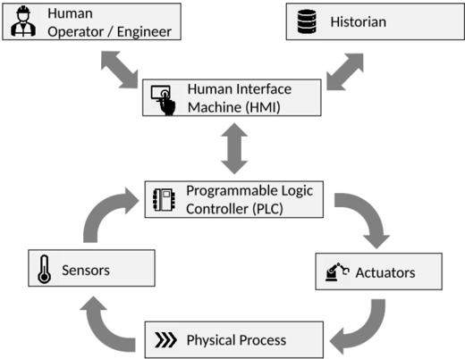

ICS có thể được tìm thấy ở hầu hết các lĩnh vực công nghiệp và cả trong các cơ sở hạ tầng quan trọng như cấp nước, giao thông và sản xuất điện hạt nhân. 1 ICS bao gồm một mạng lưới các thành phần điều khiển các quá trình vật lý trong một tương tác phức tạp trong nhiều vòng điều khiển. Hình 2.1 minh họa hoạt động cơ bản của vòng điều khiển trong ICS. Một cảm biến đo các đặc tính vật lý như áp suất và truyền biến đo được đến Bộ điều khiển logic khả trình (PLC). PLC so sánh các biến với các điểm đặt được xác định trước và phản ứng bằng cách gửi các biến được điều khiển đến bộ truyền động. Các bộ truyền động (ví dụ: van) tác động trực tiếp lên quá trình vật lý phụ thuộc vào các giá trị được điều khiển. [33] PLC cung cấp cho Giao diện người máy (HMI) thông tin về quy trình được kiểm soát mà sau đó người vận hành con người có thể xem được. ICS sử dụng cái gọi là lịch sử để thu thập và lưu trữ tất cả dữ liệu thiết bị và kiểm soát của quy trình

1 Hệ thống điều khiển công nghiệp https://www Trendmicro com/vinfo/us/security/def định/industrialcontrol-system - Truy cập: ngày 13 tháng 1 năm 2021

mà có thể được truy vấn sau này. Người vận hành hoặc kỹ sư có trách nhiệm có thể sử dụng thông tin này từ lịch sử và PLC để đưa ra quyết định. Bằng cách sử dụng HMI, họ có thể định cấu hình các tham số và đặt điểm để kiểm soát quá trình. Cũng có thể cập nhật toàn bộ thuật toán điều khiển của PLC. Như đã nêu trong 'Hướng dẫn về Bảo mật Hệ thống Điều khiển Công nghiệp (ICS)' [33], các vòng điều khiển được mô tả ở trên hoạt động với thời gian chu kỳ từ mili giây đến phút. Rất nhiều giao tiếp giữa các thành phần diễn ra. Các vòng điều khiển cũng có thể được lồng vào nhau hoặc xếp tầng khiến cho việc giao tiếp giữa các thành phần trở nên phức tạp hơn nhiều.

## 2.1.1. So sánh CNTT và OT

Ngược lại với Công nghệ thông tin (IT) thông thường, Công nghệ vận hành (OT) có tác động vật lý đến môi trường và yêu cầu nghiêm ngặt về thời gian thực. Do đó, thất bại trong OT có thể gây ra những hậu quả sâu rộng đối với cuộc sống con người và cả an toàn công cộng. Như những người đóng góp cho Wikipedia đã nêu [37], OT lịch sử sử dụng các giao thức độc quyền để liên lạc. Gần đây, các giao thức OT sử dụng cùng các giao thức mạng được tiêu chuẩn hóa như CNTT để có khả năng tương thích tốt hơn và ít phức tạp hơn. Tuy nhiên, chúng khác nhau về mục tiêu bảo vệ. Trong CNTT, Mô hình Bộ ba CIA mô tả các mục tiêu bảo vệ. CIA là viết tắt của Bí mật, Tính toàn vẹn và Tính sẵn sàng được sắp xếp theo mức độ ưu tiên. Như đã trình bày trong Hacking, hệ thống kiểm soát công nghiệp: Bí mật bảo mật ICS và SCADA &amp; giải pháp [4, tr. 112] mệnh lệnh '[...] chưa bao giờ được làm rõ một cách dứt khoát, nhưng chắc chắn đã phát triển để được giải thích như vậy'. Các mục tiêu bảo vệ của CIA đề cập đến thông tin liên lạc. Áp dụng cho ICS, điều này có thể là điều khiển PLC hoặc truy xuất thông tin từ quy trình vật lý.

Bí mật chỉ định việc bảo vệ việc đọc nội dung tin nhắn của các đối tượng trái phép. Điều này rất quan trọng khi tin nhắn chứa thông tin nhạy cảm hoặc bí mật. Đối với hầu hết các hoạt động trong ICS, điều này có thể không quan trọng vì không có dữ liệu nhạy cảm trong các gói mạng và quyền truy cập vào mạng có thể bị hạn chế hơn so với trong CNTT sẽ được thảo luận sau. Trong dữ liệu nhạy cảm về CNTT thông thường như thông tin cá nhân, ví dụ: của khách hàng hoặc bí mật kinh doanh được gửi đi cần được giữ bí mật trong khi ở OT, dữ liệu mạng tập trung hơn vào việc quản lý và giám sát hệ thống. Tính bảo mật thường được thực hiện bằng cách mã hóa dữ liệu.

Tính toàn vẹn nhằm mục đích ngăn chặn việc thay đổi nội dung của tin nhắn sau khi nó được gửi đi. Liên quan đến ICS, điều này rất quan trọng, chẳng hạn như để đảm bảo rằng các lệnh được gửi cũng như thông tin được truy xuất và hiển thị cho người vận hành không bị thao túng.

Tính khả dụng của một hệ thống là khoảng thời gian mà nó có thể được sử dụng như bình thường. Trong ICS nhiều thành phần phối hợp chặt chẽ với nhau. Vì vậy, nếu một thành phần ngừng hoạt động thì toàn bộ hệ thống có thể bị lỗi. Như đã nêu, điều này có thể gây ra những hậu quả sâu rộng, trái ngược với CNTT doanh nghiệp, trong hầu hết các ứng dụng, lỗi có thể làm trì hoãn các quy trình nhưng nhìn chung không làm dừng toàn bộ quy trình tổng thể. Trong CNTT doanh nghiệp, các hệ thống, dịch vụ và giao thức thường được xây dựng để tồn tại những lỗi ngắn hạn mà không gặp thêm sự cố nào. Ví dụ: nếu máy chủ email của người nhận không hoạt động và không thể truyền thư thì theo mặc định, các nỗ lực sẽ được thực hiện để gửi lại thư trong tối đa vài ngày 2 .

2 vgl. maximal\_queue\_lifetime=5d - Cấu hình mặc định của Postfix https://tools ietf org/html/rfc994 -Đã truy cập: ngày 13 tháng 2 năm 2021

Bodungen [4] lập luận rằng **trong ICS Tính sẵn sàng là khía cạnh quan trọng nhất**; Tính Intergrity  theo sau và confidential là ít quan trọng nhất. Colbert và Kott [9, tr. 53] bổ sung thêm An toàn, Môi trường, Sự phụ thuộc và Quy định làm yêu cầu để ICS xem xét. Sự khác biệt giữa các mục tiêu bảo vệ trong CNTT và OT của doanh nghiệp dẫn đến kết luận rằng việc tách các mạng có thể có giá trị.

## 2.1.2. Kiến trúc doanh nghiệp ICS

Kiến trúc tham chiếu doanh nghiệp Purdue (PERA) trong Hình 2.2 hiển thị khái niệm phân đoạn mạng giúp tách vùng của Mạng ICS (OT) khỏi Vùng của Mạng doanh nghiệp (IT). Nó cũng cho thấy sự phụ thuộc lẫn nhau và tương tác giữa các thành phần chính ở cấp độ 0 đến 5. Mô hình này được áp dụng từ IEC 62443, một bộ tiêu chuẩn về An ninh mạng trong các mạng công nghiệp.

Hình 2.2.: Kiến trúc tham chiếu doanh nghiệp Purdue [4]

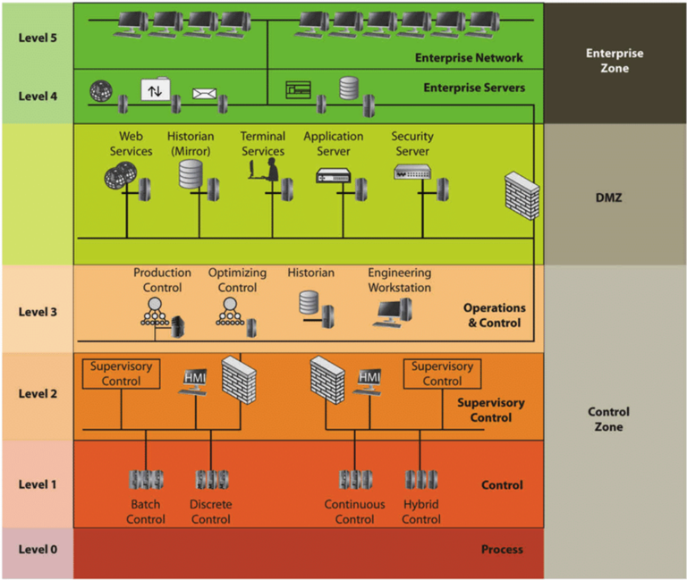

Ở Cấp độ 4 và 5, các chức năng kinh doanh chính như Lập kế hoạch nguồn lực doanh nghiệp và liên lạc trong và ngoài doanh nghiệp diễn ra. Cấp 4 đại diện cho hệ thống CNTT của địa phương để hỗ trợ các nhiệm vụ của cấp 5. Khu vực doanh nghiệp được tách biệt khỏi Vùng kiểm soát bởi Khu phi quân sự ICS (DMZ), đôi khi còn được gọi là cấp 3.5. DMZ là một công trình hiện đại hơn đi kèm với sự phát triển của tự động hóa, trong đó cần có luồng dữ liệu hai chiều giữa OT và IT. 3 Do đó, nó được sử dụng để cung cấp liên lạc an toàn giữa cả hai khu vực. Điều này được thực hiện, ví dụ: bởi tường lửa và proxy cho phép không để lộ trực tiếp các thành phần quan trọng của ICS. Nó thường bao gồm Dịch vụ web, Nhà sử học, Dịch vụ đầu cuối, Máy chủ ứng dụng và Máy chủ bảo mật áp dụng chức năng được giải thích. Trước khi đi đến các thành phần thấp hơn của ICS, một lớp quản lý cho quá trình sản xuất tổng thể được thể hiện ở cấp độ 3. Cấp độ 3 thường chứa các hệ thống Kiểm soát giám sát và thu thập dữ liệu (SCADA) và cung cấp cái nhìn tổng quan trừu tượng về toàn bộ quy trình sản xuất cũng như cơ sở dữ liệu lịch sử cho toàn bộ phần OT. Ở Cấp độ 2, các lĩnh vực riêng lẻ của quy trình được kiểm soát và giám sát. Nó cũng có thể được ngăn cách bởi các bức tường lửa bổ sung từ các cấp trên. Cấp độ 1 là nơi quy trình vật lý được điều khiển bởi PLC thông qua bộ truyền động sử dụng thông tin từ cảm biến và các thành phần khác. Cấp 0 là nơi vật lý thực tế được thao túng. [4, tr. 15 t.]

## 2.2. Ngăn xếp giao thức S7Comm

S7Comm là một giao thức độc quyền được sử dụng ít nhất để liên lạc với các thiết bị CPU SIMANTIC S7 và C7 của Siemens. Nó chủ yếu được sử dụng giữa các PLC và cũng để liên lạc với HMI. Nói chung **giao thức dựa trên máy khách-máy chủ**. Điều này có nghĩa là **máy khách bắt đầu yêu cầu tới máy chủ (ví dụ: PLC) trên một cổng được chỉ định (ví dụ: 102 qua TCP cho S7Comm) và máy chủ sẽ trả lời bằng phản hồi cho yêu cầu đã gửi**. Vì vậy, máy chủ nói chung không tự gửi tin nhắn. Như Miru [24] đã phát hiện ra rằng một số thiết bị cũng có khả năng đăng ký một sự kiện (mô hình nhà xuất bản-người đăng ký). Điều này có nghĩa là các gói trong trường hợp này có thể được khởi tạo bởi cả hai bên thay vì chỉ từ máy khách trong mô hình máy khách-máy chủ miễn là máy khách đã đăng ký một sự kiện.

Không có thông số kỹ thuật chính thức có sẵn công khai của giao thức. Siemens chỉ đưa ra cái nhìn tổng quan về các đặc tính, tính năng chung của S7Comm [1] cũng như hướng dẫn ứng dụng giao thức với các sản phẩm S7 [31]. Tuy nhiên, có một số tài liệu được xuất bản không chính thức mô tả chi tiết cách thức hoạt động của giao thức. (Xem [24], [39], [3]) Một kỹ thuật phổ biến có thể đã được sử dụng là kỹ thuật đảo ngược. Điều này bao gồm việc phân tích các gói được gửi cũng như phần mềm hoặc phần cứng được sử dụng.

Người ta nhận thấy rằng đối với các thiết bị S7 mới hơn là S7-1500 và S7-1200v4.0, giao thức có tên S7CommPlus được sử dụng. Giao thức này sẽ thực hiện mã hóa và ngăn chặn các cuộc tấn công lặp lại. Cho đến nay, có rất ít thông tin có sẵn. Tuy nhiên, Cheng Lei, Li Donghong, Ma Liang [7] giải quyết vấn đề bảo mật truyền thông bằng S7CommPlus bằng kỹ thuật gỡ lỗi ngược. S7CommPlus sẽ không tham gia vào công việc này vì chỉ có rất ít tài liệu về cách thức hoạt động của nó và nó dường như ít phổ biến hơn S7Comm.

Trong Hình 2.3, nó được hiển thị ở vị trí S7Comm trong mô hình Kết nối Hệ thống Mở (OSI) (theo chiều dọc) tùy thuộc vào ngăn xếp giao thức thay thế (theo chiều ngang). Trong mô hình OSI có nhiều lớp có nhiệm vụ khác nhau. Mỗi giao thức được gói vào giao thức cơ bản. Điều này có nghĩa là giao thức có giao thức khác

3 https://www zscaler com/resources/security-terms-glossary/what-is-purdue-model-icssecurity

giao thức trong tải trọng của nó. Như đã thấy trong Hình 2.3, S7Comm có thể được sử dụng trên các lớp vật lý khác nhau Ethernet công nghiệp, Profibus hoặc Giao diện truyền tin nhắn (MPI) [1]. Đối với Ethernet công nghiệp, có thể sử dụng Họ giao thức ISO hoặc TCP/IP. Trong giải pháp thay thế Dòng giao thức ISO, Giao thức truyền tải hướng kết nối (COTP) 4 để vận chuyển và Dịch vụ mạng chế độ không kết nối (CLNP) 5 trong Lớp mạng qua Ethernet công nghiệp được sử dụng. S7Comm được thiết kế để chạy trên Nhóm giao thức ISO dựa trên gói thay vì dựa trên luồng như Giao thức điều khiển truyền (TCP). Dựa trên gói không phải dựa trên luồng có độ dài được chỉ định của tin nhắn, trong khi dựa trên luồng, nó không được xác định khi gói kết thúc và gói mới bắt đầu. Như đã nêu trong Giao thức truyền tải hướng kết nối (COTP, ISO 8073) [38] các Giao thức ISO trước đây ngày nay được thay thế bằng TCP trong hầu hết các ứng dụng. Trong Giao thức S7 cung cấp những đặc tính, ưu điểm và tính năng đặc biệt nào? [1] người ta lập luận rằng việc thiếu định tuyến của giao thức truyền tải ISO đang trở thành một bất lợi ngày càng tăng. Vì vậy, người ta đã cố gắng kết hợp các ưu điểm của dựa trên gói và khả năng định tuyến bằng cách chạy ISO trên TCP. Để chạy S7Comm trên TCP, TPKT được sử dụng kết hợp với COTP ở giữa. ISO trên TCP được mô tả trong RFC1006 6 được hiển thị trong Hình 2.3. Profibus và MPI có thể được sử dụng để trao đổi trong Liên kết dữ liệu bus trường (FDL).

Hình 2.3.: Giao thức S7Comm trong mô hình OSI [1]

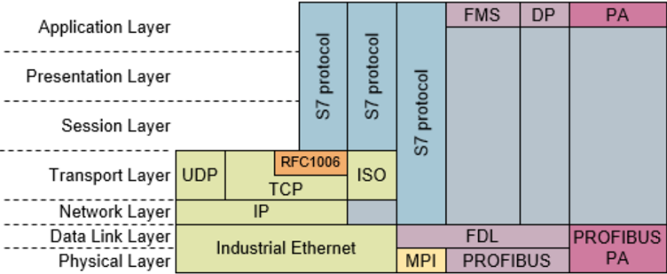

Như được minh họa bằng ví dụ trong Hình 2.4, bạn có thể thấy cấu trúc thô của Đơn vị dữ liệu giao thức S7Comm (PDU) dựa trên ngăn xếp giao thức TCP/IP. Nó được tách thành tiêu đề, tham số và phần dữ liệu tùy chọn. Tiêu đề chủ yếu xác định loại tin nhắn và chứa id yêu cầu do khách hàng tạo. Phần tham số bắt đầu bằng mã chức năng phụ thuộc vào loại thông báo hướng dẫn máy chủ những gì nó nên làm. Các chức năng này hầu hết đã được hiểu rõ và được mô tả sâu hơn trong tác phẩm của Fischer [13] và Gyorgy Miru [16]. Phần dữ liệu tùy chọn mang nội dung phụ thuộc vào chức năng, ví dụ: giá trị dữ liệu cần được ghi. Tuy nhiên, cấu trúc gói thay đổi tùy thuộc vào loại thông báo và một lần nữa tùy thuộc vào

4 RFC2126 - https://tools.ietf.org/html/rfc2126 - Truy cập 14.01.2021

5 được chỉ định trong rfc994 https://tools ietf org/html/rfc994 - Truy cập: ngày 03 tháng 2 năm 2021

6 ISO qua TCP (RFC1006) https://tools ietf org/html/rfc1006 - Truy cập: ngày 03 tháng 2 năm 2021

về chức năng được sử dụng. Ví dụ: chỉ loại thông báo Dữ liệu người dùng chứa các chức năng và chức năng con trong khi Yêu cầu công việc và Dữ liệu xác nhận chỉ chứa một chức năng trong tham số S7Comm. Loại thông báo Ack thậm chí không có phần tham số S7Comm. Một số hàm còn sử dụng thêm danh sách và một số hàm yêu cầu phần dữ liệu. Vì vậy giao thức được xây dựng ở dạng rất năng động.

Hình 2.4.: Cấu trúc yêu cầu mật khẩu PLC S7Comm

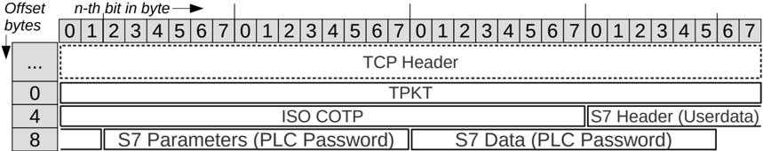

## 2.3. Hệ thống phát hiện xâm nhập

Hình 2.5.: Mô tả cơ bản của NIDS dựa trên chữ ký

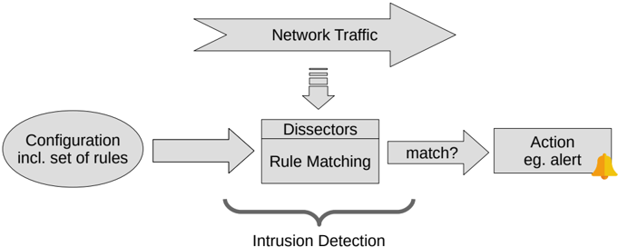

IDS sử dụng tính năng quét thụ động để phát hiện sự xâm nhập. Quét thụ động trái ngược với quét chủ động có nghĩa là IDS không cố ý can thiệp vào những gì được quan sát. Có sự khác biệt giữa NIDS và Hệ thống phát hiện xâm nhập máy chủ (HIDS). Trong khi Hệ thống phát hiện xâm nhập mạng lắng nghe lưu lượng mạng và diễn giải nó thì HIDS sẽ giám sát các quá trình và hoạt động bên trong hệ thống máy tính. Như đã đề cập trước đó, nguy cơ thất bại phải được giữ ở mức thấp nhất có thể. Việc giám sát các hành động bên trong nút ICS bằng HIDS có thể có thể cản trở quá trình (ví dụ: do sử dụng quá nhiều tài nguyên). Ngoài ra, nhiều nút ICS không có tài nguyên phần cứng để chạy phần mềm HIDS.

Mặt khác, NIDS độc lập với hệ thống đầu cuối và chỉ lắng nghe các gói mạng được gửi đi. Vì vậy, NIDS phù hợp hơn với ICS.

Có hai cách để phát hiện sự xâm nhập bằng NIDS. Hoặc bằng cách phát hiện sự bất thường hoặc bằng cách tiếp cận dựa trên chữ ký để phát hiện việc sử dụng sai hệ thống. Ngoài ra sự kết hợp của cả hai đều tồn tại.

Cách tiếp cận dựa trên sự bất thường sẽ phát hiện các hoạt động khác với hành vi thông thường. Khó khăn ở đây có thể là xác định và có được hành vi bình thường.

Trong cách tiếp cận dựa trên chữ ký, một hành vi có thể chỉ ra sự xâm nhập được mô tả dưới dạng các quy tắc phải được chỉ định trước. Thủ tục cơ bản của NIDS dựa trên chữ ký được thể hiện trong Hình 2.5. Việc phát hiện xâm nhập có một bộ quy tắc và luồng các gói mạng làm đầu vào. Bộ phân tích được sử dụng để phân tích các gói mạng để các quy tắc có thể tham chiếu đến các thuộc tính hoặc nội dung của chúng. Đầu ra là một hành động chủ yếu là cảnh báo cho người vận hành. Nhìn chung, IDS so sánh các quy tắc với lưu lượng truy cập mạng bằng cách sử dụng bộ phân tích và kích hoạt hành động khi nó khớp.

## 2.3.1. Các quy tắc trong NIDS dựa trên chữ ký

Quy tắc là một loại mô tả chính thức cho một tập hợp các gói mà sau đó có thể được phân loại. Thông thường, một quy tắc được sử dụng để phân loại các gói mạng là độc hại. Vì các gói độc hại có thể chỉ ra sự xâm nhập nên hành động nêu trên, chẳng hạn như đưa ra cảnh báo, sẽ diễn ra. Một quy tắc có thể xác định một cuộc tấn công cụ thể đã biết hoặc tổng quát hơn bằng cách xác định những gì không mong muốn. Có các bộ quy tắc công khai chứa một bộ quy tắc về các cuộc tấn công thường được biết đến. 7 Đối với giao thức S7Comm, có một bộ quy tắc được tạo bởi Fischer [13] chứa các quy tắc dựa trên các lệnh S7Comm quan trọng. Do đó, cô ấy phân tách các máy chủ được ủy quyền và các máy chủ trái phép theo địa chỉ IP và sử dụng các lệnh quan trọng đã được xác định trước đó để phân loại các gói là độc hại.

## 2.3.1.1. Cấu trúc của quy tắc

Sau đây là một ví dụ về cách xây dựng quy tắc. Đây là một quy tắc duy nhất từ ​​bộ quy tắc nêu trên của Fischer [13].

```
alert tcp-pkt !$S7_CLIENT any -> $S7_SERVER $S7_PORT (msg: "ALDI PLC Password ! Request to Server attempt from non authorized Host"; ! flow:to _ server,established; content:"|32 07|"; offset:7; depth:2; ! content:"|00 01 12|"; offset:17; depth:3; content:"|45 01|"; offset:22; ! depth:2; classtype:bad-unknown; sid:2534320901 rev:2;)
```

Quy tắc trước tiên chỉ định hành động nào sẽ được thực hiện nếu quy tắc khớp với một gói. Trong trường hợp này hành động là 'cảnh báo'. Sau đó, bộ phân tích làm cơ sở cho quy tắc được cung cấp. Trong trường hợp này, bộ phân tích có tên 'tcp-pkt' được sử dụng. Sau đó, quy tắc chỉ định gói nào có thể được lọc theo địa chỉ IP và cổng và liệu quy tắc có được áp dụng cho các gói theo một hoặc cả hai hướng hay không. Sau đó, các cặp từ khóa-giá trị được cung cấp là một phần cấu hình và thông tin cho quy tắc, chẳng hạn như 'msg', 'classtype', 'sid' và cả những cặp được sử dụng để khớp với gói (ví dụ: 'nội dung', 'offset',

7 ví dụ Bộ quy tắc của chủ đề mới nổi https://rulesemergingthreats net/

'độ sâu') bởi người mổ xẻ. Các từ khóa và giá trị có thể được sử dụng phụ thuộc vào bộ phân tích được chọn trước đó.

## 2.3.1.2. Các mẫu byte cấp TCP và các từ khóa dành riêng cho giao thức ICS

Đối với các giao thức lớp ứng dụng có hai cách tiếp cận. Để giải quyết các thuộc tính của giao thức chuyên dụng, quy tắc có thể dựa trên tải trọng của bộ phân tích transport layer hoặc trên các từ khóa dành riêng cho giao thức, yêu cầu bộ phân tích giao thức tương ứng.

Đối với các mẫu byte tiếp cận đầu tiên có thể được sử dụng. Điều này có nghĩa là một giá trị byte và một giá trị offset được cung cấp để đại diện cho một thuộc tính cụ thể của giao thức trong tải trọng. Tải trọng bắt nguồn từ giao thức transport layer mà đối với các mẫu byte cấp TCP là giao thức TCP. Mẫu byte bao gồm giá trị byte được đề cập ở trên và phần bù được khớp trực tiếp với tải trọng TCP thô bởi bộ phân tích TCP chịu trách nhiệm (transport layer). Bộ phân tích TCP cũng có thể được xây dựng trên một bộ phân tích khác trên lớp mạng (ví dụ: IPv4).

Trong cách tiếp cận thứ hai, quy tắc dựa vào các từ khóa thường có tính biểu cảm trong đó mỗi từ khóa đại diện cho một thuộc tính giao thức. Không giống như các mẫu byte, các gói giao thức trước tiên phải được phân tích cú pháp từ tải trọng của transport layer. Vì vậy cần có một bộ phân tích giao thức cụ thể. Bộ phân tích dành riêng cho giao thức thường được xây dựng trên các bộ phân tích khác. Đối với giao thức dựa trên TCP, trong trường hợp này là S7Comm, bộ phân tích được xây dựng trên các gói TCP được tập hợp lại của bộ phân tích TCP. Việc tập hợp lại gói TCP là mục tiêu của bộ phân tích TCP và tạo luồng TCP ra khỏi các khung TCP. Quy trình khớp quy tắc này của bộ phân tích giao thức cụ thể thường được thực hiện theo hai bước. Đầu tiên, các gói được phân tích cú pháp thành một biểu diễn bên trong (phân tích cú pháp) và sau đó tất cả các quy tắc được khớp với điều này (phát hiện). Biểu diễn bên trong có thể được coi là cấu trúc dữ liệu của bộ phân tích nơi lưu trữ các trường liên quan của gói giao thức. Do đó, bộ phân tích thường được chia thành ít nhất hai phần: bộ phân tích cú pháp và bộ dò tìm. Tuy nhiên, có những bộ phân tích không cung cấp từ khóa và do đó không có phần phát hiện. Đây là một phần của quá trình đánh giá để điều tra chi phí hoạt động xử lý của cả hai phần. Hơn nữa, nó còn được điều tra liên quan đến câu hỏi nghiên cứu, phương pháp nào trong hai phương pháp được đề cập ở đây nhanh hơn.

## 2.3.2. Bảo mật trong NIDS

Tính bảo mật của NIDS có thể được nhìn nhận theo nhiều cách khác nhau. Đầu tiên là tính bảo mật mà NIDS có thể đạt được hoặc không thể đạt được. Mặt khác còn có sự bảo mật của chính hệ thống. Tuy nhiên, tính bảo mật của hệ thống rõ ràng cũng có ảnh hưởng đến tính bảo mật có thể đạt được và ranh giới cũng không hoàn toàn rõ ràng.

Tính bảo mật đạt được khi sử dụng NIDS bị giới hạn bởi các gói mà nó nhận được, khả năng phân tích các gói và cuối cùng là khả năng phát hiện. Đầu tiên, phải đảm bảo rằng lưu lượng truy cập cần được quan sát buộc phải tiếp cận IDS. Có thể có những khả năng khác, ví dụ: để bỏ qua việc kiểm tra bằng cách định tuyến xung quanh IDS. Ngoài ra, số lượng gói cao hơn bình thường phải được xem xét trong bối cảnh các cuộc tấn công Từ chối dịch vụ (DOS). Tại thời điểm này, hiệu suất xử lý và do đó
đủ tài nguyên phần cứng phát huy tác dụng. Tuy nhiên, hiệu suất xử lý không chỉ bị ảnh hưởng bởi số lượng gói, hơn nữa nó có thể phụ thuộc vào nỗ lực và hiệu quả có thể có của việc phân tích các giao thức cụ thể. Như đã đề cập, việc phân tích các gói được thực hiện bởi trình phân tích. Do đó, hiệu suất xử lý của bộ phân tích có vai trò quan trọng trong bảo mật. Một mặt, giao thức có thể phức tạp hơn các giao thức khác và mặt khác, trình phân tích có thể phân tích gói tin sâu hơn hoặc ít hơn hoặc lưu trữ thông tin theo cách khác. Bên cạnh hiệu suất xử lý còn có khía cạnh trốn tránh các cuộc tấn công, ví dụ: cố gắng ẩn khỏi việc kiểm tra gói bằng cách đệm. Do đó, tính bảo mật bằng cách phát hiện xâm nhập cũng phụ thuộc vào mức độ phân tích cú pháp các gói tin mạnh mẽ như thế nào.

Tại thời điểm này, ranh giới đối với tính bảo mật của chính hệ thống là không rõ ràng. Điều này là do không có khoảng cách lớn giữa gói không được phân tích cú pháp chính xác và gói độc hại gây ra vòng lặp vô tận trong cấu trúc dữ liệu giao thức phức tạp do triển khai bị lỗi. Một vòng lặp vô tận có thể khiến toàn bộ hệ thống không thể hoạt động. Lỗi triển khai trong IDS hoặc cụ thể là trong bộ phân tích cũng có thể dẫn đến việc vượt hệ thống. Điều này có thể cho phép kẻ tấn công thực hiện các cuộc tấn công tiếp theo từ hệ thống bị chiếm đoạt đó. Thông thường các lỗi triển khai dẫn đến lỗ hổng của hệ thống bắt nguồn từ các lỗi liên quan đến bộ nhớ như tràn bộ đệm. Ví dụ. Wireshark, một công cụ bảo mật mạng, có hơn 200 lỗ hổng được công bố 8 trong năm 2018 và 2019, nhiều lỗ hổng liên quan đến lỗi bộ nhớ. Tuy nhiên, đối với các lỗi triển khai liên quan đến bộ nhớ, vẫn tồn tại các biện pháp đối phó như ngôn ngữ an toàn bộ nhớ. Những điều này sẽ được thảo luận liên quan đến IDS Suricata trong phần tiếp theo. Ngoài ra còn có các phương pháp thử nghiệm như làm sạch hoặc làm mờ để phát hiện các lỗi triển khai đó bằng cách phân tích hành vi của chương trình đối với một lượng lớn giá trị đầu vào.

## 2.4. Suricata

Suricata tự mô tả mình là 'công cụ phát hiện mối đe dọa mạng miễn phí và mã nguồn mở, hoàn thiện, nhanh chóng và mạnh mẽ' 9 . Nó được cấp phép theo Giấy phép Công cộng GNU v2.0 bởi Tổ chức Bảo mật Thông tin Mở (OISF) và được phát triển bởi cộng đồng Suricata. Đây là một cộng đồng công cộng nên mọi người đều có thể tham gia. 10

Suricata được sử dụng để phát hiện xâm nhập mạng thụ động hoặc Giám sát an ninh mạng (NSM). Tuy nhiên, nó cũng có khả năng ngăn chặn sự xâm nhập chủ động. NSM bao gồm tất cả các loại thu thập, đo lường hoặc quan sát trực tiếp và có hệ thống các quá trình bằng thiết bị kỹ thuật. 11 Phòng chống xâm nhập cho phép chặn các kết nối bằng cách can thiệp chủ động khi phát hiện có xâm nhập. Suricata cũng cho phép xử lý ngoại tuyến lưu lượng truy cập mạng đã ghi được giống như xử lý trực tuyến. Lưu lượng truy cập ngoại tuyến có thể được ghi lại trực tuyến, ví dụ: bằng Wireshark 12 hoặc tcpdump 13 vào tệp PCAP. Trực tuyến đề cập đến lưu lượng được gửi qua mạng. Tuy nhiên, điều này chỉ có thể đạt được nếu các gói đến được giao diện

8 Danh sách lỗ hổng của Công cụ bảo mật Wireshark https://www cvedetails com/vulnerability-list/vendo r \_ id-4861/product \_ id-8292/Wireshark-Wireshark html - Truy cập: ngày 21 tháng 6 năm 2021

9 https://suricata-ids.org/

10 Tham gia Suricata https://suricata-ids org/participate/ - Truy cập 26.01.2021

11 Xem thêm https://en.wikipedia.org/wiki/Monitoring - Truy cập: 26 tháng 1

12 Wireshark https://www Wireshark org/ - Truy cập ngày 26.01.2021

13 Tcpdump https://www tcpdump org/ - Truy cập 26.01.2021

của máy. Tính năng xử lý ngoại tuyến có thể được khai thác để phát triển và đánh giá bộ phân tích S7Comm hiệu quả hơn trong công việc này. Nếu không, lưu lượng mạng trực tuyến phải được mô phỏng cho mỗi lần kiểm tra, việc này có thể tốn nhiều thời gian hơn và dễ xảy ra lỗi hơn.

Dự án Suricata đã bao gồm nhiều bộ phân tích cho các giao thức phổ biến, nhưng cho đến nay vẫn chưa có bộ phân tích nào cho S7Comm. Dự án Suricata được viết bằng ngôn ngữ lập trình C. Tuy nhiên, kể từ Phiên bản 6.0.0, ngôn ngữ Rust đã trở thành bắt buộc đối với những bộ phân tích mới. Rust là một ngôn ngữ lập trình có cú pháp tương tự và được biết đến là nhanh như C/C++ trong khi ngăn chặn các mối đe dọa bảo mật phổ biến trong thực tiễn lập trình. Ví dụ, sự an toàn của bộ nhớ đạt được bằng cách mượn, sở hữu và xử lý trọn đời. Trong Rust, hệ thống sở hữu được sử dụng để phát hiện khi nào bộ nhớ có thể được giải phóng bằng cách theo dõi các con trỏ tới không gian được phân bổ. Tuy nhiên, trong các ngôn ngữ lập trình khác, nó được giải phóng và phân bổ rõ ràng trong mã như trong C/C++ hoặc bởi bộ sưu tập rác trong Java. Cả hai đều có thể làm giảm tính bảo mật của hệ thống hoặc hiệu suất. Quyền sở hữu có thể được chuyển nhượng hoặc di chuyển theo điều kiện của Rust bằng cách vay có thể thay đổi. Quyền truy cập bất biến được gọi là tham chiếu. Tuy nhiên, bộ nhớ được phân bổ chỉ có thể được sở hữu một cách có thể thay đổi bởi ví dụ: một chức năng cùng một lúc. Thời điểm bộ nhớ có thể được giải phóng được xác định bởi thời gian tồn tại. Thời gian tồn tại bắt đầu khi nó được khai báo và kết thúc khi chủ sở hữu vượt quá phạm vi.

Đối với IDS, cả bảo mật và hiệu suất đều là mối quan tâm chính và có thể ảnh hưởng đến việc lựa chọn ngôn ngữ lập trình. Trường hợp này xảy ra vì một mặt nếu IDS không đủ hiệu quả thì không thể xử lý tất cả lưu lượng truy cập mà kẻ tấn công có thể khai thác. Mặt khác, nếu IDS không an toàn, nó có thể làm giảm hơn là tăng tính bảo mật tổng thể bằng cách trở thành một phần của cuộc tấn công.

## 2.5. Công việc liên quan

Trong công việc này, một trình phân tích giao thức S7Comm ICS được phát triển theo các biến thể khác nhau và được triển khai trong Suricata NIDS. Sau đó, hiệu suất xử lý tập trung vào việc sử dụng tài nguyên sẽ được nghiên cứu và quy trình phát triển cho các bộ phân tích trong NIDS cũng được tạo ra. Cuối cùng, các phát hiện được thảo luận liên quan đến hiệu suất, tính bảo mật và khả năng sử dụng của các trình phân tích theo giao thức cụ thể.

Trong Entwicklung eines Konzeptes für ein Framework zur teilautomatisierten Erstellung von prozessbasierten IDS-Regeln in ICS, một khung để tạo quy tắc IDS đã được phát triển. Điều này được thực hiện bằng cách xác định các lệnh quan trọng trong giao thức S7Comm bằng cách sử dụng bộ dữ liệu có sẵn công khai. Khung tự phát triển đã được Fischer [13] áp dụng bằng cách sử dụng một tập dữ liệu khác để tạo một bộ quy tắc dựa trên các mẫu byte cấp TCP. Cả hai bộ dữ liệu cũng đã được sử dụng trong công việc này. Hơn nữa, bộ quy tắc được tạo và các lệnh quan trọng được xác định đóng vai trò là điểm khởi đầu trong công việc phát triển trình phân tích này. Trong khi công việc của Fischer [13] điều tra việc tạo ra các quy tắc dựa trên các mẫu byte cấp độ TCP cho một giao thức cụ thể, tuy nhiên công việc này lại điều tra sự phát triển và đánh giá các bộ phân tích được sử dụng bởi các từ khóa dành riêng cho giao thức ICS. Hơn nữa công việc này

14 ví dụ Điểm chuẩn của Rust so với C++ - https://benchmarksgame-team.pages.debian.net/benchmarksgame/fastest/rustgpp.html - Truy cập: ngày 12 tháng 1 năm 2021

15 ví dụ Tốc độ của Rust vs C - https://kornel.ski/rust-c-speed - Truy cập: ngày 12 tháng 1 năm 2021

phát hiện ra sự khác biệt giữa các quy tắc dựa trên mẫu byte cấp độ TCP và các từ khóa dành riêng cho giao thức dựa trên quy tắc, dựa trên trình phân tích giao thức tương ứng.

Bài báo của Chifflier và Couprie [8] đề cập đến vấn đề bảo mật của các trình phân tích cú pháp và thảo luận về cách tiếp cận phát triển các trình phân tích cú pháp bằng ngôn ngữ lập trình Rust và framework tổ hợp trình phân tích cú pháp. Tuy nhiên, trong nghiên cứu này, những phát hiện của bài báo được sử dụng để thực hiện công việc mổ xẻ và cũng được tham khảo trong quá trình phát triển. Cuộc thảo luận về bảo mật nằm trong phạm vi ngôn ngữ lập trình và lỗi triển khai. Mặt khác, công việc này đề cập đến tác động của hiệu suất đối với bảo mật, tập trung vào các giao thức ICS ở cấp độ của trình phân tích trong IDS.

Công trình này cũng như bài báo của McQuistin, Stephen et al. [23] đề cập đến quá trình làm thế nào để chuyển từ đặc tả giao thức sang trình phân tích cú pháp. Tuy nhiên, bài viết này đã bắt đầu về cách viết một đặc tả giao thức như vậy và cũng mô tả cách các trình phân tích cú pháp có thể được tạo tự động từ đặc tả đó. Công việc này cũng đề cập đến các giao thức không có thông số kỹ thuật hoàn chỉnh được công bố rộng rãi.

Bài báo Malloy và Power [22] từ năm 2002 áp dụng các kỹ thuật công nghệ phần mềm để phát triển trình phân tích cú pháp. Sự phát triển của trình phân tích cú pháp trong ngôn ngữ lập trình C# được mô tả và phác thảo quá trình phát triển. Tuy nhiên công việc này rất hạn chế về công cụ và ngôn ngữ lập trình, thậm chí giống như McQuistin, Stephen et al. [23] nó tập trung vào việc tạo mã tự động từ đặc tả.

Các bài báo của Day and Burns [10], Brumen và Legvart [6] và Shah và Issac [28] điều tra hiệu suất của cả Snort IDS và Suricata IDS. Day và Burns [10] điều tra trong một số thử nghiệm trên cả Hệ điều hành (HĐH) Windows và Linux về tác động của các cuộc tấn công đến hiệu suất và tỷ lệ rớt. Shah và Issac [28] cũng điều tra việc sử dụng tài nguyên và tỷ lệ rớt cho cả hai hệ thống trên các tốc độ mạng khác nhau. Tuy nhiên, công việc này đề cập ở mức độ thấp hơn với hai cách tiếp cận về viết quy tắc và cả các quyết định triển khai cho trình phân tích như một phần của IDS trong bối cảnh của ICS.

Kleinmann và Wool [20] giải quyết vấn đề phát triển IDS của giao thức S7Comm bằng cách sử dụng tính năng phát hiện dựa trên sự bất thường. Trong bài viết này, ngữ nghĩa giao thức S7Comm cũng được thiết kế ngược và áp dụng vào quá trình phát triển. Tuy nhiên, công việc này đề cập đến IDS dựa trên chữ ký và thông tin trên giao thức được thu thập từ một số nguồn thông tin có sẵn công khai.

# 3. Phương pháp luận

Câu hỏi nghiên cứu được giới thiệu có thể được cụ thể hóa bằng cách theo các điều kiện nào thì các **quy tắc dựa trên các từ khóa dành riêng cho giao thức ICS**, dựa trên bộ phân tích giao thức tương ứng, nên được ưu tiên hơn các **quy tắc dựa trên các mẫu byte cấp TCP**. Để trả lời câu hỏi này, hiệu suất xử lý của hai phương pháp được so sánh trong các tình huống khác nhau.

Các kịch bản được minh họa trong Hình 3.1. Có 3 loại kịch bản được nêu ra. Đầu tiên, mức độ khả năng của trình phân tích giao thức rất đa dạng. Điều này được thực hiện để điều tra xem chi phí do bộ phân tích tạo ra được cấu thành như thế nào. Phần thứ hai bổ sung thêm các thuộc tính ở một cấp độ cụ thể để có cái nhìn tổng quan hơn về ảnh hưởng của các thuộc tính khác nhau lên chi phí chung. Loại kịch bản cuối cùng bao gồm các biến thể quy tắc khác nhau dựa trên các mẫu byte cấp TCP.

Hình 3.1.: Các kịch bản điều tra và giả thuyết liên quan

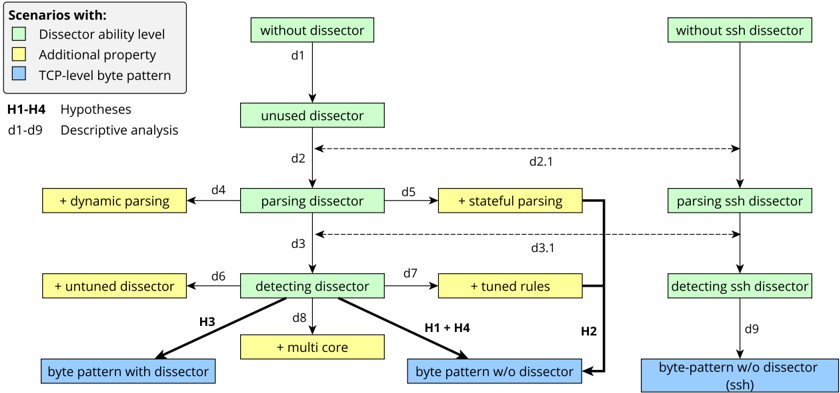

Các kịch bản khác nhau được so sánh không chỉ để trả lời câu hỏi nghiên cứu về các điều kiện cụ thể mà còn hiểu được yếu tố ảnh hưởng nào của một điều kiện sẽ ảnh hưởng đến kết quả theo cách nào.

## 3.1. giả thuyết

Từ câu hỏi nghiên cứu, bốn giả thuyết đã được rút ra. Các giả thuyết H1-H4 được minh họa trong Hình 3.1 dưới dạng so sánh hai kịch bản. H1 và H4 được phân biệt bởi tập dữ liệu được sử dụng và đối với H2, bộ phân tích phát hiện với các quy tắc phân tích và điều chỉnh trạng thái

cùng nhau xây dựng một kịch bản được đánh giá dựa trên kịch bản sử dụng các mẫu byte cấp TCP. Ý nghĩa được giả định từ mức ý nghĩa U = 0 05 (5%).

- H1 Việc xử lý Lưu lượng truy cập ICS thông thường bằng cách sử dụng các quy tắc dựa trên các từ khóa dành riêng cho giao thức ICS, sử dụng bộ phân tích tương ứng, nhanh hơn đáng kể so với việc sử dụng các quy tắc dựa trên các mẫu byte cấp TCP.

Người ta dự đoán rằng chi phí phân tích cú pháp của bộ phân tích sẽ được bù bằng việc khớp quy tắc. Giả định rằng việc khớp quy tắc trên gói đã được phân tích cú pháp (biểu diễn bên trong) nhanh hơn so với việc khớp với tải trọng TCP thô.

- H2 Việc xử lý Lưu lượng truy cập ICS thông thường bằng cách sử dụng các quy tắc được điều chỉnh dựa trên các từ khóa dành riêng cho giao thức ICS, sử dụng bộ phân tích trạng thái tương ứng, nhanh hơn đáng kể so với việc sử dụng các quy tắc dựa trên mẫu byte cấp TCP.

Người ta giả định rằng chi phí hoạt động của phân tích cú pháp có trạng thái được bù đắp bằng quy tắc khớp với các quy tắc được điều chỉnh. Cả các quy tắc được điều chỉnh và tính trạng thái để phân tích cú pháp đều đã giảm chi phí xử lý trong các nghiên cứu trước của chính họ. Tuy nhiên, điều này cũng sẽ được nghiên cứu sau trong phân tích mô tả của d5 và d7.

- H3 Việc xử lý Lưu lượng truy cập ICS thông thường bằng cách sử dụng các quy tắc dựa trên các từ khóa dành riêng cho giao thức ICS, sử dụng bộ phân tích tương ứng , nhanh hơn đáng kể so với việc sử dụng các quy tắc dựa trên các mẫu byte cấp TCP khi trong cả hai trường hợp, bộ phân tích giao thức ICS được bật .

Giả định rằng trình phân tích được kích hoạt cũng sẽ phân tích ICStraffic tương ứng nếu không sử dụng quy tắc tương ứng dựa trên các từ khóa dành riêng cho giao thức ICS. However this is also investigated by descriptive analysis of comparing the unused dissector and the parsing dissector in d2. Hơn nữa, người ta còn giả định rằng việc so khớp các quy tắc dựa trên các từ khóa dành riêng cho giao thức ICS nhanh hơn đáng kể so với các quy tắc dựa trên các mẫu byte cấp TCP. Do đó, khi trình phân tích đang phân tích lưu lượng ICS tương ứng trong cả hai kịch bản được so sánh, việc xử lý các quy tắc dựa trên các từ khóa dành riêng cho giao thức ICS vẫn nhanh hơn. Tuy nhiên, thời gian CPU xử lý các quy tắc cũng được so sánh. Ngoài ra, nó còn được điều tra trong phân tích mô tả d3 về mức độ tăng chi phí từ bộ phân tích giao thức ICS đơn thuần đến bộ phân tích giao thức ICS phù hợp với quy tắc. Điều này sẽ cung cấp thông tin về chi phí chung của quá trình so khớp quy tắc.

- H4 Việc xử lý lưu lượng giao thức ICS tương tự trên cùng một cổng TCP bằng cách sử dụng các quy tắc dựa trên các từ khóa dành riêng cho giao thức ICS, sử dụng bộ phân tích tương ứng, nhanh hơn đáng kể so với việc sử dụng các quy tắc dựa trên các mẫu byte cấp TCP.

Điều này được dự đoán trước vì trình phân tích giao thức ICS dừng phân tích toàn bộ kết nối TCP ngay khi nó phân loại lưu lượng truy cập là không tương ứng hoặc không phân tích được. Không có gói nào được phân tích cú pháp và các quy tắc dựa trên từ khóa dành riêng cho giao thức ICS hoàn toàn không khớp. Mặt khác, các quy tắc dựa trên mẫu byte cấp TCP được khớp với từng gói TCP. Trường hợp này xảy ra là do bộ phân tích TCP được sử dụng để vẫn phân tích tải trọng từ các gói TCP.

Để điều tra các yếu tố ảnh hưởng đến hiệu suất xử lý của bộ phân tích giao thức ICS, các kịch bản tiếp theo sẽ được so sánh. Do đó, nó được đánh giá mức độ tăng chi phí theo các cấp độ khả năng khác nhau. Các yếu tố ảnh hưởng khác đến mức độ khả năng của bộ phân tích giao thức ICS đơn thuần và bộ phân tích giao thức ICS cũng đang được phát hiện. Ngoài ra, trình phân tích SSH cũng được đánh giá ở các cấp độ khả năng để so sánh kết quả trên tổng chi phí đối với các trình phân tích khác.

- d1 - Điều này điều tra chi phí hoạt động khi bộ phân tích được bật và sẵn sàng phân tích lưu lượng truy cập đến. Tuy nhiên, trong Kịch bản, bộ phân tích không được sử dụng thì không có lưu lượng truy cập tương ứng nào được sử dụng.
- d2 - Điều này điều tra chi phí xảy ra khi các gói tương ứng được phân tích cú pháp bởi bộ phân tích. Tuy nhiên, cho đến bộ phân tích cú pháp Kịch bản thì không có quy tắc nào được sử dụng. Do đó người mổ xẻ không phù hợp với bất kỳ quy tắc nào. Điều này được đánh giá cho trình phân tích giao thức ICS cũng như cho trình phân tích SSH và được so sánh trong d2.1 .
- d3 - Điều này điều tra chi phí khi bộ phân tích bổ sung vào phân tích cú pháp cũng phải phát hiện. Điều này được thực hiện bằng cách thêm các quy tắc tương ứng dựa trên các từ khóa dành riêng cho giao thức ICS. Điều này cũng được đánh giá cho trình phân tích SSH bằng cách sử dụng các quy tắc tương ứng dựa trên từ khóa của trình phân tích ssh và được so sánh trong 3.1.
- d4 - Điều này điều tra chi phí khi các phần động của giao thức ICS cũng được phân tích cú pháp. Bộ phân tích giao thức ICS phải phân tích các gói giao thức ICS sâu hơn và do đó người ta nghi ngờ rằng quá trình xử lý mất nhiều thời gian hơn trong trường hợp cơ bản với phân tích cú pháp tĩnh.
- d5 - Điều này điều tra ảnh hưởng đến thời gian xử lý và bộ nhớ khi bộ phân tích giao thức ICS ở trạng thái. Trong trường hợp cơ bản, trình mổ xẻ là không trạng thái. Điều này có nghĩa là mỗi gói giao thức ICS được lưu trữ độc lập với các gói khác. Trong phiên bản có trạng thái của bộ phân tích giao thức ICS, gói giao thức ICS được lưu trữ cùng với gói giao thức ICS khác theo cách yêu cầu được lưu trữ cùng với phản hồi. Yêu cầu thường là gói giao thức ICS từ máy khách (ví dụ: HMI) đến máy chủ (ví dụ: PLC) và ngược lại để nhận phản hồi.
- d6 - Điều này điều tra ảnh hưởng khi đối sánh các quy tắc dựa trên từ khóa dành riêng cho giao thức ICS, với bộ phân tích ICS tương ứng không có bộ lọc trước so với bộ phân tích không có bộ lọc trước. Bộ lọc trước là một cách điều chỉnh trong đó các quy tắc có thể được loại trừ khỏi quá trình kiểm tra thêm. Điều này được thực hiện bằng cách sử dụng một điều kiện từ mỗi quy tắc phải được đáp ứng ở giai đoạn sơ bộ để thực sự kiểm tra quy tắc thêm nữa. Trong kịch bản cơ bản, bộ lọc trước được sử dụng. Các quy tắc được phân phối nội bộ theo nhóm và mỗi nhóm lưu trữ thêm nội dung cho bộ lọc trước. Do đó, người ta cho rằng việc này sử dụng nhiều bộ nhớ hơn so với việc không có bộ lọc trước. 1 Bên cạnh chi phí thời gian xử lý, chi phí bộ nhớ cho bộ lọc trước cũng được nghiên cứu ở đây.

1 Xem thêm Suricata MPM-Context cho từng nhóm sig https://suricata readthedocs io/en/suricat a-6 0 0/configuration/suricata-yaml html?highlight = prefilter#inspection-configuration - Truy cập: ngày 19 tháng 6 năm 2021

- d7 - Điều này điều tra sự cải thiện khi sử dụng ít từ khóa hơn. Điều này có thể được thực hiện đối với một số từ khóa mà không thay đổi hành vi phát hiện. Trường hợp này xảy ra vì một số thuộc tính giao thức ICS được thực hiện hoàn toàn nhờ các thuộc tính khác. Đây là ví dụ. trường hợp của S7Comm khi từ khóa chức năng con S7Comm được sử dụng; không cần phải kiểm tra loại thông báo S7Comm Userdata vì chức năng con chỉ xuất hiện khi gói S7Comm thuộc loại thông báo Userdata . Người ta cho rằng các quy tắc có thể được xử lý nhanh hơn vì phải đối sánh ít từ khóa hơn.
- d7 - Điều này nghiên cứu ảnh hưởng của việc sử dụng nhiều lõi CPU hơn. Người ta giả định rằng bằng cách sử dụng đa luồng trên nhiều lõi CPU hơn, quá trình xử lý gói có thể được tăng tốc.
- d9 - Điều này điều tra xem liệu việc xử lý lưu lượng SSH khi sử dụng các quy tắc dựa trên các từ khóa dành riêng cho SSH, sử dụng trình phân tích ssh tương ứng, có nhanh hơn các quy tắc dựa trên mẫu byte cấp TCP hay không. Điều này cũng sẽ sao chép H1 cho trình phân tích SSH.

## 3.2. Thiết lập đánh giá

Hình 3.2.: Bố trí thí nghiệm giả thuyết H1-H4

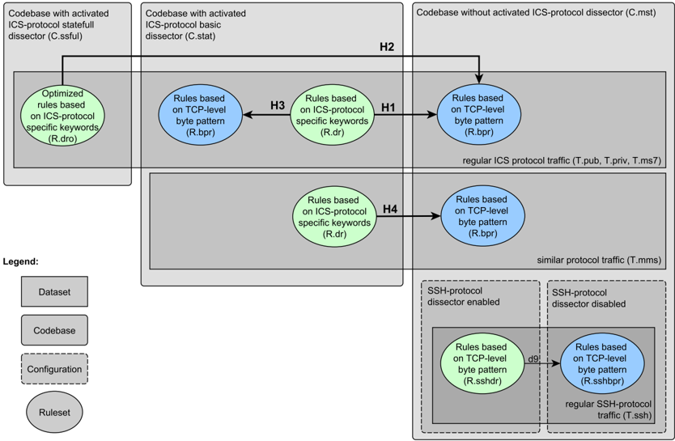

Có hai máy mổ được sử dụng. Đầu tiên, bộ phân tích S7Comm được trình bày trong quá trình triển khai, được sử dụng làm bộ phân tích giao thức ICS để đánh giá. Thứ hai

đã vận chuyển trình phân tích Giao thức Shell an toàn (SSH). Bộ phân tích S7Comm được đánh giá theo bốn biến thể. Biến thể cơ bản không trạng thái và phân tích giao thức theo cách tĩnh. Biến thể động không trạng thái và phân tích danh sách động. Biến thể trạng thái cũng phân tích cú pháp tĩnh. Mặc dù phiên bản cơ bản đã được điều chỉnh nhưng vẫn có một phiên bản cuối cùng chưa được điều chỉnh được sử dụng để điều tra những cải tiến có thể thực hiện được bằng cách điều chỉnh. Các phiên bản sẽ được thảo luận chi tiết trong phần thực hiện.

Việc đánh giá diễn ra bằng cách sử dụng Suricata IDS trên hai nền tảng thử nghiệm khác nhau. Có các bộ quy tắc dựa trên các mẫu byte cấp TCP, các quy tắc dựa trên các từ khóa dành riêng cho giao thức ICS và cũng có một bộ quy tắc cho các từ khóa dành riêng cho giao thức SSH. Để tắt tính năng phát hiện, một bộ quy tắc trống được sử dụng. Có năm tệp PCAP khác nhau làm tập dữ liệu. Tùy thuộc vào thử nghiệm, các số liệu khác nhau về việc sử dụng tài nguyên được sử dụng. Có bốn cơ sở mã khác nhau của Suricata được sử dụng.

Những ảnh hưởng có thể gây trở ngại cho các thí nghiệm đã bị loại bỏ. Chúng bao gồm đầu ra IDS và ảnh hưởng của việc xử lý các quy trình khác. Việc ghi nhật ký Suricata IDS bị vô hiệu hóa hoàn toàn. Chỉ có lỗi được hiển thị. Các quy trình khác được di dời sang các lõi CPU khác và trong thử nghiệm, lõi CPU độc quyền được sử dụng (lõi được bảo vệ). Tuy nhiên, đối với kịch bản điều tra sự cải thiện bằng cách sử dụng nhiều lõi (d9), thử nghiệm được thực hiện trên các lõi không được che chắn. Ngoài ra, tất cả các thử nghiệm đo lường hiệu suất xử lý đều được lặp lại trong n=100 lần. Cần có số lần lặp lại thử nghiệm cao nhất có thể để loại bỏ các ảnh hưởng không có hệ thống và cũng cần thiết để thử nghiệm thống kê giả định phân bố chuẩn.

Bảng 3.1.: Thiết lập cho từng kịch bản được minh họa trong Hình 3.1

| Scenario                           | Ruleset   | Datasets                  | Codebase   | Configuration     |
|------------------------------------|-----------|---------------------------|------------|-------------------|
| without dissector                  | -         | T.priv+T.pub+T.ms7        | C.mstr     |                   |
| unused dissector                   | -         | T.priv+T.pub+T.ms7        | C.p103     |                   |
| parsing dissector                  | -         | T.priv+T.pub+T.ms7        | C.stat     |                   |
| detecting dissector                | R.dr      | T.priv+T.pub+T.ms7 +T.mms | C.stat     |                   |
| without ssh dissector              | -         | T.ssh                     | C.mstr     | disabl. ssh diss. |
| parsing ssh dissector              | -         | T.ssh                     | C.mstr     |                   |
| detecting ssh dissector            | R.sshdr   | T.ssh                     | C.mstr     |                   |
| dynamic parsing                    | -         | T.priv+T.pub+T.ms7        | C.dyn      |                   |
| stateful parsing                   | -         | T.priv+T.pub+T.ms7        | C.ssful    |                   |
| untuned dissector                  | R.dr      | T.priv+T.pub+T.ms7        | C.notun    |                   |
| tuned ruleset                      | R.dro     | T.priv+T.pub+T.ms7        | C.stat     |                   |
| multi core                         | R.dr      | T.priv+T.pub+T.ms7        | C.stat     | all cpu cores - 1 |
| byte pattern with dissector        | R.bpr     | T.priv+T.pub+T.ms7        | C.stat     |                   |
| byte pattern without dissector     | R.bpr     | T.priv+T.pub+T.ms7        | C.mstr     |                   |
| ssh byte pattern without dissector | R.sshbpr  | T.ssh                     | C.mstr     | disabl. ssh diss. |

Để kiểm tra tầm quan trọng của các giả thuyết H1-H4, người ta sử dụng phép thử Welch t-test một phía, không ghép đôi (t-test phương sai không bằng nhau). Theo Ruxton [26], để 'so sánh xu hướng trung tâm của 2 quần thể dựa trên các mẫu dữ liệu không liên quan, thì phải luôn sử dụng t-test phương sai không bằng nhau'. Kiểm định t Welch giả định rằng dữ liệu được phân phối bình thường [36]. Tuy nhiên, theo định lý giới hạn trung tâm cho n lớn hơn 30, có thể giả sử phân phối chuẩn. Dưới mức ý nghĩa 5% đối với tất cả các tập dữ liệu và đối với cả hai cơ sở thử nghiệm, giả thuyết được coi là đúng.

Phần sau đây sẽ giải thích cách thiết lập chi tiết. Việc thiết lập H1 đến H2 cũng được hiển thị trong Hình 3.2. Trong Bảng 3.1, ánh xạ về thiết lập nào được chọn cho kịch bản nào được liệt kê.

## 3.2.1. giường thử nghiệm

Có hai thử nghiệm đã được sử dụng. Đầu tiên, nó được đánh giá trên một máy tính bình thường (máy tính xách tay) và thứ hai là nghiên cứu cách thức hoạt động của bộ phân tích trên máy tính bảng đơn thông thường Raspberry Pi. Raspberry Pi thường được sử dụng làm bảng phát triển và do đó có thể giúp hình dung và tái tạo kết quả tốt hơn. Nó cũng được Văn phòng Liên bang về An toàn Thông tin (BSI) sử dụng cho các dự án IDS cũng trong bối cảnh ICS. Suricata được vận hành ở chế độ ngoại tuyến bằng cách sử dụng các tệp PCAP được đọc từ ổ cứng hoặc thẻ Dung lượng cao kỹ thuật số an toàn (SDHC).

Do lỗi 2 nên phiên bản Rust từ trình cài đặt gói Debian APT không được sử dụng. Thay vào đó, phiên bản mới nhất của Rust (rustc 1.49.0) đã được cài đặt từ trang web 3 .

- Máy tính được sử dụng có hệ điều hành Ubuntu 20.04.2 LTS mới được cài đặt. Phiên bản nhân Linux 5.4.0-73 chung được sử dụng. Nó được trang bị CPU Intel Core i7-3610QM tốc độ 2,30GHz, Bộ nhớ truy cập ngẫu nhiên (RAM) 8 GB và Ổ cứng thể rắn (SSD) SanDisk SDSSDH35. Có 4 lõi, mỗi lõi có hai luồng có sẵn bằng cách sử dụng siêu phân luồng được kích hoạt. Suricata được biên dịch và cài đặt theo khuyến nghị 4 cho Debian nhưng sử dụng phiên bản tự phát triển.
- Ngoài ra còn sử dụng Raspberry Pi 4 Model B Rev 1.2 với 2 GB RAM và CPU ARMv7 Industry rev 3 (v7l). CPU có 4 lõi với mỗi luồng có sẵn. Hệ thống được khởi động từ SDHC gần đây. Là hệ điều hành, phiên bản chính thức của Raspberry Pi OS Lite 5 với Linux Kernel 5.10.11-v7l+ được sử dụng.

Cả hai hệ thống đều chạy mà không có môi trường máy tính để bàn đồ họa để tránh làm giảm hiệu suất xử lý.

2 Xem thêm Xây dựng tràn ngăn xếp Suricata không biên dịch -https://stackoverflow com/questions /65330382/building-suricata-could-not-compile-der-parser - Đã truy cập: 28 tháng 1 21

3 Cài đặt Rust https://www Rust-lang org/tools/install - Đã truy cập và cài đặt: 28.01.21

4 Cài đặt Suricata từ GIT https://redmine openinfosecfoundation org/projects/suricata/wik i/Ubuntu \_ Cài đặt \_ từ \_ GIT - Đã truy cập: ngày 15 tháng 6 năm 2021

5 Raspberry Pi OS Lite https://www Raspberrypi org/software/operating-systems/#raspberry-pi-os32-bit - Đã truy cập và tải xuống lúc 28.01.21

## 3.2.2. Bộ quy tắc

Tổng cộng có 5 bộ quy tắc được sử dụng để đánh giá. Các quy tắc không lọc ở cấp độ mạng. Điều này có nghĩa là các quy tắc có thể khớp với bất kỳ địa chỉ IP nào.

- R.bpr - Trong luận án tốt nghiệp của Fischer [13] các lệnh quan trọng của giao thức S7Comm được xác định và một bộ quy tắc được tạo ra phù hợp với các lệnh này. Bộ quy tắc dựa trên cách tiếp cận mẫu byte và do đó sử dụng từ khóa offset và nội dung để khớp với các giá trị byte trong tải trọng của khung TCP. Bộ quy tắc ban đầu của Fischer [13] cũng sử dụng các bộ lọc cho địa chỉ IP. Những bộ lọc này đã bị loại bỏ. Ngoài ra, các quy tắc chung, bốn quy tắc ngưỡng và giới hạn ngưỡng cũng đã bị xóa. Các quy tắc chung trong Fischer [13] chỉ được sử dụng để phát hiện lưu lượng S7Comm và do đó phản ánh việc phát hiện sự cố không có ý nghĩa. Chúng có thể được xem nhiều hơn như các quy tắc để gỡ lỗi phát hiện. Các quy tắc ngưỡng và giới hạn ngưỡng được sử dụng để giới hạn cảnh báo theo Giao thức Internet (IP) đích. Tuy nhiên, để đánh giá, chỉ có việc phát hiện trên lớp ứng dụng được tập trung để loại bỏ các yếu tố ảnh hưởng đến các lớp bên dưới. Tổng cộng bộ quy tắc bao gồm 64 quy tắc còn lại.
- R.dr - Bắt nguồn từ tệp quy tắc R.bpr, tệp quy tắc dựa trên bộ phân tích đã được tạo bằng cách sử dụng tập lệnh đã phát triển được giải thích trong Phần 4.6.1. Nó dịch từng mẫu byte thành từ khóa và giá trị tương ứng được sử dụng cho bộ phân tích.
- R.dro - Bộ quy tắc được đề cập ở trên ( R.dr ) có thể được tối ưu hóa. Số lượng quy tắc tương tự được sử dụng cũng phát hiện các trường hợp tương tự đối với T.pub và T.priv . Tuy nhiên, như được mô tả trong phần 4.5.3, cần ít từ khóa giao thức ICS hơn.
- R.sshbpr - Đối với các thử nghiệm SSH, một tệp quy tắc được tạo chứa các quy tắc phù hợp với các phiên bản SSH và phần mềm. Các phiên bản SSH 1.0, 1.9 và 2.0 được sử dụng. Đối với phần mềm OpenSSH, dropbear và cisco được yêu cầu. Tổng cộng điều này dẫn đến chín quy tắc. Các quy tắc được viết dựa trên mẫu byte cho bộ quy tắc này.
- R.sshdr - Bộ quy tắc trước R.sshbpr được dịch cho trình phân tích SSH đã được chuyển đi bằng cách sử dụng tài liệu 6 .

## 3.2.3. Tập dữ liệu

Đối với giao thức S7Comm, ba bộ dữ liệu khác nhau được sử dụng. Trong khi hai trong số chúng được công bố rộng rãi thì cũng có một cái hiện chưa được xuất bản. Ngoài ra, lưu lượng truy cập cho MMSover-TCP được sử dụng cho trường hợp lưu lượng truy cập tương tự trên cùng một cổng. Đối với các thử nghiệm trên trình phân tích SSH, tập dữ liệu SSH được sử dụng.

- T.pub - Tệp 7 PCAP công khai có nguồn gốc từ một cơ sở thử nghiệm. Bên cạnh tệp PCAP được sử dụng khi mô phỏng các cuộc tấn công, còn có tệp PCAP kiểm soát được

6 Trình phân tích SSH trong Suricata https://suricata readthedocs io/en/suricata-6 0 0/rules/ssh-keywords html - Truy cập: ngày 10 tháng 6 năm 2021

7 Tệp PCAP đã được thử nghiệm https://github com/qut-infosec/2017QUT \_ S7comm/blob/master/LabelledDatase t/20161215163606 \_ s7 \_ process \_ attack/hmi pcap zip - Đã truy cập và sao chép lúc 08.06.21

Error 504 (Server Error)!!1504.That’s an error.There was an error. Please try again later.That’s all we know.

- T.priv - Tập dữ liệu riêng tư ban đầu bao gồm 30 tệp PCAP riêng biệt, trong đó các hoạt động khác nhau sử dụng giao thức S7Comm được ghi lại. Các tệp PCAP được hợp nhất cùng với một tập lệnh được mô tả trong Phần 4.6.5. Tệp PCAP đã hợp nhất cũng như các tệp đơn chưa được hợp nhất sẽ kích hoạt tất cả các bộ quy tắc S7Comm (R.bpr, R.dr, Rdro), cùng 912.242 cảnh báo được phân bổ trên 59 quy tắc.
- T.ms7 - Bộ dữ liệu Mining S7 có sẵn công khai, được mô tả trong Myers et al. [25], được tạo ra trên mạng điều khiển quá trình bao gồm bốn PLC Siemens S7-1200, trong đó mỗi PLC điều khiển một hệ thống quy mô công nghiệp. Như được mô tả trong Myers et al. [25], 'bộ tấn công đã sử dụng chứa 21 cuộc tấn công mạng được thực hiện trên PLC Siemens S7-1200'. Bộ dữ liệu tương tự như T.pub vì nó chia sẻ một số địa chỉ phần cứng. Không thể làm rõ liệu cả hai dữ liệu có bắt nguồn từ cùng một thiết bị hay không. Tuy nhiên, IP và ngày chụp khác nhau. Từ tập dữ liệu, một luồng TCP đã bị xóa do một số gói TCP có thể chưa được ghi lại đúng cách. Ở đây giả định rằng dữ liệu bị thiếu được ghi lại trên thiết bị đích trong một tệp trên đĩa có thể được gây ra theo những cách khác (ví dụ: lỗi ghi đĩa) so với khả năng có thể xảy ra đối với hệ thống IDS. Vì vậy không thể loại trừ rằng dữ liệu này làm sai lệch việc đánh giá. Tuy nhiên, luồng TCP bị loại bỏ chỉ chiếm 0,017% tổng số dữ liệu. Vì dữ liệu là một đoạn trích của dữ liệu được truyền nên quá trình bắt tay TCP đối với một số luồng không được ghi lại và phải được thêm vào một cách tổng hợp bằng tập lệnh được mô tả trong Phần 4.6.3. Tập dữ liệu này không được cố ý sử dụng để phát triển hoặc thử nghiệm nhằm cho phép đánh giá dữ liệu chưa được xem.
- T.mms - Giao thức MMS-over-TCP (như được định nghĩa trong IEC 61850) tương tự như giao thức S7Comm vì nó sử dụng cùng một cổng và cũng dựa trên ISO-Stack. Nó được sử dụng ở đây để đánh giá khả năng phát hiện giao thức động bị thiếu đối với các quy tắc mẫu byte. Trong tập dữ liệu gốc 8 chỉ có 498 gói MMS-over-TCP được ghi lại. Người ta giả định rằng chi phí phân tích các gói là quá nhỏ để có thể quan sát được. Do đó, tệp PCAP được mở rộng bằng cách lặp lại các lệnh MMS 10.000 lần bằng cùng một luồng TCP để mô phỏng kết nối dài hơn. Việc này được thực hiện bằng kịch bản được mô tả ở Phần 4.6.4.

8 Bộ dữ liệu MMS-over-TCP -https://github com/ITI/ICS-Security-Tools/blob/master/pcaps/IE C61850/8d7c7db0-9804-012b-b2a6-0016cb8cea27 pcap - Truy cập: ngày 10 tháng 6 năm 2021

- T.ssh - Để đánh giá trình phân tích SSH, tập dữ liệu có tên 'jubrowska capture' 9 từ hack.lu Cuộc thi trực quan hóa bảo mật thông tin năm 2009 được sử dụng. Nó bao gồm lưu lượng SSH và HTTP từ honeypot. Tệp PCAP chứa khoảng 2,23 triệu gói TCP trên cổng 22 (cổng ssh), chiếm khoảng 51,7% số gói. Tuy nhiên các gói này được phân phối trên 1 triệu luồng TCP. Mỗi tệp quy tắc (R.sshbpr và R.sshdr) kích hoạt 16 cảnh báo.

## 3.2.4. Số liệu

Việc sử dụng tài nguyên được sử dụng với 4 số liệu:

- CPUClockTicks / Rules - Chúng được cung cấp bởi thống kê do Suricata tạo ra. 10 Thống kê hồ sơ quy tắc được kích hoạt bởi cờ -enable-profiling được sử dụng để biên soạn Suricata. Vì nó có tác động đến các số liệu khác nên nó luôn được sử dụng trong một thử nghiệm riêng biệt. 11
- Việc chiếm dụng bộ nhớ tối đa của các quy trình Suricata được ghi lại bằng cách sử dụng đầu ra của chương trình ps 12, được thực thi sau mỗi 0,25 giây bởi một tập lệnh.
- Thời gian chạy được dùng làm thước đo tốc độ xử lý của gói tin. Do đó, thời gian được đo là Suricata cần xử lý tất cả các gói từ tập dữ liệu. Điều này được đo bằng avgtime 13 tương tự như lệnh thời gian của Linux ngoại trừ khả năng sử dụng lặp lại trực tiếp. Tuy nhiên, tính năng này không được sử dụng để đánh giá. Thay vào đó, trong bản thân thí nghiệm, không chỉ việc thực hiện Suricata được lặp lại. Điều này là cần thiết để tách các lần lặp lại cho các số liệu khác.

## 3.2.5. Cơ sở mã

Có sáu cơ sở mã khác nhau được sử dụng.

- C.mstr là nguồn Suricata chưa triển khai S7Comm. 14 Nó được sử dụng cho các thử nghiệm về các quy tắc dựa trên các từ khóa dành riêng cho giao thức SSH cũng như các quy tắc dựa trên mẫu byte cấp TCP (S7Comm và SSH).
- C.stat là cách triển khai cơ bản của bộ phân tích S7Comm như được mô tả trong phần triển khai (Chương 4). Bộ phân tích khớp bằng cách sử dụng bộ lọc trước. Trình phân tích cú pháp chỉ phân tích các trường tĩnh của dữ liệu S7Comm và lưu trữ từng yêu cầu hoặc phản hồi trong một giao dịch riêng biệt (không trạng thái).

9 Nguồn chụp Jubrowska https://www foo be/cours/dess-20092010/cap/others/jubrowska-captur e \_ 1 cap - Truy cập: ngày 11 tháng 6 năm 2021

10 Hồ sơ quy tắc https://suricata readthedocs io/en/suricata-6 0 1/performance/rule-profiling h tml - Truy cập: 31 tháng 1, 21

11 Tác động của phân tích hiệu suất-xử lý https://suricata readthedocs io/en/suricata-6 0 1/perf ormance/analysis html#rules - Truy cập: 08 tháng 6 năm 2021

12 chương trình Linux ps https://man7 org/linux/man-pages/man1/ps 1 html - Truy cập: 31/01/21

13 Mã nguồn thời gian trung bình https://github com/jmcabo/avgtime - Truy cập: ngày 10 tháng 6 năm 2021

14 Phiên bản Suricata được sử dụng https://github com/OISF/suricata/tree/226a82bade5d12eaf0784f5399b35bcd 8e50750c - Truy cập: 15 tháng 6 năm 2021

- C.dyn là việc triển khai bộ phân tích S7Comm như mô tả ở trên nhưng sử dụng phân tích cú pháp động của một số trường giao thức S7Comm (ví dụ: ReadVar và WriteVar ).
- C.ssful là triển khai của C.stat nhưng cả yêu cầu và phản hồi đều được lưu trữ cùng nhau trong một giao dịch (stateful).
- C.notun không sử dụng bộ lọc trước để khớp quy tắc, nhưng về mặt khác thì giống như C.stat.
- C.p103 là cách triển khai cơ bản của bộ phân tích ( C.stat ) nhưng cổng 103 thay vì cổng S7Comm 102 được sử dụng. Bằng cách này, cùng một tập dữ liệu có thể được sử dụng trong khi bản thân bộ phân tích không nhận được bất kỳ lưu lượng truy cập nào để xử lý. Bộ phân tích được khởi tạo và nối vào đường ống xử lý gói nhưng không được sử dụng cho bất kỳ quá trình xử lý gói nào. Điều này mô phỏng trường hợp không sử dụng lưu lượng S7Comm, tuy nhiên, theo cách này, nó có thể được so sánh với các trường hợp khác có cùng tập dữ liệu.

## 4. Thực hiện

Trong công việc này, một bộ phân tích giao thức S7Comm đã được phát triển. Bộ phân tích được triển khai như một phần của Suricata IDS. Luồng gói của Suricata IDS được hiển thị trong 4.1. Nhưng trước khi gói đến, IDS và bộ phân tích của nó đã được cấu hình và các bộ quy tắc được tải. Gói được IDS bắt hoặc được đọc từ tệp PCAP trước tiên sẽ chạy qua Giải mã gói và sau đó được đối sánh bằng cách phát hiện theo quy tắc và sau đó thông tin được ghi lại bởi phần Đầu ra. Các bộ phân tích có các nhiệm vụ khác nhau được phân bổ qua Giải mã gói, Phát hiện và cả Đầu ra. Bản thân bộ phân tích có thể được chia thành bộ phân tích cú pháp (để giải mã gói), phần dò tìm (để phát hiện), bộ ghi nhật ký (cho đầu ra).

Hình 4.1.: Các bộ phận phân tích trong luồng IDS (xem [15, Hình 1])

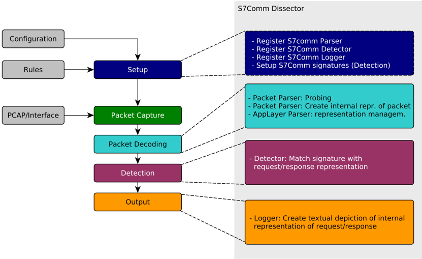

Trong phần này trước tiên sẽ trình bày tổng quan về quy trình thu thập thông tin của giao thức S7Comm và quá trình phát triển Suricata IDS. Vì bộ phân tích chủ yếu được phát triển ở Rust nên sau đó sẽ giới thiệu tổng quan cơ bản về các loại Rust được sử dụng.

Các loại này được sử dụng bởi cấu trúc dữ liệu của bộ phân tích được triển khai trong phần phân tích cú pháp và được sử dụng bởi các bộ phận phát hiện và ghi nhật ký. Cả cấu trúc dữ liệu và quá trình phân tích cú pháp đều được trình bày và các quyết định được đưa ra đều được thảo luận. Ngoài ra, việc triển khai phần logger và detector cũng như đầu ra thông qua nhật ký và đầu vào thông qua các quy tắc cũng được giải thích. Hơn nữa, các công cụ hỗ trợ được phát triển để xử lý trước các quy tắc và dữ liệu thử nghiệm cũng như xử lý hậu kỳ cho các tệp nhật ký cũng được giới thiệu ngắn gọn và chức năng của nó được giải thích. Cuối cùng, việc triển khai được tóm tắt bằng phần giới thiệu ngắn gọn về quá trình phát triển bộ phân tích ở Suricata bằng ngôn ngữ Rust.

##4.1. S7CommGiao thức và quản lý thông tin

Để phát triển bộ phân tích, cần có thông tin về giao thức S7Comm cũng như về cấu trúc bên trong và các quy ước mã hóa của Suricata IDS.

Đối với bộ phân tích S7Comm, ba nguồn thông tin sau đây chủ yếu được sử dụng. Đầu tiên là luận án cử nhân của Fischer, người đã áp dụng khung tự phát triển để nhận dạng giao thức S7Comm. Vì vậy, cô ấy đã mô tả ngắn gọn về giao tiếp S7Comm cũng như cấu trúc giao thức S7Comm cũng như cách tạo các quy tắc của nó trong cú pháp Suricata IDS tương tự như cú pháp Snort IDS. Cô cũng mô tả các trường, giá trị, ý nghĩa của chúng và xác định các giá trị quan trọng. Một nguồn thông tin có giá trị khác được sử dụng là công cụ phân tích S7Comm hiện có của Wireshark. Wireshark được sử dụng để phân tích các gói từ lưu lượng S7Comm đã ghi lại. Mặt khác, mã nguồn được sử dụng để hiểu quá trình phân tích cú pháp của gói S7Comm. Tên của các từ khóa được sử dụng cho bộ lọc hiển thị trong Wireshark cũng được sử dụng trong trình phân tích đã phát triển vì cách đặt tên rất phù hợp với quy ước đặt tên từ khóa trong Suricata. Nguồn thông tin thứ ba là nghiên cứu của Miru [24] trong đó S7Comm được mô tả chi tiết. Tuy nhiên, có một số xung đột trong cách đặt tên cũng như ý nghĩa của một số giá trị được mô tả cần được xác định và giải quyết. Để làm như vậy, một bảng đã được tạo chứa các giá trị có phần bù và ý nghĩa của chúng đối với từng nguồn. Một đoạn trích này được hiển thị trong 4.1. Có thể thấy hầu hết các giá trị đều trùng khớp. Một giá trị trong bảng được Miru khai báo là Điều khiển PLC nhưng được gọi là PI-Service trong mã nguồn Wireshark.

Để biết thông tin về cấu trúc Suricata IDS và các quy ước mã hóa, chủ yếu sử dụng mã nguồn của các bộ phân tích hiện có và mã cơ sở của Suricata kết hợp với hướng dẫn sử dụng. Thông tin từ Suricata Wiki 1 và Suricata Developers Guide 2 đã được xem xét nhưng ít được sử dụng vì thông tin không sâu rộng. Diễn đàn Suricata 3 cũng có thể được sử dụng cho các câu hỏi về sự phát triển. Hiện cũng đã có một bài viết về sự phát triển của máy mổ xẻ 4 . Trong bài đăng này chỉ ra rằng một

1 Suricata Wiki https://redmine openinfosecfoundation org/projects/suricata/wiki - Truy cập: ngày 18 tháng 5 năm 2021

2 Hướng dẫn dành cho nhà phát triển Suricata https://redmine openinfosecfoundation org/projects/suricata/wiki/Su ricata \_ Developers \_ Guide - Truy cập: ngày 18 tháng 5 năm 2021

3 Diễn đàn Suricata https://forum suricata io/ - Truy cập: ngày 16 tháng 6 năm 2021

4 Diễn đàn Suricata Bài đăng S7Comm - 5 - Truy cập: ngày 18 tháng 5 năm 2021

Bảng 4.1.: Trích nguồn thông tin so sánh của S7Comm

|             |                                                                                 |                                                             | Sources → Meaning                                                                                                                                                                                                                                                           | Sources → Meaning                                                                                                                                                                       | Sources → Meaning                                                                                                                                                                           | Sources → Meaning                                                                                                                                                     |
|-------------|---------------------------------------------------------------------------------|-------------------------------------------------------------|-----------------------------------------------------------------------------------------------------------------------------------------------------------------------------------------------------------------------------------------------------------------------------|-----------------------------------------------------------------------------------------------------------------------------------------------------------------------------------------|---------------------------------------------------------------------------------------------------------------------------------------------------------------------------------------------|-----------------------------------------------------------------------------------------------------------------------------------------------------------------------|
| Byte Values | Byte Values                                                                     | Byte Values                                                 | [Gmiru]                                                                                                                                                                                                                                                                     | [Gmiru]                                                                                                                                                                                 | [Wireshark Source]                                                                                                                                                                          | [Wireshark Source]                                                                                                                                                    |
| Offset:     | 8                                                                               | 17                                                          | Field Name                                                                                                                                                                                                                                                                  | Value Name                                                                                                                                                                              | Field Name                                                                                                                                                                                  | Value Name                                                                                                                                                            |
| Values:     | 0x01 0x02 0x03 0x07 0x01 0x01 0x01 0x01 0x01 0x01 0x01 0x01 0x01 0x01 0x01 0x01 | 0x00 0xF0 0x04 0x05 0x1A 0x1B 0x1C 0x1D 0x1E 0x1F 0x28 0x29 | Message type Message type Message type Message type Job function code Job function code Job function code Job function code Job function code Job function code Job function code Job function code Job function code Job function code Job function code Job function code | Job Request Ack Ack-Data Userdata CPU services Setup comm. Read Variable Write Variable Req. download Download block Download ended Start upload Upload End upload PLC Control PLC Stop | header.rosctr header.rosctr header.rosctr header.rosctr param.func param.func param.func param.func param.func param.func param.func param.func param.func param.func param.func param.func | Job Ack Ack_Data Userdata CPU services Setup comm. Read Var Write Var Request downl. Download block Download ended Start upload Upload End upload PI-Service PLC Stop |

tập lệnh 6 tồn tại có thể tạo ra nền tảng của bộ phân tích. Tập lệnh này cũng được sử dụng để phát triển bộ phân tích S7Comm.

##4.2. Kiểu dữ liệu rỉ sét

Cấu trúc dữ liệu của AppLayer Parser cũng như Packet Parser được xây dựng trên các kiểu dữ liệu từ Rust.

- struct - Được sử dụng để gói nhiều giá trị thuộc các loại khác nhau lại thành một đơn vị, 7 ví dụ: cấu trúc gói bao gồm tiêu đề, tham số và phần dữ liệu. Một cấu trúc cũng có thể triển khai các hàm như to\_string() mà trong trường hợp này tạo ra một biểu diễn văn bản của cấu trúc có thể được sử dụng để gỡ lỗi hoặc ghi nhật ký.
- enum - Bảng liệt kê xác định một kiểu có tập hợp các tùy chọn có thể có. 8 Tùy chọn cũng có thể lưu trữ một giá trị được khai thác ở đây để tạo cấu trúc động hơn bằng cách cho phép phần tham số thuộc loại thông báo dữ liệu người dùng hoặc loại khác. Nó cũng cho phép triển khai một hàm được sử dụng ở đây để khớp các giá trị byte với tùy chọn chính xác ( from\_u8(...) ). Nó cũng được sử dụng để tạo từ biểu diễn bên trong giá trị từ khóa mà sau này được sử dụng trong quy tắc ( to\_str(...) ). Các chức năng này không được thể hiện rõ ràng trong Hình 4.2 đến Hình 4.4.

6 Tập lệnh mẫu phân tích Suricata https://github com/OISF/suricata/blob/def636383ec2f917e3bdb 20ee6619de226afca52/scripts/setup-app-layer py - Truy cập: ngày 18 tháng 5 năm 2021

7 Xem thêm tài liệu Rust về kiểu dữ liệu stuct https://doc Rust-lang org/book/ch05-00-struct s html - Truy cập: 20 tháng 5 năm 2021

8 Xem thêm tài liệu Rust về kiểu dữ liệu liệt kê https://doc Rust-lang org/book/ch06-00enums html - Truy cập: 20 tháng 5 năm 2021

- Tùy chọn - Tùy chọn là một kiểu liệt kê đặc biệt lưu trữ một cái gì đó hoặc không có gì. 9 Điều này được sử dụng ở đây, ví dụ: để trả về dưới dạng S7CommPacket nếu gói COTP chứa S7Comm trong tải trọng của nó hoặc không có gì nếu không. Trong các ngôn ngữ lập trình khác, con trỏ null thường được sử dụng thay thế.
- IResult - Là một bảng liệt kê từ khung tổ hợp Nom có ​​các tùy chọn Done , Error và Incomplete . Nó được trả về khi sử dụng trình phân tích cú pháp chữ Nôm cũng như trường hợp của trình phân tích cú pháp gói. Tùy chọn Xong chứa cấu trúc dữ liệu được phân tích cú pháp thành công, ví dụ: biểu diễn bên trong của gói S7Comm và cả dữ liệu còn lại không được trình phân tích cú pháp sử dụng, ví dụ: gói dữ liệu tiếp theo nếu có nhiều hơn một gói được bao gồm. Tùy chọn Chưa hoàn thành có thể chứa số byte cần thiết. Và Lỗi chứa một bảng liệt kê có thể bao gồm ví dụ: mã lỗi. 10
- Kiểu số nguyên - Kiểu số nguyên u8 được sử dụng để lưu trữ giá trị byte hoặc số nguyên 8 bit, trong khi u16 thường được sử dụng cho độ dài của các phần S7Comm như độ dài phần dữ liệu. Nó cũng được sử dụng để lưu trữ địa chỉ được truy cập bởi hàm ReadVar hoặc WriteVar (Xem thêm Hình 4.4).
- Vec&lt;T&gt; - Một vectơ lưu trữ một lượng động các giá trị cùng loại T . 11 Ở đây nó được sử dụng chủ yếu để lưu trữ các giao dịch của kết nối TCP. Ngoài ra, đối với trình phân tích cú pháp động, nó còn được sử dụng cho các danh sách trong giao thức S7Comm cũng như để lưu trữ dữ liệu biến đổi của hàm ReadVar và WriteVar cho các loại thông báo Yêu cầu công việc và Dữ liệu Ack.
- Kiểu mảng - Giống như trong các ngôn ngữ lập trình khác, mảng cho phép kết hợp một số giá trị cố định của cùng một kiểu dữ liệu. Một mảng u8 lưu trữ dữ liệu thô của gói ở đây. Nó thường chỉ được sử dụng ở đây trong khi xử lý gói cho đến khi biểu diễn bên trong được phân tích cú pháp. Một ngoại lệ là phần đầu trường S7Comm dành cho loại thông báo userdata .
- Hộp&lt;T&gt; - Là con trỏ tới giá trị kiểu T được lưu trong vùng nhớ. Trong tài liệu của Rust, nó được gọi là '[t]he con trỏ thông minh đơn giản nhất' 12 . Ở đây nó được sử dụng để đóng gói mảng byte đầu được đề cập ở trên cho loại dữ liệu người dùng, vì dữ liệu không được sao chép trong khi chuyển quyền sở hữu, ví dụ: đến máy dò. Tại thời điểm này, bạn cũng có thể nhận ra nó bằng cách sao chép trên ghi.

##4.3. Cấu trúc dữ liệu và lệnh gọi lại của trình phân tích cú pháp AppLayer

Phần lớp ứng dụng của trình phân tích cú pháp cung cấp giao diện cho phần mã c, phải quản lý thông tin về các gói kết nối giữa máy chủ và cả các thanh ghi

9 Xem tài liệu Rust về kiểu dữ liệu tùy chọn https://doc Rust-lang org/book/ch06-01-definingan-enum html#the-option-enum-and-its-advantages-over-null-values ​​- Đã truy cập: 20 tháng 5, 21

10 Mô tả Nom IResult https://docs rs/nom/3 2 1/nom/enum IResult html - Truy cập: 21/05/21

11 Xem thêm tài liệu Rust về loại vectơ https://doc Rust-lang org/book/ch06-01-definingan-enum html#the-option-enum-and-its-advantages-over-null-values ​​- Truy cập: 21/05/21

12 https://doc Rust-lang org/book/ch15-01-box html - Truy cập: ngày 20 tháng 5 năm 2021

bộ phân tích đến đường ống xử lý gói Suricata. Nó ủy quyền tất cả các nhiệm vụ phân tích cú pháp cụ thể cho phần phân tích cú pháp gói. Nó cũng chịu trách nhiệm quản lý phần cấp trên của cấu trúc dữ liệu. Như được hiển thị trong Hình 4.2, mức cao nhất của cấu trúc dữ liệu

Hình 4.2.: Các mối quan hệ trong cấu trúc dữ liệu ở cấp độ Trình phân tích cú pháp AppLayer

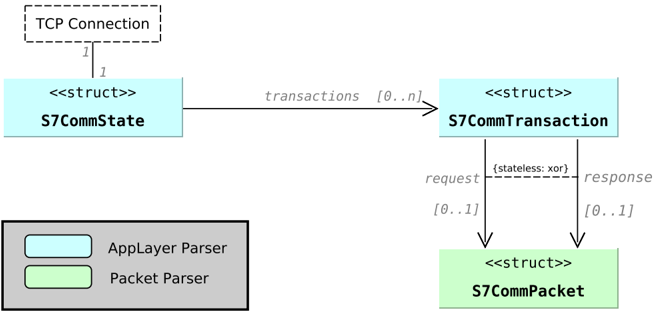

người mổ xẻ quản lý cái gọi là trạng thái. Mỗi trạng thái đại diện cho một kết nối TCP và chứa cái gọi là giao dịch. Một giao dịch chứa một yêu cầu hoặc một phản hồi. Nó có thể được phân biệt giữa một người mổ xẻ không quốc tịch và một người mổ xẻ có trạng thái. Sự khác biệt giữa điều này là quyết định khi giao dịch hoàn tất hoặc giao dịch chứa gì. 13 Nó có thể hoàn chỉnh nếu nó chứa yêu cầu hoặc phản hồi. Ngoài ra, yêu cầu và phản hồi có thể được khớp và lưu trữ cùng nhau trong một giao dịch. Đối với bộ phân tích cơ bản, biến thể không trạng thái đã được sử dụng, vì người ta cho rằng hiệu suất xử lý có thể bị suy giảm khi bộ phân tích, ví dụ: phải chờ phản hồi phù hợp sau khi nhận được yêu cầu. Tuy nhiên, một biến thể có trạng thái cũng được phát triển và sau đó được đánh giá dựa trên biến thể không có trạng thái.

Trong quá trình đăng ký, cổng và các lệnh gọi lại cần thiết cho trình phân tích cú pháp đã được đăng ký và cũng có thể đặt các cờ tùy chọn. Các lệnh gọi lại chính được sử dụng cho bộ phân tích S7Comm là:

- rs\_s7comm\_probing\_parser - Gọi lại được sử dụng để phát hiện giao thức động. Nó được gọi một lần cho mỗi hướng của kết nối TCP mới trên cổng 102. Nó phản hồi bằng ALPROTO\_UNKNOWN nếu giao thức S7Comm không được phát hiện, nếu không nó sẽ trả về ALPROTO\_S7COMM . ALPROTO là viết tắt của giao thức lớp ứng dụng. Nếu dữ liệu được phân loại là không xác định thì bộ phân tích sẽ không được gọi nữa nếu các gói mới của luồng TCP đến. Mỗi hướng của luồng được xử lý riêng biệt. Tại thời điểm này, tốt hơn hết là bạn nên phân loại nhầm nó thành lưu lượng truy cập S7Comm và sau đó trả về lỗi, sau đó cũng lọc luồng ra đây nếu đó là S7Comm. Để quyết định điều này, trình phân tích gói được sử dụng.

13 Giao dịch bộ giải mã Applayer https://redmine openinfosecfoundation org/projects/suricata/wik i/AppLayer \_ Bộ giải mã - Đã truy cập: 18 tháng 5, 21

- rs\_s7comm\_parse\_request và rs\_s7comm\_parse\_response được gọi nếu dữ liệu luồng TCP mới xuất hiện trên luồng TCP được trình phân tích cú pháp thăm dò phát hiện là S7Comm. Thông thường dữ liệu đầu vào chứa chính xác một khung TCP, nhưng không nhất thiết phải như vậy. Hàm phân tích gói S7Comm và tạo giao dịch nếu cần. AppLayerResult::err được trả về nếu xảy ra lỗi nghiêm trọng và không thể khôi phục luồng dữ liệu. Trong trường hợp này, kết nối TCP sẽ không còn được coi là lưu lượng S7Comm nữa và lệnh gọi lại sẽ không được gọi nữa. Nó cũng có thể trả về AppLayerResult::ok nếu gói có thể được phân tích cú pháp hoàn toàn. Nếu thiếu dữ liệu để phân tích cú pháp dữ liệu đã cho đầy đủ thì AppLayerResult::incomplete sẽ được trả về.
- rs\_s7comm\_state\_new - Một trạng thái mới, ví dụ: sau này chứa các giao dịch được tạo ra. Điều này được gọi sau khi phát hiện giao thức động thành công bao gồm cả việc thăm dò.
- rs\_s7comm\_state\_free - Bộ nhớ được phân bổ của trạng thái nhất định được giải phóng. Điều này được gọi khi kết nối TCP bị đóng hoặc bị loại bỏ do lỗi.
- rs\_s7comm\_state\_tx\_free - Giao dịch đã cho sẽ bị xóa khỏi trạng thái đã cho. Điều này được gọi khi dữ liệu được phân tích cú pháp cho giao dịch không còn cần thiết nữa, ví dụ: nếu việc phát hiện và ghi nhật ký được thực hiện.
- rs\_s7comm\_state\_get\_tx - Giao dịch được trả về bởi id đã cho. Điều này thường được gọi sau khi giao dịch hoàn tất và nó phải được ghi lại hoặc khớp với quy tắc (phát hiện).
- rs\_s7comm\_state\_get\_tx\_count - Trả về số lượng giao dịch đang diễn ra và có thể được Suricata sử dụng để phát hiện xem có giao dịch mới hay không.
- rs\_s7comm\_tx\_get\_alstate\_progress - Trả về một giao dịch nhất định nếu nó hoàn tất. Vì bộ phân tích được phát triển (phiên bản cơ bản) không có trạng thái nên giao dịch luôn được hoàn thành vì nó được tạo khi có yêu cầu hoặc phản hồi.

Có hai lá cờ có thể được chèn vào cho người mổ xẻ. Cờ AC-CEPT\_GAPS cho phép các khoảng trống trong luồng TCP nếu không luồng TCP được coi là bị cắt bớt và quá trình kiểm tra luồng bị dừng. 14 Cờ khác có thể được chuyển là UNIDIR\_TXS . Nó cho phép Suricata chỉ kiểm tra một phía của kết nối. 15 Cả hai cờ đều không được sử dụng cho bộ phân tích đã phát triển vì cả hai bên đều cần được kiểm tra và việc xử lý khoảng cách hiện không được hỗ trợ trong bộ phân tích. Sự hỗ trợ cho các khoảng trống có thể được thêm vào trong tương lai nếu cần. Tùy chọn, có thể đặt giá trị tùy chỉnh cho độ sâu luồng của trình phân tích cú pháp trong quá trình đăng ký. Điều này là cần thiết để chỉ định số byte của luồng TCP sẽ được phân tích cú pháp sau khi quá trình kiểm tra kết thúc. 16 Vì trình phân tích sẽ kiểm tra toàn bộ kết nối nên giá trị này được đặt thành không giới hạn (Giá trị: 0).

14 Mã nguồn Suricata mô tả cờ khoảng trống chấp nhận https://github com/OISF/suricata/blob/de f636383ec2f917e3bdb20ee6619de226afca52/src/app-layer-parser c#L1215

15 Nhận xét nguồn Suricata về cờ unidir https://github com/OISF/suricata/blob/def636383ec2f 917e3bdb20ee6619de226afca52/src/app-layer-parser c#L979 - Truy cập: 18 tháng 5, 21

16 Độ sâu luồng cấu hình Modbus https://suricata readthedocs io/en/latest/configuration/su ricata-yaml html?highlight = deep#modbus - Truy cập: 18 tháng 5 21

##4.4. Cấu trúc dữ liệu của trình phân tích gói

Trình phân tích gói không được hiển thị với phần còn lại của Suricata. Nó chứa trình phân tích cú pháp thăm dò và trình phân tích cú pháp chính cho tiêu đề COTP bao gồm các gói S7Comm được chứa. Nó cũng cung cấp cấu trúc dữ liệu của cách biểu diễn nội bộ từ yêu cầu hoặc phản hồi S7Comm. Bằng cách này, dữ liệu gói thô không còn cần thiết nữa. Trình ghi nhật ký và trình phát hiện đã sử dụng biểu diễn bên trong của gói như được tham chiếu trong Hình 4.1.

## 4.4.1. Cấu trúc dữ liệu

Hình 4.3.: Cấu trúc dữ liệu biểu diễn bên trong

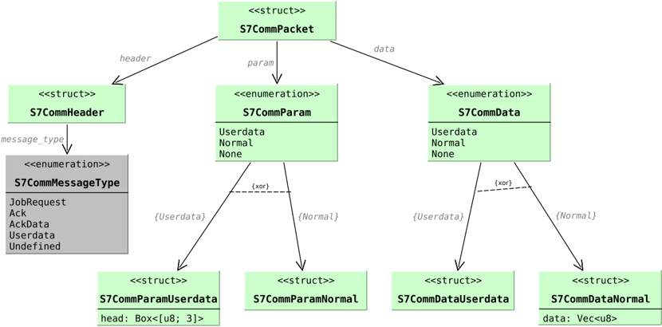

Cấu trúc dữ liệu bắt đầu ở Hình 4.2 với S7CommPacket được chia thành tiêu đề, tham số và dữ liệu. Vì tham số phụ thuộc vào loại thông báo là một phần của tiêu đề nên nó được phân biệt bằng cách liệt kê giữa Userdata , Normal và None cho cả dữ liệu và phần tham số. Loại thông báo Yêu cầu công việc và Dữ liệu xác nhận được bao phủ bởi cấu trúc Bình thường vì nó có cấu trúc cơ bản tương tự. Dữ liệu người dùng được tách biệt vì nó có các thuộc tính khác nhau có thể được nhìn thấy bằng cách so sánh Hình 4.4 và Hình 4.5. Loại thông báo Ack không có tham số hoặc phần dữ liệu, do đó None được sử dụng ở đây. Ngoài ra độ dài tiêu đề phụ thuộc vào loại tin nhắn. Đối với các thông báo Ack và Ack Data cũng có lớp lỗi và mã lỗi ở cuối tiêu đề. Trong phiên bản phát triển của bộ phân tích, giá trị này không được lưu trữ. Vì giao thức không có thông số kỹ thuật đầy đủ nên có thể luôn có các giá trị không được đề cập. Để giải quyết vấn đề này, luôn có một tùy chọn dự phòng được gọi là không xác định như có thể thấy trong bảng liệt kê trong Hình 4.4. Khi tùy chọn được chọn, giá trị byte cũng được lưu trữ. Điều này có thể được sử dụng để cung cấp khả năng sử dụng các giá trị byte này trong quy tắc. Tuy nhiên, điều này vẫn chưa được thực hiện. Như có thể thấy trong Hình 4.4, tất cả các phần tử S7CommSubfunction đều nằm trong một bảng liệt kê. Điều này đã được quyết định mặc dù chức năng phụ phụ thuộc vào chức năng

Hình 4.4.: Cấu trúc dữ liệu phân tích cú pháp của các tham số userdata S7Comm

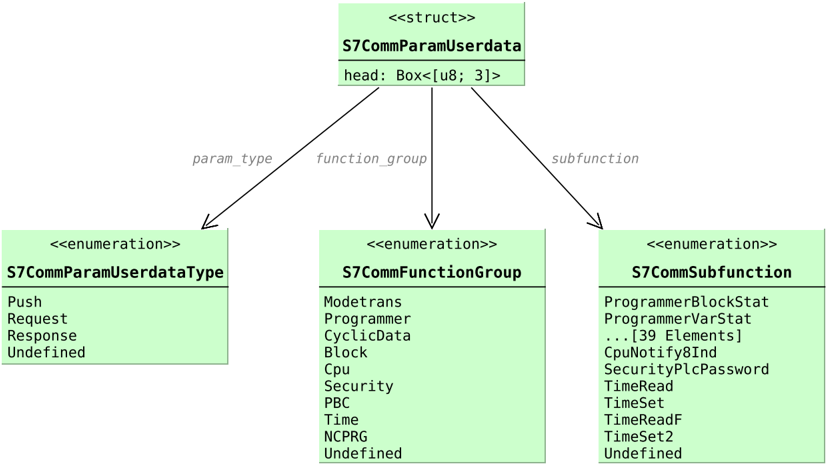

nhóm để giữ cho cấu trúc dữ liệu phẳng hơn. Mặt khác, đối với mỗi nhóm chức năng, phải có một bảng liệt kê riêng, điều này có thể làm suy yếu khả năng đọc mã do độ phức tạp và cũng có thể làm suy yếu hiệu suất xử lý thông qua cấu trúc phân nhánh hơn. Mặt khác, điều này có thể dẫn đến trạng thái biểu diễn bên trong không nhất quán mà trình phân tích cú pháp phải ngăn chặn xảy ra. Để giữ cho sự phụ thuộc rõ ràng, S7CommSubfunction được đặt trước tên S7CommFunctionGroup. Trong Hình 4.5, có thể thấy giá trị PIService như một phần của bảng liệt kê S7CommFunction. Giá trị này đã được thảo luận trước đó bằng cách sử dụng Bảng 4.1 làm ví dụ về sự thiếu nhất quán của các nguồn thông tin. Ngoài ra, mã nguồn Wireshark vốn không nhất quán đối với giá trị này vì cũng có những chỉ báo cho thấy giá trị có thể là PIStart tại thời điểm này. 17 Trong Hình 4.5 cũng có thể thấy rằng cấu trúc S7CommParamNormal chứa một danh sách các địa chỉ cho biết nơi nào đó được đọc hoặc ghi vào, ví dụ: trong trường hợp ReadVar và WriteVar . Do đó một danh sách các mục cũng được lưu trữ. Trình phân tích cú pháp phải dựa vào số lượng mục được cung cấp trong giao thức S7Comm và phải phân tích cú pháp động toàn bộ danh sách. Vì điều này có thể dẫn đến rủi ro bảo mật hơn nữa và cũng ảnh hưởng đến hiệu suất xử lý, điều này không được bao gồm trong biến thể tĩnh của bộ phân tích (phiên bản cơ bản). Vấn đề bảo mật xuất phát từ thực tế là nếu đưa ra số mục sai thì trình phân tích cú pháp sẽ tiêu thụ quá ít hoặc quá nhiều byte, điều này có thể dẫn đến trạng thái không thể phục hồi nếu không được ngăn chặn. Nó cũng có thể là cửa ngõ cho các cuộc tấn công liên quan đến bộ nhớ. Tuy nhiên điều này được ngăn chặn bằng ngôn ngữ Rust theo thiết kế.

Trong Hình 4.4, phần dữ liệu của S7Comm được hiển thị như thể hiện bên trong. Vì không có nguồn thông tin nào cho thấy điều gì khác biệt nên giả định rằng mã trả về

17 Mã nguồn Wireshark S7Comm có giá trị PIStart https://github com/wireshark/wireshark/blob/ 31ca47eafcce356841a6bfc99c918013f4695f01/epan/dissectors/packet-s7comm c#L7571 -Đã truy cập: 20 tháng 5, 21

Hình 4.5.: Cấu trúc dữ liệu phân tích các thông số chuẩn của S7Comm

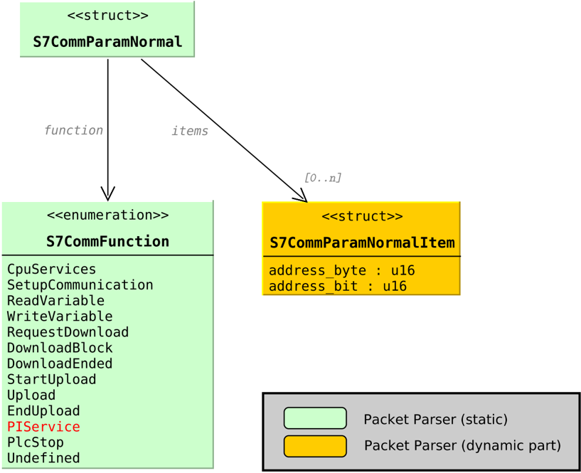

giống nhau đối với cả các hàm con phụ thuộc Khối của dữ liệu người dùng cũng như các mục của hàm ReadVar và WriteVar của loại thông báo Dữ liệu Yêu cầu Công việc và textitAck. Một quyết định khác được đưa ra ở đây là việc sử dụng cấu trúc dữ liệu giống chuỗi, trong đó S7CommBlockItem nằm giữa S7CommUserdata và S7CommBlockType mà không có thêm giá trị nào. Một cách tiếp cận khác ở đây là giữ cấu trúc phẳng hơn bằng cách giải thể chuỗi và nối thêm S7CommBlockType vào S7CommUserdata . Tuy nhiên, thiết kế này được chọn vì khả năng mở rộng. Bằng cách này, có thể thay đổi việc bổ sung các trường như số khối, cũng là một phần của vị trí khối trong S7Comm mà không cần phải tạo lại toàn bộ thiết kế. Như đã giải thích cho các mục tham số, các mục dữ liệu cũng chỉ là một phần của bộ phân tích động. Để phù hợp với chức năng của các quy tắc từ Fischer, mục đầu tiên của từng mục khối và mục thông thường sẽ được phân tích cú pháp nếu tồn tại.

Đối với trình phân tích cú pháp thăm dò, không có dữ liệu nào được lưu trữ vì nó chỉ phải trả về xem dữ liệu đã cho có cho biết lưu lượng truy cập S7Comm hay không.

Hình 4.6.: Cấu trúc dữ liệu phân tích cú pháp của dữ liệu S7Comm

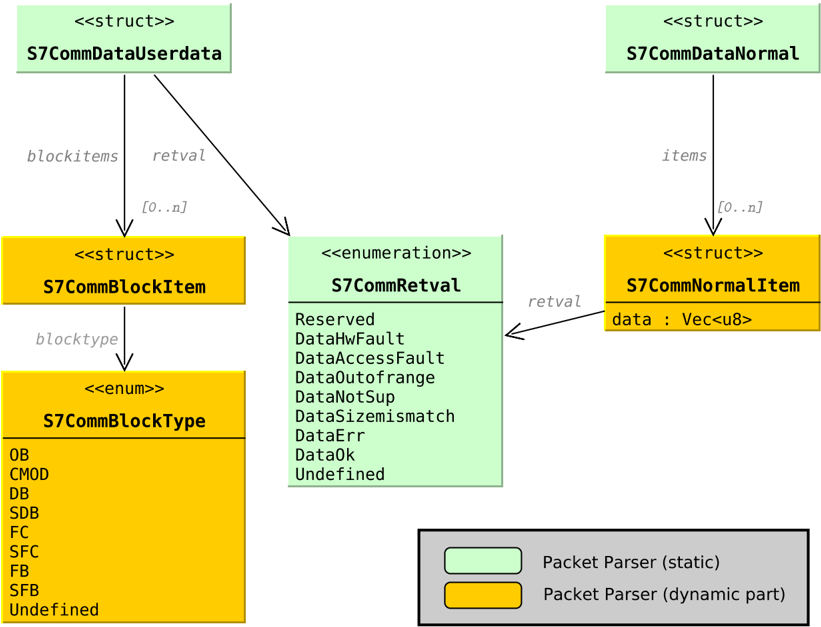

## 4.4.2. Phân tích cú pháp bằng chữ Nôm

Theo khuyến nghị của Suricata, trình phân tích sử dụng thư viện trình kết hợp trình phân tích cú pháp Nom cung cấp nhiều trình phân tích cú pháp có thể được kết hợp để phân tích dữ liệu theo mẫu từng byte. Các tổ hợp phân tích cú pháp sau đây được sử dụng 18 :

- take!(n) - Đọc số lượng n byte và trả về một mảng byte như được mô tả trong Phần 4.2. Nó cũng được sử dụng để bỏ qua các byte không cần thiết hoặc chỉ đọc một byte, có thể được chuyển đổi thành giá trị liệt kê sau đó bằng hàm from\_u8(...) được mô tả ở trên.

18 Xem thêm danh sách các tổ hợp chữ Nôm https://github com/Geal/nom/blob/master/doc/choosing \_ a \_ com binator md - Truy cập: 20/05/21

- tag!(A) - So khớp mảng byte A đã cho với dữ liệu. Nó được sử dụng để khớp với loại giao thức của S7Comm được biểu thị bằng giá trị hex 0x32.
- be\_u16 - Phân tích số nguyên không dấu 16 bit ở định dạng big-endian. Big-endian có nghĩa là byte quan trọng nhất là byte đầu tiên trong hai byte (trong trường hợp này). Điều này thường được sử dụng cho độ dài của phần dữ liệu, ví dụ: của phần tham số S7Comm hoặc phần dữ liệu S7Comm.
- be\_u8 - Giống như be\_u16 với số nguyên không dấu 8 bit. Cũng được sử dụng cho độ dài phần nhưng cũng được sử dụng cho giá trị của số lượng mục trong ví dụ: Chức năng ReadVar.
- cond!(B, P) - Áp dụng trình phân tích cú pháp P nếu textitB là đúng. Giá trị trả về thuộc loại Option nên nó có thể trả về cái gì đó hoặc không có gì. Như có thể thấy trong Hình 4.7, nó được sử dụng để sử dụng bộ phân tích cú pháp S7Comm nếu lớp ISO chứa tải trọng. Nếu chỉ có bắt tay COTP mà không có tải trọng thì không có gì được trả lại.
- do\_parse!(P1»...»Pm»(R)) - Áp dụng một chuỗi các trình phân tích cú pháp P1 đến Pm và lưu trữ các kết quả trung gian và trả về R có thể được xây dựng dựa trên các kết quả được lưu trữ. Bộ kết hợp này được sử dụng nhiều lần trong bộ phân tích cú pháp gói ở các cấp độ phân tích cú pháp khác nhau. Nó được hiển thị trong Hình 4.7 đến Hình 4.8 bằng cấu trúc cây.
- switch!(value!(V), V1=&gt;P1, ..., Vm=&gt;Pm, \_=&gt;Pa) - Áp dụng trình phân tích cú pháp Pi bằng cách khớp giá trị V với giá trị thứ i của Vi hoặc áp dụng Pa nếu không có giá trị nào khớp. Điều này cho phép ví dụ: loại thông báo dữ liệu người dùng sẽ được phân tích cú pháp khác với các loại thông báo khác. Nó được hình dung trong cấu trúc cây nơi tất cả các nhánh được kết nối bằng các đường đứt nét.
- count!(N, P) - Áp dụng cùng một trình phân tích cú pháp P trong N lần. Điều này được sử dụng trong trình phân tích cú pháp động để phân tích danh sách các giá trị tùy thuộc vào số lượng được cung cấp bởi trường tương ứng.
- Để trình phân tích cú pháp động cũng có thể xem qua!() để mong đợi, alt!() để thử một trình phân tích cú pháp thay thế và ! Complete!() để coi kết quả không đầy đủ là lỗi. Tất cả điều này được sử dụng kết hợp với count!() để mạnh mẽ hơn trong trường hợp xảy ra lỗi. look!() ngăn chặn việc tiêu thụ quá nhiều dữ liệu. alt!() được sử dụng làm trình phân tích cú pháp dự phòng nếu lần đầu tiên không thành công và hoàn thành!() cũng cho phép xảy ra lỗi nếu có quá ít dữ liệu. Trường hợp cuối cùng có thể xảy ra, ví dụ: khi số lượng mục nhất định không trùng với số lượng mục thực tế được thêm vào. Việc phân tích cú pháp các mục rất phức tạp vì có nhiều yếu tố liên quan đến việc xác định độ dài của một mục. 19

Trình phân tích cú pháp gói được gọi bằng hàm parse\_request và phân tích cú pháp\_response được triển khai trong S7CommState (xem Hình 4.2). Tại thời điểm này không còn sự phân biệt giữa yêu cầu và phản hồi. Trình phân tích cú pháp gói trả về Gói S7Comm và dữ liệu còn lại nếu có. Nếu còn dữ liệu, nó sẽ được gọi lại trên dữ liệu đó. Điều này là cần thiết

19 Xem thêm Mã nguồn Wireshark để phân tích một mục https://github com/wireshark/wireshark/blob/f5c 05eedc5343f12192d2bc3823c7569f42ab7af/epan/dissectors/packet-s7comm c#L3073 - Đã truy cập: 20 tháng 5, 21

bởi vì về mặt lý thuyết, không chỉ một khung TCP có thể chứa nhiều hơn một gói; Suricata đôi khi cũng kết hợp nhiều khung hình lại với nhau. Trình phân tích cú pháp gói cũng có thể bị lỗi hoặc chỉ ra rằng dữ liệu không đầy đủ như đã đề cập trong Phần 4.3. Bên cạnh gói S7Comm, Trình phân tích gói cũng phân tích các tiêu đề TPKT và ISO. Người ta đã quyết định đưa các lớp TPKT và ISO vào trong bộ phân tích S7Comm, bởi vì không có cách nào có ý nghĩa được tìm thấy để xếp chồng nhiều bộ phân tích lớp ứng dụng lại với nhau trong Suricata. Hơn nữa, nó dường như không đáng giá về hiệu suất xử lý dự kiến. Tuy nhiên, nó có thể là một thiết kế tốt hơn, đặc biệt khi xét đến việc bắt tay COTP đã được thực hiện trước khi có thể quyết định liệu trọng tải có phải là gói S7Comm hay không. Trong quá trình triển khai đã phát triển, trình phân tích cú pháp thăm dò chỉ có thể kiểm tra xem đó có phải là lưu lượng COTP hợp lệ hay không. Sau đó, trình phân tích cú pháp sẽ cố tình thất bại nếu nó không chứa Gói S7Comm làm tải trọng. Tuy nhiên, điều này phù hợp với quy ước của Suricata vì dù sao trình phân tích cú pháp thăm dò cũng là tùy chọn. 20 Ở đây cũng giả định rằng một kết nối TCP có giao thức S7Comm ở trên cùng của ngăn xếp hoặc giao thức nào khác và sẽ không bao giờ có sự chuyển đổi giữa các giao thức trong một luồng TCP.

Hình 4.7.: Cấu trúc phân tích Nom của phần TPKT và ISO

Error 504 (Server Error)!!1504.That’s an error.There was an error. Please try again later.That’s all we know.

Hình 4.7 đến Hình 4.8 cho thấy cách bộ phân tích cú pháp tĩnh phân tích dữ liệu gói bằng Nom. Nó trực quan hóa dữ liệu được phân tích tuần tự từ trái sang phải. Trong Hình 4.7, tổng chiều dài của gói ( iso\_len ) được phân tích cú pháp và sau đó được kiểm tra dựa trên các byte đã được phân tích cú pháp để quyết định xem có tải trọng gói ISO hay không. Trong trường hợp này, gói S7Comm được phân tích cú pháp như trong Hình 4.8. Trước tiên, nó sẽ được kiểm tra xem id giao thức 0x32 (thập lục phân) có khớp hay không để đảm bảo đó là tải trọng S7Comm. Sau đó, loại thông báo, tham chiếu pdu cũng như độ dài của phần dữ liệu và tham số sẽ được phân tích cú pháp. Như đã đề cập trước đó đối với Dữ liệu ACK và ACK, tồn tại một lớp lỗi và trường mã lỗi, phải bỏ qua trong trường hợp này. Tùy thuộc vào loại thông báo, các phân tích phụ khác nhau được sử dụng. Ở đây cũng có một tùy chọn dự phòng nếu

20 Phát hiện giao thức tự động Suricata https://suricata readthedocs io/en/suricata-6 0 0/rules/ Difference-from-snort html - Truy cập: 20 tháng 5, 21

Hình 4.8.: Cấu trúc phân tích cú pháp Nom của tiêu đề S7Comm

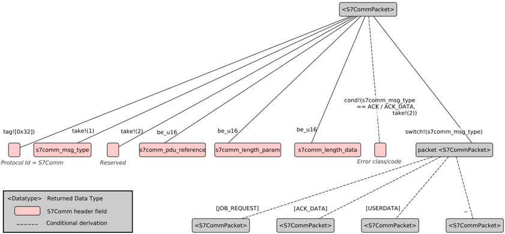

Loại thông báo không được biết, giống như cách xử lý loại thông báo ACK vì nó không có tham số hoặc phần dữ liệu.

Hình 4.9 cho thấy cách phân tích cú pháp Yêu cầu Công việc và Dữ liệu Ack. Đối với chức năng ReadVar của Yêu cầu công việc, các địa chỉ cần đọc sẽ nằm trong danh sách mục. Danh sách mục này là một phần của các tham số. Không có dữ liệu được sử dụng. Tuy nhiên, đối với hàm WriteVar, giá trị cần lưu trữ nằm trong phần dữ liệu. Đối với loại thông báo Ack Data thì ngược lại vì đây là phản hồi của yêu cầu. Trong trường hợp đó, tham số chỉ chứa số lượng mục và dữ liệu có giá trị đọc hoặc giá trị trả về của từng mục trong danh sách mục. Tại thời điểm này, trình phân tích cú pháp tĩnh khác với trình phân tích cú pháp động. Trong khi trình phân tích cú pháp động cũng phân tích danh sách mục của cả tham số và dữ liệu thì trình phân tích cú pháp tĩnh chỉ sử dụng mã trả về của mục đầu tiên nếu nó tồn tại.

Trình phân tích cú pháp phụ cho loại thông báo Dữ liệu người dùng được hiển thị trong Hình 4.10. Như có thể thấy trong Hình 4.6 đối với loại thông báo Dữ liệu người dùng, phần chức năng được chia thành loại yêu cầu, nhóm chức năng và chức năng con. Ngoài ra còn có phần đầu thường có giá trị 0x000112 (thập lục phân) và được mô tả là không đổi trong Wireshark. 21 Đối với yêu cầu ListOfType và đối với trình phân tích cú pháp động, ListBlocks cũng phản hồi với giá trị trả về và loại khối được xác định. Giống như đối với loại thông báo Dữ liệu Ack, trình phân tích cú pháp tĩnh chỉ phân tích phần tử đầu tiên trong khi phần tử động phân tích tất cả chúng.

##4.4.3. Trình ghi nhật ký

Trình ghi nhật ký được sử dụng để tạo mô tả văn bản về biểu diễn bên trong được lấy từ dữ liệu gói thô bằng trình phân tích cú pháp. Nó là một mô-đun con cho cái gọi là

21 Nguồn Wireshark về phần đầu của loại dữ liệu người dùng https://github com/wireshark/wireshark/blob/ dab7c742684116a36ef1069beeda1f0b5e1695c5/epan/dissectors/packet-s7comm c#L7020 - Truy cập vào ngày 21.05.21

Hình 4.9.: Cấu trúc phân tích danh nghĩa của dữ liệu Ack và Yêu cầu công việc S7Comm

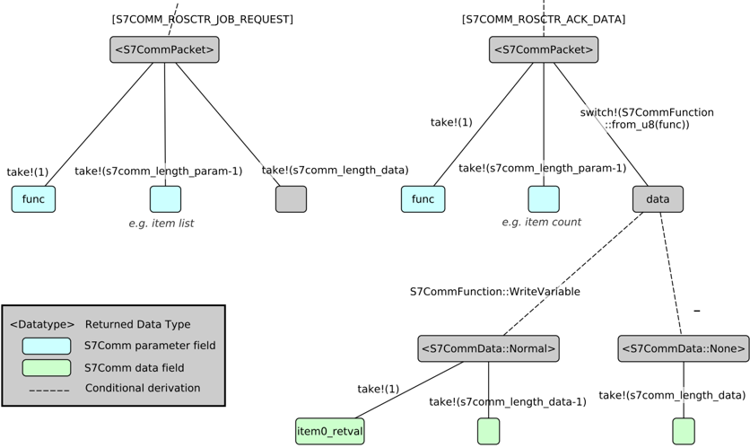

EVE-Log là đầu ra dựa trên JSON cho các sự kiện và cảnh báo. 22 Một sự kiện trong trường hợp này là sự xuất hiện của gói S7Comm. Phần lớn hơn của trình ghi nhật ký được viết bằng ngôn ngữ lập trình C được lấy từ mẫu Suricata 23 . Chỉ có tên trình phân tích trong các hàm và tên hàm được điều chỉnh. Ngoài ra, việc đăng ký logger được thực hiện ở phần viết c chưa sửa đổi. Bốn cuộc gọi lại được đăng ký ở đó sau khi Suricata bắt đầu (xem 4.1):

- OutputS7commLogInitSub - Đăng ký trình ghi nhật ký với trình phân tích cú pháp lớp ứng dụng và tạo ngữ cảnh S7Comm. Bằng cách này, một gói có thể được ghi lại sau khi đến. Nó được gọi một lần sau khi đăng ký logger dưới dạng mô hình con.
- JsonS7commLogThreadInit - Khi được bật trong cấu hình Suricata, đây là trường hợp mặc định, trình ghi nhật ký sẽ đa luồng và mỗi luồng được khởi tạo bằng lệnh gọi lại này một lần. Nó được sử dụng để đảm bảo tệp nhật ký thoát ra và bộ đệm cho luồng được phân bổ.

22 Hướng dẫn sử dụng Suricata Đầu ra đêm giao thừa https://suricata readthedocs io/en/latest/output/eve/eve-jsonoutput html?highlight = logger#eve-json-output - Truy cập: ngày 22 tháng 5 năm 2021

23 Mã nguồn mẫu Suricata cho logger https://github com/OISF/suricata/blob/533c6ff274dcf69c 356ff41608faaecc535c735c/src/output-json-template-rust c - Truy cập: 21 tháng 5, 21

Hình 4.10.: Cấu trúc phân tích cú pháp Nom của header S7Comm

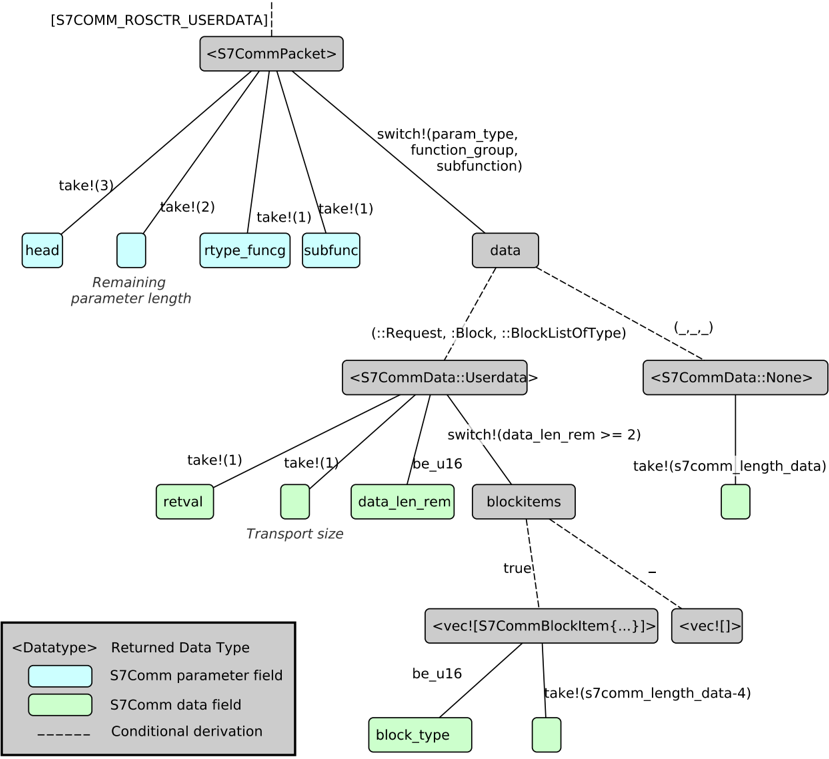

- JsonS7commLogger - Được gọi sau khi giao dịch hoàn tất và quá trình phát hiện hoàn tất. Nó có thể được coi là giao diện giữa phần Rust và phần c của logger vì nó gọi phần Rust để tạo một đối tượng JSON của giao dịch đã cho.
- JsonS7commLogThreadDeinit - Tương tự như đối với việc khởi tạo luồng, nhưng được gọi cho mỗi luồng khi Suricata tắt. Nó được sử dụng để giải phóng bộ đệm.
- OutputS7commLogDeInitCtxSub - Đối tác của OutputS7commLogInitSub giải phóng bối cảnh S7Comm được phân bổ. Nó cũng được gọi là một phần của quá trình ngừng hoạt động của Suricata.

Vì trình ghi nhật ký không phải là trọng tâm của công việc nên chỉ một phần nhỏ biểu diễn bên trong của gói S7Comm được ghi lại. Trong Hình 4.11 có thể thấy một dòng của EVE-Log. Dòng 8 đến dòng 11 là phần được tạo bởi mô-đun logger S7Comm. Kể từ khi logger

```
1 { 2 "timestamp":"2016-12-15T06:36:14.369573+0000", 3 "flow _ id":1823783671201289, 4 "pcap _ cnt":16, 5 "event _ type":"s7comm", 6 "src _ ip":"10.10.10.10", 7 [...] 8 "s7comm": { 9 "request.header.rosctr":"Job", 10 "request.header.pduref":"1" 11 } 12 }
```

Hình 4.11.: Ví dụ về dòng JSON-Output trong Suricata EVE-log

chỉ ghi lại yêu cầu hoặc phản hồi (Không trạng thái), chỉ loại thông báo và PDU theo một hướng, trong ví dụ này, yêu cầu, được hiển thị cùng một lúc. Nếu Trình phân tích cú pháp AppLayer khớp với yêu cầu và phản hồi (Trạng thái) thì dòng nhật ký sẽ chứa cả hai và có thể thấy ngay yêu cầu và câu trả lời cho yêu cầu đó là gì. Điều này có thể mang lại sự hiểu biết tốt hơn là chỉ phản hồi bất kỳ yêu cầu nào trước đó. Tuy nhiên, nó cũng có thể được so khớp bởi PDU ref.

##4.5. máy dò

Phần dò tìm sử dụng biểu diễn bên trong của gói và khớp nó với chữ ký.

```
1 alert tcp-pkt any any -> any 102 (msg: "Setup Comm. Request (Byte pattern)"; ! flow:to _ server,established; dsize:>20; content:"|32 01|"; offset:7; ! depth:2; content:"|F0|"; offset:17; depth:1; classtype:bad-unknown; ! sid:2534321201; rev:2;) 2 alert s7comm any any -> any 102 (msg:"Setup Comm. Request (sticky buffer)"; ! s7comm.header.rosctr; content:"Job"; s7comm.param.func; content:"Setup ! communication"; classtype:bad-unknown; sid:3534321201; rev:2;) 3 alert s7comm any any -> any 102 (msg:"Setup Comm. Request (content modifiers)"; ! content:"Job"; s7comm _ header _ rosctr; content:"Setup communication"; ! s7comm _ param _ func; classtype:bad-unknown; sid:4534321201; rev:2;)
```

Hình 4.12.: Ví dụ về các loại từ khóa khác nhau

Arule mô tả một tập hợp các gói theo thuộc tính của nó và quyết định cách thực hiện với nó. Thông thường nếu một quy tắc phù hợp trên một gói thì cảnh báo sẽ được kích hoạt. Trong Suricata theo mặc định, điều này được hiển thị trong Nhật ký EVE và nhật ký cảnh báo dựa trên dòng (fast.log). 24 Một thuộc tính của gói có thể được thể hiện

24 Tệp nhật ký trong Suricata https://suricata readthedocs io/en/suricata-6 0 0/configuration/suricatayaml html#line-based-alerts-log-fast-log - Đã truy cập: ngày 16 tháng 6 năm 2021

theo từ khóa. Đối với các từ khóa tải trọng mẫu byte được sử dụng. Như được minh họa trong dòng 1 của Hình 4.12 bằng ví dụ, điều này được thực hiện bằng cách cung cấp một giá trị offset và một byte trong nội dung. Cả offset và nội dung đều là từ khóa. Đối với các máy dò ở Suricata, cái gọi là từ khóa sửa đổi cũng được thêm vào. Có sự khác biệt giữa công cụ sửa đổi nội dung và bộ đệm dính. Đối với các công cụ sửa đổi nội dung (so sánh dòng 3 của Hình 4.12), nội dung được cung cấp đầu tiên và từ khóa dành riêng cho trình phân tích theo sau, trong khi bộ đệm dính được viết trước và tất cả các từ khóa khác bao gồm nội dung theo sau và áp dụng cho nó (so sánh dòng 2 của Hình 4.12). 25 Loại từ khóa nào được sử dụng sẽ được quyết định bởi việc triển khai bộ phát hiện của bộ phân tích. Trình phân tích được phát triển sử dụng biến thể bộ đệm dính cho tất cả các từ khóa, đây là cách được Suricata đề xuất cho các trình phân tích trong tương lai. Ngoài ra còn có khả năng không hoạt động với việc kiểm tra nội dung và thay vào đó hãy sử dụng cái gọi là phần cài đặt. Điều này được sử dụng, ví dụ: bởi bộ phân tích DNS Suricata cho từ khóa opcode. 26 . Đối với bộ phân tích này, việc kiểm tra nội dung được sử dụng vì nó cũng được sử dụng trong mẫu và nó mạnh hơn vì nó cho phép sử dụng các biểu thức thông thường và cả chuỗi byte được sử dụng cho từ khóa s7comm.param.userdata.head.

## 4.5.1. Cuộc gọi lại và điều chỉnh máy dò

Nói chung, đối với mỗi từ khóa, một tệp riêng biệt sẽ được sử dụng. Vì vậy, đối với tất cả tám từ khóa đã triển khai, một tệp tiêu đề và một tệp c có các lệnh gọi lại riêng sẽ được tạo. Về phía Rust thường chỉ có một tệp (máy dò) được sử dụng cho tất cả các từ khóa. Phần viết bằng c được lấy từ mẫu Suricata. Đối với mỗi từ khóa, được hiển thị ở đây cho loại thông báo (rosctr), các chức năng liên quan sau đây sẽ được triển khai: 27

- DetectS7commHeaderRosctrRegister - Đăng ký các lệnh gọi lại sau; tên từ khóa s7comm.header.rosctr cho loại tin nhắn cũng được đăng ký cho giao thức S7Comm.
- DetectS7commHeaderRosctrSetup (Công cụ phát hiện khởi đầu, giai đoạn 1) - Được gọi cho mỗi quy tắc có từ khóa xuất hiện trong bộ quy tắc. Có thể được sử dụng để chuẩn bị bộ đệm từ khóa như đã được thực hiện cho từ khóa opcode DNS. Đối với từ khóa này, trình phát hiện DNS sẽ phân tích mã opcode được đưa ra trong quy tắc đã có trong thiết lập. Bằng cách này, sau này chỉ có hai số nguyên đại diện cho opcode phải được khớp. Trong trình phân tích S7Comm đã phát triển, các quy tắc không được chuẩn bị theo cách này. Trường hợp này xảy ra vì nó không phải là một phần của mẫu và nhiều người mổ xẻ Suricata đã không sử dụng nó nên có vẻ như nó không phải là thông lệ ở Suricata. Mặt khác, không rõ liệu có những nhược điểm nào cần được điều tra đầu tiên hay không. Tuy nhiên do thời gian có hạn nên chưa có thời gian để điều tra.
- DetectEngineInspectS7commHeaderRosctr - Lệnh gọi lại này chỉ được sử dụng cho phiên bản không có bộ lọc trước (phiên bản chưa được điều chỉnh). Nó được gọi cho mỗi gói và mỗi quy tắc trong đó

25 Hướng dẫn sử dụng Suricata về Từ khóa https://suricata readthedocs io/en/suricata-6 0 0/rules/in tro html#modifier-keywords - Truy cập: 23/05/2021

26 Mã nguồn Suricata dns từ khóa opcode https://github com/granlem/KIT-MA-Suricata/blob/feat ure-s7comm-init-v0 2/src/ detect-dns-opcode c - Truy cập: 26/05/21

27 Hướng dẫn phát triển Suricata về lệnh gọi lại máy dò https://redmine openinfosecfoundation org/p rojects/suricata/wiki/Callbacks - Truy cập: 23 tháng 5, 21

tất cả các từ khóa trước đó đã khớp. Cuộc gọi lại này sử dụng phần Rust để lấy giá trị của biểu diễn bên trong. Trong trường hợp này, đây là rs\_s7comm\_get\_request\_rosctr hoặc rs\_s7comm\_get\_response\_rosctr tùy thuộc vào hướng của gói; nếu tin nhắn đến từ máy chủ (ví dụ: PLC) thì đó là yêu cầu, nếu không thì đó là phản hồi. Giá trị được khớp với giá trị từ phần nội dung quy tắc. Do đó Suricata cung cấp chức năng tiện ích kiểm tra nội dung ( DetectEngineContentInspection ) được sử dụng ở đây. Hàm này cuối cùng trả về 1 nếu từ khóa khớp và 0 nếu không.

- GetS7commDataRosctr - Được gọi bởi bộ lọc trước MPM cũng như kiểm tra bộ đệm chung của Suricata (phiên bản đã điều chỉnh). Ngược lại với DetectEngineInspectS7commHeaderRosctr, lệnh gọi lại này không khớp với chính nội dung nhưng nó trả về bộ đệm kiểm tra chứa thuộc tính giao thức được phân tích cú pháp. Cũng ở đây, thông tin này được lấy ra bằng cách gọi rs\_s7comm\_get\_request\_rosctr hoặc rs\_s7comm\_get\_response\_rosctr .
- rs\_s7comm\_get\_request\_rosctr (áp dụng tương tự cho reply ) - Là giao diện Rust để lấy giá trị bộ đệm của từ khóa. Trong trường hợp này nó có thể là ví dụ. Công việc . Cũng có thể có một danh sách được trả về trong trường hợp bộ phân tích động. Sau đó, mỗi giá trị của danh sách sẽ được khớp với chức năng kiểm tra nội dung Suricata. Việc này được thực hiện bởi bộ phân tích DNS Suricata cho từ khóa truy vấn. 28 Tuy nhiên, cũng có thể có những cách tiếp cận khác để thực hiện việc so khớp giá trị từ khóa với nhiều giá trị của gói. Tại thời điểm này, tùy chọn thay thế là không sử dụng chức năng tiện ích Suricata và thay vào đó hãy quyết định trong phần máy dò Rust xem giá trị từ khóa có khớp với gói hay không. Đây là ví dụ. trường hợp dành cho loại khung từ khóa phân tích HTTP vì nó phải được kiểm tra đối với từng khung HTTP được phân tích cú pháp trong yêu cầu hoặc phản hồi HTTP. 29

Trong phiên bản cơ bản, công cụ lọc trước Multi-Pattern-Matcher (MPM) đã phát triển được sử dụng. Như được mô tả trong Hướng dẫn sử dụng, 30 MPM được sử dụng để khớp nhiều mẫu cùng một lúc. Trong mỗi chữ ký, một mẫu được MPM sử dụng. Bởi vì tất cả các mẫu phải khớp nhau nên chữ ký có thể bị loại trừ mà không cần kiểm tra hoàn toàn.

## 4.5.2. Từ khóa được cung cấp

Như đã đề cập trong Phần 4.1, tên và giá trị từ khóa được lấy từ plugin Wireshark S7Comm vì điều này phù hợp với quy ước đặt tên Suricata. Các từ khóa sau được triển khai trong tất cả các phiên bản của bộ phân tích:

- s7comm.header.rosctr - Loại tin nhắn có trong mỗi gói S7Comm. ví dụ. nội dung: 'Công việc'

28 Mã nguồn Suricata - từ khóa truy vấn dns https://github com/granlem/KIT-MA-Suricata/blob/a58d 6649c258d3580dacdc4c2bb8d0078948eef8/src/ detect-dns-query c#L113 - Truy cập: 26 tháng 5 năm 2021

29 Mã nguồn triển khai từ khóa frametype Suricata http2 https://github com/OISF/suricata /blob/533c6ff274dcf69c356ff41608faaecc535c735c/src/ detect-http2 c#L265 - Truy cập: 23/05/21

30 Hướng dẫn sử dụng Suricata Bộ lọc trước MPM https://suricata readthedocs io/en/latest/configuration/su ricata-yaml html#pattern-matcher-settings - Đã truy cập: ngày 11 tháng 6 năm 2021

- s7comm.param.func - Chức năng S7Comm dành cho việc xác nhận dữ liệu và yêu cầu công việc, ví dụ: nội dung: 'Cài đặt\_communication'
- s7comm.param.userdata.head - Tiêu đề tham số dữ liệu người dùng thường là giá trị byte 0x000112 (thập lục phân), ví dụ: nội dung '|0x000112|'
- s7comm.param.userdata.type - Trong khi đối với loại thông báo Yêu cầu công việc là yêu cầu và dữ liệu Ack (hoặc Ack ) là phản hồi thì Userdata được sử dụng cho cả yêu cầu và phản hồi. Để quyết định xem đó là yêu cầu hay phản hồi trên lớp ứng dụng, trường loại được sử dụng. Nó có thể là giá trị Yêu cầu, Phản hồi và cả Đẩy. Đẩy là trường hợp đặc biệt của cái gọi là I/O dữ liệu tuần hoàn trong đó máy khách đăng ký một sự kiện nhất định và máy chủ sẽ đẩy dữ liệu được yêu cầu theo định kỳ. Tính năng này không được nghiên cứu thêm vì không có sẵn dữ liệu thử nghiệm. Tuy nhiên, tính năng này sẽ không can thiệp vào bộ phân tích không trạng thái. Đối với bộ phân tích trạng thái, điều này phải được xem xét vì các lần đẩy là một loại phản hồi đa dạng cho một yêu cầu. Vì vậy, việc phân công nhiều phản hồi cho yêu cầu có thể không đơn giản. Trong bộ phân tích trạng thái, được phát triển để đánh giá so với bộ phân tích không trạng thái, điều này không được xem xét nhưng không có dữ liệu thử nghiệm nào được sử dụng để đánh giá sử dụng tính năng I/O dữ liệu tuần hoàn. Một ví dụ về giá trị từ khóa loại là nội dung: 'Yêu cầu'
- s7comm.param.userdata.funcgroup - Như đã đề cập trước đó đối với Userdata, có các chức năng con được gán cho một nhóm chức năng. nội dung: 'An ninh'
- s7comm.param.userdata.subfunc - Từ khóa này mô tả chức năng của userdata. nội dung: 'Mật khẩu PLC'
- s7comm.blockinfo.blocktype - Blocktype được sử dụng cho một số chức năng con trong nhóm chức năng của Block function. Đối với bộ phân tích tĩnh (phiên bản cơ bản), điều này sẽ chỉ khớp nếu khối đầu tiên trong gói khớp với loại khối đó do trình phân tích cú pháp tĩnh không phân tích cú pháp danh sách đầy đủ như được mô tả trước đó. Ví dụ về giá trị từ khóa là nội dung: '0E'.
- s7comm.data.returncode - Từ khóa này mô tả mã trả về của Userdata và cả phản hồi Ack Data cho từng mục. Tuy nhiên, trong bộ phân tích tĩnh chỉ có mục đầu tiên được khớp với giá trị nội dung đã cho. Một ví dụ là nội dung: “Success”.

Ngoại trừ s7comm.param.userdata.head, tất cả các giá trị đều là các bảng liệt kê chỉ khớp với một số giá trị nhất định. Để triển khai thực tế bộ phân tích, các giá trị byte không được hỗ trợ vì điều này sẽ dẫn đến hậu quả là mỗi giá trị không khớp với giá trị liệt kê phải được kiểm tra bổ sung để tìm giá trị byte. Đây sẽ là chi phí chung có thể làm sai lệch đánh giá của người mổ xẻ. Tuy nhiên, điều này có thể được triển khai ít nhất trong trường hợp khi đối với một giá trị byte cụ thể trong gói thì không có giá trị nào cho bảng liệt kê. Hiện tại trong trường hợp này, giá trị được khớp với giá trị liệt kê Không xác định.

## 4.5.3. Tối ưu hóa quy tắc

Vì nhiều từ khóa được lồng nhau nên s7comm.userdata.funcgroup chỉ có giá trị nếu s7comm.header.rosctr (loại tin nhắn) là Userdata . Vì vậy, không cần thiết phải kiểm tra loại tin nhắn. Từ khóa s7comm.userdata.funcgroup sẽ không bao giờ khớp nếu loại tin nhắn không phải là Userdata . Điều tương tự cũng áp dụng cho nhóm chức năng, chức năng con và loại thông báo dữ liệu người dùng. Điều này không thể áp dụng cho các mẫu byte vì một giá trị ở một vị trí nhất định có thể trùng khớp với giá trị byte được đưa ra trong quy tắc cho nhiều loại thông báo một cách tình cờ. Đối với các quy tắc dựa trên bộ phân tích, một số kết quả khớp từ khóa của trình phát hiện có thể được lưu bằng phương pháp này. Đối với cả Yêu cầu công việc và Dữ liệu xác nhận, từ khóa s7comm.param.func được sử dụng. Do đó, không thể dễ dàng xác định xem chức năng so khớp có thuộc loại bản tin Yêu cầu công việc hay Dữ liệu xác nhận hay không. Tuy nhiên, khi các quy tắc được chuyển hướng từ máy khách đến máy chủ thì có thể đảm bảo rằng trong các trường hợp bình thường, đó phải là Yêu cầu công việc và nếu nó được chuyển hướng từ máy chủ đến máy khách thì đó là Dữ liệu Ack. Có thể xây dựng các trường hợp kẻ tấn công gửi ví dụ: Dữ liệu Ack với tư cách là khách hàng sẽ dẫn đến kết quả dương tính giả. Tuy nhiên, vì đây có thể là hành vi bất thường nên việc phát hiện thêm có thể được coi là một tác dụng phụ tích cực.

Error 504 (Server Error)!!1504.That’s an error.There was an error. Please try again later.That’s all we know.

Năm công cụ đã được phát triển để hỗ trợ việc phát triển và đánh giá nhưng cũng có thể được sử dụng hoặc mở rộng cho các mục đích hiệu quả.

## 4.6.1. Bộ chuyển đổi quy tắc mẫu byte

Công cụ này có thể được sử dụng để chuyển đổi các quy tắc mẫu byte hiện có sang các quy tắc sử dụng bộ phân tích S7Comm. Điều này được thực hiện bằng cách ánh xạ các giá trị byte bao gồm cả phần bù của chúng vào các quy tắc theo các điều kiện nhất định. Các điều kiện này là cần thiết vì thực tế đã được đề cập ở trên là giá trị byte có thể có ý nghĩa khác đối với các loại thông báo khác nhau. Bản đồ đi kèm đã chứa tất cả các giá trị được bộ phân tích hỗ trợ và đưa ra lỗi nếu không xác định được giá trị byte. Công cụ này yêu cầu ID chữ ký bắt đầu bằng số 2 cho quy tắc mẫu byte vì theo cách này, công cụ có thể sử dụng số đầu tiên là 3 cho các quy tắc dựa trên bộ phân tích mà không có nguy cơ có cùng một ID chữ ký hai lần. Bằng cách này, các cảnh báo có thể được so sánh sau này.

Công cụ này dựa trên ngôn ngữ lập trình Python3 và không có phần phụ thuộc nào nữa. Nó được gọi bởi:

```
1 python3 rule _ converter _ s7 _ bp2d.py BYTEPATTERN.rules [COMBINED.rules]
```

BYTEPATTERN.rules là tệp quy tắc dựa trên mẫu byte đầu vào và [COMBINED.rules] là tệp đầu ra chứa cả hai loại quy tắc ở dạng xen kẽ.

## 4.6.2. So sánh cảnh báo mẫu byte

Công cụ này hỗ trợ việc đánh giá của người mổ xẻ. Nó so sánh tất cả các cảnh báo của quy tắc mẫu byte với quy tắc của bộ phân tích trong tệp FAST -Log. Nó cho thấy mức độ trùng khớp của các cảnh báo của từng loại đối với từng quy tắc bằng cách khớp số lượng cảnh báo của từng quy tắc và cho từng hướng luồng. ID chữ ký quy tắc phải có cùng cú pháp với trình chuyển đổi quy tắc

1

1

tạo ra chúng. Nói cách khác, chỉ các mẫu byte có ID chữ ký bắt đầu bằng 2 trong khi ID chữ ký của các quy tắc dựa trên bộ phân tích phải bắt đầu bằng 3 . Tập lệnh được viết bằng Python3 và không có phần phụ thuộc nào nữa. Kịch bản được gọi bởi:

```
python3 compare _ bp _ d _ alerts.py FAST.log
```

FAST.log là tệp nhật ký nơi kết hợp các cảnh báo của hai phương pháp. Nếu có nhiều tệp nhật ký thuộc về nhau thì chúng phải được hợp nhất trước.

## 4.6.3. Bắt tay TCP tổng hợp

Công cụ này chuẩn bị các tệp PCAP trong đó quá trình bắt tay cho kết nối TCP không được ghi lại. Điều này là cần thiết vì các trình phân tích lớp ứng dụng dựa trên TCP chỉ nhận được tải trọng để xử lý khi thiết lập kết nối TCP được xử lý bởi bộ giải mã TCP của Suricata. Lý do cho điều này là việc thiết lập kết nối khai báo sự bắt đầu của dữ liệu TCP. Khi xử lý các gói trong kết nối TCP, không rõ yêu cầu hoặc phản hồi bắt đầu từ đâu. Vì S7Comm dựa trên gói và thường sử dụng khung TCP mới cho mỗi phần đầu của gói nên vấn đề này không xảy ra. Tuy nhiên, Suricata không có cách nào để nhận dữ liệu khi luồng TCP đã bắt đầu trước đó. Có một cấu hình trong Suricata để cho phép lấy lại phiên giữa dòng 31 nhưng điều này dường như không liên quan đến bộ phân tích vì nó chưa giải quyết được vấn đề. Vì lý do đó, quá trình bắt tay TCP được tạo tổng hợp để hiển thị cho Suricata vì nó chỉ mới bắt đầu ngay cả khi nó đã chạy.

Để thực hiện điều này, trước tiên, nó sẽ được phân tích xem có thiếu phần bắt tay trong tệp PCAP đã cho hay không. Nếu đúng như vậy thì quá trình bắt tay được tạo bằng cách sao chép các lớp bên dưới TCP cho 3 gói bắt tay đã tạo. Ngoài ra, trình tự và số ACK phải được tính toán lại cho các gói này. Có một tập lệnh riêng thực hiện việc này tương tự đối với việc phân tích TCP. Tuy nhiên điều này không được thử nghiệm rộng rãi. Vì việc tải các tệp PCAP có thể cần nhiều bộ nhớ nên nó được đọc và ghi theo từng gói.

Tập lệnh được viết bằng Python3 và sử dụng gói Scapy 2.4.4 làm phần phụ thuộc, gói này phải được cài đặt trước. Sau đó, công cụ này có thể được sử dụng như sau:

```
python3 pcap _ fix _ missing _ hs.py PCAP _ INPUT _ FILE PCAP _ OUTPUT _ FILE
```

PCAP\_INPUT\_FILE là tệp PCAP có thể thiếu các phần bắt tay TCP cần được tạo. PCAP\_OUTPUT\_FILE là tệp PCAP phải chứa các bắt tay TCP cho tất cả các kết nối TCP.

## 4.6.4. Phần mở rộng luồng TCP tổng hợp

Công cụ này được sử dụng để tạo các luồng TCP dài từ một luồng ngắn. Điều này có thể được sử dụng nếu chỉ có một ít dữ liệu cho một giao thức nhưng cần nhiều dữ liệu hơn để đánh giá đo lường một cách có ý nghĩa.

Tập lệnh sử dụng tải trọng TCP được ghi lại và lặp lại nhiều lần trong khi cập nhật số thứ tự.

31 Cấu hình giữa dòng Suricata https://suricata readthedocs io/en/suricata-6 0 0/configurat ion/suricata-yaml html?highlight = midstream#stream-engine - Truy cập: ngày 16 tháng 6 năm 2021

```
1
```

It is also written in Python3 and uses Scapy 2.4.4 as dependency. Nó có thể được sử dụng bởi:

```
python3 pcap _ packet _ extender.py PCAP _ INPUT _ FILE PCAP _ OUTPUT _ FILE REPETITIONS
```

PCAP\_INPUT\_FILE là tệp đầu vào cần được mở rộng, PCAP\_OUTPUT\_FILE là tệp đầu ra mở rộng và REPETITIONS là số lần tải trọng cần được lặp lại.

## 4.6.5. Hợp nhất các tệp PCAP

This tool is used to merge multiple PCAP files together into one PCAP file. If a client port is reused it receives replaced by an unused one. This way for each PCAP file each TCP connection is shown as it has just started which is necessary to prevent conflicts. This can also happens when one TCP stream persists over multiple PCAP files. Tuy nhiên, trong trường hợp này, điều này là có chủ ý vì cũng có thể thiếu dữ liệu ở giữa khiến cho việc tập hợp lại Suricata TCP không thành công (nếu không bật khoảng trống). Besides the replacement of the client port synthetic TCP handshakes are added if none exist for a TCP stream.

Tập lệnh được viết bằng Python3, sử dụng Scapy 2.4.4 làm phần phụ thuộc và có thể được sử dụng theo cách sau:

```
1 PCAP _ INPUT _ FILE [
```

```
python3 pcap _ merge _ fixhs.py PCAP _ OUTPUT _ FILE PROTO _ SERVER _ PORT ! ,PCAP _ INPUT _ FILE2[,...]]
```

Error 504 (Server Error)!!1504.That’s an error.There was an error. Please try again later.That’s all we know.

##4.7. Tóm tắt cách triển khai trình phân tích ở Suricata

Phần này cung cấp thông tin tổng quan về quy trình triển khai trình phân tích lớp ứng dụng trong Suricata IDS. Nó được cấu trúc như một phần thu thập thông tin về giao thức cũng như cấu trúc và quy ước đặt tên phát triển ở Suricata. Sau đó, quy trình phát triển bộ phân tích được mô tả theo sáu bước. Ngoài ra còn có phần trình bày hướng dẫn cách thêm các tính năng mới vào Suricata Brazil [5].

## 4.7.1. Sự chuẩn bị

Như được mô tả trong Phần 6.2.2, cần có thông tin về giao thức. Do đó, cần phát triển sự hiểu biết về các thuộc tính giao thức nào có liên quan đến việc phát hiện xâm nhập. Do đó, bộ quy tắc dựa trên mẫu byte là phù hợp. Hơn nữa dữ liệu thử nghiệm là cần thiết. Tệp này có thể có sẵn dưới dạng tệp PCAP vì Suricata chấp nhận tệp PCAP làm đầu vào. Quan trọng nhất là kiến ​​thức có cấu trúc về cấu trúc giao thức bao gồm cấu trúc giá trị byte của các thuộc tính giao thức được sử dụng sau này để phân tích cú pháp và phát hiện. Khi tất cả thông tin này được lấy ra, mã nguồn Suricata 32 sẽ được sao chép.

32 Kho lưu trữ Suricata trên GitHub https://github com/OISF/suricata - Truy cập: ngày 11 tháng 6 năm 2021

## 4.7.2. Cấu trúc và quy ước đặt tên của Suricata

Trong Suricata có sự phân biệt giữa bộ giải mã Gói và bộ giải mã lớp Ứng dụng. Bộ giải mã gói phân tích các giao thức trên các lớp bên dưới lớp ứng dụng và có thể được sử dụng đệ quy như IPv4 bên trong Ethernet. Thay vào đó, bộ giải mã lớp ứng dụng được đăng ký phía trên giao thức transport layer (ví dụ: TCP). Vì bộ phân tích được phát triển hoạt động trên TPKT nên phần này cũng tập trung vào bộ giải mã lớp ứng dụng. Tuy nhiên, bộ phát hiện và ghi nhật ký được sử dụng tùy chọn hoạt động gần như giống nhau đối với cả bộ giải mã gói và bộ giải mã lớp ứng dụng. Trình phân tích cú pháp cũng có thể được triển khai bằng Rust và Nom cho bộ giải mã gói, nhưng giao diện với Suricata và trọng tâm có thể khác nhau vì trình phát hiện gói không nhất thiết phải là phần cuối của chuỗi mở lớp gói. Nói cách khác, các bộ giải mã khác có thể được sử dụng ở trên cùng.

Mã nguồn Suricata được chia thành thư mục Rust/src chứa phần Rust và thư mục src/ nơi sử dụng ngôn ngữ lập trình c. Mã c nằm trong src/ tạo thành nền tảng và sử dụng các hàm Rust được hiển thị từ Rust/src . Việc này được thực hiện bằng cách sử dụng thư viện Cbindgen 33 Rust 'tạo các tiêu đề C/C++11 cho các thư viện Rust hiển thị API C công khai'.

Như đã đề cập, bộ phân tích có thể được chia thành bộ phân tích cú pháp lớp ứng dụng, bộ giải mã và bộ ghi nhật ký. Tuy nhiên, cả bộ ghi và bộ dò đều là tùy chọn. Các phần mổ xẻ được minh họa trong cách đặt tên các tập tin. Quy ước như sau:

- src/app-layer-PROTO.c là trình phân tích cú pháp lớp ứng dụng của giao thức PROTO .
- src/decode-PROTO.c được sử dụng cho bộ giải mã gói của giao thức PROTO được đề cập ở đây chỉ để cung cấp đầy đủ.
- src/output-json-PROTO.c là trình ghi nhật ký cho giao thức PROTO, cung cấp thông tin về nhật ký ở định dạng JSON.
- src/ detect-PROTO-BUFFER.c là trình phát hiện giao thức PROTO cho từ khóa BUFFER . Nói chung, đối với mỗi từ khóa, một tệp riêng sẽ được tạo. Tuy nhiên, đối với một số trình phát hiện (ví dụ: HTTP2), có thể thấy rằng nhiều từ khóa được đăng ký trong một tệp chỉ bằng cách sử dụng src/ detect-PROTO.c . BUFFER cũng có thể chứa dấu gạch nối nếu cần thiết. Ví dụ. đối với ssh.hassh.server.string, tên tệp src/Detect-ssh-hassh-serverstring.c được sử dụng. Điều tương tự cũng xảy ra, ví dụ: cho s7comm.header.rosctr .
- Rust/src/PROTO/mod.rs với proto PROTO là mô-đun Rust. Điều này có nghĩa là giao diện cho mô-đun giao thức. Nó xác định tập tin nào được hiển thị công khai và tập tin nào được giữ riêng tư. Một số trình phân tích nhỏ hơn sử dụng mod làm tệp duy nhất trên phần Rust (ví dụ: ftp). Tuy nhiên, nhìn chung có nhiều tệp hơn trong mô-đun được liệt kê sau đây.
- Rust/src/PROTO/PROTO.rs với giao thức PROTO được sử dụng làm trình phân tích cú pháp lớp ứng dụng cho phần Rust. Nó thường đăng ký các cuộc gọi lại của người mổ xẻ. Tuy nhiên, việc sử dụng cả mod.rs và tệp có tên mô-đun xung đột với tham chiếu Rust vì người ta chỉ ra rằng 'không được phép có cả hai util.rs

33 Cbindgen 0.14.1 https://docs rs/crate/cbindgen/0 14 1 - Truy cập: ngày 13 tháng 6 năm 2021

và util/mod.rs'. 34 Vì lý do này, tên mô-đun có thể được bắt đầu bằng appplayer . Tuy nhiên, điều này được thực hiện tự động khi sử dụng tập lệnh được giải thích bên dưới.

- Rust/src/PROTO/ detect.rs cung cấp giao diện cho các bộ dò tìm phần viết c. Nó thường cung cấp các hàm trả về giá trị của thuộc tính giao thức.
- Rust/src/PROTO/logger.rs cung cấp giao diện cho logger của phần viết c.
- Rust/src/PROTO/parser.rs được sử dụng tùy ý để thuê ngoài quá trình phân tích cú pháp từ tệp Rust/src/PROTO/PROTO.rs. Chifflier và Couprie [8] khuyên bạn nên phát triển bộ phân tích trong một dự án bên ngoài. Việc gia công tệp Parser.rs có thể đơn giản hóa quá trình tích hợp tiếp theo.

Giao thức cũng như tên bộ đệm (từ khóa) luôn được viết bằng ký tự chữ và số viết thường cho tên tệp. Các hàm và cấu trúc được hiển thị bởi các tệp tiêu đề liên quan nói chung có tiền tố là tên giao thức. Đối với phần Rust, chúng có tiền tố là rs\_PROTO với PROTO là tên giao thức được viết bằng ký tự chữ và số viết thường. Tệp tiêu đề cũng hiển thị chức năng đăng ký cho bộ dò tìm, bộ giải mã lớp ứng dụng và bộ ghi nhật ký. Tuy nhiên, điều này không được thảo luận chi tiết ở đây vì cũng có các tệp mẫu và tập lệnh tạo ra các hàm và tệp này. Chúng thường tương ứng với quy ước. Các trường hợp ngoại lệ xảy ra, ví dụ: khi sử dụng '.' hoặc '-' trong tên từ khóa khi tạo trình phát hiện.

## 4.7.2.1. Quy trình phát triển

Để hiểu rõ hơn, quá trình phát triển được chia thành sáu bước hoàn chỉnh.

1. Bước đầu tiên là để Suricata chạy từ nguồn git nhân bản. Hướng dẫn được sử dụng để phát triển bộ phân tích S7Comm có thể được tìm thấy trong Suricata Wiki 35. Tuy nhiên, cần phải cài đặt Rustc (trình biên dịch Rust) và hàng hóa (trình quản lý đóng gói Rust) không phải bằng trình quản lý gói apt mà bằng cách sử dụng công cụ cài đặt Rustup 36.

Trong hướng dẫn cài đặt, Suricata được cài đặt sudo make install . Tuy nhiên, điều này là không cần thiết vì Suricata có thể được thực thi bằng cách sử dụng tệp nhị phân ./src/suricata đã được gỡ cài đặt ngay sau khi biên dịch. Chạy Suricata theo cách này có thể tốt hơn để theo dõi phiên bản hiện đang được thực thi. Một cách khác là sử dụng docker container 37 để tách biệt các phiên bản hiện đang được phát triển với các phiên bản khác. Sau đó, Suricata có thể được kiểm tra bằng cách sử dụng tệp PCAP dữ liệu thử nghiệm và bộ quy tắc nếu tồn tại bằng lệnh sau (Unix shell):

```
./src/suricata -c ./suricata.yaml -s path/to/ruleset.rules -r
```

```
! path/to/testdata.pcap -k none -l /tmp/.
```

34 Cách sử dụng tham chiếu Rust của mod.rs Itisnotallowedtohavebothutil rsandutil/mod rs - Truy cập: ngày 13 tháng 6 năm 2021

35 Cài đặt Suricata Ubuntu từ git https://redmine openinfosecfoundation org/projects/surica ta/wiki/Ubuntu \_ Cài đặt \_ từ \_ GIT - Đã truy cập: ngày 13 tháng 6

36 Công cụ cài đặt Rustup cho Rustc và Cargo https://rustup rs/

37 Docker container https://www docker com/resources/what-container - Truy cập: ngày 13 tháng 6 năm 2021

2. Trong bước tiếp theo, trọng tâm sẽ là tạo bộ phân tích đầu tiên từ một mẫu. Do đó, nguồn Suricata đi kèm với một tập lệnh có tại ./scripts/setup-app-layer.py để tạo ra các tệp và mã cần thiết cho trình phân tích bằng cách sử dụng các tệp mẫu được đề cập trước đó. Với tập lệnh này, trình ghi nhật ký, trình phân tích cú pháp và cả trình phát hiện có thể được tạo. Trình phân tích cú pháp và trình ghi nhật ký lớp ứng dụng dựa trên Rust cho giao thức Protocolname có thể được tạo bằng lệnh sau:

```
./scripts/setup-app-layer.py --rust --parser --logger Protocolname
```

Với trạng thái git, những thay đổi đã được thực hiện có thể được quan sát. Cần kiểm tra xem việc đặt tên tệp có đúng như mong đợi hay không. Bên trong các tệp mới được tạo đã có sẵn mã từ mẫu, sau này được thay thế bằng mã của chính nó. Hàm SCLogNotice có thể được sử dụng trong cả mã c và mã Rust để xuất nội dung nào đó trong thời gian chạy của Suricata. Để khắc phục lỗi macro SCLogNotice! được sử dụng. Tuy nhiên, do đó, biến môi trường SC\_LOG\_LEVEL phải được đặt ít nhất là Thông báo. Đăng nhập ở cấp độ gỡ lỗi chỉ hoạt động khi sử dụng cấu hình với cờ -enable-debug trước khi biên dịch. Tuy nhiên, điều này tạo ra một đầu ra rất lớn từ các phần khác của mã và làm chậm chương trình. Suricata có thể được biên dịch lại và thử nghiệm lại với:

```
make export export SC _ LOG _ LEVEL=Notice ./src/suricata -c ./suricata.yaml -s path/to/ruleset.rules -r ! path/to/testdata.pcap -k none -l /tmp/.
```

3. Ở bước này, trình phân tích cú pháp gói và cấu trúc dữ liệu liên quan phải được triển khai hoàn chỉnh. Ngoài ra, các bài kiểm tra đơn vị có thể được viết cho toàn bộ người mổ xẻ. Đối với trình phân tích cú pháp cũng được sử dụng trong mẫu, khung kết hợp trình phân tích cú pháp Nom được sử dụng để phân tích yêu cầu 'từng byte'. Phiên bản Nom được sử dụng có thể được xác định bằng tệp Cargo.toml nằm ở Rust/Cargo.toml . Như đã đề cập trước đó, trình phân tích cú pháp có thể được triển khai trong một dự án riêng biệt. Điều này giúp đóng gói trình phân tích cú pháp mà sau đó có thể là ví dụ: trao đổi hoặc tái sử dụng dễ dàng hơn như Chifflier và Couprie lập luận. Trong tài liệu của chữ Nôm cũng có danh sách tất cả các bộ phân tích con và bộ kết hợp. 38
4. Mục tiêu của bước này là có được một trình phân tích cú pháp ban đầu tạo ra kết quả đầu ra trong eve.json . Do đó, chức năng đăng ký ( rs\_protocolname\_register\_parser ) nằm trong Rust/src/appplayerprotocolname/protocolname.rs phải được điều chỉnh. Điều quan trọng có thể là cổng, cờ và giao thức IP được sử dụng (mặc định là TCP). Sau đó, hàm phân tích cú pháp thăm dò ( rs\_protocolname\_probing\_parser ), lệnh gọi lại của trình phân tích cú pháp yêu cầu và phản hồi cũng như các hàm được tham chiếu như state.parse\_request có thể được triển khai lại. Điều này cũng bao gồm trình phân tích cú pháp gói nằm trong tệp Rust/src/appplayerprotocolname/parser.rs. Theo mặc định, một chuỗi được phân tích cú pháp; điều này có thể được thay đổi thành một biểu diễn nội bộ khác được xây dựng, ví dụ: với cấu trúc và liệt kê. Những người mổ xẻ khác hiện có có thể được xem xét để hiểu rõ hơn. Khi

38 Danh sách các trình phân tích cú pháp và trình kết hợp https://github com/Geal/nom/blob/master/doc/choosing \_ a \_ combina tor md - Truy cập: ngày 13 tháng 6 năm 2021

trình phân tích cú pháp thăm dò sẽ phát hiện chính xác giao thức và trình phân tích cú pháp lưu trữ một giao dịch (ví dụ: ProtocolnameTransaction ) cho mỗi yêu cầu và phản hồi thì trình ghi nhật ký sẽ xuất giao dịch trong eve.json, trong ví dụ này được lưu trữ trong tmp/eve.json . Theo mặc định, trình phân tích cú pháp ở trạng thái có trạng thái, nghĩa là nó cần một yêu cầu và phản hồi để hoàn thành giao dịch. Điều này có thể được thay đổi bằng cách sửa đổi lệnh gọi lại rs\_protocolname\_tx\_get\_alstate\_progress và bằng cách tạo một giao dịch mới không chỉ cho yêu cầu mà còn cho phản hồi. Đối với trình phân tích mẫu, cũng có tệp PCAP được gửi đi, tệp này có thể được sử dụng trước khi điều chỉnh các cổng và mã. Nó nằm ở Rust/src/appplayertemplate/template.pcap.

5. Ở bước này, máy dò được tạo. Do đó, tập lệnh tương tự được sử dụng lại ở đây với tên từ khóa buffername :

./scripts/setup-app-layer.py --rust --Detect Tên đệm tên giao thức

Ngoài ra, những thay đổi này cần được kiểm tra bằng lệnh git status. Trong tệp src/Detectprotocolname-buffername.c, từ khóa có thể được thay đổi thành Bộ đệm cố định bằng cách sử dụng cờ SIGMATCH\_INFO\_STICKY\_BUFFER, bằng cách thay đổi tên thành định dạng Protocolname.buffername và thêm bí danh để hỗ trợ kế thừa. Các tập tin có thể được so sánh, ví dụ: tới src/ detect-ssh-software.c . Hàm so khớp của trình phát hiện gọi hàm Rust rs\_protocolname\_get\_request\_buffer, hàm này cũng có thể được gia công từ trình phân tích cú pháp lớp ứng dụng tới một tệp detect.rs riêng biệt. Chức năng này cũng có thể được đổi tên vì nếu có nhiều hơn một máy dò thì sẽ không có xung đột tên. Hàm sẽ xuất ra giá trị và độ dài giá trị của thuộc tính giao thức được yêu cầu. ví dụ. rs\_s7comm\_get\_rocstr nên ghi loại thông báo vào tham chiếu bộ đệm (ví dụ: Userdata ) và độ dài chuỗi (ví dụ: 8 cho Userdata ).

Hơn nữa, tệp quy tắc dựa trên bộ phân tích có thể được tạo bằng cách sử dụng từ khóa và nội dung làm giá trị. 39 Sau khi biên dịch lại, có thể sử dụng tệp quy tắc. Cảnh báo sẽ được hiển thị trong fast.log nếu gói trong PCAP khớp với quy tắc và giao dịch được hoàn tất. Trong ví dụ trên, tệp này phải được đặt tại /tmp/fast.log .

6. Ở bước cuối cùng, bộ phân tích có thể được điều chỉnh và cải thiện. Vì vậy, có thể cần phải thoát ra khỏi cấu trúc do mẫu đưa ra hoặc triển khai các phần đã được đưa ra theo cách khác. Một ví dụ có thể là sử dụng cấu trúc khác cho giao dịch hoặc so khớp các yêu cầu và phản hồi không theo trình tự mà theo trường tham chiếu trong gói. Việc sử dụng bộ lọc sơ bộ cũng rất quan trọng đối với tốc độ của máy dò. Trình phân tích SSH sử dụng bộ lọc trước MPM. Cũng có thể cần phải đánh giá hiệu suất xử lý trong các tình huống khác nhau như được mô tả trong quá trình phát triển ở Phần 6.2.6. Các thử nghiệm bảo mật khác (ví dụ: Fuzzing), thử nghiệm đơn vị toàn diện và tài liệu cũng có thể được yêu cầu để hợp nhất với phiên bản chính thức

39 Xem thêm cú pháp từ khóa sửa đổi Suricata https://suricata readthedocs io/en/suricata-6 0 2/ru les/intro html#modifier-keywords - Truy cập: 13 tháng 6 năm 2021

Dự án Suricata Quá trình này được mô tả chi tiết hơn trong Suricata Wiki 40 và README file 41.

40 Suricata Wiki về đóng góp https://redmine openinfosecfoundation org/projects/suricata/w iki/Contributing - Truy cập: ngày 13 tháng 6 năm 2021

41 Tệp readme mã nguồn Suricata về đóng góp https://github com/OISF/suricata#contributing - Truy cập: ngày 13 tháng 6 năm 2021

## 5. Đánh giá

## 5.1. Điều kiện tiên quyết

Đối với các đánh giá sau đây, giả định rằng phương pháp tiếp cận dựa trên mẫu byte phát hiện các sự cố tương tự như phương pháp phân tích. Điều này trước tiên sẽ hỗ trợ cho giả thuyết rằng phương pháp mổ xẻ ít nhất cũng mạnh mẽ như phương pháp tiếp cận mẫu byte. Hơn nữa, không thể loại trừ rằng kết quả đánh giá bị ảnh hưởng một cách có hệ thống bởi số lượng gói được xử lý khác nhau. Điều này có thể được minh họa bằng trường hợp cực đoan là một bộ phân tích không phân tích bất kỳ gói nào và do đó không phải khớp với bất kỳ quy tắc nào sẽ có thời gian xử lý và sử dụng tài nguyên thấp nhưng rõ ràng cũng sẽ không phát hiện bất kỳ gói nào. Mặt khác, nếu một bộ phân tích phát hiện các gói giống như cách tiếp cận mẫu byte thì có thể giả định rằng nó cũng phải mạnh mẽ đối với tập dữ liệu và bộ quy tắc được sử dụng.

Là một phần của các thử nghiệm phát triển, điều này đã được đảm bảo cho tất cả các bộ quy tắc S7Comm (R.bpr, R.dr, R.dro) cho tất cả các bộ phân tích phát hiện được đánh giá ở đây (C.mstr, C.stat, C.ssful, C.notun). Tuy nhiên, điều này chỉ được thực hiện đối với dữ liệu thử nghiệm được sử dụng để phát triển (T.pub, T.priv) chứ không phải đối với tập dữ liệu T.ms7 chỉ được sử dụng để đánh giá. Vì đây là điều kiện tiên quyết cho việc đánh giá sâu hơn nên việc này được thực hiện như một phần của quá trình đánh giá.

Đối với tập dữ liệu khai thác s7 (T.ms7), có tổng cộng 369.716 cảnh báo được phân bổ trên 10 quy tắc. Số lượng cảnh báo trên mỗi quy tắc cho từng hướng và của từng luồng TCP khớp với cả hai bộ quy tắc phân tích (R.dr, R.dro) với các quy tắc dựa trên mẫu byte (R.bpr). Điều này có thể được sao chép cho từng cơ sở mã (C.mstr, C.stat, C.ssful, C.notun) được sử dụng để phát hiện. Do đó, các quy tắc dựa trên các từ khóa dành riêng cho giao thức ICS và các quy tắc dựa trên mẫu byte cấp TCP có thể được so sánh về tốc độ xử lý một cách có ý nghĩa.

## 5.2. Đánh giá giả thuyết

Có bốn giả thuyết (H1-H4) đều cho rằng bộ phân tích xử lý nhanh hơn trong các điều kiện nhất định. Điều này đã được đánh giá trên ba tập dữ liệu (T.priv, T.pub, T.ms7) cho Raspberry Pi và Máy tính đã thử nghiệm và lặp lại trong n=100 lần. Độ lệch chuẩn (sd) được sử dụng ở đây là độ lệch chuẩn mẫu. Các điều kiện được minh họa trong Hình 3.1.

## 5.2.1. So sánh về ICS-Traffic thông thường (H1 &amp; H2)

Từ H1 đến H4 giả định rằng bộ phân tích nhanh hơn các mẫu byte. Kịch bản cơ bản để điều tra vấn đề này là so sánh tốc độ xử lý của các quy tắc dựa trên ICS-

các từ khóa dành riêng cho giao thức, sử dụng bộ phân tích tương ứng và các quy tắc dựa trên các mẫu byte cấp TCP mà không sử dụng bộ phân tích dành riêng cho giao thức ICS. Trong H1, giả định rằng trong so sánh này, bộ phân tích nhanh hơn cách tiếp cận mẫu byte. Tuy nhiên, như có thể thấy trong Bảng 5.1, cách tiếp cận sử dụng bộ phân tích giao thức cụ thể ICS sẽ chậm hơn trong tất cả các thử nghiệm và do đó cũng không thể chứng minh được ý nghĩa thống kê.

Bảng 5.1.: So sánh thời gian chạy (tính bằng ms) của cả hai bộ quy tắc

|                      | ICS-protocol mean (sd)   | TCP-level mean (sd)   | Overhead for ICS-Protocol   |   H1 p-value |
|----------------------|--------------------------|-----------------------|-----------------------------|--------------|
| Raspberry Pi, T.pub  | 38477 (580)              | 29670 (393)           | +29.68%                     |            1 |
| Raspberry Pi, T.priv | 23343 (474)              | 19097 (342)           | +22.24%                     |            1 |
| Raspberry Pi, T.ms7  | 76418 (1090)             | 68919 (663)           | +10.88%                     |            1 |
| Computer, T.pub      | 9157 (349)               | 6071 (343)            | +50.83%                     |            1 |
| Computer, T.priv     | 5175 (181)               | 3566 (233)            | +45.13%                     |            1 |
| Computer, T.ms7      | 18564 (568)              | 15191 (570)           | +22.2%                      |            1 |

Giả thuyết H2 giả định rằng các quy tắc được tối ưu hóa dựa trên bộ phân tích trạng thái có tốc độ xử lý nhanh hơn các quy tắc dựa trên mẫu byte. Kết quả cho thấy trong hầu hết các trường hợp, cách tiếp cận bộ phân tích chậm hơn cách tiếp cận mẫu byte. Tuy nhiên, đối với tập dữ liệu khai thác s7 (T.ms7) trên Raspberry Pi thì ngược lại. Đối với trường hợp đơn lẻ này, có thể giả định rằng bộ phân tích nhanh hơn đáng kể. Điểm đặc biệt của trường hợp này là tệp PCAP lớn nhất được chạy trên nền tảng thử nghiệm với sức mạnh tính toán ít nhất.

Bảng 5.2.: So sánh thời gian chạy (tính bằng mili giây) của các quy tắc dựa trên từ khóa giao thức cụ thể ICS, sử dụng bộ phân tích trạng thái với các quy tắc được tối ưu hóa và mẫu byte cấp TCP (*=đáng kể)

|                      | ICS-protocol mean (sd)   | TCP-level mean (sd)   | Overhead for ICS-Protocol   | H2 p-value   |
|----------------------|--------------------------|-----------------------|-----------------------------|--------------|
| Raspberry Pi, T.pub  | 32645 (481)              | 29670 (393)           | +10.03%                     | 1            |
| Raspberry Pi, T.priv | 19521 (406)              | 19097 (342)           | +2.22%                      | 1            |
| Raspberry Pi, T.ms7  | 65729 (1084)             | 68919 (663)           | -4.63%                      | p 0.01       |
| Computer, T.pub      | 7304 (368)               | 6071 (343)            | +20.31%                     | 1            |
| Computer, T.priv     | 4063 (283)               | 3566 (233)            | +13.96%                     | 1            |
| Computer, T.ms7      | 15315 (629)              | 15191 (570)           | +0.81%                      | 0.9255       |

## 5.2.2. So sánh hiệu năng xử lý trên cùng một codebase (H3)

It is assumed that when the dissector is enabled in an IDS then it should also be used. Or formulated the other way round the dissector should not be enabled if byte patterns are used instead. Điều này dẫn đến giả thuyết H3 giả định rằng nếu bộ phân tích dành riêng cho giao thức được kích hoạt thì các quy tắc dựa trên từ khóa dành riêng cho ICS bằng cách sử dụng bộ phân tích

is faster than rules based on TCP-level byte patterns. Việc thiết lập cũng được hiển thị trong Hình 3.2. In practice this is the case if the dissector is enabled e.g. for logging but the detection is done by TCP-level byte patterns. Furthermore in Suricata the AppLayer dissectors are enabled by default. Bằng cách sử dụng kết quả đánh giá, người ta cũng có thể quyết định liệu bộ phân tích có thể được bật theo mặc định mà không ảnh hưởng đến hiệu suất xử lý của IDS hay không.

The evaluation for this scenario supports the hypothesis on both testbeds with all datasets(T.pub, T.priv, T.ms7). Vì cách tiếp cận mẫu byte nhanh hơn đáng kể khi bộ phân tích bị vô hiệu hóa (H1), điều này có thể được giải thích bởi thực tế là bộ phân tích được kích hoạt vẫn xử lý các gói ngay cả khi nó không phải khớp với các quy tắc.

Điều này cho thấy rằng chỉ phần phát hiện của bộ phân tích là nhanh hơn phần phát hiện các mẫu byte. Điều này là do trong một trường hợp, việc khớp gói với các mẫu byte diễn ra (A). Mặt khác, gói được phân tích cú pháp và sau đó gói đó khớp với dữ liệu được phân tích cú pháp (B). Nếu bây giờ gói được phân tích cú pháp và gói được khớp với mẫu byte chậm hơn B thì có thể lập luận rằng phần phân tích gói bị loại trừ và do đó gói khớp với biểu diễn bên trong (gói được phân tích cú pháp) nhanh hơn.

Bảng 5.3.: Thời gian chạy (tính bằng mili giây) của các quy tắc dựa trên từ khóa dành riêng cho giao thức ICS nhanh hơn đáng kể khi so sánh trên cùng một thiết lập (*=đáng kể)

|                      | ICS-protocol mean (sd)   | TCP-level mean (sd)   | Overhead for TCP-level   | H3 p-value   |
|----------------------|--------------------------|-----------------------|--------------------------|--------------|
| Raspberry Pi, T.pub  | 38477 (580)              | 45778 (628)           | +18.98%                  | p 0.01*      |
| Raspberry Pi, T.priv | 23343 (474)              | 28569 (486)           | +22.39%                  | p 0.01*      |
| Raspberry Pi, T.ms7  | 23343 (474)              | 28569 (486)           | +22.39%                  | p 0.01*      |
| Computer, T.pub      | 9157 (349)               | 10646 (323)           | +16.25%                  | p 0.01*      |
| Computer, T.priv     | 5175 (181)               | 6446 (252)            | +24.56%                  | p 0.01*      |
| Computer, T.ms7      | 5175 (181)               | 6446 (252)            | +24.56%                  | p 0.01*      |

Điều này cũng được hỗ trợ bởi những phát hiện so sánh số lần sử dụng CPU dành cho tất cả các quy tắc có cùng điều kiện. Bảng 5.4 liệt kê các kết quả. Trong cột cuối cùng, nó hiển thị thời gian xử lý chỉ để khớp quy tắc cho các quy tắc dựa trên mẫu byte cấp TCP. Có thể thấy rằng việc so khớp các quy tắc với tải trọng gói ở cấp độ TCP trung bình chậm hơn khoảng 33,9% so với việc sử dụng các quy tắc dựa trên các từ khóa dành riêng cho giao thức ICS.

Bảng 5.4.: So sánh CPU Ticks/Rule (tính bằng triệu) của các quy tắc dựa trên từ khóa dành riêng cho giao thức ICS và mẫu byte cấp TCP trên Máy tính

|        | ICS-protocol mean (sd)   | TCP-level mean (sd)   | Overhead for TCP-level   |
|--------|--------------------------|-----------------------|--------------------------|
| T.pub  | 24222 (260)              | 31187 (185)           | +28.75%                  |
| T.priv | 20646 (395)              | 26860 (364)           | +30.1%                   |
| T.ms7  | 69283 (910)              | 98971 (819)           | +42.85%                  |

Tuy nhiên, việc sử dụng các từ khóa dành riêng cho giao thức ICS sẽ chậm hơn ít nhất là đối với ICS-Traffic thông thường bao gồm S7Comm và chỉ khi trình phân tích không được bật. Do đó, có vẻ như việc so khớp quy tắc hiệu quả hơn không thể bù đắp chi phí bằng cách phân tích cú pháp gói. Nó chỉ ra rằng việc phân tích cú pháp có thể là yếu tố quyết định cho việc so sánh. Đối với thực tế, điều này cũng có nghĩa là bộ phân tích phải được tắt theo mặc định. Trong phần sau không có phân tích cú pháp lưu lượng S7Comm mà thay vào đó lưu lượng tương tự được sử dụng.

## 5.2.3. So sánh lưu lượng truy cập giao thức ICS tương tự (H4)

Trong các kết quả được trình bày dưới đây, trọng tâm là trường hợp biên trong đó lưu lượng ICS tương tự như trong trường hợp này MMS-over-TCP được sử dụng. Như đã đề cập, MMS-over-TCP được truyền trên cùng một cổng TCP cũng được sử dụng trên COTP. Điều này khiến việc phân biệt giữa S7Comm tương ứng và MMS-over-TCP trở nên khó khăn hơn giống như với một cổng TCP khác. Đối với bộ phân tích giao thức ICS, nhiệm vụ của việc phát hiện giao thức động là quyết định xem lưu lượng có phải từ lưu lượng giao thức ICS tương ứng hay không. Điều này thường được thực hiện bằng cách kiểm tra gói đầu tiên của luồng TCP. Tuy nhiên, đối với các giao thức trên COTP, thường không thể phát hiện được giao thức ICS được sử dụng trên COTP cho gói đầu tiên. Trường hợp này xảy ra vì trước tiên có quá trình bắt tay COTP không có tải trọng. Bộ phân tích S7Comm được sử dụng sẽ giải quyết vấn đề này bằng cách loại bỏ luồng TCP sau gói đầu tiên khi tải trọng COTP không phải là S7Comm. Tuy nhiên, trong các quy tắc dựa trên mẫu byte cấp TCP, thông thường nó được kiểm tra trong từng quy tắc và đối với từng gói TCP trong toàn bộ luồng TCP, dẫn đến chi phí hiệu năng xử lý.

Sự tồn tại được thảo luận ở trên của nỗ lực bổ sung cho các quy tắc dựa trên các mẫu byte cấp độ TCP được hỗ trợ bởi các kết quả được hiển thị trong Bảng 5.5. Có thể thấy rằng các quy tắc dựa trên từ khóa dành riêng cho giao thức ICS sẽ nhanh hơn cho cả hai nền tảng thử nghiệm. Đối với các thử nghiệm trên Raspberry Pi, ý nghĩa thống kê cũng có thể được chứng minh. Trên máy tính đã thử nghiệm, các quy tắc dựa trên các từ khóa dành riêng cho giao thức ICS dường như cũng nhanh hơn, nhưng điều này không thể được hỗ trợ bởi ý nghĩa thống kê ở mức 5%.

Bảng 5.5.: So sánh thời gian chạy (tính bằng ms) trên lưu lượng ICS tương tự (*=đáng kể)

|                     | ICS-protocol mean (sd)   | TCP-level mean (sd)   | Overhead for TCP-level   | H4 p-value   |
|---------------------|--------------------------|-----------------------|--------------------------|--------------|
| Raspberry Pi, T.mms | 31722 (656)              | 34162 (695)           | +7.69%                   | p 0.01*      |
| Computer, T.mms     | 5272 (635)               | 5401 (457)            | +2.44%                   | 0.0517       |

Có thể giả định rằng bộ phân tích ICS được sử dụng cho các quy tắc dựa trên các từ khóa dành riêng cho giao thức ICS, chỉ bốn gói đầu tiên cho mỗi luồng TCP phải được phân tích cú pháp một phần. Bốn gói bao gồm yêu cầu và xác nhận COTP ban đầu cũng như các gói MMS-over-TCP đầu tiên cho mỗi hướng của luồng TCP. Trong tập dữ liệu được sử dụng chỉ có một luồng TCP. Tuy nhiên, người ta cho rằng hiệu ứng sẽ mạnh hơn nhiều vì hầu như không có sự phân tích cú pháp và không được trình phân tích phát hiện. Mặt khác, các quy tắc dựa trên mẫu byte cấp TCP phải được khớp như bình thường. Một lời giải thích có thể là Suricata vẫn phải tập hợp lại luồng TCP mà có thể không phải là luồng

trường hợp thử nghiệm không có bộ phân tích giao thức ICS trên cổng TCP tương ứng. Điều này có nghĩa là việc tập hợp lại TCP cũng sẽ là một phần không đáng kể trong chi phí phân tích cú pháp khi sử dụng các quy tắc dựa trên các từ khóa dành riêng cho giao thức ICS. Mặt khác, điều này cũng có nghĩa là việc cải tiến trình phân tích cú pháp giao thức ICS có thể bị hạn chế bởi việc tập hợp lại IDS của TCP. Tuy nhiên, trong phần tiếp theo, chúng tôi chỉ ra rằng các quy tắc dựa trên các từ khóa dành riêng cho giao thức SSH nhanh hơn các quy tắc dựa trên các mẫu byte cấp TCP vốn có xu hướng đi ngược lại lời giải thích này.

## 5.2.4. Sao chép và so sánh cho giao thức SSH

Trong phần này, các thử nghiệm được sử dụng cho giả thuyết sẽ được sao chép cho giao thức SSH. Trong các kết quả được hiển thị trong Hình 5.1, có thể thấy rằng các thử nghiệm sử dụng quy tắc dựa trên các từ khóa dành riêng cho giao thức SSH nhanh hơn các quy tắc dựa trên các mẫu byte cấp TCP. Trong Bảng 5.6, có thể thấy rằng chi phí hoạt động khi sử dụng các quy tắc dựa trên mẫu byte cấp TCP cao hơn 9,5% đối với Raspberry Pi và cao hơn 22,55% đối với máy tính thử nghiệm. Tuy nhiên, trình phân tích SSH tương ứng hầu như chỉ phân tích biểu ngữ SSH và bản ghi, do đó ít phức tạp hơn trình phân tích S7Comm. Tuy nhiên, nó ủng hộ luận điểm rằng trình phân tích cú pháp giao thức lớp ứng dụng là yếu tố quyết định hiệu suất xử lý so với các quy tắc dựa trên các mẫu byte cấp TCP.

Hình 5.1.: So sánh các quy tắc dựa trên các từ khóa dành riêng cho giao thức SSH và các quy tắc dựa trên các mẫu byte cấp TCP. Thanh lỗi hiển thị độ lệch chuẩn.

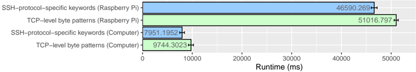

Cũng có thể thấy rằng hiệu ứng đối với Máy tính mạnh hơn so với Raspberry Pi. CPU máy tính hoạt động ở tần số cao hơn và bộ nhớ cao hơn bốn lần. Bộ nhớ gần như chưa cạn kiệt (100 trong số 2000 megabyte). Giả sử sức mạnh của CPU ảnh hưởng đến cả việc phát hiện và phân tích cú pháp theo cùng một cách thì chi phí tương ứng cũng phải bằng nhau cho cả máy tính và máy thử nghiệm Raspberry Pi. Hơn nữa, có thể lập luận rằng chi phí hoạt động không liên quan đến CPU sẽ quan trọng hơn đối với chi phí tương ứng trên Bộ xử lý trung tâm (CPU) có nhiều năng lượng hơn. Phần tiếp theo sẽ trình bày các thí nghiệm về các yếu tố ảnh hưởng. Ở đó cũng hiển thị chi phí hoạt động không liên quan đến CPU được thấy ở đây bắt nguồn từ tốc độ đọc đĩa của tệp PCAP.

## 5.3. Phân tích mô tả các yếu tố ảnh hưởng

Vì trình phân tích S7Comm được triển khai, giống như trình phân tích SSH, không thể đại diện cho tất cả các trình phân tích ICS có thể có, nó được đánh giá xem các yếu tố ảnh hưởng có thể ảnh hưởng như thế nào đến hiệu suất xử lý. Do đó, các quyết định thực hiện của người mổ xẻ, môi trường và nói chung là tổng chi phí dần dần của người mổ xẻ sẽ được thảo luận.

Bảng 5.6.: so sánh thời gian chạy (tính bằng ms) của các từ khóa và quy tắc dành riêng cho giao thức SSH dựa trên các mẫu byte cấp TCP

|              | SSH-protocol mean (sd)   | TCP-level mean (sd)   | Overhead for TCP-level   |
|--------------|--------------------------|-----------------------|--------------------------|
| Raspberry Pi | 46590 (590)              | 51017 (414)           | +9.5%                    |
| Computer     | 7951 (479)               | 9744 (495)            | +22.55%                  |

## 5.3.1. Chi phí phân tích ở các cấp độ khác nhau (d1-d3)

Trong phần này, chi phí chung của các cấp độ khả năng khác nhau của trình phân tích sẽ được điều tra. Điều này có nghĩa là chi phí dần dần dành cho bộ phân tích được kích hoạt nhưng không được sử dụng, phân tích cú pháp và phát hiện. Điều này có thể được phân tích bằng sự khác biệt về thời gian chạy giữa các cấp độ này.

Hình 5.2.: So sánh mức độ khả năng của bộ phân tích SSH và S7Comm

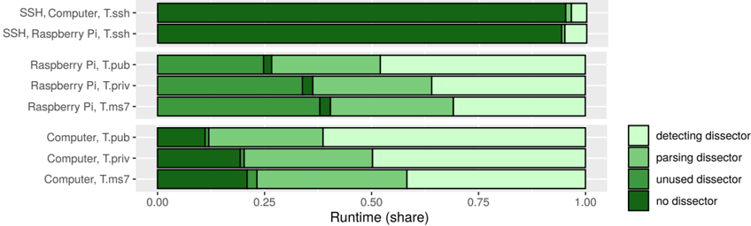

Trong Hình 5.2, phần chia sẻ của từng cấp độ được hiển thị trực quan cho cả bộ phân tích giao thức SSH và giao thức S7Comm trong cả hai nền tảng thử nghiệm. Do đó, nó được đánh giá là những cái có trình phân tích SSH bị vô hiệu hóa, những cái có trình phân tích không có quy tắc và những cái khác có khớp quy tắc. Bằng cách này, có thể thấy tỷ lệ của bộ phân tích bị vô hiệu hóa và bộ phân tích cú pháp bị vô hiệu hóa so với bộ phân tích phát hiện là như thế nào. Đối với trình phân tích giao thức SSH, mức độ của trình phân tích không được sử dụng không được đánh giá. Trong Bảng 5.7, 5.9 và 5.10, chi phí chung cho mỗi cấp độ, tổng cộng là 100%, được hiển thị.

Bảng 5.7.: thời gian chạy (tính bằng ms) và chi phí chung của các cấp khả năng khác nhau trên Raspberry Pi (sd&lt;1091ms)

|        | without dissector mean   | unused dissector mean   | parsing dissector mean   | detecting dissector mean   |
|--------|--------------------------|-------------------------|--------------------------|----------------------------|
| T.priv | 10267 (26.68%)           | 9534 (-1.91%)           | 20039 (+27.3%)           | 38477 (+47.92%)            |
| T.pub  | 8471 (36.29%)            | 7906 (-2.42%)           | 14962 (+30.23%)          | 23343 (+35.9%)             |
| T.ms7  | 30893 (40.43%)           | 28991 (-2.49%)          | 52853 (+31.23%)          | 76418 (+30.84%)            |

Trong Bảng 5.7 cũng như trong Hình 5.2, có thể thấy rằng đối với thử nghiệm Raspberry Pi, thời gian chạy đã giảm đối với cả ba tập dữ liệu (T.pub, T.priv và T.ms7) khi trình phân tích được thực hiện

được thêm vào mà không xử lý gói. Điều này không thể được quan sát trên giường thử nghiệm Máy tính. Độ lệch chuẩn của bộ kiểm tra T.priv và T.pub là dưới 337 mili giây (dưới 600 mili giây đối với T.ms7), cho thấy rằng sự bất thường này không phải do lỗi phi hệ thống gây ra. Tuy nhiên tại thời điểm này không có lời giải thích cho điều này.

Hơn nữa, có thể nhận thấy rằng đối với giường thử nghiệm Raspberry Pi so với giường thử nghiệm Máy tính, thời gian cần thiết để xử lý các gói mà không có bộ phân tích so với khả năng phát hiện cao hơn nhiều trên giường thử nghiệm Raspberry Pi. Điều này vẫn chỉ ra rằng có nhiều chi phí không liên quan đến CPU hơn trên Raspberry Pi. Do đó, chi phí đọc PCAP có thể là lý do cho việc này. Sử dụng công cụ linux hdparm 1, tốc độ đọc 43,06 MB/s được xác định cho Raspberry Pi (530,65 MB/s cho Máy tính). Thời gian cần thiết cho mỗi tập dữ liệu được liệt kê trong Bảng 5.8. Chi phí đọc tệp PCAP ảnh hưởng đến việc đo lường các quy tắc dựa trên các từ khóa dành riêng cho giao thức ICS theo cách tương tự như các mẫu byte cấp TCP.

Bảng 5.8.: Thời gian tính bằng giây để đọc từng tập dữ liệu dựa trên tốc độ đọc của đĩa

|    | dataset   |   size(mb) |   Raspberry Pi(s) |   Computer(s) |
|----|-----------|------------|-------------------|---------------|
|  1 | T.pub     |     202.68 |              4.71 |          0.38 |
|  2 | T.priv    |     198.62 |              4.61 |          0.37 |
|  3 | T.ms7     |     647.52 |             15.04 |          1.22 |
|  4 | T.mms     |     540.36 |             12.55 |          1.02 |
|  5 | T.ssh     |     742.19 |             17.24 |          1.4  |

Tổng quát hơn, có thể thấy trong Hình 5.2 và được quan sát trong các Bảng 5.7, 5.9 và 5.10 rằng chi phí phát hiện chiếm ưu thế. Khi so sánh tỷ lệ phân tích cú pháp của bộ phân tích S7Comm với phân tích của bộ phân tích SSH, có thể thấy rằng việc phân tích gói S7Comm tốn nhiều thời gian hơn, điều này được giải thích bởi tính mở rộng của phân tích cú pháp. Đối với nền tảng thử nghiệm Raspberry Pi, có một ngoại lệ đối với tập dữ liệu khai thác s7(T.ms7). Đối với thử nghiệm này, chi phí phát hiện gần bằng hoặc thấp hơn chi phí phân tích cú pháp.

Bảng 5.9.: thời gian chạy (tính bằng ms) và chi phí chung của các cấp độ khả năng khác nhau trên nền tảng thử nghiệm Máy tính (sd&lt;629ms)

|        | without dissector mean   | unused dissector mean   | parsing dissector mean   | detecting dissector mean   |
|--------|--------------------------|-------------------------|--------------------------|----------------------------|
| T.priv | 1018 (11.12%)            | 1098 (+0.88%)           | 3543 (+26.7%)            | 9157 (+61.31%)             |
| T.pub  | 1001 (19.34%)            | 1048 (+0.91%)           | 2601 (+30%)              | 5175 (+49.74%)             |
| T.ms7  | 3886 (20.93%)            | 4315 (+2.31%)           | 10820 (+35.04%)          | 18564 (+41.71%)            |

Đối với bộ phân tích SSH, có thể thấy trong Hình 5.2 rằng chi phí phân tích và phát hiện chỉ chiếm một phần nhỏ trong tổng thời gian xử lý gói. Điều này có thể được giải thích vì

1 Đọc benchmark bằng công cụ hdparm linux https://man7 org/linux/man-pages/man8/hdparm 8 html -Truy cập: ngày 22 tháng 6 năm 2021

có ít quy tắc được sử dụng hơn và như đã đề cập trước đó, trình phân tích giao thức SSH chỉ phân tích biểu ngữ SSH và cái gọi là tiêu đề bản ghi nên có thể lập luận rằng nó ít phức tạp hơn và phân tích các gói ít sâu hơn trình phân tích S7Comm. Điều này cũng là do giao thức SSH được mã hóa và do đó trình phân tích chỉ có thể phân tích thông tin meta.

Bảng 5.10.: thời gian chạy (tính bằng ms) và chi phí chung của các mức khả năng khác nhau dành cho trình phân tích SSH (sd&lt;691ms)

|              | disabled dissector mean   | parsing dissector mean   | detecting dissector mean   |
|--------------|---------------------------|--------------------------|----------------------------|
| Raspberry Pi | 44304 (95.09%)            | 44922 (+1.33%)           | 46590 (+3.58%)             |
| Computer     | 7487 (94.17%)             | 7545 (+0.73%)            | 7951 (+5.11%)              |

## 5.3.2. Tác động của các quyết định thực hiện đến cấp độ phân tích cú pháp (d4 &amp; d5)

Như đã đề cập, có hai loại biến thể về cách triển khai bộ phân tích. Nó có thể được triển khai ở trạng thái hoặc không trạng thái và có thể phân tích cú pháp động hoặc tĩnh. Bộ phân tích cơ bản không có trạng thái và phân tích các gói S7Comm theo cách tĩnh. Trong các thử nghiệm, ảnh hưởng của cả hai quyết định triển khai đến hiệu suất xử lý của bộ phân tích sẽ được thảo luận ở đây.

Hình 5.3.: So sánh phân tích cú pháp động và trạng thái trên Raspberry Pi

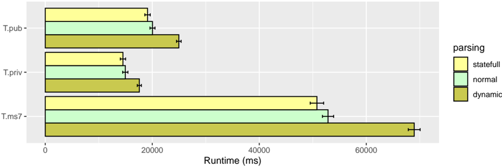

Trong Hình 5.3 có thể thấy rằng bộ phân tích với phân tích cú pháp động chậm hơn dự kiến. Chi phí chung khi sử dụng trình phân tích cú pháp động thay vì tĩnh là từ 17,52% đến gần 40%. Có thể thấy rằng chi phí chung cho tập dữ liệu T.priv là thấp nhất. Điều này có thể là do tập dữ liệu T.priv chứa nhiều yêu cầu đa dạng hơn và do đó tỷ lệ các phần động hiếm hơn sẽ thấp hơn. Bộ dữ liệu T.pub và T.ms7 chứa nhiều yêu cầu hơn với các phần động (ReadVar và WriteVar).

Khác với dự kiến ​​ban đầu, bộ phân tích có trạng thái nhanh hơn bộ phân tích không trạng thái. Người ta cho rằng nó sẽ chậm hơn vì nó sử dụng một vòng lặp cho mỗi phản hồi để kiểm tra các giao dịch chưa chứa phản hồi và do đó không đầy đủ.

Bảng 5.11.: So sánh thời gian chạy với phân tích cú pháp động và trạng thái (sd&lt;1254ms)

|                      | dynamic parsing mean   |   parsing dissector mean | stateful parsing mean   |
|----------------------|------------------------|--------------------------|-------------------------|
| Raspberry Pi, T.priv | 24970 (+24.6%)         |                    20039 | 19116 (-4.61%)          |
| Raspberry Pi, T.pub  | 17583 (+17.52%)        |                    14962 | 14520 (-2.95%)          |
| Raspberry Pi, T.ms7  | 68962 (+30.48%)        |                    52853 | 50779 (-3.93%)          |
| Computer, T.priv     | 4793 (+35.26%)         |                     3543 | 3346 (-5.55%)           |
| Computer, T.pub      | 3235 (+24.41%)         |                     2601 | 2471 (-4.99%)           |
| Computer, T.ms7      | 15144 (+39.96%)        |                    10820 | 10381 (-4.06%)          |

Ưu điểm của trình phân tích cú pháp trạng thái theo quan điểm hiệu suất xử lý là cần quản lý ít giao dịch hơn. Bộ nhớ được sử dụng gần như giống nhau cho cả ba biến thể.

## 5.3.3. Cải thiện khả năng điều chỉnh ở mức phát hiện (d6 & amp; d7)

Trong thử nghiệm này, sự cải tiến được cải thiện bằng cách điều chỉnh bộ phân tích dành riêng cho giao thức (Phần 4.5.1) và bằng cách tối ưu hóa các quy tắc như được mô tả trong Phần 4.5.3.

Bảng 5.12.: So sánh sự cải thiện thời gian chạy (tính bằng ms) bằng cách điều chỉnh bộ phân tích và quy tắc điều chỉnh (sd&lt;1103ms)

|                      | untuned dissector mean   |   detecting dissector mean | tuned rules mean   |
|----------------------|--------------------------|----------------------------|--------------------|
| Raspberry Pi, T.priv | 81720 (+112.39%)         |                      38477 | 34129 (-11.3%)     |
| Raspberry Pi, T.pub  | 64103 (+174.61%)         |                      23343 | 20393 (-12.64%)    |
| Raspberry Pi, T.ms7  | 223337 (+192.26%)        |                      76418 | 67046 (-12.26%)    |
| Computer, T.priv     | 21212 (+131.64%)         |                       9157 | 7527 (-17.8%)      |
| Computer, T.pub      | 16863 (+225.87%)         |                       5175 | 4221 (-18.42%)     |
| Computer, T.ms7      | 61105 (+229.16%)         |                      18564 | 15696 (-15.45%)    |

Như có thể thấy trong Hình 5.4, việc điều chỉnh bộ phân tích có ảnh hưởng lớn đến thời gian cần thiết để phát hiện. Trong Bảng 5.12 có thể thấy rằng bộ phân tích không điều chỉnh chậm hơn tới 2,3 lần so với bộ phân tích cơ bản có điều chỉnh. Người ta cho rằng đây có thể là một sự đánh đổi với việc sử dụng bộ nhớ. Có thể thấy sự khác biệt trong việc sử dụng bộ nhớ giữa phiên bản chưa điều chỉnh và phiên bản đã điều chỉnh của bộ phân tích trong Bảng 5.13, đặc biệt đối với phần thử nghiệm Máy tính. Có thể thấy phiên bản tinh chỉnh sử dụng nhiều bộ nhớ hơn dự kiến. Tuy nhiên hiệu ứng này ít rõ rệt hơn trên Raspberry Pi.

Đối với các quy tắc đã điều chỉnh, có thể thấy sự cải thiện hơn 10% so với bộ quy tắc cơ bản đối với tất cả các tập dữ liệu (T.priv, T.pub, T.ms7) trên tất cả các thử nghiệm được đánh giá. Vì vậy, có vẻ hữu ích khi ghi nhớ điều này khi tạo tệp quy tắc. Tuy nhiên, điều này cũng liên quan đến việc triển khai bộ phân tích vì sự khác biệt so với tệp quy tắc được tối ưu hóa là có ít từ khóa được sử dụng để mô tả gần như giống nhau.

Bảng 5.13.: So sánh mức sử dụng bộ nhớ (tính bằng kb) của bộ phân tích cơ bản đã điều chỉnh và bộ phân tích không được điều chỉnh

|                      | Untuned dissector mean (sd)   | Basic dissector mean (sd)   |
|----------------------|-------------------------------|-----------------------------|
| Raspberry Pi, T.pub  | 31889 (578)                   | 32579 (542)                 |
| Raspberry Pi, T.priv | 32002 (557)                   | 32803 (478)                 |
| Raspberry Pi, T.ms7  | 31933 (589)                   | 32605 (509)                 |
| Computer, T.pub      | 42831 (300)                   | 45501 (97)                  |
| Computer, T.priv     | 42917 (581)                   | 45500 (97)                  |
| Computer, T.ms7      | 42837 (360)                   | 45503 (115)                 |

Hình 5.4.: So sánh với bộ dò không điều chỉnh và quy tắc điều chỉnh trên Raspberry Pi

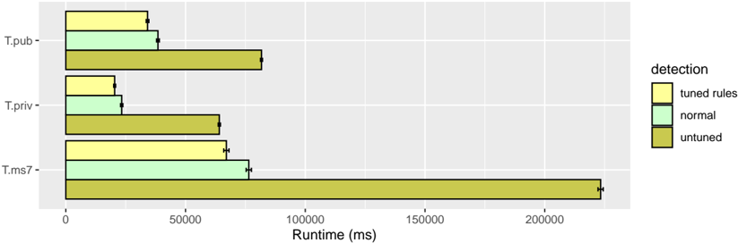

## 5.3.4. Cải thiện và so sánh việc sử dụng nhiều lõi CPU (d8)

Trong phần cuối cùng của phân tích mô tả, người ta thấy hiệu suất xử lý được cải thiện như thế nào khi sử dụng nhiều lõi thay vì một lõi. Trong bước tiếp theo, người ta quan sát xem liệu điều này có cải thiện cách tiếp cận sử dụng quy tắc dựa trên các từ khóa dành riêng cho giao thức ICS hay ngược lại.

Hình 5.5.: So sánh thời gian chạy giữa mức sử dụng đơn và đa lõi (7 luồng CPU) cho bộ phân tích trên bàn thử nghiệm Máy tính

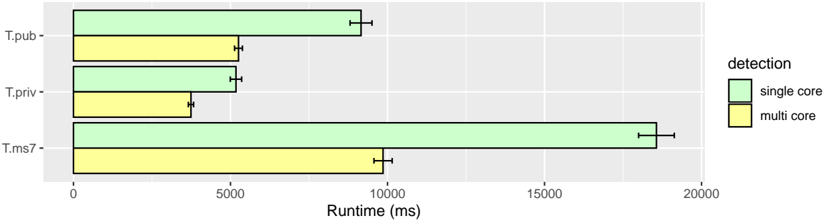

Có thể thấy rõ trong Hình 5.5 rằng bộ phân tích có thể khai thác các lõi bổ sung để có thời gian chạy tốt hơn. Tuy nhiên, như có thể thấy trong Bảng 5.14, thời gian cần thiết để xử lý các gói giảm đi một nửa trong khi số luồng của CPU tăng gần gấp bảy lần.

Bảng 5.14.: So sánh thời gian chạy (tính bằng ms) của bộ phân tích cho lõi đơn và đa lõi

|                      | Single core mean (sd)   | Multi core mean (sd)   | Improvement   |
|----------------------|-------------------------|------------------------|---------------|
| Raspberry Pi, T.pub  | 38477 (580)             | 17532 (455)            | -54.44%       |
| Raspberry Pi, T.priv | 23343 (474)             | 12651 (206)            | -45.8%        |
| Raspberry Pi, T.ms7  | 76418 (1090)            | 33954 (779)            | -55.57%       |
| Computer, T.pub      | 9157 (349)              | 5255 (125)             | -42.61%       |
| Computer, T.priv     | 5175 (181)              | 3742 (84)              | -27.69%       |
| Computer, T.ms7      | 18564 (568)             | 9859 (290)             | -46.89%       |

Hình 5.6 trực quan hóa tỷ lệ của cả hai quy tắc dựa trên từ khóa cấp độ TCP và từ khóa dành riêng cho giao thức ICS. Có thể thấy một xu hướng nhỏ khi so sánh thanh lõi đơn với thanh đa lõi rằng cách tiếp cận ở cấp độ TCP mất nhiều thời gian hơn một chút so với cách tiếp cận ở cấp độ giao thức ICS.

Hình 5.6.: So sánh tỷ lệ thời gian chạy giữa các quy tắc dựa trên từ khóa cấp TCP và từ khóa dành riêng cho giao thức ICS cho lõi đơn và đa lõi trên Máy tính

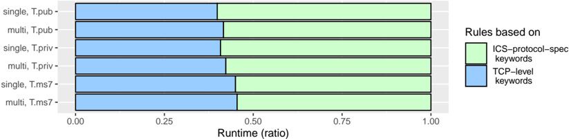

Bảng 5.15.: So sánh thời gian chạy (tính bằng ms) của các quy tắc dựa trên từ khóa cấp TCP và từ khóa dành riêng cho giao thức ICS cho lõi đơn và đa lõi trên Máy tính

|                     | ICS-protocol mean (sd)   | TCP-level mean (sd)   | Overhead for ICS-Protocol   |
|---------------------|--------------------------|-----------------------|-----------------------------|
| Single core, T.pub  | 9157 (349)               | 6071 (343)            | +50.83%                     |
| Multi Core, T.pub   | 5255 (125)               | 3749 (98)             | +40.17%                     |
| Single core, T.priv | 5175 (181)               | 3566 (233)            | +45.13%                     |
| Multi Core, T.priv  | 3742 (84)                | 2742 (89)             | +36.47%                     |
| Single core, T.ms7  | 18564 (568)              | 15191 (570)           | +22.2%                      |
| Multi Core, T.ms7   | 9859 (290)               | 8217 (250)            | +19.97%                     |

Điều này cũng có thể được quan sát trong Bảng 5.15. Các thí nghiệm lõi đơn giống như trong H1. Tuy nhiên, có thể thấy rằng chi phí khi sử dụng các quy tắc dựa trên từ khóa cấp TCP sẽ giảm khi sử dụng nhiều lõi. Điều này có nghĩa là các quy tắc dựa trên từ khóa cấp TCP sẽ được hưởng lợi nhiều hơn từ việc sử dụng nhiều lõi. Người ta cho rằng trường hợp này xảy ra là do quá trình phân tích cú pháp và quá trình phát hiện có thể được thực hiện song song theo cách này. Về mặt lý thuyết

bằng cách này, việc phát hiện gói hiện tại và phân tích gói tiếp theo có thể được thực hiện song song. Tuy nhiên, điều này dường như không hoàn toàn đúng vì nếu không thì trình phân tích sẽ được hưởng lợi nhiều hơn từ nhiều lõi.

##5.4. Phần kết luận

Để tóm tắt tất cả các kết quả, một bộ phân tích ICS phức tạp giống như bộ phân tích được phát triển trong tác phẩm này có chi phí phân tích cú pháp lớn. Đối với các quy tắc dựa trên mẫu byte cấp TCP, quy tắc sẽ không được phân tích cú pháp thêm nữa (chỉ tối đa ở transport layer).

Việc sử dụng phân tích cú pháp động cho phép kiểm tra sâu hơn các gói nhưng cũng cần thời gian xử lý lâu hơn. Mặt khác, việc triển khai bộ phân tích có trạng thái nhanh hơn so với bộ phân tích không trạng thái. Chi phí phân tích cú pháp phụ thuộc vào phạm vi của các chức năng (phân tích cú pháp động, phân tích trạng thái) và cả mức độ mở rộng. Có thể thấy cái sau bằng cách so sánh với trình phân tích giao thức SSH hoạt động tốt hơn so với cách tiếp cận mẫu byte bằng cách cung cấp ít từ khóa hơn và phân tích cú pháp ít sâu hơn. Vì vậy, đối với phần phân tích cú pháp, bộ phân tích là quan trọng nhất đối với các quyết định thực hiện.

Kỹ thuật điều chỉnh nên được xem xét khi phát triển bộ phân tích vì nó có thể cải thiện tốc độ xử lý hơn 100%. Bộ nhớ tăng 2,5%-7,7% so với phiên bản chưa được điều chỉnh của máy mổ. Tuy nhiên, trong các thí nghiệm, bộ nhớ không bao giờ là nút cổ chai. Nếu có thể, tệp quy tắc nên được tối ưu hóa như mô tả cho S7Comm trong Phần 4.5.3 vì điều này có thể cải thiện hiệu suất xử lý hơn 10%.

Các quy tắc dựa trên các từ khóa dành riêng cho giao thức ICS, yêu cầu bộ phân tích tương ứng, chậm hơn tới 51% so với các quy tắc dựa trên từ khóa cấp TCP cho lưu lượng truy cập ICS thông thường. Như giả định, các quy tắc dựa trên từ khóa dành riêng cho giao thức ICS nhanh hơn mẫu byte cấp TCP trên lưu lượng tương tự trên cùng một cổng. Trong đánh giá, mức cải thiện là khoảng 2%-8% tốc độ khi sử dụng các quy tắc dựa trên từ khóa dành riêng cho giao thức ICS. Tuy nhiên, điều này phụ thuộc vào thời gian kết nối TCP kéo dài bao lâu. Điều này cần được cân nhắc khi sử dụng IDS với nhiều giao thức trên cùng một cổng TCP.

## 6. Quá trình phát triển

Đối với sự phát triển của một người mổ xẻ, một quá trình lặp đi lặp lại được giả định. Mặt khác, việc phát triển bộ phân tích là một phần quan trọng trong bảo mật liên quan đến hệ thống IDS như đã thảo luận trước đó (Phần 2.3.2). Bảo mật đi đôi với chất lượng của người mổ xẻ. Các khía cạnh về khả năng sử dụng và hiệu suất có tác động đến tính bảo mật cho trình phân tích. Khả năng sử dụng kém như dễ xảy ra lỗi có thể ví dụ: dẫn đến sai sót khi tạo luật dựa trên bộ phân tích. Như đã thảo luận trong tác phẩm này và cũng được trình bày trong Shah và Issac [28], hiệu suất xử lý kém dẫn đến giảm gói, dẫn đến độ tin cậy thấp để phát hiện các cuộc tấn công trong hệ thống IDS. Vì vậy, điều quan trọng là máy mổ phải đáp ứng được các đặc tính chất lượng. Có các đặc tính chất lượng sản phẩm được xác định trong ISO/IEC 25000 [18] được xây dựng dựa trên một số tiêu chuẩn khác. Tuy nhiên, mô hình chất lượng sản phẩm thường được xác định cho công nghệ hệ thống và phần mềm, nhưng chưa bao giờ được áp dụng để phát triển bộ phân tích. Do đó, các đặc tính chất lượng liên quan cho quá trình phát triển bộ phân tích được áp dụng và thảo luận ở đây. Điều này có thể được sử dụng như một hướng dẫn để đảm bảo chất lượng của quá trình phát triển bộ mổ. Sau đó, quá trình lặp lại nêu trên cũng được trình bày liên quan đến các đặc tính chất lượng của mô hình.

##6.1. Áp dụng mô hình chất lượng sản phẩm ISO

Mô hình chất lượng sản phẩm xác định tám đặc điểm, mỗi đặc điểm có các đặc điểm phụ. Trong phần này, sáu trong số những đặc điểm này sẽ được thảo luận sau đây.

## 6.1.1. Sự phù hợp về chức năng

Sự phù hợp về chức năng là 'mức độ mà một sản phẩm hoặc hệ thống cung cấp các chức năng đáp ứng các nhu cầu đã nêu và ngụ ý khi được sử dụng trong các điều kiện cụ thể'.

Chức năng này có thể được nhìn thấy theo hai cách. Đầu tiên là những gì được phân tích cú pháp và thứ hai là những gì được cung cấp cho các quy tắc. Gói giao thức có thể được phân tích một cách hời hợt hoặc sâu hơn. Phân tích cú pháp bề ngoài chỉ có thể phân tích thông tin meta từ tiêu đề trong khi phân tích sâu có thể có nghĩa là phân tích gói hoàn chỉnh. Nó có thể được cung cấp cho tất cả các trường của giao thức, ví dụ như trường hợp. cho các bộ lọc hiển thị trong Wireshark 1. Tuy nhiên, trình phân tích cũng chỉ có thể cung cấp các trường liên quan như trường hợp trong hệ thống IDS.

Câu hỏi ở đây cũng là điều cần thiết. Điều này có thể phụ thuộc vào mục đích của người mổ xẻ. Để phát hiện xâm nhập, cần phải phân tích cú pháp và cung cấp các trường của giao thức cần thiết để đánh giá tốt xem có tấn công hay không. Đối với hiệu năng xử lý, chức năng của trình phân tích cú pháp có thể trở thành yếu tố quan trọng như đã thấy trong Chương 5. Có bộ phân tích động có thể là điều tốt nhưng cũng đã có rồi.

1 Hiển thị bộ lọc trong Wireshark https://wiki Wireshark org/DisplayFilters - Truy cập ngày 22.06.2021

được thảo luận có ảnh hưởng mạnh mẽ đến hiệu suất xử lý. Vì vậy, điều quan trọng là phải quyết định chức năng nào thực sự cần thiết để hoàn thành mục đích.

Tính phù hợp của chức năng được chia thành tính đầy đủ, tính chính xác và tính phù hợp mà dường như tất cả đều có liên quan ở đây.

- Tính hoàn thiện về chức năng được định nghĩa là 'mức độ mà tập hợp các chức năng bao gồm tất cả các nhiệm vụ được chỉ định và mục tiêu của người dùng'. Tính đầy đủ về chức năng có thể bị giới hạn bởi thông tin có thể được thu thập cho một giao thức phù hợp. Nếu có ít thông tin sẵn có cho nhà phát triển tại thời điểm phát triển hơn mức cần thiết để phát hiện đầy đủ các cuộc tấn công thì trình phân tích có thể không đạt được mức độ hoàn chỉnh về mặt chức năng. Tuy nhiên, trong tài liệu của trình phân tích có nêu rõ chức năng nào được hỗ trợ và tất cả điều này cũng phải được triển khai.
- Tính đúng đắn về mặt chức năng mô tả 'mức độ mà sản phẩm hoặc hệ thống cung cấp kết quả chính xác với mức độ chính xác cần thiết'. Đối với các giao thức độc quyền không có thông tin chính thức, thông tin có thể được thu thập từ các nguồn thông tin khác. Tuy nhiên, có thể có rủi ro là những điều này không chính xác. Vì thông tin về giao thức tạo thành cơ sở cho tính đúng đắn về mặt chức năng nên điều này phải được xem xét. Một cách để cải thiện tính chính xác của chức năng là sử dụng các bản ghi lưu lượng giao thức thực tế có thể được sử dụng để gỡ lỗi và kiểm tra bộ phân tích. Tuy nhiên điều này sẽ được thảo luận chi tiết hơn sau.
- Sự phù hợp về chức năng được định nghĩa là 'mức độ mà các chức năng tạo điều kiện thuận lợi cho việc hoàn thành các nhiệm vụ và mục tiêu cụ thể'. Như đã thảo luận trước đó, có sự cân bằng giữa chức năng và hiệu suất xử lý vì nó được xác định cho phân tích cú pháp động và phân tích cú pháp tĩnh. Vì vậy, điều quan trọng là tìm ra sự cân bằng tốt để tạo điều kiện thuận lợi cho mục tiêu của ví dụ: phát hiện tấn công chính xác. Để tìm sự cân bằng phù hợp về chức năng, có thể cần phải biết thuộc tính nào của giao thức là quan trọng để phát hiện các cuộc tấn công. Vì vậy cần có kiến ​​thức về các phần liên quan đến bảo mật.

## 6.1.2. Hiệu quả thực hiện

Hiệu suất hoạt động được định nghĩa là 'hiệu suất tương ứng với lượng tài nguyên được sử dụng trong các điều kiện đã nêu'.

'Hiệu suất' có thể được coi là độ chính xác phát hiện và hiệu suất xử lý. Độ chính xác phát hiện của bộ phân tích thể hiện mức độ tốt của nó trong việc phát hiện các cuộc tấn công và ngăn chặn cảnh báo sai. Tuy nhiên, độ chính xác của việc phát hiện phụ thuộc rất nhiều vào các quy tắc được sử dụng. Tuy nhiên, vì bộ phân tích cung cấp các từ khóa cần thiết và phân tích giao thức, nó tạo cơ sở cho việc phát hiện tốt các quy tắc. Khi 'hiệu suất' được coi là hiệu suất xử lý thì việc sử dụng tài nguyên là đặc điểm của nó. Như đã thấy ở phần đánh giá (Chương 5), CPU thường là yếu tố hạn chế. Tuy nhiên trí nhớ cũng phải được xem xét. Nó cũng đã được chứng minh rằng việc phát hiện là một phần chiếm ưu thế trong thời gian cần thiết để xử lý các gói. Cũng có nhiều cách để cải thiện khả năng phát hiện. Tuy nhiên, phần phân tích cú pháp có vẻ linh hoạt hơn để cải thiện hiệu suất xử lý khi xem xét phạm vi chức năng.

Trong khi sự phát triển của bộ phân tích, hiệu suất xử lý có thể được cải thiện, tốc độ xử lý gói và việc sử dụng tài nguyên của IDS phụ thuộc vào các điều kiện sử dụng nó. Điều này có nghĩa là ví dụ. tài nguyên do phần cứng cung cấp, số lượng quy tắc được sử dụng cũng như thông lượng mà hệ thống phải quản lý. Điều này có thể được hiểu theo 'các điều kiện đã nêu' của định nghĩa trên.

Hiệu quả hoạt động được chia thành ba đặc điểm phụ, tất cả đều liên quan đến việc phát triển bộ phân tích.

- Hành vi thời gian biểu thị 'mức độ mà thời gian phản hồi và xử lý cũng như tốc độ thông lượng của sản phẩm hoặc hệ thống, khi thực hiện các chức năng của nó, đáp ứng các yêu cầu'. 'Thời gian phản hồi' có thể được hiểu là thời gian trôi qua cho đến khi phát hiện được sự cố. 'Thời gian xử lý' có thể được coi là thời gian cần thiết để phân tích một gói hoặc so khớp gói đó với các quy tắc nhất định. 'Tốc độ thông lượng' là số lượng gói hoặc số lượng dữ liệu (ví dụ: tính bằng megabyte trên giây) có thể được xử lý cho đến khi gói bị loại bỏ.
- Việc sử dụng tài nguyên là 'mức độ mà số lượng và loại tài nguyên được sử dụng bởi một sản phẩm hoặc hệ thống, khi thực hiện các chức năng của nó, đáp ứng các yêu cầu'. Không giống như phần mềm ứng dụng (ví dụ: trình duyệt web), hệ thống máy tính thường được sử dụng riêng cho IDS do đó tài nguyên có thể được sử dụng hoàn toàn ở đây. Tuy nhiên điều này cũng có thể được xem xét để đánh giá người mổ xẻ. Nếu bộ phân tích đạt mức sử dụng CPU tối đa thì các quy trình khác như quy trình hệ thống hoặc các công cụ đo lường cũng có thể ảnh hưởng trực tiếp đến hiệu suất xử lý và có thể làm sai lệch kết quả đánh giá.
- Công suất có nghĩa là 'mức độ đáp ứng các giới hạn tối đa của một sản phẩm hoặc thông số hệ thống'. Tham số sản phẩm của quá trình phát triển bộ phân tích có thể là ví dụ: được hiểu là số lượng gói có thể được xử lý trên một hệ thống cụ thể tùy thuộc vào số lượng quy tắc được sử dụng. Không rõ những yêu cầu nào cần được đáp ứng ở đây vì điều này có thể phụ thuộc vào nhiều điều kiện phải được xác định trước. Tuy nhiên, người ta có thể đặt mục tiêu là đạt được khả năng đáp ứng các điều kiện được xác định trong tài liệu là yêu cầu tối thiểu. Điều này ít nhất phải bao gồm phần cứng cũng như các quy tắc được sử dụng để đạt được dung lượng.

## 6.1.3. Khả năng sử dụng

Khả năng sử dụng được xác định là 'mức độ mà một sản phẩm hoặc hệ thống có thể được người dùng cụ thể sử dụng để đạt được các mục tiêu cụ thể với hiệu lực, hiệu quả và sự hài lòng trong bối cảnh sử dụng cụ thể'. Các điểm tiếp xúc với người sử dụng của bộ tách là đầu vào và đầu ra của bộ tách. Đầu vào phải được giới hạn ở các quy tắc và các tùy chọn cấu hình có thể có. Nói chung, đầu ra chỉ là ghi nhật ký các gói và cảnh báo được kích hoạt.

Các đặc điểm phụ liên quan đến chất lượng của bộ phân tích, đặc biệt là về bảo mật, là khả năng xảy ra lỗi và khả năng học hỏi.

- Khả năng học hỏi được định nghĩa là 'mức độ mà một sản phẩm hoặc hệ thống có thể được sử dụng bởi những người dùng cụ thể để đạt được các mục tiêu cụ thể về việc học cách sử dụng sản phẩm hoặc hệ thống đó'

[...]'. Khả năng học hỏi có thể được hỗ trợ bởi sự lựa chọn tốt về tên từ khóa. Có hai yếu tố cần xem xét. Tên từ khóa phải phù hợp với quy ước đặt tên thường được sử dụng của các bộ phân tích khác trong IDS, đồng thời phải quen thuộc trong bối cảnh giao thức thường được sử dụng. Điều này có thể đạt được bằng cách định hướng trên các bộ phân tích khác cho cùng một giao thức, ví dụ: các từ khóa được sử dụng trong Wireshark. Tuy nhiên, nếu có thông số kỹ thuật chính thức của giao thức thì điều này nên được ưu tiên.

- Khả năng xảy ra lỗi của người dùng được định nghĩa là 'mức độ mà hệ thống bảo vệ người dùng khỏi mắc lỗi'. Đối với trình phân tích, điều này rất phù hợp vì nếu có lỗi trong quy tắc không được phát hiện thì quy tắc đó có thể không được kích hoạt bởi một cuộc tấn công cần được nhận dạng như mong đợi. Đầu tiên nó phải được xác định xem người dùng có thể mắc lỗi ở đâu. Đây có thể là trường hợp, ví dụ: bằng cách chọn giá trị từ khóa không hợp lệ. Là một biện pháp đối phó, có thể có một cách để kiểm tra quy tắc về ngữ nghĩa chính xác trong khi bộ phân tích đang được khởi tạo.

## 6.1.4. Độ tin cậy

Độ tin cậy là 'mức độ mà một hệ thống, sản phẩm hoặc thành phần thực hiện các chức năng được chỉ định trong các điều kiện xác định trong một khoảng thời gian xác định'.

Các đặc tính phụ về tính khả dụng và khả năng chịu lỗi cũng có liên quan đến bộ phân tích.

- Tính sẵn sàng được xác định là 'mức độ mà một hệ thống, sản phẩm hoặc thành phần đang hoạt động và có thể truy cập được khi được yêu cầu sử dụng'. Việc bộ phân tích có hoạt động hay không phụ thuộc rất nhiều vào hệ thống nơi nó được nhúng (IDS trong trường hợp này). Tuy nhiên, có hai trường hợp trong đó máy mổ có thể được chỉ định là không hoạt động.

Đầu tiên nếu trình phân tích nhầm không phát hiện được trách nhiệm của nó đối với gói tin. Thường có một phần của bộ phân tích (bộ phân tích cú pháp thăm dò) quyết định gói giao thức nhất định nếu gói đó đến từ giao thức mà nó chịu trách nhiệm. Bộ phân tích cú pháp thăm dò thường là một phần của quá trình phát hiện giao thức động của hệ thống IDS. Nếu phần này quá hạn chế và từ chối sai một gói mà trình phân tích thực sự chịu trách nhiệm, thì nó có thể được coi là không hoạt động.

Đối với trường hợp thứ hai, trình phân tích cũng có thể khiến hệ thống IDS không khả dụng nếu có lỗi triển khai, ví dụ: gây ra các vòng lặp vô hạn. Tuy nhiên, một lỗi như vậy không khiến hệ thống bị lỗi trong các trường hợp thông thường có thể bị kẻ tấn công khai thác. Đối với người mổ xẻ, cả hai trường hợp đều cần được xem xét vì chúng có thể ảnh hưởng trực tiếp đến độ chính xác cũng như tính bảo mật.

- Khả năng chịu lỗi được định nghĩa là 'mức độ mà hệ thống, sản phẩm hoặc thành phần hoạt động như dự định mặc dù có lỗi phần cứng hoặc phần mềm'. Có ít nhất hai lỗi liên quan đến người mổ xẻ.

Đầu tiên có thể có lỗi xảy ra trong khi bắt hoặc truyền gói tin. Việc mất gói ở cấp độ TCP có thể dẫn đến thực tế là luồng TCP không thể được tập hợp hoàn chỉnh nữa. Người tham gia kết nối TCP có thể yêu cầu gửi lại

gói (TCP DUP ACK) trong khi hệ thống thụ động ở giữa (như IDS) không thể và phải giải quyết vấn đề này. Nó có thể phụ thuộc vào người mổ xẻ liệu nó có thể phục hồi từ trạng thái đó hay không. Nếu nó có thể khắc phục được lỗi như vậy thì nó có thể được coi là có khả năng chịu lỗi.

Thứ hai, một lỗi mang tính khái niệm hơn có thể xảy ra. Đây là ví dụ. trường hợp gói nhận được có sai lệch so với hành vi giả định. Điều này có thể do người gửi bị lỗi không tuân thủ đặc tả giao thức. Tuy nhiên, nguyên nhân cũng có thể là do việc triển khai sai bộ phân tích có thể bắt nguồn từ thông tin bị hạn chế, bị lỗi về giao thức trong quá trình phát triển. Trong mọi trường hợp, có thể khắc phục lỗi bằng cách mạnh mẽ hơn trong khi phân tích cú pháp. Nguyên tắc chắc chắn (cũng là luật của Postel) về 'hãy thận trọng trong những gì bạn gửi, hãy tự do trong những gì bạn chấp nhận' nên được xem xét khi triển khai trình phân tích cú pháp. Nguyên tắc này được mở rộng bằng thử nghiệm suy nghĩ 'giả sử rằng mạng chứa đầy các thực thể độc hại sẽ gửi các gói được thiết kế để gây ra tác động tồi tệ nhất có thể'2 . Cả hai đều có nghĩa là trình phân tích cú pháp nên xem xét trường hợp xấu nhất mà nó phải xử lý. Điều này đặc biệt áp dụng cho trình phân tích cú pháp của IDS vì nếu có cách gửi các gói mà IDS không thể phân tích cú pháp nhưng được hệ thống chấp nhận để bảo vệ thì kẻ tấn công có thể trốn tránh sự bảo vệ (tránh tấn công). Do đó, bộ phân tích ít nhất phải có khả năng chịu lỗi như hệ thống được bảo vệ.

## 6.1.5. Bảo vệ

Bảo mật được định nghĩa là 'mức độ mà một sản phẩm hoặc hệ thống bảo vệ thông tin và dữ liệu để mọi người hoặc các sản phẩm hoặc hệ thống khác có mức độ truy cập dữ liệu phù hợp với loại và mức độ ủy quyền của họ'. Bảo mật như được định nghĩa ở đây không thể được áp dụng ở đây vì dường như không có cách nào để trình phân tích hoặc IDS cấp trên đạt được sự bảo vệ dữ liệu. Tuy nhiên, đặc tính phụ của 'tính xác thực' và 'tính toàn vẹn' rất quan trọng đối với sự phát triển của người mổ xẻ.

- Tính xác thực có liên quan vì thường có một cách trong hệ thống IDS để kiểm tra 'tính xác thực' bằng ví dụ: địa chỉ IP của người gửi. Tuy nhiên, có những kỹ thuật để tránh điều này (ví dụ: giả mạo IP, giả mạo ARP). Đối với những trình phân tích lớp ứng dụng, thường không có cách nào để kết luận chắc chắn về tính xác thực. Các ngoại lệ có thể là các giao thức cần xác thực. Đối với loại giao thức này, nó có thể được kiểm tra xem người gửi đã chứng minh được danh tính của mình trước đó chưa, ví dụ: gửi các gói quan trọng về bảo mật.
- Tính toàn vẹn không đề cập đến tính toàn vẹn của các gói dành cho bộ phân tích mà là tính toàn vẹn của hệ thống máy tính nơi bộ phân tích chạy. Như đã giải thích ở Phần 2.3.2, hệ thống IDS cũng có thể là mục tiêu của một cuộc tấn công. Điều này có thể khiến hệ thống bị lỗi hoặc bị vượt qua. Như đã nêu ở đó, các trình phân tích cú pháp thường dễ gặp phải các lỗ hổng liên quan đến bộ nhớ. Điều này có thể được ngăn chặn bằng cách sử dụng các ngôn ngữ an toàn cho bộ nhớ như Rust (Phần 2.4). Hơn nữa, bộ kết hợp trình phân tích cú pháp có thể ngăn ngừa lỗi phân tích cú pháp. Ngoài ra còn có các phương pháp để kiểm tra hoạt động của trình phân tích cú pháp đối với nhiều đầu vào khác nhau như sử dụng phương pháp Sanitizer hoặc Fuzzing.

2 RFC1122 phần 1.2.2 https://datatracker ietf org/doc/html/rfc1122#page-12

## 6.1.6. Khả năng bảo trì

Khả năng bảo trì được tuyên bố là 'mức độ hiệu quả và hiệu suất mà sản phẩm hoặc hệ thống có thể được sửa đổi bởi những người bảo trì dự định'.

Có thể lập luận rằng các bộ phân tích không cần phải sửa đổi sau đó vì các giao thức tương ứng thường được chỉ định một lần và không thay đổi. Tuy nhiên, có thể có những lý do chính đáng để điều chỉnh bộ phân tích, ví dụ: nếu các điều kiện của hệ thống thì bộ phân tích sẽ được nhúng vào các thay đổi. Hơn nữa, trọng tâm của các phần liên quan đến bảo mật của giao thức sẽ thay đổi do các lỗi được vá và các lỗ hổng mới xuất hiện.

Bên cạnh khả năng bảo trì theo nghĩa hẹp hơn, còn có khả năng sử dụng lại, tính mô đun và khả năng kiểm tra được xác định là các đặc tính phụ có liên quan đến trình phân tích.

Nó được chia thành các đặc điểm sau:

- Tính mô đun là 'mức độ mà một hệ thống hoặc chương trình máy tính bao gồm các thành phần riêng biệt sao cho việc thay đổi một thành phần có tác động tối thiểu đến các thành phần khác'. Bộ phân tích thường có thể được tách thành nhiều phần trong đó phần dùng chung có thể là biểu diễn bên trong của các gói. Có thể có phần ghi nhật ký để ghi thông tin gói, phần dò tìm khớp các gói theo quy tắc và phần phân tích cú pháp phân tích các gói.
- Khả năng sử dụng lại được định nghĩa là 'mức độ mà một tài sản có thể được sử dụng trong nhiều hệ thống hoặc để xây dựng các tài sản khác'. Nếu bộ phân tích được phát triển theo cách có thể tái sử dụng thì các phần như bộ phân tích cú pháp có thể được sử dụng lại cho các hệ thống khác. Điều này cũng có thể được xem xét theo cách khác trước khi phát triển trình phân tích cú pháp mới. Có thể có khả năng sử dụng lại mã của trình phân tích cú pháp từ một hệ thống khác đã triển khai trình phân tích cú pháp. Chifflier và Couprie khuyến nghị nên viết và kiểm tra trình phân tích cú pháp trong một dự án riêng biệt để 'tạo điều kiện thuận lợi cho việc kiểm tra và tái sử dụng trong các ứng dụng khác'.
- Khả năng kiểm thử là 'mức độ hữu hiệu và hiệu quả mà tiêu chí kiểm tra có thể được thiết lập cho một hệ thống, sản phẩm hoặc thành phần và các kiểm tra có thể được thực hiện để xác định xem các tiêu chí đó có được đáp ứng hay không'. Khả năng kiểm tra thường đã được cung cấp bởi giao diện cho hệ thống tổng thể, có thể được sử dụng làm đầu vào và đầu ra cho các thử nghiệm. Cách thực hiện thử nghiệm với bộ phân tích được giải thích chi tiết hơn trong quá trình phát triển được trình bày (Phần 6.2.5).

##6.2. Sự phát triển của người mổ xẻ như một quá trình lặp đi lặp lại

Trong phần này, quy trình phát triển để phát triển bộ phân tích như một phần của IDS được giới thiệu.

Quá trình được minh họa trong Hình 6.1 bao gồm năm bước theo chu kỳ và câu hỏi đặt trước nếu cần có người mổ xẻ. Quá trình này được hoàn thiện bằng việc triển khai và khả năng bảo trì. Các bước tuần hoàn được thực hiện nhiều lần trong nhiều giai đoạn phát triển. Cách tiếp cận về các giai đoạn như vậy có thể trông như thế nào được đưa ra sau đây:

- Trong (các) giai đoạn đầu tiên, nguyên mẫu của máy mổ có thể được thực hiện. Có hai biến thể của nguyên mẫu phần mềm thường được sử dụng. Nguyên mẫu tiến hóa là

phát triển qua nhiều giai đoạn (xem thêm [29]) cho đến khi quá trình phân tích hoàn tất. Tuy nhiên cái gọi là 'nguyên mẫu nhanh' chỉ bao gồm một giai đoạn và bị loại bỏ sau đó. Để phát triển bộ phân tích, cả hai biến thể đều phù hợp vì 'nguyên mẫu nhanh' giúp hiểu được môi trường bao gồm cả IDS nơi nó được nhúng. Nguyên mẫu tiến hóa có thể được sử dụng theo cách mà bộ phân tích đầu tiên chỉ phân tích một phần nhỏ và không cung cấp hoặc chỉ cung cấp một vài từ khóa, sau đó phát triển qua các giai đoạn cho đến khi bộ phân tích cuối cùng với phạm vi chức năng hoàn chỉnh xuất hiện. Đặc điểm đặc biệt của việc tạo mẫu là thường sau mỗi giai đoạn sẽ có một sản phẩm hoạt động có thể được thử nghiệm. Tuy nhiên, các giai đoạn sau đề cập đến biến thể 'nguyên mẫu nhanh'.

- Sau khi bộ phân tích bị loại bỏ, bộ phân tích thực hiện được tạo ra, bộ phân tích này chỉ có thể phân tích các gói và không phát hiện được thực hiện. Bộ phân tích cú pháp có thể được triển khai như một phần hoàn toàn tách biệt theo khuyến nghị của [8].
- Sau khi bộ phân tích cú pháp đã đạt đến phạm vi chức năng đầy đủ, nó có thể được tích hợp vào hệ thống IDS. Phần phát hiện cũng được thực hiện trong giai đoạn này. Tuy nhiên, có thể cần phải chạy qua một giai đoạn nhiều lần.
- Trong (các) giai đoạn cuối, kỹ thuật điều chỉnh được áp dụng và bộ phân tích được hoàn thiện để triển khai. Trong (các) giai đoạn này, bộ phân tích cũng cần được đánh giá để kiểm tra xem nó có đạt được các yêu cầu để sử dụng trong môi trường dự kiến ​​hay không.

Hình 6.1.: Quá trình lặp lại quá trình phát triển bộ phân tích

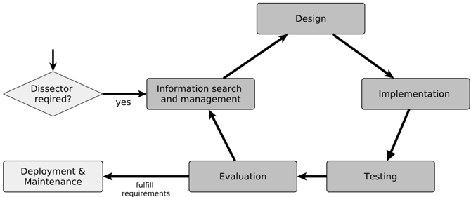

## 6.2.1. Cần có người mổ xẻ?

Câu hỏi liệu có cần thiết phải có người mổ xẻ hay không không thể dễ dàng trả lời. Cần phải cân nhắc xem các đặc tính và đặc biệt là các chức năng mà máy mổ mang lại có phù hợp và cần thiết cho ứng dụng hay không. Trong phần này, các khía cạnh được thảo luận có thể giúp đưa ra quyết định nếu các quy tắc dựa trên từ khóa dành riêng cho giao thức, do đó yêu cầu trình phân tích giao thức tương ứng, nên được ưu tiên hơn các quy tắc dựa trên mẫu byte cấp TCP.

## 6.2.1.1. Các phần giao thức động

Chức năng của các mẫu byte cấp TCP trước hết bị giới hạn bởi việc khớp mẫu tĩnh. Có nghĩa là phương pháp này chỉ có thể được sử dụng miễn là có giá trị và giá trị bù cố định, không thay đổi. Vì vậy, ví dụ này. không bao gồm danh sách động. Danh sách động là danh sách có kích thước được chỉ định bởi đặc tả giao thức. Bộ phân tích có thể cung cấp khả năng khớp một giá trị nhất định với tất cả các mục trong danh sách. Tuy nhiên, cũng có thể có cách để thực hiện việc này trong một số trường hợp bằng cách sử dụng quy tắc dựa trên mẫu byte bằng cách sử dụng biểu thức chính quy. Cách tiếp cận này đi kèm với chi phí đáng kể cho chu kỳ CPU và bộ nhớ như Vasiliadis et al đã nêu. Tuy nhiên, trong bài viết này, họ trình bày một khái niệm bằng cách chạy nó hiệu quả hơn bằng cách sử dụng Bộ xử lý đồ họa (GPU). Vì các biểu thức chính quy bị giới hạn bởi sự khớp tuyến tính nên phương pháp này không thể áp dụng cho các trường hợp phức tạp hơn. Đây là ví dụ. trường hợp các mục trong danh sách không có kích thước nhất quán. Tuy nhiên, cũng có chi phí về hiệu suất xử lý cho phân tích cú pháp động đã được thể hiện trong đánh giá cho bộ phân tích được triển khai (Phần 5.3.2). Hơn nữa, với sự phức tạp ngày càng tăng của các phần giao thức động, trình phân tích cũng có nguy cơ gặp phải các lỗ hổng bảo mật. Ví dụ. đối với danh sách liên kết hoặc cấu trúc cây, có thể có khả năng tạo ra các vòng lặp vô hạn có thể ảnh hưởng đến tính khả dụng của IDS như được trình bày trong Phần 6.1.4 của mô hình chất lượng đã thảo luận.

## 6.2.1.2. Chức năng trạng thái

Stateful có thể được coi là khả năng lưu giữ các thuộc tính của một kết nối theo thời gian. Đối với giao thức dựa trên máy khách-máy chủ, điều này có thể bằng cách lưu trữ yêu cầu cho đến khi có phản hồi và lưu trữ chúng cùng nhau dưới dạng một giao dịch. Thay vì không trạng thái, điều này cho phép cung cấp các truy vấn bao quát, ví dụ: kiểm tra xem có phản hồi cụ thể cho yêu cầu cụ thể hay không. Hơn nữa, nó có thể được truy vấn về hành vi bất thường, ví dụ: kiểm tra xem có nhiều phản hồi cho một yêu cầu hay phản hồi không có yêu cầu. Điều này có thể chỉ ra việc tiêm một yêu cầu hoặc phản hồi. Điều này cũng được thảo luận bởi Eigner, Kreimel và Tavolato [11] về giao thức S7Comm. Một ví dụ tầm thường hơn là theo dõi trạng thái của kết nối ftp, ví dụ: nếu người dùng đã đăng nhập trước khi tải tệp lên. (Xem thêm tính xác thực ở Mục 6.1.5)

Bộ phân tích có thể được triển khai để cung cấp chức năng này. Ngoài ra còn có một cách để các quy tắc dựa trên mẫu byte cấp TCP giữ trạng thái trên luồng kết nối. Điều này được thực hiện bằng các khái niệm như flowbit tồn tại, ví dụ: cho Snort và Suricata IDS. Về cơ bản, đây là những cờ có thể được đặt trước theo quy tắc cho một gói và sau đó được kiểm tra bằng quy tắc khác cho gói khác có cùng luồng. Bằng cách này, có thể ví dụ: theo dõi trạng thái đăng nhập của kết nối ftp. Tuy nhiên có những trường hợp không thể quản lý được bằng khái niệm này. Đây là ví dụ. trường hợp nếu một giá trị cụ thể trong yêu cầu xác định nó (như id yêu cầu) phải được lưu trữ để kiểm tra xem có tồn tại yêu cầu đối với phản hồi (có cùng id) hay không. Hơn nữa còn có các cuộc tấn công né tránh, như mô tả của Tran et al. [34], trong đó việc sử dụng flowbit được khai thác để tránh bị phát hiện. Cũng có thể có tác động đến hiệu suất xử lý nếu quy tắc phải khớp với từng gói để đặt trạng thái cho kết nối.

Đánh giá (Phần 5.3.2) đã chỉ ra rằng không có tác động đến hiệu suất xử lý đối với bộ phân tích trạng thái, tuy nhiên kết quả từ các thử nghiệm riêng trong quá trình phát triển

trình phân tích S7Comm đã chỉ ra rằng điều này cũng phụ thuộc vào cách triển khai trạng thái. Việc khớp tham chiếu PDU yêu cầu với các tham chiếu phản hồi cho tất cả các yêu cầu và phản hồi đã dẫn đến hiệu suất xử lý thấp hơn.

## 6.2.1.3. Sức mạnh của từ khóa

Đối với các quy tắc dựa trên mẫu byte, các giá trị của giao thức không được diễn giải. Bởi vì việc phát hiện thường dựa trên việc khớp một giá trị chính xác hoặc, như được mô tả ở trên, khớp với các biểu thức thông thường, điều này có thể không cần thiết trong hầu hết các trường hợp. Tuy nhiên, bộ phân tích có thể cung cấp khả năng so sánh mạnh mẽ hơn, đặc biệt đối với các thuộc tính giao thức số. Các thuộc tính số có thể thu được không chỉ bằng cách hiển thị rõ ràng trong gói mà còn có thể thu được một cách ngầm định như kích thước của một danh sách. Dựa trên điều này, các truy vấn về phạm vi giá trị (ví dụ: địa chỉ bộ nhớ) có thể được thực hiện.

## 6.2.1.4. Khả năng sử dụng và dễ bị lỗi

Bộ phân tích dành riêng cho giao thức thường cung cấp các từ khóa và giá trị có ý nghĩa được sử dụng bởi các quy tắc thay vì các giá trị byte và độ lệch của quy tắc dựa trên các mẫu byte cấp TCP. Sau đó, nó có thể dễ đọc hơn nếu từ khóa và giá trị được khai báo theo quy tắc có ý nghĩa. Ví dụ: từ khóa như return\_value có giá trị thành công có thể được hiểu rõ hơn so với giá trị bù số và giá trị byte như 0xFF (thập lục phân). Về mô hình chất lượng sản phẩm, khả năng học hỏi và đặc tính dễ xảy ra lỗi được đáp ứng khi cho phép sử dụng các giá trị có ý nghĩa nêu trên. Về khả năng xảy ra lỗi, có thể giả định rằng có nhiều khả năng viết nhầm giá trị byte sai (ví dụ: ở dạng thập lục phân) hoặc bù số hơn là viết sai chính tả từ khóa. Ngoài ra, trình phân tích có thể tự động chỉ ra lỗi chính tả nếu sử dụng một giá trị không xác định.

## 6.2.1.5. Luồng TCP so với khung TCP

Luồng TCP bao gồm các khung TCP và về mặt lý thuyết có thể có độ dài vô hạn. Tuy nhiên trước khi dữ liệu được truyền qua luồng TCP, kết nối phải được thiết lập trước. Sự khác biệt giữa khung TCP và luồng TCP có thể được hình dung là khung TCP là đơn vị thực sự được truyền trong khi luồng TCP tạo ra bằng cách tập hợp tải trọng TCP của các khung TCP. Có thể hình dung thêm rằng khung TCP nằm trên lớp truyền tải OSI trong khi luồng TCP tạo thành cơ sở cho lớp ứng dụng OSI ở trên nó.

Bộ phân tích dành riêng cho giao thức dựa trên TCP thường phân tích các yêu cầu và phản hồi của giao thức dựa trên dữ liệu luồng TCP. Tuy nhiên, nếu kết nối TCP không được thiết lập thì không thể phân tích được dữ liệu. Điều này đặc biệt xảy ra nếu quá trình bắt tay TCP, thiết lập kết nối, không được IDS nắm bắt. Đặc biệt trong bối cảnh ICS, kết nối TCP có thể tồn tại rất lâu và do đó có thể mất nhiều thời gian cho đến khi bộ phân tích giao thức cụ thể có thể phân tích cú pháp các gói. Điều này có nghĩa là nếu có một cuộc tấn công đang diễn ra với kết nối đã được thiết lập thì IDS không thể phát hiện cuộc tấn công trước khi kết nối được thiết lập lại. Tuy nhiên, các mẫu byte cấp TCP thường khớp với các khung TCP riêng lẻ hơn là luồng TCP của kết nối. Do đó không cần bắt tay. Như đã thảo luận ở phần khả năng chịu lỗi của mô hình chất lượng, việc thiếu các gói của kết nối TCP có thể dẫn đến việc các thông báo tiếp theo không thể

được phân tích cú pháp nữa và việc kiểm tra kết nối TCP bị loại bỏ. Có thể có một cách để trình phân tích dành riêng cho giao thức phục hồi từ trạng thái lỗi này. Như kết quả đánh giá của Phần 5.2.3 cho thấy, việc có thể loại bỏ toàn bộ kết nối TCP cũng có thể là một lợi thế về hiệu suất xử lý. Đây là ví dụ. trường hợp khi một kết nối không thể bị loại trừ bởi các thuộc tính của transport layer (ví dụ: cổng đích), ví dụ: trường hợp của giao thức MMS-over-TCP khi sử dụng bộ phân tích S7Comm hoặc ngược lại. Trong trường hợp này, kết nối có thể bị bộ phân tích giao thức cụ thể loại bỏ một cách có chủ ý bằng cách phát hiện giao thức động hoặc trong quá trình phân tích cú pháp tiếp theo. Điều này có ưu điểm là gói TCP sau đây không còn được xử lý bởi bộ phân tích giao thức cụ thể nữa.

Cũng có thể có khả năng làm việc trên luồng TCP thay vì trên các khung TCP đối với các mẫu byte cấp TCP. Tuy nhiên, điều này không giải quyết được vấn đề về các yêu cầu và phản hồi không vừa với một khung TCP hoặc được phân phối trên nhiều khung. Luồng TCP phải được phân tích cú pháp bằng cách nào đó để biết chắc chắn yêu cầu hoặc phản hồi giao thức tiếp theo bắt đầu từ đâu. Mặt khác, có thể xảy ra các cuộc tấn công lẩn tránh nếu IDS không thể khớp thành công với yêu cầu giao thức được đệm hoặc thay thế trong khung TCP trong khi thiết bị cần được bảo vệ lại chấp nhận yêu cầu đó.

Hoạt động cả trên luồng TCP và trên các khung TCP có thể có những ưu điểm và nhược điểm có thể được xem xét trong bối cảnh sử dụng bộ phân tích.

## 6.2.1.6. Xử lý-Hiệu suất

Đánh giá đã chỉ ra rằng hiệu suất xử lý phụ thuộc rất nhiều vào mức độ hoạt động của bộ phân tích theo giao thức cụ thể. Người ta cũng nhận thấy rằng CPU thường là yếu tố hạn chế. Đối với trình phân tích giao thức SSH ít mở rộng hơn, chỉ cung cấp thông tin meta, người ta đã chứng minh rằng các quy tắc dựa trên từ khóa dành riêng cho giao thức ICS nhanh hơn các quy tắc dựa trên mẫu byte cấp TCP. Tuy nhiên, đối với trình phân tích giao thức S7Comm mở rộng hơn, các quy tắc dựa trên mẫu byte cấp TCP nhìn chung nhanh hơn. Trong cả hai trường hợp, chi phí chung về tốc độ xử lý không bao giờ vượt quá 51% đối với các quy tắc dựa trên từ khóa dành riêng cho giao thức ICS so với các quy tắc dựa trên mẫu byte cấp TCP hoặc ngược lại. Mặc dù khía cạnh hiệu suất xử lý có thể là yếu tố quan trọng cho quyết định ủng hộ hay phản đối một bộ phân tích theo giao thức cụ thể, nhưng quyết định đó phải được đưa ra riêng lẻ khi xem xét phạm vi của bộ phân tích.

## 6.2.2. Quản lý thông tin

Như Chifflier và Couprie đã nêu 'Khi ngôn ngữ và trình tạo trình phân tích cú pháp đã được hiểu rõ, việc thêm trình phân tích cú pháp cho một giao thức mới chỉ là vấn đề trong vài giờ'. Tuy nhiên, ngoài bản thân trình phân tích cú pháp còn có bước quản lý và tìm kiếm thông tin trong đó thông tin về giao thức được thu thập và thu được các tài nguyên để kiểm tra và đánh giá. Các yêu cầu về hiệu suất xử lý, năng lực như được thảo luận trong mô hình chất lượng và chức năng cũng có thể được xác định ở đây.

Quá trình tìm kiếm thông tin được Kuhlthau chia thành sáu bước; khởi đầu, lựa chọn, thăm dò, xây dựng, thu thập và trình bày. Cách tương tự cũng có thể áp dụng cho việc thu thập thông tin của người mổ xẻ. Giai đoạn khởi đầu mô tả sự “thiếu

về kiến ​​thức hoặc sự hiểu biết'. Trong trường hợp này, điều này có thể là do thiếu thông tin về giao thức và các nguồn thông tin bị thiếu. Ngoài ra 'kinh nghiệm trước đây và kiến ​​thức cá nhân' cũng được sử dụng ở giai đoạn này.

Giai đoạn thứ hai, giai đoạn lựa chọn, mô tả nơi 'xác định một lĩnh vực, chủ đề hoặc vấn đề chung'. Ở giai đoạn này 'việc tìm kiếm sơ bộ thông tin có sẵn' được thực hiện. Ở bước này, thông tin nào còn thiếu sẽ được nhận biết và cần được điều tra thêm trong quá trình thăm dò.

Trong bước thăm dò 'gặp phải thông tin không nhất quán, không tương thích'. Thông tin có thể không nhất quán nếu chỉ có một đặc tả giao thức chính thức. Tuy nhiên, đặc biệt đối với các giao thức độc quyền thì không có thông số kỹ thuật chính thức nào. Trong trường hợp này, thông tin phải được kết hợp từ các nguồn chính thức (không chính thức) khác nhau. Nó có thể không nhất quán, không chính xác hoặc không đầy đủ. Thông thường thông tin từ các nguồn không chính thức có nguồn gốc từ kỹ thuật đảo ngược có thể được thực hiện để xác minh thông tin. Các công cụ và kỹ thuật thiết kế ngược các giao thức độc quyền được trình bày bởi Savoye [27]. Những kỹ thuật như vậy cũng được Kleinmann và Wool [20] áp dụng để hiểu ngữ nghĩa chính của giao thức S7Comm ICS. Do đó, lưu lượng đã được sử dụng được thu thập từ hai nhà máy sản xuất ICS. Tuy nhiên, cũng có khả năng tháo rời phần mềm được sử dụng để truyền tải để lấy thông tin về giao thức. Tuy nhiên, kỹ thuật đảo ngược có thể rất tốn thời gian.

Một cách khác để có được thông tin về một giao thức là tham khảo ý kiến ​​của những trình phân tích hiện có. Các bộ phân tích hiện có dành cho máy phân tích gói như Wireshark có thể được sử dụng kết hợp với lưu lượng giao thức để phân tích cấu trúc giao thức của các gói có trong lưu lượng. Tuy nhiên, theo cách này, chỉ những gói có lưu lượng giao thức tồn tại mới có thể được phân tích. Nếu có sẵn mã nguồn của bộ phân tích, nó có thể được sử dụng để hiểu rộng hơn và sâu hơn về cách giao thức có thể được phân tích cú pháp mà không cần lưu lượng mạng liên quan. Việc sử dụng lại bộ phân tích cú pháp hoàn chỉnh của bộ phân tích hiện có cũng có thể được xem xét như đã thảo luận ở trên.

Việc kiểm tra và đánh giá bộ phân tích là cần thiết để thu được lưu lượng truy cập mạng đã ghi lại làm dữ liệu thử nghiệm. Đối với nhiều giao thức, các tệp PCAP có sẵn công khai. Danh sách các nguồn được giới thiệu như sau:

Bảng 6.1.: Danh sách các nguồn tệp PCAP

| Large capture files, incl. attacks & ICS   | https://www netresec com/?page = pcapfiles   |
|--------------------------------------------|----------------------------------------------|
| Wide collection of protocols               | https://packetlife net/captures/             |
| Some protocols, incl. attacks/malware      | https://github com/chrissanders/packets      |
| Single PCAP File of listed protocols       | https://weberblog net/the-ultimate-pcap/     |
| ICS Protocols PCAPs                        | https://git io/JZL6J                         |

Ở giai đoạn thứ tư của quy trình tìm kiếm thông tin (ISP) của Kuhlthau, việc xây dựng được thực hiện. Ở bước này thông tin được kết hợp và thông tin cần thiết được lựa chọn. Có thể không cần thiết hoặc thậm chí không thể lấy được thông tin đầy đủ về giao thức. Để quyết định thông tin nào là cần thiết và nên được trình phân tích triển khai, các bộ quy tắc hiện có với các phương pháp tiếp cận khả thi để phát hiện xâm nhập giao thức có thể được

đã sử dụng. Các bộ quy tắc có thể được lấy, ví dụ: từ Snort 3 hoặc Chủ đề mới nổi 4 . Để trực quan hóa các trường của gói giao thức, người ta thường sử dụng bảng bù bit và bù byte (Xem thêm Hình 2.4). Tuy nhiên, nếu có nhiều nguồn có thông tin xung đột nhau thì có thể nên hình dung cho từng trường độ lệch tuyệt đối hoặc tương đối và ý nghĩa của từng nguồn (xem thêm Bảng 6.1). Nếu có các bộ phận động thì thường không thể sử dụng offset cố định như đã thảo luận. Trong trường hợp này, có thể sử dụng phần bù tương đối, ví dụ: phần bù bên trong một mục danh sách. Bằng cách này, nó có thể được quyết định, như một phần của giai đoạn thu thập ISP, thông tin nào sẽ bị loại bỏ và thông tin nào có thể được kết hợp. Trong giai đoạn cuối cùng của ISP, phần trình bày, thông tin được chuẩn bị cho phần thiết kế.

Các tài nguyên cần có sẵn cho bước tiếp theo là tập dữ liệu (ví dụ: Tệp PCAP), thông tin có cấu trúc về giao thức và lựa chọn các thuộc tính có liên quan của giao thức. Trong các giai đoạn tiếp theo, thông tin này có thể được mở rộng bằng cách thêm nhiều bộ dữ liệu hơn, hiểu rõ hơn về tầm quan trọng của một số thuộc tính giao thức hoặc bằng cách thu thập thông tin mới về chức năng giao thức.

## 6.2.3. Thiết kế

Trong bước này, tùy thuộc vào giai đoạn, các quyết định được đưa ra về chức năng nào sẽ được triển khai hoặc cách chúng được triển khai chi tiết tiếp theo. Bước này đặc biệt áp dụng với việc hiện thực hóa các chức năng như trạng thái, phân tích cú pháp động, sức mạnh của từ khóa đã được thảo luận trong bước quyết định (Phần 6.2.1) và cả sự đánh đổi với hiệu suất xử lý để đáp ứng các yêu cầu được xác định trong bước Quản lý và tìm kiếm thông tin. Trong các giai đoạn nâng cao, nó được lên kế hoạch sử dụng các kết quả đánh giá nêu trên để làm thế nào bộ phân tích có thể được điều chỉnh về hiệu suất xử lý hoặc được cải thiện nói chung. Trong giai đoạn đầu, các vấn đề về môi trường phát triển cũng phải được lập kế hoạch và quyết định. Điều này bao gồm cách nó được kiểm tra và đánh giá sau này.

Như đã thảo luận về đặc điểm Bảo mật, cần lập kế hoạch về cách ngăn chặn hoặc phát hiện các lỗi triển khai. Hầu hết các lỗi liên quan đến bộ nhớ đều có thể được ngăn chặn bằng ngôn ngữ an toàn bộ nhớ như Rust. Tuy nhiên việc lựa chọn ngôn ngữ lập trình thường có thể được xác định bởi hệ thống IDS. Việc sử dụng các trình phân tích cú pháp phức tạp hiện có cũng ngăn ngừa một số lỗi triển khai. Ví dụ: khung trình kết hợp trình phân tích cú pháp số 5, đã được trình bày trong Nguyên tắc cơ bản, đi kèm với các trình phân tích cú pháp đa năng và trình kết hợp trình phân tích cú pháp được vận chuyển trực tiếp.

## 6.2.4. Thực hiện

Trong giai đoạn đầu tiên, trình phân tích cú pháp được triển khai riêng lẻ trong một dự án riêng biệt. Sau đó nó được tích hợp trở lại vào IDS. Như đã thảo luận, đây là một cách thực hành tốt liên quan đến tiêu chí chất lượng mô-đun và khả năng sử dụng lại để triển khai trình phân tích cú pháp theo cách có thể dễ dàng trích xuất và tích hợp. Đây cũng là một yếu tố cho tiêu chí kiểm tra vì bộ phân tích có thể được kiểm tra theo cách này một cách riêng lẻ mà không cần biên dịch và bắt đầu toàn bộ

3 Bộ quy tắc Snort https://www snort org/downloads#rules - Truy cập: ngày 07 tháng 6 năm 2021

4 Bộ quy tắc chủ đề mới nổi https://doc mới nổi đe dọa net/bin/view/Main/AllRulesets - Truy cập: ngày 07 tháng 6 năm 2021

Khung kết hợp trình phân tích cú pháp 5 Nom https://github com/Geal/nom - Truy cập: ngày 23 tháng 6 năm 2021

Hệ thống IDS Các bài kiểm tra đơn vị cho bộ phân tích cũng được thực hiện trong bước này. Để kiểm tra đơn vị tải trọng giao thức của trình phân tích cú pháp là cần thiết, trước tiên phải trích xuất từ ​​tập dữ liệu (ví dụ: tệp PCAP). Tải trọng thường có thể được trích xuất bằng các máy phân tích gói như Wireshark.

Trình phân tích cú pháp cũng có thể chứa chính cấu trúc dữ liệu, còn được gọi là biểu diễn bên trong của gói. Điều này thường có thể được tạo trước khi trình phân tích cú pháp được triển khai. Tuy nhiên, có thể cần phải điền vào cấu trúc dữ liệu các giá trị giữ chỗ để ngăn việc sử dụng con trỏ null hoặc tương tự. Các đối tượng giả để thử nghiệm trong giai đoạn đầu cũng có thể được xem xét. Đối tượng giả thường là các chức năng của chương trình mô phỏng hành vi của một chức năng nhưng hiện vẫn chưa được triển khai.

## 6.2.5. Kiểm tra

IDS sau đó có thể được kiểm tra dựa trên tập dữ liệu (dữ liệu kiểm tra). Ngoài ra còn có khả năng tạo các gói của một người bằng các công cụ thao tác gói như Scapy 6 nếu tập dữ liệu không bao gồm tất cả các chức năng của giao thức cần được kiểm tra. Tải trọng của bộ phân tích phải được tạo trước tiên và bằng cách sử dụng công cụ thao tác gói, nó có thể được tích hợp lên trên một giao thức khác, ví dụ: dưới dạng tải trọng TCP. Điều này thường chỉ cần thiết khi sử dụng dữ liệu để kiểm tra hệ thống bao gồm IDS. Như đã thảo luận trong bước triển khai các bài kiểm tra đơn vị, dữ liệu giao thức là bắt buộc. Giữa các bài kiểm tra đơn vị nêu trên và kiểm tra hệ thống, các bài kiểm tra mô-đun và kiểm tra tích hợp cũng thường được áp dụng cho kiểm thử phần mềm. Đối với các bài kiểm tra đơn vị, mỗi bộ phận của bộ phân tích (ví dụ: bộ phân tích cú pháp, bộ dò tìm và bộ ghi nhật ký) đều được kiểm tra riêng lẻ. Trong thử nghiệm mô-đun, các bộ phận của máy mổ được thử nghiệm dưới dạng một khối. Kiểm tra tích hợp sẽ kiểm tra xem giao tiếp thông qua giao diện giữa IDS và bộ phân tích có hoạt động như mong đợi hay không. Trong thử nghiệm hệ thống, IDS hoàn chỉnh bao gồm cả bộ phân tích nhúng được thử nghiệm dưới dạng một đơn vị. Tuy nhiên, có thể không thực hiện được nếu không kiểm tra riêng bộ phận phân tích vì IDS thường chịu trách nhiệm lưu trữ dữ liệu của bộ phân tích và do đó bộ phân tích phụ thuộc vào IDS. Ngoài ra, việc kiểm tra tích hợp có thể chỉ thực hiện được theo cách ít rườm rà hơn nếu hệ thống IDS cung cấp hỗ trợ cho các công cụ thực hiện việc này. Do đó, hai thử nghiệm chính được sử dụng ở đây là thử nghiệm đơn vị và thử nghiệm hệ thống.

Như đã đề cập về đặc tính bảo mật, các phương pháp Fuzzing và Sanitizer cũng có thể được xem xét để kiểm tra hoạt động mạnh mẽ của các đầu vào bất thường.

## 6.2.6. Sự đánh giá

Trong các bước này, nó sẽ được đánh giá xem liệu bộ phân tích có đáp ứng các yêu cầu về hiệu suất xử lý được xác định trong bước quản lý thông tin hay không. Bước này có thể phù hợp hơn với các giai đoạn cuối của chu trình thực hiện và cũng có thể được bỏ qua. Tuy nhiên, sẽ hợp lý hơn nếu đánh giá bộ phân tích ở giai đoạn tương đối sớm để xác định ngay từ đầu xem các yêu cầu có được đáp ứng hay không.

Để có thể đánh giá có ý nghĩa việc sử dụng tài nguyên, cần loại bỏ các yếu tố ảnh hưởng không liên quan có thể có. Một số được liệt kê dưới đây:

6 Công cụ thao tác gói Scapy https://scapy net/ - Truy cập: 08/06/2021

- Ghi nhật ký - Cần đảm bảo rằng tính năng ghi nhật ký bị vô hiệu hóa và IDS được định cấu hình và biên dịch để sử dụng trong sản xuất.
- Các giới hạn I/O của đĩa - Các thao tác đọc hoặc ghi trên đĩa vật lý không tồn tại cần được xem xét khi diễn giải kết quả. Như có thể thấy khi đánh giá công việc này trong Bảng 5.8, điều này có thể chiếm một tỷ lệ lớn trong thời gian chạy. Nếu có các tệp PCAP trên giường thử nghiệm cần phải đọc thì những tệp này cũng có thể được đặt trên cái gọi là đĩa RAM trong bộ nhớ. Tuy nhiên điều này hạn chế bộ nhớ có thể được sử dụng bởi hệ thống IDS và cần phải được xem xét.
- Phân bổ CPU quy trình - IDS có thể bị ảnh hưởng bởi các công cụ đo lường hoặc quy trình hệ thống. Điều này có thể được ngăn chặn bằng cách sử dụng tấm chắn và ghim CPU. Do đó có thể sử dụng công cụ Cset 7.

Nếu có thể đọc từ tệp PCAP thay vì đọc thẻ mạng thì thời gian chạy dường như là thước đo tốt cho tốc độ xử lý. Tuy nhiên, việc chiếm dụng CPU và bộ nhớ cũng có thể được xem xét. Sử dụng tốc độ xử lý, công suất có thể được ước tính.

Hình 6.2.: Dữ liệu được sử dụng trong trường hợp bốn cạnh

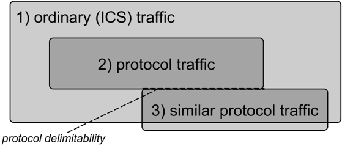

Bộ phân tích có thể được đánh giá theo bốn kịch bản trong số ba loại lưu lượng được hiển thị trong Hình 6.2. Nên sử dụng lưu lượng truy cập mạng đầu tiên thường xảy ra trong môi trường được đánh giá (1). Đây là kịch bản cơ bản để đánh giá bộ phân tích trong sử dụng bình thường. Kịch bản thứ hai sẽ đánh giá cách thức hoạt động của bộ phân tích nếu tất cả các gói phải được phân tích cú pháp (2). So với kịch bản đầu tiên, điều này có thể được coi là một bài kiểm tra căng thẳng hơn. Trong kịch bản thứ ba, nó được đánh giá xem có hao phí khi không sử dụng bộ phân tích hay không (1 w/o 2). Kịch bản thứ tư là trường hợp đặc biệt tùy chọn trong đó lưu lượng truy cập trên cùng một cổng giống với giao thức nhất, thường được phân tích cú pháp bởi bộ phân tích, được sử dụng. Trong trường hợp này, nó được đánh giá cách hoạt động phát hiện giao thức động.

7 Công cụ linux Cset Shield https://manpages ubuntu com/manpages/trusty/man1/cset-shield 1 html - Truy cập: ngày 23 tháng 6 năm 2021

##7. Thảo luận

Trong phần này, kết quả đánh giá, thực hiện và quá trình phát triển sẽ được thảo luận. Nó được nghiên cứu trong những điều kiện nào các quy tắc dựa trên các từ khóa dành riêng cho giao thức, sử dụng bộ phân tích giao thức tương ứng, có thể được ưu tiên hơn các quy tắc dựa trên các mẫu byte cấp TCP. Điều này được điều tra xem xét tính bảo mật, khả năng sử dụng và hiệu suất. Ý nghĩa của kết quả đánh giá hiệu suất xử lý đối với hiệu suất chung sẽ được thảo luận. Sau đó, các khía cạnh về khả năng sử dụng của cả hai phương pháp tiếp cận sẽ được đánh giá và điều này cùng với hiệu suất có ý nghĩa gì đối với bảo mật IDS. Cuối cùng, những hạn chế và công việc trong tương lai sẽ được xem xét.

## 7.1. Đánh giá hiệu suất

Hiệu suất của NIDS có thể được đo bằng tốc độ phát hiện tấn công và tốc độ cảnh báo sai trong khi tốc độ phát hiện tấn công bị ảnh hưởng bởi 'khả năng hệ thống xử lý luồng đầu vào mà không bị mất gói' [2]. Độ chính xác phát hiện có nghĩa là độ chính xác mà quy tắc có thể phát hiện các cuộc tấn công mà không tính đến việc mất gói được đề cập ở trên. Tuy nhiên, tỷ lệ phát hiện và tỷ lệ dương tính giả phụ thuộc rất nhiều vào sự tương tác giữa bộ quy tắc và các cuộc tấn công trong tập dữ liệu được sử dụng. Để chứng minh hiệu suất tốt hơn một cách độc lập nhất có thể với bộ quy tắc và các cuộc tấn công, bộ phân tích dành riêng cho giao thức ICS đã được triển khai với cùng một phạm vi chức năng mà nó phát hiện chính xác bằng cách sử dụng các quy tắc dựa trên từ khóa dành riêng cho giao thức ICS như các quy tắc dựa trên mẫu byte cấp TCP.

Do đó, có cùng tỷ lệ phát hiện tấn công và tỷ lệ cảnh báo sai cho cả hai phương pháp mà không xem xét khả năng hệ thống xử lý luồng đầu vào mà không bị mất gói. Tuy nhiên, điều này chỉ đạt được khi IDS đọc các gói từ tập dữ liệu nhanh nhất có thể để xử lý chúng. Bằng cách này, hiệu suất xử lý có thể được đo bằng cách sử dụng thước đo thời gian chạy về thời gian cần thiết để xử lý tất cả các gói. Tuy nhiên, trên hệ thống đã triển khai, các gói được nhận qua card mạng với tốc độ dữ liệu thực sự xảy ra. Nếu hiệu suất xử lý quá thấp để xử lý các gói xuất hiện đủ nhanh trên các gói tài nguyên phần cứng đã sử dụng sẽ bị loại bỏ. Điều này chắc chắn có thể làm giảm tỷ lệ phát hiện và tăng khả năng bỏ sót một cuộc tấn công thường được các quy tắc phát hiện. Do đó, hiệu suất xử lý sử dụng thời gian chạy là thước đo tốt để so sánh các phương pháp phát hiện cả hai sự cố giống nhau. Điều này có nghĩa là nếu các quy tắc dựa trên các từ khóa dành riêng cho giao thức ICS đạt được hiệu suất xử lý tốt hơn như các quy tắc dựa trên mẫu byte cấp TCP trong khi phát hiện các trường hợp tương tự thì nó sẽ đạt được hiệu suất tốt hơn so với số lượng tài nguyên được sử dụng trong các điều kiện đã nêu.

## 7.1.1. Xử lý-Hiệu suất

Người ta đã chứng minh rằng các quy tắc dựa trên các từ khóa dành riêng cho giao thức có thể nhanh hơn các quy tắc dựa trên các mẫu byte cấp TCP. Điều này đã được hiển thị bằng cách sử dụng trình phân tích giao thức SSH. Tuy nhiên, đối với bộ phân tích S7Comm, điều này chỉ được hiển thị trong các điều kiện có lưu lượng giao thức tương tự và đối với trường hợp bộ phân tích hoạt động cho cả hai trường hợp. Là yếu tố quyết định, có hai điều cần được xem xét. Đầu tiên là độ phức tạp của giao thức S7Comm và thứ hai là phạm vi chức năng mà bộ phân tích giao thức cụ thể cung cấp. Bộ phân tích S7Comm thay vì bộ phân tích SSH cung cấp nhiều từ khóa hơn cho các quy tắc và phân tích các gói sâu hơn. Trình phân tích SSH chỉ phân tích siêu thông tin trong khi trình phân tích S7Comm phân tích giao thức hoàn toàn theo cách tĩnh. Người ta cũng chứng minh rằng việc phân tích cú pháp danh sách động thậm chí còn làm giảm hiệu suất xử lý hơn nữa. Việc sử dụng phân tích trạng thái đã cải thiện một chút hiệu suất xử lý, điều này được giải thích là do cần ít giao dịch hơn. Tuy nhiên, như đã thảo luận trong phần đánh giá, điều này sẽ không xảy ra nếu trạng thái được triển khai rộng rãi hơn. Người ta cũng chứng minh rằng chi phí phát hiện đối với các quy tắc dựa trên từ khóa dành riêng cho giao thức sẽ nhanh hơn so với các quy tắc dựa trên mẫu byte cấp TCP. Tuy nhiên, do bộ phân tích theo giao thức cụ thể phải phân tích các gói trước tiên nên bộ phân tích S7Comm mở rộng hơn sẽ chậm hơn. Người ta cũng chứng minh rằng phân tích cú pháp động thậm chí còn làm giảm hiệu suất xử lý hơn nữa. Điều này chỉ ra rằng phạm vi chức năng và khả năng phân tích cú pháp mở rộng là yếu tố quyết định hiệu suất xử lý.

## 7.1.2. Độ chính xác phát hiện

Từ quan điểm độ chính xác của phát hiện, phạm vi chức năng lớn hơn có thể giúp các quy tắc cải thiện độ chính xác của phát hiện. Phân tích cú pháp động cũng cho phép khớp với các giá trị trong danh sách động của giao thức. Điều này là không thể bởi các quy tắc dựa trên mẫu byte như đã thảo luận ở trên (Phần 6.2.1.1). Trong danh sách động của giao thức S7Comm được sử dụng để đọc và ghi nhiều giá trị vào PLC. Nếu không có phân tích cú pháp động, sẽ không thể khớp với các thuộc tính của các mục trong danh sách (như mã trả về). Nhiều yêu cầu ghi không thành công có thể chỉ ra một cuộc tấn công có thể được phát hiện bằng cách sử dụng các quy tắc dựa trên từ khóa mã trả về của danh sách. Trong quá trình khai thác dữ liệu s7 được sử dụng để đánh giá S7Comm, hơn 60% gói được yêu cầu đọc và ghi.

Phân tích cú pháp trạng thái cho phép giữ một số thuộc tính về kết nối theo thời gian. Để đánh giá, yêu cầu đã được lưu trữ cho đến khi nhận được phản hồi. Như đã thảo luận trong Phần 6.2.1.2, điều này cho phép truy vấn bao quát theo các quy tắc có thể ví dụ: kiểm tra xem một yêu cầu cụ thể có khớp với phản hồi hay không hoặc liệu phản hồi có được nhận trước yêu cầu liên quan hay không. Điều này có thể chỉ ra các gói được tiêm vào và do đó có hành vi nguy hiểm. Ngoài ra, trạng thái kết nối có thể được lưu giữ để kiểm tra xem ai đó đã xác thực trước khi bắt đầu một hoạt động quan trọng hay chưa. Đây có thể là ví dụ. để thử tải tệp lên khi chưa đăng nhập. Như đã đề cập ở trên, kết quả cho thấy rằng phân tích cú pháp có trạng thái nhanh hơn không có trạng thái. Tuy nhiên, trong các nghiên cứu trước trong quá trình phát triển, người ta đã chứng minh rằng đối với việc kết hợp yêu cầu với phản hồi phức tạp hơn, điều này cũng có xu hướng làm chậm tốc độ xử lý. Đối với các quy tắc dựa trên mẫu byte, điều này không thể thực hiện được hoặc không cần phải thực hiện thêm.

Bộ phân tích dành riêng cho giao thức cho phép diễn giải các trường giao thức dưới dạng số và do đó cho phép so sánh mạnh mẽ hơn. Như đã đề cập chi tiết hơn trong Phần 6.2.1.3, điều này có thể được khai thác để kiểm tra xem giá trị của trường giao thức có lớn hơn, nhỏ hơn một giá trị hoặc trong một phạm vi được chỉ định hay không. Do đó, các quy tắc có thể được viết để kiểm tra, ví dụ: nếu một vùng địa chỉ cụ thể được truy cập vào một địa chỉ quan trọng cụ thể có thể chỉ ra một cuộc tấn công. trình phân tích cũng có thể cung cấp các từ khóa không đề cập đến các trường giao thức rõ ràng mà đề cập đến các thuộc tính giao thức ngầm định như ví dụ: độ dài của một danh sách hoặc một giá trị bằng văn bản, làm cho các quy tắc trở nên mạnh mẽ hơn.

## 7.1.3. Đặc điểm của lớp ứng dụng

Có hai hạn chế ảnh hưởng đến dữ liệu được trình phân tích xử lý. Đầu tiên, khi bộ phân tích hoạt động trên luồng TCP thay vì trên các khung TCP, thiết lập kết nối phải được nắm bắt. Để đánh giá, quá trình bắt tay TCP đã được thêm vào một cách tổng hợp cho mỗi luồng TCP mà nó không được ghi lại. Đối với môi trường sản xuất, điều này có nghĩa là bộ phân tích không thể xử lý kết nối TCP hiện có. Do đó, tất cả các kết nối TCP phải được khởi động lại hoặc môi trường chỉ được bảo vệ khi các kết nối TCP được tự khởi động lại, việc này có thể mất hàng tuần hoặc thậm chí hàng tháng trong ICS. Thứ hai, cũng một luồng TCP (0,017% lượng khai thác dữ liệu s7) đã bị xóa do thiếu gói và trình phân tích đã triển khai không được phát triển để chấp nhận các khoảng trống trong dữ liệu TCP. Tuy nhiên, giao thức S7Comm có thể hỗ trợ điều này nhưng nó đã không được thực hiện do hạn chế về thời gian. Cả hai hạn chế này đều không áp dụng cho các quy tắc dựa trên mẫu byte cấp TCP cho tất cả các tập dữ liệu được sử dụng.

Mặt khác, về mặt lý thuyết, IDS có thể được triển khai theo cách đó, trong trường hợp thiếu dữ liệu hoặc mất liên kết, dữ liệu sẽ được cung cấp theo bất kỳ cách nào cho bộ phân tích theo giao thức cụ thể. Bộ phân tích có thể được triển khai ít nhất là mạnh mẽ như các mẫu byte ở cấp độ TCP. Trong những điều kiện này, ví dụ: đối với một cuộc tấn công lẩn tránh, một bộ phân tích mạnh mẽ dành riêng cho giao thức được sử dụng bởi các quy tắc dựa trên các từ khóa dành riêng cho giao thức ít nhất cũng có khả năng phát hiện tấn công tốt như các quy tắc dựa trên các mẫu byte cấp TCP. Tuy nhiên, cần xem xét trong thực tế rằng trường hợp này không thường xảy ra và nó phải được xem xét khi thực hiện và triển khai một bộ phân tích.

Ngoài ra, như được thảo luận chi tiết hơn trong Phần 6.2.1.5, phải xem xét rằng làm việc trên các khung TCP với các mẫu byte thay vì luồng TCP có nghĩa là dữ liệu của giao thức cụ thể chỉ có thể khớp thành công khi ở đó dữ liệu có độ lệch tĩnh trong khung TCP. Điều này thường có thể xảy ra đối với hầu hết các giao thức lớp ứng dụng; tuy nhiên, nếu dữ liệu giao thức mở rộng trên nhiều khung hoặc dữ liệu được đệm động trên lớp ứng dụng thì các quy tắc cấp TCP dựa trên mẫu byte sẽ không khớp thành công. Như đã thảo luận, phần đệm hoặc phần bù đã thay đổi cũng có thể là một phần của cuộc tấn công né tránh.

## 7.1.4. Ý nghĩa đối với hiệu suất

Khi xem xét các khả năng cho phép phát hiện chính xác hơn một mặt và mặt khác là hiệu suất xử lý, có thể tóm tắt rằng rõ ràng có sự đánh đổi. Giao thức được phân tích cú pháp mở rộng hơn cung cấp nhiều từ khóa dành riêng cho giao thức hơn cũng như chức năng bổ sung như phân tích cú pháp động làm giảm

tốc độ xử lý nhưng cung cấp khả năng phát hiện chính xác hơn. So sánh các quy tắc dựa trên các từ khóa dành riêng cho giao thức với các quy tắc dựa trên mẫu byte cấp TCP có thể cải thiện hiệu suất xử lý lên tới 23% đối với trình phân tích SSH ít mở rộng hơn nhưng cũng giảm tới 51% đối với trình phân tích S7Comm mở rộng hơn. (Xem Bảng 5.15 và 5.6) Điều này có nghĩa là trong trường hợp bộ phân tích S7Comm, có thể giả định rằng cần thêm tới 51% tài nguyên CPU để ngăn chặn tình trạng rớt gói đối với tốc độ gói nhất định. Tuy nhiên, việc sử dụng chức năng bổ sung như mô tả ở trên có thể cần nhiều tài nguyên CPU hơn, nhưng đồng thời cho phép phát hiện cuộc tấn công rộng hơn bằng cách làm cho các quy tắc trở nên mạnh mẽ hơn. Nhìn chung, không thể quyết định phương pháp nào thực hiện tốt hơn vì điều này phụ thuộc vào giao thức, các loại tấn công dự kiến ​​và tài nguyên sẵn có. Tuy nhiên, kết quả xác nhận giả định rằng các quy tắc dựa trên các từ khóa dành riêng cho giao thức sẽ nhanh hơn trong việc khớp quy tắc nhưng mẫu byte cấp TCP không cần phải được phân tích cú pháp trước đó. Do đó, người ta giả định rằng đối với một số lượng lớn các quy tắc có khả năng phân tích cú pháp ít rộng hơn, các quy tắc dựa trên các từ khóa dành riêng cho giao thức sẽ hoạt động tốt hơn. Có thể lưu ý thêm rằng việc phân tích các quy tắc dựa trên các từ khóa dành riêng cho giao thức có thể được triển khai theo cách mà nó phát hiện được ít nhất các trường hợp tương tự. Cách khác xung quanh điều này không áp dụng. Đây là trường hợp do bộ phân tích dành riêng cho giao thức cung cấp tải trọng TCP nhận được dưới dạng từ khóa nhưng các quy tắc dựa trên mẫu byte cấp TCP có thể ví dụ: không phù hợp với các bộ phận động hoặc dễ bị tấn công né tránh hơn.

## 7.2. Khả năng sử dụng

Như đã được trích dẫn trong phần quá trình phát triển, ISO/IEC [18] định nghĩa khả năng sử dụng là 'mức độ mà một sản phẩm hoặc hệ thống có thể được người dùng cụ thể sử dụng để đạt được các mục tiêu cụ thể với hiệu lực, hiệu suất và sự hài lòng trong bối cảnh sử dụng cụ thể'. Trong bối cảnh này, khả năng học hỏi và bảo vệ lỗi người dùng cũng được đề cập.

Về khả năng sử dụng, việc viết quy tắc và đọc quy tắc sẽ được thảo luận. Việc đọc các quy tắc có thể cần thiết đặc biệt là để bảo trì. Sự khác biệt giữa các quy tắc dựa trên từ khóa dành riêng cho giao thức ICS và quy tắc dựa trên mẫu byte cấp TCP là các từ khóa dành riêng cho giao thức ICS rõ ràng là từ khóa được sử dụng. Các quy tắc dựa trên các từ khóa dành riêng cho giao thức thường bao gồm các cặp từ khóa-giá trị có ý nghĩa dựa trên các thuộc tính giao thức ICS. Thông thường đối với từ khóa và giá trị, tài liệu cũng được cung cấp. Tuy nhiên, đối với các giá trị byte và độ lệch phụ thuộc vào giao thức của bộ phân tích cấp độ TCP được sử dụng làm mẫu byte. Các giá trị byte thường được chỉ định bằng nhiều số thập lục phân.

Khi xem xét khả năng học được, có thể lập luận rằng nhiều số thập lục phân khó nhớ hơn các từ khóa và giá trị có ý nghĩa dựa trên giao thức. Người ta nghi ngờ liệu có cần thiết phải tìm hiểu các giá trị hay không.

Tuy nhiên, hiệu quả của các quy tắc viết và đọc có thể được cải thiện khi hiệu ứng học tập xảy ra. Hơn nữa, có thể lập luận rằng việc sử dụng tài liệu đã chứa tất cả các từ khóa và giá trị sẽ nhanh hơn so với việc đọc các giá trị byte ngoài thông số kỹ thuật. Cũng phải xem xét rằng không có đặc điểm kỹ thuật nào cho các giao thức độc quyền. Vì có thể không biết được một số giá trị byte nên tính hiệu quả cũng có thể bị hạn chế đối với các quy tắc dựa trên mẫu byte cấp TCP. Tuy nhiên sự hiểu biết của

thay vào đó, giao thức và các giá trị byte cần thiết khi viết các quy tắc dựa trên các mẫu byte cấp TCP là cần thiết để phát triển bộ phân tích trong trường hợp sử dụng các quy tắc dựa trên các từ khóa dành riêng cho giao thức ICS. Vì vậy, có thể lập luận rằng chỉ có sự sắp xếp lại nỗ lực diễn ra. Tuy nhiên, cần lưu ý rằng việc mổ xẻ chỉ được thực hiện một lần.

Sự hài lòng có thể phụ thuộc vào khả năng học hỏi, hiệu quả và hiệu quả.

Mặt khác, việc bảo vệ lỗi người dùng có thể là điều quan trọng nhất khi viết quy tắc cho IDS vì nó có thể ảnh hưởng trực tiếp đến tính bảo mật. Chắc chắn có thể mắc lỗi như lỗi chính tả khi viết giá trị byte. Điều này cũng có thể thực hiện được khi viết các từ khóa và giá trị dành riêng cho giao thức. Tuy nhiên, vì các giá trị cho các từ khóa dành riêng cho giao thức đã được xác định nên chúng thường được kiểm tra lỗi chính tả khi khởi động IDS. Đối với các giá trị dành riêng cho giao thức, điều này cũng có thể thực hiện được. Đối với các giá trị không được xác định trước như số địa chỉ, điều này cũng không thể kiểm tra được.

Tóm lại, trình phân tích theo giao thức cụ thể có thể bảo vệ người dùng khỏi mắc lỗi bằng cách xuất hiện thông báo cảnh báo khi khởi động IDS. Ngoài ra, khi xem xét tính hiệu quả, hiệu quả và khả năng học hỏi, các quy tắc dựa trên các từ khóa dành riêng cho giao thức sẽ dễ sử dụng hơn. Tuy nhiên, khi coi tính linh hoạt là một yếu tố cho khả năng sử dụng, có thể lập luận rằng các quy tắc dựa trên mẫu byte cấp TCP cho phép bất kỳ quy tắc nào được viết cho bất kỳ trường nào của giao thức trong khi trình phân tích phải phân tích cú pháp và hiển thị trường giao thức trước tiên. Do đó, nếu cần có một thuộc tính giao thức chưa được triển khai thì toàn bộ bộ phân tích phải được duy trì. Đối với các quy tắc dựa trên mẫu byte cấp TCP, chỉ cần thay đổi tệp quy tắc là đủ. Để thực hiện điều này hơn nữa nếu không có bộ phân tích dành riêng cho giao thức thì nó phải được triển khai trước tiên.

## 7.3. Ý nghĩa đối với an ninh

Như đã nêu ở phần đầu của luận án này, bảo mật có thể được chia thành bảo mật có thể đạt được bằng cách sử dụng IDS và bảo mật liên quan đến chính hệ thống.

Như đã thảo luận trong phần triển khai và quy trình phát triển, tính bảo mật của hệ thống có thể được giải quyết bằng cách sử dụng các ngôn ngữ an toàn cho bộ nhớ, bằng cách sử dụng lại các trình phân tích cú pháp và sử dụng các bộ kết hợp trình phân tích cú pháp cũng như bằng cách kiểm tra, đặc biệt là sử dụng các công cụ làm mờ và khử trùng bộ nhớ. Tuy nhiên, điều này đồng thời cho thấy lợi thế của các mẫu byte TCPlevel dựa trên quy tắc là không có rủi ro bảo mật phát sinh khi sử dụng. Đối với các quy tắc dựa trên các từ khóa dành riêng cho giao thức ICS, cần có một bộ phân tích tương ứng để mở rộng IDS bằng một rủi ro bổ sung tiềm ẩn. Nguy cơ xảy ra lỗ hổng bảo mật cũng có thể tăng lên khi sử dụng nhiều chức năng hơn như phân tích cú pháp động. Do đó, tính bảo mật của IDS chắc chắn sẽ được giữ nguyên hoặc bị giảm đi.

Như đã thảo luận, có một sự chuyển đổi suôn sẻ từ bảo mật IDS sang bảo mật đạt được bằng cách sử dụng IDS vì việc phân tích cú pháp không hiệu quả hoặc sai lầm không chỉ có thể làm giảm khả năng phát hiện tấn công của giao thức ICS mà còn ảnh hưởng đến tính khả dụng của hệ thống IDS. Tính bảo mật mà NIDS có thể đạt được phụ thuộc vào các cuộc tấn công có thể được phát hiện. Các cuộc tấn công có thể được phát hiện được đo bằng hiệu suất và phụ thuộc vào việc điều chỉnh các quy tắc đối với các cuộc tấn công cũng như đủ tài nguyên sẵn có để xử lý các gói. Việc điều chỉnh các quy tắc cho các cuộc tấn công phụ thuộc vào khả năng xảy ra lỗi và sức mạnh của từ khóa. Các nguồn lực cần thiết để có đủ nguồn lực sẵn có

Hình 7.1.: Biểu đồ phụ thuộc cho bảo mật NIDS

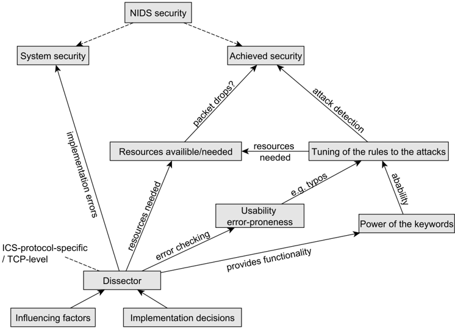

phụ thuộc vào người mổ xẻ cũng như mức độ mở rộng của các quy tắc. Điều này đã được đánh giá và thảo luận trong phần hiệu suất. Sức mạnh của từ khóa đã được thảo luận trong quá trình phát triển (Phần 6.2.1.3). Khả năng xảy ra lỗi đã được thảo luận như một phần của đánh giá khả năng sử dụng.

Tóm lại, các quy tắc dựa trên các từ khóa dành riêng cho giao thức ICS cần một bộ phân tích tương ứng. Trình phân tích được kích hoạt sẽ làm tăng nguy cơ xảy ra các lỗ hổng có thể đe dọa đến tính bảo mật của hệ thống. Tuy nhiên, trình phân tích có thể cải thiện tính bảo mật đạt được bằng cách tăng khả năng của các quy tắc bằng các từ khóa mạnh hơn bằng cách giảm nguy cơ xảy ra lỗi trong quy tắc. Các tài nguyên mà trình phân tích cần cũng phụ thuộc vào phạm vi chức năng được yêu cầu.

##7.4. Ra quyết định

Để quyết định xem các quy tắc dựa trên các từ khóa dành riêng cho giao thức ICS có nên được ưu tiên hơn các quy tắc dựa trên mẫu byte cấp TCP hay không, nó có thể tiến hành như sau:

1. Phải quyết định xem cuộc tấn công nào có thể xảy ra và liệu nó có thể bị phát hiện bởi các mẫu byte cấp TCP hay không. Điều này đặc biệt quan tâm nếu có các thuộc tính giao thức có thể được phân tích cú pháp bằng các giá trị và giá trị tĩnh. Cũng cần chú ý đến các cuộc tấn công né tránh, đệm và bù đắp động được thảo luận trong Phần 7.1.3 và 6.2.1.5. Nếu cần có bộ phân tích thì nên ưu tiên các quy tắc dựa trên các từ khóa dành riêng cho giao thức ICS.

2. Xem xét giao thức và các thuộc tính liên quan đến bảo mật, cần quyết định xem chức năng mà bộ phân tích cung cấp có thể cải thiện khả năng phát hiện hay không. Vì vậy, các khía cạnh của Mục 7.1.2 và Mục 6.2.1 có thể được xem xét. Nếu ưu điểm của bộ phân tích giao thức cụ thể không thể cải thiện các quy tắc phát hiện xâm nhập dựa trên các mẫu byte cấp TCP thì nên ưu tiên.
3. Cần ước tính hiệu suất xử lý cho cả hai phương pháp trong trường hợp xấu nhất. Nếu đã có sẵn các mẫu byte cấp TCP thì những mẫu này có thể được đánh giá và sử dụng làm điểm bắt đầu để ước tính bộ phân tích theo giao thức cụ thể. Như đã kết luận trong Phần 7.1.4, có thể dự đoán rằng nếu giao thức phải được phân tích cú pháp theo cách rộng rãi để cung cấp các thuộc tính giao thức có liên quan và cũng cần có chức năng như phân tích cú pháp động thì các quy tắc dựa trên từ khóa dành riêng cho giao thức ICS sẽ kém hiệu quả hơn về tốc độ xử lý. Mặt khác, nếu nhiều trường giao thức phải được khớp nhưng để phân tích cú pháp giao thức thì có thể theo cách tĩnh (nhiều hơn) và ít sâu hơn thì các quy tắc dựa trên từ khóa dành riêng cho giao thức ICS sẽ có tốc độ xử lý hiệu quả hơn các quy tắc dựa trên mẫu byte cấp TCP. Trong công việc này, chi phí hoạt động của bộ phân tích dành riêng cho giao thức không quá 51%.
4. Bằng cách sử dụng ước tính, sau đó sẽ tính toán xem liệu đối với số lượng gói tối đa dự kiến ​​thì tài nguyên tối đa có thể được cung cấp có bị tắc nghẽn hay không. Trong trường hợp này, nên ưu tiên cách tiếp cận có hiệu suất xử lý ước tính chiều cao thấp hơn.
5. Nếu không có tắc nghẽn thì các khía cạnh khác như nỗ lực và chi phí để phát triển một bộ phân tích theo giao thức cụ thể cũng liên quan đến chất lượng mong đợi và mức độ bảo mật đạt được (được thảo luận trong Phần 6.1) phải được cân nhắc với sự cải thiện dự kiến ​​về độ chính xác phát hiện. Điều này cũng xem xét các khía cạnh linh hoạt trong Phần 6.1.3.

## 7.5. Hạn chế và công việc trong tương lai

Một chuỗi đối số đã được chọn để cho phép đánh giá các quy tắc dựa trên các từ khóa dành riêng cho giao thức so với các quy tắc dựa trên mẫu byte cấp TCP về hiệu suất mà không cần đo lường tỷ lệ phát hiện tấn công và kết quả dương tính giả bằng cách đảm bảo rằng cả hai phương pháp đều được phát hiện giống nhau. Điều này cũng được chứng minh bởi thực tế là các quy tắc có ảnh hưởng mạnh mẽ đến tỷ lệ phát hiện cuộc tấn công và các kết quả dương tính giả, đây không phải là một phần của công việc điều tra. Tuy nhiên, người ta chưa điều tra xem liệu trình mổ xẻ có thể đạt được hiệu suất tốt hơn với phạm vi mở rộng của các chức năng và quy tắc khai thác điều này hay không. Điều này có thể được thực hiện bằng cách sử dụng ví dụ: các quy tắc viết và phân tích cú pháp động khai thác việc sử dụng các vùng địa chỉ của các mục danh sách. Ngoài ra, ví dụ: các quy tắc có thể được viết dựa trên trình phân tích cú pháp có trạng thái để phát hiện thứ tự yêu cầu và phản hồi sai. Đối với công việc trong tương lai, cũng có thể thú vị khi điều tra khả năng sử dụng từ khóa bằng cách không hiển thị trường giao thức mà bằng cách cung cấp các thuộc tính giao thức bao gồm sự tương tác liên quan đến bảo mật của nhiều trường giao thức. Ví dụ. một từ khóa cho phép chỉ định một ngưỡng về mức độ quan trọng của một yêu cầu. Bằng cách này, cần ít kết quả khớp quy tắc hơn và hiệu suất có thể được cải thiện. Người ta cũng chưa điều tra chính xác điều gì xảy ra phụ thuộc vào

bộ phân tích khi vượt quá tốc độ xử lý, xét đến mức sử dụng bộ nhớ và CPU, đối với đánh giá này, bộ nhớ gần như không đổi và không bao giờ là nút cổ chai.

Do giới hạn về thời gian nên chỉ có hai bộ phân tích theo giao thức cụ thể được đánh giá. Các thử nghiệm được sử dụng ở đây nên được nhân rộng cho các giao thức khác với phạm vi chức năng khác nhau. Các yếu tố ảnh hưởng khác như số lượng quy tắc hoặc ghi nhật ký cũng có thể được điều tra trong tương lai.

Error 504 (Server Error)!!1504.That’s an error.There was an error. Please try again later.That’s all we know.

Quá trình phát triển được xây dựng dựa trên tài liệu, nguồn trực tuyến và cả kiến ​​thức nhận được từ việc triển khai bộ phân tích S7Comm ở Suricata, do đó có thể bị sai lệch và bị hạn chế một phần bởi các bộ phân tích dựa trên TCP. Vì vậy quá trình phát triển có thể được xem xét và mở rộng trong tương lai. Có nhiều trình phân tích cú pháp cần được phát triển dựa trên số lượng hệ thống giám sát an ninh mạng và số lượng giao thức hiện có. Vì vậy, công việc cần được thực hiện là phát triển các phương pháp cải thiện khả năng sử dụng lại của các trình phân tích cú pháp hiện có. Bằng cách này, chi phí có thể được tiết kiệm, tính bảo mật có thể được cải thiện và do đó có thể có nhiều trình phân tích cú pháp hơn cho các hệ thống giám sát an ninh mạng được sử dụng. (Xem thêm Sommer, Amann và Hall [32])

##8. Kết luận

NIDS dựa trên chữ ký là cần thiết để phát hiện các cuộc tấn công mạng vào ICS ở trạng thái ban đầu mà không can thiệp vào các hệ thống thời gian thực được sử dụng ở đó. Công việc này điều tra các loại quy tắc được sử dụng và đánh giá chúng về tính bảo mật, khả năng sử dụng và đặc biệt là hiệu suất. Điều này được thực hiện bằng cách đánh giá các quy tắc dựa trên mẫu byte cấp TCP so với các quy tắc dựa trên các từ khóa dành riêng cho giao thức cho giao thức Siemens S7Comm trong các tình huống khác nhau. Trong phần cơ bản về ICS, giao thức S7Comm và Suricata IDS cũng được giới thiệu và các khía cạnh bảo mật liên quan được chỉ ra. Trong phần phương pháp luận, cách tiếp cận cuộc điều tra được trình bày và trong phần đánh giá, các kết quả liên quan được trình bày. Để đánh giá các quy tắc dựa trên các từ khóa dành riêng cho giao thức, bộ phân tích S7Comm đã được phát triển như được thảo luận trong chương 4. Công việc này cũng đóng góp một quy trình phát triển chung cho việc phát triển bộ phân tích trong chương 6. Trong phần thảo luận, kết quả đánh giá được kết hợp trong các khía cạnh đã đề cập về bảo mật, khả năng sử dụng và hiệu suất.

Error 504 (Server Error)!!1504.That’s an error.There was an error. Please try again later.That’s all we know.

Như được minh họa trong Hình 8.1, các quy tắc dựa trên các mẫu byte cấp TCP nên được ưu tiên nếu không có sự cải thiện về độ chính xác phát hiện dự kiến ​​khi sử dụng các quy tắc dựa trên các từ khóa dành riêng cho giao thức và nói chung không có nhiều quy tắc được sử dụng. Dự kiến ​​sẽ không có sự cải thiện nào về độ chính xác của việc phát hiện nếu các mẫu byte cấp TCP tĩnh có thể khớp với tất cả các trường giao thức mà không bị giới hạn và không có trường động nào của giao thức phải được truy cập. Vì bộ phân tích dành riêng cho giao thức nhanh hơn trong việc khớp quy tắc nhưng trước tiên phải phân tích gói dữ liệu nên nó có lợi thế lớn hơn so với các mẫu byte nếu có nhiều quy tắc khớp với một gói dữ liệu. Tuy nhiên, cần phải có bộ phân tích dành riêng cho giao thức nếu có các trường động được sử dụng trong giao thức phải được phân tích cú pháp để phát hiện sự xâm nhập. Điều này cũng áp dụng nếu giao thức được xây dựng hoàn toàn động (ví dụ: XML).

Nếu không có quyết định nào cho đến thời điểm này thì phải cân nhắc xem xét các khía cạnh khác về khả năng sử dụng (dễ xảy ra lỗi, tính linh hoạt), bảo mật (rủi ro do lỗi triển khai khi sử dụng bộ phân tích và đạt được bảo mật nhờ chức năng bổ sung sử dụng nó) và đặc biệt là hiệu suất. Đối với hiệu suất, cần đặc biệt xem xét hiệu suất xử lý liên quan đến tài nguyên phần cứng sẵn có cũng như khả năng phân tích cú pháp động, trạng thái và sức mạnh tăng lên của từ khóa khi sử dụng trình phân tích giao thức. Người ta nhận thấy rằng phạm vi chức năng và mức độ mở rộng của bộ phân tích có thể là yếu tố quan trọng làm giảm hiệu suất xử lý. Dường như có sự đánh đổi giữa hiệu suất xử lý và độ chính xác phát hiện có thể có. Tuy nhiên, kể từ khi

việc phát hiện các quy tắc khớp dựa trên các mẫu byte cấp TCP thường chậm hơn so với các quy tắc khớp dựa trên các từ khóa dành riêng cho giao thức, có thể đạt được hiệu suất xử lý tốt hơn bằng cách sử dụng bộ phân tích giao thức, mặc dù trước tiên nó phải phân tích các gói giao thức.

Hình 8.1.: Các khía cạnh đánh giá quy trình phù hợp

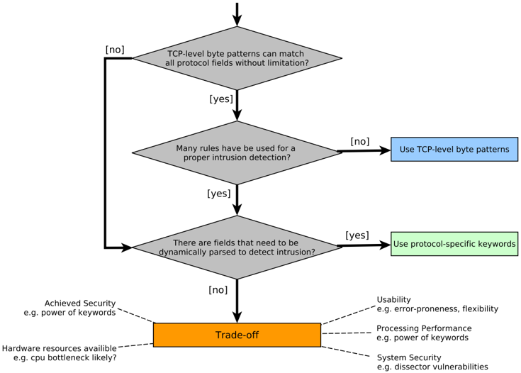

Tóm lại, công việc này cung cấp các phương pháp để quyết định xem các từ khóa dành riêng cho giao thức, sử dụng bộ phân tích tương ứng có nên được ưu tiên hơn các quy tắc dựa trên mẫu byte cấp TCP cho các điều kiện nhất định hay không. Do đó, nó thảo luận về việc sử dụng các bộ phân tích dành riêng cho giao thức từ các khía cạnh bảo mật, khả năng sử dụng và hiệu suất. Các quyết định thực hiện và các yếu tố ảnh hưởng đến việc phát triển bộ phân tích cũng được nghiên cứu và thảo luận. Trong công việc này cũng trình bày một quá trình phát triển cho sự phát triển của người mổ xẻ.

